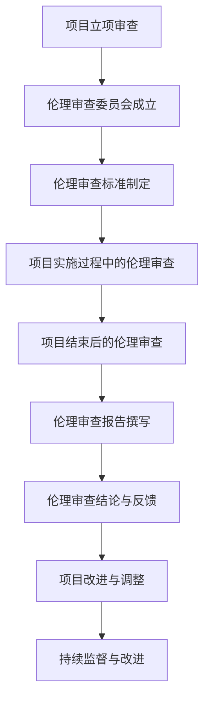
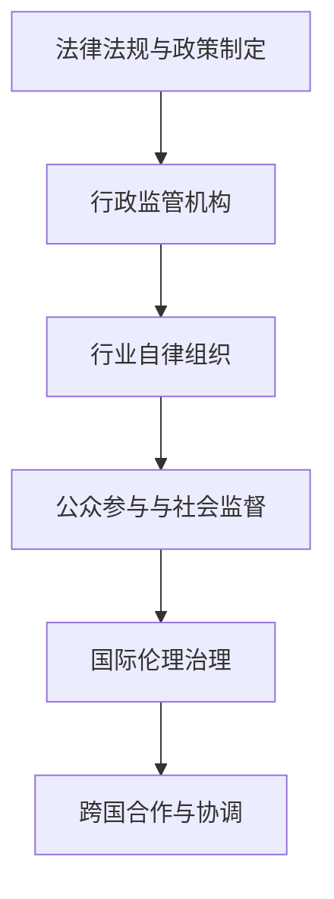

                 

### 文章标题

### 关键词

- 人工智能时代
- 人文关怀
- 技术进步
- 伦理守护

### 摘要

本文深入探讨了人工智能时代的人文关怀问题。随着人工智能技术的快速发展，人类社会面临着前所未有的伦理困境。本文首先阐述了人工智能技术的背景及其在现代社会中的重要地位，然后指出了技术进步中的伦理困境，强调了人文关怀在伦理守护中的必要性。通过分析伦理守护的理论框架和实践方法，本文探讨了人工智能时代的人文关怀如何在技术创新中得以实现，并提出了具体的实践策略。同时，本文还展望了人工智能时代的伦理前景，呼吁社会各界共同努力，构建一个和谐科技社会。

## 第一部分：背景与核心概念

### 1.1 问题的提出与背景

#### 1.1.1 人工智能技术的快速发展

人工智能（Artificial Intelligence，简称AI）是计算机科学的一个分支，旨在使计算机模拟人类智能行为，并具备学习能力、推理能力和感知能力。自20世纪50年代人工智能概念提出以来，AI技术经历了多次技术革命和理论突破，逐渐从实验室走向了实际应用。

近年来，得益于大数据、云计算和深度学习等技术的发展，人工智能在图像识别、自然语言处理、自动驾驶、智能医疗等领域取得了显著进展。人工智能技术的快速发展不仅改变了传统产业的运营模式，还对社会经济、文化教育等多个领域产生了深远影响。

#### 1.1.2 技术进步中的伦理困境

然而，人工智能技术的快速发展也带来了诸多伦理困境。首先，人工智能在数据收集、存储和处理过程中存在隐私泄露的风险。其次，人工智能算法可能存在偏见和歧视，影响社会的公平与正义。此外，随着人工智能的普及，大量传统职业面临被替代的风险，引发了就业压力和社会不稳定。这些问题引发了社会各界对于人工智能伦理问题的广泛关注和讨论。

#### 1.1.3 人文关怀的必要性

在人工智能技术不断发展的背景下，人文关怀成为伦理守护的核心。人文关怀强调以人为本，关注个体的尊严、权利和福祉，追求社会的和谐与进步。在人工智能时代，人文关怀有助于缓解技术进步带来的伦理困境，确保人工智能技术的发展符合人类社会的价值观和道德标准。

### 1.2 核心概念

#### 1.2.1 人工智能的定义与发展

人工智能是指通过计算机程序和算法模拟人类智能行为的技术。它包括机器学习、深度学习、自然语言处理、计算机视觉等多个子领域。人工智能的发展经历了多个阶段，从最初的符号主义人工智能到基于统计学的机器学习方法，再到当前以深度学习为核心的人工智能技术。

#### 1.2.2 人文关怀的概念与内涵

人文关怀是一种以人为本的价值观念，强调尊重个体的尊严、权利和福祉，关注社会的公平与正义。人文关怀的内涵包括道德伦理、社会责任、情感关怀等多个方面，旨在构建一个和谐、公正和可持续的社会。

#### 1.2.3 伦理守护的理论基础

伦理守护是指在人工智能技术发展中，通过制定伦理规范、加强伦理审查和监管，确保人工智能技术的应用符合道德伦理标准。伦理守护的理论基础包括伦理学的基本原则、伦理决策的理论模型以及伦理教育等方面。

### 1.3 边界与外延

#### 1.3.1 人工智能与人文关怀的交叉点

人工智能与人文关怀的交叉点主要体现在以下几个方面：一是人工智能技术应尊重和保护个体的隐私权；二是人工智能算法应避免偏见和歧视，确保公平与正义；三是人工智能技术的应用应关注社会的公共利益和可持续发展。

#### 1.3.2 伦理守护在人工智能时代的意义

伦理守护在人工智能时代的意义在于：一是确保人工智能技术的发展符合人类社会的价值观和道德标准；二是缓解技术进步带来的伦理困境，促进社会的和谐与进步；三是提高人工智能技术的可靠性和可信度，增强公众对人工智能的信任。

#### 1.3.3 人工智能伦理问题的实例分析

人工智能伦理问题的实例分析包括：一是智能医疗中的数据隐私问题，如患者病历数据的保护；二是自动驾驶汽车中的道德困境，如紧急情况下车辆如何做出决策；三是社交媒体平台中的算法歧视问题，如对特定群体的偏见和歧视。

### 1.4 本章小结

本章首先阐述了人工智能技术的快速发展及其在现代社会中的重要地位，然后指出了技术进步中的伦理困境，强调了人文关怀在伦理守护中的必要性。通过分析核心概念，本章明确了人工智能与人文关怀的交叉点，阐述了伦理守护在人工智能时代的意义，并进行了实例分析。

## 第二部分：伦理守护的理论与实践

### 2.1 伦理守护的理论框架

#### 2.1.1 伦理学的基本原则

伦理学的基本原则包括：权利与义务、公平与正义、尊重与责任。这些原则为伦理守护提供了理论基础，确保人工智能技术的发展和应用符合道德伦理标准。

1. 权利与义务
   - 权利：个体享有隐私权、知情权、选择权等基本权利。
   - 义务：开发者和应用者有责任保护用户的隐私权，尊重用户的选择权。

2. 公平与正义
   - 公平：人工智能技术应确保对不同群体的公平对待，避免歧视和偏见。
   - 正义：人工智能技术应促进社会的公平与正义，减少贫富差距和社会不公。

3. 尊重与责任
   - 尊重：人工智能技术应尊重个体的尊严和权利，避免滥用技术。
   - 责任：开发者和应用者应对人工智能技术的应用承担社会责任，确保其符合道德伦理标准。

#### 2.1.2 伦理守护的理论模型

伦理守护的理论模型包括：伦理审查、伦理监管、伦理决策支持系统等。这些模型为伦理守护提供了具体的实施方法和工具。

1. 伦理审查
   - 伦理审查是指对人工智能项目的道德伦理问题进行评估和审查，确保项目的实施符合道德伦理标准。
   - 伦理审查包括：隐私保护审查、公平性审查、社会责任审查等。

2. 伦理监管
   - 伦理监管是指通过法律法规、政策引导等手段，对人工智能技术的应用进行监管，确保其符合道德伦理标准。
   - 伦理监管包括：立法监管、行政监管、行业自律等。

3. 伦理决策支持系统
   - 伦理决策支持系统是指通过技术手段，为人工智能项目的伦理决策提供支持。
   - 伦理决策支持系统包括：算法透明性分析、数据隐私保护策略、社会影响评估等。

#### 2.1.3 伦理守护的关键要素

伦理守护的关键要素包括：数据隐私保护、算法透明性与可解释性、社会责任与企业伦理。

1. 数据隐私保护
   - 数据隐私保护是指确保人工智能项目在数据收集、存储和处理过程中，用户的隐私权得到保护。
   - 数据隐私保护包括：数据加密、匿名化处理、隐私影响评估等。

2. 算法透明性与可解释性
   - 算法透明性是指人工智能算法的设计、实现和应用过程应公开透明，便于监督和审查。
   - 算法可解释性是指人工智能算法的决策过程应具有可解释性，使人们能够理解和信任算法的决策结果。

3. 社会责任与企业伦理
   - 社会责任是指企业应承担的社会责任，包括保护用户隐私、促进社会公平、减少贫富差距等。
   - 企业伦理是指企业在经营活动中应遵循的道德规范，包括诚信经营、公平竞争、员工权益保护等。

### 2.2 伦理守护的具体实践

#### 2.2.1 伦理守护的策略与方法

伦理守护的策略与方法包括：设计伦理审查流程、强化法律法规与政策引导、增强公众参与与社会监督。

1. 设计伦理审查流程
   - 设计伦理审查流程是指建立一套完整的伦理审查制度，确保人工智能项目在启动、实施和结束后进行全面的伦理审查。
   - 伦理审查流程包括：项目立项审查、项目实施过程中的伦理审查、项目结束后的伦理审查等。

2. 强化法律法规与政策引导
   - 强化法律法规与政策引导是指通过制定法律法规和政策，规范人工智能技术的研发和应用，确保其符合道德伦理标准。
   - 法律法规和政策包括：数据保护法、算法透明性法规、人工智能伦理规范等。

3. 增强公众参与与社会监督
   - 增强公众参与与社会监督是指通过公众参与和社会监督，提高人工智能技术的透明度和可信度，确保其符合道德伦理标准。
   - 公众参与包括：公众咨询、公众听证、公众调查等。
   - 社会监督包括：媒体监督、第三方评估、公众监督等。

#### 2.2.2 伦理守护的案例分析

伦理守护的案例分析包括：智能医疗中的伦理守护、自动驾驶汽车中的伦理问题、社交媒体平台中的伦理监管等。

1. 智能医疗中的伦理守护
   - 智能医疗是指利用人工智能技术提高医疗诊断和治疗的效率和准确性。
   - 伦理守护包括：患者隐私保护、数据共享与隐私平衡、医疗决策的伦理审查等。

2. 自动驾驶汽车中的伦理问题
   - 自动驾驶汽车是指利用人工智能技术实现车辆自主驾驶。
   - 伦理问题包括：紧急情况下的决策伦理、道路交通事故责任划分、隐私保护等。

3. 社交媒体平台中的伦理监管
   - 社交媒体平台是指利用人工智能技术进行内容推荐和用户画像。
   - 伦理监管包括：算法歧视问题、用户隐私保护、内容审核等。

#### 2.2.3 伦理守护的挑战与应对

伦理守护在人工智能时代面临着诸多挑战，包括技术挑战、法律挑战和社会挑战。

1. 技术挑战
   - 技术挑战包括：算法透明性、数据隐私保护、算法偏见等。
   - 应对策略包括：提高算法透明性、加强数据隐私保护、消除算法偏见等。

2. 法律挑战
   - 法律挑战包括：法律法规滞后、监管难度大、跨国法律冲突等。
   - 应对策略包括：完善法律法规体系、加强国际合作与协调、提高监管能力等。

3. 社会挑战
   - 社会挑战包括：公众信任度低、社会道德观念变化、伦理教育与培训不足等。
   - 应对策略包括：提高公众对人工智能的信任度、加强伦理教育与培训、推动社会道德观念的进步等。

### 2.3 本章小结

本章首先阐述了伦理守护的理论框架，包括伦理学的基本原则、伦理守护的理论模型和关键要素。然后，本章探讨了伦理守护的具体实践策略，包括设计伦理审查流程、强化法律法规与政策引导、增强公众参与与社会监督。通过案例分析，本章展示了伦理守护在实际应用中的挑战与应对策略。

## 第三部分：人工智能时代的人文关怀

### 3.1 人工智能时代的人文精神

#### 3.1.1 人文关怀的价值观

人文关怀的价值观是以人为本，尊重个体的尊严、权利和福祉，追求社会的和谐与进步。在人工智能时代，人文关怀的价值观具有重要的指导意义，可以帮助我们应对技术进步带来的伦理困境。

1. 尊重个体的尊严
   - 尊重个体的尊严是指尊重个体的自由意志、隐私权和人格尊严，避免在人工智能技术的应用中侵犯个体的基本权利。

2. 保护个体的权利
   - 保护个体的权利是指确保个体在人工智能技术的影响下，享有平等的权利和机会，避免因为技术原因造成的社会不公和歧视。

3. 关注个体的福祉
   - 关注个体的福祉是指通过人工智能技术改善个体生活质量，提高个体的幸福感和满足感。

#### 3.1.2 人工智能与人文精神的融合

人工智能与人文精神的融合是人工智能时代的重要课题。人工智能技术的发展应该以人为本，服务于人类的福祉，同时尊重和保护个体的尊严和权利。

1. 以人为本的智能设计
   - 在人工智能系统的设计和开发过程中，应充分考虑人类的需求和偏好，确保系统能够为人类提供便捷、高效的服务。

2. 人文关怀的算法优化
   - 在人工智能算法的设计和优化过程中，应注重算法的公平性、透明性和可解释性，避免算法偏见和歧视。

3. 人文关怀的智能服务
   - 在人工智能应用场景中，应注重智能服务的温暖、关怀和人性化，使人工智能系统能够更好地满足人类的需求。

#### 3.1.3 促进人类福祉的目标

人工智能时代的人文关怀应该以促进人类福祉为目标，通过技术手段改善人类生活质量，提高人类幸福感和满足感。

1. 智能医疗与健康管理
   - 利用人工智能技术提供智能化的医疗诊断、治疗和健康管理服务，提高医疗服务的效率和质量，改善患者的体验。

2. 智能教育与终身学习
   - 利用人工智能技术提供个性化的教育服务，促进学习者的个性化发展和终身学习，提高教育质量。

3. 智能交通与智慧城市
   - 利用人工智能技术优化交通管理、提高交通效率，建设智慧城市，改善城市居民的生活质量。

### 3.2 人文关怀在实践中的应用

#### 3.2.1 教育领域的变革

教育领域是人工智能技术应用的重要领域，通过人工智能技术的融合，可以实现教育模式的创新和教学质量的提升。

1. 个性化教育
   - 利用人工智能技术为学生提供个性化的学习资源和学习计划，满足不同学生的个性化学习需求。

2. 智能评估与反馈
   - 利用人工智能技术进行学习成果的智能评估和反馈，帮助学生及时了解自己的学习进度和学习效果。

3. 教师专业发展
   - 利用人工智能技术为教师提供专业发展的支持，提高教师的教育教学能力。

#### 3.2.2 文化产业的创新

文化产业是人工智能技术应用的重要领域，通过人工智能技术的融合，可以实现文化产业的创新和升级。

1. 智能创作
   - 利用人工智能技术进行文学、音乐、绘画等艺术作品的创作，拓展文化创作的领域和方式。

2. 智能传播
   - 利用人工智能技术优化文化作品的传播路径和方式，提高文化作品的影响力和传播效率。

3. 智能体验
   - 利用人工智能技术为用户提供个性化的文化体验，增强用户的文化参与感和认同感。

#### 3.2.3 社会服务的优化

社会服务是人工智能技术应用的重要领域，通过人工智能技术的融合，可以优化社会服务的质量和效率。

1. 智能社会治理
   - 利用人工智能技术进行社会管理和治理，提高社会管理的智能化水平，增强社会管理的科学性和有效性。

2. 智能公共服务
   - 利用人工智能技术提供智能化的公共服务，提高公共服务的效率和质量，满足公众的多样化需求。

3. 智能健康管理
   - 利用人工智能技术提供智能化的健康管理服务，提高健康管理的效果和满意度。

### 3.3 人文关怀与科技创新的关系

#### 3.3.1 人文关怀如何指导科技创新

人文关怀是科技创新的重要指导原则，可以确保科技创新符合人类的道德伦理标准和价值观。

1. 以人为本的科技创新
   - 在科技创新过程中，应坚持以人为本的原则，关注人类的需求和福祉，确保科技创新服务于人类社会。

2. 伦理约束的科技创新
   - 在科技创新过程中，应遵守道德伦理规范，避免科技创新带来的负面影响，确保科技创新符合人类的道德伦理标准。

3. 社会价值的科技创新
   - 在科技创新过程中，应关注社会价值的实现，推动科技创新与社会发展的紧密结合，促进社会的和谐与进步。

#### 3.3.2 科技创新对人文关怀的影响

科技创新对人文关怀的影响体现在多个方面，可以为人文关怀提供新的工具和手段，也可以对人文关怀提出新的挑战。

1. 提升人文关怀的效率和质量
   - 科技创新可以提升人文关怀的效率和质量，通过智能化的技术手段，提高人文关怀的服务水平和效果。

2. 引发人文关怀的新议题
   - 科技创新可能会引发人文关怀的新议题，如人工智能伦理、数据隐私保护等，需要我们深入思考和探讨。

3. 促进人文关怀的创新发展
   - 科技创新可以促进人文关怀的创新发展，通过技术手段，拓展人文关怀的领域和方式，推动人文关怀的理论和实践发展。

### 3.4 本章小结

本章首先阐述了人工智能时代的人文精神，包括人文关怀的价值观、人工智能与人文精神的融合和促进人类福祉的目标。然后，本章探讨了人文关怀在实践中的应用，包括教育领域的变革、文化产业的创新和社会服务的优化。最后，本章分析了人文关怀与科技创新的关系，强调了人文关怀在科技创新中的指导作用，以及科技创新对人文关怀的影响。

## 第四部分：展望与未来

### 4.1 伦理挑战与未来趋势

#### 4.1.1 技术伦理的前景

随着人工智能技术的不断发展和应用，技术伦理问题将越来越受到关注。未来，技术伦理将呈现出以下几个趋势：

1. 伦理监管的加强
   - 各国政府和国际组织将加强对人工智能技术的伦理监管，制定更加严格的法律法规和政策，确保人工智能技术的应用符合道德伦理标准。

2. 伦理教育与培训的普及
   - 伦理教育和培训将成为人工智能技术发展和应用的重要组成部分，通过教育和培训，提高开发者和应用者的伦理素养和道德水平。

3. 伦理决策的支持系统
   - 伦理决策支持系统将成为技术伦理的重要工具，通过技术手段，为人工智能项目的伦理决策提供支持和指导。

#### 4.1.2 伦理监管的发展方向

未来，伦理监管将在以下几个方面发展：

1. 全球伦理治理的协调与合作
   - 国际社会将加强合作，共同制定全球伦理治理框架，推动各国在技术伦理问题上的协调与合作。

2. 法律法规的完善与更新
   - 各国政府和国际组织将不断完善和更新相关法律法规，确保人工智能技术的研发和应用有法可依，有规可循。

3. 公众参与与社会监督的加强
   - 公众参与和社会监督将成为伦理监管的重要手段，通过公众的广泛参与和监督，提高人工智能技术的透明度和可信度。

#### 4.1.3 全球伦理治理的未来

全球伦理治理的未来将呈现出以下几个特点：

1. 伦理治理的多层次结构
   - 全球伦理治理将形成多层次的结构，包括国际、国家和行业层面的伦理治理机制，形成全球范围内的伦理治理网络。

2. 伦理治理的协同合作
   - 各国政府和国际组织将加强协同合作，共同应对人工智能技术带来的伦理挑战，推动全球伦理治理的协同发展。

3. 伦理治理的动态调整
   - 随着人工智能技术的快速发展，全球伦理治理将不断进行调整和优化，以适应新的技术发展和应用场景。

### 4.2 人工智能时代的伦理责任

#### 4.2.1 企业社会责任

在人工智能时代，企业承担着重要的伦理责任。企业应采取以下措施，履行其社会责任：

1. 保护用户隐私
   - 企业应采取严格的隐私保护措施，确保用户的数据安全，避免隐私泄露和数据滥用。

2. 遵守法律法规
   - 企业应遵守相关法律法规，确保其人工智能技术的研发和应用符合道德伦理标准。

3. 加强伦理审查
   - 企业应建立完善的伦理审查机制，对人工智能项目进行全面的伦理评估和审查，确保项目的实施符合伦理要求。

#### 4.2.2 政府监管的角色

政府在人工智能时代的伦理责任体现在以下几个方面：

1. 制定法律法规
   - 政府应制定和完善相关法律法规，规范人工智能技术的发展和应用，确保其符合道德伦理标准。

2. 强化监管执行
   - 政府应加强对人工智能技术的监管执行，对违法行为进行严厉打击，保障公众的合法权益。

3. 推动国际合作
   - 政府应积极参与国际人工智能伦理治理，推动全球范围内的伦理协调与合作，共同应对人工智能带来的伦理挑战。

#### 4.2.3 公众参与的重要性

公众参与在人工智能时代的伦理治理中具有重要作用。公众应积极参与以下方面：

1. 伦理监督
   - 公众应加强对人工智能技术的伦理监督，通过媒体、公众咨询等方式，对人工智能项目的实施进行监督和评价。

2. 反馈与建议
   - 公众应积极提供反馈和建议，为人工智能技术的伦理治理提供参考，推动伦理治理的改进和完善。

3. 伦理教育
   - 公众应加强伦理教育，提高自身对人工智能技术的伦理认知和素养，为人工智能时代的伦理治理贡献力量。

### 4.3 人工智能时代的伦理愿景

#### 4.3.1 和谐科技社会的构建

人工智能时代的伦理愿景是构建一个和谐科技社会，实现技术进步与人文关怀的有机结合。为了实现这一愿景，我们应采取以下措施：

1. 强化伦理教育与培训
   - 通过加强伦理教育与培训，提高开发者和应用者的伦理素养和道德水平，为人工智能技术的发展提供坚实的伦理基础。

2. 完善法律法规体系
   - 通过完善法律法规体系，为人工智能技术的研发和应用提供明确的法律依据和规范，确保其符合道德伦理标准。

3. 促进公众参与与社会监督
   - 通过促进公众参与与社会监督，提高人工智能技术的透明度和可信度，增强公众对人工智能技术的信任和支持。

#### 4.3.2 人工智能与人文关怀的融合

人工智能与人文关怀的融合是构建和谐科技社会的重要途径。为了实现这一目标，我们应采取以下措施：

1. 以人为本的智能设计
   - 在人工智能系统的设计和开发过程中，坚持以人为本的原则，关注人类的需求和福祉，确保人工智能技术为人类提供便捷、高效的服务。

2. 人文关怀的算法优化
   - 在人工智能算法的设计和优化过程中，注重算法的公平性、透明性和可解释性，避免算法偏见和歧视，确保人工智能技术符合人类的道德伦理标准。

3. 人文关怀的智能服务
   - 在人工智能应用场景中，注重智能服务的温暖、关怀和人性化，使人工智能系统能够更好地满足人类的需求，提高人类的幸福感和满足感。

#### 4.3.3 可持续发展的伦理路径

可持续发展是人工智能时代的重要议题。为了实现可持续发展，我们应采取以下措施：

1. 资源节约与环境保护
   - 在人工智能技术的研发和应用过程中，注重资源节约和环境保护，减少能源消耗和环境污染。

2. 社会公平与公正
   - 通过人工智能技术改善社会公平与公正，减少贫富差距，提高社会稳定性。

3. 经济发展与科技进步
   - 通过人工智能技术推动经济发展和科技进步，实现经济繁荣和社会进步。

### 4.4 本章小结

本章首先分析了人工智能时代的伦理挑战和未来趋势，包括技术伦理的前景、伦理监管的发展方向和全球伦理治理的未来。然后，本章探讨了人工智能时代的伦理责任，包括企业社会责任、政府监管的角色和公众参与的重要性。最后，本章提出了人工智能时代的伦理愿景，包括和谐科技社会的构建、人工智能与人文关怀的融合和可持续发展的伦理路径。通过这些措施，我们可以实现技术进步与人文关怀的有机结合，为人工智能时代的发展奠定坚实的伦理基础。

## 结论与展望

通过本文的深入探讨，我们可以清晰地看到，人工智能时代的人文关怀在技术进步中扮演着至关重要的角色。伦理守护不仅是确保人工智能技术健康发展的必要手段，也是维护社会公正和人类福祉的基石。

### 关键结论

1. **人文关怀的重要性**：在人工智能时代，人文关怀是缓解技术进步带来的伦理困境的核心。它强调以人为本，关注个体的尊严、权利和福祉，追求社会的和谐与进步。

2. **伦理守护的理论框架**：伦理守护的理论框架包括伦理学的基本原则、伦理守护的理论模型和关键要素。这些原则、模型和要素为人工智能技术的伦理监管提供了科学依据和实际操作指南。

3. **实践中的伦理守护**：通过具体的实践策略和案例分析，我们可以看到，伦理守护在实际应用中面临着诸多挑战，但也提供了有效的应对策略。这些实践为人工智能技术的发展提供了宝贵的经验和启示。

4. **人工智能与人文关怀的融合**：人工智能与人文关怀的融合是实现技术进步与人文关怀有机结合的关键。这要求我们在智能设计、算法优化和智能服务等方面，坚持以人为本的原则。

### 展望未来

面对未来，我们应从以下几个方面着手：

1. **强化伦理教育与培训**：加强伦理教育和培训，提高开发者和应用者的伦理素养和道德水平，为人工智能技术的发展提供坚实的伦理基础。

2. **完善法律法规体系**：通过完善法律法规体系，为人工智能技术的研发和应用提供明确的法律依据和规范，确保其符合道德伦理标准。

3. **促进公众参与与社会监督**：通过促进公众参与与社会监督，提高人工智能技术的透明度和可信度，增强公众对人工智能技术的信任和支持。

4. **构建全球伦理治理框架**：加强国际间的合作与协调，共同制定全球伦理治理框架，推动全球范围内的伦理协调与合作。

总之，人工智能时代的人文关怀和伦理守护是一项长期而复杂的任务。我们呼吁社会各界共同努力，携手构建一个和谐、公正和可持续发展的科技社会。在这个过程中，我们相信，人文关怀和伦理守护将为人工智能技术的发展提供坚实的保障，为人类的未来描绘出更加美好的图景。

### 参考文献

1. **Brynjolfsson, E., & McAfee, A. (2014). The Second Machine Age: Work, Progress, and Prosperity in a Time of Brilliant Technologies. W. W. Norton & Company.**  
   本书详细探讨了人工智能技术对经济、社会和人类生活的影响，强调了伦理关怀在技术进步中的重要性。

2. **Russell, S., & Norvig, P. (2020). Artificial Intelligence: A Modern Approach. Pearson.**  
   本书是人工智能领域的经典教材，详细介绍了人工智能的基本概念、技术和应用，为理解人工智能技术的发展提供了重要参考。

3. **Nissenbaum, H. (2010). Privacy in Context: Technology, Policy, and the Integrity of Social Life. Stanford Law Books.**  
   本书探讨了隐私保护的重要性，以及在人工智能时代如何平衡隐私保护与社会发展之间的关系。

4. **Floridi, L., & Taddeo, M. (2010). The Onlife Manifesto: Being Human in a Hyperconnected Era. Springer.**  
   本书从哲学和社会科学的角度，探讨了人工智能时代的人类生活，强调了人文关怀在科技创新中的关键作用。

5. **Allen, C. (2008). The Future of Humanity: Terraforming Mars, Interstellar Travel, Immortality, and Our Destiny Beyond Earth. St. Martin's Press.**  
   本书探讨了人类未来的发展前景，包括人工智能和生物技术等领域的进步，强调了人类福祉在技术进步中的核心地位。

### 附录

**附录A：人工智能伦理审查流程图**

**附录B：人工智能伦理监管模型图**

通过以上附录，我们可以更直观地理解人工智能伦理审查和监管的具体流程和模型。这些图表为人工智能技术的伦理监管提供了清晰的框架和操作指南，有助于在实践中更好地实施伦理守护。

