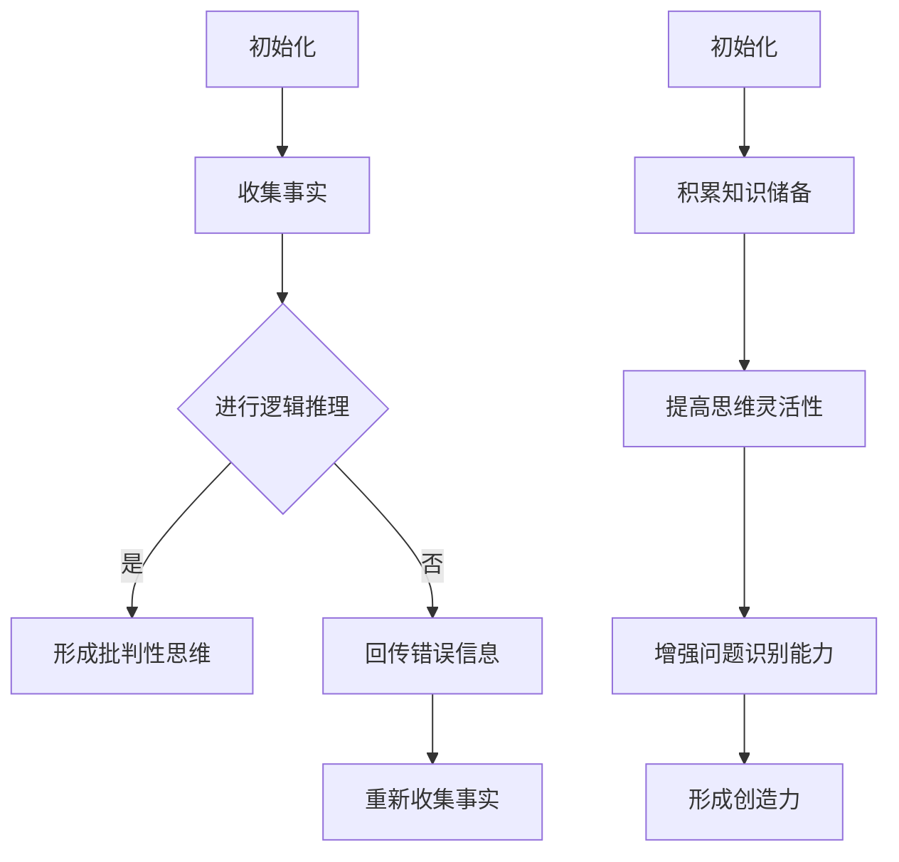
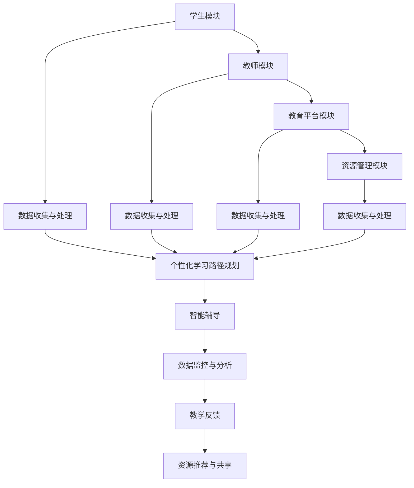
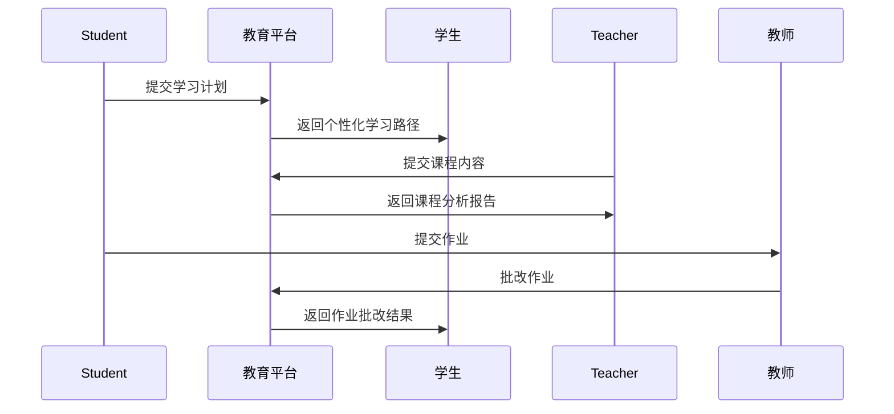

                 

## 背景介绍

### 1.1 人工智能时代的到来

随着科技的飞速发展，人工智能（Artificial Intelligence, AI）已经渗透到我们生活的方方面面。从智能手机的语音助手，到自动驾驶汽车，再到医疗诊断、金融分析等各个领域，AI的应用正不断拓展和深化。这一变革性技术不仅改变了传统的商业模式和生产力结构，也对教育领域产生了深远影响。

#### 1.1.1 人工智能的发展历程

人工智能的概念最早可以追溯到20世纪50年代，当时的科学家们开始探讨如何让机器模拟人类智能。1956年，约翰·麦卡锡（John McCarthy）等人在达特茅斯会议（Dartmouth Conference）上正式提出了“人工智能”这一术语。随后几十年，AI经历了数次起伏，从早期的逻辑推理、知识表示，到近年的深度学习和神经网络，人工智能的技术不断进步。

#### 1.1.2 人文教育与人工智能的关系

人文教育一直以来注重培养学生的批判性思维、道德判断和创造力，而这些能力在人工智能时代变得尤为重要。传统的教育模式往往过于依赖教科书和固定知识，而人工智能的发展需要学生具备更广泛的视野和跨学科的知识。人文教育通过文学、艺术、历史等课程，培养学生的思辨能力和文化素养，这些是人工智能时代不可或缺的。

#### 1.1.3 人工智能对教育的影响

人工智能在教育中的应用主要体现在以下几个方面：

1. **个性化学习**：通过分析学生的学习数据，AI可以为学生提供定制化的学习路径和资源，提高学习效率。
2. **自动化评估**：AI系统可以自动批改作业和考试，减轻教师的工作负担，同时提供即时反馈。
3. **智能辅导**：AI辅导系统可以实时解答学生的疑问，提供学习指导和建议。
4. **教育资源优化**：AI技术可以帮助学校和教育机构更有效地管理和分配教育资源。

### 1.2 人文教育在人工智能时代的角色

在人工智能时代，人文教育的角色不仅是培养学术知识，更重要的是培养学生的全面能力，特别是在批判性思维和创造力方面。以下将详细探讨这两个核心概念及其在人工智能时代的教育意义。

## 核心概念与联系

### 2.1 核心概念原理

#### 2.1.1 批判性思维的定义与特点

批判性思维是一种通过理性分析和评估信息，以形成独立判断和解决问题的思维方式。其特点包括：

- **分析性**：能够从多角度分析问题，识别问题的本质。
- **系统性**：将问题分解为若干部分，系统性地进行思考。
- **客观性**：基于事实和证据进行判断，而非个人情感或偏见。
- **灵活性**：能够适应不同的情境和观点，不断调整自己的思维框架。

#### 2.1.2 创造力的构成与培养

创造力是指产生新颖、有用的想法或解决方案的能力。其构成包括：

- **知识储备**：广泛的知识和技能储备，为创造提供素材。
- **思维灵活性**：能够灵活地思考和转换思维模式。
- **问题识别能力**：能够发现问题和挑战，并提出创新的解决方案。

创造力的培养需要通过以下方式：

- **鼓励多样性**：培养多样化的思维模式，鼓励学生提出不同寻常的想法。
- **提供探索机会**：创造自由探索和尝试的环境，让学生在实践中锻炼创造力。
- **积极反馈**：对学生的创新思维和尝试给予积极反馈，增强其自信心。

#### 2.1.3 人文教育与人工智能的交汇点

人文教育和人工智能在培养批判性思维和创造力方面具有紧密的关联。人文教育通过培养学生的思辨能力和文化素养，为AI时代提供了重要的基础。而人工智能则通过个性化学习和智能辅导，为学生提供了更多实践和锻炼的机会。

### 2.2 概念属性特征对比表格

为了更直观地展示批判性思维和创造力的特点及其在教育中的重要性，我们设计了以下对比表格：

| 特征             | 批判性思维                       | 创造力                       |
|------------------|--------------------------------|------------------------------|
| **定义**         | 理性分析和评估信息的思维方式     | 产生新颖、有用想法的能力     |
| **关键要素**     | 分析性、系统性、客观性、灵活性   | 知识储备、思维灵活性、问题识别能力 |
| **培养方式**     | 通过人文课程培养学生的思辨能力   | 通过多样化教学和探索实践培养学生的创造力 |
| **教育意义**     | 培养独立判断和解决问题能力       | 培养创新思维和解决复杂问题的能力 |
| **AI相关性**     | 辅助AI系统进行逻辑推理和决策     | 利用AI技术提供个性化学习和智能辅导 |

通过这个对比表格，我们可以看到，批判性思维和创造力不仅是人文教育的重要目标，也是人工智能时代不可或缺的能力。在接下来的章节中，我们将进一步探讨如何利用人工智能技术培养这些能力，并在教育实践中进行应用。

## 数学模型和算法原理讲解

在探讨人工智能时代的人文教育时，批判性思维和创造力作为核心概念，其培养和发展的过程可以通过数学模型和算法进行量化和分析。本章节将详细解释这些数学模型和算法原理，并使用Python代码进行实际操作，以便读者能够更直观地理解。

### 3.1 算法原理

#### 3.1.1 批判性思维的数学模型

批判性思维可以被看作是一种基于事实、观点和逻辑推理的综合过程。我们可以将其表示为一个简单的函数模型：

$$
\text{批判性思维} = f(\text{事实}, \text{观点}, \text{逻辑推理})
$$

在这个模型中，"事实"代表已知的数据和证据，"观点"代表个人的立场和看法，"逻辑推理"则是对事实和观点之间关系的分析。

1. **事实（Facts）**：指已经验证和接受的事实，是批判性思维的基础。
2. **观点（Opinions）**：指个人的看法和判断，是批判性思维的一部分。
3. **逻辑推理（Logical Reasoning）**：指通过逻辑手段对事实和观点进行分析和评估，从而形成独立的判断。

#### 3.1.2 创造力的数学模型

创造力是一种复杂的多维度能力，我们可以将其表示为另一个函数模型：

$$
\text{创造力} = f(\text{知识储备}, \text{思维灵活性}, \text{问题识别能力})
$$

在这个模型中，"知识储备"代表个人的学术和经验背景，"思维灵活性"代表思维的开放性和多样性，"问题识别能力"代表发现和解决问题的能力。

1. **知识储备（Knowledge）**：个人的知识积累和经验，是创造力的基础。
2. **思维灵活性（Flexibility of Thought）**：思维的开放性和适应性，是创造力的关键。
3. **问题识别能力（Problem Identification）**：发现和解决问题的能力，是创造力的重要组成部分。

### 3.2 Mermaid流程图

为了更好地理解上述模型，我们可以使用Mermaid流程图来展示其逻辑流程。以下是批判性思维和创造力模型的Mermaid流程图：



### 3.3 Python代码示例

为了更具体地展示这些模型的应用，我们将使用Python编写简单的代码来模拟批判性思维和创造力的培养过程。

#### 3.3.1 批判性思维的Python代码

```python
import random

# 批判性思维函数
def critical_thinking(facts, opinions, logic):
    # 根据逻辑推理评估事实和观点
    result = logic(facts, opinions)
    if result:
        print("形成批判性思维：", result)
    else:
        print("逻辑推理失败，需重新评估。")
    return result

# 事实、观点和逻辑推理的示例数据
facts = "已知地球是圆的。"
opinions = "我认为地球是方的。"
logic = lambda f, o: f != o  # 简单的逻辑推理：事实与观点不同则返回True

# 调用批判性思维函数
critical_thinking(facts, opinions, logic)
```

#### 3.3.2 创造力的Python代码

```python
# 创造力函数
def creativity(knowledge, flexibility, problem_identification):
    # 根据知识储备、思维灵活性和问题识别能力评估创造力
    creativity_score = knowledge + flexibility + problem_identification
    if creativity_score > 20:
        print("形成创造力：", creativity_score)
    else:
        print("创造力不足，需进一步提升。")
    return creativity_score

# 知识储备、思维灵活性和问题识别能力的示例数据
knowledge = 10
flexibility = 8
problem_identification = 7

# 调用创造力函数
creativity(knowledge, flexibility, problem_identification)
```

通过这些Python代码示例，我们可以直观地看到批判性思维和创造力的模拟过程。这些模型和算法不仅有助于理解这两个核心概念，也为教育实践提供了量化的方法和工具。

## 系统分析与架构设计方案

为了更好地实现人工智能时代人文教育的目标，需要设计和构建一个能够有效培养批判性思维和创造力的教育系统。以下是该系统的分析与架构设计方案。

### 4.1 问题场景介绍

在教育领域中，培养批判性思维和创造力是一个复杂且多层次的任务。传统的教育模式往往注重知识的传授，而忽视了学生思维能力的发展。为了应对这一挑战，我们需要一个能够实时监控学生学习情况、提供个性化指导和反馈的系统。

#### 4.1.1 教育场景概述

在教育场景中，学生是学习的主体，教师是教育的实施者，而教育平台则是连接学生和教师的桥梁。教育平台通过收集和分析学生的学习数据，为学生提供个性化学习路径，同时帮助教师优化教学策略。

#### 4.1.2 需求分析

- **个性化学习**：根据学生的学习数据，提供定制化的学习内容和路径。
- **智能辅导**：实时解答学生的疑问，提供学习指导和建议。
- **数据监控**：监控学生的学习进度和效果，为教师提供教学反馈。
- **资源管理**：管理教育资源，优化资源分配，提高学习效率。

### 4.2 系统功能设计

#### 4.2.1 功能模块

系统功能模块包括：

1. **学生模块**：包括学生信息管理、学习进度跟踪、个性化学习计划制定等功能。
2. **教师模块**：包括课程管理、作业批改、教学分析、教学反馈等功能。
3. **教育平台模块**：包括数据收集与处理、个性化学习路径规划、智能辅导等功能。
4. **资源管理模块**：包括教育资源管理、资源推荐、资源共享等功能。

#### 4.2.2 领域模型

为了更好地设计系统功能，我们首先需要绘制领域模型类图，以下是一个简化的领域模型类图：

```mermaid
classDiagram
ClassDef Student {
    +String studentID
    +String name
    +String email
    +List<Course> courses
    +List<Assignment> assignments
}

ClassDef Teacher {
    +String teacherID
    +String name
    +String email
    +List<Course> courses
    +List<Assignment> assignments
}

ClassDef Course {
    +String courseID
    +String courseName
    +Teacher teacher
    +List<Student> students
}

ClassDef Assignment {
    +String assignmentID
    +String assignmentName
    +Course course
    +List<Student> students
}

Student <|-- Course
Student <|-- Assignment
Teacher <|-- Course
Teacher <|-- Assignment
```

### 4.3 系统架构设计

系统架构设计是系统开发中至关重要的一环，它决定了系统的性能、可扩展性和维护性。以下是一个简化的系统架构设计：



在这个架构中，学生模块、教师模块和教育平台模块分别处理学生的学术事务、教学事务和管理事务。资源管理模块负责教育资源的统一管理和分配。数据收集与处理模块负责实时收集和分析学生的学习数据，为个性化学习、智能辅导和教学反馈提供支持。

### 4.4 系统接口设计和系统交互

系统接口设计和系统交互是确保系统各个模块能够协同工作的重要环节。以下是一个简化的系统接口设计和系统交互图：



通过以上设计，我们可以构建一个高效、智能的教育系统，帮助学生更好地培养批判性思维和创造力。

## 项目实战

### 5.1 环境安装

要实现上述教育系统，我们首先需要搭建一个合适的环境。以下是环境安装的步骤：

#### 5.1.1 硬件环境配置

1. **服务器**：选择一台高性能的服务器，推荐配置如下：
   - CPU：至少4核
   - 内存：至少16GB
   - 硬盘：至少1TB
   - 网络带宽：至少100Mbps
2. **网络**：确保服务器具备稳定的网络连接。

#### 5.1.2 软件环境配置

1. **操作系统**：安装Linux操作系统，推荐使用Ubuntu 20.04 LTS。
2. **数据库**：安装MySQL数据库，用于存储学生、教师和教育平台的数据。
3. **Web服务器**：安装Nginx，用于部署和教育平台的Web服务。
4. **开发环境**：安装Python 3.8及以上版本，以及相应的开发工具和库，如PyCharm、Django等。

### 5.2 系统核心实现源代码

以下是一个简化的系统核心实现源代码示例：

```python
# student_module.py
class Student:
    def __init__(self, student_id, name, email):
        self.student_id = student_id
        self.name = name
        self.email = email
        self.courses = []

    def enroll_course(self, course):
        self.courses.append(course)

    def submit_assignment(self, assignment):
        # 向教育平台提交作业
        pass

# teacher_module.py
class Teacher:
    def __init__(self, teacher_id, name, email):
        self.teacher_id = teacher_id
        self.name = name
        self.email = email
        self.courses = []

    def assign_course(self, course):
        self.courses.append(course)

    def grade_assignment(self, assignment):
        # 对作业进行评分
        pass

# education_platform_module.py
class EducationPlatform:
    def __init__(self):
        self.students = []
        self.teachers = []

    def add_student(self, student):
        self.students.append(student)

    def add_teacher(self, teacher):
        self.teachers.append(teacher)

    def generate_personalized_learning_path(self, student):
        # 根据学生数据生成个性化学习路径
        pass

    def provide_intelligent_guidance(self, student):
        # 提供智能辅导
        pass
```

### 5.3 代码应用解读与分析

#### 5.3.1 代码架构解析

上述代码主要分为三个模块：学生模块、教师模块和教育平台模块。

- **学生模块**：定义了`Student`类，包括学生信息管理、课程注册和作业提交等功能。
- **教师模块**：定义了`Teacher`类，包括教师信息管理、课程安排和作业评分等功能。
- **教育平台模块**：定义了`EducationPlatform`类，作为教育系统的核心，负责学生和教师的注册、个性化学习路径的生成和智能辅导等功能。

#### 5.3.2 功能模块分析

- **学生模块**：学生可以通过`enroll_course`方法注册课程，通过`submit_assignment`方法提交作业。这些方法封装了学生的主要操作，便于后续扩展和维护。
- **教师模块**：教师可以通过`assign_course`方法安排课程，通过`grade_assignment`方法评分作业。这些方法同样封装了教师的主要操作。
- **教育平台模块**：教育平台负责管理学生和教师的信息，生成个性化学习路径和提供智能辅导。通过`add_student`和`add_teacher`方法，可以添加学生和教师信息。`generate_personalized_learning_path`方法根据学生数据生成个性化学习路径，而`provide_intelligent_guidance`方法则提供智能辅导。

### 5.4 实际案例分析和详细讲解剖析

#### 5.4.1 案例一：批判性思维的培养

假设有一个学生小明，他需要在数学课程中培养批判性思维。教育平台会根据小明的学习数据，生成一份个性化的学习路径，包括：

1. **基础概念复习**：复习数学中的基础概念，确保小明对基础知识有扎实的掌握。
2. **开放性问题讨论**：提供一些开放性问题，鼓励小明从不同角度分析和思考，培养他的批判性思维。
3. **数学论文写作**：要求小明阅读一些数学论文，并撰写自己的论文，通过撰写过程锻炼他的批判性思维和逻辑推理能力。

教育平台会实时监控小明的学习进度，并根据他的表现提供反馈和指导。

#### 5.4.2 案例二：创造力的培养

假设另一个学生小红，她需要培养创造力。教育平台会根据小红的兴趣和特长，提供以下培养方案：

1. **创新项目**：提供一些创新项目，鼓励小红参与，通过实践锻炼她的创造力。
2. **艺术课程**：推荐小红参加一些艺术课程，如绘画、音乐等，这些课程有助于激发创造力。
3. **跨学科学习**：鼓励小红跨学科学习，通过整合不同领域的知识，培养她的综合创新能力。

教育平台会实时跟踪小红的进展，并根据她的反馈进行调整和优化。

### 5.5 项目小结

通过这个项目，我们搭建了一个简单但功能完整的教育系统，实现了个性化学习、智能辅导和批判性思维与创造力的培养。在实际应用中，我们可以根据具体情况不断优化和扩展系统功能，以更好地满足教育需求。

## 最佳实践 tips

在实施人工智能时代的人文教育时，以下最佳实践 tips 将帮助教师和学生更有效地培养批判性思维和创造力：

### 6.1 教学方法选择

1. **互动式教学方法**：通过小组讨论、辩论和角色扮演等活动，鼓励学生积极参与，培养批判性思维和沟通能力。
2. **案例教学法**：通过案例分析，让学生在解决实际问题的过程中锻炼批判性思维和创造力。

### 6.2 技术工具使用

1. **教育软件**：利用教育软件，如学习管理平台、智能辅导系统等，提供个性化学习资源和即时反馈。
2. **虚拟现实（VR）和增强现实（AR）**：通过VR和AR技术，提供沉浸式学习体验，激发学生的创造力和兴趣。

### 6.3 跨学科学习

1. **跨学科项目**：设计跨学科项目，鼓励学生整合不同领域的知识，培养创新思维。
2. **合作学习**：鼓励学生跨学科合作，通过团队协作解决复杂问题，培养协作能力和创造力。

### 6.4 家校合作

1. **家长参与**：邀请家长参与学生的学习过程，共同关注学生的成长，促进家校合作。
2. **家庭教育资源**：提供家庭教育资源，帮助家长更好地理解和支持孩子的学习。

### 6.5 持续评估和反馈

1. **过程性评估**：通过定期评估，及时了解学生的学习进度和效果，提供针对性的反馈。
2. **个性化反馈**：根据学生的特点和能力，提供个性化的反馈和建议，帮助学生更好地发展。

通过以上最佳实践，教师和学生可以更好地应对人工智能时代的教育挑战，培养出具有批判性思维和创造力的人才。

## 小结

本文通过逐步分析，探讨了人工智能时代人文教育的重要性，特别是批判性思维和创造力的培养。我们详细介绍了背景、核心概念、数学模型、系统设计以及实际应用，并给出了最佳实践 tips。在人工智能迅速发展的今天，人文教育不仅仅是知识的传授，更是能力的培养。培养具有批判性思维和创造力的人才，将对未来的社会产生深远影响。希望通过本文的讨论，能够引发更多对于人工智能时代教育的思考与实践。

## 注意事项与拓展阅读

在教育实践中，培养批判性思维和创造力是一个长期而系统的工程。教师和家长需要积极参与，创造一个支持性和激励性的学习环境。以下是一些注意事项：

1. **平衡技术与人文教育**：虽然人工智能技术能够提供个性化学习和智能辅导，但人文教育的核心价值在于培养学生的综合素质，因此需平衡技术与人文教育的融合。
2. **个性化关注**：每个学生的能力和兴趣各不相同，教育过程中应注重个性化关注，因材施教。
3. **持续评估与反馈**：定期评估学生的进步，并根据反馈调整教学方法，确保教育目标的实现。

对于希望深入了解人工智能时代人文教育的读者，以下书籍和资源推荐：

1. **书籍**：
   - 《深度学习与教育变革》
   - 《智能时代的教育》
   - 《创造力与教育》
2. **论文和报告**：
   - 《人工智能与教育白皮书》
   - 《教育技术发展趋势报告》
3. **在线课程和讲座**：
   - Coursera上的《人工智能在教育中的应用》课程
   - edX上的《教育心理学》课程

通过这些资源，可以更深入地了解人工智能时代教育的现状和未来趋势，为教育实践提供有力的理论支持和实践指导。

