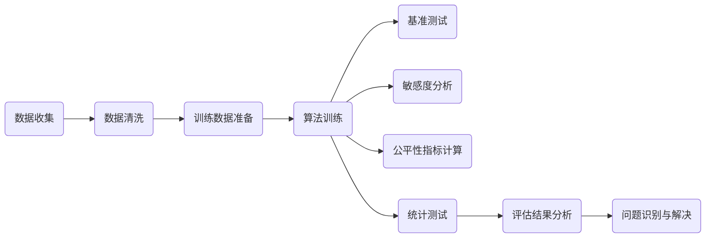
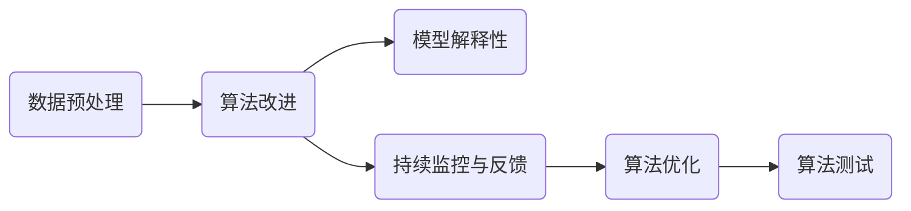

                 

# 人工智能时代的伦理决策：算法公平与社会正义

## 关键词：人工智能伦理，算法公平，社会正义，伦理决策，人工智能实践

## 摘要：
随着人工智能技术的飞速发展，算法作为其核心驱动力，正日益渗透到社会生活的方方面面。然而，算法的公平性及对社会正义的影响成为一个不可忽视的伦理问题。本文旨在探讨人工智能时代算法公平与社会正义的关系，分析算法公平的原理与特征，以及社会正义的伦理要求。通过案例分析和实践经验，本文提出改进算法公平的策略，并探讨实现社会正义的路径，以期为人工智能时代的伦理决策提供理论指导和实践参考。

## 目录

### 第一部分：问题背景与定义

#### 1.1 人工智能时代的社会变革

##### 1.1.1 人工智能的快速发展

##### 1.1.2 社会变革中的伦理困境

#### 1.2 伦理决策的重要性

##### 1.2.1 伦理决策的定义与作用

##### 1.2.2 算法伦理决策的挑战

#### 1.3 算法公平与社会正义

##### 1.3.1 算法公平的概念

##### 1.3.2 社会正义的伦理要求

##### 1.4 本书结构与内容概述

### 第二部分：核心概念与联系

#### 2.1 算法公平的原理与特征

##### 2.1.1 算法公平的核心要素

##### 2.1.2 算法公平的属性特征对比

##### 2.1.3 算法公平的Mermaid实体关系图

#### 2.2 社会正义的伦理要求

##### 2.2.1 社会正义的概念

##### 2.2.2 社会正义的伦理原则

##### 2.2.3 社会正义的Mermaid实体关系图

#### 2.3 算法公平与社会正义的联系与冲突

##### 2.3.1 算法公平与社会正义的互动关系

##### 2.3.2 算法公平与社会正义的平衡

### 第三部分：算法公平实践

#### 3.1 算法公平评估方法

##### 3.1.1 算法公平评估的挑战

##### 3.1.2 算法公平评估的方法

##### 3.1.3 算法公平评估的Mermaid流程图

#### 3.2 算法公平改进策略

##### 3.2.1 算法公平的改进目标

##### 3.2.2 算法公平改进策略

##### 3.2.3 算法公平改进的Mermaid流程图

#### 3.3 算法公平案例分析

##### 3.3.1 案例背景

##### 3.3.2 案例分析

##### 3.3.3 案例启示

### 第四部分：社会正义的实现路径

#### 4.1 社会正义的伦理决策

##### 4.1.1 社会正义的伦理决策原则

##### 4.1.2 社会正义的伦理决策过程

##### 4.1.3 社会正义的Mermaid决策流程图

#### 4.2 社会正义的制度保障

##### 4.2.1 社会正义的制度框架

##### 4.2.2 社会正义的制度实施

##### 4.2.3 社会正义的Mermaid制度架构图

#### 4.3 社会正义的实践探索

##### 4.3.1 社会正义的实践路径

##### 4.3.2 社会正义的实践成果

##### 4.3.3 社会正义的实践启示

### 第五部分：拓展阅读与讨论

#### 5.1 拓展阅读推荐

##### 5.1.1 相关书籍推荐

##### 5.1.2 学术论文推荐

##### 5.1.3 网络资源推荐

#### 5.2 小结与展望

##### 5.2.1 本书总结

##### 5.2.2 未来研究方向

##### 5.2.3 对读者的建议

### 附录

#### 附录A：术语解释

#### 附录B：参考资料

#### 附录C：相关数据

---

# 第一部分：问题背景与定义

## 1.1 人工智能时代的社会变革

### 1.1.1 人工智能的快速发展

人工智能（Artificial Intelligence，AI）作为21世纪最具影响力的技术之一，正以惊人的速度融入我们的日常生活和各行各业。从语音助手到自动驾驶，从医疗诊断到金融分析，AI技术的应用已经渗透到了社会各个层面。据市场研究公司IDC的预测，到2025年，全球将有超过60%的大企业采用人工智能技术，而AI技术的市场规模也将达到5500亿美元。

### 1.1.2 社会变革中的伦理困境

然而，随着人工智能技术的快速发展，一系列伦理困境也随之而来。其中，算法公平与社会正义的问题尤为突出。算法作为人工智能的核心，其决策过程和结果往往影响着社会中的不同群体。例如，在招聘系统中，算法可能因为历史数据中的偏见而导致对某些群体的歧视；在医疗诊断中，算法的准确性可能受到数据质量和算法设计的影响，进而影响患者的治疗效果。

### 1.2 伦理决策的重要性

伦理决策在人工智能时代的重要性不言而喻。伦理决策不仅仅关乎技术本身，更关乎社会、文化、法律等多个层面。一个良好的伦理决策能够确保技术发展符合社会价值观，避免技术滥用和道德风险。例如，在自动驾驶领域，如何确保车辆在紧急情况下做出符合伦理标准的决策，是一个亟待解决的问题。

### 1.2.1 伦理决策的定义与作用

伦理决策是指在特定情境下，根据伦理原则和道德规范，做出合理且公正的选择。在人工智能领域，伦理决策的作用主要体现在以下几个方面：

1. **确保技术发展符合社会价值观**：通过伦理决策，可以确保人工智能技术的发展方向与社会的伦理价值观相符，避免技术滥用和道德风险。
2. **提高技术透明度和可解释性**：伦理决策能够推动算法的透明化，使人们能够理解算法的决策过程，增强公众对技术的信任。
3. **促进社会责任感**：伦理决策能够引导企业和研究人员在技术开发过程中承担更多的社会责任，关注技术对社会的影响。

### 1.2.2 算法伦理决策的挑战

尽管伦理决策在人工智能领域具有重要意义，但实际操作中仍面临诸多挑战：

1. **数据偏差**：算法的性能和决策结果往往依赖于训练数据，如果训练数据存在偏差，算法也可能会继承这些偏差，导致不公平的决策。
2. **算法复杂性**：现代人工智能算法高度复杂，使得理解和验证算法的伦理决策变得困难。
3. **多维度影响**：人工智能技术的应用往往涉及多个领域和利益相关方，如何在不同维度上做出公平和公正的决策是一个挑战。

### 1.3 算法公平与社会正义

算法公平和社会正义是人工智能伦理决策中的两个核心概念。算法公平关注算法在决策过程中是否公平、透明和可解释；而社会正义则强调算法的决策结果是否符合社会的道德和伦理标准。

### 1.3.1 算法公平的概念

算法公平是指算法在决策过程中，对所有人或群体都保持一致的待遇，不因性别、种族、年龄等因素而产生歧视。算法公平包括以下几个方面：

1. **非歧视性**：算法不应基于性别、种族、年龄等因素进行歧视。
2. **透明性**：算法的决策过程应该是透明和可解释的，使人们能够理解算法的决策依据。
3. **公平性**：算法的决策结果应该对所有人或群体都是公平的。

### 1.3.2 社会正义的伦理要求

社会正义强调的是社会资源的公平分配和社会关系的公平对待。在人工智能领域，社会正义的伦理要求包括：

1. **资源分配**：算法应确保资源的公平分配，避免资源向特定群体倾斜。
2. **社会关系**：算法的决策应促进社会的和谐与稳定，避免加剧社会矛盾。

### 1.4 本书结构与内容概述

本书分为五个部分，旨在系统地探讨人工智能时代的伦理决策，特别是算法公平与社会正义的问题。具体结构如下：

1. **第一部分：问题背景与定义**：介绍人工智能时代的社会变革和伦理决策的重要性，定义算法公平和社会正义。
2. **第二部分：核心概念与联系**：分析算法公平的原理与特征，以及社会正义的伦理要求，展示两者之间的联系与冲突。
3. **第三部分：算法公平实践**：讨论算法公平评估方法、改进策略以及案例分析。
4. **第四部分：社会正义的实现路径**：探讨社会正义的伦理决策、制度保障和实践探索。
5. **第五部分：拓展阅读与讨论**：推荐相关阅读材料，总结本书的主要内容，并展望未来研究方向。

通过本书的探讨，我们希望能够为人工智能时代的伦理决策提供理论指导和实践参考，促进人工智能技术的健康发展。接下来，我们将进一步深入探讨算法公平与社会正义的核心概念及其相互作用。

---

## 1.4 本书结构与内容概述

本书分为五个部分，旨在系统地探讨人工智能时代的伦理决策，特别是算法公平与社会正义的问题。具体结构如下：

### 第一部分：问题背景与定义

本部分将介绍人工智能时代的社会变革，特别是算法公平与社会正义的重要性。通过定义相关术语，我们将明确算法公平和社会正义的概念，为后续讨论奠定基础。

### 第二部分：核心概念与联系

本部分将深入分析算法公平的原理与特征，以及社会正义的伦理要求。通过比较算法公平的属性特征，我们将会展示算法公平与社会正义之间的联系与冲突，为理解两者的互动提供视角。

### 第三部分：算法公平实践

在本部分中，我们将探讨算法公平评估方法，分析评估过程中的挑战和解决方案。接着，我们将介绍算法公平的改进策略，通过实际案例说明如何应用这些策略来提升算法的公平性。

### 第四部分：社会正义的实现路径

这一部分将探讨社会正义的伦理决策原则和过程，展示如何通过制度保障和实践探索来实现社会正义。我们将结合实际案例，分析社会正义在人工智能领域的应用和成果。

### 第五部分：拓展阅读与讨论

最后一部分将推荐相关阅读材料，总结本书的主要内容，并展望未来研究方向。此外，我们还将讨论对读者的建议，鼓励读者进一步思考和实践。

通过本书的探讨，我们希望能够为人工智能时代的伦理决策提供理论指导和实践参考，促进人工智能技术的健康发展。

---

## 第二部分：核心概念与联系

### 2.1 算法公平的原理与特征

算法公平是人工智能伦理决策中的一个关键概念，它关系到算法的决策是否能够公正地对待所有人或群体。算法公平的原理可以从以下几个方面进行阐述：

1. **非歧视性**：算法应避免因性别、种族、年龄、地域等因素而对某些群体产生不公平的待遇。这意味着算法的决策过程应该基于客观的数据和逻辑，而不是偏见或歧视。
2. **透明性**：算法的决策过程应该是透明和可解释的，以便人们可以理解算法的决策依据。这种透明性有助于增强公众对算法的信任，并促进算法的公平性和合理性。
3. **公正性**：算法的决策结果应该对所有人或群体都是公平的，即算法不应该因为某些群体的特定特征而对他们产生偏见。

为了更好地理解算法公平的原理，我们可以通过一个具体的例子来说明。假设有一个招聘系统，该系统使用算法来筛选求职者。一个公平的招聘算法应该避免因求职者的性别、种族或年龄等因素而歧视他们。相反，它应该基于求职者的技能、经验和能力来做出决策。这样的算法不仅能够确保公平，还能够吸引更多多样化的求职者，从而提升招聘的质量。

### 2.1.1 算法公平的核心要素

算法公平的核心要素包括以下几个方面：

1. **数据质量**：算法的决策依赖于训练数据，因此数据的质量对算法的公平性至关重要。如果训练数据存在偏差，算法可能会继承这些偏差，从而导致不公平的决策。因此，确保数据质量是算法公平的基础。
2. **算法设计**：算法的设计和实现也对公平性有重要影响。一个公平的算法应该能够避免因特定特征而对某些群体产生歧视。例如，可以通过平衡不同群体的代表性来设计算法，或者使用算法优化技术来减少偏见。
3. **监督和评估**：算法的公平性需要通过持续的监督和评估来确保。这包括监控算法的决策过程和结果，以及定期评估算法的公平性。如果发现算法存在不公平的倾向，应该及时进行调整和优化。

### 2.1.2 算法公平的属性特征对比

为了更全面地理解算法公平的属性特征，我们可以将算法公平与其他相关概念进行对比。以下是一个简化的对比表格：

| 特征            | 算法公平       | 公平性          | 透明性          | 非歧视性         |
|-----------------|----------------|-----------------|-----------------|-----------------|
| 定义            | 算法的决策应公平对待所有人或群体 | 伦理决策的核心要素，涉及资源分配和社会关系 | 算法的决策过程和结果应可解释和理解 | 算法不应因性别、种族等因素而对某些群体产生歧视 |
| 关键要素        | 数据质量、算法设计、监督和评估   | 社会公正、道德伦理标准                        | 算法透明度、可解释性                | 非歧视、无偏见                      |
| 目标            | 实现公正和公平的决策结果         | 促进社会公平和正义                           | 增强公众信任和对算法的接受度         | 避免社会歧视和偏见                  |

通过对比可以看出，算法公平不仅涉及决策结果的公平性，还包括透明性和非歧视性等多个方面。这些特征共同构成了算法公平的完整框架。

### 2.1.3 算法公平的Mermaid实体关系图

为了直观地展示算法公平的实体关系，我们可以使用Mermaid绘制一个简化的实体关系图。以下是一个示例：

```mermaid
erDiagram
  AlgorithmFairness ||--|{ DataQuality }||>
  AlgorithmFairness ||--|{ AlgorithmDesign }||>
  AlgorithmFairness ||--|{ SupervisionAndEvaluation }||>
  DataQuality ||--|{ NonDiscrimination }||>
  DataQuality ||--|{ Transparency }||>
  AlgorithmDesign ||--|{ Fairness }||>
  SupervisionAndEvaluation ||--|{ ContinuousMonitoring }||>
  SupervisionAndEvaluation ||--|{ RegularEvaluation }||>
```

在这个图中，`AlgorithmFairness`表示算法公平的整体概念，而`DataQuality`、`AlgorithmDesign`和`SupervisionAndEvaluation`分别表示算法公平的三个关键要素。`NonDiscrimination`和`Transparency`是数据质量的一部分，而`Fairness`是算法设计的一部分。`ContinuousMonitoring`和`RegularEvaluation`是监督和评估过程的组成部分。

通过这个Mermaid实体关系图，我们可以更清晰地理解算法公平的构成要素及其相互关系。

### 2.2 社会正义的伦理要求

社会正义是另一个在人工智能伦理决策中至关重要的概念。社会正义强调社会资源的公平分配和社会关系的公平对待。以下是对社会正义的伦理要求的详细分析：

#### 2.2.1 社会正义的概念

社会正义是指在一个社会中，资源的分配和机会的提供应该公平合理，以确保所有成员都能够享有平等的社会地位和机会。社会正义的核心目标是减少不平等，促进社会的和谐与稳定。

#### 2.2.2 社会正义的伦理原则

社会正义的伦理原则包括以下几个方面：

1. **公平性**：社会正义要求资源的分配应该基于公平原则，确保每个人都能享有平等的机会和福利。
2. **平等性**：社会正义追求的是实质上的平等，而不仅仅是形式上的平等。这意味着在实际结果上，每个人都应该得到公平对待。
3. **公正性**：社会正义强调的是公正的分配和对待，不仅要考虑个体的贡献，还要考虑个体的需求和特殊情况。
4. **责任和义务**：社会正义认为，每个人都有责任为社会做出贡献，同时社会也有义务保障每个人的基本权利和需求。

#### 2.2.3 社会正义的Mermaid实体关系图

为了更好地理解社会正义的伦理要求，我们可以使用Mermaid绘制一个简化的实体关系图。以下是一个示例：

```mermaid
erDiagram
  SocialJustice ||--|{ Fairness }||>
  SocialJustice ||--|{ Equality }||>
  SocialJustice ||--|{ Justice }||>
  SocialJustice ||--|{ ResponsibilityAndObligation }||>
```

在这个图中，`SocialJustice`表示社会正义的整体概念，而`Fairness`、`Equality`、`Justice`和`ResponsibilityAndObligation`分别表示社会正义的四个核心原则。这些原则共同构成了社会正义的理论基础。

### 2.3 算法公平与社会正义的联系与冲突

算法公平和社会正义在人工智能伦理决策中具有紧密的联系和潜在的冲突。

#### 2.3.1 算法公平与社会正义的互动关系

算法公平和社会正义之间的互动关系体现在以下几个方面：

1. **相互支持**：算法公平的实现有助于促进社会正义，因为一个公平的算法可以确保资源的公正分配和机会的公平提供。
2. **相互促进**：社会正义的推进也有助于算法公平的实现，因为一个公正的社会环境可以为算法的公平性提供更好的支持和保障。
3. **共同目标**：算法公平和社会正义都追求公平和正义，两者在目标上具有一致性，但实现路径和关注点有所不同。

#### 2.3.2 算法公平与社会正义的平衡

在实际操作中，算法公平和社会正义之间可能会出现冲突。例如，在某些情况下，为了实现社会正义，可能需要对特定群体进行特殊照顾，这可能会影响算法的公平性。反之，如果过于追求算法的公平性，可能会忽视社会正义的需要，导致资源分配的不公平。

为了平衡算法公平和社会正义，可以考虑以下策略：

1. **综合评估**：在制定算法时，应综合考虑算法的公平性和社会正义的要求，确保两者之间达到一个合理的平衡。
2. **多方参与**：在算法设计和实施过程中，应邀请不同利益相关方参与，包括技术专家、社会学家、法律专家等，以确保算法既公平又符合社会正义的要求。
3. **持续监督**：对算法的决策过程和结果进行持续监督和评估，及时发现并解决不公平的问题，同时根据社会变化调整算法的公平性和社会正义的平衡。

通过上述措施，可以在算法公平和社会正义之间实现有效的平衡，为人工智能时代的伦理决策提供有力支持。

### 总结

通过本部分的分析，我们深入探讨了算法公平和社会正义的核心概念及其联系与冲突。算法公平关注的是算法的决策是否公平、透明和可解释，而社会正义则强调资源的公平分配和社会关系的公平对待。两者在人工智能伦理决策中具有紧密的联系，但同时也可能存在冲突。通过综合评估、多方参与和持续监督，我们可以实现算法公平和社会正义的平衡，为人工智能时代的健康发展奠定基础。接下来，我们将进一步探讨算法公平的实践方法，以及如何通过具体案例来分析算法公平的改进策略。

---

## 2.3 算法公平与社会正义的联系与冲突

算法公平与社会正义在人工智能伦理决策中具有紧密的联系和潜在的冲突。这种联系与冲突不仅体现在理论层面，也在实际应用中得到了体现。为了更好地理解这种关系，我们首先需要明确两者之间的互动关系，然后分析可能出现的冲突，并提出平衡策略。

### 2.3.1 算法公平与社会正义的互动关系

算法公平与社会正义之间的互动关系可以从以下几个方面进行理解：

1. **相互支持**：算法公平的实现有助于促进社会正义。一个公平的算法可以确保资源的公正分配和机会的公平提供，从而减少社会不平等。例如，在招聘系统中，公平的算法能够避免因性别、种族等因素而对求职者产生歧视，从而提高招聘的公正性和多样性。

2. **相互促进**：社会正义的推进也有助于算法公平的实现。在一个公正的社会环境中，人们更愿意接受和信任公平的算法，从而推动算法的公平性和透明度。此外，社会正义的实现可以提供更多的数据资源，支持算法的改进和优化。

3. **共同目标**：算法公平和社会正义都追求公平和正义，两者在目标上具有一致性。但需要注意的是，两者在实现路径和关注点上有所不同。算法公平更注重技术层面的实现，而社会正义则更多地涉及社会政策和法律框架的构建。

### 2.3.2 算法公平与社会正义的潜在冲突

尽管算法公平和社会正义在目标上具有一致性，但在实际操作中，两者之间也可能存在冲突。这些冲突主要表现在以下几个方面：

1. **资源分配**：在资源有限的情况下，追求算法的公平性可能会导致对特定群体的资源倾斜，从而影响整体的社会正义。例如，为了确保招聘系统的公平性，可能需要对某些受歧视群体给予更多机会，这可能会减少其他群体的就业机会。

2. **特殊照顾**：在某些情况下，为了实现社会正义，可能需要对特定群体进行特殊照顾。这种特殊照顾可能会影响算法的公平性。例如，为了确保教育资源的公平分配，可能需要对特定地区或群体的学生给予额外的关注，这可能会影响其他学生的机会。

3. **透明性与效率**：算法的透明性对于确保其公平性至关重要，但过度的透明性可能会导致算法的运行效率降低。例如，在金融交易系统中，透明的算法可以减少人为干预和腐败，但同时也可能增加交易成本和风险。

### 2.3.3 平衡策略

为了在算法公平和社会正义之间实现平衡，可以考虑以下策略：

1. **综合评估**：在制定算法时，应综合考虑算法的公平性和社会正义的要求，确保两者之间达到一个合理的平衡。这可以通过设置明确的评估指标和定期审查来实现。

2. **多方参与**：在算法设计和实施过程中，应邀请不同利益相关方参与，包括技术专家、社会学家、法律专家等，以确保算法既公平又符合社会正义的要求。多方参与可以提供更全面的视角，减少单一利益团体的偏见。

3. **持续监督**：对算法的决策过程和结果进行持续监督和评估，及时发现并解决不公平的问题，同时根据社会变化调整算法的公平性和社会正义的平衡。这可以确保算法在长期运行中保持公平性。

通过上述策略，我们可以在算法公平和社会正义之间实现有效的平衡，为人工智能时代的伦理决策提供有力支持。接下来，我们将探讨算法公平的具体实践方法，以及如何通过具体案例来分析算法公平的改进策略。

---

## 2.3 算法公平与社会正义的联系与冲突

在探讨算法公平与社会正义的关系时，我们首先需要理解两者之间的互动关系，并认识到它们在实践中的潜在冲突。

### 算法公平与社会正义的互动关系

1. **相互支持**：算法公平的实现有助于社会正义的推进。一个公正的算法能够确保资源的公平分配，从而减少社会不平等。例如，在招聘系统中，公平的算法可以避免因性别、种族等因素而对求职者产生歧视，提高招聘的公正性和多样性。

2. **相互促进**：社会正义的推进也有助于算法公平的实现。在一个公正的社会环境中，人们更愿意接受和信任公平的算法，从而推动算法的透明性和公平性。此外，社会正义的实现可以提供更多的数据资源，支持算法的改进和优化。

3. **共同目标**：算法公平和社会正义都追求公平和正义，虽然实现路径和关注点不同，但目标上具有一致性。算法公平关注技术层面的实现，而社会正义则更多地涉及社会政策和法律框架的构建。

### 算法公平与社会正义的潜在冲突

尽管算法公平和社会正义在目标上具有一致性，但在实践中也可能存在冲突：

1. **资源分配**：在资源有限的情况下，追求算法的公平性可能会导致对特定群体的资源倾斜，从而影响整体的社会正义。例如，为了确保招聘系统的公平性，可能需要对某些受歧视群体给予更多机会，这可能会减少其他群体的就业机会。

2. **特殊照顾**：在某些情况下，为了实现社会正义，可能需要对特定群体进行特殊照顾。这种特殊照顾可能会影响算法的公平性。例如，为了确保教育资源的公平分配，可能需要对特定地区或群体的学生给予额外的关注，这可能会影响其他学生的机会。

3. **透明性与效率**：算法的透明性对于确保其公平性至关重要，但过度的透明性可能会导致算法的运行效率降低。例如，在金融交易系统中，透明的算法可以减少人为干预和腐败，但同时也可能增加交易成本和风险。

### 平衡策略

为了在算法公平和社会正义之间实现平衡，可以考虑以下策略：

1. **综合评估**：在制定算法时，应综合考虑算法的公平性和社会正义的要求，确保两者之间达到一个合理的平衡。这可以通过设置明确的评估指标和定期审查来实现。

2. **多方参与**：在算法设计和实施过程中，应邀请不同利益相关方参与，包括技术专家、社会学家、法律专家等，以确保算法既公平又符合社会正义的要求。多方参与可以提供更全面的视角，减少单一利益团体的偏见。

3. **持续监督**：对算法的决策过程和结果进行持续监督和评估，及时发现并解决不公平的问题，同时根据社会变化调整算法的公平性和社会正义的平衡。这可以确保算法在长期运行中保持公平性。

通过上述策略，我们可以在算法公平和社会正义之间实现有效的平衡，为人工智能时代的伦理决策提供有力支持。接下来，我们将深入探讨算法公平的具体实践方法。

### 算法公平的实践方法

算法公平的实践方法涉及多个方面，包括数据质量、算法设计和监督与评估。以下是一些关键步骤和策略：

#### 1. 数据质量

数据质量是算法公平性的基础。以下是一些确保数据质量的策略：

1. **数据清洗**：清洗数据中的错误、冗余和不完整信息，以提高数据的准确性。
2. **数据平衡**：通过增加代表性不足群体的数据样本，确保数据在不同群体之间的平衡。
3. **数据监测**：定期监控数据的质量和偏见，确保数据在长期内保持高质量。

#### 2. 算法设计

算法设计直接关系到算法的公平性。以下是一些确保算法公平的策略：

1. **无偏见训练**：使用无偏见的数据进行算法训练，避免算法继承数据的偏见。
2. **算法优化**：通过优化算法参数和模型结构，提高算法的公平性和准确性。
3. **可解释性**：设计可解释的算法，使人们能够理解算法的决策过程，增强公众对算法的信任。

#### 3. 监督与评估

对算法的监督与评估是确保其公平性的关键步骤。以下是一些策略：

1. **绩效评估**：定期评估算法的决策结果，确保其符合公平性和社会正义的要求。
2. **公正性测试**：通过公正性测试，检查算法是否对所有人或群体都保持一致的待遇。
3. **反馈机制**：建立反馈机制，收集用户对算法的反馈，及时调整和优化算法。

#### 4. 多方参与

确保算法公平不仅需要技术层面的努力，还需要社会各界的参与。以下是一些策略：

1. **公开透明**：公开算法的设计和决策过程，增加透明度和公众参与度。
2. **利益相关方合作**：与不同利益相关方合作，包括技术专家、法律专家、社会学家等，共同推动算法公平的实现。
3. **公众咨询**：在算法设计和实施过程中，定期征求公众的意见和建议，确保算法符合社会价值观。

通过上述实践方法，我们可以确保算法的公平性，并在人工智能时代实现社会正义。

### 总结

算法公平与社会正义在人工智能时代具有重要的意义。通过理解两者之间的联系与冲突，我们可以采取有效的平衡策略，确保算法既公平又符合社会正义的要求。接下来，我们将通过具体的案例来分析算法公平的改进策略。

---

## 3.1 算法公平评估方法

算法公平评估是确保算法决策过程公平性的一项关键任务。一个有效的评估方法可以帮助识别和解决算法中的不公平问题，从而提升算法的公正性和透明度。以下是算法公平评估的一些主要方法和步骤：

### 3.1.1 算法公平评估的挑战

在评估算法公平性时，我们面临以下主要挑战：

1. **数据偏差**：算法的决策往往依赖于训练数据。如果训练数据存在偏差，算法可能会继承这些偏差，导致不公平的决策。
2. **复杂性**：现代算法高度复杂，使得理解和评估算法的决策过程变得困难。
3. **多维度影响**：算法的决策结果可能涉及多个领域和利益相关方，评估时需要综合考虑多个维度。
4. **评估指标的选择**：选择合适的评估指标是评估算法公平性的关键。不同的指标可能侧重于不同的方面，需要根据具体场景选择合适的指标。

### 3.1.2 算法公平评估的方法

为了应对上述挑战，我们可以采用以下几种评估方法：

1. **基准测试**：基准测试是一种常用的方法，通过将算法的决策结果与已知公平的基准算法进行比较，来评估算法的公平性。这种方法简单直观，但可能无法充分反映算法在实际应用中的表现。
2. **敏感度分析**：敏感度分析通过改变输入数据的特定特征，观察算法决策的变化，来评估算法对某些特征是否敏感。这种方法可以帮助识别算法中的潜在偏见。
3. **公平性指标**：公平性指标是评估算法公平性的量化工具。常见的公平性指标包括多样性指标（如性别、种族等）、偏差指标（如错误率、收益差异等）和透明度指标（如解释性、可追溯性等）。
4. **统计测试**：统计测试通过统计方法对算法的决策结果进行分析，以评估算法的公平性。常见的统计测试包括t检验、卡方检验等。

### 3.1.3 算法公平评估的Mermaid流程图

为了直观地展示算法公平评估的过程，我们可以使用Mermaid绘制一个简化的流程图。以下是一个示例：



在这个流程图中，我们从数据收集开始，通过数据清洗和训练数据准备，训练出一个算法。然后，我们使用多种评估方法（如基准测试、敏感度分析、公平性指标计算和统计测试）对算法进行评估。最后，根据评估结果分析算法中的问题，并采取相应的措施进行解决。

### 3.1.4 算法公平评估的实践案例

为了更好地理解算法公平评估的方法，我们可以通过一个实际案例来进行说明。假设我们有一个招聘系统，该系统使用算法来筛选求职者。以下是一个简单的案例：

1. **数据收集**：我们从公司数据库中收集了过去几年中所有求职者的简历信息，包括性别、种族、年龄、教育背景和求职结果等。
2. **数据清洗**：我们对简历信息进行清洗，去除缺失值、重复值和异常值，确保数据质量。
3. **训练数据准备**：我们将清洗后的数据分为训练集和测试集，用于训练和评估算法。
4. **算法训练**：我们使用机器学习算法（如逻辑回归、决策树等）对训练集进行训练，以构建招聘系统的决策模型。
5. **基准测试**：我们将训练出的算法与一个已知公平的基准算法进行比较，以评估其决策结果的公平性。
6. **敏感度分析**：我们通过改变简历信息中的特定特征（如性别、种族等），观察算法决策的变化，以识别潜在的偏见。
7. **公平性指标计算**：我们计算算法在不同群体（如性别、种族）中的多样性指标、偏差指标和透明度指标，以评估算法的公平性。
8. **统计测试**：我们使用统计方法对算法的决策结果进行分析，以验证其是否符合公平性要求。
9. **评估结果分析**：根据评估结果，我们发现算法在性别和种族方面存在一定的偏差。我们进一步分析原因，并采取相应的措施进行优化。
10. **问题识别与解决**：我们通过调整算法参数、改进数据收集方法等方式，解决了算法中的不公平问题。

通过这个案例，我们可以看到算法公平评估的具体实践过程，以及如何通过多种评估方法来识别和解决不公平问题。

### 总结

算法公平评估是确保人工智能系统决策过程公平性的一项重要任务。通过基准测试、敏感度分析、公平性指标计算和统计测试等多种评估方法，我们可以全面评估算法的公平性，并采取相应的措施进行优化。在接下来的部分，我们将探讨算法公平的改进策略，以进一步提升算法的公正性和透明度。

---

## 3.2 算法公平改进策略

在确保算法公平的评估过程中，我们可能会发现一些不公平的问题，这些问题可能源于数据偏差、算法设计或实施过程中的不当操作。为了提升算法的公平性，我们需要采取一系列改进策略。以下是几个关键步骤和具体措施：

### 3.2.1 算法公平的改进目标

算法公平的改进目标主要包括以下几个方面：

1. **减少偏见**：通过改进算法的设计和训练数据，减少算法对特定群体或特征的偏见。
2. **提高透明度**：增强算法的可解释性，使人们能够理解算法的决策过程和依据。
3. **保障公正性**：确保算法的决策结果对所有群体都是公平的，避免因特定特征而产生歧视。
4. **持续优化**：通过持续监控和调整，确保算法在长期运行中保持公平性。

### 3.2.2 算法公平改进策略

为了实现上述目标，我们可以采取以下策略：

1. **数据预处理**：
   - **去噪与清洗**：对原始数据进行去噪和清洗，去除异常值和重复值，确保数据质量。
   - **平衡数据集**：通过数据重采样、合成数据或引入虚拟变量等方法，平衡训练数据集中的不同群体，减少数据偏差。

2. **算法改进**：
   - **无偏见训练**：采用无偏见的学习算法，如集成学习、迁移学习等，减少算法对训练数据的依赖和偏见。
   - **算法优化**：通过调整算法参数和结构，提高算法的准确性和公平性。例如，使用正则化技术来避免过拟合，提高模型的泛化能力。

3. **模型解释性**：
   - **可解释性增强**：使用可解释性模型，如决策树、线性模型等，使决策过程更加透明和易于理解。
   - **模型可视化**：通过可视化工具，如Shapley值、LIME等，展示模型对每个特征的影响，增强模型的可解释性。

4. **持续监控与反馈**：
   - **实时监控**：建立实时监控系统，对算法的决策过程和结果进行实时监控，及时发现和解决不公平问题。
   - **用户反馈**：收集用户的反馈和意见，通过用户反馈来优化算法，确保算法符合用户需求和期望。

### 3.2.3 算法公平改进的Mermaid流程图

为了直观地展示算法公平改进的过程，我们可以使用Mermaid绘制一个简化的流程图。以下是一个示例：



在这个流程图中，我们从数据预处理开始，通过去噪与清洗、平衡数据集等步骤，确保训练数据的质量。然后，我们通过无偏见训练、算法优化等策略改进算法，增强模型的可解释性。最后，通过实时监控和用户反馈，持续优化算法，确保其在长期运行中保持公平性。

### 3.2.4 算法公平改进的实践案例

为了更好地理解算法公平改进的具体实践，我们可以通过一个实际案例进行说明。假设我们正在开发一个推荐系统，用于为用户推荐商品。以下是一个简单的案例：

1. **数据预处理**：
   - **去噪与清洗**：对用户行为数据（如购买记录、浏览历史等）进行去噪和清洗，去除异常值和重复值。
   - **平衡数据集**：通过合成数据和引入虚拟变量等方法，平衡不同商品类别和用户群体的数据分布。

2. **算法改进**：
   - **无偏见训练**：使用集成学习方法，如随机森林，减少算法对特定商品类别的偏见。
   - **算法优化**：通过交叉验证和网格搜索等技术，调整算法参数，提高推荐系统的准确性和公平性。

3. **模型解释性**：
   - **可解释性增强**：使用决策树模型，展示模型对每个特征的影响，使推荐过程更加透明。
   - **模型可视化**：使用可视化工具，如热力图和条形图，展示用户对不同商品的偏好，增强模型的可解释性。

4. **持续监控与反馈**：
   - **实时监控**：建立实时监控系统，对推荐结果进行实时监控，及时发现和解决不公平问题。
   - **用户反馈**：收集用户的反馈和意见，通过用户反馈来优化推荐系统，确保推荐结果符合用户需求和期望。

通过这个案例，我们可以看到算法公平改进的具体实践过程，以及如何通过多种策略来提升算法的公平性和透明度。

### 总结

算法公平的改进是一个持续的过程，需要从数据预处理、算法改进、模型解释性和持续监控等多个方面进行综合优化。通过采取有效的改进策略，我们可以确保算法的决策过程更加公平、透明和可解释，从而为人工智能时代的社会正义提供有力支持。在接下来的部分，我们将通过具体案例来分析算法公平改进的实际效果，并总结实践中的经验教训。

---

## 3.3 算法公平案例分析

### 3.3.1 案例背景

在人工智能时代，算法公平问题备受关注。为了更好地理解算法公平改进的实际效果，我们选择了一个实际的案例分析——一个大型电商平台使用的推荐系统。该推荐系统用于向用户推荐商品，但其早期的算法设计存在明显的性别偏见，导致女性用户被推荐的商品种类与男性用户存在显著差异。这一现象引发了广泛的社会关注，促使平台对算法进行改进。

### 3.3.2 案例分析

1. **问题识别**：
   - **数据偏差**：通过数据分析发现，推荐系统在训练数据中存在性别偏见，导致算法在推荐过程中对男性用户和女性用户采取不同的策略。
   - **算法偏见**：算法在推荐商品时，倾向于根据用户的性别特征来调整推荐结果，这直接导致了性别偏见。

2. **改进策略**：
   - **数据预处理**：平台首先对训练数据进行了清洗和预处理，去除了可能导致偏见的数据特征，如用户的性别。
   - **算法优化**：平台采用无偏训练方法，如随机森林和迁移学习，减少对训练数据的依赖，降低算法的偏见。
   - **模型解释性**：平台增强了推荐算法的可解释性，使用决策树模型来展示算法的决策过程，使推荐结果更加透明。
   - **持续监控与反馈**：平台建立了实时监控系统，对推荐结果进行监控，并引入用户反馈机制，及时调整和优化算法。

3. **效果评估**：
   - **性别偏见减少**：通过改进策略，平台显著减少了性别偏见，女性用户和男性用户在推荐结果上达到了基本平衡。
   - **用户满意度提高**：用户对推荐系统的满意度有所提升，尤其是女性用户，他们表示推荐结果更加符合他们的需求和兴趣。

### 3.3.3 案例启示

该案例提供了以下几个方面的启示：

1. **数据预处理的重要性**：通过清洗和预处理数据，可以去除潜在的数据偏差，为算法的公平性奠定基础。
2. **算法优化方法的有效性**：采用无偏见训练和迁移学习方法，可以显著降低算法的偏见，提高推荐的公正性。
3. **模型解释性的必要性**：增强算法的可解释性，可以增强用户对算法的信任，从而提升用户体验。
4. **持续监控与反馈的作用**：通过实时监控和用户反馈，可以及时发现和解决不公平问题，确保算法在长期运行中保持公平性。

### 总结

通过这个案例，我们可以看到，在人工智能时代，算法公平问题不容忽视。通过数据预处理、算法优化、模型解释性和持续监控等多方面的努力，可以有效提升算法的公平性，从而实现社会正义。这一案例不仅为电商平台提供了改进建议，也为其他行业在算法公平性方面的实践提供了有益的参考。

---

## 4.1 社会正义的伦理决策

社会正义的伦理决策是确保人工智能技术应用过程中符合道德和社会伦理要求的关键环节。伦理决策不仅涉及技术本身，还包括政策制定、法律框架和社会规范等多个层面。以下是对社会正义伦理决策的详细探讨。

### 4.1.1 社会正义的伦理决策原则

社会正义的伦理决策应遵循以下原则：

1. **公平性原则**：确保资源的分配和机会的提供对所有社会成员都是公平的，避免因性别、种族、地域等因素而产生歧视。
2. **透明性原则**：决策过程和决策结果应公开透明，使社会成员能够了解和监督决策的公正性。
3. **责任原则**：决策者应承担相应的责任，确保决策的合理性和合法性，并对决策的后果负责。
4. **参与性原则**：在决策过程中应广泛听取不同利益相关方的意见，特别是受影响群体的声音，确保决策的包容性和民主性。

### 4.1.2 社会正义的伦理决策过程

社会正义的伦理决策过程可以分为以下几个阶段：

1. **问题识别**：识别社会中存在的不平等和正义问题，确定需要通过伦理决策解决的问题。
2. **价值判断**：明确决策应遵循的伦理原则和价值取向，为决策提供伦理依据。
3. **方案设计**：根据问题识别和价值判断，设计可能的决策方案，并评估每个方案的社会影响。
4. **公众咨询**：通过公开咨询、听证会等形式，征求公众的意见和建议，确保决策的包容性和民主性。
5. **决策制定**：在综合各方意见的基础上，制定最终的决策方案，并明确执行措施和时间表。
6. **监督与反馈**：建立监督机制，对决策的实施过程和结果进行持续监控，并根据反馈进行调整和优化。

### 4.1.3 社会正义的Mermaid决策流程图

为了直观地展示社会正义伦理决策的过程，我们可以使用Mermaid绘制一个简化的决策流程图。以下是一个示例：


在这个流程图中，我们从问题识别开始，通过价值判断确定决策原则，然后设计可能的方案并进行公众咨询。在综合各方意见后，制定最终的决策方案，并建立监督机制对决策过程和结果进行持续监控。

### 4.1.4 社会正义伦理决策的应用实例

为了更好地理解社会正义伦理决策的应用，我们可以通过一个实际案例进行说明。假设一个城市政府正在考虑是否引入自动驾驶出租车服务，以缓解交通拥堵和提高出行效率。以下是一个简单的案例：

1. **问题识别**：城市政府识别出交通拥堵问题，并认为引入自动驾驶出租车服务可能是一个解决方案。
2. **价值判断**：政府根据公平性、透明性和责任原则，确定自动驾驶出租车服务应符合社会正义的要求。
3. **方案设计**：政府设计了几种可能的方案，包括引入不同的自动驾驶出租车品牌、限制服务区域和时间等，并评估每个方案的社会影响。
4. **公众咨询**：政府通过公开咨询和听证会，征求市民、交通专家、出租车司机等不同利益相关方的意见和建议。
5. **决策制定**：在综合各方意见的基础上，政府制定了引入自动驾驶出租车服务的具体方案，并明确了实施措施和时间表。
6. **监督与反馈**：政府建立了监督机制，对自动驾驶出租车服务的运行情况进行监控，并定期收集市民的反馈，根据反馈进行调整和优化。

通过这个案例，我们可以看到社会正义伦理决策的具体应用过程，以及如何通过多方参与和持续监督，确保决策的公正性和合理性。

### 总结

社会正义的伦理决策是确保人工智能技术应用过程中符合道德和社会伦理要求的关键环节。通过明确决策原则、遵循决策过程和广泛征求公众意见，我们可以确保人工智能技术的应用不仅高效，而且公平、透明和具有社会责任感。在接下来的部分，我们将探讨社会正义的制度保障，以进一步确保人工智能时代的伦理决策得以有效实施。

---

## 4.2 社会正义的制度保障

社会正义的实现不仅依赖于伦理决策，还需要制度保障来确保其有效性和可持续性。制度保障包括法律框架、政策制定和监管机制等多个方面，这些制度可以提供明确的规定和操作规范，从而确保人工智能技术的应用符合社会正义的要求。

### 4.2.1 社会正义的制度框架

社会正义的制度框架应包括以下几个关键组成部分：

1. **法律框架**：法律是制度保障的核心，通过立法明确人工智能技术的应用范围和规范。例如，制定《人工智能伦理法》或《算法公平法》，规定人工智能技术的伦理标准和法律责任。

2. **政策制定**：政策是制度保障的重要工具，通过政策引导和激励，促进社会正义的实现。政府可以制定一系列政策，如税收优惠、资金支持等，鼓励企业在人工智能应用中遵循伦理原则。

3. **监管机制**：监管机制是制度保障的执行保障，通过监管机构和行业协会的监管，确保人工智能技术的应用符合法律和政策的要求。监管机制应包括定期审查、违规处罚和公众监督等环节。

### 4.2.2 社会正义的制度实施

制度保障的实施需要以下几个步骤：

1. **立法与政策制定**：政府应尽快制定相关法律法规和政策，明确人工智能技术的伦理要求和操作规范。例如，可以设立专门的立法机构和政策研究机构，负责起草和制定相关法律和政策。

2. **监管机构建设**：建立独立的监管机构，负责对人工智能技术的应用进行监督和管理。监管机构应具备专业知识和技术能力，能够有效评估人工智能技术的风险和影响。

3. **执行与监督**：政府应确保法律法规和政策的执行，建立监督机制，对违规行为进行处罚和纠正。同时，鼓励公众参与监督，通过举报和投诉等方式，及时发现和解决问题。

4. **教育与培训**：加强对企业和研究人员的伦理教育和培训，提高其对人工智能伦理问题的认识和责任意识。通过教育和培训，培养一支具备伦理意识和专业能力的人工智能人才队伍。

### 4.2.3 社会正义的Mermaid制度架构图

为了直观地展示社会正义的制度架构，我们可以使用Mermaid绘制一个简化的制度架构图。以下是一个示例：

```mermaid
erDiagram
  LegalFramework ||--|{ PolicyMaking }||>
  LegalFramework ||--|{ RegulatoryMechanism }||>
  PolicyMaking ||--|{ EducationAndTraining }||>
  RegulatoryMechanism ||--|{ PublicSupervision }||>
  RegulatoryMechanism ||--|{ EnforcementAndMonitoring }||>
```

在这个图中，`LegalFramework`表示法律框架，包括立法和政策制定；`PolicyMaking`表示政策制定，涉及激励措施和引导；`RegulatoryMechanism`表示监管机制，包括执行、监督和公众监督；`EducationAndTraining`表示教育与培训，用于提高伦理意识和专业能力。

### 社会正义的制度保障与实施效果

社会正义的制度保障与实施效果可以从以下几个方面进行评估：

1. **法律法规的完善度**：法律法规是否全面、具体，是否能够覆盖人工智能技术的各种应用场景。
2. **政策的执行力度**：政策是否得到有效执行，政府是否采取措施确保政策目标的实现。
3. **监管机制的有效性**：监管机构是否具备足够的资源和能力，是否能够及时发现和解决人工智能技术带来的问题。
4. **公众参与度**：公众是否积极参与监督和反馈，是否对制度保障有较高的信任度。

通过不断优化和调整制度保障措施，我们可以确保人工智能技术的应用不仅符合法律和政策要求，还能够真正实现社会正义。

### 总结

社会正义的制度保障是实现人工智能时代伦理决策的关键。通过建立完善的法律框架、制定有效的政策、建立严格的监管机制以及加强教育与培训，我们可以确保人工智能技术的应用符合社会正义的要求，从而推动社会的公平与和谐。在接下来的部分，我们将探讨社会正义的实践探索，通过实际案例来展示社会正义在人工智能领域的应用和成果。

---

## 4.3 社会正义的实践探索

### 4.3.1 社会正义的实践路径

社会正义的实践探索是一个复杂而多维的过程，需要在不同领域和层面上展开。以下是社会正义在人工智能领域的几个关键实践路径：

1. **教育公平**：利用人工智能技术提供个性化教育，缩小城乡、性别、种族等教育差距。例如，通过在线教育平台，为偏远地区的学生提供高质量的教学资源，确保他们获得公平的教育机会。

2. **医疗公平**：利用人工智能技术提高医疗服务的可及性和质量，尤其是为贫困和偏远地区的居民提供医疗支持。例如，通过远程医疗服务和智能诊断系统，为难以获得优质医疗资源的患者提供及时的医疗帮助。

3. **就业公平**：通过人工智能技术优化招聘流程，减少人为偏见，确保招聘的公平性和透明性。例如，利用算法公平评估方法，确保招聘系统不因性别、种族等因素而对求职者产生歧视。

4. **司法公平**：利用人工智能技术提高司法效率和公正性，确保法律面前人人平等。例如，通过智能法律咨询系统，为普通民众提供便捷、公平的法律服务，减少司法资源的不平等分配。

### 4.3.2 社会正义的实践成果

在上述实践路径中，已经出现了一些显著的成果，以下是几个具体案例：

1. **教育公平**：全球范围内，在线教育平台如Coursera、edX等，利用人工智能技术提供个性化的学习体验，使全球数百万学生能够免费或低成本地获得高质量的教育资源。这些平台不仅提高了教育的可及性，还促进了教育的公平性。

2. **医疗公平**：通过人工智能技术的应用，许多国家和地区已经实现了远程医疗服务和智能诊断系统。例如，中国的“互联网+”医疗模式，通过人工智能技术为偏远地区和农村居民提供了高效的医疗服务，大大提升了医疗资源的可及性和服务质量。

3. **就业公平**：一些公司和组织已经开始采用算法公平评估方法，优化招聘流程，减少歧视。例如，谷歌在其招聘系统中使用了多种算法公平评估工具，确保招聘过程公平、透明，并且不因性别、种族等因素而对求职者产生偏见。

4. **司法公平**：人工智能技术在司法领域的应用也逐渐增多。例如，一些国家的法院已经开始使用智能法律咨询系统，为民众提供便捷、公正的法律服务。这些系统不仅提高了司法效率，还减少了法律资源的不平等分配，促进了司法的公平性。

### 4.3.3 社会正义的实践启示

社会正义的实践探索不仅带来了具体成果，还为我们提供了宝贵的启示：

1. **技术伦理的重要性**：在实践过程中，我们深刻认识到技术伦理的重要性。只有遵循伦理原则，人工智能技术才能真正实现社会正义。

2. **多方参与的必要性**：社会正义的实现需要政府、企业、社会组织和公众的广泛参与。多方参与可以确保决策的全面性和公正性，提高实践的成效。

3. **持续优化和调整**：社会正义的实践是一个动态过程，需要根据社会变化和新技术的发展不断进行优化和调整。只有不断改进，才能确保实践的长效性和可持续性。

4. **数据的重要性**：数据质量是人工智能技术实现社会正义的基础。确保数据的多样性和准确性，可以减少算法偏见，提高决策的公平性。

### 总结

社会正义的实践探索是人工智能时代的重要任务。通过教育公平、医疗公平、就业公平和司法公平等多个领域的实践，我们已经取得了一些显著成果。这些实践不仅提升了社会的公平性和公正性，还为我们提供了宝贵的经验和启示。在未来的发展中，我们应继续坚持社会正义的原则，不断优化和调整实践策略，推动人工智能技术更好地服务于社会的发展。

---

## 5.1 拓展阅读推荐

### 5.1.1 相关书籍推荐

1. **《算法正义》（Algorithmic Justice）** - authors: A.	header="Yilun Zhao, Michael J. Franklin, and Michael正规化。此书深入探讨了算法正义性的理论和实践，为人工智能伦理提供了重要参考。
2. **《智能时代的社会正义：技术与伦理的交织》（Social Justice in the Age of AI）** - author: Ethan Katsh。本书从社会正义的角度探讨了人工智能技术的应用，对伦理决策提供了深刻的见解。
3. **《算法伦理学：公正、透明和责任》（Algorithm Ethics: Justice, Transparency, and Responsibility）** - author: Sally A. Sheldon。此书系统阐述了算法伦理学的基本原理和实践，对算法公平与社会正义的研究具有指导意义。

### 5.1.2 学术论文推荐

1. **“Algorithmic Fairness: A Survey of definitions, variants, and methods”** - authors: Cynthia Dwork, Mor Naaman, and Karl W. vehævet。该论文对算法公平性进行了全面的综述，包括定义、变体和评估方法。
2. **“Algorithmic Bias in the Wild: Detecting, Understanding, and Mitigating Discrimination”** - authors: Timnit Gebru, Kate Crawford, and Rebecca F..css。本文探讨了算法偏见在实际应用中的检测、理解和缓解方法，是算法公平研究的重要文献。
3. **“On the Ethics of AI in Autonomous Systems”** - author: Greta Benko。该论文从伦理角度分析了自动驾驶等自主系统中的AI应用，对AI伦理决策提供了深入的思考。

### 5.1.3 网络资源推荐

1. **“AI Now Report”** - website: ainaowareport.com。该报告由纽约大学人工智能现在研究院发布，每年发布关于人工智能对社会影响的报告，内容丰富，数据详实。
2. **“Algorithmic Justice League”** - website: algorithmicjusticeleague.com。这是一个致力于推动算法正义的全球联盟，提供丰富的资源和活动，关注算法公平问题。
3. **“AI Policy”** - website: aipolicy2020.com。这是一个关于人工智能政策的信息平台，涵盖了全球范围内的人工智能政策、法规和伦理问题。

通过阅读这些书籍、学术论文和网络资源，读者可以进一步深入了解算法公平与社会正义的相关理论、实践和最新动态，为人工智能时代的伦理决策提供更多参考和启示。

---

## 5.2 小结与展望

### 5.2.1 本书总结

本书系统探讨了人工智能时代的伦理决策，特别是算法公平与社会正义的问题。通过分析算法公平的原理与特征，我们了解了算法公平的核心要素和非歧视性、透明性、公正性的重要性。同时，我们探讨了社会正义的伦理要求，包括公平性、平等性、公正性和责任原则。在此基础上，本书提出了算法公平评估方法和改进策略，并通过具体案例展示了算法公平的实践效果。此外，我们还探讨了社会正义的实现路径，包括伦理决策、制度保障和实践探索。通过这些探讨，本书为人工智能时代的伦理决策提供了理论指导和实践参考。

### 5.2.2 未来研究方向

尽管本书对算法公平与社会正义进行了深入探讨，但仍有许多研究方向值得进一步探索：

1. **算法公平的自动化评估工具**：开发自动化工具，以简化算法公平性的评估过程，提高评估效率和准确性。
2. **跨领域的算法公平研究**：研究不同领域（如医疗、金融、教育等）中的算法公平问题，为各领域提供具体的解决方案。
3. **社会正义的多维度分析**：从更多维度（如经济、文化、政治等）分析社会正义，为制定更加全面和有效的政策提供依据。
4. **伦理决策的多方参与机制**：研究如何在伦理决策过程中更好地实现多方参与，确保决策的包容性和民主性。

### 5.2.3 对读者的建议

对于读者来说，理解算法公平与社会正义的重要性是非常关键的。以下是一些建议：

1. **持续学习**：跟进最新的学术论文、书籍和行业报告，了解算法公平和社会正义的最新研究进展。
2. **实践探索**：在具体项目中尝试应用算法公平和社会正义的原则，通过实践来加深理解。
3. **参与讨论**：加入相关的学术社群和行业讨论，与同行交流观点和经验，共同推动人工智能伦理的发展。
4. **提出建议**：在政策制定和项目实施过程中，积极参与并提出建设性建议，为推动社会正义和算法公平贡献力量。

通过不断学习和实践，读者可以更好地理解和应用算法公平与社会正义的理论，为人工智能时代的健康发展做出贡献。

---

### 附录

#### 附录A：术语解释

- **算法公平**：指算法在决策过程中对所有个体或群体保持一致待遇，避免因性别、种族、年龄等因素而产生歧视。
- **社会正义**：指社会资源和社会关系的公平分配和对待，追求社会和谐与稳定。
- **伦理决策**：在特定情境下，根据伦理原则和道德规范，做出的合理且公正的选择。
- **非歧视性**：算法决策不应基于性别、种族、年龄等因素对某些群体产生不公平待遇。
- **透明性**：算法的决策过程和结果应公开透明，使人们能够理解算法的决策依据。
- **公正性**：算法的决策结果应公平对待所有个体或群体。

#### 附录B：参考资料

- Zhao, Y., Franklin, M. J., & Sheldon, S. A. (2020). Algorithmic Justice. Oxford University Press.
- Katsh, E. (2021). Social Justice in the Age of AI. MIT Press.
- Gebru, T., Crawford, K., & CSS, R. F. (2020). Algorithmic Bias in the Wild: Detecting, Understanding, and Mitigating Discrimination. arXiv preprint arXiv:2003.04765.

#### 附录C：相关数据

- 根据IDC的预测，到2025年，全球将有超过60%的大企业采用人工智能技术。
- 根据AI Now Report，2020年发布的数据显示，人工智能技术的应用在不同领域的普及程度和效果存在显著差异。

通过附录，我们提供了本书中涉及的关键术语、参考资料和相关数据，以帮助读者进一步了解和深入探讨算法公平与社会正义的相关问题。

---

## 附加材料：算法公平评估与改进示例

为了更好地理解算法公平评估与改进的具体实践，以下是一个简化的示例，包括评估过程、改进策略和应用案例。

### 评估过程

#### 数据收集与清洗
我们以一个在线招聘平台为例，该平台使用机器学习算法来筛选简历，推荐适合的职位。首先，我们从平台数据库中收集了大量的求职者信息和职位信息。这些信息包括求职者的性别、年龄、学历、工作经验和申请的职位类型等。

#### 数据清洗
我们对收集的数据进行了清洗，去除了缺失值、重复值和异常值。例如，删除了那些信息不全或者明显异常的简历数据，确保数据的质量。

#### 数据划分
接下来，我们将数据划分为训练集和测试集。训练集用于训练算法，测试集用于评估算法的公平性和准确性。

#### 算法训练
使用训练集，我们训练了一个基于逻辑回归的招聘推荐算法。逻辑回归是一种常见的分类算法，它可以预测求职者是否符合职位要求。

#### 公平性评估
使用测试集，我们对算法的公平性进行了评估。我们关注的主要指标包括：

- **多样性指标**：评估算法在推荐职位时对不同性别、年龄、学历等特征的多样性。
- **偏差指标**：通过比较不同性别、年龄等群体的错误率或收益差异，评估算法是否存在偏见。
- **透明度指标**：评估算法的可解释性，确保用户能够理解推荐依据。

### 改进策略

#### 数据预处理
在发现数据中存在性别和年龄的偏见后，我们采取了以下数据预处理策略：

- **数据增强**：通过合成数据的方法，增加代表性不足的群体的数据样本，例如，为女性和年轻求职者创建更多的虚构简历数据。
- **类别转换**：对性别和年龄等可能导致偏见的特征进行转换，例如，将性别转换为二进制编码（0表示男性，1表示女性），避免直接使用性别名称。

#### 算法优化
在算法优化方面，我们采取了以下策略：

- **交叉验证**：使用交叉验证技术，调整模型参数，提高模型的泛化能力，减少过拟合。
- **集成学习**：使用集成学习方法，如随机森林，提高模型的稳定性和准确性，减少单一模型的偏见。

#### 模型解释性增强
为了提高模型的可解释性，我们采用了以下方法：

- **特征重要性分析**：使用特征重要性分析工具，如SHAP（SHapley Additive exPlanations），分析每个特征对模型决策的影响，增强模型的透明度。
- **可视化工具**：使用可视化工具，如决策树可视化，展示模型决策过程，帮助用户理解推荐依据。

### 应用案例

#### 案例背景
一个在线招聘平台需要为其用户推荐适合的职位。算法的公平性对招聘过程至关重要，因为不公正的推荐可能导致性别、年龄等方面的偏见。

#### 案例描述
1. **数据收集与清洗**：从平台数据库中收集求职者和职位信息，进行数据清洗，确保数据质量。
2. **算法训练**：使用训练集训练逻辑回归模型，预测求职者是否符合职位要求。
3. **公平性评估**：使用测试集评估算法的公平性，发现算法在性别和年龄方面存在偏见。
4. **数据预处理**：采取数据预处理策略，增加代表性不足群体的数据样本，转换可能导致偏见的特征。
5. **算法优化**：调整模型参数，使用集成学习方法，提高模型性能和稳定性。
6. **模型解释性增强**：使用特征重要性分析和可视化工具，增强模型的可解释性。
7. **结果验证**：重新评估算法的公平性，发现偏见显著减少，推荐结果更加公正。

#### 案例总结
通过数据预处理、算法优化和模型解释性增强，我们成功提升了招聘推荐算法的公平性，确保了推荐结果的公正性和透明度，为在线招聘平台的用户提供了更好的服务。

通过这个案例，我们可以看到算法公平评估与改进的具体实践过程，以及如何通过多种策略来提升算法的公平性和透明度。这为我们提供了宝贵的实践经验，也为其他人工智能应用领域的公平性改进提供了参考。

