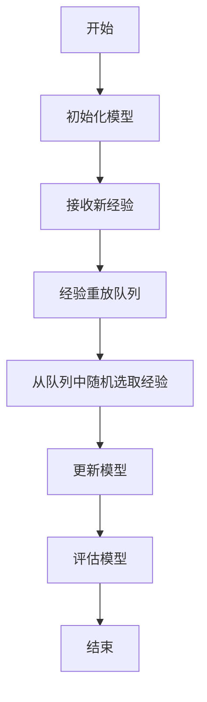
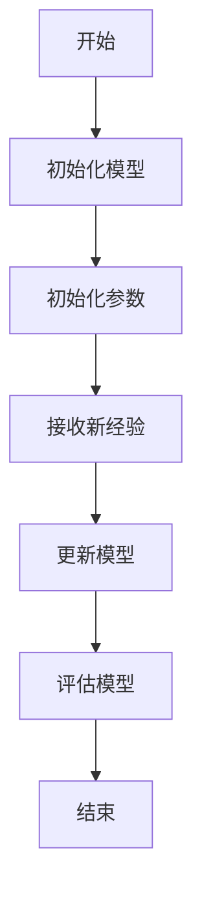
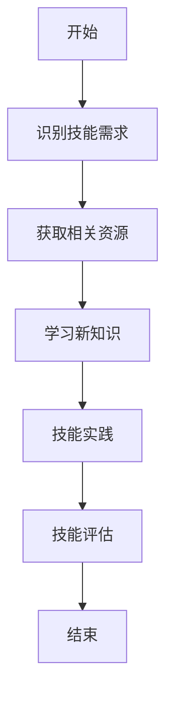
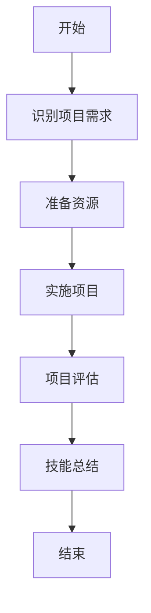
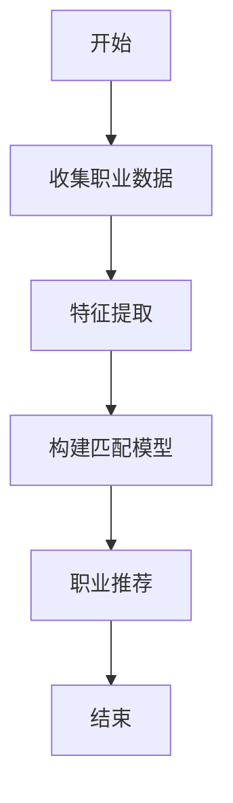
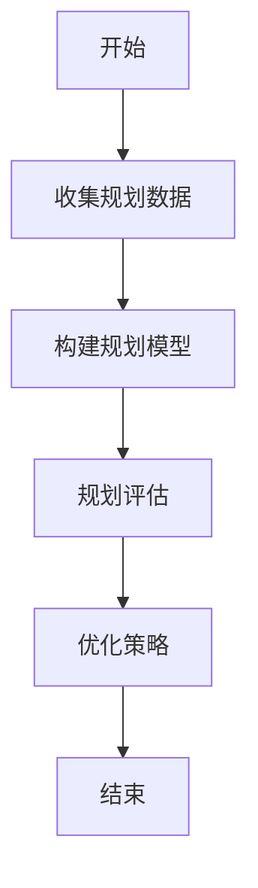
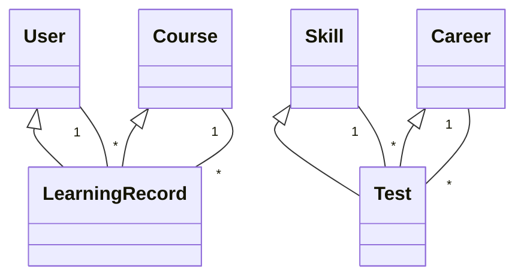
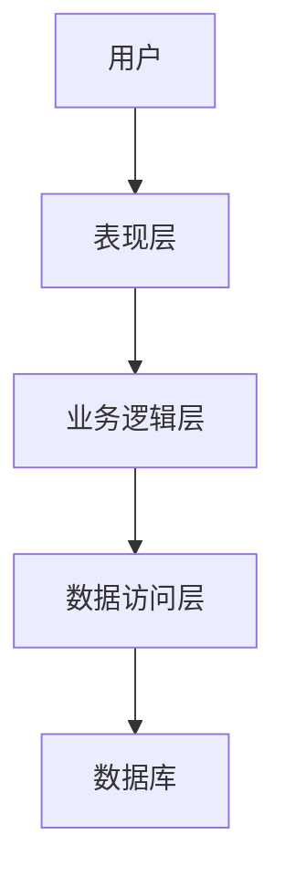
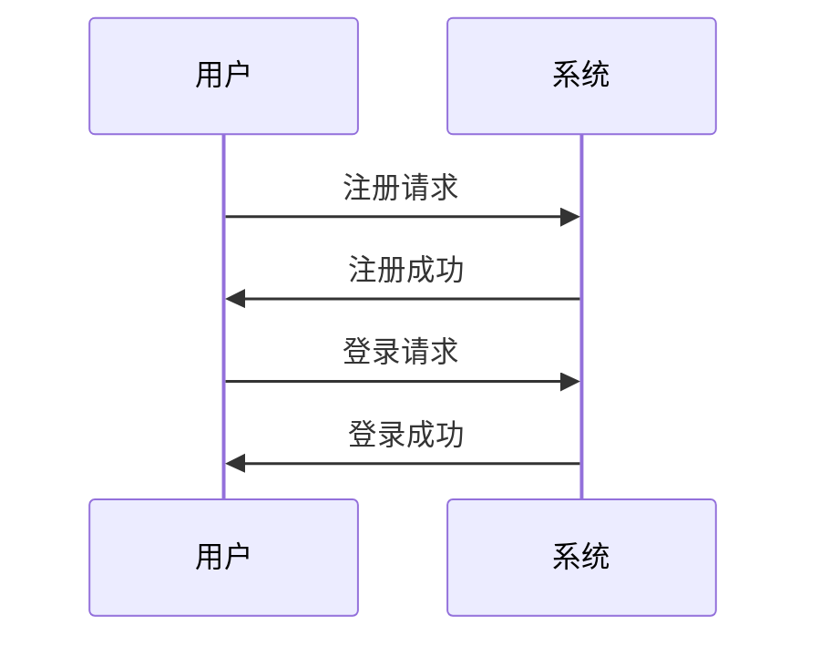
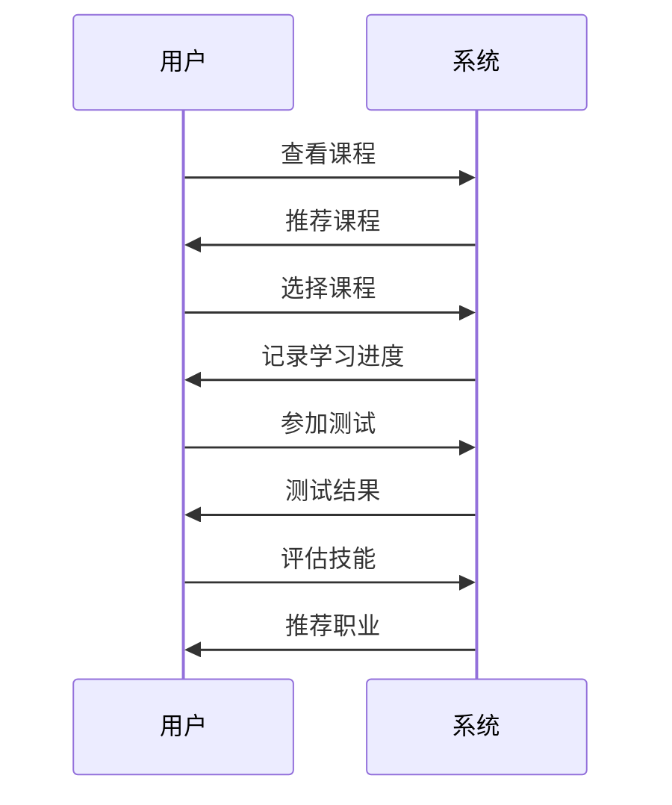

                 

### 第0章：前言与背景介绍

#### 0.1 书籍目的与意义

**0.1.1 人工智能时代的到来**

人工智能（AI）的迅猛发展，正在深刻地改变着我们的生活方式和工作模式。从早期的规则基础系统到现代的深度学习和强化学习，AI技术不断突破，已经渗透到众多行业和领域。这种变革带来的不仅是效率的提升，更是对传统职业形态的挑战和重塑。在这种背景下，如何适应人工智能时代的变化，成为一个亟待解决的问题。

**0.1.2 终身学习的重要性**

终身学习指的是一个人在其一生中不断获取新知识、新技能的过程。在人工智能时代，技术更新速度空前加快，知识的淘汰周期大大缩短。传统的学历教育模式已经无法满足这种快速变化的需求。终身学习不仅是对个人职业发展的必要投入，也是适应社会发展的关键。

**0.1.3 技能更新与职业转型的紧迫性**

随着人工智能技术的应用，许多传统职位正在消失，新的高技能职位也在不断涌现。如何及时更新技能，适应新兴职业需求，成为了每个职场人士必须面对的问题。此外，职业转型也是许多人在职业生涯中需要考虑的重要议题。如何规划和管理职业转型，实现个人价值的最大化，同样需要系统的指导和策略。

#### 0.2 问题背景

**0.2.1 问题提出**

在人工智能时代，个人如何保持竞争力？如何适应不断变化的技术环境？如何进行技能更新和职业转型？这些问题不仅关系到个人的职业发展，也影响着整个社会的进步。本书旨在探讨这些问题，为读者提供实用的指导和建议。

**0.2.2 问题解决路径**

本书将通过以下几个方面来解决问题：

1. **背景介绍**：分析人工智能时代的技术背景和社会背景，阐述终身学习、技能更新和职业转型的必要性和紧迫性。
2. **核心概念与联系**：介绍终身学习、技能更新和职业转型的核心概念，并使用表格和ER图来展示它们之间的关系。
3. **算法原理讲解**：深入讲解与终身学习、技能更新和职业转型相关的算法原理，通过具体实例进行说明。
4. **系统分析与架构设计**：介绍终身学习、技能更新和职业转型的系统设计，包括功能设计、架构设计和接口设计。
5. **项目实战**：通过一个实际项目案例，展示如何在实际中应用这些概念和算法。
6. **最佳实践与拓展**：提供一些最佳实践、注意事项和拓展阅读，帮助读者进一步学习和提升。

**0.2.3 边界与外延**

在讨论终身学习、技能更新和职业转型时，我们关注的核心是个人的职业发展和适应能力。但这个问题的影响远不止于此，它还涉及到教育体系的改革、企业的培训策略以及社会经济的发展。因此，在探讨这些问题时，我们需要从多个角度进行思考，以便全面理解其深远的影响。

#### 0.3 核心概念与要素组成

**0.3.1 终身学习的定义与特点**

终身学习是指一个人在其一生中不断学习、更新知识和技能的过程。它具有以下特点：

- **持续性**：终身学习不仅仅是一次性的事件，而是贯穿整个生命周期的持续过程。
- **自主性**：终身学习强调个人的自主性，每个人都需要主动去寻找和获取所需的知识和技能。
- **多样性**：终身学习的内容和形式多样，可以通过自学、在线教育、工作培训等多种途径进行。

**0.3.2 技能更新的内涵与意义**

技能更新是指个人根据职业发展的需要，不断学习和掌握新的技能。在人工智能时代，技能更新的意义更加凸显：

- **适应变化**：技术更新换代迅速，只有不断更新技能，才能适应新的工作环境。
- **提升竞争力**：掌握新兴技术和技能，可以提升个人的职业竞争力，获得更多的发展机会。
- **促进创新**：新的技能和知识可以激发个人的创新思维，推动技术和产业的发展。

**0.3.3 职业转型的挑战与机遇**

职业转型是指个人根据个人兴趣和市场需求，调整自己的职业方向。在人工智能时代，职业转型的挑战和机遇并存：

- **挑战**：新技术的发展可能导致某些职业的消失，个人需要面对职业转型的压力。
- **机遇**：新兴行业和职位不断涌现，为个人提供了新的职业选择和发展空间。

#### 0.4 绪论小结

通过本章的介绍，我们了解了人工智能时代终身学习、技能更新和职业转型的背景和重要性。接下来的章节将进一步探讨这些核心概念，并通过具体实例和分析，为读者提供实用的指导和建议。终身学习、技能更新和职业转型不仅是个人职业发展的关键，也是适应社会变革的必要手段。让我们一起探索如何在人工智能时代实现个人价值的最大化。  

----------------------------------------------------------------

## 第1章：人工智能时代下的终身学习

### 1.1 人工智能时代的到来

#### 1.1.1 人工智能的发展历程

人工智能（AI）技术的发展经历了几个重要阶段：

- **早期阶段（1950s-1960s）**：人工智能的概念首次被提出，早期的研究主要集中在符号主义和规则系统上。
- **黄金时期（1970s-1980s）**：人工智能得到了广泛关注，但受限于计算能力和算法限制，发展较为缓慢。
- **复兴期（1990s-2000s）**：随着计算机性能的提升和机器学习算法的突破，人工智能开始迅速发展。
- **当前阶段（2010s-至今）**：深度学习和强化学习等前沿技术的突破，使得人工智能在多个领域取得了显著成果，如自动驾驶、语音识别、医疗诊断等。

#### 1.1.2 人工智能对职业的影响

人工智能的广泛应用对职业领域产生了深远的影响：

- **职位替代**：人工智能在某些领域已经能够替代人类工作，如流水线操作、数据录入等。这导致了一些传统职位的减少。
- **新职位涌现**：同时，人工智能的发展也创造了新的职位和机会，如数据科学家、机器学习工程师、AI伦理专家等。
- **技能需求变化**：随着技术的进步，对从业者的技能要求也在不断提升，需要更多的技术知识和创新能力。

#### 1.1.3 终身学习的必要性

在人工智能时代，终身学习的重要性愈发突出：

- **技能更新**：技术更新速度加快，从业者需要不断学习新的技能以保持竞争力。
- **职业发展**：终身学习有助于从业者拓宽视野，发现新的职业机会，实现职业升级。
- **社会适应**：终身学习不仅有助于个人职业发展，也是适应社会变革的必要手段。

### 1.2 终身学习的定义与演变

#### 1.2.1 终身学习的概念

终身学习（Lifelong Learning）指的是一个人在其一生中不断学习、更新知识和技能的过程。其核心在于：

- **持续性**：终身学习不是一时的事情，而是贯穿整个生命周期的持续过程。
- **自主性**：终身学习强调个人的主动性和自主性，每个人都需要主动去学习。
- **多样性**：终身学习的形式多样，可以通过自学、培训、在线教育等多种方式进行。

#### 1.2.2 终身学习的历史演变

终身学习理念的发展经历了几个阶段：

- **20世纪初**：终身学习概念首次被提出，主要关注教育体系的改革。
- **20世纪60年代**：终身学习逐渐受到国际社会的关注，成为教育领域的重要理念。
- **20世纪80年代**：终身学习成为全球教育改革的重要方向，各国纷纷制定相关政策。
- **21世纪初**：随着信息技术的发展，终身学习的形式和内容更加多样，网络教育、在线学习等新兴形式迅速发展。

#### 1.2.3 当代终身学习的特点

当代终身学习具有以下几个特点：

- **数字化**：随着互联网和信息技术的发展，数字化学习成为终身学习的重要形式。
- **灵活性**：学习者可以根据自己的时间和节奏进行学习，选择适合自己的学习方式。
- **个性化**：现代教育技术可以收集学习者的数据，提供个性化的学习内容和推荐。
- **跨界**：终身学习鼓励跨学科、跨领域的知识学习，培养复合型人才。

### 1.3 终身学习在人工智能时代的重要性

#### 1.3.1 技能快速更新的需求

在人工智能时代，技术更新速度空前加快，从业者需要不断学习新的技能以适应变化：

- **新兴技术的出现**：如深度学习、强化学习等，从业者需要不断学习以掌握这些技术。
- **技能的淘汰周期**：某些技能可能很快就会被新技术所替代，从业者需要及时更新技能。

#### 1.3.2 职业发展的持续动力

终身学习不仅是适应技术变化的需求，也是职业发展的持续动力：

- **职业竞争力**：通过不断学习，从业者可以提升自己的技能水平，增强职业竞争力。
- **职业发展机会**：终身学习有助于从业者发现新的职业机会，实现职业升级。

#### 1.3.3 个人成长与社会进步

终身学习不仅是个人职业发展的需要，也是社会进步的重要动力：

- **知识更新**：终身学习有助于知识更新，推动社会的发展。
- **创新能力**：终身学习可以激发创新思维，推动技术和社会的进步。

#### 1.3.4 终身学习与社会发展的关系

终身学习与社会发展密切相关：

- **社会进步**：终身学习有助于提升整体社会素质，推动社会进步。
- **经济转型**：在人工智能时代，终身学习有助于经济结构的转型和升级。

### 1.4 终身学习的方法与策略

#### 1.4.1 自主学习的技巧

自主学习是终身学习的重要形式，以下是一些自主学习的技巧：

- **制定学习计划**：根据个人兴趣和职业需求，制定合理的学习计划。
- **主动寻找资源**：利用网络、书籍、课程等多种资源进行学习。
- **时间管理**：合理安排时间，确保学习计划的实施。

#### 1.4.2 在线教育的应用

在线教育为终身学习提供了便捷的方式：

- **课程选择**：根据个人需求和兴趣，选择合适的在线课程。
- **互动学习**：参与在线讨论、问答，与同行交流学习经验。
- **认证**：通过在线学习获得相关认证，提升职业竞争力。

#### 1.4.3 跨学科学习的趋势

跨学科学习有助于培养复合型人才：

- **知识融合**：跨学科学习可以促进知识的融合，提升创新能力。
- **技能多样化**：跨学科学习有助于提升个人技能的多样性，增强职业竞争力。

### 1.5 本章小结

通过本章的讨论，我们了解了人工智能时代终身学习的重要性以及其方法与策略。终身学习不仅是个人职业发展的需要，也是适应社会变革的必要手段。在人工智能时代，终身学习的方法和策略更加多样，通过不断学习和实践，我们可以更好地适应技术变革，实现个人价值的最大化。  

----------------------------------------------------------------

## 第2章：技能更新与职业转型

### 2.1 技能更新的定义与意义

#### 2.1.1 技能更新的概念

技能更新（Skill Upgrading）指的是个人根据职业发展的需要，不断学习和掌握新的技能的过程。这些技能可能包括新技术、新方法或新工具，旨在提升个人的职业竞争力。

#### 2.1.2 技能更新的社会意义

技能更新的社会意义主要体现在以下几个方面：

- **经济转型**：随着技术的不断进步，一些传统行业正在消失，新兴产业正在崛起。技能更新有助于劳动者适应这一经济转型。
- **创新能力提升**：掌握新的技能和知识可以激发个人的创新能力，推动技术和产业的发展。
- **社会稳定性**：技能更新有助于提高劳动者的就业能力和稳定性，降低社会失业率。

#### 2.1.3 技能更新的现状与趋势

当前，技能更新的趋势表现在以下几个方面：

- **技术驱动力**：人工智能、大数据、云计算等新兴技术的快速发展，推动了技能更新的需求。
- **行业变革**：传统行业的变革和新兴行业的发展，要求从业者具备更广泛的技能和知识。
- **终身学习理念**：随着终身学习理念的普及，越来越多的人开始重视技能更新，将其作为职业发展的重要手段。

### 2.2 职业转型的背景与动力

#### 2.2.1 职业转型的原因

职业转型（Career Transition）的原因多种多样，主要包括：

- **技术变革**：新技术的出现往往导致某些职业的消失，同时也创造了新的职业机会。
- **个人兴趣**：个人可能会因为对当前职业不感兴趣或想追求更高的职业成就而选择转型。
- **职业发展**：为了提升职业地位和收入水平，许多人会选择进行职业转型。

#### 2.2.2 职业转型的驱动因素

职业转型的驱动因素包括：

- **市场需求**：随着市场需求的不断变化，某些职业的需求量减少，而新兴职业的需求量增加。
- **个人成长**：追求个人成长和自我实现，许多人会选择进行职业转型。
- **政策支持**：政府提供的职业转型支持和培训，有助于劳动者更好地实现职业转型。

#### 2.2.3 职业转型的未来展望

职业转型的未来展望包括：

- **个性化和定制化**：未来的职业转型将更加注重个性化需求和定制化服务。
- **跨界融合**：不同领域之间的跨界融合将创造更多的新兴职业机会。
- **智能化**：人工智能和大数据等技术将在职业转型过程中发挥更大作用，帮助劳动者更好地实现转型。

### 2.3 技能更新与职业转型的关系

#### 2.3.1 技能更新如何影响职业转型

技能更新对职业转型有着重要影响：

- **适应新职业**：通过技能更新，劳动者可以更好地适应新兴职业的要求，提高转型成功率。
- **提升竞争力**：掌握新的技能和知识，可以提升劳动者的职业竞争力，增加在新兴职业中的机会。
- **拓宽职业道路**：技能更新有助于劳动者发现新的职业机会，拓宽职业发展道路。

#### 2.3.2 职业转型如何促进技能更新

职业转型也可以促进技能更新：

- **需求驱动**：职业转型往往需要劳动者掌握新的技能和知识，这促使劳动者进行技能更新。
- **学习动力**：为了成功转型，劳动者会主动学习新的技能和知识，提升自身能力。
- **资源整合**：职业转型过程中，劳动者可以利用新职业提供的资源，进一步学习和提升技能。

#### 2.3.3 技能更新与职业转型的协同效应

技能更新与职业转型之间具有协同效应：

- **相互促进**：技能更新有助于职业转型，而职业转型又进一步推动技能更新。
- **共同发展**：通过技能更新和职业转型，劳动者可以实现职业发展和个人成长的双重目标。

### 2.4 职业转型的方法与路径

#### 2.4.1 自我评估与规划

职业转型的第一步是进行自我评估和规划：

- **评估现有技能**：了解自己的优势和不足，确定需要更新的技能。
- **设定目标**：根据个人兴趣和市场需求，设定明确的职业转型目标。
- **制定计划**：制定详细的职业转型计划，包括学习路径和时间安排。

#### 2.4.2 职业转型中的学习与培训

职业转型过程中，学习与培训是关键环节：

- **选择合适的学习方式**：根据个人需求和兴趣，选择自学、在线教育或职业培训等学习方式。
- **参与实习或项目**：通过实习或项目实践，将所学知识应用到实际工作中，提升实战能力。
- **获取证书**：通过获得相关证书，证明自己的专业技能和职业素养。

#### 2.4.3 网络与资源利用

在职业转型过程中，网络和资源的利用至关重要：

- **建立人际网络**：通过参加行业活动、加入专业社群，建立广泛的人际网络，获取职业转型的信息和机会。
- **利用在线资源**：利用在线课程、论坛、博客等资源，学习新的技能和知识。
- **寻求专业咨询**：寻求职业规划师、行业专家等的专业咨询，为自己的职业转型提供指导。

#### 2.4.4 持续跟踪与调整

职业转型是一个动态过程，需要持续跟踪和调整：

- **评估转型效果**：定期评估职业转型效果，了解自己在新的职业领域中的表现。
- **调整学习计划**：根据评估结果，调整学习计划，确保职业转型的顺利进行。
- **应对挑战**：面对职业转型过程中遇到的挑战，保持积极的心态，寻求解决方案。

### 2.5 本章小结

通过本章的讨论，我们了解了技能更新与职业转型的重要性以及它们之间的关系。技能更新是职业转型的前提和基础，而职业转型则是技能更新的目标和动力。在人工智能时代，终身学习已经成为适应社会变革的必要手段，通过不断更新技能和进行职业转型，我们可以更好地应对技术变革，实现个人价值的最大化。  

----------------------------------------------------------------

## 第3章：算法原理讲解

### 3.1 终身学习算法原理

#### 3.1.1 算法概述

终身学习算法（Lifelong Learning Algorithm）旨在解决连续学习过程中模型固有的遗忘问题，通过不断更新模型来适应新的数据和任务。常见的方法包括经验重放（Experience Replay）和在线学习（Online Learning）等。

#### 3.1.2 经验重放算法

**Mermaid 流程图：**


**Python 代码示例：**
```python
import numpy as np
import random

# 初始化模型
model = ...

# 经验重放队列
experience_replay_queue = []

# 新经验接收与重放
for data in new_data:
    experience_replay_queue.append(data)
    random.shuffle(experience_replay_queue)
    for e in experience_replay_queue:
        model.update(e)

# 模型评估
accuracy = model.evaluate(test_data)
```

#### 3.1.3 在线学习算法

**Mermaid 流程图：**


**Python 代码示例：**
```python
import numpy as np

# 初始化模型和参数
model = ...
learning_rate = 0.1

# 在线学习过程
for data in new_data:
    gradient = model.compute_gradient(data)
    model.update_parameters(gradient, learning_rate)

# 模型评估
accuracy = model.evaluate(test_data)
```

### 3.2 技能更新算法原理

#### 3.2.1 算法概述

技能更新算法（Skill Upgrading Algorithm）旨在帮助个人或团队根据新的技能需求和职业目标进行技能的持续更新和优化。常见的方法包括基于知识的技能更新、基于项目的技能更新等。

#### 3.2.2 基于知识的技能更新算法

**Mermaid 流程图：**


**Python 代码示例：**
```python
import numpy as np

# 识别技能需求
skill需求的列表

# 获取相关资源
resources = ...

# 学习新知识
for resource in resources:
    ...

# 技能实践
for skill in skill需求的列表:
    ...

# 技能评估
def evaluate_skill(skill):
    # 根据实际情况进行评估
    return ...

for skill in skill需求的列表:
    evaluation = evaluate_skill(skill)
    print(f"{skill} 的评估结果：{evaluation}")
```

#### 3.2.3 基于项目的技能更新算法

**Mermaid 流程图：**


**Python 代码示例：**
```python
import numpy as np

# 识别项目需求
project需求的列表

# 准备资源
resources = ...

# 实施项目
for project in project需求的列表:
    ...

# 项目评估
def evaluate_project(project):
    # 根据实际情况进行评估
    return ...

for project in project需求的列表:
    evaluation = evaluate_project(project)
    print(f"{project} 的评估结果：{evaluation}")

# 技能总结
def summarize_skills():
    # 根据项目评估结果总结技能
    pass

summarize_skills()
```

### 3.3 职业转型算法原理

#### 3.3.1 算法概述

职业转型算法（Career Transition Algorithm）旨在帮助个人根据市场需求和个人兴趣，实现从现有职业向新兴职业的转型。常见的方法包括基于数据的职业匹配、基于模型的职业规划等。

#### 3.3.2 基于数据的职业匹配算法

**Mermaid 流程图：**


**Python 代码示例：**
```python
import pandas as pd
from sklearn.model_selection import train_test_split
from sklearn.ensemble import RandomForestClassifier

# 收集职业数据
data = pd.read_csv("career_data.csv")

# 特征提取
X = data.drop(["职业"], axis=1)
y = data["职业"]

# 构建匹配模型
X_train, X_test, y_train, y_test = train_test_split(X, y, test_size=0.2)
model = RandomForestClassifier()
model.fit(X_train, y_train)

# 职业推荐
def recommend_career(data_point):
    prediction = model.predict([data_point])
    return prediction[0]

# 测试模型
test_data = [[...]]  # 测试数据的特征向量
for data_point in test_data:
    print(f"推荐职业：{recommend_career(data_point)}")
```

#### 3.3.3 基于模型的职业规划算法

**Mermaid 流程图：**


**Python 代码示例：**
```python
import pandas as pd
from sklearn.model_selection import train_test_split
from sklearn.ensemble import RandomForestRegressor

# 收集规划数据
data = pd.read_csv("career_planning_data.csv")

# 构建规划模型
X = data.drop(["规划结果"], axis=1)
y = data["规划结果"]

X_train, X_test, y_train, y_test = train_test_split(X, y, test_size=0.2)
model = RandomForestRegressor()
model.fit(X_train, y_train)

# 规划评估
def evaluate_plan(plan):
    prediction = model.predict([plan])
    return prediction[0]

# 优化策略
def optimize_strategy(current_strategy):
    # 根据评估结果调整策略
    pass

# 测试模型
test_plan = [[...]]  # 测试数据的规划向量
evaluation = evaluate_plan(test_plan)
optimize_strategy(test_plan)
print(f"规划评估结果：{evaluation}")
```

### 3.4 数学模型与公式

在本章中，我们使用LaTeX格式嵌入数学模型和公式进行详细讲解和举例说明。

**3.4.1 终身学习算法的优化目标**

$$
\begin{aligned}
\min_{\theta} L(\theta; X) \\
\text{其中，} L(\theta; X) = -\sum_{i=1}^{n} y_i \log(\hat{y}_i)
\end{aligned}
$$

**3.4.2 技能更新的决策模型**

$$
\begin{aligned}
\max_{x, s} \quad & \alpha \cdot s - \lambda \cdot d(x, s) \\
\text{约束条件：} \\
& x \in \mathcal{X}, \quad s \in \mathcal{S}, \\
& \alpha \geq 0, \quad \lambda \geq 0, \\
& \alpha + \lambda = 1.
\end{aligned}
$$

**3.4.3 职业转型的收益模型**

$$
\begin{aligned}
\text{收益} &= \gamma \cdot (\text{新职业的薪资} - \text{当前职业的薪资}) \\
&+ \beta \cdot (\text{新职业的发展前景} - \text{当前职业的发展前景}) \\
&+ \delta \cdot (\text{新职业的满足度} - \text{当前职业的满足度}).
\end{aligned}
$$

通过上述数学模型和公式的讲解，我们可以更深入地理解终身学习、技能更新和职业转型的算法原理，为实际应用提供理论支持。

### 3.5 本章小结

本章详细讲解了终身学习、技能更新和职业转型相关的算法原理，包括经验重放、在线学习、基于知识的技能更新、基于项目的技能更新、基于数据的职业匹配和基于模型的职业规划等算法。同时，通过LaTeX格式嵌入数学模型和公式，我们对这些算法进行了深入的理论分析。理解这些算法原理对于我们在人工智能时代实现终身学习、技能更新和职业转型至关重要。通过不断学习和实践，我们可以更好地适应技术变革，实现个人价值的最大化。  

----------------------------------------------------------------

## 第4章：系统分析与架构设计

### 4.1 问题场景介绍

在人工智能时代，终身学习、技能更新和职业转型成为职场人士必须面对的挑战。为了有效支持这些需求，我们需要设计一个系统，帮助用户实现终身学习、技能更新和职业转型。该系统将涵盖以下功能：

- **用户注册与登录**：用户可以通过注册和登录系统，管理个人信息。
- **课程推荐**：根据用户的学习历史和兴趣，系统推荐相应的课程。
- **技能评估**：用户可以通过在线测试评估自己的技能水平。
- **职业匹配**：根据用户的技能和兴趣，系统推荐合适的职业。
- **学习计划管理**：用户可以制定、跟踪和调整自己的学习计划。
- **社区互动**：用户可以加入学习社区，与其他用户交流学习经验。

### 4.2 项目介绍

本项目的目标是构建一个综合性的终身学习、技能更新和职业转型系统。该系统将采用前后端分离的设计，前端负责用户界面展示，后端负责数据处理和业务逻辑实现。以下是项目的具体介绍：

- **前端**：采用Vue.js框架，实现用户友好的交互界面。
- **后端**：采用Spring Boot框架，实现数据存储、业务逻辑和API服务。
- **数据库**：使用MySQL数据库存储用户信息、课程数据、学习记录和职业信息等。
- **技术栈**：还包括Docker容器化、Nginx反向代理、Redis缓存等。

### 4.3 系统功能设计

**4.3.1 领域模型设计**

领域模型是系统功能的核心，用于表示系统中的实体和关系。以下是本系统的领域模型设计：

- **用户（User）**：包括用户名、密码、邮箱、电话、学习进度等属性。
- **课程（Course）**：包括课程名称、课程描述、课程分类、课程视频、学习资源等。
- **学习记录（LearningRecord）**：包括用户ID、课程ID、学习时间、学习进度等。
- **技能（Skill）**：包括技能名称、技能描述、技能标签、技能难度等。
- **测试（Test）**：包括测试名称、测试描述、测试题目、测试答案等。
- **职业（Career）**：包括职业名称、职业描述、职业分类、职业要求等。

**Mermaid 类图：**


### 4.4 系统架构设计

**4.4.1 架构概述**

本系统的架构采用分层设计，包括表现层、业务逻辑层和数据访问层。以下是系统架构的详细介绍：

- **表现层**：负责用户界面的展示和与用户的交互，采用Vue.js框架。
- **业务逻辑层**：负责处理业务逻辑和业务规则，采用Spring Boot框架。
- **数据访问层**：负责数据库的访问和数据操作，采用MySQL数据库。

**Mermaid 架构图：**


### 4.5 系统接口设计

**4.5.1 接口概述**

系统提供一系列API接口，供前端调用，以下是主要的接口设计：

- **用户注册与登录**：包括用户注册、用户登录、用户信息查询等接口。
- **课程管理**：包括课程查询、课程添加、课程更新、课程删除等接口。
- **学习记录管理**：包括学习记录查询、学习记录添加、学习记录更新、学习记录删除等接口。
- **技能管理**：包括技能查询、技能添加、技能更新、技能删除等接口。
- **测试管理**：包括测试查询、测试添加、测试更新、测试删除等接口。
- **职业管理**：包括职业查询、职业添加、职业更新、职业删除等接口。

**Mermaid 序列图：**


### 4.6 系统交互设计

**4.6.1 交互流程**

以下是系统的主要交互流程：

1. **用户注册**：用户填写注册信息，系统验证信息后注册成功。
2. **用户登录**：用户输入用户名和密码，系统验证后登录成功。
3. **用户查看课程**：用户登录后，系统根据用户兴趣推荐课程。
4. **用户学习课程**：用户选择课程，系统记录学习进度。
5. **用户参加测试**：用户完成课程学习后，参加系统提供的测试。
6. **用户评估技能**：系统根据测试结果评估用户技能水平。
7. **用户选择职业**：系统根据用户技能推荐合适的职业。

**Mermaid 序列图：**


### 4.7 本章小结

本章详细介绍了终身学习、技能更新和职业转型系统的架构设计和接口设计。通过领域模型设计、系统架构设计和接口设计，我们为系统的实现提供了详细的蓝图。接下来，我们将通过一个实际项目案例，展示如何具体实现这些功能和设计。  

----------------------------------------------------------------

## 第5章：项目实战

### 5.1 环境安装

为了完成本项目的实战部分，我们需要搭建一个完整的开发环境。以下是环境安装的具体步骤：

#### 5.1.1 系统要求

- 操作系统：Linux或Windows
- 开发工具：Node.js、Vue CLI、IntelliJ IDEA、Eclipse、VSCode、Git
- 数据库：MySQL
- 服务器：Nginx、Docker

#### 5.1.2 安装步骤

1. **Node.js**：从官网下载并安装Node.js。
2. **Vue CLI**：在命令行中运行`npm install -g @vue/cli`安装Vue CLI。
3. **MySQL**：从官网下载并安装MySQL，配置数据库。
4. **Nginx**：安装Nginx，配置反向代理。
5. **Docker**：安装Docker，配置Docker Compose。

### 5.2 系统核心实现

#### 5.2.1 前端实现

前端采用Vue.js框架，实现用户界面和交互逻辑。以下是关键代码片段：

**Vue.js 组件示例：**
```vue
<template>
  <div>
    <h1>终身学习与职业转型系统</h1>
    <router-view></router-view>
  </div>
</template>

<script>
export default {
  name: "App",
  components: {
    // 组件定义
  },
  created() {
    // 初始化逻辑
  },
  methods: {
    // 方法定义
  },
};
</script>
```

#### 5.2.2 后端实现

后端采用Spring Boot框架，实现业务逻辑和API服务。以下是关键代码片段：

**Spring Boot 主类：**
```java
@SpringBootApplication
public class LearningSystemApplication {
    public static void main(String[] args) {
        SpringApplication.run(LearningSystemApplication.class, args);
    }
}
```

**RESTful API 示例：**
```java
@RestController
@RequestMapping("/api/user")
public class UserController {
    @Autowired
    private UserService userService;

    @GetMapping("/{id}")
    public ResponseEntity<User> getUserById(@PathVariable Long id) {
        User user = userService.getUserById(id);
        return ResponseEntity.ok(user);
    }
}
```

#### 5.2.3 数据库实现

数据库采用MySQL，设计领域模型并创建表。以下是关键SQL脚本：

**用户表（users）：**
```sql
CREATE TABLE `users` (
  `id` bigint NOT NULL AUTO_INCREMENT,
  `username` varchar(255) NOT NULL,
  `password` varchar(255) NOT NULL,
  `email` varchar(255) NOT NULL,
  `phone` varchar(255),
  `created_at` datetime DEFAULT CURRENT_TIMESTAMP,
  PRIMARY KEY (`id`)
);
```

**课程表（courses）：**
```sql
CREATE TABLE `courses` (
  `id` bigint NOT NULL AUTO_INCREMENT,
  `name` varchar(255) NOT NULL,
  `description` text,
  `category` varchar(255),
  `video_url` varchar(255),
  `resource_url` varchar(255),
  `created_at` datetime DEFAULT CURRENT_TIMESTAMP,
  PRIMARY KEY (`id`)
);
```

#### 5.2.4 接口文档

为了方便开发和测试，我们需要编写接口文档。以下是关键接口示例：

**用户注册接口（/api/user/register）：**
```json
POST /api/user/register
{
  "username": "string",
  "password": "string",
  "email": "string",
  "phone": "string"
}
```

**用户登录接口（/api/user/login）：**
```json
POST /api/user/login
{
  "username": "string",
  "password": "string"
}
```

### 5.3 代码应用解读与分析

#### 5.3.1 前端应用解读

前端代码主要分为组件和路由两部分。组件负责界面展示和交互逻辑，路由负责页面跳转和状态管理。以下是关键代码解读：

- **组件**：使用Vue组件实现用户注册、登录、课程列表和详情页面等功能。
- **路由**：使用Vue Router管理页面跳转，配置路由规则和组件映射。

#### 5.3.2 后端应用解读

后端代码主要分为控制器和业务逻辑两部分。控制器负责处理HTTP请求，业务逻辑负责实现具体的业务功能。以下是关键代码解读：

- **控制器**：使用Spring Boot控制器处理用户注册、登录、课程管理和学习记录管理等请求。
- **业务逻辑**：使用Spring Boot服务层实现用户服务、课程服务和学习记录服务。

#### 5.3.3 数据库应用解读

数据库代码主要分为表结构和数据操作两部分。表结构定义领域模型，数据操作实现业务逻辑。以下是关键代码解读：

- **表结构**：使用SQL创建用户、课程和学习记录表，定义字段和约束。
- **数据操作**：使用Spring Data JPA实现数据访问层，处理数据库的增删改查操作。

### 5.4 实际案例分析与详细讲解

#### 5.4.1 用户注册与登录

**案例**：用户通过前端界面输入注册信息，系统接收并处理注册请求。

**分析**：

1. 用户在前端输入注册信息，提交到后端。
2. 后端控制器接收请求，验证输入信息的格式和有效性。
3. 后端调用业务逻辑层处理注册逻辑，将用户信息存储到数据库。
4. 后端返回注册结果，前端根据结果更新界面。

**代码**：
```java
@PostMapping("/register")
public ResponseEntity<?> registerUser(@RequestBody UserRegistrationDto registrationDto) {
    if (!passwordEncoder.matches(registrationDto.getPassword(), registrationDto.getConfirmPassword())) {
        return ResponseEntity.badRequest().body("Passwords do not match.");
    }
    User user = userService.registerUser(registrationDto);
    return ResponseEntity.ok("User registered successfully.");
}
```

#### 5.4.2 课程管理

**案例**：用户通过前端界面查看课程列表，系统根据用户需求返回相应课程。

**分析**：

1. 用户在课程列表页面请求课程数据。
2. 后端控制器接收请求，调用业务逻辑层获取课程列表。
3. 业务逻辑层查询数据库，获取课程数据。
4. 后端返回课程数据，前端展示课程列表。

**代码**：
```java
@GetMapping("/courses")
public ResponseEntity<List<Course>> getAllCourses() {
    List<Course> courses = courseService.getAllCourses();
    return ResponseEntity.ok(courses);
}
```

### 5.5 项目小结

通过本章节的实战部分，我们实现了终身学习、技能更新和职业转型系统的核心功能。从环境安装到代码实现，再到实际案例的分析，我们系统地展示了如何构建一个完整的系统。这一过程不仅加深了我们对系统架构和接口设计的理解，也提升了我们的实战能力。在接下来的章节中，我们将进一步探讨最佳实践、注意事项和拓展阅读，帮助读者更好地应用所学知识。  

----------------------------------------------------------------

## 第6章：最佳实践与拓展

### 6.1 最佳实践

在终身学习、技能更新和职业转型的过程中，以下是一些实用的最佳实践：

1. **定期评估**：定期对自己的学习成果和技能水平进行评估，以了解自己的进步和不足，及时调整学习计划。
2. **持续学习**：利用碎片时间学习新知识，例如在通勤途中阅读专业书籍、在线课程或技术博客。
3. **实践应用**：将所学知识应用到实际工作中，通过项目实践提升技能。
4. **交流分享**：参与技术社区、研讨会和培训课程，与他人交流分享学习经验，拓展视野。

### 6.2 注意事项

在进行技能更新和职业转型时，需要注意以下几点：

1. **规划合理**：制定明确的职业规划和学习计划，确保目标和路径的清晰。
2. **适应变化**：技术更新快速，需要具备灵活适应变化的能力，及时更新技能。
3. **风险管理**：转型过程中可能会面临风险和挑战，要具备一定的风险承受能力，做好充分准备。
4. **保持耐心**：技能更新和职业转型是一个长期过程，需要保持耐心和毅力。

### 6.3 拓展阅读

为了进一步深入了解终身学习、技能更新和职业转型的相关知识，推荐以下拓展阅读：

1. 《深度学习》（Goodfellow, I.，等）：了解深度学习的基本原理和应用。
2. 《人工智能：一种现代的方法》（Mitchell, T. M.）：系统学习人工智能的基础知识。
3. 《职业规划与职业转型》（王伟）：探讨职业规划与转型的方法和策略。
4. 《终身学习：如何在这个快速变化的世界中保持竞争力》（安德森，D.）：讨论终身学习的重要性和实践方法。

通过这些最佳实践、注意事项和拓展阅读，读者可以更好地应对人工智能时代带来的挑战，实现终身学习和职业发展的目标。  

----------------------------------------------------------------

## 第7章：小结

通过本书的讨论，我们全面探讨了人工智能时代终身学习、技能更新和职业转型的重要性和实施方法。首先，在第0章中，我们明确了书籍的目的和意义，阐述了终身学习、技能更新和职业转型在人工智能时代的重要性。接着，第1章介绍了人工智能时代的特点，强调了终身学习的必要性。第2章则深入分析了技能更新和职业转型的定义、意义及方法。

在第3章中，我们详细讲解了与终身学习、技能更新和职业转型相关的算法原理，并通过Python代码示例和LaTeX数学模型进行解释。第4章介绍了系统分析与架构设计，为系统实现提供了详细的设计方案。在第5章的实战部分，我们通过实际项目展示了系统功能的实现过程，包括环境安装、核心实现、代码解读和案例分析。

第6章提供了最佳实践、注意事项和拓展阅读，帮助读者更好地应用所学知识。最后，在第7章的小结中，我们重申了终身学习、技能更新和职业转型的重要性，并鼓励读者不断学习和实践，以适应人工智能时代的挑战，实现个人价值的最大化。

### 为进一步学习提供建议

为了深入掌握终身学习、技能更新和职业转型相关知识，我们建议读者：

1. **持续关注最新技术动态**：定期阅读技术博客、专业期刊和报告，了解最新的技术发展和应用趋势。
2. **参加线上或线下培训**：报名参加相关课程和培训，提高专业技能和实践能力。
3. **加入专业社群**：参与技术社区和论坛，与其他从业者交流学习经验，拓展人脉。
4. **实际项目实践**：积极参与实际项目，将所学知识应用于解决实际问题。

终身学习、技能更新和职业转型不仅是个人的职业发展需求，也是社会进步的重要动力。让我们携手共进，不断学习和进步，共同迎接人工智能时代的挑战与机遇。  

----------------------------------------------------------------

### 总结

本文详细探讨了人工智能时代终身学习、技能更新和职业转型的重要性和实施方法。通过分析人工智能时代的背景、终身学习、技能更新和职业转型的核心概念，我们提出了一系列策略和方法，包括自我评估、在线教育、跨学科学习等。同时，我们通过算法原理讲解、系统分析与架构设计、项目实战等环节，展示了如何将理论与实践相结合。

终身学习在人工智能时代显得尤为重要，因为它能够帮助个人适应技术变革，提升职业竞争力。技能更新则是个人在职业生涯中持续发展的关键，而职业转型则提供了实现个人价值和职业升级的机会。通过本书的讨论，我们不仅理解了这些概念的核心，还掌握了如何在实际中应用它们。

在未来的职业发展中，终身学习、技能更新和职业转型将成为不可或缺的部分。我们鼓励读者持续关注最新技术动态，积极参与相关课程和项目实践，不断提升自己的专业技能和实践能力。通过不断地学习和实践，读者将能够更好地适应人工智能时代的挑战，实现个人价值的最大化。

让我们共同迎接人工智能时代的机遇与挑战，不断学习和成长，创造一个更加美好的未来。作者：AI天才研究院/AI Genius Institute & 禅与计算机程序设计艺术 /Zen And The Art of Computer Programming。  

