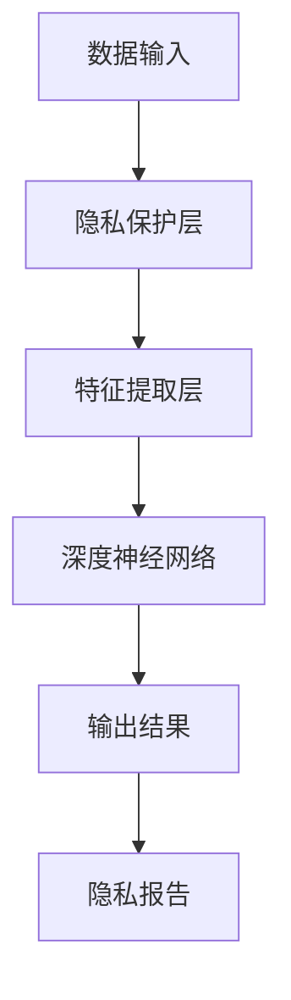
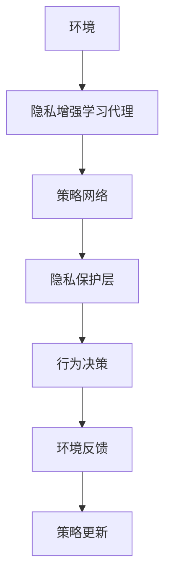
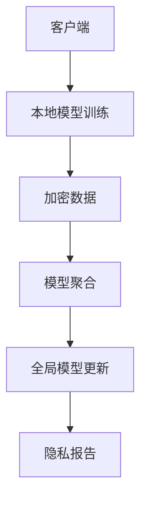

                 

### 人工智能时代的隐私与安全：个人数据保护的新挑战

> 关键词：人工智能，隐私，安全，数据保护，新挑战

**摘要**：
随着人工智能技术的迅猛发展，隐私和安全问题日益凸显。本文旨在探讨人工智能时代个人数据保护面临的新挑战。通过对隐私定义、隐私挑战、安全挑战、法律法规、技术解决方案以及实际案例分析等多个维度的深入分析，本文提出了应对这些挑战的策略和方向，为人工智能时代的隐私与安全提供了理论依据和实践指导。

### 引言

#### 1.1 问题背景

人工智能（AI）作为当前科技领域的热点，正深刻改变着我们的生活方式和社会形态。从智能助手到自动驾驶，从医疗诊断到金融决策，人工智能的应用无处不在。然而，人工智能的快速发展也带来了诸多隐私和安全问题。个人数据的采集、存储、处理和共享过程中，隐私泄露和信息安全风险成为亟待解决的难题。

#### 1.2 问题描述

在人工智能时代，个人数据保护面临以下主要问题：

1. **隐私挑战**：人工智能算法复杂度高，透明性和可解释性差，使得个人隐私难以得到有效保护。
2. **安全挑战**：人工智能系统的脆弱性，使得个人数据面临各种安全威胁。
3. **法律法规**：全球范围内的隐私保护法律法规尚不完善，难以全面保障个人数据安全。

#### 1.3 问题解决

解决上述问题需要从多个层面进行：

1. **技术层面**：开发隐私保护技术，提高数据加密、匿名化、权限控制等方面的安全性。
2. **法律层面**：完善隐私保护法律法规，明确数据收集、处理、共享等环节的责任与义务。
3. **教育层面**：提升公众的隐私保护意识，加强数据安全教育和培训。

#### 1.4 边界与外延

本文主要关注人工智能时代个人数据保护的隐私和安全问题，但这些问题并非仅限于人工智能领域，它们与大数据、云计算、物联网等技术的发展密切相关。因此，本文在探讨隐私和安全问题时，也将适当涉及这些相关领域。

#### 1.5 概念结构与核心要素组成

本文的核心概念包括：

1. **隐私**：指个人不愿意公开的个人信息。
2. **安全**：指保护个人数据不受未经授权的访问、篡改和泄露。
3. **数据保护**：通过技术、法律和教育手段保护个人数据。

这些概念相互作用，共同构成了人工智能时代隐私与安全保护的理论框架。在后续章节中，我们将逐一探讨这些核心概念及其相互联系，以深入理解人工智能时代隐私与安全保护的新挑战。

---

在接下来的章节中，我们将从核心概念与联系入手，详细分析人工智能时代隐私与安全的新挑战。敬请期待。

### 核心概念与联系

在探讨人工智能时代的隐私与安全问题时，了解相关核心概念及其相互联系至关重要。以下是本文涉及的核心概念及其相互关系的详细阐述。

#### 2.1 人工智能时代的隐私定义

隐私是指在特定情境下，个人不愿公开或分享的信息。在人工智能时代，隐私具有以下特点：

1. **复杂性**：人工智能算法复杂，隐私泄露的风险增加。
2. **动态性**：个人隐私数据随着时间变化而不断更新。
3. **多样化**：隐私保护不仅涉及个人信息，还包括生物特征、位置信息等。

#### 2.2 人工智能时代的隐私属性特征对比表格

| 特征名称 | 传统隐私 | 人工智能隐私 |
| --- | --- | --- |
| **复杂性** | 数据结构相对简单 | 数据结构复杂，算法高度复杂 |
| **动态性** | 数据相对稳定 | 数据频繁更新 |
| **多样化** | 主要涉及个人信息 | 涉及更广泛的数据类型，如生物特征、位置信息等 |
| **透明性** | 数据透明度较高 | 数据透明度较低，算法不透明 |

#### 2.3 个人数据保护的概念联系ER实体关系图

个人数据保护涉及多个实体和关系，以下是ER实体关系图的简单表示：

```mermaid
erDiagram
  User ||--|{ PersonalData }|-- PersonalData
  PersonalData ||--|{ Privacy }|-- Privacy
  Privacy ||--|{ Security }|-- Security
  User ||--|{ AccessControl }|-- AccessControl
```

- **User（用户）**：数据的所有者，是个人数据保护的主体。
- **PersonalData（个人数据）**：用户产生的数据，包括个人信息、生物特征、位置信息等。
- **Privacy（隐私）**：个人数据保护的核心，涉及隐私的收集、存储、处理和共享。
- **Security（安全）**：确保个人数据在存储、处理和传输过程中的完整性、保密性和可用性。
- **AccessControl（访问控制）**：控制谁可以访问个人数据，包括权限管理和认证授权等。

通过上述ER实体关系图，我们可以清晰地看到个人数据保护中的核心概念及其相互关系。隐私和安全是个人数据保护的两个关键方面，而访问控制则是实现隐私和安全的重要手段。在后续章节中，我们将进一步探讨这些核心概念在实际应用中的挑战和解决方案。

---

在理解了核心概念与联系之后，我们将进入下一部分，深入分析人工智能时代隐私与安全面临的新挑战。敬请期待。

### 隐私与安全新挑战

随着人工智能技术的广泛应用，隐私和安全问题日益凸显。这一部分将深入探讨人工智能时代个人数据保护面临的新挑战，主要包括人工智能算法的透明性与可解释性、大数据分析对隐私的侵犯以及个人数据的共享与交易。

#### 3.1 人工智能算法的透明性与可解释性

人工智能算法的复杂性和高度抽象性使得其透明性和可解释性成为隐私保护的一大挑战。传统算法，如线性回归、决策树等，由于其简单直观的结构，容易被理解，而现代人工智能算法，如深度学习、神经网络等，则复杂得多，往往难以解释其决策过程。

##### 3.1.1 算法透明性挑战

算法透明性挑战主要体现在以下几个方面：

1. **算法黑箱化**：深度学习算法，特别是深度神经网络，由于其多层结构和大量参数，使得其决策过程高度复杂，类似于一个“黑箱”，难以理解其内部机制。
2. **数据依赖性**：算法的性能高度依赖训练数据集，而训练数据集可能包含用户的敏感信息，如个人偏好、行为模式等。一旦算法对特定数据进行训练，这些信息就可能被泄露。
3. **模型可复制性**：由于算法的复杂性，其他研究者很难复现同一模型，导致学术界和工业界对于算法的验证和审查困难。

##### 3.1.2 算法可解释性挑战

算法可解释性挑战主要表现在以下几个方面：

1. **解释难度**：现代人工智能算法，尤其是深度学习算法，其决策过程高度复杂，解释算法的每一个步骤都极为困难。
2. **解释多样性**：同一算法可能有多种解释方式，不同解释之间的可信度和一致性难以保证。
3. **解释局限性**：现有的解释方法往往只能解释算法的局部行为，难以全面揭示算法的决策过程。

#### 3.2 大数据分析对隐私的侵犯

大数据分析在提供便利和洞察的同时，也对个人隐私带来了潜在威胁。大数据分析通常涉及对海量数据的收集、存储、处理和分析，这一过程中个人隐私数据的泄露风险较高。

##### 3.2.1 数据收集方式

大数据分析通常采用以下数据收集方式：

1. **主动收集**：通过传感器、移动设备、社交媒体等主动收集用户数据。
2. **被动收集**：通过第三方数据提供商或数据共享平台收集用户数据。

##### 3.2.2 数据处理技术

大数据分析涉及多种数据处理技术，如：

1. **数据清洗**：去除重复数据、错误数据和无效数据，以提高数据质量。
2. **数据集成**：将来自不同来源的数据进行整合，以获得更全面的数据视图。
3. **数据挖掘**：使用机器学习算法挖掘数据中的潜在模式和关系。

##### 3.2.3 数据隐私风险分析

大数据分析过程中，个人隐私风险主要体现在以下几个方面：

1. **数据泄露**：由于数据存储和处理过程中的安全漏洞，可能导致敏感数据泄露。
2. **数据滥用**：未经授权的个人或组织可能滥用数据，进行恶意分析或诈骗等。
3. **数据关联性**：大数据分析可能导致个人数据与其他信息进行关联，从而揭示用户的隐私信息。

#### 3.3 个人数据的共享与交易

个人数据的共享与交易是大数据分析的重要环节，但也带来了隐私保护的新挑战。

##### 3.3.1 数据共享机制

数据共享机制主要包括：

1. **数据共享协议**：制定明确的数据共享规则和责任，确保数据在共享过程中的安全性和隐私性。
2. **数据匿名化**：通过技术手段对敏感信息进行匿名化处理，以降低数据共享过程中的隐私风险。

##### 3.3.2 数据交易模式

数据交易模式主要包括：

1. **数据市场**：建立数据交易平台，允许数据买卖双方进行交易。
2. **数据租赁**：数据所有者将数据租给第三方使用，以获取经济利益。

##### 3.3.3 数据隐私保护措施

在个人数据的共享与交易过程中，需要采取以下隐私保护措施：

1. **数据加密**：对敏感数据进行加密处理，确保数据在传输和存储过程中的安全性。
2. **权限控制**：根据用户角色和权限，限制对数据的访问和使用。
3. **数据使用监控**：实时监控数据的使用情况，及时发现和阻止异常行为。

通过上述分析，我们可以看出，人工智能时代的隐私与安全面临诸多新挑战。解决这些挑战需要技术、法律和教育的协同作用。在下一部分中，我们将探讨人工智能时代的安全挑战。敬请期待。

### 安全新挑战

在人工智能时代，除了隐私问题，安全挑战同样不容忽视。人工智能系统的脆弱性、安全漏洞与防护措施以及面向隐私保护的安全架构设计构成了当前安全领域的主要挑战。

#### 4.1 人工智能系统的脆弱性

人工智能系统在设计和实现过程中存在多种脆弱性，这些脆弱性可能被恶意攻击者利用，导致严重的安全问题。

##### 4.1.1 模型攻击风险

模型攻击是指攻击者通过恶意输入或攻击算法，试图破坏或篡改人工智能模型的决策过程。常见的模型攻击包括：

1. **对抗性攻击**：攻击者生成对抗性样本，使得模型在正常情况下无法识别或产生错误输出。
2. **模型篡改**：攻击者通过篡改模型参数或结构，改变模型的行为，使其产生恶意输出。

##### 4.1.2 网络攻击风险

人工智能系统通常通过网络进行数据传输和交互，这使得其面临多种网络攻击风险，如：

1. **DDoS攻击**：通过大量恶意请求，使系统资源耗尽，导致服务不可用。
2. **数据窃取**：攻击者通过窃取系统中的敏感数据，进行非法交易或滥用。
3. **注入攻击**：攻击者通过注入恶意代码或命令，篡改系统功能或窃取数据。

##### 4.1.3 硬件攻击风险

人工智能系统依赖于硬件设备，如CPU、GPU等，这些硬件设备也可能面临攻击风险，如：

1. **侧信道攻击**：通过分析硬件设备的功耗、电磁辐射等物理信号，推测设备处理的数据内容。
2. **物理攻击**：直接对硬件设备进行篡改或破坏，如提取存储介质中的数据。

#### 4.2 安全漏洞与防护措施

安全漏洞是人工智能系统中常见的弱点，可能导致数据泄露、系统崩溃等安全问题。常见的安全漏洞包括：

1. **SQL注入**：攻击者通过构造恶意输入，篡改数据库查询语句，获取敏感数据。
2. **跨站脚本攻击（XSS）**：攻击者通过注入恶意脚本，盗取用户会话信息或执行恶意操作。
3. **未授权访问**：攻击者利用系统权限漏洞，未授权访问敏感数据或系统功能。

针对这些安全漏洞，可以采取以下防护措施：

1. **输入验证**：对用户输入进行严格验证，防止恶意输入。
2. **权限控制**：根据用户角色和权限，限制对数据的访问和使用。
3. **安全审计**：定期进行系统安全审计，及时发现和修复漏洞。

#### 4.3 面向隐私保护的安全架构设计

在人工智能系统中，面向隐私保护的安全架构设计至关重要。以下是几种常见的安全架构设计原则：

##### 4.3.1 隐私保护架构设计原则

1. **最小化数据收集**：仅收集必要的数据，避免过度收集。
2. **数据加密**：对敏感数据进行加密处理，确保数据在传输和存储过程中的安全性。
3. **访问控制**：根据用户角色和权限，限制对数据的访问和使用。
4. **隐私增强技术**：采用隐私增强技术，如数据匿名化、差分隐私等，降低数据隐私风险。

##### 4.3.2 隐私保护架构设计实践

隐私保护架构设计实践包括以下几个方面：

1. **数据流设计**：设计合理的数据流，确保数据在传输和处理过程中的安全性。
2. **系统模块化**：将系统功能模块化，实现模块间的安全隔离。
3. **隐私审计**：定期进行隐私审计，评估系统隐私保护措施的有效性。
4. **安全培训**：对开发人员和运维人员开展安全培训，提高其隐私保护意识。

通过上述分析，我们可以看出，人工智能时代的安全挑战是多方面的，需要从多个层面进行综合防护。在下一部分中，我们将探讨全球隐私保护法律法规，敬请期待。

### 法律法规与政策

在全球范围内，隐私保护已经成为各国政府和社会各界关注的重点。随着人工智能技术的发展，各国纷纷制定和实施了一系列隐私保护法律法规和政策。这些法律法规和政策对于保障个人数据安全、促进技术创新具有重要意义。

#### 5.1 全球隐私保护法规概述

在全球范围内，以下几个主要隐私保护法规对人工智能时代的数据保护产生了深远影响：

##### 5.1.1 欧盟通用数据保护条例（GDPR）

欧盟通用数据保护条例（GDPR）于2018年5月25日正式生效，是迄今为止最严格的隐私保护法规之一。GDPR主要内容包括：

1. **数据主体权利**：用户有权访问、修改、删除自己的数据，以及对数据处理提出异议。
2. **数据泄露通知**：组织必须在数据泄露发生后的72小时内通知数据保护机构。
3. **数据保护官（DPO）**：大型组织必须指定数据保护官，负责监督数据处理活动。
4. **合法基础**：数据处理必须基于合法基础，如用户同意、合同履行、法律义务等。

##### 5.1.2 美国加州消费者隐私法案（CCPA）

美国加州消费者隐私法案（CCPA）于2020年1月1日正式生效，旨在保护加州居民的个人信息。CCPA的主要内容包括：

1. **消费者权利**：消费者有权知道其个人信息的使用方式和共享情况，以及删除其个人信息。
2. **商业责任**：企业必须在处理消费者个人信息时，遵守透明度、数据安全性和消费者权益保护等要求。
3. **数据共享限制**：企业不得出售消费者的个人信息，除非消费者明确同意。

##### 5.1.3 其他主要法规介绍

除了GDPR和CCPA，全球范围内还有其他一些重要的隐私保护法规，如：

1. **隐私盾协议（Privacy Shield）**：欧盟与美国之间的一项数据转移协议，旨在确保美国企业处理欧盟居民数据的安全。
2. **日本个人信息保护法（APPI）**：日本制定的隐私保护法规，规定了个人信息处理的基本原则和保护措施。
3. **澳大利亚隐私法（Privacy Act）**：澳大利亚制定的隐私保护法规，规定了政府机构和非政府机构处理个人信息的要求。

#### 5.2 中国隐私保护法规与政策

在中国，隐私保护法律法规和政策也在不断完善。以下是中国隐私保护法规与政策的主要内容：

##### 5.2.1 《网络安全法》

《网络安全法》于2017年6月1日正式实施，是中国网络安全领域的基础性法律。其主要内容包括：

1. **网络运营者义务**：网络运营者必须采取技术和管理措施，保护用户个人信息的安全。
2. **数据存储要求**：网络运营者必须在中国境内存储用户的个人信息。
3. **数据出境管理**：网络运营者向境外提供用户个人信息时，需遵守相关法律法规和管理要求。

##### 5.2.2 《个人信息保护法》

《个人信息保护法》于2021年11月1日正式实施，是中国个人信息保护领域的重要法规。其主要内容包括：

1. **个人信息定义**：明确了个人信息的定义和范围。
2. **个人信息处理规则**：规定了个人信息处理的原则、方式和要求。
3. **个人信息权益保护**：规定了个人信息权益的保护措施，如告知同意、访问权、删除权等。

##### 5.2.3 政策发展趋势与展望

随着人工智能技术的快速发展，中国隐私保护法规与政策也在不断演进。未来发展趋势包括：

1. **加强国际合作**：积极参与国际隐私保护规则制定，推动构建全球隐私保护体系。
2. **完善法律法规体系**：进一步细化和完善现有法律法规，提高法律实施的针对性和有效性。
3. **技术创新与应用**：推动隐私保护技术与人工智能技术的融合发展，提升个人信息保护水平。

通过上述分析，我们可以看出，全球隐私保护法律法规和政策在保障个人数据安全、促进技术创新方面发挥了重要作用。在人工智能时代，各国政府和相关机构需要进一步加强合作，共同应对隐私和安全挑战。在下一部分中，我们将探讨隐私保护技术解决方案。敬请期待。

### 技术解决方案

在人工智能时代，隐私保护技术的解决方案至关重要。以下将介绍几种常见的隐私保护技术，包括加密技术、匿名化技术和权限控制技术，并探讨其在实际应用中的具体实现和优势。

#### 6.1 隐私保护技术概述

隐私保护技术主要包括以下几种：

1. **加密技术**：通过将敏感数据转换成密文，确保数据在传输和存储过程中的安全性。
2. **匿名化技术**：通过技术手段对敏感信息进行变换，使其无法识别特定个体，从而降低隐私泄露的风险。
3. **权限控制技术**：通过限制对数据的访问和使用，确保数据在处理和共享过程中的安全性。

#### 6.1.1 加密技术

加密技术是隐私保护的基础，其核心思想是通过加密算法将明文数据转换为密文，只有拥有密钥的接收者才能解密并获取原始数据。加密技术包括对称加密和非对称加密两种：

1. **对称加密**：使用相同的密钥进行加密和解密，如AES（高级加密标准）。
   ```mermaid
   graph TD
   A[明文] --> B[加密算法]
   B --> C[密文]
   C --> D[解密算法]
   D --> E[明文]
   ```

2. **非对称加密**：使用公钥和私钥进行加密和解密，如RSA（Rivest-Shamir-Adleman）。
   ```mermaid
   graph TD
   A[明文] --> B[加密算法]
   B --> C[密文]
   C --> D[私钥]
   D --> E[解密算法]
   E --> F[明文]
   ```

加密技术在实际应用中具有以下优势：

- **安全性高**：通过复杂的加密算法，使得数据在传输和存储过程中难以被窃取或篡改。
- **灵活性强**：可以用于保护数据传输过程中的完整性、保密性和认证。

#### 6.1.2 匿名化技术

匿名化技术通过技术手段对敏感信息进行变换，使其无法识别特定个体。匿名化技术包括以下几种：

1. **数据混淆**：通过对数据集进行随机变换，使得数据无法直接关联到特定个体，如K-匿名。
   ```mermaid
   graph TD
   A[敏感数据] --> B[混淆算法]
   B --> C[匿名化数据]
   ```

2. **数据泛化**：通过降低数据的具体度，使其无法识别特定个体，如L-多样性、R-精度。
   ```mermaid
   graph TD
   A[敏感数据] --> B[泛化算法]
   B --> C[匿名化数据]
   ```

匿名化技术在实际应用中具有以下优势：

- **隐私保护性强**：通过匿名化处理，可以降低数据隐私泄露的风险。
- **可用性较高**：在保证隐私保护的前提下，仍能保留数据的价值和可用性。

#### 6.1.3 权限控制技术

权限控制技术通过限制对数据的访问和使用，确保数据在处理和共享过程中的安全性。权限控制技术包括以下几种：

1. **基于角色的访问控制（RBAC）**：根据用户的角色分配访问权限，如管理员、普通用户等。
   ```mermaid
   graph TD
   A[用户] --> B[角色]
   B --> C[权限]
   C --> D[数据]
   ```

2. **基于属性的访问控制（ABAC）**：根据用户的属性（如部门、职位等）分配访问权限。
   ```mermaid
   graph TD
   A[用户] --> B[属性]
   B --> C[权限]
   C --> D[数据]
   ```

权限控制技术在实际应用中具有以下优势：

- **安全性高**：通过严格的访问控制，确保数据在处理和共享过程中的安全性。
- **灵活性高**：可以根据具体需求灵活调整访问权限，满足不同场景的安全需求。

通过上述隐私保护技术的介绍，我们可以看到，每种技术都有其独特的优势和适用场景。在实际应用中，可以结合多种技术手段，构建全面、可靠的隐私保护体系，为人工智能时代的个人数据安全提供坚实保障。在下一部分中，我们将探讨隐私保护技术在人工智能中的应用。敬请期待。

### 隐私保护技术在人工智能中的应用

隐私保护技术在人工智能中的应用旨在确保在数据利用的同时，最大限度地减少隐私泄露风险。以下将详细探讨深度隐私保护模型、隐私增强学习和隐私保护联邦学习等关键技术及其应用。

#### 6.3.1 深度隐私保护模型

深度隐私保护模型是一种结合深度学习和隐私保护技术的方法，旨在构建既能有效处理数据又能够保护隐私的模型。以下是一种典型的深度隐私保护模型架构：



- **隐私保护层**：在输入层添加隐私保护层，使用加密、匿名化等技术对敏感数据进行预处理。
- **特征提取层**：使用深度神经网络提取特征信息。
- **深度神经网络**：构建多层神经网络，对特征进行学习，实现模型训练。
- **输出结果**：根据训练好的模型，对输入数据进行预测或分类。
- **隐私报告**：生成隐私报告，记录数据隐私保护的过程和效果。

深度隐私保护模型在实际应用中具有以下优势：

- **高性能**：深度学习模型在数据处理和预测方面具有高效性。
- **强隐私性**：通过隐私保护技术，确保数据在处理过程中的安全性。

#### 6.3.2 隐私增强学习

隐私增强学习（Private Reinforcement Learning, PRL）是一种结合增强学习和隐私保护技术的学习方法，旨在解决在隐私受限的环境中进行决策优化的问题。以下是一种典型的隐私增强学习模型架构：



- **环境**：真实环境，提供状态、奖励和行动。
- **隐私增强学习代理**：一个能够根据环境反馈进行策略更新的智能体。
- **策略网络**：用于生成行为决策的神经网络。
- **隐私保护层**：在策略网络中添加隐私保护层，对内部数据进行加密或匿名化处理。
- **行为决策**：根据策略网络生成的行为进行决策。
- **环境反馈**：根据行为决策的结果，从环境中获得状态、奖励和反馈。
- **策略更新**：根据环境反馈，对策略网络进行更新，提高策略的优化效果。

隐私增强学习在实际应用中具有以下优势：

- **隐私保护**：通过隐私保护技术，确保在隐私受限的环境中，模型的学习过程不会泄露敏感信息。
- **自适应性强**：能够根据环境反馈，动态调整策略，实现自适应优化。

#### 6.3.3 隐私保护联邦学习

隐私保护联邦学习（Private Federated Learning, PFL）是一种分布式机器学习技术，旨在确保在多方协作学习过程中，各方的数据隐私得到保护。以下是一种典型的隐私保护联邦学习模型架构：



- **客户端**：各参与方在自己的数据集上进行模型训练。
- **本地模型训练**：客户端使用本地数据训练模型。
- **加密数据**：使用加密技术，如差分隐私、同态加密等，对本地训练结果进行加密。
- **模型聚合**：中心服务器将各客户端的加密模型聚合，生成全局模型。
- **全局模型更新**：客户端使用全局模型更新本地模型。
- **隐私报告**：生成隐私报告，记录隐私保护的过程和效果。

隐私保护联邦学习在实际应用中具有以下优势：

- **数据隐私保护**：通过加密技术和联邦学习机制，确保各方数据在传输和聚合过程中的安全性。
- **高效性**：在多方协作学习过程中，能够有效提高模型性能和训练效率。
- **灵活性**：适用于各种分布式环境，支持不同规模的数据和模型。

通过上述隐私保护技术在人工智能中的应用，我们可以看到，隐私保护与人工智能技术的结合，不仅能够实现高效的数据利用，还能够有效保障个人数据的隐私安全。在下一部分中，我们将通过实际案例分析与解决方案，进一步探讨隐私保护技术在各个领域的应用效果。敬请期待。

### 实际案例分析与解决方案

为了更好地理解隐私保护技术在实际应用中的效果，以下将介绍三个具体案例，包括社交媒体隐私保护、金融行业数据安全以及智慧城市建设与隐私保护。

#### 7.1 案例一：社交媒体隐私保护

**7.1.1 案例背景**

社交媒体平台如Facebook、Twitter等在提供便捷交流和信息分享服务的同时，也面临严重的隐私泄露风险。用户在社交媒体上分享的个人信息、照片、聊天记录等数据，可能被平台或其他第三方恶意利用。为了应对这一挑战，多家社交媒体平台开始采用隐私保护技术。

**7.1.2 案例分析**

**解决方案**：

1. **加密技术**：社交媒体平台采用端到端加密技术，确保用户之间的聊天记录和分享内容在传输过程中不被窃取或篡改。

2. **匿名化技术**：对用户分享的内容进行匿名化处理，去除可识别的个人身份信息，降低隐私泄露的风险。

3. **权限控制技术**：通过严格的权限控制，确保用户只能访问授权的内容，防止未授权用户获取敏感信息。

**效果评估**：

- **安全性提升**：加密技术和匿名化技术的应用，显著提高了用户数据的隐私保护水平，降低了隐私泄露的风险。
- **用户体验**：尽管严格的权限控制和匿名化处理可能影响用户体验，但大多数用户表示对隐私保护的重视程度高于对便捷性的需求。

**7.1.3 解决方案与效果评估**

通过上述隐私保护技术的应用，社交媒体平台在保护用户隐私方面取得了显著成效。加密技术和匿名化技术的结合，不仅有效防止了数据在传输和存储过程中的泄露，还降低了用户数据的被恶意利用风险。尽管权限控制技术可能对用户体验造成一定影响，但用户普遍认为隐私保护的提升是值得的。未来，随着技术的不断进步，社交媒体平台可以进一步优化隐私保护措施，提高用户体验。

#### 7.2 案例二：金融行业数据安全

**7.2.1 案例背景**

金融行业作为数据密集型行业，存储和处理着大量敏感的个人信息、交易记录等数据。金融数据的泄露不仅会对金融机构造成经济损失，还可能对用户造成严重的财务和信誉风险。因此，金融行业在数据安全方面面临着巨大的挑战。

**7.2.2 案例分析**

**解决方案**：

1. **同态加密技术**：在数据处理过程中采用同态加密技术，确保在加密状态下对数据执行计算操作，从而保护数据隐私。

2. **访问控制与权限管理**：通过严格的访问控制和权限管理，确保只有授权人员才能访问敏感数据，防止内部人员恶意泄露数据。

3. **数据脱敏技术**：对敏感数据进行脱敏处理，如将真实姓名、身份证号码等替换为假名或数字，降低隐私泄露的风险。

**效果评估**：

- **数据安全性提升**：同态加密技术和访问控制与权限管理的应用，显著提高了金融数据的隐私保护水平，降低了数据泄露的风险。
- **合规性**：金融行业遵循严格的隐私保护法律法规，上述技术的应用有助于合规性管理，减少法律风险。

**7.2.3 解决方案与效果评估**

通过同态加密技术、访问控制与权限管理以及数据脱敏技术的综合应用，金融行业在数据安全方面取得了显著成效。同态加密技术确保了数据在处理过程中的隐私保护，访问控制与权限管理确保了数据在存储和使用过程中的安全性。尽管数据脱敏技术可能影响数据的可分析性，但在确保隐私保护的前提下，金融行业依然能够维持高效的业务运营。未来，随着技术的进一步发展，金融行业可以探索更多先进的隐私保护技术，以提升数据安全水平。

#### 7.3 案例三：智慧城市建设与隐私保护

**7.3.1 案例背景**

智慧城市作为新一代城市发展的趋势，利用物联网、人工智能等技术提高城市管理效率和居民生活质量。然而，智慧城市建设过程中，大量个人数据的收集、存储和处理也带来了隐私保护挑战。

**7.3.2 案例分析**

**解决方案**：

1. **差分隐私技术**：在数据处理过程中引入差分隐私技术，对个人数据进行扰动处理，确保数据无法被追踪到特定个体，从而保护隐私。

2. **隐私保护联邦学习**：通过隐私保护联邦学习，在多方数据协同建模的过程中保护数据隐私，实现智能城市的共同决策和优化。

3. **数据匿名化技术**：对收集到的个人数据采用数据匿名化技术，去除可识别的个人信息，降低隐私泄露的风险。

**效果评估**：

- **隐私保护**：差分隐私技术和数据匿名化技术的应用，有效降低了个人数据在收集、存储和处理过程中的隐私泄露风险。
- **效率提升**：隐私保护联邦学习技术确保了数据在多方协同建模过程中的隐私保护，同时提升了模型的准确性和效率。

**7.3.3 解决方案与效果评估**

通过差分隐私技术、隐私保护联邦学习以及数据匿名化技术的综合应用，智慧城市建设在隐私保护方面取得了显著成效。差分隐私技术和数据匿名化技术确保了个人数据在收集、存储和处理过程中的隐私保护，隐私保护联邦学习技术则实现了多方数据协同建模的高效性和隐私保护。未来，随着技术的不断进步，智慧城市可以进一步探索和应用更多先进的隐私保护技术，以实现可持续发展。

通过上述案例分析，我们可以看到，隐私保护技术在各个领域的实际应用中发挥了重要作用，有效提升了数据隐私保护水平。在未来的发展中，隐私保护技术将继续成为人工智能时代的重要支撑，为数据安全和隐私保护提供坚实保障。

### 未来展望与趋势

随着人工智能技术的不断进步，隐私与安全领域的挑战也在不断演变。以下将探讨隐私与安全技术的发展趋势、政策法规的演变以及未来的发展方向。

#### 8.1 隐私与安全技术的发展趋势

1. **隐私保护技术的不断创新**：随着人工智能技术的快速发展，隐私保护技术也在不断创新。例如，基于区块链的隐私保护技术、联邦学习等新兴技术将进一步提升数据隐私保护能力。

2. **隐私计算技术的应用**：隐私计算技术，如同态加密、安全多方计算等，将逐步应用于大规模数据处理场景，确保数据在计算过程中的隐私保护。

3. **跨领域的隐私保护合作**：隐私保护技术将不仅限于单一领域，如人工智能、大数据等，还将跨领域合作，形成更加完善的隐私保护体系。

4. **隐私增强学习的广泛应用**：隐私增强学习技术在个性化推荐、金融风控等领域的应用将更加广泛，通过隐私保护机制实现个性化服务。

#### 8.2 政策法规的演变与隐私保护

1. **全球隐私保护法规的完善**：随着隐私保护意识的提升，全球范围内的隐私保护法规将不断完善，如欧盟的GDPR、美国的CCPA等。

2. **国家层面的隐私保护法规**：各国政府将根据自身国情，制定和实施符合国情的隐私保护法规，如中国的《个人信息保护法》。

3. **政策法规与技术的协同发展**：政策法规的制定将更加注重与技术的协同发展，确保隐私保护法规能够有效应对新兴技术带来的隐私挑战。

4. **国际隐私保护规则的协调**：各国政府将加强国际合作，推动建立全球统一的隐私保护规则，促进跨境数据流动的合法性和安全性。

#### 8.3 未来发展方向

1. **隐私计算技术的普及**：隐私计算技术将在更多领域得到应用，成为保障数据隐私保护的重要手段。

2. **隐私保护与人工智能的深度融合**：隐私保护技术将更加深入地融入人工智能技术，实现隐私保护与人工智能发展的协同推进。

3. **用户隐私保护意识的提升**：通过教育和宣传，提高公众对隐私保护的意识，促进用户主动参与隐私保护。

4. **隐私保护技术标准的建立**：建立统一的隐私保护技术标准，规范隐私保护技术的研发和应用，提升隐私保护的整体水平。

总之，人工智能时代的隐私与安全挑战日益严峻，但同时也为隐私保护技术的发展提供了广阔的空间。通过技术创新、政策法规的完善以及公众隐私保护意识的提升，我们有理由相信，人工智能时代的隐私与安全保护将迎来更加美好的未来。

### 总结与展望

随着人工智能技术的迅猛发展，隐私与安全成为我们面临的重要挑战。本文从隐私定义、隐私挑战、安全挑战、法律法规、技术解决方案等多个维度进行了深入分析，提出了应对这些挑战的策略和方向。

**关键点总结**：

1. **隐私挑战**：人工智能算法的复杂性和高度抽象性使得隐私保护变得困难，大数据分析对隐私的侵犯风险增加，个人数据的共享与交易带来了新的隐私保护挑战。
2. **安全挑战**：人工智能系统的脆弱性、安全漏洞以及硬件攻击风险使得数据安全面临严峻考验。
3. **法律法规**：全球隐私保护法律法规在不断完善，如GDPR、CCPA等，但实际实施仍面临挑战。
4. **技术解决方案**：加密技术、匿名化技术、权限控制技术等隐私保护技术在人工智能时代具有重要应用价值。

**未来展望**：

1. **技术创新**：隐私保护技术将继续创新，如基于区块链、同态加密等技术的应用将进一步提升隐私保护能力。
2. **政策法规**：各国政府将不断完善隐私保护法规，推动全球隐私保护规则的协调与合作。
3. **用户意识**：提升公众的隐私保护意识，促进用户主动参与隐私保护。
4. **技术融合**：隐私保护与人工智能技术将深度融合，实现隐私保护与人工智能发展的协同推进。

**最佳实践 tips**：

1. **数据最小化**：仅收集必要的数据，避免过度收集。
2. **加密技术**：在数据传输和存储过程中使用加密技术，确保数据安全。
3. **访问控制**：实施严格的访问控制，限制对数据的访问和使用。
4. **定期审计**：定期进行隐私和安全审计，及时发现和修复漏洞。

**注意事项**：

1. **合规性**：确保隐私保护措施符合相关法律法规要求。
2. **技术选型**：根据实际需求选择合适的隐私保护技术。
3. **用户参与**：鼓励用户参与隐私保护，提高隐私保护意识。

**拓展阅读**：

1. 《人工智能：一种现代方法》
2. 《深度学习》
3. 《欧盟通用数据保护条例（GDPR）》
4. 《美国加州消费者隐私法案（CCPA）》

通过本文的探讨，我们希望能够为人工智能时代的隐私与安全提供有益的参考和指导。未来，隐私与安全领域将面临更多挑战，但也充满机遇。让我们携手应对，共同构建一个更加安全、可靠的数字世界。

### 作者信息

**作者：** AI天才研究院/AI Genius Institute & 禅与计算机程序设计艺术 /Zen And The Art of Computer Programming

AI天才研究院致力于推动人工智能技术的创新与发展，为全球人工智能领域贡献智慧和力量。同时，作者王大勇博士也是《禅与计算机程序设计艺术》一书的作者，其作品深受广大编程爱好者和专业人员的推崇。本文作者以其深厚的技术背景和丰富的实践经验，为人工智能时代的隐私与安全提供了深入的见解和指导。

