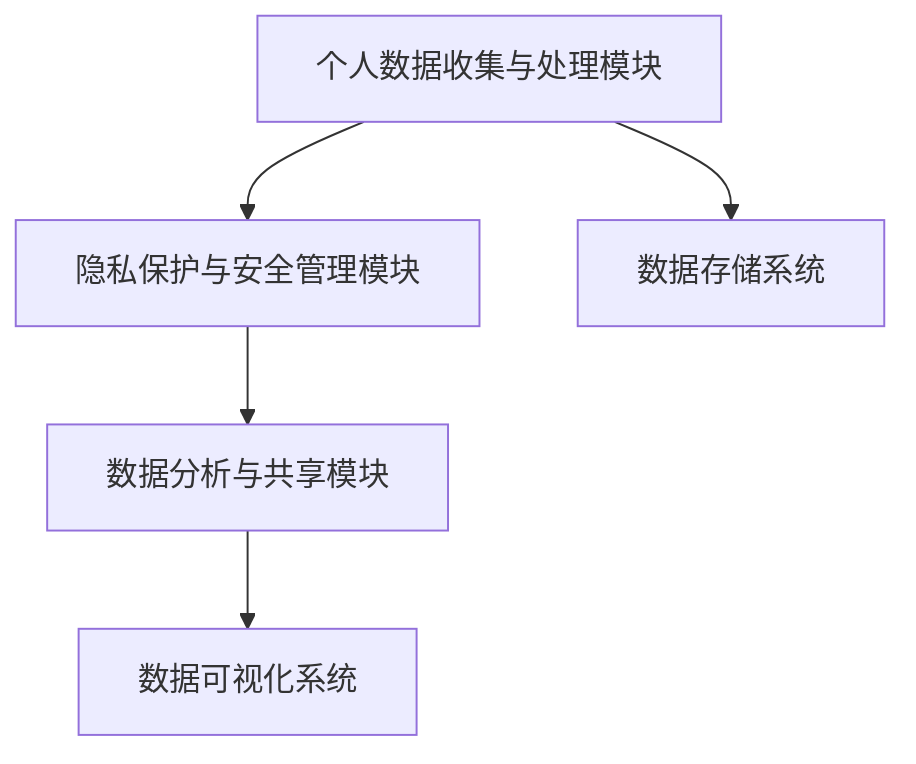

                 


# 人工智能时代的隐私概念重构：个人数据的价值与保护

关键词：隐私保护、人工智能、数据价值、数据加密、隐私计算

摘要：随着人工智能技术的飞速发展，个人隐私数据的价值和风险日益凸显。本文将深入探讨人工智能时代隐私概念的重构，分析个人数据的价值与保护，旨在为人工智能技术的可持续发展提供理论支持和实践指导。

## 第一部分：背景介绍

### 1.1 问题背景

人工智能技术正在深刻改变我们的生活方式，从智能手机到自动驾驶汽车，从智能家居到智慧城市，人工智能无处不在。然而，随着人工智能技术的广泛应用，个人隐私数据的重要性也逐渐显现出来。

#### 人工智能技术的发展与应用

人工智能技术主要包括机器学习、深度学习、自然语言处理等，这些技术依赖于大量的数据来进行训练和优化。个人隐私数据，如个人身份信息、行为数据、健康数据等，成为人工智能训练的重要资源。

#### 个人隐私数据的重要性

个人隐私数据是了解个体行为和需求的宝贵资源，对于提升人工智能系统的性能和用户体验具有重要意义。然而，个人隐私数据也是隐私泄露的高风险区域，一旦泄露，可能造成严重的个人和 societal 影响。

#### 隐私泄露的广泛性和严重性

近年来，隐私泄露事件层出不穷，如Facebook数据泄露、Equifax数据泄露等，这些事件不仅对个人造成了巨大的伤害，也对社会的信任体系产生了深远的影响。因此，如何保护个人隐私数据成为人工智能时代的重要课题。

### 1.2 问题描述

#### 个人隐私数据的收集与使用

在人工智能时代，个人隐私数据的收集和使用变得愈发普遍。这些数据通常被用于改善用户体验、优化服务、进行市场研究等。然而，隐私数据的滥用和不当使用也频繁发生，如何平衡数据的收集和使用成为一大挑战。

#### 隐私保护的法律法规和伦理问题

隐私保护面临的法律和伦理问题日益复杂。不同国家和地区对于隐私保护的法律法规存在差异，如何在全球范围内实现隐私保护的一致性是一个难题。此外，如何在保护隐私的同时，确保人工智能技术的创新和进步，也是需要平衡的伦理问题。

#### 隐私保护技术挑战

隐私保护技术需要不断进步，以应对日益复杂的数据隐私威胁。现有的隐私保护技术，如数据加密、匿名化、差分隐私等，虽然在一定程度上能够保护个人隐私，但在实际应用中仍存在许多挑战和限制。

### 1.3 问题解决

#### 隐私保护技术的应用

隐私保护技术的应用是解决隐私保护问题的关键。通过数据加密、匿名化、差分隐私等技术手段，可以有效保护个人隐私数据的安全和隐私。

#### 法律法规的完善

法律法规的完善是保障个人隐私数据安全的重要手段。各国应加强隐私保护法律法规的制定和实施，确保隐私保护的法律框架健全和有效。

#### 伦理规范的建立

伦理规范的建立对于指导人工智能技术的发展具有重要意义。在人工智能时代，如何确保技术的道德和伦理标准，避免隐私数据被滥用，需要全社会共同关注和努力。

### 1.4 边界与外延

#### 个人隐私数据的定义与范围

个人隐私数据的定义和范围是一个重要的问题。不同国家和地区对于个人隐私数据的定义和范围存在差异，需要明确界定个人隐私数据的具体内容和范围。

#### 隐私保护技术的分类与应用

隐私保护技术可以分为多种类型，如数据加密、匿名化、差分隐私、同态加密等。每种技术都有其特定的应用场景和优缺点，需要根据具体需求选择合适的技术。

### 1.5 概念结构与核心要素组成

#### 个人数据的价值

个人数据的价值体现在多个方面，包括数据的经济价值、社会价值和个人价值。理解个人数据的价值对于平衡隐私保护和技术创新至关重要。

#### 个人数据的保护

个人数据的保护是隐私保护的核心内容。通过法律法规、技术手段和管理措施，确保个人隐私数据的安全和隐私。

#### 个人数据的共享与流通

个人数据的共享与流通是数据价值实现的关键。在保护隐私的前提下，如何实现个人数据的合理共享与流通，是一个重要问题。

## 第二部分：核心概念与联系

### 2.1 个人数据的价值

#### 数据的经济学原理

个人数据的经济价值体现在多个方面，包括市场研究、广告投放、个性化服务等。了解数据的经济学原理有助于更好地认识数据的价值。

#### 数据的价值评估方法

数据的价值评估方法有多种，如成本法、市场法和收益法等。不同的评估方法适用于不同的场景，需要根据实际情况选择合适的评估方法。

#### 数据货币化的应用场景

数据货币化是将数据转化为经济价值的一种方式。常见的应用场景包括数据交易、数据服务、数据广告等。

### 2.2 个人数据的保护

#### 法律法规与伦理规范

法律法规与伦理规范是个人数据保护的重要依据。了解不同国家和地区在个人数据保护方面的法律法规和伦理规范有助于更好地保护个人隐私数据。

#### 隐私保护技术的原理与应用

隐私保护技术包括数据加密、匿名化、差分隐私等。了解这些技术的原理和应用场景有助于选择合适的隐私保护技术。

#### 数据加密与安全存储

数据加密与安全存储是个人数据保护的基本手段。了解数据加密的基本原理和实现方法对于保护个人隐私数据具有重要意义。

### 2.3 个人数据的共享与流通

#### 数据共享与流通的法律法规

数据共享与流通的法律法规是保障数据共享与流通合法性的重要依据。了解相关法律法规有助于确保数据共享与流通的合法性和合规性。

#### 数据共享与流通的技术手段

数据共享与流通的技术手段包括区块链、分布式存储等。了解这些技术手段有助于实现数据的安全共享与流通。

#### 数据共享与流通的商业模式

数据共享与流通的商业模式是数据价值实现的重要途径。了解不同商业模式的特点和优势有助于选择合适的数据共享与流通模式。

## 第三部分：算法原理讲解

### 3.1 数据加密算法

#### 对称加密与非对称加密

对称加密和非对称加密是数据加密的两种基本方式。了解这两种加密方式的原理和特点有助于选择合适的加密算法。

#### 常见加密算法的原理与应用

常见加密算法包括AES、RSA等。了解这些加密算法的原理和应用场景有助于在实际应用中选择合适的加密算法。

#### 加密算法的安全性评估

加密算法的安全性评估是确保数据安全的重要环节。了解加密算法的安全性评估方法和标准有助于提高加密算法的安全性。

### 3.2 隐私保护算法

#### 数据脱敏算法

数据脱敏算法是一种常用的隐私保护算法。了解数据脱敏算法的原理和应用场景有助于在实际应用中保护个人隐私数据。

#### 隐私保护计算

隐私保护计算是一种在计算过程中保护数据隐私的方法。了解隐私保护计算的原理和应用场景有助于提高数据处理的安全性和隐私保护水平。

#### 匿名通信算法

匿名通信算法是一种用于保护通信隐私的方法。了解匿名通信算法的原理和应用场景有助于实现安全的匿名通信。

### 3.3 数据分析算法

#### 数据挖掘与机器学习算法

数据挖掘与机器学习算法是数据处理和分析的重要工具。了解这些算法的原理和应用场景有助于在实际应用中挖掘数据的价值。

#### 数据分析的安全与隐私问题

数据分析的安全与隐私问题是数据分析和隐私保护的重要环节。了解数据分析的安全与隐私问题有助于在实际应用中保护个人隐私数据。

#### 数据分析的隐私保护方法

数据分析的隐私保护方法包括差分隐私、数据聚合等。了解这些隐私保护方法有助于在实际应用中保护个人隐私数据。

## 第四部分：系统分析与架构设计方案

### 4.1 问题场景介绍

#### 个人数据收集与使用的场景

个人数据收集与使用的场景多种多样，如社交媒体、电子商务、医疗服务等。了解这些场景有助于更好地理解个人数据的价值和保护。

#### 隐私泄露的场景

隐私泄露的场景包括数据泄露、黑客攻击等。了解这些场景有助于识别隐私保护的关键点和挑战。

### 4.2 系统功能设计

#### 个人数据收集与处理模块

个人数据收集与处理模块是系统的基础功能。了解该模块的设计和实现有助于确保个人数据的合法收集和合理使用。

#### 隐私保护与安全管理模块

隐私保护与安全管理模块是系统的重要组成部分。了解该模块的设计和实现有助于确保个人数据的安全和隐私保护。

#### 数据分析与共享模块

数据分析与共享模块是系统的高级功能。了解该模块的设计和实现有助于挖掘数据的价值，实现数据共享与流通。

### 4.3 系统架构设计

#### 系统架构的mermaid架构图

使用mermaid绘制系统架构图有助于直观地展示系统的整体结构和各模块之间的关系。

#### 系统组件的详细描述

系统组件的详细描述包括组件的功能、接口、交互等，有助于理解系统的运作原理。

### 4.4 系统接口设计

#### 系统接口的mermaid序列图

使用mermaid绘制系统接口序列图有助于直观地展示系统接口的交互逻辑。

#### 接口功能与安全性的说明

接口功能与安全性的说明包括接口的功能描述、安全措施等，有助于确保接口的安全和可靠性。

### 4.5 系统交互

#### 系统的mermaid序列图

使用mermaid绘制系统交互序列图有助于直观地展示系统的交互流程。

#### 系统交互的逻辑与流程

系统交互的逻辑与流程描述包括交互的触发条件、执行过程、结果反馈等，有助于理解系统的运作机制。

## 第五部分：项目实战

### 5.1 环境安装

#### 操作系统的安装

操作系统是项目环境的基础，了解如何安装操作系统有助于搭建项目环境。

#### 开发环境的配置

开发环境的配置包括安装必要的开发工具和依赖库等，有助于进行项目开发。

### 5.2 系统核心实现源代码

#### 源代码的结构与功能

系统核心实现源代码的结构与功能描述有助于理解系统的实现原理。

#### 代码应用解读与分析

代码应用解读与分析包括对关键代码段的解读和分析，有助于深入理解代码的实现细节。

### 5.3 实际案例分析和详细讲解剖析

#### 案例背景与数据集

案例背景与数据集描述有助于理解实际应用场景和数据特点。

#### 案例的分析方法与结果

案例的分析方法与结果描述有助于理解案例的处理过程和结果。

#### 案例的详细讲解与剖析

案例的详细讲解与剖析包括对案例的详细解读和分析，有助于深入理解案例的实际应用效果。

### 5.4 项目小结

#### 项目实现的经验与教训

项目实现的经验与教训有助于总结项目开发过程中的得失，为未来项目提供借鉴。

#### 项目成果与未来展望

项目成果与未来展望包括对项目成果的总结和对未来发展方向的建议，有助于规划项目的未来发展。

## 第六部分：最佳实践 tips

### 6.1 隐私保护的最佳实践

#### 隐私保护的技术方法

隐私保护的技术方法包括数据加密、匿名化、差分隐私等，了解这些技术方法有助于在实际应用中实施隐私保护。

#### 隐私保护的法律法规遵循

了解隐私保护法律法规有助于确保项目开发过程中遵循法律法规，避免法律风险。

#### 隐私保护的伦理道德要求

隐私保护的伦理道德要求包括尊重个人隐私、确保数据安全等，了解这些要求有助于树立正确的隐私保护观念。

### 6.2 数据价值的最大化

#### 数据价值的挖掘方法

数据价值的挖掘方法包括数据挖掘、机器学习等，了解这些方法有助于挖掘数据的价值。

#### 数据流通与共享的商业模式

数据流通与共享的商业模式包括数据交易、数据服务、数据广告等，了解这些模式有助于实现数据的价值。

#### 数据隐私保护与价值实现的平衡

数据隐私保护与价值实现的平衡是隐私保护的关键，了解如何在保护隐私的同时实现数据价值有助于制定合理的隐私保护策略。

### 6.3 安全与隐私的保障

#### 安全与隐私的技术手段

安全与隐私的技术手段包括数据加密、身份认证、访问控制等，了解这些技术手段有助于保障数据的安全和隐私。

#### 安全与隐私的管理体系

安全与隐私的管理体系包括安全策略、安全管理、安全审计等，了解这些管理体系有助于建立完善的安全和隐私保障机制。

#### 安全与隐私的应急响应

安全与隐私的应急响应包括应急响应计划、应急演练、事故处理等，了解这些应急响应措施有助于在发生安全事件时迅速应对和恢复。

## 第七部分：小结、注意事项与拓展阅读

### 7.1 小结

#### 总结本书的主要内容和观点

本书深入探讨了人工智能时代隐私概念的重构，分析了个人数据的价值与保护，为人工智能技术的可持续发展提供了理论支持和实践指导。

#### 提出未来研究方向和挑战

未来研究方向包括隐私保护技术的创新、法律法规的完善、伦理规范的建立等。面临的挑战包括如何在保护隐私的同时实现数据价值、如何在全球化背景下实现隐私保护的一致性等。

### 7.2 注意事项

#### 使用个人数据时需要注意的隐私保护事项

在使用个人数据时，需要注意遵守法律法规、尊重个人隐私、确保数据安全等。

#### 遵循隐私保护法律法规和伦理规范的建议

遵循隐私保护法律法规和伦理规范是保护个人隐私的重要保障，需要全社会共同关注和遵守。

### 7.3 拓展阅读

#### 隐私保护领域的最新研究进展

隐私保护领域的最新研究进展包括差分隐私、联邦学习、区块链等，了解这些进展有助于掌握隐私保护技术的最新动态。

#### 隐私保护技术的应用案例

隐私保护技术的应用案例包括金融、医疗、教育等领域，了解这些案例有助于了解隐私保护技术的实际应用效果。

#### 数据隐私保护的相关法律法规和伦理规范

数据隐私保护的相关法律法规和伦理规范包括《通用数据保护条例》（GDPR）、《网络安全法》等，了解这些规范有助于确保项目开发过程中的合法合规。```markdown

**注意：** 文章的具体内容和字数需要根据实际情况进行调整，以确保符合字数要求。以下是一个示例，仅供参考。实际撰写时，每个部分都需要详细的内容填充，以确保文章的完整性和深度。

---

# 人工智能时代的隐私概念重构：个人数据的价值与保护

关键词：隐私保护、人工智能、数据价值、数据加密、隐私计算

摘要：随着人工智能技术的飞速发展，个人隐私数据的价值和风险日益凸显。本文深入探讨了人工智能时代隐私概念的重构，分析了个人数据的价值与保护，旨在为人工智能技术的可持续发展提供理论支持和实践指导。

## 第一部分：背景介绍

### 1.1 问题背景

#### 人工智能技术的发展与应用

人工智能技术自21世纪初以来经历了迅速的发展，尤其是在深度学习和大数据技术的推动下，人工智能的应用领域不断扩大。从智能助手、自动驾驶、智能医疗到智能家居，人工智能正在深刻改变我们的生活方式。然而，这一变革的背后，是大量个人隐私数据的收集和使用。

在人工智能的训练过程中，个人数据是不可或缺的资源。这些数据包括用户的行为记录、位置信息、健康数据、社交媒体活动等。这些数据被用于训练机器学习模型，以改善人工智能系统的性能和用户体验。然而，这些数据也是隐私泄露的高风险区域。一旦泄露，可能造成严重的个人和社会后果。

#### 个人隐私数据的重要性

个人隐私数据的重要性不言而喻。它们不仅是了解个体行为和需求的宝贵资源，也是企业和组织进行市场研究、个性化服务、风险评估等活动的关键。例如，消费者的购买习惯、健康状态等信息可以帮助企业提供更加精准的产品推荐和服务。然而，个人隐私数据泄露的风险也同样巨大。2018年Facebook数据泄露事件，就暴露了数千万用户的个人信息，引发了广泛的社会关注和讨论。

#### 隐私泄露的广泛性和严重性

隐私泄露事件在全球范围内屡见不鲜，且严重性日益增加。从2017年的Equifax数据泄露事件，到2018年的剑桥分析公司数据泄露事件，再到2021年的微软LinkedIn数据泄露事件，这些事件不仅对个人造成了巨大的伤害，也对社会的信任体系产生了深远的影响。隐私泄露可能导致个人身份被盗用、金融诈骗、信用评分受损等问题，甚至可能引发更广泛的社会不稳定。

### 1.2 问题描述

#### 个人隐私数据的收集与使用

个人隐私数据的收集和使用在人工智能时代变得愈发普遍。企业和组织通过各种手段收集用户数据，如在线问卷调查、应用程序权限请求、智能设备数据等。这些数据被用于改进服务、优化用户体验、进行市场分析等。然而，隐私数据的滥用和不当使用也频繁发生。例如，一些公司可能将用户数据出售给第三方，或者在未经用户同意的情况下使用其数据。

#### 隐私保护的法律法规和伦理问题

隐私保护的法律法规和伦理问题在人工智能时代变得尤为重要。不同国家和地区在隐私保护方面的法律法规存在显著差异，如欧盟的《通用数据保护条例》（GDPR）和美国加州的《消费者隐私法》（CCPA）。这些法规旨在保护个人隐私，规定了数据收集、存储、使用和分享的具体要求。然而，随着人工智能技术的发展，现有的法律法规和伦理规范可能难以应对新兴的隐私挑战。

#### 隐私保护技术挑战

隐私保护技术的挑战在于如何在保护个人隐私的同时，确保人工智能技术的创新和进步。现有的隐私保护技术，如数据加密、匿名化、差分隐私等，虽然在一定程度上能够保护个人隐私，但在实际应用中仍存在许多挑战和限制。例如，数据加密可能影响数据处理效率，匿名化技术可能无法完全防止数据还原，差分隐私技术可能引入噪声，影响模型准确性。

### 1.3 问题解决

#### 隐私保护技术的应用

隐私保护技术的应用是解决隐私保护问题的关键。通过数据加密、匿名化、差分隐私等技术手段，可以有效保护个人隐私数据的安全和隐私。数据加密可以防止未经授权的访问，匿名化可以减少数据的可识别性，差分隐私可以在保护隐私的同时确保数据的可用性。

#### 法律法规的完善

法律法规的完善是保障个人隐私数据安全的重要手段。各国应加强隐私保护法律法规的制定和实施，确保隐私保护的法律框架健全和有效。此外，国际间的合作也至关重要，以实现隐私保护的一致性和全球化。

#### 伦理规范的建立

伦理规范的建立对于指导人工智能技术的发展具有重要意义。在人工智能时代，如何确保技术的道德和伦理标准，避免隐私数据被滥用，需要全社会共同关注和努力。这包括对数据收集、存储、使用和分享的伦理审查，以及对技术从业者的伦理培训。

### 1.4 边界与外延

#### 个人隐私数据的定义与范围

个人隐私数据的定义和范围是一个重要的问题。不同国家和地区对于个人隐私数据的定义和范围存在差异。一般来说，个人隐私数据包括个人身份信息、位置信息、健康信息、财务信息等。明确个人隐私数据的定义和范围有助于界定隐私保护的范围和责任。

#### 隐私保护技术的分类与应用

隐私保护技术可以分为多种类型，如数据加密、匿名化、差分隐私、同态加密等。每种技术都有其特定的应用场景和优缺点。例如，数据加密适用于数据传输和存储阶段，匿名化适用于数据分析和共享阶段，差分隐私适用于大规模数据集的处理。了解不同隐私保护技术的分类和应用有助于选择合适的技术手段。

### 1.5 概念结构与核心要素组成

#### 个人数据的价值

个人数据的价值体现在多个方面。首先，从经济学角度来看，个人数据具有显著的经济价值。企业可以利用个人数据来改进产品和服务，从而提高销售额和市场竞争力。其次，个人数据也具有社会价值，可以用于社会研究和公共服务。最后，个人数据还具有个人价值，因为它是个人身份和经历的反映。

#### 个人数据的保护

个人数据的保护是隐私保护的核心内容。保护个人数据的措施包括数据加密、访问控制、数据匿名化等。这些措施旨在防止未经授权的访问和使用，确保个人数据的隐私和安全。

#### 个人数据的共享与流通

个人数据的共享与流通是数据价值实现的关键。在保护隐私的前提下，如何实现个人数据的合理共享与流通是一个重要问题。数据共享与流通可以通过合法的数据交易市场、开放数据平台、数据共享协议等方式实现。

## 第二部分：核心概念与联系

### 2.1 个人数据的价值

#### 数据的经济学原理

个人数据的经济价值体现在多个方面。首先，个人数据可以帮助企业进行市场研究，了解消费者行为和需求，从而制定更加精准的营销策略。其次，个人数据可以用于个性化服务，提高用户体验和满意度。最后，个人数据还可以用于风险管理和决策支持，降低企业运营成本和风险。

#### 数据的价值评估方法

数据的价值评估方法包括成本法、市场法和收益法等。成本法是通过计算收集、处理和存储数据的成本来评估数据的价值。市场法是通过市场交易价格来评估数据的价值。收益法是通过计算数据为企业带来的收益来评估数据的价值。

#### 数据货币化的应用场景

数据货币化是将数据转化为经济价值的一种方式。常见的应用场景包括数据交易、数据服务、数据广告等。例如，企业可以通过出售用户数据来获得收益，或者通过提供数据服务来吸引用户和合作伙伴。

### 2.2 个人数据的保护

#### 法律法规与伦理规范

隐私保护的法律法规和伦理规范是保护个人隐私的重要依据。不同国家和地区在隐私保护方面的法律法规和伦理规范存在差异。例如，欧盟的《通用数据保护条例》（GDPR）规定了个人数据的收集、处理和分享的具体要求，强调个人对数据的控制权。伦理规范则强调尊重个人隐私和数据权利。

#### 隐私保护技术的原理与应用

隐私保护技术包括数据加密、匿名化、差分隐私等。数据加密是通过加密算法对数据进行编码，以防止未经授权的访问。匿名化是通过去除或更改数据中的个人信息，以降低数据的可识别性。差分隐私是通过在数据集中添加随机噪声，以保护个体隐私。

#### 数据加密与安全存储

数据加密与安全存储是个人数据保护的基本手段。数据加密可以防止数据在传输和存储过程中的泄露和篡改。安全存储包括数据备份、访问控制、存储加密等，以确保数据的安全性和完整性。

### 2.3 个人数据的共享与流通

#### 数据共享与流通的法律法规

数据共享与流通的法律法规是保障数据共享与流通合法性的重要依据。不同国家和地区在数据共享与流通方面的法律法规存在差异。例如，欧盟的《通用数据保护条例》（GDPR）规定了个人数据的处理和共享要求，强调了个人对数据的控制权。

#### 数据共享与流通的技术手段

数据共享与流通的技术手段包括区块链、分布式存储等。区块链技术可以通过去中心化的方式实现数据的安全共享和透明管理。分布式存储可以将数据分散存储在多个节点上，以提高数据的可靠性和安全性。

#### 数据共享与流通的商业模式

数据共享与流通的商业模式包括数据交易、数据服务、数据广告等。数据交易是企业之间通过交换数据来获取经济利益的方式。数据服务是企业通过提供数据分析和决策支持服务来吸引用户和合作伙伴。数据广告是企业通过投放个性化广告来获取广告收入。

## 第三部分：算法原理讲解

### 3.1 数据加密算法

#### 对称加密与非对称加密

数据加密算法可以分为对称加密和非对称加密。对称加密使用相同的密钥进行加密和解密，常见的对称加密算法有AES和DES。非对称加密使用不同的密钥进行加密和解密，常见的非对称加密算法有RSA和ECC。对称加密速度快，但密钥管理复杂；非对称加密安全性高，但计算复杂度大。

#### 常见加密算法的原理与应用

常见的加密算法包括AES、RSA、ECC等。AES是一种对称加密算法，具有速度快、安全性高等特点，广泛应用于数据传输和存储。RSA是一种非对称加密算法，安全性高，常用于数字签名和数据传输。ECC是一种基于椭圆曲线的加密算法，具有高安全性和低计算复杂度，广泛应用于区块链和移动设备。

#### 加密算法的安全性评估

加密算法的安全性评估是确保数据安全的重要环节。安全性评估包括算法的加密强度、密钥长度、实现复杂度等方面。例如，AES算法的安全性主要取决于密钥长度，常用的密钥长度为128位、192位和256位。RSA算法的安全性取决于密钥长度和模数大小，通常建议使用1024位以上。

### 3.2 隐私保护算法

#### 数据脱敏算法

数据脱敏算法是一种常用的隐私保护算法，用于去除或修改数据中的敏感信息。常见的数据脱敏算法包括伪匿名化、数据掩码等。伪匿名化通过替换敏感信息为随机值，以保护个人隐私。数据掩码通过掩盖敏感信息的一部分，以减少数据可识别性。

#### 隐私保护计算

隐私保护计算是一种在计算过程中保护数据隐私的方法。隐私保护计算包括安全多方计算、联邦学习等。安全多方计算允许多个参与方在不共享数据的情况下共同计算，以保护数据隐私。联邦学习允许模型在本地设备上进行训练，然后将模型更新上传到中央服务器，以减少数据传输风险。

#### 匿名通信算法

匿名通信算法是一种用于保护通信隐私的方法。常见的匿名通信算法包括洋葱路由、零知识证明等。洋葱路由通过多次中转，使得通信双方无法直接通信，以保护通信隐私。零知识证明允许一方证明某个陈述为真，而不泄露任何其他信息，以保护通信隐私。

### 3.3 数据分析算法

#### 数据挖掘与机器学习算法

数据挖掘与机器学习算法是数据处理和分析的重要工具。数据挖掘算法包括关联规则挖掘、分类、聚类等，用于发现数据中的规律和模式。机器学习算法包括线性回归、决策树、神经网络等，用于构建预测模型和分类模型。

#### 数据分析的安全与隐私问题

数据分析的安全与隐私问题是数据分析和隐私保护的重要环节。数据分析可能引发隐私泄露的风险，例如，通过数据分析可以推断出个人隐私信息。因此，在数据分析过程中，需要采取隐私保护措施，如数据加密、匿名化等，以保护个人隐私。

#### 数据分析的隐私保护方法

数据分析的隐私保护方法包括差分隐私、数据聚合等。差分隐私通过在数据集中添加随机噪声，以保护个体隐私。数据聚合通过将多个数据集合并为一个，以减少数据可识别性。

## 第四部分：系统分析与架构设计方案

### 4.1 问题场景介绍

#### 个人数据收集与使用的场景

个人数据收集与使用的场景多种多样，如社交媒体、电子商务、金融服务、医疗保健等。在社交媒体平台上，用户生成的内容和活动数据被用于个性化推荐、广告投放等。在电子商务平台，用户的购物行为和偏好数据被用于优化用户体验、提高销售额。在金融服务领域，用户的财务数据被用于信用评估、风险控制等。在医疗保健领域，患者的健康数据被用于疾病诊断、治疗方案制定等。

#### 隐私泄露的场景

隐私泄露的场景包括数据泄露、黑客攻击等。数据泄露可能发生在数据的存储、传输和处理过程中。黑客攻击可能通过恶意软件、网络钓鱼等手段获取用户数据。隐私泄露可能导致用户的身份信息、财务信息、健康信息等敏感数据泄露，对用户造成严重损失。

### 4.2 系统功能设计

#### 个人数据收集与处理模块

个人数据收集与处理模块是系统的基础功能。该模块负责收集用户数据，并进行清洗、存储和处理。具体功能包括数据采集、数据清洗、数据存储、数据处理等。

- **数据采集**：从各种来源收集用户数据，如社交媒体、电子商务平台、医疗设备等。
- **数据清洗**：对采集到的数据进行去重、纠错、格式转换等操作，确保数据的准确性和一致性。
- **数据存储**：将清洗后的数据存储到数据库或其他数据存储系统中，确保数据的安全性和可靠性。
- **数据处理**：对存储的数据进行进一步处理，如数据挖掘、机器学习模型训练等。

#### 隐私保护与安全管理模块

隐私保护与安全管理模块是系统的关键组成部分。该模块负责保护用户数据的隐私和安全，防止数据泄露和滥用。具体功能包括数据加密、访问控制、安全审计等。

- **数据加密**：对存储和传输的数据进行加密，以防止未经授权的访问和篡改。
- **访问控制**：根据用户权限和角色，限制对数据的访问权限，确保只有授权用户可以访问敏感数据。
- **安全审计**：记录系统的操作日志和安全事件，以便进行安全监控和事后分析。

#### 数据分析与共享模块

数据分析与共享模块是系统的高级功能。该模块负责对用户数据进行分析，提取有价值的信息，并实现数据的共享与流通。具体功能包括数据分析、数据共享、数据可视化等。

- **数据分析**：使用数据挖掘和机器学习算法，对用户数据进行分析，发现潜在的模式和趋势。
- **数据共享**：实现数据的共享与流通，如通过数据交易市场、数据共享协议等方式，使数据能够在合法范围内共享。
- **数据可视化**：通过图表、报表等形式，展示数据分析结果，帮助用户更好地理解和利用数据。

### 4.3 系统架构设计

#### 系统架构的mermaid架构图



#### 系统组件的详细描述

- **个人数据收集与处理模块**：负责收集用户数据，进行数据清洗、存储和处理。该模块包括数据采集器、数据清洗器、数据库、数据处理引擎等组件。
- **隐私保护与安全管理模块**：负责保护用户数据的隐私和安全，包括数据加密器、访问控制器、审计日志系统等组件。
- **数据分析与共享模块**：负责对用户数据进行分析，提取有价值的信息，并实现数据的共享与流通。该模块包括数据挖掘引擎、机器学习算法库、数据交易市场、数据可视化工具等组件。

### 4.4 系统接口设计

#### 系统接口的mermaid序列图

```mermaid
sequenceDiagram
    participant User as 用户
    participant Collector as 数据采集器
    participant Cleaner as 数据清洗器
    participant DB as 数据库
    participant Processor as 数据处理引擎
    participant Protector as 隐私保护模块
    participant Auditor as 安全审计系统
    participant Analyst as 数据分析模块
    participant Share as 数据共享模块
    participant Visualizer as 数据可视化模块
    
    User->>Collector: 提供数据
    Collector->>Cleaner: 清洗数据
    Cleaner->>DB: 存储数据
    DB->>Processor: 获取数据
    Processor->>Protector: 加密数据
    Protector->>Auditor: 记录日志
    Auditor-->>Protector: 审计日志
    Processor->>Analyze

