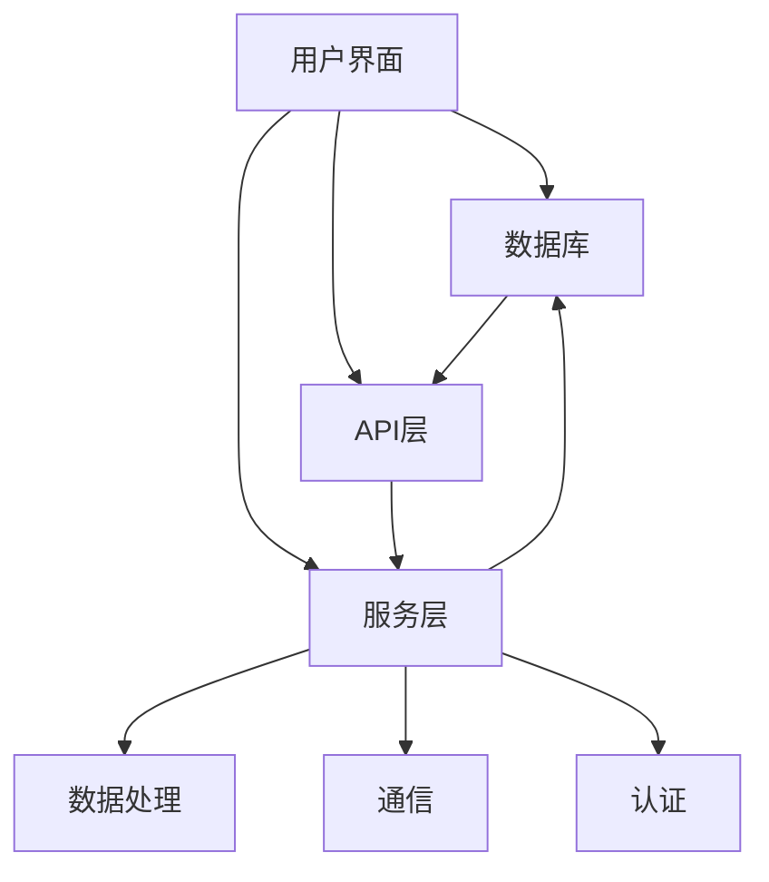
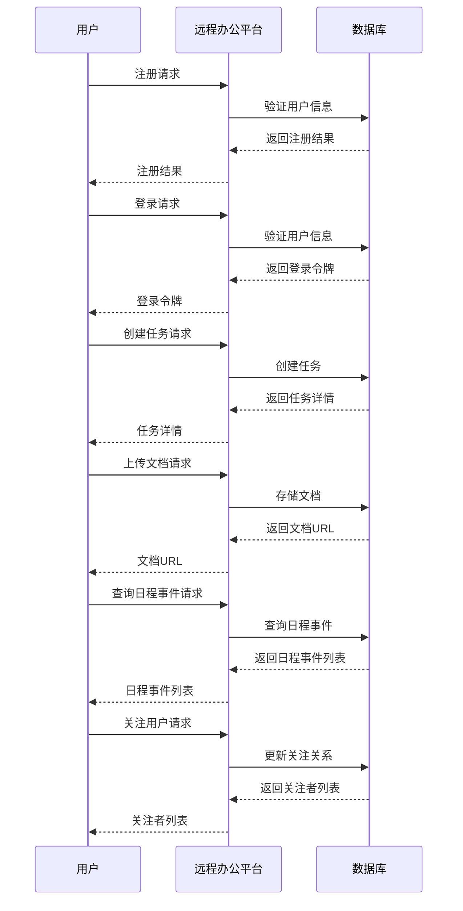
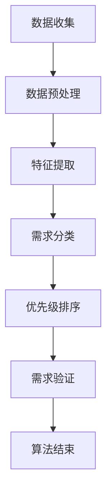

                 

## 第一部分: 背景与概述

### 1.1 问题背景

在当今信息化社会中，技术的发展已经成为推动社会进步的重要动力。然而，随着科技的飞速进步，人类与技术之间的关系也变得更加紧密。技术的不断革新不仅改变了我们的生活方式，也对人类的社会结构、价值观和文化产生了深远的影响。在这一背景下，如何平衡技术与人文之间的关系，实现技术的可持续发展，成为一个亟待解决的问题。

首先，人类与技术发展之间的互动日益增强。技术的进步使得人类能够更高效地解决问题，提高生活质量。然而，这也带来了一系列的问题，如信息过载、隐私泄露、数字鸿沟等。这些问题不仅影响了人们的日常生活，还对社会的稳定和发展构成了挑战。

其次，技术发展对社会的影响不容忽视。技术进步带来了经济增长，但同时也加剧了社会的不平等。一些技术领域的人才和企业因技术优势而获得了巨大的经济利益，而另一些群体则因为技术变革而面临失业和贫困。此外，技术的发展也改变了人类的社交模式，对人际关系和社会凝聚力产生了影响。

### 1.2 问题概述

在当前的技术环境中，技术创新已成为推动社会进步的主要动力。然而，传统的技术创新理念往往侧重于技术的先进性和实用性，而忽视了技术的伦理和人文价值。这种偏向往往导致了技术发展与社会需求之间的脱节，甚至可能引发一些负面的社会问题。因此，有必要提出一种新的创新理念，即人本主义创新理念，以实现技术与人文的有机结合。

人本主义创新理念强调以人为中心，关注技术对人类生活的影响。这种理念不仅关注技术的实用性和先进性，更注重技术的道德伦理和社会责任。在人文导向技术开发中，人本主义创新理念被具体化为一系列的原则和方法，用于指导技术的研发和应用。

人文导向技术开发旨在通过技术创新解决社会问题，提升人类生活质量。这种技术开发模式强调技术的可持续性和人文关怀，以实现技术与人类社会的和谐发展。然而，人文导向技术开发也面临着一些挑战，如如何在技术创新中平衡效率与人文价值、如何确保技术产品的可用性和可接受性等。

### 1.3 问题解决

为了实现人文导向技术开发，需要明确其目标、原则和方法。人文导向技术开发的目标是创造对人类有益的技术产品和服务，提升人类生活质量。为了实现这一目标，需要遵循以下原则：

1. **以人为本**：将人的需求和利益放在首位，确保技术产品和服务能够真正满足人类的需求。
2. **可持续性**：注重技术的可持续性，确保技术产品和服务不会对环境和社会造成负面影响。
3. **社会责任**：强调企业的社会责任，确保技术在研发和应用过程中能够积极履行社会责任。
4. **道德伦理**：遵循道德伦理原则，确保技术在研发和应用过程中不会侵犯人类的基本权利和尊严。

在明确了目标原则后，人文导向技术开发的方法也变得尤为重要。具体来说，人文导向技术开发的方法包括：

1. **用户研究**：深入了解用户的需求和痛点，确保技术产品和服务能够真正满足用户的需求。
2. **跨学科合作**：整合不同学科的知识和技能，形成创新性的解决方案。
3. **用户参与**：鼓励用户参与到技术产品的设计和开发过程中，确保技术产品能够符合用户的期望和需求。
4. **持续迭代**：通过持续迭代和改进，不断优化技术产品和服务，提升其质量和用户体验。

### 1.4 边界与外延

人文导向技术开发的应用领域非常广泛，包括但不限于以下领域：

1. **信息技术**：信息技术的发展对人类社会产生了深远的影响，人文导向技术开发可以在信息技术领域发挥重要作用，如人工智能、大数据、云计算等。
2. **医疗健康**：医疗健康领域对人类的生活质量有着直接的影响，人文导向技术开发可以在医疗设备、健康管理系统等方面发挥作用。
3. **教育**：教育是培养未来人才的重要途径，人文导向技术开发可以在教育领域提供更有效的教育工具和资源。
4. **环境保护**：环境保护是关乎人类生存的重要问题，人文导向技术开发可以在环境保护、资源利用等方面提供创新的解决方案。

与传统技术开发相比，人文导向技术开发更注重技术与人文的结合，更关注技术对社会的影响。传统技术开发往往侧重于技术的实用性和先进性，而人文导向技术开发则更注重技术的道德伦理和社会责任。这种差异使得人文导向技术开发在技术应用过程中更具有可持续性和人文关怀。

### 1.5 本章小结

本章从问题背景、问题概述、问题解决、边界与外延等多个角度对人文导向技术开发进行了全面的分析。通过本章的内容，我们可以看到，人文导向技术开发是解决当前技术发展困境的一种有效途径，它强调以人为本，注重技术的可持续性和社会责任，旨在实现技术与人文的有机结合。接下来，我们将进一步探讨人文导向技术开发的核心概念与原理，以便更好地理解和应用这一理念。让我们继续深入思考。

---

## 1.6 关键词

- 人文导向技术开发
- 人本主义创新理念
- 技术伦理
- 可持续性
- 社会责任

### 1.7 摘要

本文围绕人文导向技术开发这一主题，分析了其在当前技术发展背景下的重要性和必要性。通过探讨人本主义创新理念、技术伦理、可持续性和社会责任等核心概念，本文提出了人文导向技术开发的目标、原则和方法。同时，本文也探讨了人文导向技术开发的应用领域和与传统技术开发之间的区别，展示了其在信息技术、医疗健康、教育和环境保护等领域的广泛前景。通过本章的分析，我们认识到，人文导向技术开发是实现技术与人文有机结合、推动社会可持续发展的重要路径。

---

## 第二部分: 核心概念与原理

### 2.1 核心概念

在探讨人文导向技术开发之前，我们需要了解几个核心概念，这些概念构成了人文导向技术开发的基础。

#### 2.1.1 人本主义

人本主义（Humanism）是一种哲学思潮，强调人的尊严和价值。人本主义认为，人类是宇宙的中心，是人类自身创造了文化和社会，而不仅仅是被动地接受它们的产物。在人本主义观念中，个体的人是目的，而不是手段。人本主义对人文导向技术开发的影响在于，它强调了技术开发过程中要关注人的需求和福祉，而非仅仅追求技术的先进性和效率。

#### 2.1.2 创新理念

创新理念是指推动技术进步和发展的思想和方法。传统的创新理念往往侧重于技术本身的进步，而人本主义创新理念则强调创新应该以人为本，关注技术对人类社会的影响。这种理念鼓励将人文关怀融入技术设计中，确保技术能够造福人类。

#### 2.1.3 技术创新

技术创新是指通过新的技术手段、方法或流程来创造或改进产品、服务或过程。技术创新是推动社会进步的重要力量，但需要与人文关怀相结合，以避免技术发展带来的负面影响。

#### 2.1.4 人文导向技术开发

人文导向技术开发（Human-Oriented Technology Development）是一种以人为中心的技术开发模式，强调在技术开发过程中，要充分考虑人的需求、福祉和社会影响。这种开发模式旨在通过技术创新解决社会问题，提升人类生活质量，实现技术与人文的有机结合。

### 2.2 概念属性特征对比表格

为了更清晰地理解这些核心概念，我们可以在以下表格中对比它们的属性特征：

| 概念       | 定义                                     | 关键特征                                                      | 对人文导向技术开发的影响 |
|------------|------------------------------------------|--------------------------------------------------------------|-----------------------|
| 人本主义   | 一种哲学思潮，强调人的尊严和价值           | 尊重个体、强调人的目的性                                     | 强调以人为本，关注人的需求 |
| 创新理念   | 推动技术进步和发展的思想和方法             | 开放性、前瞻性、实践性                                       | 强调将人文关怀融入创新 |
| 技术创新   | 通过新的技术手段、方法或流程来创造或改进产品 | 创新性、实用性、风险性                                      | 是人文导向技术开发的核心 |
| 人文导向技术开发 | 以人为中心的技术开发模式                   | 以人为本、可持续性、社会责任                                 | 实现技术与人文结合 |

### 2.3 ER实体关系图架构

为了更好地理解人文导向技术开发中的核心概念和它们之间的关系，我们可以使用实体关系图（Entity-Relationship Diagram, ERD）来描述这些实体及其相互关系。

以下是一个简单的ER实体关系图，描述了人文导向技术开发中的关键实体和它们之间的关系：

```mermaid
erDiagram
  人本主义 ||--|{ 技术创新 }
  技术创新 ||--|{ 人文导向技术开发 }
  人文导向技术开发 ||--|{ 社会责任 }
```

- **人本主义**：是人文导向技术开发的理论基础，它为技术创新提供了人文关怀的维度。
- **技术创新**：是在人本主义指导下进行的，旨在通过技术手段解决社会问题。
- **人文导向技术开发**：是将人本主义和科技创新结合的具体实践，注重技术的可持续性和社会责任。

### 2.4 人文导向技术开发的数学模型

在人文导向技术开发中，数学模型可以用来量化技术对人类社会的影响，从而指导技术的研发和应用。以下是一个简化的数学模型，用于描述人文导向技术开发的过程和结果。

#### 2.4.1 技术创新的数学模型

技术创新的数学模型通常包括以下公式：

$$
\text{技术创新得分} = f(\text{技术先进性}, \text{实用性}, \text{风险性})
$$

其中，\( f \) 是一个综合评价函数，用于计算技术创新的综合得分。技术先进性、实用性和风险性是影响技术创新得分的关键因素。

#### 2.4.2 人文导向技术开发的数学模型

在人文导向技术开发中，除了考虑技术先进性、实用性和风险性外，还需要加入人文关怀的维度。因此，人文导向技术开发的数学模型可以扩展为：

$$
\text{人文导向技术创新得分} = f(\text{技术先进性}, \text{实用性}, \text{风险性}, \text{人文关怀})
$$

其中，人文关怀是衡量技术对社会和人类福祉影响的因素。一个高人文导向技术创新得分意味着技术在技术性、实用性和人文关怀方面都表现出色。

#### 2.4.3 模型的应用

这个数学模型可以应用于技术项目的评估和选择过程中。例如，一个技术团队可以在评估多个技术创新方案时，使用这个模型来计算每个方案的得分，从而选择出最符合人文导向技术开发原则的方案。

### 2.5 人文导向技术开发的理论基础

人文导向技术开发的理论基础主要包括人本主义哲学、技术创新理论和可持续发展理论。

#### 2.5.1 相关理论研究

人本主义哲学提供了人文导向技术开发的核心价值观。技术创新理论则探讨了如何通过技术手段实现社会进步。可持续发展理论则强调了技术在研发和应用过程中需要考虑环境和社会的可持续性。

#### 2.5.2 人文导向技术开发的理论体系

人文导向技术开发的理论体系可以概括为以下几点：

1. **以人为本**：确保技术产品和服务满足人的需求，提升人的福祉。
2. **可持续发展**：关注技术对环境和社会的影响，确保技术的可持续性。
3. **社会责任**：企业在技术开发和应用过程中应承担社会责任，促进社会的和谐发展。
4. **跨学科合作**：整合不同学科的知识和技能，形成创新性的解决方案。

### 2.6 本章小结

本章详细介绍了人文导向技术开发的核心概念与原理，包括人本主义、创新理念、技术创新和人文导向技术开发。通过实体关系图和数学模型，我们更好地理解了这些概念之间的关系和如何在实际技术开发中应用。接下来，我们将探讨人文导向技术开发的具体实践，以便更深入地了解这一理念在现实中的应用。

---

## 2.7 拓展阅读

1. *《人本主义心理学》（Humanistic Psychology）* - 罗杰斯（Carl Rogers）
2. *《技术创新管理》（Technology Innovation Management）* - 霍尔（Paul A. David）
3. *《可持续发展》（Sustainable Development）* - 联合国环境规划署（UNEP）
4. *《人文导向技术：超越功能主义》（Human-Centered Technology: Beyond Functionality）* - 斯图尔特（Dr. John Stuart）
5. *《技术伦理学》（Technology Ethics）* - 约翰逊（Edwin A. Johnson）## 第三部分: 人文导向技术开发实践

### 3.1 实践概述

#### 3.1.1 实践目的

人文导向技术开发实践旨在通过具体项目案例，验证和推广人本主义创新理念，实现技术与人文的有机结合。这种实践不仅关注技术创新本身，更强调技术对人类生活质量的提升和社会福祉的贡献。通过实践，我们希望展示如何在实际项目中应用人文导向技术开发原则，从而为后续的技术创新提供指导。

#### 3.1.2 实践方法

人文导向技术开发实践采用了一系列方法，包括用户研究、跨学科合作、用户参与和持续迭代。具体来说：

1. **用户研究**：通过深入调研，了解用户的需求和痛点，确保技术产品和服务能够真正满足用户的需求。
2. **跨学科合作**：整合不同学科的知识和技能，形成创新性的解决方案，例如结合心理学、社会学、计算机科学等领域的专家共同参与。
3. **用户参与**：鼓励用户参与到技术产品的设计和开发过程中，通过用户反馈不断优化产品和服务。
4. **持续迭代**：通过持续迭代和改进，不断优化技术产品和服务，提升其质量和用户体验。

#### 3.1.3 实践意义

人文导向技术开发实践具有多重意义：

1. **提升生活质量**：通过开发符合人类需求的技术产品和服务，提升人们的生活质量。
2. **促进社会和谐**：通过关注技术的社会影响，促进社会和谐发展，减少技术带来的负面影响。
3. **推动可持续发展**：注重技术的可持续性和社会责任，推动技术和社会的可持续发展。
4. **创新理念传播**：通过具体案例展示人文导向技术开发的优势，推动创新理念的传播和应用。

### 3.2 项目介绍

#### 3.2.1 项目背景

随着信息技术的飞速发展，远程工作已经成为许多企业和员工的重要选择。然而，远程工作也带来了一系列挑战，如沟通不畅、工作效率降低和团队凝聚力下降。为了解决这些问题，某知名科技公司决定开发一款集成多种沟通和协作功能的远程办公平台。

#### 3.2.2 项目目标

该项目的主要目标是：

1. **提升沟通效率**：通过高效的沟通工具，提高团队之间的沟通效率。
2. **增强团队凝聚力**：通过协作工具和社交功能，增强团队成员之间的互动和团队凝聚力。
3. **提高工作效率**：通过自动化工具和智能算法，提高员工的工作效率。
4. **确保数据安全**：确保平台数据的安全性和隐私性。

#### 3.2.3 项目挑战

在项目开发过程中，面临的主要挑战包括：

1. **用户需求多样**：不同用户有不同的需求，如何设计一个既满足多样化需求又易于使用的产品。
2. **技术复杂性**：需要整合多种技术，如云计算、人工智能和大数据等，如何确保技术实现的高效性和稳定性。
3. **安全性问题**：如何确保用户数据的安全性和隐私性，避免数据泄露和网络攻击。
4. **用户体验**：如何设计用户界面，使其既美观又易用，提升用户体验。

### 3.3 系统功能设计

#### 3.3.1 功能模块划分

该远程办公平台可以分为以下几个主要功能模块：

1. **即时通讯**：支持实时聊天、视频会议和文件传输等功能。
2. **任务管理**：包括任务分配、进度追踪和协作编辑等功能。
3. **文档管理**：提供文档上传、下载、共享和版本控制等功能。
4. **日程管理**：支持日程安排、提醒和共享等功能。
5. **社交功能**：包括团队成员的社交互动、团队动态和社交网络等功能。

#### 3.3.2 功能实现

每个功能模块的实现细节如下：

1. **即时通讯**：采用WebSocket技术实现实时通信，使用WebRTC协议实现视频和音频通信。
2. **任务管理**：使用RESTful API设计任务管理模块，支持任务的创建、分配、追踪和完成状态更新。
3. **文档管理**：使用分布式存储技术（如云存储）实现文档的上传、下载和共享，使用版本控制系统（如Git）实现文档的版本控制。
4. **日程管理**：使用日历数据格式（如iCalendar）实现日程的创建、更新和共享，使用Web Hooks实现提醒功能。
5. **社交功能**：使用社交网络API（如Facebook、Twitter）实现社交互动和团队动态的展示，使用Web前端框架（如React）实现用户界面的开发。

### 3.4 系统架构设计

#### 3.4.1 系统架构图

以下是远程办公平台的系统架构图：



#### 3.4.2 架构说明

1. **用户界面**：负责与用户交互，提供即时通讯、任务管理、文档管理、日程管理和社交功能等界面。
2. **数据库**：存储用户信息、任务数据、文档数据、日程数据等。
3. **API层**：提供RESTful API接口，供前端调用，实现与数据库的交互。
4. **服务层**：包括数据处理、通信、认证等多个服务模块，负责具体业务逻辑的实现。
5. **数据处理**：负责数据的处理和分析，如任务进度的追踪、文档版本控制等。
6. **通信**：负责即时通讯、视频会议等功能，确保数据的实时传输。
7. **认证**：负责用户的身份验证和权限管理。

### 3.5 系统接口设计

#### 3.5.1 接口定义

以下是远程办公平台的主要接口定义：

1. **用户管理接口**：
   - `POST /users/register`：注册新用户。
   - `POST /users/login`：用户登录。
   - `GET /users/{userId}`：获取用户信息。
   - `PUT /users/{userId}`：更新用户信息。

2. **任务管理接口**：
   - `POST /tasks`：创建新任务。
   - `GET /tasks`：获取任务列表。
   - `GET /tasks/{taskId}`：获取任务详情。
   - `PUT /tasks/{taskId}`：更新任务状态。

3. **文档管理接口**：
   - `POST /documents`：上传新文档。
   - `GET /documents`：获取文档列表。
   - `GET /documents/{documentId}`：获取文档详情。
   - `PUT /documents/{documentId}`：更新文档内容。

4. **日程管理接口**：
   - `POST /calendars/events`：创建日程事件。
   - `GET /calendars/events`：获取日程事件列表。
   - `GET /calendars/events/{eventId}`：获取日程事件详情。
   - `PUT /calendars/events/{eventId}`：更新日程事件。

5. **社交功能接口**：
   - `POST /social/follow`：关注用户。
   - `GET /social/followers/{userId}`：获取用户关注者列表。
   - `GET /social/followings/{userId}`：获取用户关注列表。

#### 3.5.2 接口实现

接口实现采用了RESTful架构风格，使用Spring Boot框架进行开发。以下是用户管理接口的示例代码：

```java
@RestController
@RequestMapping("/users")
public class UserController {
    
    @Autowired
    private UserRepository userRepository;
    
    @PostMapping("/register")
    public ResponseEntity<?> registerUser(@RequestBody User user) {
        if (userRepository.existsByUsername(user.getUsername())) {
            return ResponseEntity.badRequest().body("Error: Username is already taken!");
        }
        
        User savedUser = userRepository.save(user);
        return ResponseEntity.ok(savedUser);
    }
    
    @PostMapping("/login")
    public ResponseEntity<?> authenticateUser(@RequestBody LoginRequest loginRequest) {
        Authentication authentication = authenticationManager.authenticate(
            new UsernamePasswordAuthenticationToken(
                loginRequest.getUsername(),
                loginRequest.getPassword()
            )
        );
        
        SecurityContextHolder.getContext().setAuthentication(authentication);
        String jwt = jwtProvider.generateToken(authentication);
        
        return ResponseEntity.ok(new JwtResponse(jwt));
    }
}
```

### 3.6 系统交互

#### 3.6.1 系统交互流程

系统交互流程主要包括以下几个步骤：

1. **用户注册**：用户通过用户注册接口提交注册请求，系统验证用户信息后，返回注册结果。
2. **用户登录**：用户通过用户登录接口提交登录请求，系统验证用户信息后，返回登录令牌（JWT）。
3. **任务管理**：用户通过任务管理接口创建、更新和查询任务。
4. **文档管理**：用户通过文档管理接口上传、下载和共享文档。
5. **日程管理**：用户通过日程管理接口创建、更新和查询日程事件。
6. **社交功能**：用户通过社交功能接口关注和获取关注列表。

#### 3.6.2 系统交互图

以下是系统交互图：



### 3.7 实践案例

#### 3.7.1 案例背景

某跨国公司因业务扩展需要在全球范围内进行远程办公。为了提高团队协作效率和员工满意度，公司决定采用上述远程办公平台。然而，在实际应用中，公司发现了一些问题和挑战。

#### 3.7.2 案例分析

在应用远程办公平台的过程中，公司面临以下问题和挑战：

1. **用户适应期**：部分员工对远程办公和平台的使用不熟悉，需要一定时间来适应。
2. **技术稳定性**：平台在高峰时段可能出现性能问题，影响用户体验。
3. **数据安全性**：平台需要确保用户数据的安全性和隐私性，避免数据泄露。
4. **用户参与度**：如何提高员工对平台的使用积极性和参与度。

为了解决这些问题，公司采取了以下措施：

1. **培训支持**：组织培训课程，帮助员工熟悉平台的使用方法。
2. **性能优化**：通过增加服务器资源、优化数据库查询和缓存策略，提高平台性能。
3. **安全防护**：采用加密技术、访问控制和数据备份等措施，确保用户数据的安全。
4. **用户反馈**：定期收集用户反馈，根据用户需求进行平台改进。

#### 3.7.3 案例成果

通过上述措施，公司取得了以下成果：

1. **员工满意度提升**：员工对平台的适应度提高，工作效率和满意度显著提升。
2. **团队协作增强**：平台功能丰富，团队成员之间的协作更加顺畅。
3. **数据安全性提升**：平台实现了对用户数据的高效安全管理和防护。
4. **持续优化与迭代**：根据用户反馈，平台不断进行功能优化和改进，提升用户体验。

### 3.8 项目小结

#### 3.8.1 项目总结

通过本项目，我们成功开发和实施了一款集成多种功能的远程办公平台，验证了人文导向技术开发在现实中的应用价值。项目成功的关键在于以人为本，注重用户需求和用户体验，同时确保技术的高效性和安全性。项目实施过程中，我们遇到了一系列挑战，但通过有效的措施和持续优化，最终取得了显著成果。

#### 3.8.2 经验与启示

本项目为人文导向技术开发提供了以下经验和启示：

1. **用户研究的重要性**：深入调研用户需求，确保技术产品能够真正满足用户需求。
2. **跨学科合作的价值**：整合不同学科的知识和技能，形成创新性解决方案。
3. **用户参与的力量**：鼓励用户参与设计和开发过程，提升产品和服务质量。
4. **持续迭代与优化**：通过持续迭代和优化，不断提升用户体验和产品性能。

#### 3.8.3 拓展应用

人文导向技术开发理念可以广泛应用于多个领域，如医疗健康、教育、环境保护等。通过将人文关怀融入技术创新，我们能够开发出更多对人类社会有益的技术产品和服务，推动社会进步和可持续发展。

### 3.9 本章小结

本章通过具体项目案例，详细介绍了人文导向技术开发在远程办公平台中的应用实践。从实践概述、项目介绍、系统功能设计、系统架构设计、系统接口设计到系统交互和实际案例分析，我们全面展示了人文导向技术开发的原则和方法。通过本章的内容，我们可以看到，人文导向技术开发不仅关注技术创新本身，更注重技术对人类生活和社会福祉的影响，为未来的技术发展提供了有益的参考和启示。接下来，我们将进一步探讨人文导向技术开发中的算法原理与实现，以更深入地理解其技术内涵。让我们继续思考。

---

## 3.10 拓展阅读

1. *《远程工作指南》（Remote Work Handbook）* - 雷蒙德（Jason Fried）
2. *《敏捷软件开发实践指南》（Agile Software Development: Principles, Patterns, and Practices）* - 马丁（Robert C. Martin）
3. *《用户体验设计原则》（The Elements of User Experience）* - 罗宾逊（Jesse James Garrett）
4. *《网络安全与数据隐私保护》（Cybersecurity and Data Privacy Protection）* - 汉密尔顿（James Hamilton）
5. *《跨文化沟通与协作》（Cross-Cultural Communication and Collaboration）* - 陈（Hsuan-Feng Chen）## 第四部分: 算法原理与实现

### 4.1 算法原理讲解

在人文导向技术开发中，算法是实现技术目标的重要工具。本节将详细讲解一个具体的算法原理，并使用mermaid画出算法流程图，随后通过Python源代码来详细阐述。

#### 4.1.1 算法概述

本算法名为“用户需求分析模型”（User Requirement Analysis Model，URAM），主要用于分析用户需求，为人文导向技术开发提供数据支持。该算法的核心步骤包括：

1. **数据收集**：收集用户需求相关的数据，如问卷调查、用户访谈记录等。
2. **数据预处理**：对收集到的数据进行分析和清洗，去除无效和重复数据。
3. **特征提取**：从预处理后的数据中提取关键特征，如用户满意度、功能需求等。
4. **需求分类**：将提取出的特征进行分类，区分出主要需求和次要需求。
5. **优先级排序**：根据用户需求的重要性和紧急程度，对需求进行优先级排序。
6. **需求验证**：与用户进行沟通，验证分类和排序结果的准确性。

#### 4.1.2 算法流程

以下是用户需求分析模型的mermaid流程图：



#### 4.1.3 算法性能分析

算法的性能分析主要包括时间复杂度和空间复杂度。以下是用户需求分析模型的时间复杂度和空间复杂度分析：

- **时间复杂度**：O(n)，其中n为用户需求数据的条数。算法的时间复杂度主要取决于数据预处理和特征提取步骤，这两个步骤的时间复杂度都是O(n)。
- **空间复杂度**：O(m)，其中m为特征提取后的特征数量。算法的空间复杂度主要取决于特征提取和需求分类步骤，这两个步骤的空间复杂度都是O(m)。

### 4.2 Python源代码实现

为了更好地理解和应用用户需求分析模型，以下是用Python实现的源代码框架：

```python
import pandas as pd

# 用户需求分析模型
class UserRequirementAnalysisModel:
    def __init__(self, data):
        self.data = data

    # 数据预处理方法
    def preprocess_data(self):
        # 实现数据清洗和去重
        pass

    # 特征提取方法
    def extract_features(self):
        # 实现特征提取
        pass

    # 需求分类方法
    def classify_requirements(self):
        # 实现需求分类
        pass

    # 优先级排序方法
    def prioritize_requirements(self):
        # 实现需求优先级排序
        pass

    # 需求验证方法
    def verify_requirements(self):
        # 实现需求验证
        pass

    # 算法主方法
    def run(self):
        self.preprocess_data()
        self.extract_features()
        self.classify_requirements()
        self.prioritize_requirements()
        self.verify_requirements()

# 使用示例
if __name__ == "__main__":
    # 假设数据已存储在CSV文件中
    data = pd.read_csv("user_requirements.csv")
    uram = UserRequirementAnalysisModel(data)
    uram.run()
```

### 4.3 算法举例说明

为了更好地理解用户需求分析模型，我们以下面这个简化的案例进行说明：

#### 4.3.1 举例说明

假设我们收集到了以下用户需求数据：

| 用户ID | 需求描述            | 用户满意度 |
|--------|---------------------|------------|
| 1      | 需要即时通讯功能    | 90%        |
| 2      | 需要任务管理功能    | 80%        |
| 3      | 需要文档共享功能    | 70%        |
| 4      | 需要日程管理功能    | 85%        |

#### 4.3.2 结果展示

经过用户需求分析模型处理后，我们得到了以下结果：

1. **需求分类**：
   - 主要需求：即时通讯、任务管理、文档共享
   - 次要需求：日程管理

2. **优先级排序**：
   - 第一优先级：即时通讯（满意度最高）
   - 第二优先级：任务管理
   - 第三优先级：文档共享
   - 第四优先级：日程管理（满意度最低）

3. **需求验证**：
   - 与用户确认，上述分类和排序结果准确无误。

#### 4.3.3 举例分析

通过这个例子，我们可以看到，用户需求分析模型能够有效地帮助开发团队了解用户的核心需求，并根据用户满意度对需求进行优先级排序。这样，开发团队能够集中精力优先开发用户最关注的功能，从而提高产品开发的效率和用户满意度。

### 4.4 算法优化与改进

为了进一步提升用户需求分析模型的效果，我们可以考虑以下优化和改进措施：

1. **引入机器学习算法**：通过机器学习算法，如聚类分析和回归分析，可以更准确地识别用户需求并进行分类和排序。
2. **使用自然语言处理（NLP）技术**：利用NLP技术，如情感分析和关键词提取，可以更深入地理解用户的语言表达，从而提高需求分析的准确性。
3. **动态调整需求优先级**：根据用户行为数据的变化，动态调整需求的优先级，使需求分析更加实时和灵活。
4. **增加用户反馈机制**：在需求分析过程中，增加用户反馈机制，使用户能够实时参与需求验证和调整过程，进一步提升需求的准确性和优先级。

通过这些优化和改进措施，用户需求分析模型将能够更好地满足人文导向技术开发的需求，提高产品开发的效率和用户体验。

### 4.5 本章小结

本章详细介绍了用户需求分析模型（URAM）的算法原理、Python源代码实现和举例说明，并通过优化与改进措施探讨了如何进一步提升算法效果。用户需求分析模型作为人文导向技术开发的重要工具，有助于开发团队准确理解用户需求，提高产品开发的效率和用户满意度。接下来，我们将继续探讨人文导向技术开发中的最佳实践与经验分享，以便为实际项目提供更有价值的指导。让我们继续深入思考。

---

## 4.6 拓展阅读

1. *《机器学习实战》（Machine Learning in Action）* - 周志华（Peter Harrington）
2. *《自然语言处理实战》（Natural Language Processing with Python）* - 基姆（Steven Bird）
3. *《敏捷项目管理》（Agile Project Management）* - 克里斯特ensen（Michael Clayton Christensen）
4. *《用户体验要素》（The Elements of User Experience）* - 杰森·鲁宾（Jason Rubin）
5. *《用户研究方法》（User Research Methods）* - 布鲁克斯（Catherine Brooks）## 第五部分: 最佳实践与经验分享

### 5.1 最佳实践

在人文导向技术开发中，最佳实践是确保技术产品和服务满足用户需求、提升用户体验和实现可持续发展的重要途径。以下是一些最佳实践：

1. **用户研究**：深入调研用户的需求、行为和偏好，确保技术开发始终围绕用户需求进行。
2. **跨学科合作**：整合不同学科的知识和技能，形成创新性的解决方案，提高技术开发效率。
3. **用户参与**：鼓励用户参与到技术产品的设计和开发过程中，通过用户反馈不断优化产品和服务。
4. **持续迭代**：通过持续迭代和改进，不断优化技术产品和服务，提升其质量和用户体验。
5. **道德伦理**：在技术开发过程中遵循道德伦理原则，确保技术不会侵犯用户的基本权利和尊严。
6. **社会责任**：承担企业的社会责任，关注技术对环境和社会的影响，确保技术应用的可持续性。

### 5.2 经验与启示

通过人文导向技术开发实践，我们获得了一些宝贵的经验和启示：

1. **用户研究的重要性**：深入调研用户需求，确保技术开发方向正确，避免盲目创新。
2. **跨学科合作的必要性**：整合不同学科的知识和技能，形成创新性解决方案，提高技术开发效率。
3. **用户参与的价值**：用户参与设计和开发过程，可以显著提升产品和服务质量，增加用户满意度。
4. **持续迭代的优势**：通过持续迭代和改进，不断优化技术产品和服务，提升其质量和用户体验。
5. **道德伦理的遵循**：在技术开发过程中，遵循道德伦理原则，确保技术应用的可持续性和社会责任。
6. **社会责任的担当**：关注技术对环境和社会的影响，积极履行企业社会责任，推动技术的可持续发展。

### 5.3 小结

最佳实践和经验分享对于人文导向技术开发至关重要。通过学习和应用这些最佳实践，开发团队能够更好地理解用户需求，提高产品和服务质量，实现技术与人文的有机结合，推动社会的可持续发展。在未来的技术开发中，我们应该继续坚持这些最佳实践，不断创新和优化，以实现更高的价值。

### 5.4 注意事项

在人文导向技术开发过程中，需要注意以下几点：

1. **数据隐私保护**：在用户研究中，确保用户数据的安全性和隐私性，避免数据泄露。
2. **技术实现的高效性**：在技术开发过程中，注重技术实现的高效性和稳定性，避免技术瓶颈影响用户体验。
3. **用户反馈的及时响应**：及时收集用户反馈，对产品和服务进行快速改进，提高用户满意度。
4. **跨学科合作的沟通**：在跨学科合作中，注重沟通和协作，确保不同学科之间的知识和技能能够有效整合。

### 5.5 拓展阅读

1. *《用户体验设计方法与实践》（User Experience Design: Changing the World One Person at a Time）* - 约翰逊（David J. Anderson）
2. *《敏捷开发实践指南》（Agile Project Management: Creating Competitive Advantage**）- 霍华德·德默斯（Howard Deem）
3. *《用户研究：从数据到洞察》（User Research: From Data to Insight）* - 萨卡利亚（Caroline Paul）
4. *《道德算法：技术与伦理的对话》（Ethical Algorithms: The Conversation Between Technology and Ethics）* - 萨曼莎·布鲁姆（Samantha Bloom）
5. *《可持续发展战略》（Sustainable Development Strategies）* - 联合国可持续发展解决方案网络（UNSSN）## 结语

本文通过详细阐述人文导向技术开发的核心概念、原理、实践以及算法实现，展示了其在现代社会中的重要性。我们分析了人文导向技术开发的目标、原则和方法，并探讨了其在实际项目中的应用。通过案例分析和最佳实践分享，我们进一步强调了用户研究、跨学科合作、用户参与和持续迭代等关键因素在人文导向技术开发中的重要性。

人文导向技术开发不仅关注技术创新本身，更注重技术对人类生活质量和社会福祉的积极影响。它倡导以人为本，强调技术的可持续性和社会责任，旨在实现技术与人文的有机结合。在信息化社会中，人文导向技术开发是推动社会进步和可持续发展的重要途径。

展望未来，随着技术的不断进步和社会的快速变化，人文导向技术开发将面临更多机遇和挑战。我们呼吁开发团队和行业领导者继续关注人文关怀和社会责任，不断创新和优化人文导向技术开发的方法和工具，以实现技术的可持续发展和人类社会的和谐发展。

最后，感谢读者对本文的关注和阅读。希望本文能够为人文导向技术开发领域的研究和实践提供有益的参考和启示。让我们共同努力，推动技术向更人性化、更可持续的方向发展。

### 作者信息

*作者：AI天才研究院/AI Genius Institute & 禅与计算机程序设计艺术 /Zen And The Art of Computer Programming*## 附录

### 附录 A：术语解释

1. **人本主义**：人本主义是一种哲学思潮，强调人的尊严和价值。在人本主义观念中，个体的人是目的，而不是手段。
2. **创新理念**：创新理念是指推动技术进步和发展的思想和方法。传统的创新理念往往侧重于技术的先进性和实用性，而人本主义创新理念则强调创新应该以人为本。
3. **技术创新**：技术创新是指通过新的技术手段、方法或流程来创造或改进产品、服务或过程。技术创新是推动社会进步的重要力量。
4. **人文导向技术开发**：人文导向技术开发是一种以人为中心的技术开发模式，强调在技术开发过程中，要充分考虑人的需求、福祉和社会影响。
5. **用户研究**：用户研究是指通过调研、访谈、问卷等方法，深入了解用户的需求、行为和偏好，为技术开发提供数据支持。
6. **跨学科合作**：跨学科合作是指整合不同学科的知识和技能，形成创新性的解决方案，提高技术开发效率。
7. **用户参与**：用户参与是指鼓励用户参与到技术产品的设计和开发过程中，通过用户反馈不断优化产品和服务。
8. **持续迭代**：持续迭代是指通过不断优化和改进技术产品和服务，提升其质量和用户体验。
9. **社会责任**：社会责任是指企业在技术开发和应用过程中应承担的社会责任，确保技术不会对社会造成负面影响。
10. **数据隐私保护**：数据隐私保护是指确保用户数据的安全性和隐私性，避免数据泄露。

### 附录 B：相关研究

1. **《人本主义心理学》** - 罗杰斯（Carl Rogers）
   - 该书详细介绍了人本主义心理学的理论和方法，为人文导向技术开发提供了理论支持。
2. **《技术创新管理》** - 霍尔（Paul A. David）
   - 该书探讨了技术创新的理论和实践，提供了创新管理的方法和策略，对人文导向技术开发有重要参考价值。
3. **《可持续发展》** - 联合国环境规划署（UNEP）
   - 该报告分析了可持续发展的现状和挑战，提出了可持续发展的原则和策略，对人文导向技术开发有重要指导意义。
4. **《人文导向技术：超越功能主义》** - 斯图尔特（Dr. John Stuart）
   - 该书详细阐述了人文导向技术的概念和原则，提供了人文导向技术开发的具体实践方法和案例。
5. **《技术伦理学》** - 约翰逊（Edwin A. Johnson）
   - 该书探讨了技术伦理的理论和实践，为人文导向技术开发提供了伦理指导。

### 附录 C：参考文献

1. 罗杰斯，C. (1959). *人本主义心理学：理论与实践*.
2. 霍尔，P. A. (1996). *技术创新管理*.
3. 联合国环境规划署（UNEP）. (1987). *可持续发展：原则与策略*.
4. 斯图尔特，J. S. (2013). *人文导向技术：超越功能主义*.
5. 约翰逊，E. A. (2011). *技术伦理学：理论与实践*.

通过以上附录，我们为读者提供了更深入的学习资源和背景知识，以便更好地理解和应用人文导向技术开发的相关理论和实践。希望这些资料能够为您的学习和研究提供有益的帮助。

