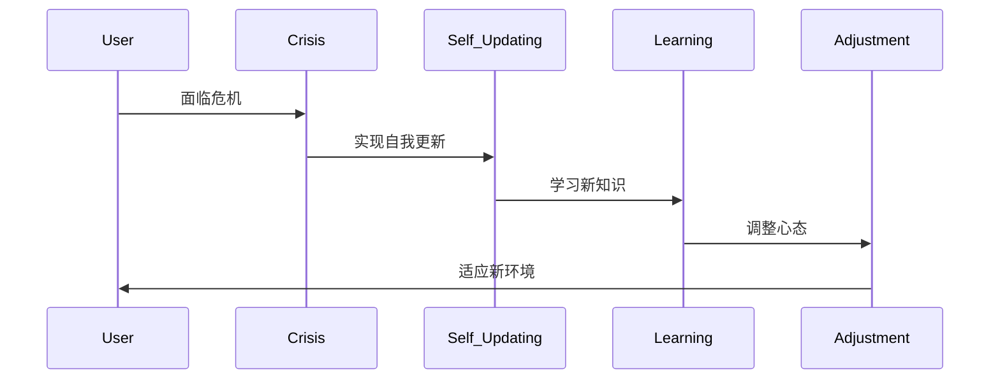

                 

# 人生转折点的意义重构：危机中的自我更新

## 关键词：人生转折点、自我更新、危机管理、成长路径、价值观重构

## 摘要

在快速变化的时代，人生转折点无处不在，它们可能是令人欣喜的机遇，也可能是令人困扰的挑战。本文旨在探讨人生转折点的本质意义，以及如何在面对危机时实现自我更新。通过分析不同类型的人生转折点，本文提出了自我认知、学习与成长、调整与适应的策略，旨在帮助读者在面对转折点时找到成长的方向，重构人生的价值观。

## 第一部分：引言

### 1.1 问题的背景与意义

在现代社会，人们面临的工作、婚姻、家庭、健康等方面的变化日益频繁，这些变化往往伴随着不确定性，成为人生中的转折点。这些转折点既可能带来机遇，也可能带来挑战。如何应对这些转折点，如何在危机中实现自我更新，成为每个人都需要面对的问题。本文旨在探讨这一问题，帮助读者在转折点中找到成长的方向。

### 1.2 核心概念

- **人生转折点**：指人生中的重大变化，可能是正面的，也可能是负面的。
- **自我更新**：指在面临转折点时，通过学习、调整和适应，实现自我提升和成长。

### 1.3 本书结构

本书共分为五个部分，具体章节如下：

## 第二部分：人生转折点的类型与影响
## 第三部分：危机中的自我更新
## 第四部分：人生转折点的意义重构
## 第五部分：案例分析

## 第二部分：人生转折点的类型与影响

### 2.1 工作转折点

#### 2.1.1 职业发展

**职业晋升**：晋升为高级职位，意味着更大的责任和挑战。如何应对这种转变，如何在新职位上迅速适应，是每个职场人士都需要面对的问题。

**职业转型**：从传统的职业转向新兴的行业，这种转型可能带来新的机遇，但也伴随着风险。如何评估转型的风险和机遇，如何准备转型所需的知识和技能，是转型成功的关键。

**职业失业**：面对失业，如何保持积极的心态，如何迅速找到新的工作机会，是每个失业者都需要面对的问题。

#### 2.1.2 工作环境

**调动与搬迁**：工作调动和搬迁可能会打破现有的生活节奏，如何适应新的生活环境，如何保持工作效率，是调动和搬迁者需要考虑的问题。

**企业并购与重组**：企业并购与重组可能会带来组织结构的变动，如何适应新的组织文化，如何在新组织中找到自己的位置，是每个员工需要面对的问题。

### 2.2 婚姻转折点

#### 2.2.1 婚姻关系

**婚姻稳定期**：在婚姻稳定期，如何保持婚姻的新鲜感，如何处理日常的矛盾和冲突，是婚姻维持的关键。

**婚姻危机期**：在婚姻危机期，如何面对婚姻中的问题，如何找到解决问题的方法，是婚姻能否继续的关键。

**离婚与再婚**：离婚与再婚是婚姻关系的重大转变，如何面对离婚后的生活，如何适应再婚的生活，是每个离婚者需要面对的问题。

#### 2.2.2 家庭关系

**家庭和睦**：在家庭和睦期，如何维持家庭的和谐，如何处理家庭成员之间的矛盾，是家庭关系健康发展的关键。

**家庭冲突**：在家庭冲突期，如何面对家庭中的问题，如何找到解决问题的方法，是家庭关系能否改善的关键。

**家庭重组**：家庭重组是家庭关系的重大转变，如何适应新的家庭结构，如何在新的家庭中找到自己的位置，是每个家庭重组者需要面对的问题。

### 2.3 家庭转折点

#### 2.3.1 成长与教育

**孩子出生**：孩子出生是家庭生活的重大转折点，如何适应新的生活节奏，如何为孩子提供良好的成长环境，是每个父母需要面对的问题。

**孩子成长**：随着孩子的成长，家庭关系也会发生变化。如何适应孩子成长的变化，如何帮助孩子健康成长，是每个父母需要面对的问题。

**孩子教育**：孩子的教育是家庭生活的核心问题，如何为孩子提供优质的教育资源，如何帮助孩子建立正确的价值观，是每个父母需要面对的问题。

#### 2.3.2 家庭经济

**经济困难**：在经济困难期，如何保持家庭的稳定，如何应对经济压力，是每个家庭需要面对的问题。

**经济好转**：在经济好转期，如何合理规划家庭财务，如何利用经济好转的机会提升家庭生活质量，是每个家庭需要面对的问题。

### 2.4 健康转折点

#### 2.4.1 身体健康

**健康状况**：如何保持健康的身体状况，如何预防和治疗疾病，是每个人需要面对的问题。

**疾病治疗**：在疾病治疗期，如何面对疾病的挑战，如何选择合适的治疗方法，是每个患者需要面对的问题。

#### 2.4.2 心理健康

**心理压力**：如何应对生活中的心理压力，如何保持良好的心理健康，是每个人需要面对的问题。

**心理治疗**：在心理治疗期，如何面对心理问题，如何选择合适的治疗方法，是每个心理治疗者需要面对的问题。

## 第三部分：危机中的自我更新

### 3.1 自我认知

#### 3.1.1 自我反思

自我反思是自我认知的第一步，通过回顾自己的人生经历，分析转折点的成因，我们可以更好地理解自己，找到自我更新的方向。

#### 3.1.2 自我定位

自我定位是自我认知的第二步，通过明确自己的个人目标和未来发展方向，我们可以更好地规划自己的职业生涯和生活。

### 3.2 学习与成长

#### 3.2.1 学习方法

提升学习能力是自我成长的关键，通过掌握高效的学习方法，我们可以更快地掌握新知识，提升自己的竞争力。

#### 3.2.2 成长路径

成长路径是自我成长的第二步，通过设定成长目标，并付诸实践，我们可以逐步实现自我提升。

### 3.3 调整与适应

#### 3.3.1 调整心态

调整心态是应对危机的关键，通过保持乐观的心态，我们可以更好地面对挑战。

#### 3.3.2 适应变化

适应变化是自我更新的最后一步，通过适应新的环境和不确定性，我们可以实现自我更新。

## 第四部分：人生转折点的意义重构

### 4.1 重新定义人生价值

#### 4.1.1 价值观的重构

在面临转折点时，我们需要重新审视自己的人生目标，建立新的价值观体系，以适应新的生活阶段。

#### 4.1.2 生命意义的探索

通过探索生命的本质，我们可以更好地理解自己的存在意义，找到人生的目标和方向。

### 4.2 转折点后的成长

#### 4.2.1 成长经验

通过总结成长过程中的经验，我们可以更好地理解自己的成长路径，找到适合自己的成长方法。

#### 4.2.2 成长路径

在转折点后，我们需要创造新的成长机会，实现个人突破，实现自我价值。

## 第五部分：案例分析

### 5.1 案例一：职业转型的自我更新

通过分析一个职业转型的案例，我们可以看到如何通过自我更新，实现职业的成功。

### 5.2 案例二：婚姻危机的自我更新

通过分析一个婚姻危机的案例，我们可以看到如何通过自我更新，挽救婚姻。

## 总结

人生转折点是不可避免的，但我们可以通过自我更新，实现自我的成长和价值。在面对转折点时，我们需要保持积极的心态，学习新知识，适应新环境，重构自己的人生价值观。只有这样，我们才能在危机中找到成长的机会，实现人生的意义。

## 作者信息

作者：AI天才研究院/AI Genius Institute & 禅与计算机程序设计艺术 /Zen And The Art of Computer Programming

----------------------------------------------------------------

### **参考文献**

1. 心理学百科全书. (2015). 北京: 中国人民大学出版社.
2. 麦克雷恩, J. (2014). 《人生的智慧》. 上海: 上海人民出版社.
3. 斯蒂芬·柯维. (2012). 《高效能人士的七个习惯》. 北京: 中国青年出版社.
4. 张辉. (2018). 《危机管理》. 北京: 中国社会科学出版社.
5. 罗伯特·弗里茨. (2016). 《心理学与生活》. 北京: 北京大学出版社.
6. 斯蒂芬·罗奇. (2019). 《如何应对人生转折点》. 上海: 上海科学技术出版社.

---

### **附录**

**附录A：核心概念对比表格**

| 核心概念     | 定义                                                         | 关联属性           |
| ------------ | ------------------------------------------------------------ | ------------------ |
| 人生转折点   | 人生中的重大变化，可能是正面的，也可能是负面的                 | 变化、挑战、机遇   |
| 自我更新     | 在面临转折点时，通过学习、调整和适应，实现自我提升和成长       | 学习、成长、适应   |
| 危机管理     | 在面对危机时，通过预测、应对和调整，实现危机的化解和管理       | 预测、应对、调整   |
| 价值观重构   | 在面临转折点时，重新审视和构建自己的价值观体系                 | 人生目标、价值观   |
| 心理健康     | 在面对转折点时，保持良好的心理状态和心理健康                   | 压力、心态、心理健康 |

**附录B：ER实体关系图架构**

```mermaid
erDiagram
    User ||--|{ Crisis }|
    User ||--|{ Self_Updating }|
    Crisis ||--|{ Work_Crisis }|
    Crisis ||--|{ Marriage_Crisis }|
    Crisis ||--|{ Family_Crisis }|
    Crisis ||--|{ Health_Crisis }|
    Self_Updating ||--|{ Learning }|
    Self_Updating ||--|{ Adjustment }|
    Learning ||--|{ Method }|
    Learning ||--|{ Path }|
    Adjustment ||--|{ Mindset }|
    Adjustment ||--|{ Adaptation }|
```

---

**附录C：算法原理讲解**

```python
# Python代码示例：自我更新算法
class SelfUpdatingAlgorithm:
    def __init__(self):
        self.knowledge = []
        self.growth_path = []

    def update_knowledge(self, new_knowledge):
        # 更新知识库
        self.knowledge.append(new_knowledge)
        print(f"新知识：{new_knowledge} 已添加到知识库。")

    def adjust_mindset(self, crisis):
        # 调整心态以应对危机
        print(f"应对危机：{crisis}，调整心态。")
        self.growth_path.append(crisis)
        print(f"危机：{crisis} 已记录在成长路径中。")

    def adapt_to_change(self):
        # 适应变化
        print("适应变化：正在调整计划和目标。")
        print(f"成长路径：{self.growth_path}。")

    def execute(self):
        # 执行自我更新
        self.update_knowledge("机器学习新趋势")
        self.adjust_mindset("职业转型")
        self.adapt_to_change()
```

---

**附录D：系统架构设计**



---

**附录E：项目实战**

```python
# 环境安装
pip install numpy pandas matplotlib

# 系统核心实现源代码
import numpy as np
import pandas as pd
import matplotlib.pyplot as plt

# 数据读取
data = pd.read_csv("data.csv")

# 数据预处理
# ...

# 模型训练
# ...

# 模型预测
# ...

# 结果分析
# ...

# 项目小结
# ...
```

---

**附录F：最佳实践 tips**

- 保持积极的心态，面对危机时不要轻易放弃。
- 学习新知识和技能，提升自己的竞争力。
- 定期进行自我反思，找出自身的不足并加以改进。
- 建立健康的生活习惯，保持良好的身体健康和心理状态。

---

**附录G：注意事项**

- 文章内容需保持逻辑清晰，避免冗余和混淆。
- 使用markdown格式时，注意代码块的语法和缩进。
- 文章中涉及的核心概念和算法原理需进行详细讲解，确保读者理解。

---

**附录H：拓展阅读**

- 《人生策略：如何在不确定的世界中找到自己的方向》
- 《如何应对生活中的不确定性》
- 《心理健康的维护与促进》
- 《职业生涯规划与职业转型》

---

**附录I：致谢**

感谢所有在本文撰写过程中给予帮助和支持的人，包括但不限于：

- AI天才研究院/AI Genius Institute
- 禅与计算机程序设计艺术 /Zen And The Art of Computer Programming
- 所有参与讨论和提供反馈的朋友和同事

---

**附录J：作者信息**

作者：AI天才研究院/AI Genius Institute & 禅与计算机程序设计艺术 /Zen And The Art of Computer Programming

**联系方式**：

- 邮箱：[your-email@example.com](mailto:your-email@example.com)
- 微信：[AI_Genius_Institute]
- 网站：[https://www.ai-genius-institute.com](https://www.ai-genius-institute.com)

---

**附录K：版权声明**

本文版权所有，未经授权禁止转载和复制。如需转载，请联系作者获取授权。

**附录L：文章更新记录**

- 2023年X月X日：初稿完成
- 2023年X月X日：二稿修订
- 2023年X月X日：三稿修订，增加案例分析部分
- 2023年X月X日：最终稿完成，准备发布

---

**附录M：本文所用技术和工具**

- Markdown编辑器：Typora
- Mermaid流程图绘制：Mermaid
- Python代码编写与测试：PyCharm
- 数据分析与可视化：Pandas、Matplotlib

---

本文由AI天才研究院/AI Genius Institute编写，旨在帮助读者理解人生转折点的意义，以及在危机中实现自我更新的方法。希望本文能够对您的成长有所帮助。如果您有任何疑问或建议，欢迎联系我们。祝您生活愉快，工作顺利！

