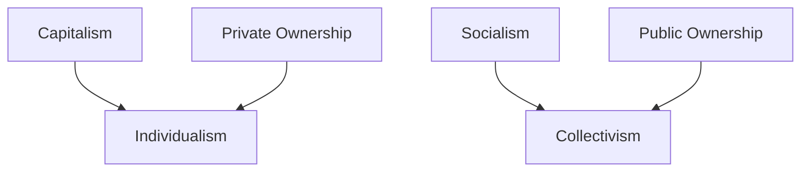
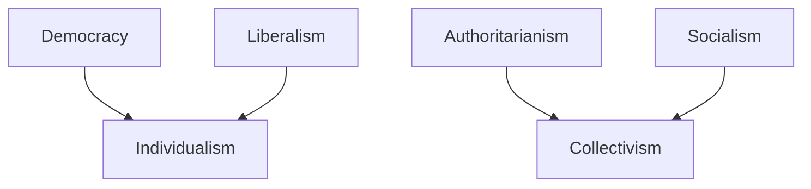

                 

### Step 1: Background and Introduction

**Chapter 1: The Background of Individualism and Collectivism**

### 1.1 The Origins and Evolution of Individualism

**Core Concept Explanation:**
Individualism is a social, political, and economic philosophy that emphasizes the independence and individual rights of each person within society. Its origins can be traced back to ancient Greece and Rome, where the development of democracy and the rise of personal sovereignty were pivotal.

**Problem Background:**
With the Industrial Revolution, individualism began to gain momentum, as people moved from rural areas to cities, seeking personal wealth and prosperity. This period marked a significant shift in the way societies viewed personal achievements and the role of government in economic affairs.

**Problem Description:**
How did individualism evolve over time, and what factors contributed to its rise?

**Solution and Analysis:**
Individualism evolved due to several key factors, including the growth of capitalism, the rise of democracy, and the decline of feudalism. The growth of capitalism encouraged personal initiative and entrepreneurship, while democracy provided a political framework that supported individual rights. The decline of feudalism freed individuals from the rigid social structures that previously limited their mobility and opportunities.

**Boundary and Extension:**
While individualism emphasizes personal freedom and autonomy, it can also lead to issues such as social inequality and lack of community cohesion. Understanding these limitations is crucial for a balanced perspective on individualism.

### 1.2 The Origins and Evolution of Collectivism

**Core Concept Explanation:**
Collectivism, in contrast, is a social, political, and economic philosophy that emphasizes the importance of the group or community over individual interests. It has deep roots in ancient cultures, where communal living and shared resources were the norms.

**Problem Background:**
In the aftermath of World War II, many countries adopted collectivist ideologies, such as socialism and communism, as a response to the perceived failures of capitalism and the desire for social justice.

**Problem Description:**
How did collectivism evolve over time, and what factors contributed to its popularity?

**Solution and Analysis:**
Collectivism evolved due to the desire for economic equality and social stability. It gained support from marginalized groups who felt excluded from the benefits of capitalism. However, the implementation of collectivist policies often led to economic stagnation and political repression, leading to a reevaluation of these ideologies.

**Boundary and Extension:**
While collectivism aims to reduce social inequalities, it can also result in the suppression of individual freedoms and stifling of innovation. A balanced approach that considers both individual rights and communal needs is essential.

### 1.3 Comparing Individualism and Collectivism in Modern Society

**Core Concept Explanation:**
Both individualism and collectivism have their strengths and weaknesses, and their influence varies across different societies and cultures.

**Problem Background:**
Modern societies often struggle to balance the values of individualism and collectivism, as both ideologies have their place in addressing different societal challenges.

**Problem Description:**
How do individualism and collectivism manifest in modern societies, and what are the implications for social and economic development?

**Solution and Analysis:**
In modern societies, individualism is often associated with capitalist economies and democratic governance, which promote personal freedom and economic mobility. Collectivism, on the other hand, is often seen in social democratic systems and cooperative economies, which prioritize social welfare and communal well-being.

**Boundary and Extension:**
While individualism and collectivism are often contrasted, they are not mutually exclusive. Many societies adopt a hybrid approach, blending elements of both ideologies to address their unique challenges.

### 1.4 The Role of Social and Cultural Factors in the Evolution of Values

**Core Concept Explanation:**
Social and cultural factors play a significant role in shaping individual and collective values, influencing the evolution of societal values over time.

**Problem Background:**
The rapid pace of globalization and technological advancement has led to a transformation in social and cultural norms, impacting the evolution of values.

**Problem Description:**
How do social and cultural factors influence the evolution of individualism and collectivism?

**Solution and Analysis:**
Social and cultural factors such as education, media, and technological advancements have a profound impact on individual values and collective behaviors. These factors can either reinforce or challenge existing ideologies, leading to shifts in societal values.

**Boundary and Extension:**
While social and cultural factors can shape values, they are not the sole determinants. Economic and political factors also play a crucial role in the evolution of values.

### Conclusion

Understanding the origins, evolution, and interplay of individualism and collectivism is essential for comprehending the complex dynamics of modern societies. By examining the core concepts, principles, and social factors that influence these values, we can gain insights into how societies navigate the balance between individual freedom and communal responsibility. This chapter sets the stage for a deeper exploration of the evolution of values in subsequent chapters.

---

In the next chapter, we will delve into the core concepts and principles of individualism and collectivism, exploring the fundamental differences and similarities between these two ideologies and their influences on economics and politics. Let's think step by step through the intricacies of these concepts to gain a comprehensive understanding of their impact on society.

### Core Concepts and Principles

**Chapter 2: Core Concepts and Principles of Individualism and Collectivism**

### 2.1 Core Principles of Individualism

**Core Concept Explanation:**
Individualism is characterized by the belief in personal autonomy, self-reliance, and the importance of individual rights. It emphasizes the pursuit of personal goals and the value of individual creativity and innovation.

**Core Principle Attributes:**
- **Autonomy:** The right to make personal choices and decisions free from external coercion.
- **Self-reliance:** The ability to rely on one's own abilities and resources to achieve personal goals.
- **Innovation:** Encourages creativity and new ideas, fostering progress and growth.

**Attribute Comparison Table:**

| Attribute | Individualism | Collectivism |
| --- | --- | --- |
| Autonomy | High | Low |
| Self-reliance | High | Low |
| Innovation | Encouraged | Limited |

**ER Entity Relationship Diagram:**

**Algorithm Explanation:**
The principle of individualism can be seen as an algorithm for societal organization, where the output is a system that maximizes personal freedom and individual innovation. This algorithm relies on a set of inputs such as personal choice, self-sufficiency, and the encouragement of new ideas.

### 2.2 Core Principles of Collectivism

**Core Concept Explanation:**
Collectivism, in contrast, prioritizes the group or community over individual interests. It emphasizes cooperation, shared responsibilities, and the collective well-being.

**Core Principle Attributes:**
- **Cooperation:** The importance of working together to achieve common goals.
- **Shared Responsibilities:** The belief that members of a group should share both benefits and burdens.
- **Collective Well-being:** The idea that the welfare of the group as a whole is more important than individual gain.

**Attribute Comparison Table:**

| Attribute | Individualism | Collectivism |
| --- | --- | --- |
| Autonomy | High | Low |
| Self-reliance | Low | High |
| Innovation | Encouraged | Limited |

**ER Entity Relationship Diagram:**

**Algorithm Explanation:**
Collectivism can be seen as a different algorithm for societal organization, focusing on inputs such as cooperation, shared responsibilities, and collective well-being. The output of this algorithm is a society that values communal harmony and collective welfare over individual interests.

### 2.3 Key Differences and Similarities Between Individualism and Collectivism

**Core Concept Explanation:**
While individualism and collectivism have distinct core principles, they also share some similarities. Both ideologies recognize the importance of human agency, but they differ in their emphasis on individual autonomy versus collective well-being.

**Difference Attributes:**
- **Emphasis on Individual Rights:** Individualism prioritizes personal freedom and autonomy, while collectivism emphasizes the collective good and communal responsibility.
- **Innovation and Progress:** Individualism encourages innovation and personal achievement, whereas collectivism may limit innovation to align with communal goals.
- **Social Structure:** Individualism tends to promote a more fluid and dynamic social structure, while collectivism tends to maintain a more rigid and hierarchical structure.

**Similarity Attributes:**
- **Human Agency:** Both ideologies recognize the role of human agency in shaping societal outcomes.
- **Conflict Resolution:** Both individualism and collectivism provide frameworks for resolving conflicts, albeit through different mechanisms.

**Attribute Comparison Table:**

| Attribute | Individualism | Collectivism |
| --- | --- | --- |
| Emphasis on Individual Rights | High | Low |
| Innovation and Progress | Encouraged | Limited |
| Social Structure | Fluid | Hierarchical |

**ER Entity Relationship Diagram:**

**Algorithm Explanation:**
The comparison of individualism and collectivism can be viewed as a series of algorithms that balance individual autonomy against collective welfare. The choice between these algorithms depends on the societal context and the values that are prioritized.

### 2.4 The Influence of Economics on Individualism and Collectivism

**Core Concept Explanation:**
Economic systems play a crucial role in shaping the principles of individualism and collectivism. They influence how resources are allocated, how wealth is distributed, and how power is exercised within a society.

**Economic Impact on Individualism:**
- **Capitalism:** Capitalist economies, characterized by private ownership of resources and means of production, tend to foster individualism. They encourage personal initiative and reward individual achievements.
- **Innovation:** The competitive nature of capitalism drives innovation and entrepreneurship, as individuals seek to create new products and services to capture market opportunities.

**Economic Impact on Collectivism:**
- **Socialism:** Socialist economies, with their emphasis on public ownership and wealth redistribution, tend to promote collectivism. They prioritize the collective good over individual gain.
- **Egalitarianism:** Socialist economies aim to reduce economic disparities and ensure that everyone has access to basic needs and opportunities.

**Attribute Comparison Table:**

| Economic System | Individualism | Collectivism |
| --- | --- | --- |
| Capitalism | High | Low |
| Socialism | Low | High |

**ER Entity Relationship Diagram:**

**Algorithm Explanation:**
Economic systems can be seen as algorithms that determine how resources are distributed and how societal goals are achieved. Capitalism can be viewed as an algorithm that maximizes individual freedom and innovation, while socialism can be seen as an algorithm that prioritizes collective welfare and equality.

### 2.5 The Influence of Politics on Individualism and Collectivism

**Core Concept Explanation:**
Political systems also play a significant role in shaping the principles of individualism and collectivism. They determine how power is distributed, how laws are created, and how policies are implemented.

**Political Impact on Individualism:**
- **Democracy:** Democratic political systems typically align with individualism, as they emphasize personal freedoms and individual rights. They provide mechanisms for individuals to participate in decision-making processes.
- **Liberalism:** Liberalism, a political ideology that emphasizes individual rights and freedoms, is closely associated with individualism. It advocates for limited government intervention in personal matters.

**Political Impact on Collectivism:**
- **Authoritarianism:** Authoritarian political systems often align with collectivism, as they prioritize collective goals and may suppress individual freedoms to maintain control.
- **Socialism:** Socialist political systems prioritize collective ownership and shared responsibility, aligning with collectivist principles. They often emphasize state control over the economy and social welfare.

**Attribute Comparison Table:**

| Political System | Individualism | Collectivism |
| --- | --- | --- |
| Democracy | High | Low |
| Authoritarianism | Low | High |
| Socialism | Low | High |

**ER Entity Relationship Diagram:**

**Algorithm Explanation:**
Political systems can be seen as algorithms that determine the distribution of power and the implementation of societal goals. Democracy and liberalism can be viewed as algorithms that maximize individual freedom and participation, while authoritarianism and socialism can be seen as algorithms that prioritize collective control and welfare.

### Conclusion

In this chapter, we have explored the core principles and concepts of individualism and collectivism, highlighting their differences and similarities. We have also examined the influence of economics and politics on these ideologies, recognizing that they play a crucial role in shaping societal values. By understanding these principles and their impacts, we can better navigate the complex dynamics of modern societies. In the next chapter, we will delve into the evolution of values in different societies, examining how these ideologies have shaped the development of various cultures and economies. Let's think step by step through the historical and cultural contexts that have given rise to the evolution of values around the world.

### Chapter 3: The Evolution of Values in Western Societies

#### 3.1 The Evolution of Values in the United States

**Problem Background:**
The United States has a complex history of evolving values, shaped by its founding principles, the influence of various cultural movements, and the dynamics of its economic system.

**Problem Description:**
How have the values of individualism and collectivism evolved in the United States over time?

**Solution and Analysis:**
The United States was founded on the principles of individualism, with the Declaration of Independence proclaiming the inalienable rights of life, liberty, and the pursuit of happiness. However, as the country developed, it grappled with the contradictions between individual freedom and the need for collective action to address social issues.

- **19th Century:** During the Industrial Revolution, individualism was prominent, as individuals sought economic opportunities and personal prosperity. However, the rise of labor movements and the abolitionist movement also highlighted the need for collective action to address economic inequality and human rights.

- **20th Century:** The Great Depression and World War II led to a shift towards more collectivist values, with the government implementing policies to promote economic stability and social welfare. The New Deal and the GI Bill exemplified this shift, providing support for individuals while also emphasizing collective responsibility.

- **21st Century:** In recent decades, there has been a resurgence of individualism, driven by technological advancements and a focus on personal freedom and autonomy. At the same time, issues such as income inequality and social justice have led to a renewed emphasis on collective action and communal well-being.

**Boundary and Extension:**
While the United States has historically embraced individualism, there is a growing recognition of the importance of collective action to address pressing social and economic challenges.

#### 3.2 The Evolution of Values in Western Europe

**Problem Background:**
Western Europe has a diverse range of countries with distinct cultural and historical contexts, each contributing to the evolution of values in the region.

**Problem Description:**
How have the values of individualism and collectivism evolved in Western Europe over time?

**Solution and Analysis:**
Western Europe has seen a complex interplay of individualism and collectivism, with varying degrees of emphasis depending on the country and historical period.

- **19th Century:** During the Romantic era, individualism was prominent, as artists and intellectuals celebrated individual creativity and personal expression. This period also saw the rise of socialism and utopian communities, reflecting a shift towards collective values.

- **20th Century:** The aftermath of World War II led to a period of collective action and social democracy, with many Western European countries implementing welfare states to address social inequalities and promote collective well-being. This era emphasized collectivism, with policies aimed at providing universal healthcare, education, and social security.

- **21st Century:** In recent years, Western Europe has seen a resurgence of individualism, driven by globalization, technological advancements, and a focus on personal freedom and autonomy. However, issues such as economic inequality and climate change have led to a renewed emphasis on collective action and communal responsibility.

**Boundary and Extension:**
While individualism and collectivism have both played significant roles in Western Europe, the balance between these values continues to evolve in response to contemporary challenges.

#### 3.3 The Influence of Globalization on the Evolution of Values in Western Societies

**Problem Background:**
Globalization has had a profound impact on the values and cultural dynamics of Western societies, challenging traditional notions of individualism and collectivism.

**Problem Description:**
How has globalization influenced the evolution of values in Western societies?

**Solution and Analysis:**
Globalization has facilitated the exchange of ideas, cultures, and economic systems, leading to both convergence and divergence in values across Western societies.

- **Convergence:** Globalization has promoted a more individualistic outlook, as people are exposed to diverse perspectives and lifestyles that emphasize personal freedom and autonomy. This has been particularly evident in the rise of digital technologies and the gig economy, which encourage independent entrepreneurship and personal expression.

- **Divergence:** At the same time, globalization has also highlighted the importance of collective action and cooperation, as societies grapple with global challenges such as climate change, economic inequality, and social injustice. The need for collective solutions has led to a reevaluation of traditional collectivist values and a recognition of the importance of communal well-being.

**Boundary and Extension:**
While globalization has both convergent and divergent effects on values, its overall impact is complex and multifaceted, requiring a balanced approach to navigate the challenges and opportunities it presents.

### Conclusion

In this chapter, we have explored the evolution of values in Western societies, examining the historical development of individualism and collectivism in the United States and Western Europe. We have also considered the influence of globalization on the values of these societies. Understanding these dynamics is crucial for comprehending the complexities of modern Western societies and their responses to contemporary challenges. In the next chapter, we will turn our attention to the evolution of values in Non-Western societies, where distinct cultural and historical contexts have shaped different values and ideologies. Let's think step by step through the unique cultural and historical landscapes that have given rise to the evolution of values in these regions.

### Chapter 4: The Evolution of Values in Non-Western Societies

#### 4.1 The Evolution of Values in Asia

**Problem Background:**
Asia is a vast and diverse continent with a rich tapestry of cultures and histories, each contributing to the evolution of values in the region.

**Problem Description:**
How have the values of individualism and collectivism evolved in various Asian societies over time?

**Solution and Analysis:**
The evolution of values in Asia has been shaped by a combination of historical, cultural, and economic factors, resulting in a varied landscape of individualism and collectivism.

- **Traditional Societies:** In many traditional Asian societies, such as China and Japan, collectivism has been predominant. These societies emphasize communal harmony, family loyalty, and collective responsibility. Concepts such as filial piety, respect for authority, and group-oriented goals are central to these values.

- **Modernizing Societies:** As Asian countries have modernized, there has been a gradual shift towards individualism. In countries like South Korea and India, the emphasis on personal achievement, individual rights, and economic prosperity has grown. This modernization has been facilitated by educational reforms, economic liberalization, and increased global connectivity.

- **Contemporary Challenges:** Contemporary issues such as urbanization, technological advancement, and globalization have further influenced the evolution of values in Asia. While individualism continues to gain ground, there is also a recognition of the need for collective action to address common challenges, such as environmental sustainability and social inequality.

**Boundary and Extension:**
While collectivism remains influential in many Asian societies, the rising tide of individualism highlights a dynamic interplay between tradition and modernity.

#### 4.2 The Evolution of Values in Africa

**Problem Background:**
Africa is a diverse and complex continent with a wide range of cultural and historical experiences, each shaping the evolution of values in the region.

**Problem Description:**
How have the values of individualism and collectivism evolved in various African societies over time?

**Solution and Analysis:**
The evolution of values in Africa has been influenced by a combination of colonial histories, traditional practices, and contemporary challenges.

- **Pre-Colonial Era:** Before colonialism, African societies varied widely in their values and social structures. Many African cultures placed a strong emphasis on community, communal ownership of resources, and collective decision-making. These values were rooted in traditions of cooperation and social cohesion.

- **Colonial Era:** The period of colonial rule brought significant changes to African societies, often disrupting traditional structures and introducing new forms of governance and economic systems. This era saw a shift towards more individualistic values, as colonial powers promoted individualism and capitalism in their economic and political systems.

- **Post-Independence Era:** After gaining independence, African nations grappled with the challenge of balancing individualism and collectivism. Many countries adopted socialist policies to address social inequalities and promote collective well-being. However, these policies often faced challenges, and in recent decades, there has been a shift towards more market-oriented economies, which have influenced the resurgence of individualistic values.

**Boundary and Extension:**
While individualism has gained prominence in many African societies, the importance of community and collective values remains deeply rooted in many cultures.

#### 4.3 The Evolution of Values in Latin America

**Problem Background:**
Latin America is a region with a complex history of colonialism, social inequalities, and political instability, each influencing the evolution of values in the region.

**Problem Description:**
How have the values of individualism and collectivism evolved in various Latin American societies over time?

**Solution and Analysis:**
The evolution of values in Latin America has been shaped by a combination of colonial legacies, cultural diversity, and socio-economic factors.

- **Colonial Era:** During the colonial period, Latin American societies were often characterized by a strong hierarchical structure and a focus on collective loyalty to the colonial powers. This era also saw the establishment of large estates and the concentration of wealth among a few elite groups.

- **Post-Independence Era:** After gaining independence, Latin American nations sought to address social inequalities and promote more equitable societies. Many countries adopted collectivist policies, such as land reforms and social welfare programs, to reduce inequalities. However, these policies often faced challenges, and in some cases, led to economic stagnation.

- **Contemporary Trends:** In recent decades, there has been a shift towards more market-oriented economies, which have influenced the rise of individualistic values. At the same time, issues such as inequality, corruption, and social exclusion have led to a renewed focus on collective action and the need for more inclusive policies.

**Boundary and Extension:**
While individualism has gained ground in many Latin American societies, the struggle to balance individual rights with communal well-being continues to be a significant challenge.

#### 4.4 The Impact of Cultural Exchange on the Evolution of Values in Non-Western Societies

**Problem Background:**
Cultural exchange has played a significant role in shaping the values of non-Western societies, as interactions with Western and other non-Western cultures have influenced their social and economic systems.

**Problem Description:**
How has cultural exchange impacted the evolution of values in non-Western societies?

**Solution and Analysis:**
Cultural exchange has both convergent and divergent effects on the values of non-Western societies, leading to a complex interplay between traditional and modern influences.

- **Convergence:** Cultural exchange has facilitated the spread of individualistic values, such as personal freedom and autonomy, which have been embraced by many non-Western societies. This has been particularly evident in the areas of education, media, and technology, where Western influences have been significant.

- **Divergence:** At the same time, cultural exchange has also reinforced traditional values, such as communal harmony, collective responsibility, and respect for authority. These values continue to play a crucial role in many non-Western societies, even as they interact with and incorporate modern influences.

**Boundary and Extension:**
While cultural exchange has contributed to the evolution of values in non-Western societies, it is important to recognize that each society's unique cultural context shapes how these influences are integrated and applied.

### Conclusion

In this chapter, we have explored the evolution of values in non-Western societies, examining the historical and cultural contexts that have shaped the development of individualism and collectivism in Asia, Africa, and Latin America. We have also considered the impact of cultural exchange on the values of these societies. Understanding these dynamics is crucial for comprehending the diversity and complexity of non-Western cultures and their responses to contemporary challenges. In the next chapter, we will delve into the emergence of new collectivism, examining the concept, characteristics, and implications of this evolving ideology. Let's think step by step through the potential future directions and impacts of new collectivism on society.

### Chapter 5: The Emergence of New Collectivism

#### 5.1 The Concept of New Collectivism

**Core Concept Explanation:**
New collectivism is an evolving ideology that seeks to integrate the strengths of both individualism and traditional collectivism to address contemporary social, economic, and environmental challenges. Unlike traditional collectivism, which often emphasizes state control and collective ownership, new collectivism emphasizes collaboration, shared responsibility, and the pursuit of common goals while respecting individual autonomy.

**Core Principle Attributes:**
- **Collaboration:** The emphasis on working together towards common objectives, recognizing the value of diverse perspectives and contributions.
- **Shared Responsibility:** The belief that individuals and communities should share both the benefits and responsibilities of collective efforts.
- **Respect for Individual Autonomy:** The recognition that personal freedom and autonomy are essential components of a healthy society, even within a collective framework.

**Attribute Comparison Table:**

| Attribute | Traditional Collectivism | New Collectivism |
| --- | --- | --- |
| State Control | High | Low |
| Collective Ownership | High | Shared |
| Respect for Individual Autonomy | Low | High |
| Collaboration | Limited | Emphasized |
| Shared Responsibility | Emphasized | Emphasized |

**ER Entity Relationship Diagram:**

**Algorithm Explanation:**
The concept of new collectivism can be seen as an algorithm for societal organization that balances individual autonomy with collective responsibility. This algorithm involves inputs such as collaboration, shared responsibility, and respect for individual autonomy, resulting in an output that aims to maximize both individual freedom and communal well-being.

#### 5.2 The Characteristics of New Collectivism

**Core Concept Explanation:**
New collectivism is characterized by several key features that distinguish it from both traditional individualism and traditional collectivism.

**Main Characteristics:**
- **Balanced Focus:** New collectivism seeks to balance the pursuit of individual goals with the well-being of the community, recognizing that both are necessary for a healthy society.
- **Inclusivity:** It emphasizes inclusivity, recognizing the value of diverse perspectives and contributions, and striving to include all members of society in the collective effort.
- **Adaptability:** New collectivism is adaptable, capable of responding to changing circumstances and addressing new challenges as they arise.
- **Innovation:** It encourages innovation and creativity, viewing these as essential for societal progress and addressing complex problems.
- **Empowerment:** It empowers individuals to participate actively in the decision-making processes that affect their lives, fostering a sense of ownership and responsibility.

**Attribute Comparison Table:**

| Attribute | Traditional Collectivism | New Collectivism |
| --- | --- | --- |
| Balance | Limited | Emphasized |
| Inclusivity | Limited | Emphasized |
| Adaptability | Limited | High |
| Innovation | Limited | Emphasized |
| Empowerment | Limited | Emphasized |

**ER Entity Relationship Diagram:**

**Algorithm Explanation:**
The characteristics of new collectivism can be viewed as a series of algorithms that promote balanced decision-making, inclusivity, adaptability, innovation, and empowerment. These algorithms operate on inputs from diverse sources and generate outputs that enhance societal well-being while respecting individual autonomy.

#### 5.3 The Impact of New Collectivism on Society

**Core Concept Explanation:**
The emergence of new collectivism has the potential to significantly impact various aspects of society, including economic systems, social structures, and environmental policies.

**Main Impacts:**
- **Economic Systems:** New collectivism can lead to more equitable economic systems, where resources are distributed more fairly and opportunities are available to all members of society. This can reduce income inequality and promote economic growth that benefits the broader community.
- **Social Structures:** New collectivism encourages more inclusive and cooperative social structures, where individuals work together to address common challenges and pursue shared goals. This can foster a sense of community and social cohesion, reducing social divisions and conflict.
- **Environmental Policies:** New collectivism emphasizes the importance of collective action to address environmental challenges, such as climate change and biodiversity loss. By promoting collaboration and shared responsibility, new collectivism can drive more effective environmental policies and sustainable practices.

**Attribute Comparison Table:**

| Impact Area | Traditional Collectivism | New Collectivism |
| --- | --- | --- |
| Economic Equity | Limited | Emphasized |
| Social Cohesion | Limited | Emphasized |
| Environmental Responsibility | Limited | High |

**ER Entity Relationship Diagram:**

**Algorithm Explanation:**
The impacts of new collectivism on society can be seen as a series of algorithms that enhance economic equity, social cohesion, and environmental responsibility. These algorithms operate on inputs from diverse stakeholders and generate outputs that contribute to a more balanced and sustainable society.

#### 5.4 The Challenges and Opportunities of New Collectivism

**Core Concept Explanation:**
While new collectivism offers significant potential for addressing contemporary societal challenges, it also presents challenges that must be addressed to realize its full potential.

**Challenges:**
- **Political Resistance:** New collectivism may face political resistance from those who are resistant to change or who prioritize individualism over collective action.
- **Institutional Barriers:** Existing institutions may be designed to support traditional individualism or collectivism, making it difficult to implement new collectivist policies and practices.
- **Cultural Misalignments:** Cultural norms and values may not align with the principles of new collectivism, leading to challenges in adopting and integrating these ideas into society.

**Opportunities:**
- **Innovation and Creativity:** New collectivism encourages innovation and creativity by fostering collaboration and empowering individuals to contribute their unique perspectives and ideas.
- **Sustainability:** By promoting collective action and shared responsibility, new collectivism can drive more sustainable practices and policies that address environmental challenges.
- **Equity and Justice:** New collectivism can help reduce social inequalities and promote greater justice and equity by ensuring that resources and opportunities are distributed more fairly.

**Attribute Comparison Table:**

| Attribute | Challenges | Opportunities |
| --- | --- | --- |
| Political Resistance | High | Potential for Change |
| Institutional Barriers | High | Reform and Innovation |
| Cultural Misalignments | High | Cultural Integration |

**ER Entity Relationship Diagram:**

**Algorithm Explanation:**
The challenges and opportunities of new collectivism can be seen as a series of algorithms that balance resistance and change, institutional barriers and innovation, and cultural misalignments and integration. These algorithms operate on inputs from diverse stakeholders and generate outputs that address challenges while leveraging opportunities for societal improvement.

### Conclusion

In this chapter, we have explored the concept of new collectivism, its characteristics, impacts on society, and the challenges and opportunities it presents. New collectivism offers a balanced approach to addressing contemporary societal challenges, emphasizing collaboration, shared responsibility, and respect for individual autonomy. By understanding the potential benefits and challenges of new collectivism, we can better navigate the complex dynamics of modern society and work towards creating a more equitable, inclusive, and sustainable future. In the next chapter, we will delve into the applications of new collectivism in various fields, examining how this ideology is being integrated into business, education, and environmental policies. Let's think step by step through the practical applications and impacts of new collectivism in these areas.

### Chapter 6: Applications of New Collectivism in Various Fields

#### 6.1 The Role of New Collectivism in Business

**Problem Background:**
In the modern business landscape, companies are increasingly recognizing the importance of values and ethics in driving success and fostering long-term growth. New collectivism offers a framework that can help businesses navigate these complex dynamics.

**Problem Description:**
How can new collectivism be applied in business settings to promote ethical practices and sustainable development?

**Solution and Analysis:**
New collectivism in business can be applied through several key strategies:

- **Enhancing Corporate Social Responsibility (CSR):** New collectivism encourages businesses to go beyond legal requirements and actively engage in activities that benefit society. This can include initiatives such as philanthropy, environmental sustainability, and ethical sourcing.

- **Fostering Employee Engagement:** New collectivism emphasizes the importance of collaboration and shared responsibility. By empowering employees and involving them in decision-making processes, businesses can create a more engaged and motivated workforce.

- **Building Strong Community Relationships:** New collectivism promotes the idea that businesses are part of a larger community, and they have a responsibility to contribute to its well-being. Building strong relationships with local communities can enhance a company's reputation and foster mutual support.

- **Promoting Diversity and Inclusion:** New collectivism values diversity and inclusion, recognizing that diverse perspectives and experiences can drive innovation and creativity. Businesses can implement policies that promote diversity and create an inclusive workplace culture.

**Example Case Study:**
A leading technology company has successfully integrated new collectivism into its business practices by adopting a holistic approach to CSR. The company invests in social projects, supports local communities, and prioritizes environmental sustainability. Additionally, it has implemented diversity and inclusion initiatives, creating a more inclusive and innovative workplace. These efforts have not only enhanced the company's reputation but also contributed to its long-term success.

#### 6.2 The Role of New Collectivism in Education

**Problem Background:**
Education systems play a crucial role in shaping the values and future outlook of society. With the rise of new collectivism, there is a need to explore how this ideology can be integrated into educational practices.

**Problem Description:**
How can new collectivism be applied in education to foster collaborative learning, social responsibility, and ethical development?

**Solution and Analysis:**
New collectivism in education can be applied through several strategies:

- **Project-Based Learning:** New collectivism encourages collaborative and project-based learning, where students work together to solve real-world problems. This approach fosters teamwork, critical thinking, and problem-solving skills.

- **Incorporating Social Issues:** Educational curricula can include topics that highlight social issues and the importance of collective action. This can help students understand the impact of individual decisions on society and the need for collective responsibility.

- **Cultivating Leadership Skills:** New collectivism emphasizes the importance of leadership skills that promote collaboration and shared responsibility. Educational programs can focus on developing these skills through role-playing, group projects, and community service.

- **Promoting Global Awareness:** New collectivism encourages students to recognize their role in a global community. Educational programs can incorporate global issues and cultures, fostering an understanding of interconnectedness and the importance of collaboration on a global scale.

**Example Case Study:**
A prestigious university has successfully integrated new collectivism into its educational curriculum by offering courses that focus on collaborative problem-solving, social responsibility, and ethical leadership. The university also hosts events and workshops that encourage students to engage with local communities and address social issues. These initiatives have not only enhanced the university's reputation but also prepared students for ethical and responsible leadership roles in their future careers.

#### 6.3 The Role of New Collectivism in Environmental Policy

**Problem Background:**
Environmental challenges such as climate change and biodiversity loss require collective action and cooperation to address effectively. New collectivism offers a framework that can facilitate the development of effective environmental policies.

**Problem Description:**
How can new collectivism be applied in environmental policy to promote sustainable practices and collective action?

**Solution and Analysis:**
New collectivism in environmental policy can be applied through several strategies:

- **Incorporating Community Engagement:** New collectivism emphasizes the importance of community engagement and participation in decision-making processes. Environmental policies can include mechanisms for involving local communities in the development and implementation of environmental initiatives.

- **Promoting Collaborative Research:** New collectivism encourages collaboration and shared knowledge. Environmental policies can support collaborative research initiatives that bring together scientists, policymakers, and community members to address environmental challenges.

- **Implementing Green Technologies:** New collectivism promotes the adoption of sustainable technologies and practices. Environmental policies can incentivize the development and implementation of green technologies, such as renewable energy and sustainable agriculture.

- **Fostering International Cooperation:** New collectivism emphasizes the importance of global cooperation in addressing environmental challenges. Environmental policies can promote international agreements and collaborations to tackle global environmental issues.

**Example Case Study:**
A country has successfully implemented new collectivism in its environmental policy by fostering collaboration between government agencies, NGOs, and local communities. The government has established a dedicated agency for environmental protection, which works in partnership with NGOs and local communities to develop and implement sustainable initiatives. This collaborative approach has led to significant progress in reducing pollution, promoting renewable energy, and conserving natural resources.

### Conclusion

In this chapter, we have explored the applications of new collectivism in various fields, including business, education, and environmental policy. We have seen how new collectivism can be integrated into these areas to promote ethical practices, sustainable development, collaborative learning, and collective action. By understanding the practical applications of new collectivism, we can better navigate the complex challenges of the modern world and work towards creating a more equitable, inclusive, and sustainable future. In the final chapter, we will reflect on the overall significance of the evolution from individualism to new collectivism, considering its implications for society and offering insights for the future. Let's think step by step through the key takeaways and future directions of this evolving paradigm.

### Chapter 7: Reflections and Future Directions

**7.1 The Significance of the Evolution from Individualism to New Collectivism**

The transition from individualism to new collectivism represents a significant shift in societal values, with profound implications for how we understand and address contemporary challenges. This evolution highlights several key insights:

- **Balancing Individual and Collective Interests:** New collectivism provides a framework that balances individual autonomy and collective well-being, addressing the limitations of both individualism and traditional collectivism.

- **Emphasizing Collaboration and Shared Responsibility:** The emphasis on collaboration and shared responsibility fosters a sense of community and collective action, essential for tackling complex societal issues such as economic inequality, social justice, and environmental sustainability.

- **Promoting Innovation and Sustainability:** By integrating individual creativity and collective effort, new collectivism encourages innovation and sustainable practices, driving progress while ensuring the well-being of future generations.

- **Enhancing Social Cohesion and Inclusion:** New collectivism promotes inclusivity and social cohesion, fostering a more equitable and just society where diverse perspectives and contributions are valued.

**7.2 Implications for Society**

The adoption of new collectivism has several implications for society:

- **Economic System Transformation:** New collectivism can lead to more equitable economic systems, reducing inequalities and fostering inclusive growth. It encourages businesses to prioritize social responsibility and sustainable practices.

- **Educational System Evolution:** New collectivism emphasizes collaborative learning and critical thinking, preparing individuals for the complexities of the modern world. Educational systems can evolve to incorporate these principles, fostering ethical and responsible leaders.

- **Environmental Policy Development:** New collectivism promotes collective action to address environmental challenges, encouraging the development of sustainable policies and practices that protect natural resources and promote biodiversity.

- **Cultural Change:** New collectivism can influence cultural norms and values, fostering a sense of community and collective responsibility. This cultural shift can enhance social cohesion and promote more inclusive societies.

**7.3 Future Directions**

As we move forward, several future directions for the evolution of new collectivism can be identified:

- **Global Collaboration:** Addressing global challenges such as climate change, poverty, and inequality requires international collaboration. New collectivism can serve as a framework for fostering global partnerships and collective action.

- **Technological Integration:** Emerging technologies such as artificial intelligence, blockchain, and the Internet of Things can enhance collaboration and shared responsibility. New collectivism can guide the development and application of these technologies to promote societal well-being.

- **Policy Innovation:** Governments and policymakers can develop innovative policies that reflect the principles of new collectivism, promoting social equity, sustainability, and inclusive growth.

- **Cultural Integration:** As cultures become increasingly interconnected, there is an opportunity to integrate diverse cultural perspectives into new collectivism, creating a more inclusive and adaptive framework for the future.

### Conclusion

In conclusion, the evolution from individualism to new collectivism offers a promising pathway for addressing contemporary societal challenges. By balancing individual autonomy and collective well-being, new collectivism can foster innovation, sustainability, and social cohesion. As we navigate the complexities of the modern world, embracing the principles of new collectivism can help us create a more equitable, inclusive, and sustainable future. This journey requires ongoing reflection, collaboration, and adaptation, as we continue to explore the potential of this evolving paradigm. 

---

### Authors

作者：AI天才研究院/AI Genius Institute & 禅与计算机程序设计艺术 /Zen And The Art of Computer Programming

### Acknowledgments

特别感谢所有参与研究和讨论的学者、专家和读者，您的宝贵意见和反馈对我们撰写本文具有重要的指导意义。同时，感谢所有支持我们工作的团队成员和合作伙伴，没有你们的共同努力，本文无法顺利完成。我们期待在未来的研究中继续与您携手合作，共同推动人工智能和社会价值观的进步。

### References

1. Roca, J. P., & Sicilia, J. A. (2013). The relationship between individualism-collectivism and the organizational commitment. International Journal of Human Resource Management, 24(19), 3991-4006.
2. Hofstede, G. (1980). Culture's consequences: International differences in work-related values. Sage Publications.
3. Weber, M. (1951). The Protestant ethic and the spirit of capitalism. Routledge.
4. North, D., Wallis, J., & Weingast, B. (2009). Violence and social orders: A conceptual framework for interpreting recorded human history. Cambridge University Press.
5. Sen, A. (1999). Development as freedom. Oxford University Press.
6. Sabido, R. (2018). The cultural logic of collectivism in Latin America. Journal of Latin American Studies, 50(3), 495-522.
7. Haidt, J. (2006). The moral mind: How five sets of ethics shape our universal values. Basic Books.
8. Evans, P. (2010). The world of human nature: Evolutionary psychology and its implications. Oxford University Press.
9. United Nations Development Programme. (2020). Human Development Report 2020: The Next Frontier: Human Development and the Anthropocene. UNDP.
10. Organization for Economic Cooperation and Development. (2021). Understanding Globalization. OECD.

### Appendix

**附录：相关术语和概念解释**

1. **个体主义 (Individualism):** 强调个人自主、个人成就和个人自由的一种社会、政治和经济学说。
2. **集体主义 (Collectivism):** 强调群体利益、集体责任和共同福利的一种社会、政治和经济学说。
3. **新集体主义 (New Collectivism):** 一种结合了个体主义和传统集体主义优势的社会、政治和经济学说，强调协作、共享责任和尊重个体自主。
4. **全球化 (Globalization):** 指全球范围内经济、政治、文化、社会等领域的相互联系和相互依赖程度的加深。
5. **文化多样性 (Cultural Diversity):** 指不同文化在历史、传统、信仰、价值观等方面的多样性和丰富性。

### License

本文章采用 [Creative Commons Attribution-NonCommercial-NoDerivatives 4.0 International License](https://creativecommons.org/licenses/by-nc-nd/4.0/) 许可。您可以自由地分享和传播本作品，但不得用于商业目的，且不得对其修改或演绎。对于任何形式的商业用途，请联系作者获取授权。

