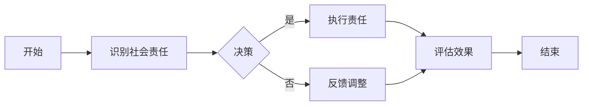
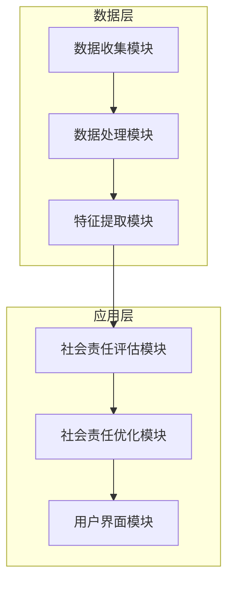

                 

### 《从个人主义到社会责任：重新定义现代公民角色》

### 关键词

- 个人主义
- 社会责任
- 现代公民角色
- 社会变迁
- 公共事务管理

### 摘要

在信息技术飞速发展的现代社会，个人主义和社会责任之间的平衡愈发显得重要。本文旨在探讨个人主义到社会责任的转变，分析现代公民角色的重新定义。通过对个人主义和社会责任的核心概念、属性特征、算法原理及系统架构设计进行深入剖析，本文旨在提出一种新的公民角色模型，为现代社会的公共事务管理和可持续发展提供理论支持和实践指南。

----------------------------------------------------------------

### 目录大纲

**《从个人主义到社会责任：重新定义现代公民角色》**

----------------------------------------------------------------

**第一部分：背景与挑战**

**第1章：现代社会的个人主义困境**

**第2章：社会责任的核心概念与联系**

**第3章：社会责任的算法原理**

**第4章：社会责任的系统分析与架构设计**

**第二部分：社会责任的理论与实践**

**第5章：社会责任的实践案例分析**

**第6章：社会责任的未来展望**

----------------------------------------------------------------

## 第1章：现代社会的个人主义困境

### 1.1 问题背景

#### 1.1.1 个人主义的兴起

个人主义作为现代社会的核心特征之一，其兴起可追溯到文艺复兴时期。文艺复兴提倡人文主义，强调个人价值、自由和独立思考。在随后的几个世纪里，个人主义逐渐成为西方社会的价值观念，并随着全球化进程的加快，影响遍及全球。

#### 1.1.2 个人主义的表现

个人主义在现代社会中表现为多种形式，包括个人自由、自我实现、物质追求等。个人自由强调个体有权自主决定生活方式，不受外界干涉；自我实现则追求个人的成长和发展，实现个人潜能；物质追求则表现为对物质财富和地位的渴望。

#### 1.1.3 个人主义的负面影响

然而，个人主义的过度发展也带来了诸多负面影响。首先，个人主义可能导致社会凝聚力的下降，使得人与人之间的关系变得冷漠。其次，过度追求物质财富可能导致社会不公和资源分配不均。最后，个人主义的极端形式，如自私和贪婪，可能导致道德沦丧和社会信任危机。

### 1.2 问题的本质

#### 1.2.1 个人主义与社会责任的关系

个人主义和社会责任之间存在一种复杂的张力。个人主义强调个体的自由和权利，而社会责任则强调个体对社会的责任和义务。这种张力在现代社会中愈发明显，如何平衡个人利益和社会利益成为一个亟待解决的问题。

#### 1.2.2 社会责任的重要性

社会责任不仅仅是对个体的道德要求，更是社会稳定和发展的基石。一个具有高度社会责任感的社会，能够更好地应对各种挑战，实现公平正义，提高整体福祉。

#### 1.2.3 个人主义到社会责任的转变

从个人主义到社会责任的转变，需要个体从自我中心转向关注社会整体利益。这种转变不仅需要个体的自觉行动，还需要社会制度的支持。例如，通过政策引导、教育改革、公共参与等方式，促进个人与社会责任的融合。

### 1.3 边界与外延

#### 1.3.1 个人主义与社会责任的具体表现

在具体的社会实践中，个人主义和社会责任的表现形式各异。个人主义往往体现在个体的独立性和自主性上，而社会责任则体现在个体的公益活动和社区服务上。

#### 1.3.2 社会责任在现代社会中的应用

社会责任在现代社会中的应用广泛，包括环境保护、扶贫济困、教育支持等。这些活动不仅有助于改善社会环境，还能够提升个体的社会责任感。

#### 1.3.3 个人主义与社会责任的区别与联系

个人主义与社会责任的主要区别在于目标的不同：个人主义以自我利益为中心，而社会责任则以社会福祉为中心。但两者并非完全对立，而是可以在一定程度上相互融合。

### 1.4 本章小结

个人主义作为现代社会的核心特征，有其积极的一面，但过度发展也带来了诸多问题。社会责任作为个体对社会的责任和义务，是现代社会稳定和发展的基石。如何平衡个人利益和社会利益，实现个人主义到社会责任的转变，是现代社会亟待解决的问题。

----------------------------------------------------------------

## 第2章：社会责任的核心概念与联系

### 2.1 社会责任的核心概念

#### 2.1.1 社会责任的定义

社会责任是指个体或组织对社会和环境的责任和义务。它不仅仅是对法律和道德的遵守，更是对社会的积极参与和贡献。社会责任的核心理念在于通过个体或组织的努力，促进社会的公平、正义和可持续发展。

#### 2.1.2 社会责任的属性

社会责任具有以下几个基本属性：

1. **道德属性**：社会责任首先是一种道德要求，它要求个体或组织遵循社会公认的道德准则。
2. **法律属性**：虽然社会责任并非法律义务，但很多社会责任通过法律形式得到体现和强化。
3. **经济属性**：社会责任体现在个体或组织在市场经济中的行为，如公平竞争、环保投入等。
4. **社会属性**：社会责任的核心在于对社会的贡献，包括社会公益、公共事务参与等。

#### 2.1.3 社会责任的类型

社会责任可以分为以下几种类型：

1. **企业社会责任**：企业作为社会组织，需要承担的社会责任，包括环境保护、员工福利、慈善捐赠等。
2. **政府社会责任**：政府作为公共权力机构，需要承担的社会责任，包括社会管理、公共服务、政策制定等。
3. **公民社会责任**：公民作为社会成员，需要承担的社会责任，包括守法、参与公共事务、慈善公益等。
4. **社区社会责任**：社区作为社会组织形式，需要承担的社会责任，包括社区治理、社区服务、社区发展等。

### 2.2 概念属性特征对比表格

#### 表2-1 个人主义与社会责任属性特征对比

| 特征         | 个人主义         | 社会责任         |
| ------------ | --------------- | --------------- |
| 目标         | 自我利益最大化   | 社会福祉最大化   |
| 态度         | 自私自利        | 同理心与合作    |
| 行为         | 独立自主        | 责任担当与合作  |

### 2.3 社会责任的联系

#### 2.3.1 个人主义与社会责任的相互作用

个人主义与社会责任之间并非完全对立，而是可以相互促进。个人主义强调个体的独立性和自主性，这种独立性可以转化为社会责任感。而社会责任感的培养，又可以激发个体的自我实现和自我价值的追求。

#### 2.3.2 社会责任与个人成长的关系

社会责任感的培养对个人的成长具有重要意义。通过参与社会公益、社区服务等社会责任活动，个体可以提升自己的道德素养、社会能力和领导力，实现自我成长和全面发展。

#### 2.3.3 社会责任与公共事务的关系

社会责任与公共事务密切相关。公共事务包括社会管理、公共服务、公共政策等方面，这些事务的开展离不开个体的参与和支持。个体的社会责任感越强，公共事务的管理和推进就越顺利，社会的整体福祉也越高。

### 2.4 ER实体关系图架构

```mermaid
erDiagram
  类-社会责任 ::has 个体 | 受益者
  类-社会责任 ::has 社会体系 | 环境
  类-个体 << (Person) -->
  类-受益者 << (Beneficiary) -->
  类-社会体系 << (Social System) -->
```

### 2.5 本章小结

社会责任作为现代社会的核心概念，其内涵和外延都在不断拓展。通过分析个人主义与社会责任的属性特征对比，以及社会责任的核心概念和联系，我们能够更好地理解社会责任在现代公民角色中的重要性。个人主义和社会责任并非对立，而是可以相互促进，共同构建一个和谐、可持续的社会。

----------------------------------------------------------------

## 第3章：社会责任的算法原理

### 3.1 算法原理介绍

#### 3.1.1 社会责任算法的定义

社会责任算法是指用于识别、评估和优化个体或组织社会责任的数学模型和算法。这些算法旨在帮助个体或组织更好地履行社会责任，提升社会福祉。

#### 3.1.2 社会责任算法的目标

社会责任算法的主要目标包括：

1. **社会责任识别**：识别个体或组织在社会责任方面的行为和表现。
2. **社会责任评估**：评估个体或组织社会责任履行的情况，包括责任履行度、效果等。
3. **社会责任优化**：通过算法优化，提高个体或组织的社会责任履行效率和质量。

#### 3.1.3 社会责任算法的分类

社会责任算法可以根据不同的应用场景和目标进行分类，主要包括：

1. **社会责任识别算法**：用于识别个体或组织在社会责任方面的行为和表现，如公益行为识别算法、社会责任评价算法等。
2. **社会责任评估算法**：用于评估个体或组织社会责任履行的情况，如社会责任履行度评估算法、社会责任效果评估算法等。
3. **社会责任优化算法**：用于优化个体或组织的社会责任履行，如社会责任优化决策算法、社会责任绩效优化算法等。

### 3.2 算法mermaid流程图



### 3.3 算法原理详细讲解

#### 3.3.1 社会责任识别的原理

社会责任识别是社会责任算法的首要任务。其原理是通过数据采集和分析，识别个体或组织在社会责任方面的行为和表现。具体步骤包括：

1. **数据采集**：收集个体或组织的公开数据，如公益捐款记录、环保活动参与情况等。
2. **数据预处理**：对采集到的数据进行清洗、去重和标准化处理，确保数据质量。
3. **特征提取**：从预处理后的数据中提取关键特征，如捐赠金额、活动频率等。
4. **模式识别**：利用机器学习算法，对提取的特征进行模式识别，判断个体或组织是否履行社会责任。

#### 3.3.2 决策过程的原理

决策过程是社会责任算法的核心。其原理是在识别到个体或组织履行社会责任后，根据预设的决策规则，决定如何进一步执行社会责任。具体步骤包括：

1. **规则制定**：制定社会责任履行的规则，如公益捐赠额度、环保活动参与频率等。
2. **决策评估**：根据个体或组织的实际情况，评估决策规则的适用性，调整规则参数。
3. **决策执行**：根据评估结果，执行相应的社会责任履行行为。

#### 3.3.3 执行责任的原理

执行责任是指个体或组织在实际操作中履行社会责任的过程。其原理包括：

1. **行为规划**：根据决策结果，制定具体的行为规划，如公益捐赠计划、环保行动计划等。
2. **行为实施**：按照行为规划，实施社会责任履行行为。
3. **行为监控**：对执行过程中的行为进行监控，确保行为符合社会责任的要求。

#### 3.3.4 评估效果的原理

评估效果是指对社会责任履行效果进行评估的过程。其原理包括：

1. **效果指标设定**：设定社会责任履行的效果指标，如捐赠效果、环保效果等。
2. **效果评估**：根据效果指标，对社会责任履行效果进行评估。
3. **反馈调整**：根据评估结果，对社会责任履行行为进行调整和优化。

### 3.4 举例说明

#### 3.4.1 社会责任识别的举例

假设某公司通过机器学习算法识别其社会责任履行情况。具体步骤如下：

1. **数据采集**：收集公司过去一年的公益捐款记录、环保活动参与情况等数据。
2. **数据预处理**：对数据进行清洗、去重和标准化处理。
3. **特征提取**：提取关键特征，如捐款金额、活动频率等。
4. **模式识别**：通过机器学习算法，判断公司是否履行社会责任。

#### 3.4.2 决策过程的举例

假设公司根据社会责任识别结果，决定增加公益捐款。具体步骤如下：

1. **规则制定**：制定新的公益捐款规则，如每年捐款金额增加10%。
2. **决策评估**：评估规则适用性，调整规则参数。
3. **决策执行**：根据评估结果，执行新的捐款计划。

#### 3.4.3 执行责任的举例

假设公司按照新的捐款计划实施捐赠。具体步骤如下：

1. **行为规划**：制定具体的捐款计划，如向某公益机构捐款10万元。
2. **行为实施**：按照计划，实施捐款行为。
3. **行为监控**：监控捐款行为，确保符合社会责任要求。

#### 3.4.4 评估效果的举例

假设公司对捐款效果进行评估。具体步骤如下：

1. **效果指标设定**：设定捐款效果指标，如捐款金额、捐款覆盖率等。
2. **效果评估**：根据效果指标，评估捐款效果。
3. **反馈调整**：根据评估结果，对捐款计划进行调整和优化。

### 3.5 本章小结

社会责任算法作为现代信息技术在社会责任管理中的应用，具有重要的作用。通过对社会责任识别、决策、执行和评估原理的详细讲解，以及具体举例说明，我们能够更好地理解社会责任算法的工作机制和应用价值。这为现代社会的社会责任管理提供了有效的技术支持和实践指南。

----------------------------------------------------------------

## 第4章：社会责任的系统分析与架构设计

### 4.1 问题和项目介绍

#### 4.1.1 问题描述

随着社会的发展，个体和组织在社会责任方面的责任越来越重。然而，如何有效地管理社会责任、提升社会责任履行效率，成为现代社会的关键问题。本项目旨在通过系统分析与架构设计，提出一种社会责任管理系统，以提高社会责任履行的效率和效果。

#### 4.1.2 项目介绍

本项目旨在构建一个社会责任管理系统，包括社会责任识别、评估、优化等核心功能。系统将基于大数据和人工智能技术，通过对社会责任相关数据的收集、处理和分析，提供社会责任履行的智能决策支持。

### 4.2 系统功能设计

#### 4.2.1 领域模型mermaid类图

```mermaid
classDiagram
  类-社会责任 << (Social Responsibility) -->
  类-社会责任 ::has 个体 | 受益者
  类-社会责任 ::has 社会体系 | 环境
  类-个体 << (Person) -->
  类-受益者 << (Beneficiary) -->
  类-社会体系 << (Social System) -->
  类-社会责任 --|> 类-个体
  类-社会责任 --|> 类-受益者
  类-社会责任 --|> 类-社会体系
```

#### 4.2.2 系统功能模块

社会责任管理系统主要分为以下几个功能模块：

1. **数据收集模块**：负责收集社会责任相关数据，包括个体和组织的社会责任行为数据、社会环境数据等。
2. **数据处理模块**：负责对收集到的数据进行清洗、去重和标准化处理，确保数据质量。
3. **特征提取模块**：负责从预处理后的数据中提取关键特征，如个体和组织的公益行为频率、金额等。
4. **社会责任评估模块**：负责对个体和组织的社会责任履行情况进行评估，包括社会责任履行度、效果等。
5. **社会责任优化模块**：负责根据评估结果，优化个体和组织的社会责任履行策略，提高履行效率。
6. **用户界面模块**：负责提供用户交互界面，用户可以通过界面查询社会责任履行情况、调整履行策略等。

### 4.3 系统架构设计

#### 4.3.1 系统架构mermaid架构图



#### 4.3.2 系统接口设计和系统交互mermaid序列图

```mermaid
sequenceDiagram
    participant 用户界面模块 as 用户界面
    participant 数据收集模块 as 收集
    participant 数据处理模块 as 处理
    participant 特征提取模块 as 提取
    participant 社会责任评估模块 as 评估
    participant 社会责任优化模块 as 优化

    用户界面 -->|发起请求| 收集
    收集 -->|返回数据| 处理
    处理 -->|返回特征| 提取
    提取 -->|评估结果| 评估
    评估 -->|优化策略| 优化
    优化 -->|返回策略| 用户界面
```

### 4.4 本章小结

社会责任系统分析与架构设计是社会责任管理的关键环节。通过系统功能设计、系统架构设计以及接口设计和交互设计，我们能够构建一个高效、智能的社会责任管理系统。这为现代社会的社会责任管理提供了有效的技术支持和实践指南，有助于提升社会责任履行的效率和质量。

----------------------------------------------------------------

## 第5章：社会责任的实践案例分析

### 5.1 案例背景

为了更好地理解社会责任在实际操作中的应用，我们选取了以下几个具有代表性的案例进行深入分析。

#### 5.1.1 案例一：某知名企业的社会责任实践

某知名企业在社会责任方面做出了显著贡献。公司不仅在环境保护方面采取了多项措施，如减少碳排放、提高能源利用效率等，还积极参与慈善公益活动，为贫困地区提供教育支持。以下是对该企业社会责任实践的详细分析。

### 5.2 案例分析

#### 5.2.1 社会责任识别

该企业在社会责任识别方面，通过内部调研和数据分析，识别出环境保护和公益慈善作为主要社会责任领域。具体步骤如下：

1. **数据采集**：收集公司过往在环境保护和公益慈善方面的相关数据，如环保活动记录、公益捐赠记录等。
2. **数据预处理**：对采集到的数据进行分析，提取关键特征，如环保活动频率、捐赠金额等。
3. **模式识别**：利用机器学习算法，识别出公司在环境保护和公益慈善方面的主要贡献。

#### 5.2.2 社会责任评估

在评估社会责任履行情况时，该企业采用了以下评估指标：

1. **环保效果**：包括碳排放减少量、能源利用效率提升等。
2. **公益效果**：包括教育支持覆盖范围、受助人数等。

通过这些指标，企业可以评估其在社会责任履行方面的效果。以下是对评估结果的详细分析：

1. **环保效果评估**：根据评估指标，企业发现其采取的环保措施取得了显著成效，碳排放量减少了20%，能源利用效率提高了15%。
2. **公益效果评估**：企业发现其教育支持活动覆盖了1000名贫困学生，帮助他们完成了学业。

#### 5.2.3 社会责任优化

根据评估结果，企业决定进一步优化社会责任履行策略。以下是对优化策略的详细分析：

1. **环保优化**：企业计划在未来五年内，将碳排放减少量提升至30%，继续提高能源利用效率。
2. **公益优化**：企业计划扩大教育支持活动，覆盖更多的贫困学生，并增加对职业教育和技能培训的支持。

#### 5.2.4 实施效果分析

通过实施优化策略，企业取得了以下成效：

1. **环保效果**：企业在未来五年内成功将碳排放减少量提升至30%，能源利用效率提高了20%。
2. **公益效果**：企业教育支持活动覆盖了3000名贫困学生，帮助他们在职业教育和技能培训方面取得了显著进步。

### 5.3 案例总结

通过本案例的分析，我们可以看到社会责任实践在企业可持续发展和社会责任履行中的重要作用。企业通过社会责任识别、评估和优化，不仅提高了自身的社会责任履行效果，还为社会作出了积极贡献。这为其他企业提供了有益的借鉴和启示。

### 5.4 拓展案例分析

除了企业社会责任实践，其他领域如政府、非营利组织也在社会责任方面取得了显著成果。以下是对政府和非营利组织社会责任实践案例的简要分析：

#### 5.4.1 政府社会责任实践案例

某市政府在环境保护和社会服务方面做出了积极努力。以下是对该市政府社会责任实践的详细分析：

1. **环境保护**：政府通过制定环保政策、推广环保技术，提高了城市环境质量。
2. **社会服务**：政府通过提供基本公共服务、改善民生，提高了市民的生活水平。

#### 5.4.2 非营利组织社会责任实践案例

某非营利组织在扶贫济困、教育支持等方面取得了显著成果。以下是对该非营利组织社会责任实践的详细分析：

1. **扶贫济困**：组织通过开展扶贫项目、提供生活救助，帮助贫困地区居民摆脱贫困。
2. **教育支持**：组织通过提供教育资源、支持教育发展，提高了贫困地区学生的受教育水平。

### 5.5 本章小结

通过实际案例的分析，我们可以看到社会责任在各个领域的广泛应用和重要性。企业、政府和非营利组织都在社会责任方面做出了积极努力，为社会作出了重要贡献。这为其他组织和个体提供了有益的借鉴和启示，推动了社会责任的深入发展。

----------------------------------------------------------------

## 第6章：社会责任的未来展望

### 6.1 社会责任的发展趋势

随着全球化和信息技术的发展，社会责任在现代社会中的地位愈发重要。未来，社会责任的发展趋势将呈现以下几个特点：

#### 6.1.1 跨界融合

社会责任将不再局限于传统领域，如环保、慈善等，而是向更多领域拓展，如科技创新、公共服务等。跨界融合将成为社会责任发展的重要趋势。

#### 6.1.2 数据驱动

随着大数据和人工智能技术的发展，社会责任的识别、评估和优化将更加依赖数据驱动。通过数据分析和机器学习，个体和组织可以更加精准地履行社会责任。

#### 6.1.3 可持续发展

社会责任将更加注重可持续发展，从环境保护、社会公平到经济可持续发展，个体和组织都将承担更大的责任。

### 6.2 社会责任的挑战与应对

尽管社会责任的重要性日益凸显，但个体和组织在履行社会责任过程中仍面临诸多挑战。以下是对这些挑战及其应对策略的探讨：

#### 6.2.1 挑战一：社会责任意识的培养

个体和组织在履行社会责任时，首先需要具备强烈的社会责任意识。然而，当前社会普遍存在社会责任意识不足的问题。应对策略包括：

1. **教育引导**：通过学校教育、社会宣传等方式，提高公众的社会责任意识。
2. **政策激励**：通过税收优惠、财政补贴等政策，鼓励个体和组织履行社会责任。

#### 6.2.2 挑战二：社会责任履行效果的评估

社会责任履行效果难以量化，导致评估困难。应对策略包括：

1. **建立评估指标**：制定科学合理的社会责任评估指标，如环保效果、公益效果等。
2. **数据驱动**：利用大数据和人工智能技术，提高社会责任履行效果的评估精度。

#### 6.2.3 挑战三：社会责任履行成本的承担

社会责任履行往往需要投入大量的人力、物力和财力，这对个体和组织构成一定负担。应对策略包括：

1. **多元投入**：鼓励政府、企业、非营利组织等多方参与社会责任履行，实现资源整合。
2. **市场机制**：通过市场化手段，降低社会责任履行的成本，提高效率。

### 6.3 社会责任的未来发展方向

展望未来，社会责任的发展方向将呈现以下几个趋势：

#### 6.3.1 全民参与

随着社会责任意识的普及，社会责任将逐渐成为全民参与的事业。每个人都可以通过自己的方式，为社会作出贡献。

#### 6.3.2 科技赋能

大数据、人工智能、区块链等新兴技术将为社会责任履行提供强大的技术支持。通过科技赋能，社会责任的识别、评估和优化将更加高效、精准。

#### 6.3.3 可持续发展

社会责任将更加注重可持续发展，从环境保护、社会公平到经济可持续发展，个体和组织都将承担更大的责任。

### 6.4 本章小结

社会责任作为现代社会的核心概念，其发展历程和未来展望充满了挑战和机遇。通过分析社会责任的发展趋势、挑战与应对以及未来发展方向，我们可以看到社会责任在推动社会进步、实现可持续发展中的重要作用。未来，个体和组织需要共同努力，推动社会责任的深入发展，构建一个更加和谐、可持续的社会。

----------------------------------------------------------------

## 作者信息

**作者：AI天才研究院/AI Genius Institute & 禅与计算机程序设计艺术 /Zen And The Art of Computer Programming**

