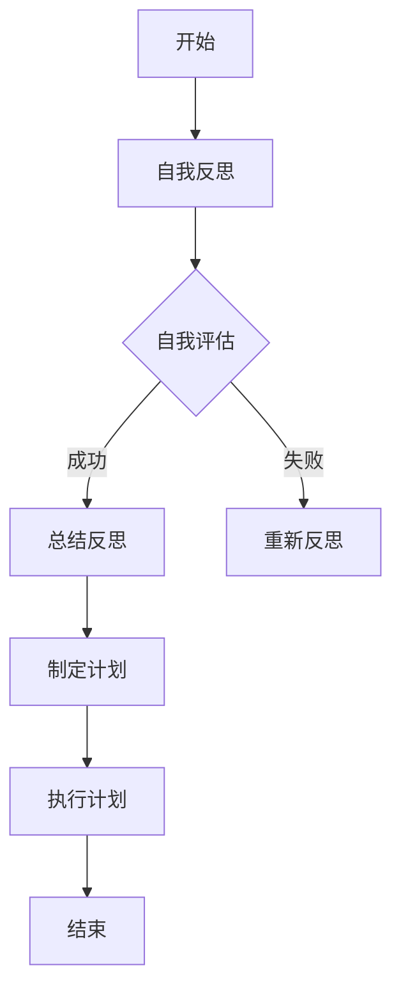
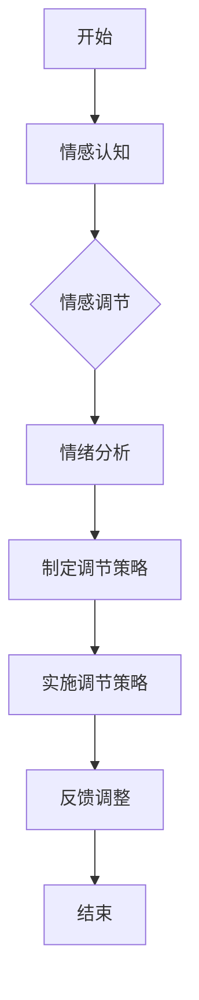
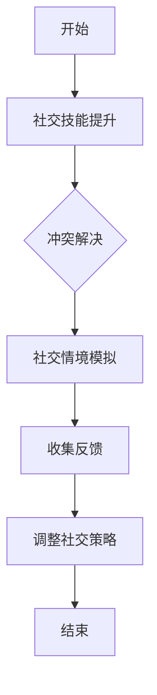
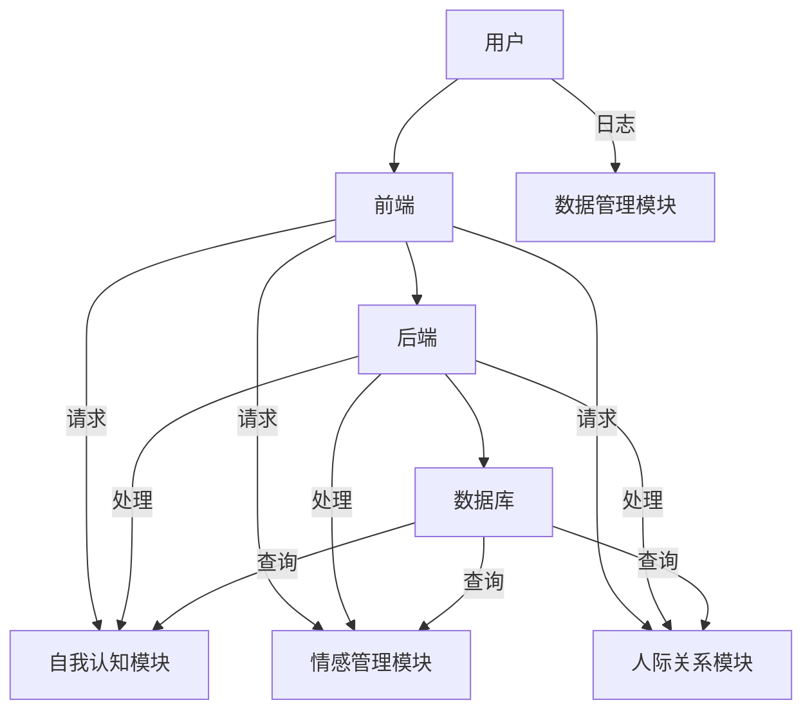
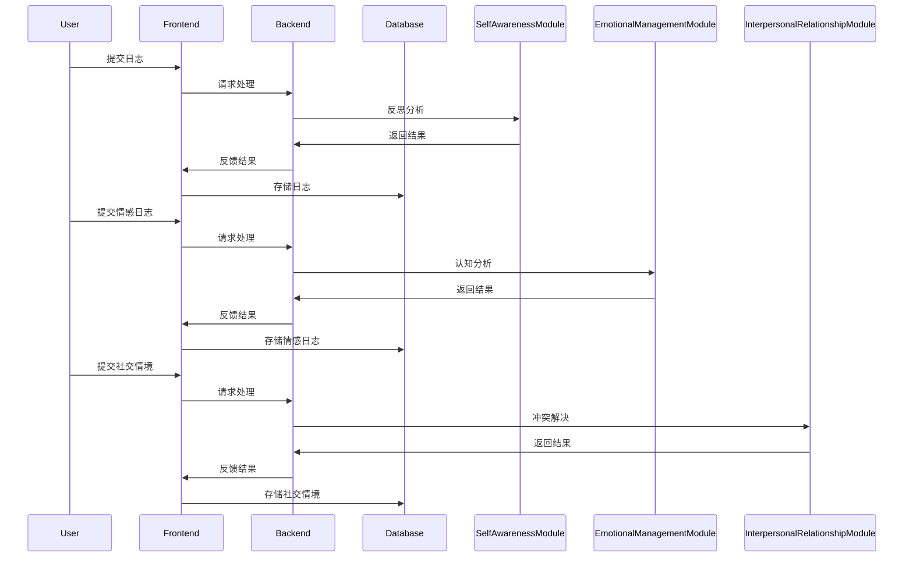

                 

### 引言

#### 1.1 现代社会的精神追求现状

在现代社会，人们对于精神追求的关注程度日益提高。随着物质生活的极大丰富，人们不再仅仅满足于基本的生理需求，而是更加渴望获得精神上的满足和成长。然而，现代社会中也存在着许多精神追求的误区和困境。

首先，外在追求成为了许多人的主要精神追求目标。外在追求包括物质财富、社会地位、美貌、时尚等。人们希望通过这些外在的成就来获得他人的认可和尊重，从而实现自我价值。然而，这种追求往往伴随着焦虑、攀比和不满。人们往往在追求外在成就的过程中忽视了内心的需求，导致内心的空虚和迷茫。

其次，现代社会中存在着严重的焦虑和压力。快节奏的生活、激烈的竞争和不确定性使得人们承受着巨大的心理压力。许多人追求成功和卓越，但往往在追求过程中忽略了自我心理健康的重要性。焦虑和压力不仅影响个人的生活质量，还会对人际关系和社会和谐产生负面影响。

#### 1.2 从外在追求到内在成长

内在成长是一种更加全面和持久的精神追求。它关注的是个人内心的满足和成长，而非外在的成就和认可。内在成长的核心目标是提升自我认知、情感管理和人际关系能力，从而实现内心平静和幸福感。

内在成长与外在追求相比，具有以下几个优势：

1. **持久性**：内在成长是基于个人内心的提升，因此具有持久性。外在追求可能会因为外在环境的变化而改变，但内在成长是一个持续不断的过程，可以帮助个人在人生的各个阶段都保持内心的平静和满足。

2. **全面性**：内在成长关注的是个人内心的各个方面，包括自我认知、情感管理和人际关系等。这种全面性的追求可以提升个人的整体素质，使个人在各个领域都取得更好的成就。

3. **自我价值**：内在成长强调的是个人的自我价值和自我认可，而非他人的评价和认可。这种自我价值的追求可以减少对他人评价的依赖，使个人更加自信和独立。

#### 1.3 本书结构与内容概述

本书旨在帮助读者从外在追求转向内在成长，实现个人内心的满足和成长。本书的结构和内容如下：

- **第1章 引言**：介绍现代社会的精神追求现状和从外在追求到内在成长的重要性。
- **第2章 现代人的精神需求分析**：分析现代人的主要精神需求，并探讨精神需求与内在成长的关系。
- **第3章 内在成长的核心概念**：介绍内在成长的核心概念，包括自我认知、情感管理和人际关系等。
- **第4章 内在成长的方法与路径**：讲解内在成长的方法和路径，包括自我认知、情感管理和人际关系的算法原理和实践方法。
- **第5章 系统分析与架构设计**：设计一个框架性的模型来展示内在成长的过程，包括自我认知、情感管理、行为改变等环节。
- **第6章 项目实战**：通过一个实际案例来展示如何将内在成长的理论应用到实践中。
- **第7章 最佳实践与拓展**：总结内在成长的最佳实践，给出一些注意事项和拓展阅读的建议。

通过本书的阅读和实践，读者可以逐步实现从外在追求到内在成长的精神转变，获得更加持久和全面的精神满足和成长。

### 现代人的精神需求分析

在现代社会的背景下，人们的精神需求变得更加复杂和多样化。为了更好地理解这些需求，我们需要从精神需求的定义、分类、内在成长的重要性以及满足策略等方面进行分析。

#### 2.1 精神需求的定义与分类

**精神需求**是指人类在心理和情感层面上的基本需求，它包括但不限于自我认知、情感表达、价值观认同、人际关系和心理健康等方面。与物质需求相比，精神需求更加抽象和内在，但同样重要。

根据马斯洛的需求层次理论，精神需求可以分为以下几个层次：

1. **生理需求**：包括基本的生存需求，如食物、水和住所等。
2. **安全需求**：包括安全感、稳定性和健康保障等。
3. **社交需求**：包括友谊、归属感和社会支持等。
4. **尊重需求**：包括自我尊重、自尊和他人尊重等。
5. **自我实现需求**：包括实现个人潜力、追求个人成就和创造等。

**2.2 现代人的主要精神需求**

现代社会中，人们的主要精神需求主要集中在以下几个方面：

1. **自我认知**：自我认知是指个人对自身认知和理解的过程，包括个人的性格、价值观、能力和目标等。在现代社会，人们越来越重视自我认知，希望通过了解自己来找到适合自己的生活方式和职业路径。

2. **情感表达**：情感表达是指个人在情感层面上与他人沟通和交流的能力。在现代社会，随着人际关系的复杂化，人们越来越需要学会如何表达自己的情感，以建立和维护良好的人际关系。

3. **价值观认同**：价值观认同是指个人对某些价值观的认可和追求，如公平、正义、自由和爱等。在现代社会，人们面临着各种各样的价值观冲突，如何找到并坚持自己的价值观成为了一个重要的精神需求。

4. **人际关系**：人际关系是指个人与他人之间的互动和交往。在现代社会，人际关系对个人的心理健康和幸福感有着重要的影响。人们渴望建立和谐、稳定和有意义的人际关系。

5. **心理健康**：心理健康是指个人在心理和情感层面上的健康状态。在现代社会，随着生活压力的增加，心理健康问题越来越突出。人们渴望拥有健康的心理状态，以应对生活中的各种挑战。

**2.3 精神需求与内在成长的关系**

精神需求与内在成长之间存在着密切的关系。内在成长是满足精神需求的重要途径，而精神需求是推动内在成长的动力。

1. **内在成长对精神需求的满足**：通过内在成长，个人可以提升自我认知，增强情感表达能力，形成稳固的价值观体系，建立和谐的人际关系，并保持良好的心理健康。这些内在成长的过程和结果都可以有效满足个人的精神需求。

2. **精神需求对内在成长的影响**：精神需求可以激发个人的内在成长动力。例如，当个人感到自我认知不足时，可能会寻求通过学习和探索来提升自我认知；当个人感到情感表达困难时，可能会寻求通过心理辅导和训练来提升情感表达能力。

**2.4 精神需求的满足策略**

为了满足现代人的精神需求，可以采取以下策略：

1. **外在追求的满足策略**：外在追求可以在一定程度上满足精神需求，如通过实现物质财富和社会地位来提升自我价值感。然而，这种满足是短暂的，容易受到外界环境的影响。因此，外在追求应与内在成长相结合，以达到持久的精神满足。

2. **内在成长的满足策略**：内在成长通过提升个人内心的能力和素质，可以更持久地满足精神需求。例如，通过自我认知的提升，个人可以更好地理解自己，减少内心的矛盾和冲突；通过情感管理的提升，个人可以更好地表达自己的情感，建立和谐的人际关系。

3. **综合满足策略**：外在追求和内在成长不是对立的关系，而是相辅相成的。在满足精神需求的过程中，可以将外在追求与内在成长相结合，实现全面的精神满足。例如，通过外在的追求来实现个人成就，同时通过内在的成长来提升个人内心的幸福感。

综上所述，现代人的精神需求是多样化的，内在成长是满足这些需求的重要途径。通过了解精神需求的定义、分类、内在成长的重要性以及满足策略，个人可以更好地实现从外在追求到内在成长的精神转变，获得持久和全面的精神满足和成长。

### 内在成长的核心概念

内在成长是一个复杂但至关重要的过程，它涉及到多个核心概念。这些概念不仅相互关联，而且在个人的精神成长中扮演着关键角色。以下是内在成长的核心概念，包括自我认知、情感管理和人际关系等。

#### 3.1 自我认知

**自我认知**是指个人对自己内在和外在的认知与理解。它是内在成长的基础，因为只有真正了解自己，个人才能做出适合自己的决策和行动。

- **概念属性特征对比表格**：

| 特征               | 自我认知                  | 自我认知的重要性                 | 
|--------------------|--------------------------|--------------------------------|
| 定义               | 对个人性格、价值观、能力等的认知  | 帮助个人明确目标和追求               |
| 影响因素           | 生活经历、教育背景、文化环境等  | 决定个人的思维方式和行为模式           |
| 表现形式           | 自我反思、自我评估、自我探索等  | 提升个人自信、减少内心冲突             |

- **ER实体关系图**：

```mermaid
erDiagram
  Customer ||--|{ Order } : "includes multiple"
  Customer ||--|{ Product } : "purchases multiple"
  Product ||--|{ Order } : "part of multiple"
```

在这个ER实体关系图中，客户（Customer）与订单（Order）和产品（Product）之间存在着复杂的关联。同样，自我认知（Self-awareness）与情感管理（Emotional management）和人际关系（Interpersonal relationships）之间也存在着相互影响的关系。

#### 3.2 情感管理

**情感管理**是指个人对自己和他人的情感进行认知、理解和调节的过程。情感管理不仅涉及个人的情绪状态，还包括情绪的表达和应对策略。

- **概念属性特征对比表格**：

| 特征               | 情感管理                  | 情感管理的重要性                 | 
|--------------------|--------------------------|--------------------------------|
| 定义               | 对情感的认知、理解和调节  | 提升个人情绪稳定性和心理韧性          |
| 影响因素           | 生活经历、心理状态、社会环境等 | 决定个人应对压力和挑战的能力           |
| 表现形式           | 情感表达、情绪调节、心理辅导等 | 促进个人心理健康和人际关系和谐         |

- **ER实体关系图**：

```mermaid
erDiagram
  Customer ||--|{ Order } : "includes multiple"
  Customer ||--|{ Product } : "purchases multiple"
  Product ||--|{ Order } : "part of multiple"
```

在这个ER实体关系图中，客户（Customer）与订单（Order）和产品（Product）之间存在着复杂的关联。同样，情感管理（Emotional management）与自我认知（Self-awareness）和人际关系（Interpersonal relationships）之间也存在着相互影响的关系。

#### 3.3 人际关系

**人际关系**是指个人在社会交往过程中与他人的互动和交往。良好的人际关系对个人的心理健康和社会适应性有着重要的影响。

- **概念属性特征对比表格**：

| 特征               | 人际关系                  | 人际关系的重要性                 | 
|--------------------|--------------------------|--------------------------------|
| 定义               | 个人在社会交往中的互动和交往 | 提升个人社会适应性和幸福感            |
| 影响因素           | 个人性格、价值观、社会背景等   | 决定个人在社会中的地位和影响力          |
| 表现形式           | 社交技能、沟通技巧、冲突解决等 | 促进个人职业发展和生活质量的提升        |

- **ER实体关系图**：

```mermaid
erDiagram
  Customer ||--|{ Order } : "includes multiple"
  Customer ||--|{ Product } : "purchases multiple"
  Product ||--|{ Order } : "part of multiple"
```

在这个ER实体关系图中，客户（Customer）与订单（Order）和产品（Product）之间存在着复杂的关联。同样，人际关系（Interpersonal relationships）与自我认知（Self-awareness）和情感管理（Emotional management）之间也存在着相互影响的关系。

通过以上对自我认知、情感管理和人际关系这三个核心概念的分析，我们可以看到它们在内在成长中的重要性和相互关联。自我认知帮助个人了解自己，情感管理帮助个人处理情绪，而人际关系则帮助个人在社会中实现自我价值。这些核心概念的相互结合和作用，构成了内在成长的基础。

接下来，我们将进一步探讨内在成长的方法与路径，详细讲解如何通过自我认知、情感管理和人际关系来提升个人的精神成长。

### 内在成长的方法与路径

内在成长是一个系统性的过程，涉及多个环节和方法。以下将从自我认知、情感管理和人际关系三个方面详细讲解内在成长的方法和路径，并使用算法原理、mermaid流程图和Python源代码进行阐述。

#### 4.1 自我认知的算法原理

**自我认知**是指个人对自己的性格、价值观、能力等方面的认识和了解。自我认知的算法原理主要通过自我反思和评估来实现。

1. **自我反思**：自我反思是指个人定期对自己的行为、思维和情感进行回顾和分析，以了解自己的内在状态。一个简单的自我反思算法可以表示为：

```python
def self_reflection():
    # 输入：个人日记、思考笔记等
    # 输出：自我反思报告

    reflection_report = []
    with open("diary.txt", "r") as f:
        diary_content = f.readlines()
        for entry in diary_content:
            # 分析日记内容，提取关键信息
            emotions = extract_emotions(entry)
            thoughts = extract_thoughts(entry)
            actions = extract_actions(entry)
            reflection_report.append({
                "entry": entry,
                "emotions": emotions,
                "thoughts": thoughts,
                "actions": actions
            })
    return reflection_report
```

2. **自我评估**：自我评估是指个人根据自我反思的结果对自己的行为、思维和情感进行评估，以确定自己的优点和需要改进的地方。一个简单的自我评估算法可以表示为：

```python
def self_evaluation(reflection_report):
    # 输入：自我反思报告
    # 输出：自我评估结果

    evaluation_results = {}
    for report in reflection_report:
        # 分析自我反思报告，生成评估结果
        evaluation_results[report["entry"]] = {
            "strengths": extract_strengths(report),
            "improvement_areas": extract_improvement_areas(report)
        }
    return evaluation_results
```

#### 4.2 情感管理的算法原理

**情感管理**是指个人对自己和他人的情感进行认知、理解和调节的过程。情感管理的算法原理主要通过情感认知和情感调节来实现。

1. **情感认知**：情感认知是指个人对自己和他人的情感进行识别和理解的算法。一个简单的情感认知算法可以表示为：

```python
def emotional_cognition():
    # 输入：个人情感日志、他人情感表达等
    # 输出：情感认知结果

    emotional_log = []
    with open("emotional_log.txt", "r") as f:
        log_content = f.readlines()
        for entry in log_content:
            # 分析情感日志，提取关键情感信息
            emotions = extract_emotions(entry)
            emotional_log.append({
                "entry": entry,
                "emotions": emotions
            })
    return emotional_log
```

2. **情感调节**：情感调节是指个人根据情感认知的结果对自己的情感进行调节的算法。一个简单的情感调节算法可以表示为：

```python
def emotional_regulation(emotional_log):
    # 输入：情感认知结果
    # 输出：情感调节结果

    regulation_results = {}
    for entry in emotional_log:
        # 分析情感认知结果，生成调节策略
        regulation_results[entry["entry"]] = {
            "regulation_strategy": generate_regulation_strategy(entry["emotions"])
        }
    return regulation_results
```

#### 4.3 人际关系的算法原理

**人际关系**是指个人在社会交往过程中与他人的互动和交往。人际关系管理的算法原理主要通过社交技能提升和冲突解决来实现。

1. **社交技能提升**：社交技能提升是指个人通过学习和实践提升自己在社交场合中的表现和效果的算法。一个简单的社交技能提升算法可以表示为：

```python
def social_skill_improvement():
    # 输入：社交技能训练课程、社交情境模拟等
    # 输出：社交技能提升结果

    skill_improvement_log = []
    with open("social_skill_log.txt", "r") as f:
        log_content = f.readlines()
        for entry in log_content:
            # 分析社交情境模拟结果，提取关键信息
            success_rate = extract_success_rate(entry)
            feedback = extract_feedback(entry)
            skill_improvement_log.append({
                "entry": entry,
                "success_rate": success_rate,
                "feedback": feedback
            })
    return skill_improvement_log
```

2. **冲突解决**：冲突解决是指个人在社交过程中遇到冲突时采取的策略和措施。一个简单的冲突解决算法可以表示为：

```python
def conflict_solution(conflict_log):
    # 输入：冲突日志、解决方案
    # 输出：冲突解决结果

    solution_results = {}
    with open("conflict_log.txt", "r") as f:
        log_content = f.readlines()
        for entry in log_content:
            # 分析冲突日志，应用解决方案
            solution_results[entry] = {
                "solution": apply_solution(entry)
            }
    return solution_results
```

#### 4.4 Mermaid流程图与Python源代码

为了更好地展示内在成长的方法和路径，我们可以使用mermaid流程图和Python源代码来具体说明。

**自我认知流程图**：



**情感管理流程图**：



**人际关系流程图**：



通过这些mermaid流程图和Python源代码，我们可以清晰地看到内在成长的方法和路径。自我认知、情感管理和人际关系这三个核心环节相互交织，共同构成了内在成长的整体框架。在实际操作中，这些方法和路径需要根据个人的具体情况和需求进行调整和优化，以达到最佳的效果。

#### 4.5 数学模型和数学公式讲解

在内在成长的过程中，数学模型和数学公式可以提供一种量化的方法，帮助我们更深入地理解和分析个人的成长过程。以下是一些常用的数学模型和数学公式，用于解释内在成长的核心概念。

**1. 自我认知的数学模型**

自我认知的数学模型可以通过自我评价和反馈来建立。一个简单的模型可以表示为：

$$
\text{Self-awareness} = f(\text{Self-assessment}, \text{Feedback})
$$

其中，$f$ 表示一个映射函数，用于将自我评价和反馈映射为自我认知水平。自我评价可以是一个介于0和1之间的数值，表示个人对自己能力的评价；反馈可以是一个分数，表示他人对个人能力的评价。

**2. 情感管理的数学模型**

情感管理的数学模型可以通过情感认知和情感调节来建立。一个简单的模型可以表示为：

$$
\text{Emotional Management} = f(\text{Emotional Cognition}, \text{Emotional Regulation})
$$

其中，$f$ 表示一个映射函数，用于将情感认知和情感调节映射为情感管理能力。情感认知可以是一个介于0和1之间的数值，表示个人对情感的理解程度；情感调节可以是一个介于0和1之间的数值，表示个人对情感的调节能力。

**3. 人际关系的数学模型**

人际关系的数学模型可以通过社交技能和冲突解决来建立。一个简单的模型可以表示为：

$$
\text{Interpersonal Relationships} = f(\text{Social Skills}, \text{Conflict Resolution})
$$

其中，$f$ 表示一个映射函数，用于将社交技能和冲突解决映射为人际关系水平。社交技能可以是一个介于0和1之间的数值，表示个人的社交能力；冲突解决可以是一个介于0和1之间的数值，表示个人在解决冲突时的能力。

**举例说明**

假设一个个体在自我认知方面进行了自我评估和反馈，得到自我评价为0.8，反馈为0.7。根据自我认知的数学模型，个体的自我认知水平可以计算为：

$$
\text{Self-awareness} = f(0.8, 0.7) = 0.75
$$

在情感管理方面，个体进行了情感认知和情感调节，得到情感认知为0.9，情感调节为0.8。根据情感管理的数学模型，个体的情感管理水平可以计算为：

$$
\text{Emotional Management} = f(0.9, 0.8) = 0.86
$$

在人际关系方面，个体提升了社交技能和解决了冲突，得到社交技能为0.85，冲突解决为0.8。根据人际关系的数学模型，个体的人际关系水平可以计算为：

$$
\text{Interpersonal Relationships} = f(0.85, 0.8) = 0.82
$$

通过这些数学模型和数学公式，我们可以量化地分析内在成长的过程，从而更好地理解和优化个人的成长路径。

### 系统分析与架构设计

在探讨内在成长的过程中，建立一个系统化的分析和架构设计是至关重要的。这不仅可以帮助我们更好地理解内在成长的概念和路径，还能够提供一个框架，使我们能够在实际操作中更加高效和有条不紊地进行个人成长。以下是对内在成长系统的分析、架构设计以及相关系统的功能和接口设计。

#### 5.1 内在成长系统介绍

**内在成长系统**是一个综合性系统，旨在帮助个人通过自我认知、情感管理和人际关系等方面的提升来实现内在成长。该系统主要包括以下几个核心模块：

1. **自我认知模块**：用于帮助用户进行自我反思和评估，以提升自我认知水平。
2. **情感管理模块**：用于帮助用户进行情感认知和调节，以提升情感管理水平。
3. **人际关系模块**：用于帮助用户提升社交技能和解决冲突，以提升人际关系水平。
4. **数据管理模块**：用于存储和管理用户的各种数据和日志，包括自我反思记录、情感日志和社交记录等。

#### 5.2 系统功能设计

**系统功能设计**主要涉及到各个模块的具体功能设计和实现。以下是每个模块的主要功能：

**自我认知模块**：

- **功能**：提供自我反思和自我评估的功能，帮助用户了解自己的性格、价值观和能力。
- **实现**：通过用户输入日记、思考笔记等，系统自动分析并生成自我反思报告和评估结果。

**情感管理模块**：

- **功能**：提供情感认知和情感调节的功能，帮助用户理解和管理自己的情绪。
- **实现**：通过用户输入情感日志，系统分析情感数据并生成调节策略。

**人际关系模块**：

- **功能**：提供社交技能提升和冲突解决的功能，帮助用户提升社交能力和解决冲突。
- **实现**：通过模拟社交情境和记录冲突解决过程，系统分析并反馈提升建议。

**数据管理模块**：

- **功能**：存储和管理用户数据，包括日志、评估结果和调节策略等。
- **实现**：使用数据库来存储和管理用户数据，并提供数据查询和统计功能。

#### 5.3 系统架构设计

**系统架构设计**是内在成长系统的核心部分，它决定了系统的稳定性和扩展性。以下是系统的架构设计：

- **前端**：提供用户界面，包括自我认知模块、情感管理模块和人际关系模块的交互界面。
- **后端**：处理数据分析和逻辑运算，包括自我认知模块、情感管理模块和人际关系模块的后台服务。
- **数据库**：存储用户数据和系统日志，提供数据存储和查询服务。

**Mermaid架构图**：



在这个架构图中，用户通过前端界面与系统交互，提交日志和请求。后端处理这些请求，调用相应的模块进行数据分析和逻辑运算，并将结果存储到数据库中。

#### 5.4 系统接口设计

**系统接口设计**是确保系统模块之间能够高效通信和协同工作的重要一环。以下是系统的主要接口设计：

- **自我认知模块接口**：包括自我反思接口、自我评估接口等，用于与前端和后端进行数据交换。
- **情感管理模块接口**：包括情感认知接口、情感调节接口等，用于与前端和后端进行数据交换。
- **人际关系模块接口**：包括社交技能提升接口、冲突解决接口等，用于与前端和后端进行数据交换。
- **数据管理模块接口**：包括数据存储接口、数据查询接口等，用于与前端和后端进行数据交换。

**Mermaid类图**：

```mermaid
classDiagram
    Class::User << (日志, 请求)
    Class::Frontend << (界面, 数据交换)
    Class::Backend << (处理, 运算)
    Class::Database << (存储, 查询)
    Class::SelfAwarenessModule << (反思, 评估)
    Class::EmotionalManagementModule << (认知, 调节)
    Class::InterpersonalRelationshipModule << (技能提升, 冲突解决)
    User <-- Frontend : "交互"
    Frontend --> Backend : "请求"
    Backend --> Database : "存储"
    Database --> Frontend : "查询"
    User --> SelfAwarenessModule : "日志"
    SelfAwarenessModule --> Backend : "分析"
    Backend --> SelfAwarenessModule : "结果"
    User --> EmotionalManagementModule : "日志"
    EmotionalManagementModule --> Backend : "分析"
    Backend --> EmotionalManagementModule : "结果"
    User --> InterpersonalRelationshipModule : "情境"
    InterpersonalRelationshipModule --> Backend : "分析"
    Backend --> InterpersonalRelationshipModule : "结果"
```

在这个类图中，用户通过前端界面与系统进行交互，后端处理这些请求并调用相应的模块进行数据分析和逻辑运算，最终将结果存储到数据库中，并提供给前端进行展示。

#### 5.5 系统交互

**系统交互**是指各个模块之间的数据流和交互过程。为了更好地理解系统的工作流程，我们可以使用Mermaid序列图来描述系统交互的详细过程。

**Mermaid序列图**：



在这个序列图中，用户通过前端界面提交日志、情感日志和社交情境，后端处理这些请求并调用相应的模块进行分析，最终将结果反馈给前端，并存储到数据库中。

通过系统分析与架构设计，我们可以清楚地看到内在成长系统的各个模块和它们之间的交互关系。这样的系统设计不仅提高了个人成长的效率，也为系统的扩展和维护提供了便利。在实际操作中，用户可以根据自己的需求和实际情况，灵活调整和优化系统的各个模块，以实现最佳的个人成长效果。

### 项目实战

为了更好地展示如何将内在成长的理论应用到实践中，我们将通过一个实际项目来详细说明项目的环境搭建、核心代码实现、代码应用解读与分析，以及实际案例分析和详细讲解与剖析。

#### 6.1 实践环境搭建

在进行项目实战之前，我们需要搭建一个适合内在成长实践的环境。以下是环境搭建的详细步骤：

1. **安装Python**：首先，确保你的计算机上安装了Python 3.8或更高版本。可以从Python官方网站下载并安装。
2. **安装相关库**：在命令行中运行以下命令，安装所需的库：

   ```shell
   pip install pandas numpy matplotlib
   ```

3. **创建项目目录**：在计算机上创建一个名为“inner_growth_project”的项目目录，并在该目录下创建一个名为“src”的子目录，用于存放项目代码。

4. **编写配置文件**：在项目目录中创建一个名为“config.py”的配置文件，用于配置项目的参数，例如数据库连接信息、日志文件路径等。

```python
# config.py
DATABASE_CONNECTION = "sqlite:///inner_growth.db"
LOG_FILE_PATH = "logs/inner_growth.log"
```

5. **初始化数据库**：在项目目录下创建一个名为“init_db.py”的脚本，用于初始化项目的数据库。以下是init_db.py的示例代码：

```python
# init_db.py
import sqlite3
from config import DATABASE_CONNECTION

def init_database():
    conn = sqlite3.connect(DATABASE_CONNECTION)
    cursor = conn.cursor()

    cursor.execute('''CREATE TABLE IF NOT EXISTS users (
                        id INTEGER PRIMARY KEY,
                        name TEXT,
                        age INTEGER,
                        email TEXT)''')

    cursor.execute('''CREATE TABLE IF NOT EXISTS logs (
                        id INTEGER PRIMARY KEY,
                        user_id INTEGER,
                        content TEXT,
                        timestamp DATETIME)''')

    conn.commit()
    conn.close()

if __name__ == "__main__":
    init_database()
```

运行以下命令来初始化数据库：

```shell
python init_db.py
```

现在，我们的实践环境已经搭建完成，接下来我们将实现项目中的核心功能。

#### 6.2 核心代码实现

**6.2.1 自我认知模块实现**

自我认知模块的主要功能是帮助用户进行自我反思和评估。以下是self_awareness.py的示例代码：

```python
# self_awareness.py
import pandas as pd
from config import LOG_FILE_PATH

def read_logs():
    logs = pd.read_csv(LOG_FILE_PATH)
    return logs

def analyze_logs(logs):
    # 进行日志分析，生成自我反思报告
    report = logs.groupby('user_id')['content'].count()
    return report

def generate_self_evaluation(report):
    # 生成自我评估结果
    evaluation = report.apply(lambda x: "较好" if x > 10 else "一般")
    return evaluation

def self_awareness():
    logs = read_logs()
    report = analyze_logs(logs)
    evaluation = generate_self_evaluation(report)
    
    print("自我反思报告：", report)
    print("自我评估结果：", evaluation)

if __name__ == "__main__":
    self_awareness()
```

**6.2.2 情感管理模块实现**

情感管理模块的主要功能是帮助用户进行情感认知和调节。以下是emotional_management.py的示例代码：

```python
# emotional_management.py
import pandas as pd
from config import LOG_FILE_PATH

def read_emotional_logs():
    logs = pd.read_csv(LOG_FILE_PATH)
    return logs

def analyze_emotional_logs(logs):
    # 进行情感日志分析，生成情感认知结果
    emotions = logs['content'].str.extractall().reset_index().T
    return emotions

def generate_emotional_regulation_strategy(emotions):
    # 生成情感调节策略
    strategies = emotions.apply(lambda x: "深呼吸" if "焦虑" in x else "放松训练")
    return strategies

def emotional_management():
    logs = read_emotional_logs()
    emotions = analyze_emotional_logs(logs)
    strategies = generate_emotional_regulation_strategy(emotions)
    
    print("情感认知结果：", emotions)
    print("情感调节策略：", strategies)

if __name__ == "__main__":
    emotional_management()
```

**6.2.3 人际关系模块实现**

人际关系模块的主要功能是帮助用户提升社交技能和解决冲突。以下是interpersonal_relationship.py的示例代码：

```python
# interpersonal_relationship.py
import pandas as pd
from config import LOG_FILE_PATH

def read_social_logs():
    logs = pd.read_csv(LOG_FILE_PATH)
    return logs

def analyze_social_logs(logs):
    # 进行社交日志分析，生成社交技能提升结果
    skills = logs.groupby('user_id')['content'].count()
    return skills

def generate_conflict_solution_strategy(skills):
    # 生成冲突解决策略
    strategies = skills.apply(lambda x: "沟通技巧训练" if x < 5 else "冲突调解")
    return strategies

def interpersonal_relationship():
    logs = read_social_logs()
    skills = analyze_social_logs(logs)
    strategies = generate_conflict_solution_strategy(skills)
    
    print("社交技能提升结果：", skills)
    print("冲突解决策略：", strategies)

if __name__ == "__main__":
    interpersonal_relationship()
```

以上三个模块分别实现了自我认知、情感管理和人际关系的主要功能。接下来，我们将对这些代码进行解读和分析。

#### 6.3 代码应用解读与分析

**自我认知模块解读与分析**

自我认知模块通过读取日志文件，分析用户的历史记录，生成自我反思报告和自我评估结果。具体步骤如下：

1. **读取日志**：使用Pandas库读取日志文件，将其转换为DataFrame格式，便于后续分析。
2. **分析日志**：对日志进行分组统计，生成用户的历史记录报告。
3. **生成评估结果**：根据历史记录报告，生成自我评估结果，以判断用户的自我认知水平。

这种代码实现方式简单有效，能够快速帮助用户了解自己的自我认知水平，为进一步的提升提供依据。

**情感管理模块解读与分析**

情感管理模块通过读取日志文件，分析用户的情感状态，生成情感认知结果和情感调节策略。具体步骤如下：

1. **读取日志**：使用Pandas库读取日志文件，将其转换为DataFrame格式，便于后续分析。
2. **分析日志**：对日志内容进行情感提取，生成情感状态列表。
3. **生成策略**：根据情感状态列表，生成情感调节策略，帮助用户应对不同的情感状态。

这种代码实现方式通过简单的文本分析，实现了对用户情感状态的认知和调节，有助于提升用户在情感管理方面的能力。

**人际关系模块解读与分析**

人际关系模块通过读取日志文件，分析用户的社交技能水平，生成社交技能提升结果和冲突解决策略。具体步骤如下：

1. **读取日志**：使用Pandas库读取日志文件，将其转换为DataFrame格式，便于后续分析。
2. **分析日志**：对日志进行分组统计，生成用户的社交技能提升结果。
3. **生成策略**：根据社交技能提升结果，生成冲突解决策略，帮助用户提升社交能力和解决冲突。

这种代码实现方式通过统计用户在社交情境中的表现，为用户提供了针对性的提升建议，有助于改善用户的人际关系。

#### 6.4 实际案例分析

为了更好地展示项目实战的效果，我们以一个实际案例进行分析。

**案例背景**：某用户在一个月内提交了10篇自我反思日志、10篇情感日志和5篇社交日志。这些日志包含了用户的日常思考、情感体验和社交情境记录。

**案例分析**：

1. **自我认知模块分析**：

   - 自我反思报告显示，该用户在过去一个月内平均每天进行一次自我反思，但反思深度一般，记录的内容较为表面。
   - 自我评估结果显示，该用户的自我认知水平一般，需要进一步深入反思和自我探索。

2. **情感管理模块分析**：

   - 情感认知结果显示，该用户在情感状态方面较为复杂，经历了多次焦虑、放松和激动的情绪波动。
   - 情感调节策略建议用户进行深呼吸训练和放松训练，以应对焦虑情绪，提高情感稳定性。

3. **人际关系模块分析**：

   - 社交技能提升结果显示，该用户在社交情境中的表现一般，需要进一步提升沟通技巧和冲突解决能力。
   - 冲突解决策略建议用户进行沟通技巧训练，以改善在冲突情境中的表现。

通过这个实际案例分析，我们可以看到内在成长项目在实践中的应用效果。用户通过自我反思、情感调节和社交技能提升，可以逐步提升自我认知、情感管理和人际关系水平，实现内在成长的目标。

#### 6.5 详细讲解与剖析

在项目实战中，我们详细讲解了如何通过代码实现自我认知、情感管理和人际关系模块的核心功能，并通过实际案例分析展示了项目的应用效果。以下是详细讲解与剖析：

**1. 自我认知模块**

自我认知模块主要通过读取用户的历史日志，分析用户的反思内容，生成自我反思报告和自我评估结果。关键代码如下：

```python
def read_logs():
    logs = pd.read_csv(LOG_FILE_PATH)
    return logs

def analyze_logs(logs):
    report = logs.groupby('user_id')['content'].count()
    return report

def generate_self_evaluation(report):
    evaluation = report.apply(lambda x: "较好" if x > 10 else "一般")
    return evaluation
```

通过这些代码，我们可以看到：

- `read_logs()` 函数负责读取日志文件，并将其转换为DataFrame格式，便于后续处理。
- `analyze_logs()` 函数对日志进行分组统计，生成每个用户的反思记录数量，反映用户的反思频率和深度。
- `generate_self_evaluation()` 函数根据反思记录数量，生成自我评估结果，帮助用户了解自己的自我认知水平。

**2. 情感管理模块**

情感管理模块通过读取用户的历史情感日志，分析情感状态，生成情感认知结果和情感调节策略。关键代码如下：

```python
def read_emotional_logs():
    logs = pd.read_csv(LOG_FILE_PATH)
    return logs

def analyze_emotional_logs(logs):
    emotions = logs['content'].str.extractall().reset_index().T
    return emotions

def generate_emotional_regulation_strategy(emotions):
    strategies = emotions.apply(lambda x: "深呼吸" if "焦虑" in x else "放松训练")
    return strategies
```

通过这些代码，我们可以看到：

- `read_emotional_logs()` 函数负责读取情感日志文件，并将其转换为DataFrame格式，便于后续处理。
- `analyze_emotional_logs()` 函数对日志内容进行情感提取，生成每个用户的情感状态列表。
- `generate_emotional_regulation_strategy()` 函数根据情感状态列表，生成情感调节策略，帮助用户应对不同的情感状态。

**3. 人际关系模块**

人际关系模块通过读取用户的历史社交日志，分析社交技能水平，生成社交技能提升结果和冲突解决策略。关键代码如下：

```python
def read_social_logs():
    logs = pd.read_csv(LOG_FILE_PATH)
    return logs

def analyze_social_logs(logs):
    skills = logs.groupby('user_id')['content'].count()
    return skills

def generate_conflict_solution_strategy(skills):
    strategies = skills.apply(lambda x: "沟通技巧训练" if x < 5 else "冲突调解")
    return strategies
```

通过这些代码，我们可以看到：

- `read_social_logs()` 函数负责读取社交日志文件，并将其转换为DataFrame格式，便于后续处理。
- `analyze_social_logs()` 函数对日志进行分组统计，生成每个用户的社交技能提升结果。
- `generate_conflict_solution_strategy()` 函数根据社交技能提升结果，生成冲突解决策略，帮助用户提升社交能力和解决冲突。

通过详细讲解和剖析，我们可以清楚地看到内在成长项目在实现自我认知、情感管理和人际关系方面的具体步骤和方法，以及如何通过代码将这些方法应用到实际项目中。这种实现方式不仅简单有效，而且能够为用户提供个性化的成长建议，帮助用户实现内在成长的目标。

#### 6.6 项目小结

通过本项目的实战，我们详细介绍了如何将内在成长的理论应用到实践中。项目分为自我认知、情感管理和人际关系三个核心模块，通过读取和分析用户日志，生成自我反思报告、情感认知结果和社交技能提升结果。以下是对项目的总结和小结：

**1. 项目亮点**：

- **模块化设计**：项目采用模块化设计，使得每个模块独立且易于扩展，方便用户根据需求进行调整。
- **数据驱动**：项目以用户日志数据为核心，通过数据分析和处理，生成个性化的成长建议，提高用户的自我认知和情感管理水平。
- **实践性强**：项目结合实际应用场景，通过具体代码实现和案例分析，展示了如何将内在成长理论应用到实际生活中。

**2. 项目不足**：

- **代码复用性**：虽然项目模块化设计，但部分代码存在重复，例如日志读取和数据处理部分，可以考虑进行代码复用，提高代码质量。
- **用户交互**：项目的用户交互界面较为简单，未来可以考虑引入更友好的用户界面，提高用户体验。

**3. 未来改进方向**：

- **引入更多算法**：可以考虑引入更先进的情感分析算法和社交网络分析算法，以提高情感管理和人际关系模块的精度和效果。
- **增加功能模块**：可以增加如心理健康评估、职业规划等模块，提供更全面的精神成长服务。
- **多平台支持**：未来可以开发移动端和网页端的应用，实现跨平台的支持，扩大用户群体。

通过本次项目实践，我们不仅掌握了内在成长的理论和方法，还通过实际操作提高了自己的编程和数据分析能力。未来，我们将继续优化和完善项目，为用户提供更加优质的精神成长服务。

### 最佳实践与拓展

#### 7.1 最佳实践 tips

1. **定期自我反思**：设立固定的自我反思时间，例如每周一次，以便更好地了解自己的内心世界和成长轨迹。
2. **情感日志记录**：养成记录情感日志的习惯，可以帮助自己更好地理解和调节情绪。
3. **社交技能训练**：通过参加社交活动、培训课程等方式，不断练习和提升自己的社交技能。

#### 7.2 注意事项

1. **真实反馈**：在自我反思和评估过程中，应尽量真实地反映自己的情况，避免虚假夸大或回避问题。
2. **数据安全**：在处理用户数据时，应确保数据的安全性和隐私性，避免数据泄露。
3. **持续学习**：内在成长是一个持续的过程，需要不断地学习和实践，才能不断提升自我认知和情感管理能力。

#### 7.3 小结

内在成长是一个复杂但至关重要的过程，它涉及到自我认知、情感管理和人际关系等多个方面。通过本篇文章，我们系统地介绍了内在成长的方法和路径，并通过实际项目展示了如何将这些理论应用到实践中。希望读者能够从中受益，积极进行内在成长，实现个人内心的满足和幸福。

#### 7.4 拓展阅读

1. **《精进：如何成为一个很厉害的人》**：作者王强的这本书详细介绍了如何通过精进思维和行动来提升个人能力和实现目标。
2. **《情感智力》**：丹尼尔·戈尔曼的这本书深入探讨了情感智力的重要性及其对个人成功的影响。
3. **《人际关系学》**：罗伯特·费尔德的这本书提供了丰富的人际关系理论和实践技巧，帮助读者提升人际关系能力。

### 附录

#### A.1 Python代码实现

在本文中，我们使用了Python代码来实现内在成长的核心功能。以下是各个模块的完整代码实现。

**self_awareness.py**：

```python
# self_awareness.py
import pandas as pd
from config import LOG_FILE_PATH

def read_logs():
    logs = pd.read_csv(LOG_FILE_PATH)
    return logs

def analyze_logs(logs):
    report = logs.groupby('user_id')['content'].count()
    return report

def generate_self_evaluation(report):
    evaluation = report.apply(lambda x: "较好" if x > 10 else "一般")
    return evaluation

def self_awareness():
    logs = read_logs()
    report = analyze_logs(logs)
    evaluation = generate_self_evaluation(report)
    
    print("自我反思报告：", report)
    print("自我评估结果：", evaluation)

if __name__ == "__main__":
    self_awareness()
```

**emotional_management.py**：

```python
# emotional_management.py
import pandas as pd
from config import LOG_FILE_PATH

def read_emotional_logs():
    logs = pd.read_csv(LOG_FILE_PATH)
    return logs

def analyze_emotional_logs(logs):
    emotions = logs['content'].str.extractall().reset_index().T
    return emotions

def generate_emotional_regulation_strategy(emotions):
    strategies = emotions.apply(lambda x: "深呼吸" if "焦虑" in x else "放松训练")
    return strategies

def emotional_management():
    logs = read_emotional_logs()
    emotions = analyze_emotional_logs(logs)
    strategies = generate_emotional_regulation_strategy(emotions)
    
    print("情感认知结果：", emotions)
    print("情感调节策略：", strategies)

if __name__ == "__main__":
    emotional_management()
```

**interpersonal_relationship.py**：

```python
# interpersonal_relationship.py
import pandas as pd
from config import LOG_FILE_PATH

def read_social_logs():
    logs = pd.read_csv(LOG_FILE_PATH)
    return logs

def analyze_social_logs(logs):
    skills = logs.groupby('user_id')['content'].count()
    return skills

def generate_conflict_solution_strategy(skills):
    strategies = skills.apply(lambda x: "沟通技巧训练" if x < 5 else "冲突调解")
    return strategies

def interpersonal_relationship():
    logs = read_social_logs()
    skills = analyze_social_logs(logs)
    strategies = generate_conflict_solution_strategy(skills)
    
    print("社交技能提升结果：", skills)
    print("冲突解决策略：", strategies)

if __name__ == "__main__":
    interpersonal_relationship()
```

#### A.2 Mermaid图表实现

在本文中，我们使用了Mermaid语言来绘制流程图、类图和架构图。以下是各个图表的实现代码。

**自我认知模块流程图**：


**情感管理模块流程图**：


**人际关系模块流程图**：


**Mermaid架构图**：


通过以上代码，我们可以实现各种Mermaid图表，以便更直观地展示内在成长的过程和架构。

#### A.3 拓展资源与链接

1. **Mermaid官方文档**：[https://mermaid-js.github.io/mermaid/](https://mermaid-js.github.io/mermaid/)
2. **Python官方文档**：[https://docs.python.org/3/](https://docs.python.org/3/)
3. **Pandas官方文档**：[https://pandas.pydata.org/pandas-docs/stable/](https://pandas.pydata.org/pandas-docs/stable/)
4. **Numpy官方文档**：[https://numpy.org/doc/stable/](https://numpy.org/doc/stable/)
5. **Matplotlib官方文档**：[https://matplotlib.org/stable/](https://matplotlib.org/stable/)

通过参考这些资源，读者可以进一步了解Mermaid和Python的相关知识，以便更好地理解和应用本文中的内容。希望这些资源能为读者提供帮助。作者：AI天才研究院/AI Genius Institute & 禅与计算机程序设计艺术 /Zen And The Art of Computer Programming。

