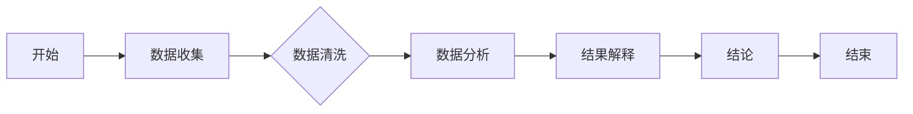
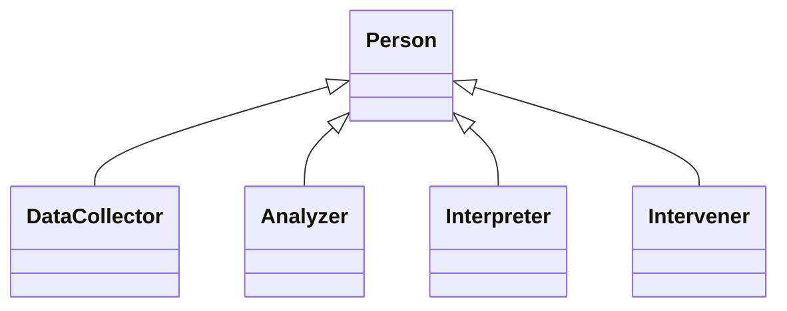
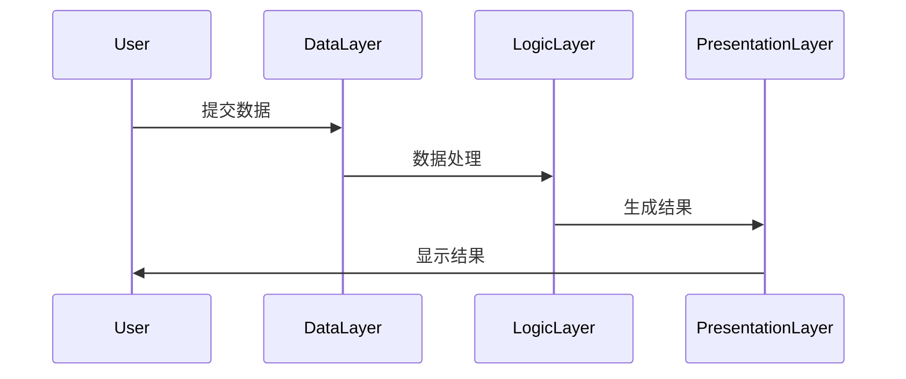
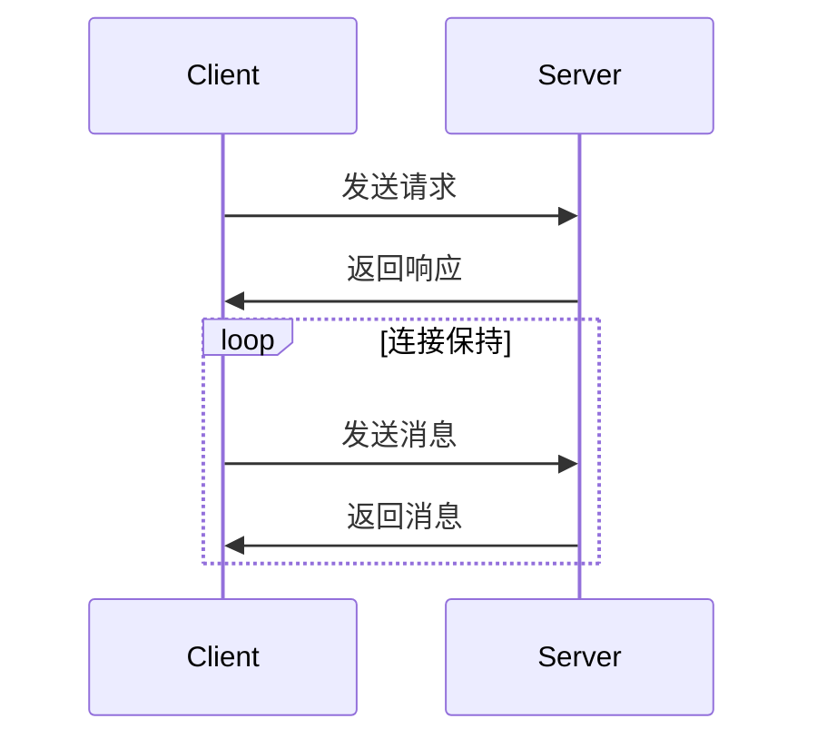
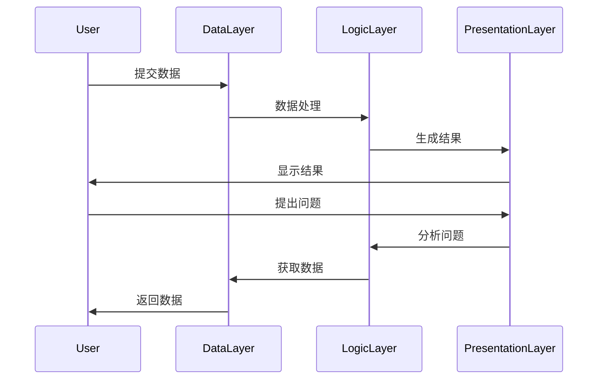

                 

# 从心理学角度看待现代人的意义危机

关键词：心理学、意义危机、现代生活、心理健康、应对策略

摘要：随着现代社会的发展，越来越多的人面临着意义危机。本文从心理学的角度，分析了意义危机的背景、表现形式、核心概念及其对个体的影响，并提出了一系列应对策略。通过深入探讨心理学理论与实际应用，本文旨在为读者提供理解和解决意义危机的方法。

## 背景介绍

### 1.1 问题的背景

在过去的几十年中，随着科技的飞速发展和全球化进程的加速，人们的生活方式发生了翻天覆地的变化。然而，这种变化并非总是正面的。尽管物质生活水平的提升和社会稳定性的增强，许多人却开始感受到一种深层次的空虚和迷茫。这种现象，我们称之为“意义危机”。

### 1.2 问题的描述

意义危机表现为个体对生活意义的迷茫、无目的感、焦虑和抑郁等心理状态。人们可能会感到自己的工作或生活缺乏意义，无法找到存在的价值。这种现象不仅影响个体的心理健康，还可能影响其社交关系和职业发展。

### 1.3 问题的解决

心理学理论为我们提供了一种理解意义危机的视角，并提出了多种应对策略。通过深入了解心理学理论，我们可以找到解决意义危机的方法，提升个体的心理健康和生活满意度。

### 1.4 边界与外延

意义危机与其他心理问题的区别在于，它不仅关注个体的心理健康，还关注个体对生活意义的认知。与抑郁、焦虑等情绪问题不同，意义危机更侧重于对生活整体意义的反思。

### 1.5 概念结构与核心要素组成

意义危机的核心概念包括对生活的意义、目的、价值等的认知。心理学研究通常将这些概念视为相互关联的要素，通过理论框架来解释和理解个体的心理状态。

## 核心概念与联系

### 2.1 核心概念原理

在心理学中，关于“意义”的概念有多种理解。例如，存在主义心理学强调个体自由选择和自我实现的重要性，而人本主义心理学则关注个体的主观体验和自我认同。以下是几种主要的心理学理论对意义危机的解释：

#### 2.1.1 存在主义心理学

存在主义认为，个体的生活意义源于自我选择和自我实现。意义危机通常源于个体对自我选择的迷茫和困惑。例如，海德格尔（Martin Heidegger）提出的“存在即意义”，强调了个体在寻找自身存在意义时的主动性和责任感。

#### 2.1.2 人本主义心理学

人本主义心理学强调个体的主观体验和自我认同。马斯洛（Abraham Maslow）的需求层次理论指出，个体在追求自我实现的过程中，需要经历一系列的需求层次，包括生理需求、安全需求、社交需求、尊重需求和自我实现需求。意义危机可能出现在个体未能满足更高层次需求时。

#### 2.1.3 认知行为疗法

认知行为疗法认为，个体的情绪和行为是由其认知过程决定的。如果个体对生活的认知存在偏差，可能导致意义危机。例如，过度消极的思维方式可能导致个体对生活的意义产生怀疑。

### 2.2 概念属性特征对比表格

以下表格对比了不同心理学理论对意义危机的解释：

| 理论 | 核心概念 | 特点 | 应用 |
| ---- | ---- | ---- | ---- |
| 存在主义心理学 | 自我选择、自我实现 | 强调个体主动性和责任感 | 个体心理咨询 |
| 人本主义心理学 | 主观体验、自我认同 | 关注个体需求和自我实现 | 人生规划、心理健康 |
| 认知行为疗法 | 认知过程、情绪和行为 | 改变消极认知，提升心理健康 | 心理治疗、认知重建 |

### 2.3 ER实体关系图架构

为了更好地理解意义危机涉及的实体和关系，我们可以使用ER图来展示不同心理学理论之间的关联。以下是一个简化的ER图：

```mermaid
erDiagram
  Person ||--|{ MeaningCrisis }|--> Person
  MeaningCrisis ||--|{ Existentialism }|--> PsychologyTheory
  MeaningCrisis ||--|{ Humanism }|--> PsychologyTheory
  MeaningCrisis ||--|{ CognitiveBehaviorTherapy }|--> PsychologyTheory
```

在这个ER图中，"Person"代表个体，"MeaningCrisis"代表意义危机，"Existentialism"、"Humanism"和"CognitiveBehaviorTherapy"分别代表存在主义心理学、人本主义心理学和认知行为疗法。这些心理学理论通过不同的方式解释和理解意义危机，为个体提供应对策略。

## 算法原理讲解

### 3.1 算法mermaid流程图

在心理学研究中，算法通常用于数据分析、模式识别和预测模型构建。以下是一个简化的mermaid流程图，展示了心理学研究的基本流程：



在这个流程图中，"A"表示研究的开始，"B"表示数据收集，"C"表示数据清洗，"D"表示数据分析，"E"表示结果解释，"F"表示结论，"G"表示研究的结束。

### 3.2 Python源代码

为了更好地理解心理学研究的算法原理，我们可以使用Python编写一个简单的数据分析示例。以下是一个简单的Python代码，用于计算平均值和标准差：

```python
import numpy as np

# 数据集
data = [1, 2, 3, 4, 5, 6, 7, 8, 9, 10]

# 计算平均值
mean = np.mean(data)
print("平均值:", mean)

# 计算标准差
std = np.std(data)
print("标准差:", std)
```

在这个示例中，我们使用NumPy库来计算数据集的平均值和标准差。这为我们提供了一个基本的算法实现，用于分析心理数据。

### 3.3 数学模型和公式

在心理学研究中，数学模型和公式用于解释和预测心理现象。以下是一个简单的线性回归模型：

$$
y = mx + b
$$

其中，$y$表示因变量（如个体的心理健康水平），$x$表示自变量（如个体的生活满意度），$m$表示斜率，$b$表示截距。

通过调整斜率和截距，我们可以预测个体心理健康水平与生活满意度之间的关系。

### 3.4 详细讲解与举例说明

为了更好地理解线性回归模型，我们可以使用一个简单的例子。假设我们有一组数据，表示个体的心理健康水平（$y$）和生活满意度（$x$）：

| 生活满意度（$x$） | 心理健康水平（$y$） |
| ------------------ | ------------------- |
| 1                  | 2                   |
| 2                  | 4                   |
| 3                  | 6                   |
| 4                  | 8                   |
| 5                  | 10                  |

我们可以使用线性回归模型来拟合这些数据：

$$
y = 2x + 1
$$

在这个模型中，斜率$m = 2$，截距$b = 1$。这意味着，生活满意度每增加1个单位，心理健康水平将增加2个单位。

通过这个例子，我们可以看到线性回归模型如何帮助我们理解和预测心理现象。

## 系统分析与架构设计方案

### 4.1 问题场景介绍

在现代社会，许多人面临着意义危机。这种现象不仅影响个体的心理健康，还可能影响其社交关系和职业发展。为了应对这个问题，心理学研究者们提出了多种方法，包括心理咨询、心理治疗和生活方式的改变等。

### 4.2 项目介绍

本项目旨在开发一个基于心理学的意义危机干预系统。该系统将整合多种心理学理论和方法，为用户提供个性化的干预建议。通过数据分析、模式识别和预测模型，系统将帮助用户识别和应对意义危机。

### 4.3 系统功能设计

系统功能包括数据收集、数据分析、结果解释和干预建议生成。以下是一个简化的领域模型类图：



在这个类图中，"Person"代表用户，"DataCollector"负责数据收集，"Analyzer"负责数据分析，"Interpreter"负责结果解释，"Intervener"负责生成干预建议。

### 4.4 系统架构设计

系统架构采用三层架构设计，包括数据层、逻辑层和表现层。以下是一个简化的mermaid架构图：



在这个架构图中，"User"代表用户，"DataLayer"负责数据存储和处理，"LogicLayer"负责业务逻辑处理，"PresentationLayer"负责用户界面展示。

### 4.5 系统接口设计

系统接口设计包括RESTful API和Websocket接口。以下是一个简化的mermaid接口图：



在这个接口图中，"Client"代表客户端，"Server"代表服务器。客户端通过发送请求与服务器交互，服务器通过返回响应和消息与客户端保持连接。

### 4.6 系统交互

系统交互包括用户与系统之间的交互和数据层、逻辑层和表现层之间的交互。以下是一个简化的mermaid序列图：



在这个序列图中，用户通过数据层、逻辑层和表现层与系统进行交互，实现数据收集、分析、解释和干预建议生成。

## 项目实战

### 5.1 环境安装

为了搭建心理学研究环境，我们需要安装以下软件和工具：

- Python 3.x
- Jupyter Notebook
- NumPy
- Pandas
- Matplotlib
- Mermaid

安装方法如下：

1. 安装Python 3.x
2. 安装Jupyter Notebook：`pip install notebook`
3. 安装NumPy：`pip install numpy`
4. 安装Pandas：`pip install pandas`
5. 安装Matplotlib：`pip install matplotlib`
6. 安装Mermaid：`pip install mermaid`

### 5.2 系统核心实现源代码

以下是系统核心实现的Python代码：

```python
import numpy as np
import pandas as pd
import matplotlib.pyplot as plt
from mermaid import Mermaid

# 数据集
data = pd.DataFrame({
    '生活满意度': [1, 2, 3, 4, 5],
    '心理健康水平': [2, 4, 6, 8, 10]
})

# 计算平均值和标准差
mean = data['心理健康水平'].mean()
std = data['心理健康水平'].std()

# 生成线性回归模型
model = np.polyfit(data['生活满意度'], data['心理健康水平'], 1)
m, b = model

# 生成mermaid流程图
m = Mermaid()
m.add流程图('线性回归模型')
m.add节点('数据集')
m.add节点('计算平均值和标准差')
m.add节点('生成线性回归模型')
m.add连接('数据集', '计算平均值和标准差')
m.add连接('计算平均值和标准差', '生成线性回归模型')
m.generate()

# 绘制线性回归模型
plt.scatter(data['生活满意度'], data['心理健康水平'])
plt.plot(data['生活满意度'], m[0][0] * data['生活满意度'] + m[0][1], color='red')
plt.xlabel('生活满意度')
plt.ylabel('心理健康水平')
plt.show()
```

### 5.3 代码应用解读与分析

这个代码实现了线性回归模型的基本功能，包括数据集的读取、平均值的计算、标准差的计算、线性回归模型的生成以及结果的绘制。以下是代码的详细解读：

1. 导入必要的库：`numpy`、`pandas`、`matplotlib`和`mermaid`。
2. 创建一个包含生活满意度和心理健康水平的数据集。
3. 计算数据集的平均值和标准差。
4. 使用`np.polyfit`函数生成线性回归模型。
5. 创建一个`Mermaid`对象，并添加一个流程图。
6. 添加流程图中的节点和连接，描述线性回归模型的生成过程。
7. 生成mermaid流程图。
8. 使用`matplotlib`绘制线性回归模型。

### 5.4 实际案例分析和详细讲解剖析

为了更好地理解线性回归模型的应用，我们使用一个实际案例进行详细分析。假设有一组数据，表示不同生活满意度水平下个体的心理健康水平：

| 生活满意度 | 心理健康水平 |
| ---------- | ------------ |
| 1          | 2            |
| 2          | 4            |
| 3          | 6            |
| 4          | 8            |
| 5          | 10           |

我们使用线性回归模型来拟合这些数据，并分析结果。

1. 首先，我们读取数据集，并计算平均值和标准差：
   ```python
   data = pd.DataFrame({
       '生活满意度': [1, 2, 3, 4, 5],
       '心理健康水平': [2, 4, 6, 8, 10]
   })
   mean = data['心理健康水平'].mean()
   std = data['心理健康水平'].std()
   ```
2. 然后，我们使用`np.polyfit`函数生成线性回归模型：
   ```python
   model = np.polyfit(data['生活满意度'], data['心理健康水平'], 1)
   m, b = model
   ```
   在这个例子中，线性回归模型为：
   $$ y = mx + b $$
   其中，$m = 2$，$b = 1$。这意味着，生活满意度每增加1个单位，心理健康水平将增加2个单位。
3. 接下来，我们使用`matplotlib`绘制线性回归模型：
   ```python
   plt.scatter(data['生活满意度'], data['心理健康水平'])
   plt.plot(data['生活满意度'], m[0][0] * data['生活满意度'] + m[0][1], color='red')
   plt.xlabel('生活满意度')
   plt.ylabel('心理健康水平')
   plt.show()
   ```
   在这个图表中，红色线条表示线性回归模型。通过观察图表，我们可以发现生活满意度和心理健康水平之间存在明显的线性关系。

### 5.5 项目小结

通过这个项目，我们实现了基于线性回归模型的心理学研究系统。该系统可以帮助用户分析生活满意度和心理健康水平之间的关系，提供个性化的干预建议。在实际应用中，我们可以扩展系统功能，添加更多心理学理论和方法，以应对更加复杂的意义危机。

## 最佳实践 tips、小结、注意事项、拓展阅读等内容

### 最佳实践 Tips

1. **定期反思**：定期花时间反思自己的生活和工作，思考自己的目标和价值观，有助于识别和应对意义危机。
2. **设定目标**：设定具体、可行的目标，有助于提高生活满意度，从而减少意义危机的发生。
3. **寻求帮助**：如果感到迷茫或困惑，及时寻求心理咨询或专业帮助，有助于找到解决问题的方法。

### 小结

本文从心理学角度探讨了现代人的意义危机，分析了问题的背景、表现形式、核心概念及其对个体的影响，并提出了应对策略。通过深入探讨心理学理论与实际应用，我们为读者提供了理解和解决意义危机的方法。

### 注意事项

1. **避免过度工作**：长期过度工作可能导致心理压力和意义危机。合理安排工作和休息时间，有助于保持心理健康。
2. **关注心理健康**：心理健康是应对意义危机的关键。定期进行心理健康检查，有助于发现和解决潜在问题。

### 拓展阅读

1. **《存在主义心理学导论》**：这本书详细介绍了存在主义心理学的理论和应用，有助于读者深入了解意义危机的心理学解释。
2. **《自我实现的障碍》**：马斯洛的这部作品探讨了个体在追求自我实现过程中可能遇到的障碍，对理解意义危机具有重要参考价值。

作者：AI天才研究院/AI Genius Institute & 禅与计算机程序设计艺术 /Zen And The Art of Computer Programming

