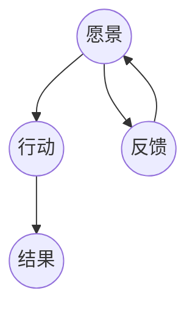

                 

### 愿景与行动的辩证关系

在信息技术领域，愿景与行动的关系就如同战略与执行之间的联系，二者相辅相成，共同推动着项目的发展和成功。愿景是项目的起点，它为团队提供了方向和目标，而行动则是实现愿景的具体手段和步骤。

#### 1.1 问题背景

在现代企业中，愿景往往被视为企业发展的关键因素。一个清晰的愿景可以帮助企业明确未来的发展方向，激发员工的积极性和创造力。然而，愿景如果没有相应的行动支撑，仅仅停留在纸上谈兵，是无法转化为现实成果的。因此，如何将愿景转化为实际行动，成为许多企业面临的现实问题。

#### 1.2 问题解决

要实现愿景，首先需要理解愿景与行动之间的联系与区别。愿景是一个高层次的目标，它指导着行动的方向；而行动则是实现愿景的具体步骤和策略。在信息技术的项目中，路径规划是实现愿景的重要手段，它可以帮助团队系统地制定和执行行动计划，从而确保愿景得以实现。

#### 1.3 核心概念

**愿景**：愿景是对未来的一种期望和规划，它是项目启动的初衷和目标。在信息技术项目中，愿景通常涉及产品的功能、性能、用户体验等方面。

**行动**：行动是实现愿景的具体步骤和策略，它包括制定计划、执行任务、监控进度和调整策略等。

#### 1.4 愿景与行动的联系与区别

愿景与行动之间存在着紧密的联系。愿景为行动提供了目标和方向，而行动则是实现愿景的具体途径。没有愿景，行动将失去方向；而没有行动，愿景将无法实现。

然而，愿景与行动也存在明显的区别。愿景通常是抽象和长远的，它为项目提供了战略层面的指导；而行动则是具体的和短期的，它关注于实现愿景的具体步骤和策略。

#### 1.5 愿景与行动的关系模型

为了更好地理解愿景与行动之间的关系，可以将其视为一种“因果”关系。愿景是因，行动是果。只有通过行动，愿景才能得以实现。

### 1.6 愿景与行动的辩证关系图

以下是一个简化的愿景与行动的辩证关系图，它用来说明二者之间的互动关系：

在这个模型中，愿景引导行动，行动产生结果，而结果又反馈到愿景中，为下一次愿景的制定提供依据。这种循环关系确保了项目能够不断进步和优化。

#### 1.7 结论

通过上述分析，我们可以得出结论：愿景与行动是信息技术项目中不可或缺的两个方面。只有将愿景转化为具体的行动，并不断调整和优化行动策略，项目才能最终实现预定的目标。在接下来的章节中，我们将深入探讨如何具体规划实现愿景的行动路径。

## 第一部分：愿景与行动的辩证关系

### 愿景与行动的辩证关系

在信息技术项目中，愿景与行动的关系至关重要。愿景是项目的出发点和方向，而行动是实现愿景的具体步骤和策略。二者相辅相成，共同推动着项目的发展和成功。

#### 1.1 问题背景

在现代企业中，愿景往往被视为企业发展的关键因素。一个清晰的愿景可以帮助企业明确未来的发展方向，激发员工的积极性和创造力。然而，愿景如果没有相应的行动支撑，仅仅停留在纸上谈兵，是无法转化为现实成果的。因此，如何将愿景转化为实际行动，成为许多企业面临的现实问题。

#### 1.2 问题解决

要实现愿景，首先需要理解愿景与行动之间的联系与区别。愿景是一个高层次的目标，它指导着行动的方向；而行动则是实现愿景的具体手段和步骤。在信息技术的项目中，路径规划是实现愿景的重要手段，它可以帮助团队系统地制定和执行行动计划，从而确保愿景得以实现。

#### 1.3 核心概念

**愿景**：愿景是对未来的一种期望和规划，它是项目启动的初衷和目标。在信息技术项目中，愿景通常涉及产品的功能、性能、用户体验等方面。

**行动**：行动是实现愿景的具体步骤和策略，它包括制定计划、执行任务、监控进度和调整策略等。

#### 1.4 愿景与行动的联系与区别

愿景与行动之间存在着紧密的联系。愿景为行动提供了目标和方向，而行动则是实现愿景的具体途径。没有愿景，行动将失去方向；而没有行动，愿景将无法实现。

然而，愿景与行动也存在明显的区别。愿景通常是抽象和长远的，它为项目提供了战略层面的指导；而行动则是具体的和短期的，它关注于实现愿景的具体步骤和策略。

#### 1.5 愿景与行动的关系模型

为了更好地理解愿景与行动之间的关系，可以将其视为一种“因果”关系。愿景是因，行动是果。只有通过行动，愿景才能得以实现。

#### 1.6 愿景与行动的辩证关系图

以下是一个简化的愿景与行动的辩证关系图，它用来说明二者之间的互动关系：

在这个模型中，愿景引导行动，行动产生结果，而结果又反馈到愿景中，为下一次愿景的制定提供依据。这种循环关系确保了项目能够不断进步和优化。

#### 1.7 结论

通过上述分析，我们可以得出结论：愿景与行动是信息技术项目中不可或缺的两个方面。只有将愿景转化为具体的行动，并不断调整和优化行动策略，项目才能最终实现预定的目标。在接下来的章节中，我们将深入探讨如何具体规划实现愿景的行动路径。

### 第二部分：梦想的具体路径规划

#### 2.1 路径规划的概念与原则

路径规划是实现梦想的重要手段，它将抽象的愿景转化为具体的行动步骤，帮助团队有目标、有计划地推进项目。在这一章节中，我们将详细探讨路径规划的概念、原则及其具体方法。

##### 2.1.1 路径规划的定义

路径规划是指在特定目标和资源限制下，制定出一系列步骤和策略，以确保最终目标的实现。它是一个系统化、结构化的过程，旨在明确项目的发展方向和步骤，提高项目执行的效率和成功率。

##### 2.1.2 路径规划的目的

路径规划的主要目的是：

1. **明确目标**：通过制定具体的路径，使团队对目标有清晰的认识，从而集中资源和精力。
2. **优化资源**：合理分配资源，确保在关键环节得到充分的资源支持。
3. **提高效率**：通过科学的路径规划，减少不必要的步骤和资源浪费，提高项目执行的效率。
4. **应对变化**：在项目执行过程中，路径规划可以帮助团队迅速应对变化，确保项目目标的实现。

##### 2.1.3 路径规划的原则

为了确保路径规划的合理性和有效性，应遵循以下原则：

1. **明确性**：路径规划应明确目标、步骤和预期结果，使团队成员对任务有清晰的认识。
2. **适应性**：路径规划应具有灵活性，能够根据实际情况进行调整，以适应环境和需求的变化。
3. **科学性**：路径规划应基于数据和科学的方法，避免主观臆断，提高决策的科学性。
4. **协作性**：路径规划应充分考虑团队成员的能力和协作，确保项目能够在团队协作中顺利进行。
5. **可行性**：路径规划应在现有资源和条件下具有可行性，避免不切实际的规划。

#### 2.2 路径规划的方法

路径规划的方法多种多样，以下介绍两种常用的方法：SWOT分析和SMART目标。

##### 2.2.1 SWOT分析

SWOT分析是一种用于评估项目内外部环境的工具，它包括以下四个方面：

1. **优势（Strengths）**：项目团队在资源和能力方面的优势。
2. **劣势（Weaknesses）**：项目团队在资源和能力方面的不足。
3. **机会（Opportunities）**：外部环境中可能对项目有利的因素。
4. **威胁（Threats）**：外部环境中可能对项目构成威胁的因素。

通过SWOT分析，团队可以全面了解项目所处的环境，并制定出相应的策略来利用优势、克服劣势、抓住机会和应对威胁。

##### 2.2.2 SMART目标

SMART目标是制定目标的一种有效方法，它要求目标具备以下五个特征：

1. **具体（Specific）**：目标应明确、具体，避免模糊和抽象。
2. **可衡量（Measurable）**：目标应能够量化，以便于评估进度和成果。
3. **可实现（Achievable）**：目标应在现有资源和条件下可行。
4. **相关性（Relevant）**：目标应与愿景和项目目标相关。
5. **时限性（Time-bound）**：目标应设定明确的截止日期。

通过SMART目标，团队可以确保目标的明确性和可操作性，从而提高目标达成的概率。

#### 2.3 路径规划的实践步骤

路径规划的实践步骤包括以下几个关键环节：

##### 2.3.1 确定愿景

愿景是项目的核心驱动力，它应具有以下特点：

1. **具体、明确、有意义**：愿景应具体描述项目的目标和意义，避免模糊和空洞。
2. **具有挑战性**：愿景应具有一定的挑战性，以激发团队的积极性和创造力。

##### 2.3.2 制定目标

在确定愿景后，需要制定具体的SMART目标，以确保愿景的实现。目标制定应遵循以下原则：

1. **基于愿景**：目标应与愿景紧密相关，以确保目标的实现能够推动愿景的实现。
2. **分解为可操作的小目标**：将大目标分解为一系列可操作的小目标，以便于管理和实施。

##### 2.3.3 规划路径

路径规划是制定实现目标的策略和步骤。在这一阶段，团队需要：

1. **评估不同路径的优缺点**：考虑各种可能的路径，评估其优势和风险。
2. **选择最佳路径**：根据评估结果，选择最佳路径并详细规划每一步的具体行动。

##### 2.3.4 实施行动

实施行动是路径规划的核心环节。在这一阶段，团队需要：

1. **制定行动计划**：根据路径规划，制定具体的行动计划和时间表。
2. **按计划执行**：按计划执行行动，确保每一步都能按时完成。
3. **及时调整**：在执行过程中，根据实际情况及时调整计划和策略，确保目标的实现。

##### 2.3.5 评估与反馈

评估与反馈是路径规划的重要环节。在这一阶段，团队需要：

1. **检查目标实现情况**：评估目标的实现情况，确定是否达到预期效果。
2. **反馈调整**：根据评估结果，对路径规划进行反馈调整，确保项目的顺利进行。

#### 2.4 结论

通过以上步骤，团队可以系统地制定和执行路径规划，从而实现项目的愿景。路径规划不仅为团队提供了明确的方向和目标，还提高了项目的效率和成功率。在接下来的章节中，我们将继续探讨如何使用具体的工具和技术来实现路径规划。

### 第三部分：实现路径规划的工具与技术

在实现路径规划的过程中，选择合适的工具和技术至关重要。这些工具和技术不仅能够帮助我们更清晰地表达规划内容，还能提高工作效率，确保路径规划的顺利实施。以下将介绍几种常用的工具和技术，包括思维导图、项目管理工具、数据可视化和流程图等。

#### 3.1 思维导图

思维导图是一种图形化的工具，用于展示和整理复杂的信息和想法。它通过节点、连线、颜色和图标等元素，将相关概念和步骤以图形化的形式呈现出来，使得信息更加直观和易于理解。

**优点：**

1. **可视化**：通过图形化的方式展示信息，有助于理解和记忆。
2. **结构化**：思维导图有助于梳理复杂的信息，建立结构化的思维模式。
3. **协作性**：团队可以共同编辑和修改思维导图，提高协作效率。

**应用场景：**

1. **项目规划**：用于梳理项目目标和路径，明确各个步骤之间的关系。
2. **团队协作**：用于头脑风暴和讨论，帮助团队成员共同理解和达成共识。

#### 3.2 项目管理工具

项目管理工具如Trello、Asana、Jira等，是用于管理和跟踪项目进度的工具。这些工具可以帮助团队创建任务、分配责任、跟踪进度和协作沟通，确保项目按计划顺利进行。

**优点：**

1. **任务管理**：清晰的任务分配和进度跟踪，确保每个任务都能按时完成。
2. **协作沟通**：团队成员可以实时沟通和协作，提高工作效率。
3. **自动化**：一些项目管理工具具有自动化功能，如提醒、报告生成等，减少手动操作。

**应用场景：**

1. **项目管理**：用于规划和跟踪整个项目的进度和任务。
2. **团队协作**：用于团队内部的任务分配和进度同步。

#### 3.3 数据可视化

数据可视化是一种通过图形、图表和地图等形式，将数据信息直观地呈现出来的技术。它可以帮助团队更好地理解和分析数据，从而做出更科学的决策。

**优点：**

1. **直观性**：通过图形化形式，使数据更加直观易懂。
2. **分析性**：能够快速识别数据中的趋势和异常，帮助团队做出决策。
3. **交互性**：用户可以通过交互方式查看数据的详细信息，提高数据利用率。

**应用场景：**

1. **数据分析**：用于展示项目的关键绩效指标（KPI）和进展情况。
2. **报告制作**：用于生成项目进展报告和决策依据。

#### 3.4 流程图

流程图是一种用于描述流程步骤和逻辑关系的图形化工具。它可以帮助团队清晰地展示项目的流程，确保每个步骤都按计划进行。

**优点：**

1. **清晰性**：流程图以图形化的方式展示流程，使流程更加直观易懂。
2. **结构化**：流程图有助于梳理流程，明确各个步骤之间的关系。
3. **适应性**：流程图可以根据项目变化进行修改和调整，保持流程的灵活性。

**应用场景：**

1. **流程设计**：用于设计项目的业务流程和操作步骤。
2. **流程优化**：用于优化现有流程，提高工作效率。

#### 3.5 结论

实现路径规划的工具和技术多种多样，选择合适的工具可以显著提高路径规划的效率和效果。思维导图、项目管理工具、数据可视化和流程图等工具，不仅能够帮助团队更好地理解和执行路径规划，还能提高协作和沟通效率，确保项目的顺利进行。在接下来的章节中，我们将通过案例分析，进一步探讨如何具体应用这些工具和技术来实现路径规划。

### 第四部分：案例分析

在本章节中，我们将通过一个具体的案例分析，展示如何从愿景到行动，实现项目目标的路径规划。该案例涉及一家初创公司开发一款智能家居系统的全过程。

#### 4.1 案例介绍

该初创公司的愿景是打造一款智能家居系统，为用户提供便捷、智能、安全的生活体验。公司成立于2022年，团队成员包括产品经理、软件工程师、硬件工程师和市场营销专家。由于市场需求的快速变化和资源有限，公司需要通过有效的路径规划来确保项目成功。

#### 4.2 愿景定义

在项目的初期，公司明确了以下愿景：

1. **产品功能**：智能家居系统应包括智能照明、智能安防、智能家电控制等功能。
2. **用户体验**：提供简单易用的界面，使普通用户能够轻松操作。
3. **安全性**：确保数据安全和设备安全，避免潜在的安全隐患。
4. **可扩展性**：系统应具有较好的扩展性，能够支持未来新增的功能和设备。

#### 4.3 目标制定

基于上述愿景，公司制定了以下SMART目标：

1. **具体**：在六个月内完成智能家居系统的核心功能开发，并进行初步测试。
2. **可衡量**：确保用户界面的操作流程不超过五步，设备响应时间不超过两秒。
3. **可实现**：在现有资源和团队规模下，合理分配任务和时间，确保目标实现。
4. **相关性**：目标与公司愿景紧密相关，能够推动公司愿景的实现。
5. **时限性**：设定明确的完成时间，确保项目进度可控。

#### 4.4 路径规划

公司通过SWOT分析，确定了以下路径规划：

1. **优势**：团队在嵌入式系统和无线通信领域有丰富的经验，有助于智能家居系统的开发。
2. **劣势**：公司资源有限，需要合理分配人力和财力。
3. **机会**：智能家居市场正处于快速增长阶段，公司有机会在市场上占据一席之地。
4. **威胁**：市场竞争激烈，需要快速响应市场变化。

基于SWOT分析，公司制定了以下路径规划：

1. **第一阶段**：完成系统架构设计和核心功能实现，包括智能照明和安防功能。
    - **路径**：与硬件厂商合作，获取合适的传感器和通信模块。
    - **具体行动**：开发智能照明控制模块和安防报警系统，进行初步测试。

2. **第二阶段**：完善用户界面和添加智能家电控制功能。
    - **路径**：优化用户界面，使其更加简洁直观。
    - **具体行动**：开发智能家电控制模块，与现有的智能家居设备进行兼容性测试。

3. **第三阶段**：进行系统集成和全面测试，确保系统的稳定性和安全性。
    - **路径**：搭建测试环境，模拟用户使用场景进行测试。
    - **具体行动**：进行系统功能测试和安全性测试，修复发现的问题。

4. **第四阶段**：进行市场推广和用户反馈收集，不断优化产品。
    - **路径**：制定市场推广计划，利用社交媒体和线下活动进行推广。
    - **具体行动**：收集用户反馈，针对用户需求进行产品优化。

#### 4.5 行动实施

根据路径规划，公司制定了详细的行动计划和时间表，确保每个阶段的目标都能按时完成。具体行动包括：

1. **第一阶段**：
    - **时间表**：前两个月完成智能照明和安防功能开发，后两个月进行初步测试。
    - **行动**：与硬件厂商合作，获取传感器和通信模块；开发智能照明控制模块和安防报警系统；进行系统测试。

2. **第二阶段**：
    - **时间表**：第三个月到第五个月，完成用户界面优化和智能家电控制模块开发。
    - **行动**：优化用户界面，使其更加简洁直观；开发智能家电控制模块，进行兼容性测试。

3. **第三阶段**：
    - **时间表**：第六个月到第八个月，进行系统集成和全面测试。
    - **行动**：搭建测试环境，进行系统功能测试和安全性测试；修复发现的问题。

4. **第四阶段**：
    - **时间表**：第九个月到第十二个月，进行市场推广和用户反馈收集。
    - **行动**：制定市场推广计划，利用社交媒体和线下活动进行推广；收集用户反馈，进行产品优化。

#### 4.6 评估与反馈

在每个阶段结束后，公司对目标的实现情况进行评估，并根据评估结果进行反馈调整。具体评估内容包括：

1. **功能实现情况**：是否完成了预定的功能开发。
2. **用户体验**：用户界面的操作流程和设备响应时间是否符合预期。
3. **安全性**：系统是否具备良好的安全性。
4. **市场反馈**：用户对产品的满意度和市场推广效果。

根据评估结果，公司对路径规划进行了以下反馈调整：

1. **第一阶段**：发现部分功能存在性能瓶颈，调整开发计划，增加性能优化时间。
2. **第二阶段**：用户反馈界面复杂，调整界面设计，简化操作流程。
3. **第三阶段**：发现安全隐患，增加安全测试环节，加强系统安全性。
4. **第四阶段**：市场推广效果不理想，调整推广策略，增加线上线下互动活动。

#### 4.7 结论

通过具体的案例分析，我们可以看到，从愿景到行动，实现项目目标的关键在于明确的路径规划和有效的行动实施。通过SWOT分析和SMART目标的制定，公司能够系统地规划项目的发展方向和步骤，确保每个阶段的目标都能按时完成。同时，评估与反馈机制有助于及时发现和解决问题，确保项目的顺利进行。这一案例为其他初创公司提供了宝贵的经验和借鉴。

### 第五部分：拓展阅读

在实现愿景和行动路径规划的过程中，深入理解和应用相关理论与方法是非常重要的。以下将介绍一些拓展阅读的建议，帮助读者进一步探索愿景管理与行动学的相关理论和实践技巧。

#### 5.1 相关理论与方法

**愿景管理**：愿景管理是一种通过战略规划和持续优化，确保企业或团队愿景实现的过程。相关书籍如《愿景的力量》（The Power of Vision）和《愿景战略》（Visionary Leadership），详细介绍了愿景管理的方法和实践。

**行动学**：行动学是研究个体和团队如何实现目标的学科。经典书籍如《行动学：从想法到成果的步骤指南》（Action Science: Concepts, Methods, and Skills for Research and Practice），提供了关于行动学的基本概念和方法论。

**精益创业**：精益创业是一种基于最小可行产品（MVP）的方法论，强调快速迭代和用户反馈。书籍如《精益创业》（The Lean Startup）和《精益创业实战》（Running Lean），为创业者和项目管理者提供了宝贵的经验和技巧。

#### 5.2 实践技巧与经验

**团队协作技巧**：成功的路径规划离不开高效的团队协作。书籍如《团队协作工具与技巧》（Team Collaboration Tools and Techniques）和《敏捷团队协作实践》（Agile Team Collaboration），提供了团队协作的最佳实践和工具。

**项目管理方法**：项目管理方法是实现路径规划的重要工具。书籍如《项目管理实践指南》（Project Management: A Managerial Approach）和《敏捷项目管理》（Agile Project Management），详细介绍了项目管理的方法和工具。

**时间管理技巧**：时间管理是确保路径规划顺利实施的基石。书籍如《时间管理技巧：高效工作指南》（Time Management Techniques: A Practical Guide to Personal Productivity）和《深度工作：如何有效利用每一点脑力》（Deep Work: Rules for Focused Success in a Distracted World），提供了有效的时间管理方法和策略。

#### 5.3 结论

通过拓展阅读，读者可以深入了解愿景管理和行动学的相关理论和实践技巧，从而更好地应用这些知识和方法，实现项目的成功。同时，这些书籍和资源也为读者提供了丰富的经验和启示，有助于在实现愿景和行动路径规划的过程中，不断学习和进步。

### 总结

通过本篇文章，我们深入探讨了从愿景到行动的具体路径规划方法。首先，我们明确了愿景与行动的辩证关系，阐述了愿景与行动之间的联系与区别。接着，我们介绍了路径规划的概念与原则，以及使用SWOT分析和SMART目标等方法进行路径规划的具体步骤。然后，我们通过案例分析，展示了如何在实际项目中应用这些方法。此外，我们还介绍了实现路径规划所需的工具和技术，如思维导图、项目管理工具和数据可视化等。最后，我们提供了拓展阅读的建议，帮助读者进一步探索愿景管理和行动学的相关理论和实践技巧。

在实现愿景和行动路径规划的过程中，关键在于明确目标、制定合理的策略和计划，以及不断调整和优化行动。通过本文的介绍，希望读者能够掌握这些方法和技巧，在实际工作中更好地实现自己的愿景。

感谢读者对本篇文章的阅读，希望这篇文章能够为您的项目规划提供有益的启示和帮助。如果您有任何疑问或建议，欢迎在评论区留言，我们将会继续努力，为您提供更高质量的技术内容。

### 作者信息

**作者：AI天才研究院/AI Genius Institute & 禅与计算机程序设计艺术 /Zen And The Art of Computer Programming**

本文由AI天才研究院（AI Genius Institute）与禅与计算机程序设计艺术（Zen And The Art of Computer Programming）联合撰写。AI天才研究院致力于推动人工智能技术的发展与应用，为全球企业和个人提供顶尖的人工智能解决方案。禅与计算机程序设计艺术则专注于探讨计算机编程的哲学和艺术，倡导用禅宗的智慧来提升编程技能和思维方式。

两院联合撰写本文，旨在通过深入的技术分析和实践指导，帮助读者理解并掌握从愿景到行动的具体路径规划方法，从而在信息技术项目中实现更高的效率和成功率。

感谢您的阅读，期待与您在未来的技术探讨中再次相遇。如果您对我们的研究或作品感兴趣，欢迎访问我们的官方网站，了解更多相关信息。祝您在技术和职业道路上不断进步，实现更多的梦想。再次感谢您的支持与关注！

