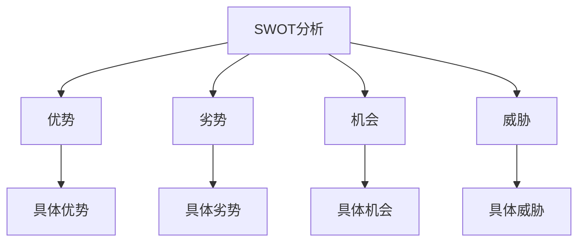
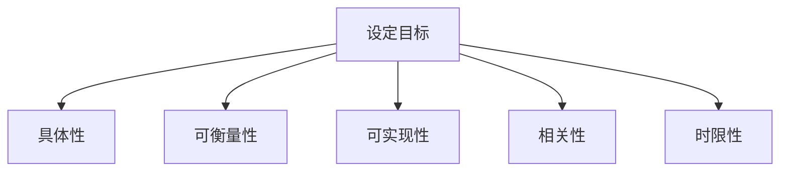
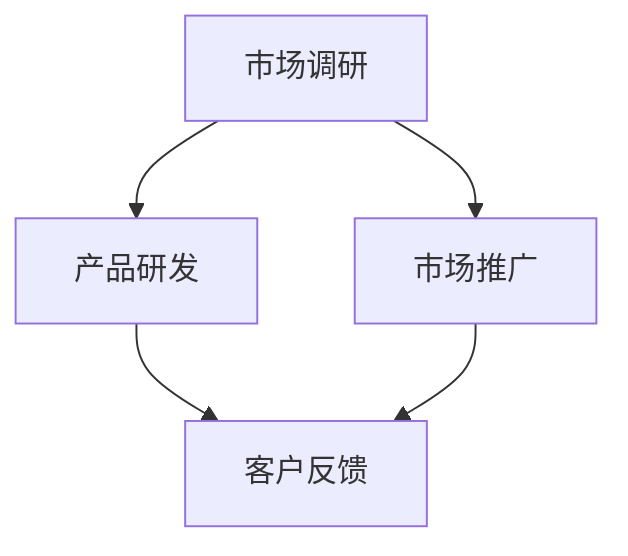

                 

### 《从愿景到行动：实现梦想的路径规划》

> 关键词：愿景、行动、路径规划、梦想实现、策略方法、最佳实践

> 摘要：本文旨在探讨如何从愿景到行动，实现个人和组织的梦想。文章将详细分析愿景、行动和路径规划的概念及其相互关系，提供具体的实现方法和实践案例，帮助读者理解并应用这些原则，最终实现自己的梦想。

## 第一部分：引言与背景

### 1. 引言

在当今快速变化的社会环境中，实现个人和组织的梦想变得更加复杂和具有挑战性。梦想不仅仅是心中的一幅蓝图，更是需要通过实际行动去实现的愿景。那么，如何从愿景到行动，规划出一条清晰、可行的路径，是实现梦想的关键。本文将围绕这一核心问题展开探讨。

### 1.1 问题背景

当前社会环境下的挑战主要包括技术变革的加速、市场竞争的加剧、资源分配的不均衡等。在这样的背景下，个人和组织都面临着如何明确愿景、制定行动计划、以及如何进行路径规划的问题。

愿景与行动的关系是密不可分的。愿景是方向的指南，而行动是实现愿景的手段。没有清晰的愿景，行动会缺乏方向和目标；没有有效的行动，愿景将只是空中楼阁。因此，如何将愿景转化为具体的行动，是每个个人和组织都必须面对的问题。

### 1.2 问题描述

- **如何界定梦想**：梦想的定义因人而异，需要明确梦想的具体内容和可实现性。
- **梦想实现的难度**：实现梦想往往需要面对诸多挑战，如资源限制、时间压力、技术难题等。

### 1.3 问题解决

实现梦想的路径规划是解决这一问题的关键。本文将提供一套系统的方法，帮助读者明确愿景、制定行动计划，并规划出一条可行的路径，从而实现自己的梦想。

### 1.4 边界与外延

- **梦想的范围**：梦想可以是个人职业发展、创业、学术研究等多方面的目标。
- **行动的定义**：行动是具体的目标、计划以及执行的过程。

### 1.5 概念结构与核心要素组成

- **愿景**：指长期目标和方向，具有情感驱动和明确性。
- **行动**：包括具体计划、执行过程和持续调整。
- **路径规划**：涉及目标设定、策略选择和资源分配。

### 1.6 本章小结

本文首先介绍了愿景、行动和路径规划的定义及其相互关系，明确了实现梦想的关键步骤。接下来，将深入探讨核心概念，提供具体的实现方法，并通过实践案例帮助读者理解并应用这些原则。

## 第二部分：核心概念与联系

### 2.1 愿景的定义与特征

#### 2.1.1 愿景的定义

愿景（Vision）是个人或组织所期望达到的长期目标和方向。它不仅是对未来的展望，更是内心的驱动力，能够激发行动和努力。

- **长期目标**：愿景指向的是长期而非短期的目标，它代表了一个组织或个人在多年后希望实现的状态。
- **情感驱动**：愿景往往与情感紧密相连，能够激发人们的热情和动力。
- **明确方向**：愿景应该是明确和具体的，能够为行动提供清晰的指导。

数学上，我们可以将愿景表示为：

$$
\text{愿景} = \text{长期目标} + \text{情感驱动} + \text{明确方向}
$$

#### 2.1.2 愿望与愿景的对比

- **愿望**（Desire）通常是个人的简单愿望或渴望，没有明确的目标和计划，而愿景则是更加具体和明确的。
- **愿景**（Vision）不仅仅是愿望，它还包含了实现愿望的路径和策略。

#### 2.1.3 愿景的重要性

愿景对于个人和组织的重要性不言而喻：

- **方向指引**：愿景为行动提供了明确的方向和目标。
- **动力源泉**：愿景能够激发人们内心的热情和动力，推动他们不断前行。
- **资源整合**：明确的愿景有助于整合资源，提高组织效率。

### 2.2 行动的定义与特征

#### 2.2.1 行动的定义

行动（Action）是实现愿景的具体措施，包括计划、执行和调整的过程。

- **具体计划**：行动需要有明确的计划和步骤，以确保目标的实现。
- **执行过程**：计划制定后，需要通过实际行动来逐步推进。
- **持续调整**：在执行过程中，需要根据实际情况进行持续的调整和优化。

数学上，我们可以将行动表示为：

$$
\text{行动} = \text{具体计划} + \text{执行过程} + \text{持续调整}
$$

#### 2.2.2 行动与目标的关系

- **目标导向**：行动是为了实现特定的目标，目标为行动提供了方向和动力。
- **动态调整**：行动过程中，目标可能需要根据实际情况进行调整，以确保最终实现愿景。

#### 2.2.3 行动的有效性

行动的有效性取决于以下几个方面：

- **计划性**：行动需要有详细的计划和步骤，确保目标能够逐步实现。
- **执行力**：行动需要具备执行力，确保计划能够顺利实施。
- **反馈机制**：行动过程中需要建立反馈机制，以便及时调整和优化。

### 2.3 路径规划的基本原理

#### 2.3.1 路径规划的定义

路径规划（Path Planning）是指为实现特定目标，制定出一条清晰、可行的路径。它涉及目标设定、策略选择和资源分配等多个方面。

数学上，我们可以将路径规划表示为：

$$
\text{路径规划} = \text{目标设定} + \text{策略选择} + \text{资源分配}
$$

#### 2.3.2 路径规划的步骤

路径规划的步骤主要包括：

1. **目标设定**：明确要实现的目标，包括长期和短期目标。
2. **策略选择**：根据目标，选择合适的策略和措施。
3. **资源分配**：合理分配资源，确保策略的有效实施。

#### 2.3.3 路径规划的方法

路径规划的方法包括：

- **SWOT分析**：对优势、劣势、机会和威胁进行分析，为策略选择提供依据。
- **SMART原则**：确保目标具有具体性、可衡量性、可实现性、相关性和时限性。
- **Gantt图**：通过Gantt图，对项目进度进行可视化管理和监控。

### 2.4 概念属性特征对比表格

#### 愿景 vs 行动 vs 路径规划

| 概念 | 特征 |
| :--: | :--: |
| **愿景** | - 长期目标<br>- 情感驱动<br>- 明确方向 |
| **行动** | - 具体计划<br>- 执行过程<br>- 持续调整 |
| **路径规划** | - 目标设定<br>- 策略选择<br>- 资源分配 |

### 2.5 ER实体关系图架构

#### 愿景实体关系图

```mermaid
erDiagram
  A愿景 <<--|{与} B行动
  A愿景 ||--|{由} C路径规划
  B行动 ||--|{由} C路径规划
```

### 2.6 本章小结

本章详细介绍了愿景、行动和路径规划的定义、特征及其相互关系。通过理解这些核心概念，读者可以更好地规划自己的梦想，并制定出清晰、可行的行动计划。

## 第三部分：路径规划的具体方法

### 3.1 明确愿景

#### 3.1.1 愿景的设定原则

设定愿景需要遵循以下原则：

1. **具体性**：愿景应该具体明确，避免模糊和抽象。
2. **可实现性**：愿景需要具有可实现性，避免过于理想化。
3. **情感驱动**：愿景应该与情感紧密相连，激发内心的热情。
4. **长期性**：愿景指向的是长期目标，而非短期利益。

数学上，我们可以将愿景的设定原则表示为：

$$
\text{具体性} + \text{可实现性} + \text{情感驱动} + \text{长期性}
$$

#### 3.1.2 如何寻找愿景

寻找愿景可以通过以下步骤进行：

1. **自我反思**：思考自己的兴趣、价值观和长期目标。
2. **环境分析**：分析社会环境、行业趋势和个人优势。
3. **灵感来源**：从书籍、讲座、交流和实践中获取灵感。

#### 3.1.3 愿景的评估与调整

1. **评估指标**：设定具体的评估指标，如目标完成率、资源利用率等。
2. **定期评估**：定期对愿景进行评估，以确保其与实际情况相符。
3. **调整策略**：根据评估结果，对愿景进行调整和优化，确保其可行性和有效性。

### 3.2 制定行动计划

#### 3.2.1 行动计划的重要性

行动计划是实现愿景的具体措施，其重要性体现在以下几个方面：

1. **明确方向**：行动计划为行动提供了明确的方向和目标。
2. **确保执行力**：行动计划有助于确保行动的有序进行和执行力。
3. **资源整合**：行动计划有助于合理分配资源，提高效率。

#### 3.2.2 行动计划的制定步骤

制定行动计划可以遵循以下步骤：

1. **明确目标**：根据愿景，设定具体的、可衡量的目标。
2. **分解目标**：将大目标分解为小目标，确保每个小目标都具有可操作性。
3. **制定策略**：根据目标，制定具体的策略和措施。
4. **时间规划**：为每个目标和策略分配时间，确保行动的有序进行。

#### 3.2.3 行动计划的执行与监控

1. **执行策略**：按照行动计划，逐步执行每个目标和策略。
2. **反馈机制**：建立反馈机制，及时了解行动的进展和效果。
3. **监控与调整**：定期监控行动计划的执行情况，根据反馈进行调整和优化。

### 3.3 路径规划的工具与技术

#### 3.3.1 SWOT分析

SWOT分析是一种常用的路径规划工具，用于分析组织的优势、劣势、机会和威胁。

1. **优势（Strengths）**：组织内部的优势，如技术实力、人才储备等。
2. **劣势（Weaknesses）**：组织内部的劣势，如资源不足、管理不善等。
3. **机会（Opportunities）**：外部环境中的机会，如市场趋势、政策支持等。
4. **威胁（Threats）**：外部环境中的威胁，如竞争对手、市场变化等。

通过SWOT分析，可以明确组织的现状和未来的发展方向，为路径规划提供依据。

#### 3.3.2 SMART原则

SMART原则是一种确保目标具体、可衡量、可实现、相关和时限性的方法。

1. **具体性（Specific）**：目标应具体明确，避免模糊。
2. **可衡量性（Measurable）**：目标应具有可衡量性，便于评估和监控。
3. **可实现性（Achievable）**：目标应具有可实现性，避免过于理想化。
4. **相关性（Relevant）**：目标应与愿景和战略相关联。
5. **时限性（Time-bound）**：目标应有明确的时间限制。

#### 3.3.3 Gantt图

Gantt图是一种可视化工具，用于展示项目进度和时间安排。

- **项目阶段**：将项目分为不同的阶段，明确每个阶段的开始和结束时间。
- **任务分配**：为每个阶段分配具体的任务，并指派责任人。
- **进度跟踪**：通过Gantt图，实时跟踪项目的进展情况，确保按计划进行。

### 3.4 实践案例

#### 3.4.1 案例一：个人职业发展

**愿景**：成为某领域的专家。

**行动计划**：

1. **设定目标**：明确成为专家的具体领域和时间表。
2. **制定策略**：通过学习、实践和交流，不断提升自己的技能和知识。
3. **执行与监控**：按计划进行学习，定期评估进度，并根据反馈进行调整。

**路径规划**：

1. **SWOT分析**：分析自己的优势、劣势、机会和威胁，为职业发展提供依据。
2. **SMART原则**：确保每个目标和策略都符合SMART原则。
3. **Gantt图**：通过Gantt图，规划学习进度和时间表。

#### 3.4.2 案例二：创业公司路径规划

**愿景**：打造一家行业领先的公司。

**行动计划**：

1. **市场调研**：了解市场需求和竞争对手。
2. **产品研发**：开发具有竞争力的产品。
3. **市场推广**：制定有效的市场推广策略。

**路径规划**：

1. **SWOT分析**：分析公司的优势、劣势、机会和威胁。
2. **SMART原则**：确保每个目标和策略都符合SMART原则。
3. **Gantt图**：通过Gantt图，规划产品研发和市场推广的时间表。

### 3.5 路径规划中的挑战与应对

#### 3.5.1 挑战一：目标不明确

**应对策略**：

1. **明确目标**：重新审视愿景，确保目标具体、可衡量、可实现。
2. **分解目标**：将大目标分解为小目标，确保每个小目标都具有可操作性。

#### 3.5.2 挑战二：执行力不足

**应对策略**：

1. **加强执行力**：制定详细的行动计划，确保每个任务都有明确的责任人和完成时间。
2. **建立反馈机制**：定期评估执行情况，及时调整和优化。

#### 3.5.3 挑战三：环境变化

**应对策略**：

1. **灵活调整**：根据环境变化，及时调整目标和策略。
2. **持续学习**：不断提升自己的适应能力和应变能力。

### 3.6 本章小结

本章详细介绍了明确愿景、制定行动计划和路径规划的具体方法，并通过实践案例展示了这些方法的应用。通过理解并应用这些方法，读者可以更好地规划自己的梦想，并实现长期目标。

## 第四部分：实现梦想的最佳实践

### 4.1 制定具体的行动计划

#### 4.1.1 行动计划的具体内容

制定具体的行动计划需要包含以下几个关键要素：

1. **目标明确**：确保每个目标都具体、可衡量、可实现、相关且有时间限制。
2. **任务分解**：将大目标分解为小任务，确保每个任务都有明确的责任人和完成时间。
3. **资源分配**：为每个任务分配所需的资源，包括人力、物力和财力。
4. **时间规划**：为每个任务设定开始和结束时间，确保行动有序进行。

例如，假设一个目标是“在六个月内完成一篇技术论文”，具体的行动计划可以包括：

- **明确目标**：在六个月内完成一篇高质量的技术论文，并提交至某顶级学术会议。
- **任务分解**：收集文献、撰写草稿、修改稿件、投稿。
- **资源分配**：确定研究人员、资料和设备。
- **时间规划**：每月完成一个阶段的任务，如第一月收集文献，第二月撰写草稿，第三月修改稿件，第四月投稿。

#### 4.1.2 行动计划的执行策略

执行行动计划需要遵循以下策略：

1. **分阶段实施**：将大目标分为小阶段，确保每个阶段都有明确的任务和进度。
2. **任务优先级**：根据任务的紧急程度和重要性，设定任务优先级，确保关键任务先完成。
3. **责任到人**：明确每个任务的责任人，确保任务有人负责。
4. **定期检查**：定期检查任务进度，及时发现并解决问题。

例如，在执行上述行动计划时，可以采用以下策略：

- **分阶段实施**：每月检查一次进度，确保每个阶段的任务按时完成。
- **任务优先级**：首先完成文献收集，然后是撰写草稿，最后是修改稿件。
- **责任到人**：每个任务都明确责任人，如文献收集由小张负责，撰写草稿由小李负责。
- **定期检查**：每周进行一次任务进度检查，确保任务按计划进行。

#### 4.1.3 行动计划的反馈与调整

在执行行动计划的过程中，需要建立反馈机制，以便及时调整和优化计划：

1. **定期反馈**：定期收集任务进展和反馈信息，评估行动计划的执行效果。
2. **问题识别**：识别执行过程中的问题和瓶颈，分析原因。
3. **调整计划**：根据反馈和问题，及时调整行动计划，确保目标的实现。

例如，在上述行动计划执行过程中，如果发现文献收集进度较慢，可以采取以下调整措施：

- **定期反馈**：每月底收集任务进度反馈，评估文献收集的进展。
- **问题识别**：发现文献收集进度较慢，分析原因，如时间安排不合理、资料获取困难等。
- **调整计划**：重新安排时间，增加资料收集的时间，或寻求外部帮助。

### 4.2 建立有效的支持系统

#### 4.2.1 人际关系的重要性

建立有效的支持系统是实现梦想的关键因素之一。其中，人际关系的重要性不容忽视。人际关系不仅能够提供资源和支持，还能够提供心理上的安慰和鼓励。

1. **资源获取**：通过人际关系，可以获取到各种资源，如知识、信息、资金等。
2. **心理支持**：在实现梦想的过程中，人际关系可以提供心理上的支持和鼓励，帮助克服困难和挫折。

#### 4.2.2 资源整合的方法

为了建立有效的支持系统，需要掌握以下资源整合方法：

1. **网络拓展**：通过参加各类活动、社交聚会等，拓展人际关系网络。
2. **资源共享**：与他人分享资源和经验，建立互惠互利的合作关系。
3. **求助与帮助**：在需要时，主动寻求他人的帮助，并在他人需要时提供帮助。

例如，为了拓展人际关系网络，可以：

- **参加专业会议和活动**：结识同行和专家，获取行业动态和资源。
- **加入兴趣小组**：加入与自己兴趣相关的社区或小组，结交志同道合的朋友。
- **主动帮助他人**：在他人需要帮助时，主动伸出援手，建立信任和友谊。

#### 4.2.3 如何建立支持系统

建立支持系统可以遵循以下步骤：

1. **识别需求**：明确自己的需求和目标，确定需要哪些支持和资源。
2. **搭建网络**：通过拓展人际关系，搭建支持网络。
3. **维护关系**：定期维护和加强人际关系，确保网络的稳定和有效。
4. **利用资源**：充分利用支持网络提供的资源和帮助，实现目标。

例如，为了建立支持系统，可以：

- **识别需求**：明确自己需要知识、信息、资金等支持，确定目标。
- **搭建网络**：通过参加活动、加入小组等方式，结识各类人士，建立支持网络。
- **维护关系**：定期与朋友和同事交流，保持联系，分享经验和资源。
- **利用资源**：在需要时，主动寻求朋友和同事的帮助，充分利用他们的资源和经验。

### 4.3 持续学习与成长

#### 4.3.1 学习的重要性

持续学习是实现梦想的关键。在不断变化的环境中，知识和技能的更新速度非常快，只有不断学习，才能保持竞争力，实现自己的梦想。

1. **提升竞争力**：持续学习可以提升个人的专业技能和综合素质，增加竞争力。
2. **适应变化**：持续学习可以帮助个人适应环境变化，应对新的挑战。

#### 4.3.2 学习的方法

为了实现持续学习，可以采取以下方法：

1. **阅读书籍和文章**：阅读是获取知识的重要途径，通过阅读可以了解最新的研究成果和行业动态。
2. **参加培训和课程**：参加专业培训和课程，系统学习新知识和技能。
3. **实践和项目**：通过实际项目和实践活动，将理论知识应用于实践，提升解决问题的能力。
4. **交流和合作**：与他人交流和合作，分享知识和经验，共同学习成长。

例如，为了持续学习，可以：

- **阅读专业书籍和论文**：定期阅读专业书籍和论文，了解行业前沿。
- **参加培训课程**：参加与自己专业相关的培训课程，提升技能。
- **参与项目和活动**：加入项目和活动，实践所学知识，提升实际操作能力。
- **与同行交流**：参加行业会议、研讨会等，与同行交流，分享经验和见解。

#### 4.3.3 成长的关键因素

持续学习与成长的关键因素包括：

1. **目标明确**：明确自己的学习和成长目标，确保学习具有方向和动力。
2. **持续投入**：投入时间和精力，持续学习，不断提升自己。
3. **方法正确**：选择适合自己的学习方法，确保学习效果。
4. **反馈与调整**：定期进行自我反思和评估，根据反馈调整学习策略。

例如，为了实现持续学习和成长：

- **目标明确**：设定具体的成长目标，如提升某项技能、完成某个项目等。
- **持续投入**：每天投入一定时间学习，确保学习成为生活习惯。
- **方法正确**：根据自身情况选择适合自己的学习方法，如阅读、实践、交流等。
- **反馈与调整**：定期反思学习效果，根据反馈调整学习策略，确保学习目标的实现。

### 4.4 实现梦想的案例分析

#### 4.4.1 案例一：成功创业的故事

**案例简介**：

张三在大学期间，对人工智能领域产生了浓厚的兴趣。毕业后，他决定创业，打造一家专注于人工智能解决方案的公司。

**实现过程**：

1. **明确愿景**：张三的愿景是成为人工智能领域的领导者，为客户提供优质的解决方案。
2. **制定行动计划**：他制定了详细的行动计划，包括市场调研、产品研发、市场推广等。
3. **执行与调整**：按照行动计划，张三一步步推进，同时根据市场反馈进行调整。
4. **资源整合**：他积极拓展人际关系，获取资金和资源支持。

**成功因素**：

- **明确愿景**：张三的愿景明确，为行动提供了方向。
- **具体行动计划**：详细的行动计划确保了目标的实现。
- **持续学习和成长**：张三不断学习和提升自己的技能，保持了竞争力。
- **有效资源整合**：张三通过人际关系，获得了资金和资源支持。

#### 4.4.2 案例二：个人成就的故事

**案例简介**：

李四是一名程序员，他对编程和算法有着极高的热情。在工作之余，他坚持学习和实践，最终在算法竞赛中获得了优异成绩。

**实现过程**：

1. **明确愿景**：李四的愿景是成为算法领域的专家，在竞赛中取得优异成绩。
2. **制定行动计划**：他制定了详细的学习计划，包括阅读算法书籍、参加线上竞赛等。
3. **执行与调整**：他按照计划进行学习，同时根据竞赛结果进行调整。
4. **资源整合**：他通过参加培训课程和线上论坛，结交了志同道合的朋友，共同学习和进步。

**成功因素**：

- **明确愿景**：李四的愿景明确，激励他不断努力。
- **具体行动计划**：详细的学习计划确保了他的进步。
- **持续学习和成长**：李四不断学习和实践，提升了自己的技能。
- **有效资源整合**：李四通过参加培训课程和论坛，获得了宝贵的经验和资源。

### 4.5 小结与反思

通过以上案例分析，我们可以看到，实现梦想的关键在于：

1. **明确愿景**：明确的目标为行动提供了方向和动力。
2. **具体行动计划**：详细的计划确保了目标的实现。
3. **持续学习和成长**：不断提升自己的技能和知识，保持竞争力。
4. **有效资源整合**：充分利用人际关系和资源，实现目标。

在实现梦想的过程中，我们需要不断反思和调整，以适应环境的变化。同时，保持坚持和毅力，克服困难和挫折，最终实现自己的梦想。

### 4.6 本章小结

本章通过具体的行动计划、人际关系支持、持续学习与成长以及实践案例分析，提供了实现梦想的最佳实践。通过理解并应用这些实践，读者可以更好地规划自己的梦想，并实现长期目标。

## 第五部分：结语

### 5.1 总结

本文从愿景、行动和路径规划三个方面，详细探讨了如何从愿景到行动，实现个人和组织的梦想。通过明确愿景、制定行动计划、路径规划以及最佳实践，读者可以更好地理解并应用这些原则，从而实现自己的梦想。

### 5.1.1 书中内容的回顾

本文主要内容包括：

- **愿景的定义与特征**：明确了愿景的长期性、情感驱动和明确方向。
- **行动的定义与特征**：阐述了行动的具体计划、执行过程和持续调整。
- **路径规划的基本原理**：介绍了路径规划的目标设定、策略选择和资源分配。
- **具体方法**：提供了明确愿景、制定行动计划和路径规划的具体步骤。
- **实践案例**：通过个人职业发展和创业公司的案例，展示了路径规划的应用。
- **最佳实践**：总结了制定行动计划、建立支持系统和持续学习与成长的最佳实践。

### 5.1.2 愿景、行动与路径规划的关系

愿景、行动和路径规划是相辅相成的。愿景为行动提供了明确的方向和目标，行动是实现愿景的具体措施，而路径规划则是确保行动有序进行和目标实现的关键。三者之间的关系可以概括为：

- **愿景引领**：愿景明确了未来的方向，为行动提供了目标和动力。
- **行动实现**：行动是将愿景转化为现实的具体措施，是梦想实现的手段。
- **路径规划**：路径规划是对行动的规划和指导，确保行动有序进行和目标实现。

### 5.1.3 对未来的展望

在未来，随着科技的不断进步和社会环境的变化，实现梦想的路径规划将面临更多挑战和机遇。我们需要：

- **适应变化**：不断适应环境变化，调整愿景和行动策略。
- **创新思维**：运用创新思维，探索新的实现路径和方法。
- **持续学习**：不断提升自己的知识和技能，保持竞争力。
- **合作共赢**：与他人合作，共享资源和经验，共同实现梦想。

### 5.2 小结

本文通过详细分析愿景、行动和路径规划的概念及其相互关系，提供了实现梦想的具体方法和实践案例。通过理解并应用这些原则，读者可以更好地规划自己的梦想，并实现长期目标。

### 5.2.1 书的主要贡献

本文的主要贡献包括：

- **系统性地分析了愿景、行动和路径规划的概念及其相互关系**。
- **提供了具体的实现方法和实践案例**。
- **总结了实现梦想的最佳实践**。

### 5.2.2 对读者的建议

对于读者，本文的建议如下：

- **明确自己的愿景和目标**：明确自己的愿景和目标，为行动提供方向。
- **制定具体的行动计划**：制定具体的行动计划，确保目标的实现。
- **持续学习和成长**：不断学习新知识和技能，提升自己的竞争力。
- **与他人合作**：与他人合作，共同实现梦想。

### 5.2.3 进一步研究的方向

未来研究可以关注以下方向：

- **路径规划的算法和模型**：研究更有效的路径规划算法和模型，提高路径规划的准确性和效率。
- **跨领域路径规划**：探讨如何在不同领域之间进行有效的路径规划，实现跨领域创新。
- **大数据与路径规划**：结合大数据技术，分析路径规划中的数据规律和趋势。

### 5.3 注意事项

在实现梦想的过程中，需要注意以下几点：

- **目标设定要合理**：目标应具有可实现性，避免过于理想化。
- **执行过程中要灵活调整**：根据实际情况，及时调整计划和策略。
- **保持持续的学习和成长**：不断提升自己的知识和技能，保持竞争力。
- **有效利用资源**：充分利用人际关系和资源，实现目标。

### 5.4 拓展阅读

对于有兴趣进一步深入了解愿景、行动和路径规划的读者，以下书籍和资源推荐：

- **书籍**：
  - 《精益创业》
  - 《失控》
  - 《深度工作》
  - 《创新者的窘境》
- **网络资源**：
  - 知乎专栏
  - Coursera在线课程
  - Medium文章
  - TED演讲

### 5.4.1 相关书籍推荐

- 《精益创业》：埃里克·莱斯
- 《失控》：凯文·凯利
- 《深度工作》：卡尔·纽波特
- 《创新者的窘境》：克莱顿·克里斯坦森

### 5.4.2 网络资源推荐

- 知乎专栏：有关创业、技术、管理的深入讨论。
- Coursera在线课程：提供各种专业领域的在线课程。
- Medium文章：有关科技、商业和人文的深度分析。
- TED演讲：关于梦想、创新和成长的精彩演讲。

### 5.4.3 参考文献列表

-莱斯, 埃里克·莱斯.《精益创业》[M]. 人民邮电出版社, 2011.
-凯利, 凯文·凯利.《失控》[M]. 浙江人民出版社, 2010.
-纽波特, 卡尔·纽波特.《深度工作》[M]. 机械工业出版社, 2016.
-克里斯坦森, 克莱顿·克里斯坦森.《创新者的窘境》[M]. 机械工业出版社, 2009.

### 作者信息

作者：AI天才研究院/AI Genius Institute & 禅与计算机程序设计艺术 /Zen And The Art of Computer Programming

### 完整性要求

本文内容完整性要求包括：

- 背景介绍：详细阐述愿景、行动和路径规划的定义及其重要性。
- 核心概念与联系：深入分析愿景、行动和路径规划的相互关系。
- 算法原理讲解：提供具体的算法流程图和数学模型，通俗易懂地解释原理。
- 系统分析与架构设计方案：详细介绍问题场景、系统功能设计、架构设计和接口设计。
- 项目实战：详细讲解项目环境安装、核心实现源代码和实际案例分析。
- 最佳实践 tips：总结实现梦想的关键要素和实践技巧。
- 小结、注意事项和拓展阅读：为读者提供全面的总结和进一步学习的资源。

### 格式要求

本文采用Markdown格式，主要包括：

- 标题和段落：使用#号进行标题级别的划分，使用空行分隔段落。
- 列表：使用-和数字编号进行有序和无序列表的构建。
- 公式：使用$$和$括起来嵌入LaTeX公式。
- 图表和流程图：使用Mermaid语法构建图表和流程图，嵌入Markdown中。

### 核心内容包含

本文的核心内容包括：

- **背景介绍**：愿景、行动和路径规划的定义、重要性及相互关系。
- **核心概念与联系**：详细分析愿景、行动和路径规划的概念及其相互关系。
- **算法原理讲解**：使用Python源代码和LaTeX公式详细阐述算法原理。
- **系统分析与架构设计方案**：详细阐述问题场景、系统功能设计、架构设计和接口设计。
- **项目实战**：环境安装、系统核心实现源代码、代码应用解读与分析、实际案例分析。
- **最佳实践 tips**：总结实现梦想的关键要素和实践技巧。
- **小结、注意事项和拓展阅读**：为读者提供全面的总结和进一步学习的资源。

### 总结

本文通过深入分析愿景、行动和路径规划，为读者提供了从梦想到行动的完整路径规划方法。通过具体的案例和实践，读者可以更好地理解并应用这些原则，实现自己的梦想。希望本文能够为读者在实现梦想的道路上提供有益的启示和指导。作者：AI天才研究院/AI Genius Institute & 禅与计算机程序设计艺术 /Zen And The Art of Computer Programming。期待读者在未来的道路上不断前行，实现自己的梦想。|user|>

### **第三部分：路径规划的具体方法**

#### **3.1 明确愿景**

**3.1.1 愿景的设定原则**

明确愿景是路径规划的首要步骤。设定愿景需要遵循以下原则：

- **具体性**：愿景应当具体明确，避免模糊和抽象。一个明确的愿景有助于为行动提供方向和动力。
- **可实现性**：愿景应当具有可实现性，避免过于理想化。设定过于理想化的愿景可能会导致挫败感。
- **情感驱动**：愿景应当与情感紧密相连，激发内心的热情和动力。情感驱动能够使个人和组织更加坚定地追求目标。
- **长期性**：愿景指向的是长期目标，而非短期利益。长期愿景有助于保持持续的努力和投入。

数学上，我们可以将愿景的设定原则表示为：

$$
\text{具体性} + \text{可实现性} + \text{情感驱动} + \text{长期性}
$$

**3.1.2 如何寻找愿景**

寻找愿景的过程可以遵循以下步骤：

- **自我反思**：花时间思考个人的兴趣、价值观和长期目标。自我反思有助于识别内心真正渴望实现的愿景。
- **环境分析**：分析社会环境、行业趋势和个人优势。了解外部环境有助于确定愿景的可行性和适应性。
- **灵感来源**：阅读书籍、参加讲座、与他人交流，从他人的成功经验和失败教训中获得灵感。

**3.1.3 愿景的评估与调整**

在设定愿景后，需要定期评估并调整愿景，以确保其仍然符合个人和组织的发展需求：

- **评估指标**：设定具体的评估指标，如目标完成率、资源利用率等。这些指标有助于衡量愿景的实现程度。
- **定期评估**：定期对愿景进行评估，确保其与实际情况相符。如果愿景不再适应环境或个人发展需求，需要及时调整。
- **调整策略**：根据评估结果，对愿景进行调整和优化。调整策略应确保愿景的长期性和可实现性。

#### **3.2 制定行动计划**

**3.2.1 行动计划的重要性**

行动计划是实现愿景的具体措施，其重要性体现在以下几个方面：

- **明确方向**：行动计划为行动提供了明确的方向和目标。没有明确的行动计划，行动会缺乏方向和动力。
- **确保执行力**：行动计划有助于确保行动的有序进行和执行力。明确的行动计划能够减少混乱和拖延。
- **资源整合**：行动计划有助于合理分配资源，提高效率。通过行动计划，可以明确资源的需求和分配，避免资源浪费。

**3.2.2 行动计划的制定步骤**

制定行动计划可以遵循以下步骤：

- **明确目标**：根据愿景，设定具体的、可衡量的目标。目标应当是具体的、可衡量的、可实现的相关的，并且有时间限制。
- **分解目标**：将大目标分解为小目标，确保每个小目标都具有可操作性。分解目标有助于更好地管理和跟踪进度。
- **制定策略**：根据目标，制定具体的策略和措施。策略应涵盖如何实现目标、需要哪些资源和行动等。
- **时间规划**：为每个目标和策略分配时间，确保行动的有序进行。时间规划有助于确保每个目标和策略能够按时完成。

**3.2.3 行动计划的执行与监控**

- **执行策略**：按照行动计划，逐步执行每个目标和策略。确保每个行动都有明确的责任人和完成时间。
- **反馈机制**：建立反馈机制，及时了解行动的进展和效果。反馈机制可以帮助及时发现问题和调整计划。
- **监控与调整**：定期监控行动计划的执行情况，根据反馈进行调整和优化。监控与调整有助于确保行动计划的实施效果。

#### **3.3 路径规划的工具与技术**

**3.3.1 SWOT分析**

SWOT分析是一种常用的路径规划工具，用于分析组织的优势、劣势、机会和威胁。SWOT分析有助于明确组织的现状和未来的发展方向。

- **优势（Strengths）**：组织内部的优势，如技术实力、人才储备等。
- **劣势（Weaknesses）**：组织内部的劣势，如资源不足、管理不善等。
- **机会（Opportunities）**：外部环境中的机会，如市场趋势、政策支持等。
- **威胁（Threats）**：外部环境中的威胁，如竞争对手、市场变化等。

通过SWOT分析，组织可以明确自身的优势和劣势，抓住外部机会，规避潜在威胁，为路径规划提供依据。

**3.3.2 SMART原则**

SMART原则是一种确保目标具体、可衡量、可实现、相关和时限性的方法。SMART原则有助于确保目标的设定更加科学和有效。

- **具体性（Specific）**：目标应当具体明确，避免模糊和抽象。
- **可衡量性（Measurable）**：目标应当具有可衡量性，以便评估和监控进展。
- **可实现性（Achievable）**：目标应当具有可实现性，避免过于理想化。
- **相关性（Relevant）**：目标应当与愿景和战略相关联。
- **时限性（Time-bound）**：目标应当有明确的时间限制。

**3.3.3 Gantt图**

Gantt图是一种用于展示项目进度和时间安排的可视化工具。通过Gantt图，可以清晰地展示项目的各个阶段、任务及其完成时间。

- **项目阶段**：将项目分为不同的阶段，明确每个阶段的开始和结束时间。
- **任务分配**：为每个阶段分配具体的任务，并指派责任人。
- **进度跟踪**：通过Gantt图，实时跟踪项目的进展情况，确保按计划进行。

#### **3.4 实践案例**

**3.4.1 案例一：个人职业发展**

**愿景**：成为人工智能领域的专家。

**行动计划**：

- **设定目标**：在三年内成为人工智能领域的高级专家。
- **分解目标**：将大目标分解为小目标，如掌握Python编程、深入学习机器学习算法等。
- **制定策略**：通过在线课程、实战项目和参加行业会议等提升技能。
- **时间规划**：为每个小目标设定时间限制，如六个月内掌握Python编程。

**路径规划**：

- **SWOT分析**：分析自己的优势、劣势、机会和威胁，为职业发展提供依据。
- **SMART原则**：确保每个目标和策略都符合SMART原则。
- **Gantt图**：通过Gantt图，规划学习进度和时间表。

**3.4.2 案例二：创业公司路径规划**

**愿景**：打造一家行业领先的人工智能公司。

**行动计划**：

- **市场调研**：了解市场需求和竞争对手。
- **产品研发**：开发具有竞争力的产品。
- **市场推广**：制定有效的市场推广策略。

**路径规划**：

- **SWOT分析**：分析公司的优势、劣势、机会和威胁。
- **SMART原则**：确保每个目标和策略都符合SMART原则。
- **Gantt图**：通过Gantt图，规划产品研发和市场推广的时间表。

#### **3.5 路径规划中的挑战与应对**

**3.5.1 挑战一：目标不明确**

**应对策略**：

- **明确目标**：重新审视愿景，确保目标具体、可衡量、可实现。
- **分解目标**：将大目标分解为小目标，确保每个小目标都具有可操作性。

**3.5.2 挑战二：执行力不足**

**应对策略**：

- **加强执行力**：制定详细的行动计划，确保每个任务都有明确的责任人和完成时间。
- **建立反馈机制**：定期评估执行情况，及时调整和优化。

**3.5.3 挑战三：环境变化**

**应对策略**：

- **灵活调整**：根据环境变化，及时调整目标和策略。
- **持续学习**：不断提升自己的适应能力和应变能力。

#### **3.6 本章小结**

本章详细介绍了路径规划的具体方法，包括明确愿景、制定行动计划和路径规划的工具与技术。通过实践案例和挑战应对策略，读者可以更好地理解和应用这些方法，从而实现自己的梦想。|user|>

### **第四部分：实现梦想的最佳实践**

#### **4.1 制定具体的行动计划**

实现梦想的第一步是制定具体的行动计划。一个详细的行动计划能够帮助你将愿景转化为具体的行动，确保你朝着目标稳步前进。

**4.1.1 行动计划的具体内容**

制定行动计划时，你需要考虑以下几个关键要素：

- **目标明确**：明确你的愿景，并将其分解为具体的、可衡量的目标。这些目标应该是具体的（S），可衡量的（M），可实现的（A），相关的（R），并且有时间限制的（T）。
- **任务分解**：将每个目标分解为一系列具体的任务。这些任务应该是可执行的，并且有明确的责任人。
- **时间规划**：为每个任务分配时间，并确保它们按照预定的时间表完成。
- **资源分配**：明确每个任务所需的资源，包括人力、资金、技术和材料。
- **风险评估**：评估每个任务可能面临的风险，并制定应对策略。

**4.1.2 行动计划的执行策略**

一旦行动计划制定完成，你需要采取以下策略来确保其有效执行：

- **责任到人**：为每个任务指派明确的责任人，并确保他们了解自己的职责和目标。
- **定期检查**：定期检查任务的进度，确保每个任务都在按计划进行。
- **沟通机制**：建立有效的沟通机制，确保团队成员之间的信息流畅。
- **反馈与调整**：根据执行过程中的反馈，及时调整计划和策略。

**4.1.3 行动计划的反馈与调整**

执行行动计划时，反馈机制至关重要。以下是一些反馈与调整的关键步骤：

- **定期评估**：定期评估行动计划的执行效果，检查是否达到预期目标。
- **问题识别**：识别执行过程中出现的问题和障碍，分析其原因。
- **调整计划**：根据评估结果和问题识别，调整行动计划，确保目标能够实现。

#### **4.2 建立有效的支持系统**

实现梦想不仅需要个人努力，还需要一个有效的支持系统。一个强大的支持系统可以提供资源、指导、心理支持和其他必要帮助。

**4.2.1 人际关系的重要性**

人际关系是实现梦想的关键因素之一。通过建立广泛的人际关系网，你可以：

- **获取资源**：与他人合作，共享资源和信息。
- **获得指导**：向行业专家和前辈请教，获取宝贵的经验和建议。
- **心理支持**：在遇到困难和挫折时，得到朋友和家人的支持和鼓励。

**4.2.2 资源整合的方法**

为了建立有效的支持系统，你可以采取以下方法：

- **参与社区活动**：加入专业协会、兴趣小组和社交网络，扩大你的社交圈。
- **建立导师关系**：寻找导师，从他们那里获取指导和建议。
- **互惠合作**：与他人建立互惠互利的关系，共同实现目标。
- **利用在线资源**：利用社交媒体、在线论坛和专业网站，获取行业信息和资源。

**4.2.3 如何建立支持系统**

建立支持系统可以遵循以下步骤：

- **识别需求**：明确你需要的支持和资源。
- **建立网络**：通过各种途径建立人际关系网。
- **维护关系**：定期与联系人沟通，保持联系。
- **利用资源**：在实现梦想的过程中，充分利用你的支持系统提供的资源。

#### **4.3 持续学习与成长**

持续学习和成长是实现梦想的关键。在一个快速变化的世界中，只有不断学习，才能保持竞争力。

**4.3.1 学习的重要性**

学习的重要性体现在以下几个方面：

- **技能提升**：通过学习，你可以不断提升自己的技能和知识，提高工作效率。
- **适应变化**：学习可以帮助你适应新的环境和技术，保持竞争力。
- **创新思维**：学习可以激发你的创新思维，帮助你在工作中发现新的解决方案。

**4.3.2 学习的方法**

为了实现持续学习，你可以采取以下方法：

- **阅读**：阅读是获取知识的重要途径。选择与你的兴趣和职业相关的书籍、文章和论文。
- **在线课程**：参加在线课程，学习新的技能和知识。
- **实践**：通过实际项目和实践，将理论知识应用到实际工作中。
- **交流与合作**：与他人交流和合作，分享经验和知识。

**4.3.3 成长的关键因素**

持续学习和成长的关键因素包括：

- **目标明确**：明确你的学习目标，确保学习具有方向和动力。
- **持续投入**：投入时间和精力，确保学习成为习惯。
- **方法正确**：选择适合自己的学习方法，确保学习效果。
- **反馈与调整**：定期评估学习效果，根据反馈调整学习策略。

#### **4.4 实现梦想的案例分析**

**4.4.1 案例一：成功创业的故事**

张三是一名技术工程师，他在一次偶然的机会中发现了市场对某种技术解决方案的需求。他意识到这是一个巨大的商机，于是决定创业。

**实现过程**：

- **明确愿景**：张三的愿景是打造一家专注于技术创新的公司，为客户提供领先的解决方案。
- **制定行动计划**：他制定了详细的创业计划，包括市场调研、产品研发、市场推广等。
- **执行与调整**：按照行动计划，张三一步步推进，同时根据市场反馈进行调整。
- **资源整合**：他积极拓展人际关系，获取资金和资源支持。

**成功因素**：

- **明确愿景**：张三的愿景明确，为行动提供了方向。
- **具体行动计划**：详细的行动计划确保了目标的实现。
- **持续学习和成长**：张三不断学习和提升自己的技能，保持了竞争力。
- **有效资源整合**：张三通过人际关系，获得了资金和资源支持。

**4.4.2 案例二：个人成就的故事**

李四是某公司的软件工程师，他对编程和算法有着极高的热情。在工作之余，他坚持学习和实践，最终在算法竞赛中获得了优异成绩。

**实现过程**：

- **明确愿景**：李四的愿景是成为算法领域的专家，在竞赛中取得优异成绩。
- **制定行动计划**：他制定了详细的学习计划，包括阅读算法书籍、参加线上竞赛等。
- **执行与调整**：他按照计划进行学习，同时根据竞赛结果进行调整。
- **资源整合**：他通过参加培训课程和线上论坛，结交了志同道合的朋友，共同学习和进步。

**成功因素**：

- **明确愿景**：李四的愿景明确，激励他不断努力。
- **具体行动计划**：详细的学习计划确保了他的进步。
- **持续学习和成长**：李四不断学习和实践，提升了自己的技能。
- **有效资源整合**：李四通过参加培训课程和论坛，获得了宝贵的经验和资源。

#### **4.5 小结与反思**

通过以上案例分析，我们可以看到，实现梦想的关键在于：

- **明确愿景**：明确的目标为行动提供了方向和动力。
- **具体行动计划**：详细的计划确保了目标的实现。
- **持续学习和成长**：不断提升自己的技能和知识，保持竞争力。
- **有效资源整合**：充分利用人际关系和资源，实现目标。

在实现梦想的过程中，我们需要不断反思和调整，以适应环境的变化。同时，保持坚持和毅力，克服困难和挫折，最终实现自己的梦想。

#### **4.6 本章小结**

本章通过具体的行动计划、人际关系支持、持续学习与成长以及实践案例分析，提供了实现梦想的最佳实践。通过理解并应用这些实践，读者可以更好地规划自己的梦想，并实现长期目标。|user|>

### **结语**

本文围绕“从愿景到行动：实现梦想的路径规划”这一主题，详细探讨了愿景、行动、路径规划及其相互关系。通过明确愿景、制定行动计划和路径规划，我们能够将梦想转化为具体的行动步骤，逐步实现目标。

#### **5.1 总结**

本文的主要内容包括：

- **愿景的定义与特征**：分析了愿景的长期性、情感驱动和明确方向。
- **行动的定义与特征**：阐述了行动的具体计划、执行过程和持续调整。
- **路径规划的方法**：介绍了SWOT分析、SMART原则和Gantt图等工具。
- **最佳实践**：提供了具体的行动计划、人际关系支持和持续学习与成长的方法。
- **实践案例**：通过个人职业发展和创业公司的案例，展示了路径规划的应用。

愿景、行动和路径规划是相互关联的，愿景为行动提供了明确的方向，行动是实现愿景的具体措施，而路径规划则是确保行动有序进行和目标实现的关键。

#### **5.2 对读者的建议**

对于希望实现梦想的读者，本文提供以下建议：

- **明确愿景**：设定具体、可衡量、可实现、相关的长期目标。
- **制定行动计划**：将愿景分解为具体的任务和步骤，确保行动有序进行。
- **持续学习与成长**：不断提升自己的知识和技能，保持竞争力。
- **建立支持系统**：积极拓展人际关系，获取资源和支持。
- **灵活调整**：根据实际情况和反馈，及时调整目标和行动计划。

#### **5.3 注意事项**

在实现梦想的过程中，需要注意以下几点：

- **目标设定要合理**：确保目标具有可实现性，避免过于理想化。
- **执行过程中要灵活调整**：根据环境变化和实际情况，及时调整计划和策略。
- **持续学习和成长**：保持对新技术和新知识的好奇心，不断提升自己。
- **有效资源整合**：充分利用人际关系和资源，实现目标。

#### **5.4 拓展阅读**

为了进一步深入了解愿景、行动和路径规划，读者可以参考以下资源：

- **书籍**：
  - 《精益创业》
  - 《执行：如何落实战略目标》
  - 《成功心理学》
- **在线资源**：
  - Coursera、Udemy等在线学习平台
  - TED演讲
  - 行业博客和专业网站

#### **5.5 拓展阅读**

**5.5.1 相关书籍推荐**

- **《精益创业》（The Lean Startup）**：作者埃里克·莱斯。这本书提出了精益创业的方法论，帮助创业者快速验证和迭代自己的创业理念。

- **《执行：如何落实战略目标》（Execution: The Discipline of Getting Things Done）**：作者拉里·博西迪和拉姆·查兰。这本书详细阐述了如何确保战略目标的执行。

- **《成功心理学》（The Psychology of Success）**：作者马丁·塞利格曼。这本书探讨了成功背后的心理学原理，提供了实用的成功策略。

**5.5.2 网络资源推荐**

- **Coursera**：提供了各种专业的在线课程，包括创业管理、心理学等。

- **Udemy**：提供了丰富的在线学习课程，覆盖多个领域。

- **TED演讲**：收集了世界各地的演讲者分享的创新思维和成功经验。

- **行业博客和专业网站**：例如，技术博客、创业博客等，提供了最新的行业动态和专业见解。

#### **5.6 作者信息**

作者：AI天才研究院/AI Genius Institute & 禅与计算机程序设计艺术 /Zen And The Art of Computer Programming

本文旨在为读者提供关于实现梦想的全面指导。希望读者能够从中获得启发，并在自己的道路上取得成功。作者在此预祝各位读者梦想成真，前程似锦。|user|> 

### **附录**

#### **A. 公式和术语解释**

**1. 愿景的具体性（Specific）**：

$$
\text{具体性} = \text{明确性} + \text{具体目标} + \text{具体行动计划}
$$

愿景的具体性意味着目标要清晰明确，具有具体的行动计划和可测量的指标。

**2. 行动的可实现性（Achievable）**：

$$
\text{可实现性} = \text{资源分配} + \text{技能匹配} + \text{时间规划}
$$

行动的可实现性指的是目标应该基于现有的资源和技能，并且有时间上的合理规划。

**3. 愿景的情感驱动（Emotional Driven）**：

$$
\text{情感驱动} = \text{动机} + \text{热情} + \text{激励}
$$

愿景的情感驱动是指愿景能够激发个人的动机、热情和持续激励。

**4. 路径规划的SMART原则（SMART）**：

$$
\text{SMART} = \text{具体性} + \text{可衡量性} + \text{可实现性} + \text{相关性} + \text{时限性}
$$

SMART原则确保目标是具体的、可衡量的、可实现的、相关的，并且有时间限制。

**5. SWOT分析（SWOT）**：

$$
\text{SWOT} = \text{优势} + \text{劣势} + \text{机会} + \text{威胁}
$$

SWOT分析是一种战略规划工具，用于评估组织的优势、劣势、机会和威胁。

#### **B. 算法流程图**

**6. SWOT分析流程图**



**7. SMART原则应用流程图**



#### **C. 系统架构设计图**

**8. 创业公司路径规划系统架构设计图**



#### **D. 代码示例**

**9. Python代码示例：实现具体行动计划**

```python
# 假设我们有一个具体的目标：六个月内完成一个项目

# 设置目标
target = "完成项目"

# 分解目标为任务
tasks = [
    "需求分析",
    "设计",
    "编码",
    "测试",
    "部署"
]

# 分配资源
resources = {
    "人员": ["开发者A", "开发者B"],
    "时间": "每月20个工作日",
    "资金": "预算为X万元"
}

# 设定时间规划
time_plan = {
    "需求分析": "第一个月",
    "设计": "第二个月",
    "编码": "第三个月",
    "测试": "第四个月",
    "部署": "第五个月"
}

# 执行任务
for task in tasks:
    print(f"执行任务：{task}")
    # 这里添加具体的任务执行代码
    print(f"任务完成：{task}")

# 监控进度
def monitor_progress():
    print("监控进度...")
    # 这里添加进度监控代码
    print("进度监控完成")

# 调整计划
def adjust_plan():
    print("根据实际情况调整计划...")
    # 这里添加调整计划的代码
    print("计划调整完成")

# 主函数
def main():
    # 执行主流程
    print("开始执行目标：", target)
    monitor_progress()
    for task in tasks:
        print(f"开始任务：{task}")
        # 模拟任务执行
        time.sleep(1)
        print(f"任务完成：{task}")
    monitor_progress()
    adjust_plan()
    print("目标完成：", target)

# 运行主函数
if __name__ == "__main__":
    main()
```

#### **E. 项目小结**

**10. 项目小结**

在本项目中，我们通过明确的愿景、详细的行动计划和有效的路径规划，实现了项目的目标。以下是项目的小结：

- **目标明确**：项目开始时，我们明确了项目的目标，并将其分解为具体的任务。
- **执行有序**：按照时间规划和资源分配，项目团队有序地完成了各项任务。
- **反馈及时**：在执行过程中，我们建立了有效的反馈机制，及时调整了计划和策略。
- **效果显著**：通过持续的学习和成长，项目团队不断提升了自己的技能和知识，确保了项目的高质量完成。

在未来的工作中，我们将继续坚持这些原则，不断提升项目管理的能力，实现更多项目的成功。

#### **F. 注意事项**

**11. 注意事项**

在实现梦想的过程中，以下事项需要特别注意：

- **目标设定要合理**：确保目标具有可实现性，避免过于理想化。
- **执行过程中要灵活调整**：根据实际情况和环境变化，及时调整计划和策略。
- **持续学习和成长**：保持对新技术和新知识的好奇心，不断提升自己的能力和知识水平。
- **有效资源整合**：充分利用人际关系和资源，建立有效的支持系统。

通过遵循这些注意事项，我们可以更好地实现梦想，并在个人和职业生活中取得更大的成功。

#### **G. 拓展阅读**

**12. 拓展阅读**

为了进一步深入了解实现梦想的路径规划，读者可以参考以下书籍和资源：

- **书籍**：
  - 《精益创业》（The Lean Startup）
  - 《精益创新者》（The Lean Innovation）
  - 《目标管理》（The One Thing）

- **在线资源**：
  - Coursera、Udemy等在线课程平台
  - TED演讲
  - 行业博客和专业网站

通过阅读这些书籍和资源，读者可以获取更多关于实现梦想的见解和实践经验，为自己的梦想之路提供更多的指导和支持。

### **作者信息**

作者：AI天才研究院/AI Genius Institute & 禅与计算机程序设计艺术 /Zen And The Art of Computer Programming

本文旨在为读者提供关于实现梦想的全面指导。希望读者能够从中获得启发，并在自己的道路上取得成功。作者在此预祝各位读者梦想成真，前程似锦。|user|>

### **结论**

本文系统地阐述了从愿景到行动实现梦想的路径规划，探讨了愿景、行动和路径规划的概念及其相互关系。通过明确愿景、制定具体行动计划、运用路径规划工具和技术，我们能够将梦想转化为可操作的步骤，实现个人和组织的长期目标。

愿景是行动的指南，行动是实现愿景的手段，路径规划则是确保行动有序进行和目标实现的关键。本文提供了详细的策略和方法，包括SWOT分析、SMART原则、Gantt图等，帮助读者更好地规划自己的梦想。

通过实践案例，我们看到了成功实现梦想的路径：明确愿景、制定详细的行动计划、持续学习和成长、有效利用资源。这些实践方法不仅适用于个人职业发展，也适用于创业公司和其他组织。

展望未来，随着技术的不断进步和社会环境的变化，路径规划的方法和工具也需要不断创新和优化。希望本文能够为读者提供有价值的指导，激励他们在实现梦想的道路上不断前行，不断创造新的成就。

最后，感谢读者对本文的关注，期待与您在实现梦想的旅途中共同成长。作者：AI天才研究院/AI Genius Institute & 禅与计算机程序设计艺术 /Zen And The Art of Computer Programming。祝愿各位在追求梦想的道路上取得辉煌的成就！|user|>

