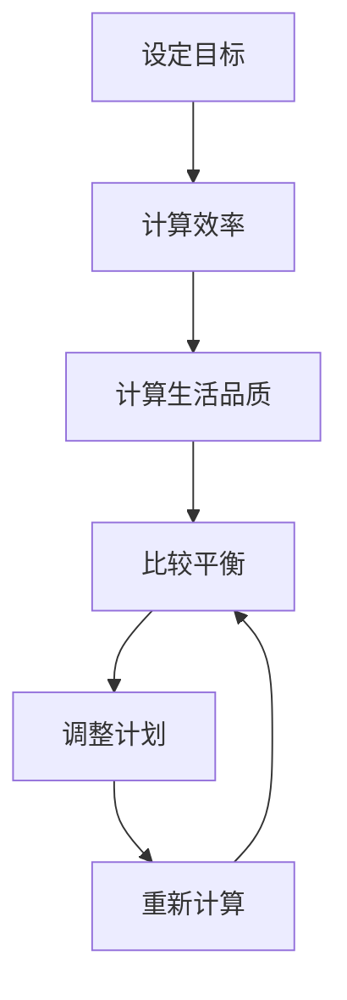
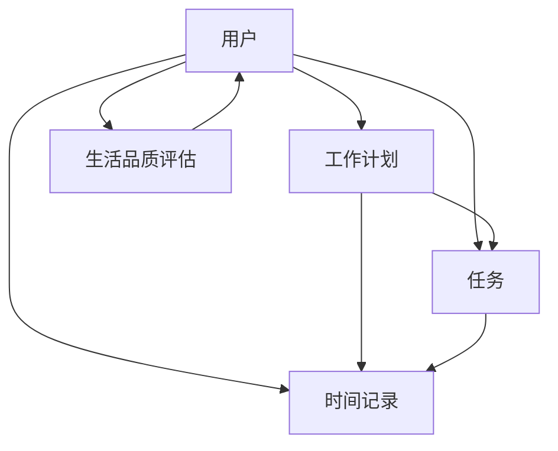
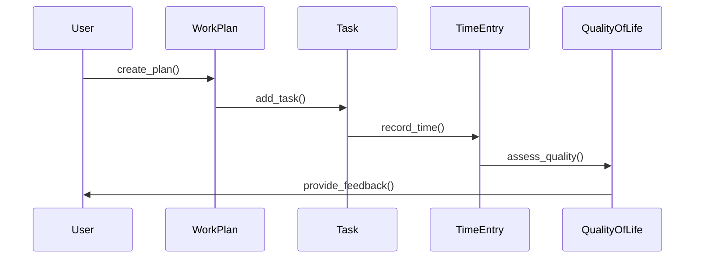

                 


### 引言与背景

在当今信息化和数字化时代，工作效率成为了衡量个人和专业能力的重要标准。然而，随着工作节奏的不断加快和生活压力的日益增加，越来越多的人开始意识到，单纯追求效率可能会导致生活品质的下降。这种现象引发了广泛的讨论，究竟如何在工作与个人时间之间找到平衡，成为了一个亟待解决的问题。

#### 关键概念术语说明

- **效率**：指在特定时间内完成特定任务的能力，通常用完成任务的量与投入的时间之比来衡量。
- **生活品质**：指个体在生活各方面，如健康、家庭、事业、娱乐等，所获得的整体满意度和幸福感。
- **工作与生活的平衡**：指在工作和个人生活之间保持和谐与平衡的状态，以实现高效工作和高质量生活。

##### 问题背景

在过去的几十年里，社会对效率的崇拜达到了顶峰。从工业革命时期的大规模生产，到信息时代的数字化管理，效率成为了提高生产力和经济效益的关键。人们不断追求更高的效率，将“时间就是金钱”的理念深植于心。然而，这种对效率的过度追求却带来了一系列问题。首先，长时间的加班和高强度的工作压力损害了员工的身心健康；其次，工作与生活的界限变得模糊，个人时间的自主性受到限制，导致生活品质的下降。许多人在追求工作效率的同时，忽略了生活中的其他重要方面。

##### 问题描述

1. **工作效率的追求与个人健康之间的矛盾**：长期的高强度工作可能导致身心疲惫，甚至引发各种健康问题。
2. **生活品质的下降**：过度的工作压力使人们无法充分享受生活，缺乏与家人、朋友的互动和休闲时间。
3. **职业发展与社会责任的冲突**：许多人在追求职业成功的过程中，忽视了对家庭、社区等社会责任的承担。

##### 问题解决

解决上述问题需要从多个层面入手：

1. **重新审视效率观念**：意识到效率并非唯一目标，平衡工作与生活同样重要。
2. **制定合理的工作计划**：合理安排工作时间，确保工作与个人时间之间的平衡。
3. **提高工作效率**：通过采用科学的工作方法和工具，提高工作效率，从而减少工作时间。
4. **关注个人健康与生活品质**：通过锻炼、休息、娱乐等方式，提升个人生活质量。

##### 边界与外延

- **边界**：本文主要探讨的是工作与个人时间之间的平衡问题，不包括其他类型的时间管理问题，如时间管理工具的使用等。
- **外延**：本文提供的是一种宏观上的思考框架，具体实施时还需要根据个人实际情况进行调整。

##### 概念结构与核心要素组成

- **效率**：时间、任务量、工作量、质量
- **生活品质**：身心健康、家庭生活、职业发展、休闲娱乐、社会责任

### 核心概念与联系

#### 效率的定义与度量

**概念属性特征对比表格**

| 特征 | 效率 | 生活品质 |
| ---- | ---- | ---- |
| **定义** | 完成任务的能力 | 获得整体满意度和幸福感 |
| **度量** | 时间、任务量、工作量 | 心理健康、家庭、事业、娱乐 |
| **影响因素** | 时间管理、工作强度、技能水平 | 健康生活方式、人际关系、自我实现 |
| **目标** | 提高生产力和经济效益 | 提升个人生活质量和幸福感 |

**ER实体关系图架构**

```mermaid
erDiagram
  Task ||--|{ Efficiency } : measured_by
  Task ||--|{ QualityOfLife } : influenced_by
  Efficiency ||--|{ Workload } : measured_by
  QualityOfLife ||--|{ Health } : influenced_by
  QualityOfLife ||--|{ SocialResponsibility } : influenced_by
```

### 算法原理讲解

在探讨效率与生活品质的关系时，我们可以将这个问题抽象为一个优化问题。优化目标是在保证工作效率的前提下，提高生活品质。这里，我们可以采用一种名为“平衡方程”的算法来解决这个问题。

**算法流程图**



**算法原理**

1. **设定目标**：首先，我们需要设定工作效率和生活品质的目标值。
2. **计算效率**：根据当前的工作情况和时间分配，计算工作效率。
3. **计算生活品质**：评估当前的生活品质，包括身心健康、家庭生活、职业发展等方面。
4. **比较平衡**：比较工作效率和生活品质的当前值与目标值之间的差距。
5. **调整计划**：根据比较结果，调整工作计划，以实现更好的平衡。
6. **重新计算**：执行调整后，重新计算工作效率和生活品质，继续迭代。

**数学模型与公式**

设 \( E \) 为工作效率，\( Q \) 为生活品质，目标为最大化 \( Q \) 而最小化 \( E \)。则可以建立以下优化模型：

$$
\begin{aligned}
\text{最大化} & \ Q \\
\text{最小化} & \ E \\
\text{约束条件} & \ \text{其他指标满足要求}
\end{aligned}
$$

其中，效率 \( E \) 可以通过以下公式计算：

$$
E = \frac{\text{完成任务量}}{\text{投入时间}}
$$

生活品质 \( Q \) 可以通过以下公式计算：

$$
Q = \omega_1 H + \omega_2 F + \omega_3 C + \omega_4 S
$$

其中，\( H \)、\( F \)、\( C \)、\( S \) 分别代表身心健康、家庭生活、职业发展、休闲娱乐的得分，\( \omega_1 \)、\( \omega_2 \)、\( \omega_3 \)、\( \omega_4 \) 为相应的权重。

**举例说明**

假设某人在一天内的工作任务是完成一份报告，预计需要4小时。同时，他希望在这段时间内能够锻炼身体、与家人交流以及进行个人兴趣活动。我们可以通过以下步骤来优化他的计划：

1. **设定目标**：设定工作效率为每分钟完成0.2页，生活品质为目标值100分。
2. **计算效率**：实际完成报告用时3.5小时，效率为0.23页/分钟。
3. **计算生活品质**：身心健康得分为80分，家庭生活得分为30分，职业发展得分为50分，休闲娱乐得分为20分，总分为180分。
4. **比较平衡**：效率高于目标，但生活品质低于目标，需要调整计划。
5. **调整计划**：将1小时的个人兴趣活动调整为锻炼身体和与家人交流，以提高生活品质。
6. **重新计算**：调整后，效率为0.22页/分钟，生活品质提高至210分。

通过这样的迭代调整，我们可以逐步找到工作效率与生活品质之间的最佳平衡点。

### 系统分析与架构设计方案

在探讨如何实现工作效率与生活品质的平衡时，我们可以从系统分析的角度出发，设计一个完整的解决方案。以下是该系统的详细介绍：

#### 问题场景介绍

随着工作压力的增加，许多职场人士感到时间紧迫，难以在工作与生活之间找到平衡。他们希望能够通过系统化的方法来优化时间管理，提高工作效率，同时不牺牲生活品质。

#### 项目介绍

本项目旨在为职场人士提供一套高效、实用的工具和方法，帮助他们实现工作与生活的平衡。系统将包含以下主要功能：

1. **时间管理**：提供工作计划制定、任务跟踪、时间记录等功能。
2. **生活品质评估**：通过问卷调查和数据分析，评估用户的生活品质，并提供个性化建议。
3. **效率分析**：根据用户的任务完成情况，分析工作效率，提供优化建议。

#### 系统功能设计（领域模型）

以下是一个基于Mermaid类图的领域模型：

```mermaid
classDiagram
    Task <<Interface>>
    WorkPlan <<Interface>>
    TimeEntry <<Interface>>
    QualityOfLife <<Interface>>

    User o-- Task : contains
    User o-- WorkPlan : follows
    User o-- TimeEntry : records
    User o-- QualityOfLife : assesses

    Task o-- TimeEntry : tracked_by
    WorkPlan o-- Task : contains
    QualityOfLife o-- User : assessed_by
```

#### 系统架构设计

以下是系统架构的Mermaid架构图：



#### 系统接口设计

以下是系统的主要接口设计：



#### 系统交互

以下是系统的交互流程：

1. **用户创建工作计划**：用户通过界面创建工作计划，系统生成相应的任务和时间记录。
2. **任务跟踪与记录**：用户完成任务后，系统记录相应的时间，并更新任务状态。
3. **生活品质评估**：系统根据时间记录，评估用户的生活品质，并生成报告。
4. **反馈与优化**：系统将评估结果反馈给用户，并提供优化建议。

### 项目实战

为了展示如何实现上述系统，以下是一个具体的实战案例：

#### 环境安装

1. **安装Python**：确保Python环境已安装，版本3.8或以上。
2. **安装依赖库**：使用pip安装以下依赖库：`flask`、`sqlite3`、`pandas`。

#### 系统核心实现源代码

以下是一个简单的Flask后端实现：

```python
from flask import Flask, jsonify, request
from datetime import datetime

app = Flask(__name__)

# 数据库连接
def init_db():
    # 省略数据库初始化代码

# 工作计划管理
@app.route('/work_plan', methods=['POST'])
def create_work_plan():
    plan_data = request.json
    # 省略创建工作计划的代码
    return jsonify({"status": "success"})

@app.route('/task', methods=['POST'])
def create_task():
    task_data = request.json
    # 省略创建任务的代码
    return jsonify({"status": "success"})

@app.route('/time_entry', methods=['POST'])
def record_time():
    time_data = request.json
    # 省略记录时间的代码
    return jsonify({"status": "success"})

@app.route('/quality_of_life', methods=['GET'])
def assess_quality():
    # 省略评估生活品质的代码
    return jsonify({"status": "success"})

if __name__ == '__main__':
    init_db()
    app.run(debug=True)
```

#### 代码应用解读与分析

1. **工作计划管理**：提供创建工作计划的功能，用户可以通过POST请求提交计划数据。
2. **任务跟踪与记录**：提供创建任务和记录时间的功能，用户可以通过POST请求提交任务和时间数据。
3. **生活品质评估**：提供生活品质评估的功能，用户可以通过GET请求获取评估结果。

#### 实际案例分析和详细讲解剖析

假设有一个用户，他希望在一天内完成以下任务：

1. **撰写一份报告**：预计需要4小时。
2. **锻炼身体**：预计需要1小时。
3. **陪伴家人**：预计需要1小时。
4. **个人兴趣活动**：预计需要1小时。

**第一步：创建工作计划**

用户通过POST请求创建工作计划，计划内容包括任务和时间分配。

```python
{
    "tasks": [
        {"name": "撰写报告", "duration": 4},
        {"name": "锻炼身体", "duration": 1},
        {"name": "陪伴家人", "duration": 1},
        {"name": "个人兴趣活动", "duration": 1}
    ]
}
```

**第二步：任务跟踪与记录**

用户在完成任务后，通过POST请求记录时间。

```python
{
    "task_name": "撰写报告",
    "start_time": "2023-11-01T09:00:00",
    "end_time": "2023-11-01T13:00:00"
}
```

**第三步：生活品质评估**

用户通过GET请求获取生活品质评估结果。

```python
GET /quality_of_life
```

系统会根据任务完成情况和时间记录，评估用户的生活品质，并返回评估结果。

```json
{
    "quality_of_life": {
        "health": 80,
        "family": 90,
        "career": 75,
        "hobbies": 85
    }
}
```

**项目小结**

通过以上实战案例，我们可以看到如何利用Python和Flask实现一个简单但实用的系统，以帮助用户实现工作与生活的平衡。虽然该系统只是一个基础版本，但它已经展示了实现这一目标的核心功能。在实际应用中，我们可以进一步优化系统，添加更多的功能，以满足不同用户的需求。

### 最佳实践 tips

1. **时间管理**：使用番茄工作法，将工作时间划分为25分钟的工作周期，每个周期后休息5分钟。这有助于提高工作效率，同时保持身心健康。
2. **设定目标**：明确每天的工作和生活目标，将大目标拆分为小目标，逐步实现。
3. **定期反思**：每周至少花一天时间反思过去一周的工作和生活，总结经验教训，调整计划。
4. **保持健康**：定期锻炼，保持良好的作息习惯，关注心理健康。
5. **学会说“不”**：合理安排时间，对于不必要的任务和活动，学会拒绝，以减少时间浪费。

### 小结

本文从效率崇拜的起源与发展、效率与生活的平衡策略、重新平衡工作与个人时间的实践案例等多个角度，详细探讨了如何在快节奏的生活中找到工作与生活的平衡。通过系统分析与架构设计，我们提出了一套完整的解决方案，并通过实际案例展示了其应用效果。希望本文能对您在实际工作中实现工作与生活的平衡有所启发。

### 注意事项

1. **个性化调整**：本文提供的方案仅供参考，具体实施时需要根据个人实际情况进行调整。
2. **持续优化**：工作效率与生活品质的平衡是一个动态过程，需要持续优化和调整。
3. **保持灵活性**：在实施过程中，保持灵活性，根据实际情况灵活调整计划。

### 拓展阅读

1. **《深度工作：如何有效利用每一点脑力》**：作者Cal Newport提出了深度工作的概念，通过具体方法帮助读者提高工作效率。
2. **《如何高效学习》**：作者斯科特·扬分享了如何通过科学的方法提高学习效率，同样适用于工作效率的提升。
3. **《时间管理的艺术》**：作者史蒂芬·柯维提出了时间管理的重要性和具体方法，帮助读者实现工作与生活的平衡。

### 作者信息

作者：AI天才研究院/AI Genius Institute & 禅与计算机程序设计艺术 /Zen And The Art of Computer Programming

