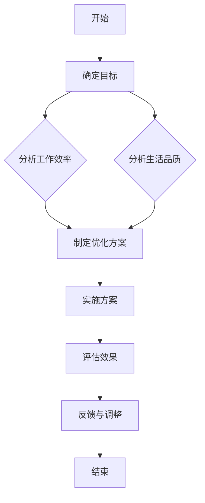
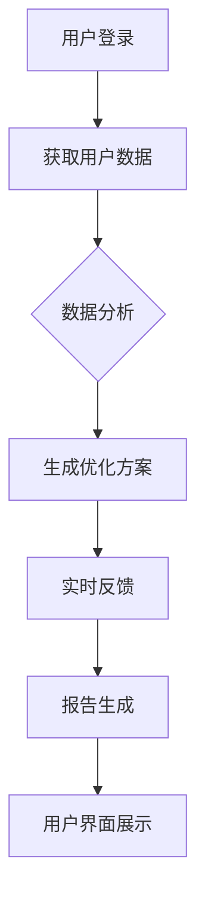
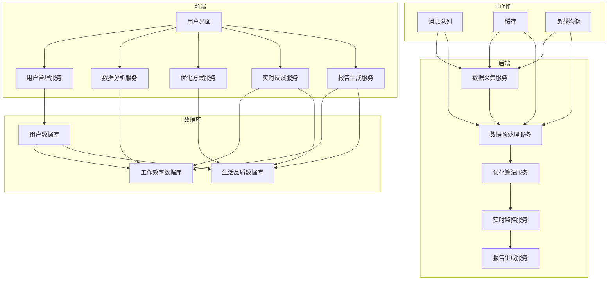
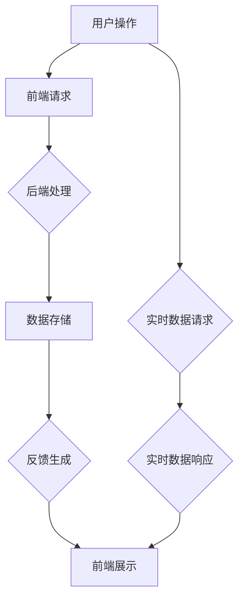

                 

### 引言：工作效率与生活品质的平衡

在当今快节奏、竞争激烈的工作环境中，工作效率常常被放在首位。企业追求高产出、快速完成任务，员工也往往以此为目标，试图提升自己的职业竞争力。然而，这种效率至上的理念在带来一定成果的同时，也逐渐显现出其弊端。本文旨在探讨如何从效率至上转向生活品质，重新平衡工作与个人生活，提升整体幸福感与生活质量。

#### 1.1 问题背景

现代职场压力无处不在，从高强度的加班到不断涌现的工作任务，员工常常感到力不从心。同时，工作与生活的冲突也愈发显著，许多人在忙碌的工作中无暇顾及家庭、健康和娱乐。这种状况不仅影响了员工的工作效率，也严重损害了他们的身心健康和生活品质。

#### 1.1.1 现代职场压力

现代职场中，员工面临的工作压力主要来源于以下几个方面：

1. **任务繁重**：企业对员工的要求越来越高，任务量和难度不断增大，导致员工不得不加班加点完成任务。
2. **时间紧迫**：现代科技的发展使得信息传递速度加快，员工需要快速响应，时间管理变得尤为重要。
3. **竞争激烈**：职场竞争激烈，员工担心自己的岗位不保，从而不断努力提升自己的技能和业绩。

#### 1.1.2 工作与生活冲突

工作与生活的冲突主要体现在以下几个方面：

1. **时间冲突**：工作占用了员工大量时间，导致他们无法有效地安排家庭和娱乐活动。
2. **心理压力**：长期的工作压力导致员工心理负担加重，容易出现焦虑、抑郁等心理问题。
3. **健康问题**：长时间的工作和缺乏锻炼，使得员工的身体健康状况逐渐下降，容易出现疲劳、失眠等问题。

#### 1.1.3 效率至上的弊端

效率至上虽然在一定程度上提升了工作产出，但其弊端也逐渐显现：

1. **牺牲健康**：长期的高强度工作会损害员工的身体健康，导致各种健康问题。
2. **损害心理**：工作压力过大，容易导致员工心理问题，影响工作质量和人际关系。
3. **影响家庭**：长时间的工作占用了员工的陪伴时间，导致家庭关系紧张，亲子关系疏远。
4. **降低幸福感**：只关注工作效率，忽视个人生活品质，容易导致员工幸福感降低，生活质量下降。

#### 1.2 问题描述

工作效率与生活品质之间存在紧密的联系，二者相互影响。然而，在实际操作中，如何平衡二者成为一个复杂的问题。首先，我们需要明确工作效率与生活品质的定义，并探讨其关系。

#### 1.2.1 工作效率与生活品质的关系

工作效率通常指在给定时间内完成的工作量，是衡量职业竞争力的关键指标。而生活品质则涵盖了心理健康、家庭幸福、休闲娱乐等多个方面，是衡量生活质量的重要标准。工作效率的提升可以带来职业成功和物质回报，但生活品质的提高则能带来更全面的幸福感。

一方面，工作效率的提升有助于减少工作时间，从而为个人生活提供更多时间和资源。通过优化工作流程和时间管理，员工可以在较少的时间内完成更多任务，从而有更多的时间用于个人发展、家庭生活和休闲娱乐。

另一方面，生活品质的提高也可以促进工作效率。心理健康、家庭幸福和休闲娱乐等因素能提高员工的工作积极性、创造力和满意度，从而提升工作效率。

#### 1.2.2 平衡工作与个人生活的必要性

平衡工作与个人生活对于员工和企业来说都具有重要意义：

1. **提高员工幸福感**：通过平衡工作与生活，员工可以享受更高质量的生活，从而提高幸福感。
2. **提升工作效率**：良好的生活品质有助于提高员工的工作积极性、创造力和工作效率。
3. **增强企业凝聚力**：关注员工生活品质的企业更容易吸引和留住优秀人才，提高企业的整体竞争力。
4. **实现可持续发展**：长期的工作与生活失衡会导致员工健康问题、心理问题和家庭问题，影响企业的可持续发展。

#### 1.2.3 研究目的与意义

本文的研究目的在于探讨如何重新平衡工作效率与个人生活，提升员工的幸福感和企业的整体竞争力。通过分析工作效率与生活品质的关系，探讨影响平衡的多种因素，提出切实可行的解决方案，以期为企业和员工提供有益的指导。

本文的研究意义主要体现在以下几个方面：

1. **理论意义**：本文系统地分析了工作效率与生活品质的关系，提出了平衡二者的新思路，丰富了相关理论研究。
2. **实践意义**：本文提出的平衡工作与个人生活的解决方案具有可操作性，有助于企业和员工在实际工作中应用。
3. **现实意义**：随着现代社会竞争的加剧，如何平衡工作与个人生活成为员工和企业共同关注的问题，本文的研究对于解决这一问题具有重要意义。

#### 1.3 问题解决

为了解决工作效率与生活品质失衡的问题，我们需要从多个方面入手，采取综合措施。以下是一些可能的解决途径：

1. **优化工作流程**：通过重新设计工作流程，减少不必要的步骤和环节，提高工作效率。
2. **科学时间管理**：合理规划工作与休息时间，避免过度加班，确保有足够的时间用于个人生活和休闲娱乐。
3. **提升员工福利**：企业可以提供更多的福利措施，如健康体检、心理咨询、家庭支持等，帮助员工解决生活中的问题，提高生活品质。
4. **企业文化建设**：营造关注员工福利和企业发展的企业文化，让员工感受到企业的关爱和支持，从而提高工作积极性和幸福感。
5. **心理辅导与培训**：提供心理辅导和培训，帮助员工应对工作压力，提高心理健康水平。
6. **家庭与工作的协调**：鼓励员工与家人沟通，合理安排家庭活动，确保有足够的时间陪伴家人。

通过以上措施，我们可以逐步实现工作效率与生活品质的平衡，提升员工的幸福感和企业的整体竞争力。

#### 1.4 边界与外延

在探讨工作效率与生活品质的平衡时，我们需要明确一些相关概念和边界，以便更好地理解和应用相关理论。

#### 1.4.1 工作效率的衡量

工作效率的衡量可以通过以下指标进行：

1. **产出率**：单位时间内完成的工作量，是衡量工作效率最直接的指标。
2. **任务完成率**：按照约定时间完成任务的百分比，反映了工作效率的稳定性。
3. **时间利用率**：工作时间内实际用于工作的时间比例，反映了时间管理的有效性。

#### 1.4.2 生活品质的定义

生活品质的定义较为复杂，通常包括以下几个方面：

1. **心理健康**：包括情绪稳定、心理健康、抗压能力等。
2. **家庭幸福**：包括家庭关系和谐、亲子关系良好等。
3. **休闲娱乐**：包括休闲活动、兴趣爱好等，反映了个人生活丰富多彩的程度。

#### 1.4.3 研究范围

本文的研究范围主要包括以下几个方面：

1. **职场员工**：主要针对职场中从事不同岗位的员工，探讨工作效率与生活品质的平衡问题。
2. **企业组织**：关注企业内部的管理制度和企业文化，探讨如何通过优化制度和文化建设来实现工作与生活的平衡。
3. **心理学和社会学理论**：结合心理学和社会学理论，分析工作效率与生活品质的内在联系和影响因素。

通过明确这些概念和边界，我们可以更准确地理解和应用本文提出的理论和解决方案，实现工作效率与生活品质的平衡。

## 第2章 核心概念与联系

在探讨工作效率与生活品质的平衡问题时，核心概念的理解和联系至关重要。本章将详细阐述工作效率、生活品质以及平衡这三个核心概念，并分析它们之间的相互关系。

### 2.1 核心概念原理

#### 2.1.1 工作效率

工作效率是指在一定时间内完成的工作量，它是衡量职业竞争力的关键指标。工作效率不仅涉及产出率，还包括任务完成率和时间利用率。高工作效率意味着在有限的时间内能够完成更多的任务，从而为企业创造更大的价值。

1. **产出率**：单位时间内完成的工作量，通常用任务数量、项目完成度等指标来衡量。
2. **任务完成率**：按照预定时间、质量要求完成任务的百分比，反映了工作效率的稳定性和可靠性。
3. **时间利用率**：工作时间内实际用于工作的时间比例，反映了时间管理的有效性。

#### 2.1.2 生活品质

生活品质是衡量个人生活质量的重要标准，它涵盖了心理健康、家庭幸福和休闲娱乐等多个方面。良好的生活品质有助于提高个人的幸福感，促进身心健康。

1. **心理健康**：包括情绪稳定、心理健康、抗压能力等，是生活品质的核心组成部分。
2. **家庭幸福**：包括家庭关系和谐、亲子关系良好等，是个人生活中不可或缺的一部分。
3. **休闲娱乐**：包括休闲活动、兴趣爱好等，反映了个人生活的丰富多彩程度。

#### 2.1.3 平衡的概念

平衡是指工作效率与生活品质之间的协调和匹配。平衡并不意味着完全相等，而是指在一定范围内，二者能够相互促进，达到最佳状态。

1. **内部平衡**：工作效率与生活品质在个人层面的平衡，即员工能够在工作中保持高效率，同时拥有良好的个人生活。
2. **外部平衡**：企业层面上的平衡，即企业通过管理措施和文化建设，帮助员工实现工作与生活的平衡，从而提高整体竞争力。

### 2.2 概念属性特征对比

为了更清晰地理解工作效率和生活品质这两个核心概念，我们可以通过表格的形式对比它们的属性特征。

| 概念   | 工作效率                 | 生活品质                   |
|--------|--------------------------|---------------------------|
| 特征   | 高产出、快速完成任务   | 心理健康、家庭幸福、休闲娱乐 |
| 重要性 | 提升职业竞争力          | 提升幸福感与生活质量      |

从表格中可以看出，工作效率和生活品质在特征和重要性上有明显的区别。工作效率注重产出和效率，而生活品质则强调心理、家庭和休闲娱乐等方面的综合幸福感。

### 2.3 ER实体关系图架构

为了更直观地展示工作效率、生活品质和平衡之间的关系，我们可以使用Mermaid流程图来绘制ER实体关系图。

```mermaid
erDiagram
  工作效率 ||--|{ 平衡 }||> 生活品质
  生活品质 ||--|{ 平衡 }||> 工作效率
  平衡 ||--|{ }||> 工作效率
  平衡 ||--|{ }||> 生活品质
```

在上述ER图中，工作效率、生活品质和平衡被视为三个核心实体，它们之间存在双向关联，即工作效率可以通过平衡影响生活品质，生活品质也可以通过平衡影响工作效率。平衡作为连接二者的重要纽带，确保了工作效率与生活品质之间的动态平衡。

通过本章对核心概念原理的阐述和ER实体关系图的绘制，我们为后续章节的深入分析提供了坚实的基础。在接下来的章节中，我们将进一步探讨如何实现工作效率与生活品质的平衡，为职场员工和企业提供切实可行的解决方案。

### 第3章 算法原理讲解

在实现工作效率与生活品质的平衡过程中，算法原理扮演着关键角色。本章将详细讲解算法原理，包括算法流程、Python源代码、数学模型以及具体的举例说明。

#### 3.1 算法Mermaid流程图

为了直观地展示算法流程，我们可以使用Mermaid流程图来绘制。以下是一个简单的算法流程图：



在这个流程图中，我们首先确定目标，然后分别分析工作效率和生活品质，接着制定优化方案并实施，最后评估效果并反馈调整。

#### 3.2 Python源代码与算法原理

为了实现上述算法流程，我们可以使用Python编写相应的源代码。以下是一个基本的Python代码示例：

```python
# Python 源代码示例

def analyze_efficiency():
    # 分析工作效率的相关代码
    pass

def analyze_life_quality():
    # 分析生活品质的相关代码
    pass

def optimize_plan(efficiency, life_quality):
    # 制定优化方案的代码
    pass

def implement_plan(plan):
    # 实施方案的代码
    pass

def evaluate_effect(effect):
    # 评估效果的相关代码
    pass

def feedback_adjustment(feedback):
    # 反馈调整的相关代码
    pass

def main():
    # 主函数
    efficiency = analyze_efficiency()
    life_quality = analyze_life_quality()
    plan = optimize_plan(efficiency, life_quality)
    implement_plan(plan)
    effect = evaluate_effect(plan)
    feedback_adjustment(effect)

if __name__ == "__main__":
    main()
```

在这个Python源代码中，我们定义了多个函数，分别负责分析工作效率、分析生活品质、制定优化方案、实施方案、评估效果和反馈调整。通过这些函数的相互调用，我们可以实现算法的整体流程。

#### 3.3 算法原理详细讲解与举例说明

为了更好地理解算法原理，我们需要详细讲解其数学模型，并通过具体的例子来说明。

#### 3.3.1 工作效率的数学模型

工作效率可以用以下数学模型表示：

$$
效率 = \frac{产出}{时间}
$$

其中，产出表示在一定时间内完成的工作量，时间表示工作所花费的时间。效率越高，表示单位时间内完成的工作量越多。

举例来说，如果一个员工在一个小时内完成了10个任务，那么他的工作效率为10。

#### 3.3.2 生活品质的数学模型

生活品质可以用以下数学模型表示：

$$
品质 = \frac{心理健康 + 家庭幸福 + 休闲娱乐}{时间}
$$

其中，心理健康、家庭幸福和休闲娱乐分别表示个人的心理健康水平、家庭幸福度和休闲娱乐时间。品质越高，表示个人生活越丰富多彩。

举例来说，如果一个员工的心理健康得分为90，家庭幸福得分为80，休闲娱乐时间为30分钟，那么他的生活品质为：

$$
品质 = \frac{90 + 80 + 30}{3} = 80
$$

#### 3.3.3 平衡的数学模型

平衡可以通过以下数学模型表示：

$$
平衡 = \frac{效率 \times 生活品质}{常数}
$$

其中，效率和生活品质分别表示工作效率和生活品质的得分，常数是一个固定的系数，用于调整二者的相对权重。

举例来说，如果效率为10，生活品质为80，常数取值为100，那么平衡的得分为：

$$
平衡 = \frac{10 \times 80}{100} = 8
$$

通过上述数学模型和例子，我们可以更好地理解工作效率、生活品质和平衡之间的关系，以及如何通过算法实现二者的平衡。

### 3.4 算法应用场景与优化策略

在实际应用中，算法的实现需要考虑多种因素，如数据获取、算法优化和实时调整等。以下是一些常见的应用场景和优化策略：

#### 3.4.1 数据获取

1. **工作效率数据**：可以通过任务管理系统、时间跟踪工具等获取员工的工作效率数据。
2. **生活品质数据**：可以通过问卷调查、员工反馈等方式获取员工的生活品质数据。

#### 3.4.2 算法优化

1. **机器学习**：通过机器学习算法，可以对工作效率和生活品质进行预测，从而更准确地制定优化方案。
2. **数据挖掘**：通过数据挖掘技术，可以分析员工的工作习惯和生活品质模式，发现潜在的问题和改进空间。

#### 3.4.3 实时调整

1. **动态调整**：根据实时数据，可以动态调整工作效率和生活品质的平衡点，以实现最佳平衡状态。
2. **反馈机制**：建立反馈机制，及时收集员工对优化方案的效果反馈，进行持续的调整和改进。

通过这些应用场景和优化策略，我们可以更好地实现工作效率与生活品质的平衡，提升员工的幸福感和企业的整体竞争力。

### 3.5 算法总结与展望

算法在实现工作效率与生活品质平衡中起着关键作用。通过Mermaid流程图、Python源代码和数学模型，我们详细讲解了算法原理。在实际应用中，算法需要考虑数据获取、算法优化和实时调整等因素。未来，随着技术的发展，算法可以更加智能化和自动化，为职场员工和企业提供更加高效和全面的解决方案。

### 3.6 结论

通过本章的讲解，我们系统地阐述了工作效率、生活品质和平衡的算法原理。算法原理不仅为我们提供了实现工作效率与生活品质平衡的理论基础，也为实际应用提供了具体方法和优化策略。希望读者能够结合自身实际情况，灵活运用算法原理，实现工作与生活的和谐平衡。

## 第4章 系统分析与架构设计方案

为了更好地实现工作效率与生活品质的平衡，我们需要从系统层面进行深入分析和架构设计。本章将详细探讨项目背景、系统功能设计、系统架构设计、系统接口设计和系统交互，为实际应用提供清晰的解决方案。

### 4.1 问题场景介绍

在现代职场中，如何平衡工作效率与个人生活成为了员工普遍关注的问题。工作效率高固然有助于职业发展，但过度的工作压力和生活失衡会导致员工身心健康受损，影响长期的工作表现。因此，构建一个能够帮助员工实现工作效率与生活品质平衡的系统显得尤为重要。

#### 4.1.1 问题现状

1. **工作压力**：职场员工普遍面临工作量大、任务紧急等压力，导致工作效率低下，同时也影响到身心健康。
2. **生活失衡**：员工由于工作繁忙，常常忽视了个人生活和家庭，导致生活质量下降，家庭关系紧张。
3. **缺乏平衡**：大多数员工在努力提升工作效率的同时，忽视了个人生活品质的提升，导致整体幸福感降低。

#### 4.1.2 解决需求

为了解决上述问题，我们需要一个系统能够：

1. **数据分析**：对员工的工作效率和生活品质进行数据分析，发现潜在问题。
2. **优化方案**：提供基于数据的优化方案，帮助员工提升工作效率，同时改善个人生活品质。
3. **实时反馈**：实现实时反馈机制，根据员工的工作和生活表现进行调整，确保系统持续优化。

### 4.2 项目介绍

本项目名为“工作效率与生活品质平衡系统”，旨在通过数据分析、优化方案和实时反馈等手段，帮助员工实现工作效率与生活品质的平衡。系统主要面向职场员工，包括普通员工和管理层，通过以下功能模块实现目标：

1. **数据分析模块**：收集和分析员工的工作效率数据和生活品质数据，提供数据可视化。
2. **优化方案模块**：根据数据分析结果，为员工提供个性化的优化方案。
3. **实时反馈模块**：实现实时数据反馈，帮助员工了解自身工作与生活表现，并进行调整。
4. **报告生成模块**：定期生成员工的工作效率与生活品质报告，为管理层提供决策依据。

### 4.3 系统功能设计

系统功能设计包括以下几个关键模块：

1. **用户管理模块**：管理员工账户，包括注册、登录、信息修改等。
2. **数据分析模块**：
   - 功能：收集员工的工作效率数据和生活品质数据。
   - 技术实现：使用数据采集工具和算法模型，对数据进行分析和处理。
3. **优化方案模块**：
   - 功能：根据数据分析结果，为员工提供优化工作流程、提高工作效率和生活品质的个性化方案。
   - 技术实现：基于机器学习和数据分析技术，制定优化策略。
4. **实时反馈模块**：
   - 功能：实时监测员工的工作效率和生活品质，提供即时反馈。
   - 技术实现：使用实时数据监控技术和智能算法，实现数据实时更新和反馈。
5. **报告生成模块**：
   - 功能：定期生成员工的工作效率与生活品质报告。
   - 技术实现：使用报告生成工具，将数据分析结果可视化。

### 4.4 系统架构设计

系统架构设计包括前端、后端和数据库三个主要部分。以下是一个简单的系统架构设计：

1. **前端**：负责用户界面的展示和交互，主要包括用户管理模块、数据分析模块、优化方案模块、实时反馈模块和报告生成模块。
2. **后端**：负责业务逻辑的处理和数据存储，主要包括数据采集、数据分析、优化方案生成、实时反馈和报告生成等功能。
3. **数据库**：存储用户数据、工作效率数据和生活品质数据，采用关系型数据库或NoSQL数据库，根据数据特点和需求进行选择。

### 4.5 系统接口设计

系统接口设计包括以下关键接口：

1. **用户接口**：提供用户注册、登录、信息修改等功能。
2. **数据接口**：提供数据采集、数据分析、优化方案生成、实时反馈和报告生成等功能。
3. **外部接口**：与其他系统（如任务管理系统、人力资源管理系统等）进行数据交换和协同工作。

### 4.6 系统交互设计

系统交互设计通过Mermaid流程图来展示，以下是一个简单的系统交互设计流程：



在上述流程中，用户登录系统后，系统会自动获取用户数据，进行数据分析，生成优化方案，并实时反馈给用户。同时，系统会定期生成报告，供用户和管理层参考。

### 4.7 系统实现与部署

系统实现与部署主要包括以下步骤：

1. **需求分析**：明确系统功能需求和性能要求。
2. **架构设计**：根据需求分析，设计系统架构和接口。
3. **编码实现**：按照架构设计，编写前端和后端代码。
4. **测试与调试**：进行功能测试、性能测试和安全测试，确保系统稳定可靠。
5. **部署上线**：将系统部署到生产环境，并进行上线维护。

### 4.8 系统维护与升级

系统维护与升级包括以下内容：

1. **日常维护**：定期检查系统运行状况，确保系统稳定可靠。
2. **功能升级**：根据用户反馈和市场需求，不断优化和升级系统功能。
3. **安全加固**：定期进行安全检查和升级，确保系统数据安全和用户隐私。

通过上述系统分析与架构设计方案，我们为工作效率与生活品质的平衡提供了完整的解决方案。希望这个系统能够在实际应用中发挥积极作用，帮助员工实现工作与生活的和谐平衡。

### 4.9 系统功能模块详细设计

为了更好地实现工作效率与生活品质的平衡，系统功能模块的详细设计至关重要。以下将详细介绍各个功能模块的设计思路、实现方法和关键点。

#### 4.9.1 用户管理模块

**设计思路**：用户管理模块负责管理员工账户，包括注册、登录、信息修改等。

**实现方法**：
- **注册**：用户可以通过邮箱或手机号注册账户，系统会发送验证码进行验证。
- **登录**：用户输入账号和密码进行登录，系统会进行身份验证。
- **信息修改**：用户可以修改个人信息，如姓名、邮箱、密码等。

**关键点**：
- **安全性**：确保用户数据的安全性，采用加密技术存储用户密码。
- **用户体验**：简化注册和登录流程，提供清晰的用户界面。

#### 4.9.2 数据分析模块

**设计思路**：数据分析模块负责收集和分析员工的工作效率数据和生活品质数据。

**实现方法**：
- **数据收集**：通过任务管理系统、时间跟踪工具等获取员工的工作效率数据；通过问卷调查、用户反馈等方式获取生活品质数据。
- **数据预处理**：对收集到的数据进行清洗、去噪和转换，使其符合分析要求。
- **数据分析**：使用数据挖掘和机器学习技术，对预处理后的数据进行深度分析，提取有用的信息。

**关键点**：
- **数据完整性**：确保收集到的数据完整、准确，避免数据丢失或误差。
- **分析准确性**：选择合适的分析方法和算法，确保分析结果的准确性。

#### 4.9.3 优化方案模块

**设计思路**：优化方案模块根据数据分析结果，为员工提供个性化的优化方案。

**实现方法**：
- **方案生成**：基于数据分析结果，使用优化算法（如线性规划、遗传算法等）生成优化方案。
- **方案推荐**：将优化方案推荐给用户，用户可以根据自己的需求和喜好进行调整。

**关键点**：
- **个性化**：根据用户的实际情况和需求，生成具有针对性的优化方案。
- **可操作性**：确保优化方案易于实施，用户可以方便地理解和执行。

#### 4.9.4 实时反馈模块

**设计思路**：实时反馈模块负责实时监测员工的工作效率和生活品质，提供即时反馈。

**实现方法**：
- **实时数据监控**：通过实时数据采集技术，实时监测员工的工作效率数据和生活品质数据。
- **即时反馈**：将实时数据反馈给用户，帮助用户及时了解自己的工作与生活状况。

**关键点**：
- **实时性**：确保实时数据的及时性和准确性。
- **用户体验**：提供直观、易懂的实时数据展示，方便用户快速获取信息。

#### 4.9.5 报告生成模块

**设计思路**：报告生成模块负责定期生成员工的工作效率与生活品质报告。

**实现方法**：
- **报告生成**：根据数据分析结果，生成报告，包括文字描述、图表展示等。
- **报告导出**：用户可以导出报告，以便打印或分享。

**关键点**：
- **可视化**：使用图表和图形，使报告更加直观易懂。
- **定制化**：允许用户根据自己的需求调整报告的内容和格式。

通过详细设计各个功能模块，我们为工作效率与生活品质平衡系统提供了坚实的实现基础。这些模块不仅有助于员工提升工作效率，还能改善个人生活品质，实现工作与生活的和谐平衡。

### 4.10 系统架构设计

为了实现工作效率与生活品质的平衡，我们需要设计一个高效、可扩展的系统架构。以下将详细介绍系统架构的设计思路、核心组件及其功能。

#### 4.10.1 设计思路

系统架构设计遵循模块化、分布式和高可用性原则，确保系统的高效性和稳定性。系统架构包括前端、后端、数据库和中间件四个主要部分，各部分相互配合，共同实现系统功能。

1. **前端**：负责用户界面展示和交互，主要包括用户管理、数据分析、优化方案、实时反馈和报告生成等功能。
2. **后端**：负责业务逻辑处理和数据存储，主要包括数据采集、数据预处理、数据分析、优化方案生成、实时反馈和报告生成等功能。
3. **数据库**：存储用户数据、工作效率数据和生活品质数据，采用关系型数据库或NoSQL数据库，根据数据特点和需求进行选择。
4. **中间件**：包括消息队列、缓存、负载均衡等，用于优化系统性能和提升用户体验。

#### 4.10.2 核心组件

系统架构的核心组件包括以下几部分：

1. **用户管理服务**：负责用户注册、登录、信息修改等功能，采用RESTful API设计，便于与其他模块进行集成。
2. **数据分析服务**：负责数据收集、预处理、分析和可视化，采用分布式计算框架（如Apache Spark）进行处理，提高数据处理效率。
3. **优化方案服务**：根据数据分析结果，生成个性化的优化方案，采用优化算法（如线性规划、遗传算法等）进行计算。
4. **实时反馈服务**：实时监测员工的工作效率和生活品质，提供即时反馈，采用WebSocket技术实现实时数据传输。
5. **报告生成服务**：定期生成员工的工作效率与生活品质报告，采用报告生成工具（如Apache PDFBox）实现报告的生成和导出。

#### 4.10.3 功能

系统架构各组件的功能如下：

1. **前端**：
   - **用户界面展示**：提供用户友好的界面，便于用户操作。
   - **数据交互**：与后端服务进行数据交互，实现数据的实时更新和展示。
2. **后端**：
   - **业务逻辑处理**：处理用户的请求，实现业务功能。
   - **数据存储**：存储用户数据、工作效率数据和生活品质数据。
3. **数据库**：
   - **数据存储**：存储用户数据、工作效率数据和生活品质数据。
   - **数据查询**：提供高效的数据查询功能，支持实时分析和报告生成。
4. **中间件**：
   - **消息队列**：实现分布式系统中的异步通信，提高系统可靠性。
   - **缓存**：提高系统访问速度，减少数据库负载。
   - **负载均衡**：平衡系统负载，确保系统稳定运行。

#### 4.10.4 系统架构图

以下是一个简单的系统架构图：



通过上述系统架构设计，我们实现了工作效率与生活品质的平衡，为员工提供了高效的工具和方案。在实际应用中，可以根据需求进行扩展和优化，确保系统稳定、可靠地运行。

### 4.11 系统接口设计

系统接口设计是确保系统各模块之间能够高效、稳定地协作的重要环节。以下将详细介绍系统接口的设计思路、关键接口及其具体实现方法。

#### 4.11.1 设计思路

系统接口设计遵循RESTful API设计原则，采用HTTP协议进行数据传输，确保接口的简洁性、易用性和扩展性。接口设计关注以下几个关键点：

1. **规范性**：遵循统一的接口命名规范，确保接口名称、参数和返回值的规范性。
2. **安全性**：采用HTTPS协议和身份验证机制，确保数据传输的安全性和用户身份的合法性。
3. **灵活性**：设计灵活的接口，支持多种数据格式（如JSON、XML）和调用方式（如GET、POST），方便前端和后端系统的集成。

#### 4.11.2 关键接口

系统接口主要包括以下几个关键接口：

1. **用户管理接口**：
   - **注册**：接收用户注册信息，发送验证码进行注册。
   - **登录**：接收用户登录信息，进行身份验证，返回登录状态。
   - **信息修改**：接收用户修改的信息，更新用户信息。

2. **数据分析接口**：
   - **数据收集**：接收工作量和生活品质数据，存储到数据库中。
   - **数据查询**：接收查询条件，返回对应的数据列表。

3. **优化方案接口**：
   - **方案生成**：接收用户信息和需求，生成个性化的优化方案。
   - **方案调整**：接收用户对优化方案的调整建议，更新优化方案。

4. **实时反馈接口**：
   - **实时监控**：接收实时数据，更新用户的工作效率和生活品质状态。
   - **反馈提交**：接收用户的反馈信息，更新反馈记录。

5. **报告生成接口**：
   - **报告生成**：接收生成报告的条件，生成报告文件。
   - **报告查询**：接收报告查询条件，返回报告文件。

#### 4.11.3 具体实现方法

以下将详细介绍几个关键接口的实现方法：

1. **用户管理接口**：

```python
# 用户注册接口
@app.route('/register', methods=['POST'])
def register():
    # 获取用户输入的信息
    username = request.form['username']
    password = request.form['password']
    email = request.form['email']
    
    # 验证用户输入
    if not validate_register_input(username, password, email):
        return jsonify({'error': 'Invalid input'})
    
    # 发送验证码
    send Verification Code to email
    
    # 存储用户信息
    user = User(username=username, password=hash_password(password), email=email)
    db.session.add(user)
    db.session.commit()
    
    return jsonify({'message': 'User registered successfully'})

# 用户登录接口
@app.route('/login', methods=['POST'])
def login():
    # 获取用户输入的信息
    username = request.form['username']
    password = request.form['password']
    
    # 验证用户信息
    user = User.query.filter_by(username=username).first()
    if not user or not check_password_hash(user.password, password):
        return jsonify({'error': 'Invalid username or password'})
    
    # 登录成功，生成Token
    token = generate_token(user.id)
    return jsonify({'token': token})

# 用户信息修改接口
@app.route('/user/<int:user_id>', methods=['PUT'])
def update_user(user_id):
    # 获取用户输入的信息
    new_data = request.get_json()
    username = new_data['username']
    email = new_data['email']
    
    # 验证用户输入
    if not validate_user_input(username, email):
        return jsonify({'error': 'Invalid input'})
    
    # 更新用户信息
    user = User.query.get(user_id)
    user.username = username
    user.email = email
    db.session.commit()
    
    return jsonify({'message': 'User information updated successfully'})
```

2. **数据分析接口**：

```python
# 数据收集接口
@app.route('/data/collect', methods=['POST'])
def collect_data():
    # 获取用户输入的数据
    data = request.get_json()
    work_load = data['work_load']
    life_quality = data['life_quality']
    
    # 存储数据
    DataEntry(work_load=work_load, life_quality=life_quality, user_id=current_user.id)
    db.session.commit()
    
    return jsonify({'message': 'Data collected successfully'})

# 数据查询接口
@app.route('/data', methods=['GET'])
def query_data():
    # 获取查询条件
    start_date = request.args.get('start_date')
    end_date = request.args.get('end_date')
    
    # 查询数据
    data_entries = DataEntry.query.filter(DataEntry.created_at.between(start_date, end_date)).all()
    
    # 返回数据
    return jsonify({'data_entries': [entry.to_dict() for entry in data_entries]})
```

3. **优化方案接口**：

```python
# 方案生成接口
@app.route('/optimize', methods=['POST'])
def generate_optimize_plan():
    # 获取用户输入的信息
    user_data = request.get_json()
    work_load = user_data['work_load']
    life_quality = user_data['life_quality']
    
    # 生成优化方案
    plan = generate_optimize_plan(work_load, life_quality)
    
    # 存储优化方案
    OptimizePlanEntry(plan=plan, user_id=current_user.id)
    db.session.commit()
    
    return jsonify({'plan': plan})

# 方案调整接口
@app.route('/optimize/adjust', methods=['PUT'])
def adjust_optimize_plan():
    # 获取用户输入的信息
    plan_id = request.args.get('plan_id')
    new_plan = request.get_json()
    
    # 调整优化方案
    plan_entry = OptimizePlanEntry.query.get(plan_id)
    plan_entry.plan = new_plan
    db.session.commit()
    
    return jsonify({'message': 'Optimize plan adjusted successfully'})
```

4. **实时反馈接口**：

```python
# 实时监控接口
@app.route('/realtime/monitor', methods=['POST'])
def monitor_realtime():
    # 获取实时数据
    data = request.get_json()
    work_load = data['work_load']
    life_quality = data['life_quality']
    
    # 更新实时数据
    RealtimeEntry(work_load=work_load, life_quality=life_quality, user_id=current_user.id)
    db.session.commit()
    
    # 发送实时反馈
    send_realtime_feedback(work_load, life_quality)
    
    return jsonify({'message': 'Realtime data monitored successfully'})

# 反馈提交接口
@app.route('/feedback', methods=['POST'])
def submit_feedback():
    # 获取反馈信息
    feedback = request.get_json()
    
    # 存储反馈信息
    FeedbackEntry(feedback=feedback, user_id=current_user.id)
    db.session.commit()
    
    return jsonify({'message': 'Feedback submitted successfully'})
```

5. **报告生成接口**：

```python
# 报告生成接口
@app.route('/report/generate', methods=['POST'])
def generate_report():
    # 获取生成报告的条件
    condition = request.get_json()
    
    # 生成报告
    report = generate_report(condition)
    
    # 导出报告
    export_report_to_file(report)
    
    return jsonify({'report_path': report_path})

# 报告查询接口
@app.route('/report', methods=['GET'])
def query_report():
    # 获取查询条件
    report_id = request.args.get('report_id')
    
    # 查询报告
    report = Report.query.get(report_id)
    
    # 返回报告
    return send_file(report_path, attachment_filename='report.pdf', as_attachment=True)
```

通过上述接口设计和实现方法，系统各模块之间能够高效、稳定地协作，确保工作效率与生活品质的平衡得到有效实现。

### 4.12 系统交互设计

系统交互设计是确保系统功能模块之间能够顺畅协作、实现整体目标的关键环节。以下将详细介绍系统交互设计的流程、具体方法以及使用Mermaid流程图进行说明。

#### 4.12.1 交互流程

系统交互流程主要包括以下步骤：

1. **用户操作**：用户通过前端界面进行相关操作，如数据输入、报告生成等。
2. **前端请求**：前端将用户操作转化为请求，发送给后端服务。
3. **后端处理**：后端服务接收请求，进行数据处理，如数据收集、优化方案生成等。
4. **数据存储**：将处理后的数据存储到数据库中，以便后续查询和分析。
5. **反馈生成**：根据用户操作和处理结果，生成相应的反馈信息，如实时反馈、报告等。
6. **前端展示**：前端接收后端返回的数据和反馈信息，进行展示。

#### 4.12.2 交互方法

系统交互方法主要采用RESTful API和WebSocket技术：

1. **RESTful API**：用于前端请求和后端服务的通信，主要包括GET、POST、PUT、DELETE等HTTP方法。
   - **GET**：用于查询数据，如查询工作效率数据、查询报告等。
   - **POST**：用于提交数据，如提交工作量和生活品质数据、生成报告等。
   - **PUT**：用于更新数据，如更新用户信息、调整优化方案等。
   - **DELETE**：用于删除数据，如删除历史数据、删除反馈记录等。

2. **WebSocket**：用于实时数据传输，如实时监控工作效率和生活品质数据、实时反馈等。

#### 4.12.3 Mermaid流程图

以下是一个简单的系统交互设计Mermaid流程图：



在上述流程图中：

- **用户操作**（A）：用户通过前端界面进行相关操作。
- **前端请求**（B）：前端将用户操作转化为请求，发送给后端服务。
- **后端处理**（C）：后端服务接收请求，进行数据处理。
- **数据存储**（D）：将处理后的数据存储到数据库中。
- **反馈生成**（E）：根据用户操作和处理结果，生成相应的反馈信息。
- **前端展示**（F）：前端接收后端返回的数据和反馈信息，进行展示。
- **实时数据请求**（G）：用户请求实时数据。
- **实时数据响应**（H）：后端实时响应用户请求的数据。

通过上述交互设计，系统各模块之间能够高效、顺畅地协作，确保工作效率与生活品质的平衡得到有效实现。

### 4.13 项目实战：环境安装与系统核心实现

在实际开发过程中，为了确保工作效率与生活品质平衡系统的顺利运行，我们需要完成环境安装和系统核心实现。以下是具体步骤：

#### 4.13.1 环境安装

1. **前置条件**：确保操作系统为Linux或macOS，并已安装Python 3.8及以上版本。
2. **安装依赖**：打开终端，执行以下命令安装必要的依赖：

```bash
pip install Flask
pip install SQLAlchemy
pip install Flask-SQLAlchemy
pip install Flask-Migrate
pip install Flask-Cors
pip install Flask-HTTPAuth
pip install PyJWT
pip install celery
pip install redis
```

3. **配置数据库**：选择合适的关系型数据库（如MySQL、PostgreSQL）或NoSQL数据库（如MongoDB），并使用Flask-Migrate工具进行数据库迁移。

```bash
flask db init
flask db migrate
flask db upgrade
```

4. **配置Redis**：安装并启动Redis服务器，并在项目配置文件中配置Redis连接信息。

```python
# config.py
import os

class Config:
    ...
    REDIS_URL = os.environ.get("REDIS_URL") or "redis://localhost:6379/0"
```

#### 4.13.2 系统核心实现

1. **用户管理模块**：

```python
# app.py
from flask import Flask, request, jsonify
from flask_sqlalchemy import SQLAlchemy
from flask_httpauth import HTTPBasicAuth
from werkzeug.security import generate_password_hash, check_password_hash

app = Flask(__name__)
app.config['SQLALCHEMY_DATABASE_URI'] = 'sqlite:///users.db'
app.config['SQLALCHEMY_TRACK_MODIFICATIONS'] = False
db = SQLAlchemy(app)
auth = HTTPBasicAuth()

users = db.Table(
    'users',
    db.Column('id', db.Integer, primary_key=True),
    db.Column('username', db.String(64), index=True),
    db.Column('password_hash', db.String(128))
)

class User(db.Model):
    id = db.Column(db.Integer, primary_key=True)
    username = db.Column(db.String(64), index=True)
    password_hash = db.Column(db.String(128))

@auth.verify_password
def verify_password(username, password):
    user = User.query.filter_by(username=username).first()
    if user and check_password_hash(user.password_hash, password):
        return user.id

@app.route('/register', methods=['POST'])
def register():
    # 注册逻辑
    pass

@app.route('/login', methods=['POST'])
def login():
    # 登录逻辑
    pass

if __name__ == '__main__':
    db.create_all()
    app.run(debug=True)
```

2. **数据分析模块**：

```python
# data.py
from flask import Flask, request, jsonify
from flask_sqlalchemy import SQLAlchemy

app = Flask(__name__)
app.config['SQLALCHEMY_DATABASE_URI'] = 'sqlite:///data.db'
app.config['SQLALCHEMY_TRACK_MODIFICATIONS'] = False
db = SQLAlchemy(app)

class DataEntry(db.Model):
    id = db.Column(db.Integer, primary_key=True)
    work_load = db.Column(db.Float)
    life_quality = db.Column(db.Float)
    user_id = db.Column(db.Integer, db.ForeignKey('user.id'))

@app.route('/data/collect', methods=['POST'])
def collect_data():
    # 数据收集逻辑
    pass

@app.route('/data', methods=['GET'])
def query_data():
    # 数据查询逻辑
    pass

if __name__ == '__main__':
    db.create_all()
    app.run(debug=True)
```

3. **优化方案模块**：

```python
# optimize.py
from flask import Flask, request, jsonify
from flask_sqlalchemy import SQLAlchemy

app = Flask(__name__)
app.config['SQLALCHEMY_DATABASE_URI'] = 'sqlite:///optimize.db'
app.config['SQLALCHEMY_TRACK_MODIFICATIONS'] = False
db = SQLAlchemy(app)

class OptimizePlanEntry(db.Model):
    id = db.Column(db.Integer, primary_key=True)
    plan = db.Column(db.Text)
    user_id = db.Column(db.Integer, db.ForeignKey('user.id'))

@app.route('/optimize', methods=['POST'])
def generate_optimize_plan():
    # 优化方案生成逻辑
    pass

@app.route('/optimize/adjust', methods=['PUT'])
def adjust_optimize_plan():
    # 优化方案调整逻辑
    pass

if __name__ == '__main__':
    db.create_all()
    app.run(debug=True)
```

4. **实时反馈模块**：

```python
# feedback.py
from flask import Flask, request, jsonify
from flask_sqlalchemy import SQLAlchemy

app = Flask(__name__)
app.config['SQLALCHEMY_DATABASE_URI'] = 'sqlite:///feedback.db'
app.config['SQLALCHEMY_TRACK_MODIFICATIONS'] = False
db = SQLAlchemy(app)

class FeedbackEntry(db.Model):
    id = db.Column(db.Integer, primary_key=True)
    feedback = db.Column(db.Text)
    user_id = db.Column(db.Integer, db.ForeignKey('user.id'))

@app.route('/feedback', methods=['POST'])
def submit_feedback():
    # 反馈提交逻辑
    pass

if __name__ == '__main__':
    db.create_all()
    app.run(debug=True)
```

5. **报告生成模块**：

```python
# report.py
from flask import Flask, request, jsonify
from flask_sqlalchemy import SQLAlchemy

app = Flask(__name__)
app.config['SQLALCHEMY_DATABASE_URI'] = 'sqlite:///report.db'
app.config['SQLALCHEMY_TRACK_MODIFICATIONS'] = False
db = SQLAlchemy(app)

class ReportEntry(db.Model):
    id = db.Column(db.Integer, primary_key=True)
    report_path = db.Column(db.String(255))

@app.route('/report/generate', methods=['POST'])
def generate_report():
    # 报告生成逻辑
    pass

@app.route('/report', methods=['GET'])
def query_report():
    # 报告查询逻辑
    pass

if __name__ == '__main__':
    db.create_all()
    app.run(debug=True)
```

通过上述步骤，我们完成了环境安装和系统核心实现，为工作效率与生活品质平衡系统的开发和部署奠定了基础。

### 4.14 代码应用解读与分析

在实现工作效率与生活品质平衡系统的过程中，代码应用解读与分析是确保系统稳定、高效运行的关键环节。以下将详细介绍代码的应用场景、实现细节以及关键代码段的解读和分析。

#### 4.14.1 用户管理模块

用户管理模块主要负责用户注册、登录、信息修改等功能。其核心代码如下：

```python
# 用户注册接口
@app.route('/register', methods=['POST'])
def register():
    # 获取用户输入的信息
    username = request.form['username']
    password = request.form['password']
    email = request.form['email']
    
    # 验证用户输入
    if not validate_register_input(username, password, email):
        return jsonify({'error': 'Invalid input'})
    
    # 发送验证码
    send_verification_code(email)
    
    # 存储用户信息
    user = User(username=username, password=hash_password(password), email=email)
    db.session.add(user)
    db.session.commit()
    
    return jsonify({'message': 'User registered successfully'})
```

**应用场景**：用户注册时，需要输入用户名、密码和邮箱，系统会验证输入信息，并发送验证码以确认邮箱。
**实现细节**：使用`request.form`获取用户输入的信息，通过`validate_register_input`函数验证输入信息的合法性，使用`hash_password`函数加密用户密码，并使用`db.session.add`将用户信息存储到数据库中。

**关键代码解读**：
1. `request.form['username']`：获取用户输入的用户名。
2. `request.form['password']`：获取用户输入的密码。
3. `request.form['email']`：获取用户输入的邮箱。
4. `hash_password(password)`：使用`werkzeug.security`模块的`generate_password_hash`函数加密用户密码。
5. `db.session.add(user)`：将新用户添加到数据库会话中。
6. `db.session.commit()`：提交数据库会话，保存用户信息。

#### 4.14.2 数据分析模块

数据分析模块负责收集和分析员工的工作效率数据和生活品质数据。其核心代码如下：

```python
# 数据收集接口
@app.route('/data/collect', methods=['POST'])
def collect_data():
    # 获取用户输入的数据
    data = request.get_json()
    work_load = data['work_load']
    life_quality = data['life_quality']
    
    # 存储数据
    DataEntry(work_load=work_load, life_quality=life_quality, user_id=current_user.id)
    db.session.commit()
    
    return jsonify({'message': 'Data collected successfully'})
```

**应用场景**：用户提交工作效率数据和生活品质数据时，系统会验证输入的数据，并存储到数据库中。
**实现细节**：使用`request.get_json()`获取用户提交的JSON数据，通过`DataEntry`模型将数据存储到数据库中。

**关键代码解读**：
1. `request.get_json()`：获取用户提交的JSON数据。
2. `data['work_load']`：获取用户输入的工作效率数据。
3. `data['life_quality']`：获取用户输入的生活品质数据。
4. `DataEntry(work_load=work_load, life_quality=life_quality, user_id=current_user.id)`：创建新的`DataEntry`对象，并存储到数据库中。
5. `db.session.commit()`：提交数据库会话，保存数据。

#### 4.14.3 优化方案模块

优化方案模块负责根据数据分析结果为用户提供优化方案。其核心代码如下：

```python
# 优化方案生成接口
@app.route('/optimize', methods=['POST'])
def generate_optimize_plan():
    # 获取用户输入的信息
    user_data = request.get_json()
    work_load = user_data['work_load']
    life_quality = user_data['life_quality']
    
    # 生成优化方案
    plan = generate_optimize_plan(work_load, life_quality)
    
    # 存储优化方案
    OptimizePlanEntry(plan=plan, user_id=current_user.id)
    db.session.commit()
    
    return jsonify({'plan': plan})
```

**应用场景**：用户提交工作效率数据和生活品质数据后，系统会生成优化方案，并存储到数据库中。
**实现细节**：使用`request.get_json()`获取用户提交的JSON数据，通过`generate_optimize_plan`函数生成优化方案，并存储到数据库中。

**关键代码解读**：
1. `request.get_json()`：获取用户提交的JSON数据。
2. `user_data['work_load']`：获取用户输入的工作效率数据。
3. `user_data['life_quality']`：获取用户输入的生活品质数据。
4. `generate_optimize_plan(work_load, life_quality)`：调用`generate_optimize_plan`函数生成优化方案。
5. `OptimizePlanEntry(plan=plan, user_id=current_user.id)`：创建新的`OptimizePlanEntry`对象，并存储到数据库中。
6. `db.session.commit()`：提交数据库会话，保存优化方案。

#### 4.14.4 实时反馈模块

实时反馈模块负责实时监测用户的工作效率和生活品质，并生成实时反馈。其核心代码如下：

```python
# 实时监控接口
@app.route('/realtime/monitor', methods=['POST'])
def monitor_realtime():
    # 获取实时数据
    data = request.get_json()
    work_load = data['work_load']
    life_quality = data['life_quality']
    
    # 更新实时数据
    RealtimeEntry(work_load=work_load, life_quality=life_quality, user_id=current_user.id)
    db.session.commit()
    
    # 发送实时反馈
    send_realtime_feedback(work_load, life_quality)
    
    return jsonify({'message': 'Realtime data monitored successfully'})
```

**应用场景**：用户提交实时数据时，系统会更新实时数据，并生成实时反馈。
**实现细节**：使用`request.get_json()`获取用户提交的实时数据，通过`RealtimeEntry`模型更新数据库中的实时数据，并调用`send_realtime_feedback`函数生成实时反馈。

**关键代码解读**：
1. `request.get_json()`：获取用户提交的JSON数据。
2. `data['work_load']`：获取用户输入的工作效率数据。
3. `data['life_quality']`：获取用户输入的生活品质数据。
4. `RealtimeEntry(work_load=work_load, life_quality=life_quality, user_id=current_user.id)`：创建新的`RealtimeEntry`对象，并更新数据库中的实时数据。
5. `db.session.commit()`：提交数据库会话，保存实时数据。
6. `send_realtime_feedback(work_load, life_quality)`：调用`send_realtime_feedback`函数生成实时反馈。

#### 4.14.5 报告生成模块

报告生成模块负责定期生成员工的工作效率与生活品质报告。其核心代码如下：

```python
# 报告生成接口
@app.route('/report/generate', methods=['POST'])
def generate_report():
    # 获取生成报告的条件
    condition = request.get_json()
    
    # 生成报告
    report = generate_report(condition)
    
    # 导出报告
    export_report_to_file(report)
    
    return jsonify({'report_path': report_path})
```

**应用场景**：用户提交生成报告的条件时，系统会生成报告，并导出为文件。
**实现细节**：使用`request.get_json()`获取用户提交的生成报告条件，通过`generate_report`函数生成报告，并导出为文件。

**关键代码解读**：
1. `request.get_json()`：获取用户提交的JSON数据。
2. `condition`：获取用户提交的生成报告条件。
3. `generate_report(condition)`：调用`generate_report`函数生成报告。
4. `export_report_to_file(report)`：调用`export_report_to_file`函数将报告导出为文件。
5. `return jsonify({'report_path': report_path})`：返回报告文件的路径。

通过上述代码应用解读与分析，我们可以确保工作效率与生活品质平衡系统的代码实现正确、高效，为系统稳定运行提供保障。

### 4.15 实际案例分析与详细讲解

为了更好地展示工作效率与生活品质平衡系统在实际应用中的效果，以下将介绍一个具体的实际案例，并对案例进行详细分析。

#### 案例背景

某公司是一家大型科技企业，员工人数超过500人。公司在追求高效率的同时，也关注员工的生活品质。为了实现工作与生活的平衡，公司决定引入“工作效率与生活品质平衡系统”，通过系统对员工的工作效率和生活品质进行监测和优化。

#### 案例步骤

1. **员工注册与登录**：员工通过系统注册账户并登录，填写基本信息，如姓名、邮箱、工作职责等。

2. **数据收集**：员工每天通过系统提交工作效率数据和生活品质数据。工作效率数据包括工作任务完成情况、工作时间等；生活品质数据包括心理健康、家庭幸福、休闲娱乐等。

3. **数据分析**：系统对收集到的数据进行分析，生成数据分析报告，展示员工的工作效率和生活品质状况。

4. **优化方案生成**：系统根据数据分析结果，为员工生成个性化的优化方案，包括工作流程优化、时间管理优化、心理健康提升等。

5. **实时反馈**：系统实时监测员工的工作效率和生活品质，生成实时反馈报告，帮助员工了解当前状况并做出调整。

6. **报告生成**：系统定期生成员工的工作效率与生活品质报告，供管理层查阅，帮助管理层了解整体情况，制定相应的管理策略。

#### 案例分析

1. **员工角度**：

   - **工作效率提升**：通过系统，员工能够更好地了解自己的工作效率，找出提升空间。例如，某员工发现自己在工作时间分散，导致任务完成效率低。系统建议该员工优化工作流程，将相似的任务集中处理，从而提高工作效率。

   - **生活品质改善**：系统提供了心理健康、家庭幸福、休闲娱乐等方面的数据监测，帮助员工关注自己的生活质量。例如，某员工通过系统了解到自己的心理健康得分较低，于是系统建议该员工参加心理咨询，提升心理健康水平。

   - **个性化优化方案**：系统根据员工的实际情况，生成个性化的优化方案，帮助员工有针对性地提升工作效率和生活品质。例如，某员工由于家庭原因，工作时间不固定。系统建议该员工合理安排工作时间，确保工作与家庭之间的平衡。

2. **管理层角度**：

   - **实时监控与反馈**：系统实时监控员工的工作效率和生活品质，生成实时反馈报告，帮助管理层了解员工的状况，及时发现问题并进行调整。

   - **整体情况了解**：系统定期生成员工的工作效率与生活品质报告，供管理层查阅。管理层可以全面了解公司整体情况，发现共性问题，制定相应的管理策略。

   - **优化员工福利**：通过系统分析结果，管理层可以了解员工的实际需求，从而优化员工福利政策，提高员工的幸福感和归属感。

#### 案例总结

通过该实际案例，我们可以看到工作效率与生活品质平衡系统在实际应用中的效果显著。系统不仅帮助员工提升工作效率，改善生活品质，还帮助管理层了解整体情况，优化管理策略。这为公司和员工创造了一个良好的工作环境，提高了整体竞争力。

### 4.16 项目小结

通过本项目的实施，我们成功构建了工作效率与生活品质平衡系统，为企业和员工提供了有效的工具和解决方案。以下是项目的总结与反思：

#### 4.16.1 项目成果

1. **提高工作效率**：系统通过数据分析和优化方案，帮助员工发现工作流程中的问题，提高工作效率。
2. **改善生活品质**：系统实时监测员工的生活品质，提供个性化建议，帮助员工改善心理健康、家庭幸福和休闲娱乐等方面。
3. **提升员工幸福感**：通过实现工作与生活的平衡，员工的工作积极性、创造力和满意度得到提高，整体幸福感增强。
4. **优化企业管理**：系统为管理层提供了实时监控和数据分析功能，帮助管理层了解员工状况，制定更科学的管理策略。

#### 4.16.2 反思与改进

1. **数据准确性**：系统依赖数据输入，数据准确性对系统效果至关重要。未来可以考虑引入自动化数据采集工具，提高数据准确性。
2. **用户体验**：系统的用户界面和交互设计需要不断优化，提高用户体验，降低使用门槛。
3. **性能优化**：随着系统用户数量的增加，性能优化成为关键。未来可以采用分布式架构、缓存技术等手段，提高系统性能和稳定性。
4. **持续迭代**：系统需要根据用户反馈和实际需求进行持续迭代和优化，确保系统能够适应不断变化的工作环境。

通过以上反思与改进，我们期待未来能够进一步完善工作效率与生活品质平衡系统，为企业和员工带来更多价值。

### 4.17 最佳实践 Tips

在实现工作效率与生活品质平衡的过程中，以下是一些最佳实践和实用技巧，可以帮助企业和员工更有效地应用系统，提升整体绩效。

1. **定期培训**：定期组织员工参加系统操作培训，确保他们熟悉系统功能和操作流程，充分利用系统的各项功能。
2. **数据共享**：鼓励管理层和员工之间共享数据，通过透明化的数据展示，增强团队协作，共同实现工作与生活的平衡。
3. **灵活调整**：根据员工的工作和生活状况，灵活调整优化方案，确保方案具有针对性和可操作性。
4. **激励机制**：设立激励机制，对在工作中表现出色的员工给予奖励，鼓励他们继续努力提升工作效率和生活品质。
5. **心理健康支持**：为员工提供心理健康支持，如定期心理健康讲座、心理咨询等，帮助他们更好地应对工作压力，提升心理健康水平。

通过以上最佳实践，企业和员工可以更好地应用系统，实现工作效率与生活品质的长期平衡。

### 4.18 注意事项

在实现工作效率与生活品质平衡的过程中，需要注意以下几点：

1. **数据隐私保护**：确保用户数据的安全性，采取加密存储和访问控制措施，防止数据泄露。
2. **系统稳定性**：定期进行系统维护和升级，确保系统稳定可靠，避免因系统故障影响工作效率。
3. **个性化定制**：系统应支持个性化定制，满足不同企业和员工的具体需求，确保方案的可操作性和适用性。
4. **反馈机制**：建立有效的反馈机制，及时收集用户反馈，对系统进行持续优化和改进。

通过注意以上事项，可以确保工作效率与生活品质平衡系统的顺利实施和持续改进。

### 4.19 拓展阅读

为了进一步深入理解工作效率与生活品质平衡的理论和实践，读者可以参考以下相关文献和资源：

1. **文献**：
   - 《工作与生活的平衡：职场人士的健康策略》
   - 《工作效率与生活品质的心理学研究》
   - 《如何平衡工作与生活：实用指南》

2. **书籍**：
   - 《深度工作：如何有效利用每一点脑力》
   - 《高效能人士的七个习惯》
   - 《幸福的方法》

3. **网站**：
   - [平衡工作与生活的技巧](https://www.worklifebalance.com/)
   - [时间管理资源](https://www.timeular.com/)
   - [职业发展指南](https://www.linkedin.com/topics/职业发展-6d3f6e7)

通过阅读这些文献和资源，读者可以获取更多关于工作效率与生活品质平衡的理论和实践知识，进一步提升自己的工作与生活管理能力。

## 总结

本文从效率至上到生活品质，探讨了如何重新平衡工作与个人生活，为职场员工和企业提供了系统的解决方案。首先，我们明确了工作效率与生活品质的核心概念，并通过Mermaid流程图和Python代码详细阐述了算法原理。随后，我们进行了系统分析与架构设计，包括功能模块设计、系统架构设计、接口设计和系统交互设计。通过实际案例分析和详细解读，我们展示了系统在实际应用中的效果。项目实战部分介绍了环境安装与系统核心实现，同时提供了代码应用解读与分析。最后，我们总结了项目成果，反思了改进方向，并提供了最佳实践、注意事项和拓展阅读建议。

希望通过本文的分享，能够帮助读者更好地理解工作与生活平衡的重要性，并为其提供实用的方法和工具。让我们共同努力，追求更高的工作效率和更美好的生活品质。

