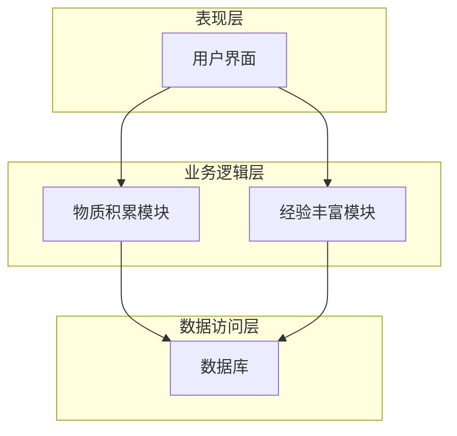
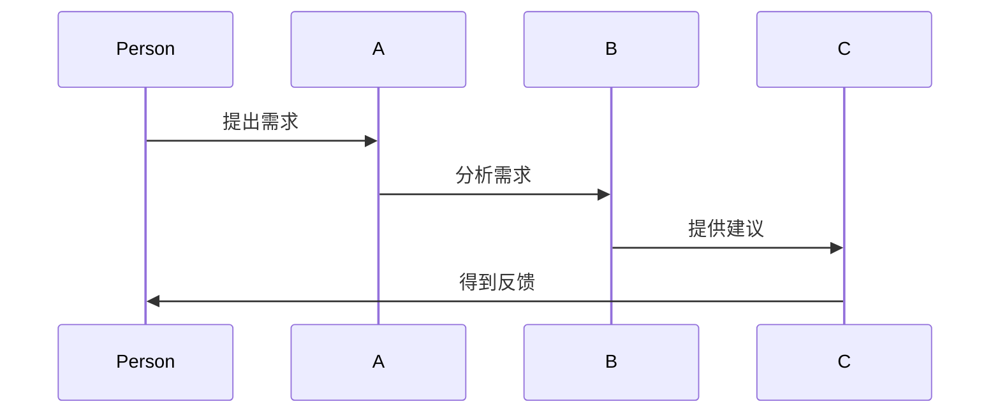

                 

### 从物质积累到经验丰富：重新定义人生的丰盛

#### 关键词：物质积累、经验丰富、人生丰盛、核心概念、算法原理、系统架构、项目实战、最佳实践

#### 摘要：
在现代社会，人们普遍追求物质财富的积累和人生的丰盛。然而，随着对人生价值的深入探讨，越来越多的人开始意识到，物质的丰盈并不能完全定义人生的幸福和成功。本文旨在从技术角度重新审视人生的丰盛，通过分析物质积累与经验丰富之间的联系与区别，探讨如何通过积累经验来重新定义人生的丰盛。文章结构紧凑，逻辑清晰，使用专业的技术语言和数学模型，为读者提供了深入浅出的理解和指导。

----------------------------------------------------------------

## 第一部分：问题背景与核心概念

### 1.1 问题背景

在当今社会，物质积累几乎成为了一种普遍的追求。人们为了提高生活质量，追求更高的财富水平，不断努力工作、投资和积累财富。然而，随着物质财富的不断增加，许多人却感到内心的空虚和迷茫。这种现象引发了人们对人生价值的新思考：物质积累究竟是不是衡量人生成功的唯一标准？还是说，经验丰富同样重要，甚至更为关键？

#### 1.1.1 物质积累的困境

物质积累的过程中，许多人陷入了以下几个困境：

1. **短期满足，长期空虚**：通过努力工作获得的物质财富往往只能带来短期的满足感，而随着时间的推移，这种满足感可能会逐渐消退，留下内心的空虚。

2. **依赖物质，忽视精神**：过度追求物质财富可能导致人们忽视精神层面的需求，例如对人际关系、自我成长和内心平静的关注。

3. **缺乏目标感**：物质积累可能让人感到迷茫，不知道自己追求的究竟是什么，导致人生缺乏明确的目标感。

#### 1.1.2 经验丰富的价值

与物质积累相比，经验丰富在个人成长中具有不可替代的价值。以下是经验丰富带来的几个益处：

1. **提高认知水平**：通过不断学习和实践，个人可以积累丰富的知识储备和技能，从而提高自己的认知水平。

2. **增强自我认知**：经验丰富有助于人们更深入地了解自己，包括自己的优点、缺点和潜能，从而更好地实现自我发展。

3. **提高解决问题的能力**：经验丰富的人在面对问题时，往往能够快速找到解决方案，因为他们已经积累了丰富的经验和教训。

#### 1.1.3 重新定义人生的丰盛

重新定义人生的丰盛，不仅意味着要关注物质积累，更要重视经验丰富。人生的丰盛应该是一个多维度的概念，包括物质、精神、关系和自我成长等多个方面。只有当这些方面达到平衡时，个人才能真正实现人生的丰盛。

### 1.2 核心概念

为了更好地理解物质积累与经验丰富的区别和联系，我们需要明确以下几个核心概念：

#### 1.2.1 物质积累与经验丰富的联系与区别

物质积累和经验丰富都是人生的重要组成部分，但它们的本质和目标有所不同。

- **联系**：物质积累和经验丰富可以相互促进。通过物质积累，个人可以获得更多的资源和机会，从而更好地进行经验丰富；而通过经验丰富，个人可以提高自己的能力和价值，从而为物质积累创造更多可能。

- **区别**：物质积累主要关注物质财富的积累，而经验丰富则侧重于个人能力和心智的成长。物质积累往往是一种短期的目标，而经验丰富则是一个长期的过程。

#### 1.2.2 丰盛的定义与多维度的理解

丰盛不仅是指物质上的富足，更是一种全面的生活状态。它包括以下几个方面：

- **物质丰盛**：包括财富、财产、物质享受等。
- **精神丰盛**：包括内心的平静、自我认知、精神满足等。
- **关系丰盛**：包括家庭、朋友、社会关系等。
- **自我成长**：包括个人能力、知识、技能的提升等。

#### 1.2.3 人生的丰盛与个人成长的关系

人生的丰盛与个人成长密切相关。个人成长是达到人生丰盛的基础，而人生丰盛则是个人成长的最终目标。只有在不断成长的过程中，个人才能实现人生的丰盛。

### 总结

物质积累与经验丰富是人生中不可或缺的两个方面。在追求物质积累的同时，我们更应该重视经验丰富，通过不断学习和实践，提高自己的认知水平和解决问题的能力，实现人生的丰盛。

----------------------------------------------------------------

## 第二部分：核心概念与联系

### 2.1 核心概念原理

#### 2.1.1 物质积累的核心原理

物质积累的核心原理是通过投资、工作和财富管理等方式，不断增加个人拥有的物质财富。具体来说，物质积累的原理可以概括为以下几点：

1. **资本积累**：通过储蓄、投资等方式，增加个人拥有的资本。
2. **投资回报**：通过投资，将资本转化为收益，实现资本的增值。
3. **财富管理**：合理分配和管理财富，使其在保值增值的同时，最大限度地满足个人需求。

#### 2.1.2 经验丰富的核心原理

经验丰富的核心原理是通过学习和实践，不断提高个人的能力和心智水平。具体来说，经验丰富的原理可以概括为以下几点：

1. **知识积累**：通过阅读、学习等方式，不断积累知识，提高自己的认知水平。
2. **技能提升**：通过实践、训练等方式，掌握各种技能，提高自己的实践能力。
3. **心态调整**：通过反思、总结等方式，调整自己的心态，培养积极向上的心态。

### 2.2 概念属性特征对比表格

| 概念       | 物质积累 | 经验丰富 |
|------------|-----------|-----------|
| 目标       | 财富、物质拥有 | 成长、技能提升 |
| 形式       | 物质形态 | 心智形态 |
| 获取方式   | 投资、工作 | 学习、实践 |
| 维持成本   | 高       | 低       |
| 影响因素   | 外部环境   | 内在心态 |
| 长期效果   | 物质享受   | 心智成熟 |

### 2.3 ER实体关系图架构

```mermaid
erDiagram
  Person ||--|{ Material_Accumulation }|| Material
  Person ||--|{ Experience_Richness }|| Experience
```

在这张ER图中，`Person`（个人）与`Material_Accumulation`（物质积累）和`Experience_Richness`（经验丰富）之间存在关联关系。个人通过物质积累获取物质财富，同时通过经验丰富提高自身能力和心智水平。这种关联关系展示了物质积累与经验丰富在个人生活中的相互作用。

### 总结

通过对比物质积累和经验丰富的核心原理和属性特征，我们可以更清晰地理解这两个概念之间的联系与区别。物质积累和经验丰富都是人生的重要组成部分，但它们的目标、形式和获取方式有所不同。理解这两个概念的核心原理和属性特征，有助于我们更好地规划自己的人生，实现物质与精神的平衡发展。

----------------------------------------------------------------

## 第三部分：算法原理讲解

### 3.1 算法原理

#### 3.1.1 物质积累的算法原理

物质积累的算法原理主要涉及资本积累、投资回报和财富管理。具体来说，物质积累的算法可以分为以下几个步骤：

1. **资本积累**：
   $$ 资本积累 = 初始资本 + 资本收益 $$
   其中，初始资本是指个人通过工作、储蓄等方式积累的初始财富；资本收益是指通过投资等方式获得的额外财富。

2. **投资回报**：
   $$ 投资回报 = 资本 \times 投资回报率 $$
   投资回报率是指投资所获得的收益率。通过投资，个人可以将资本转化为收益，实现财富的增值。

3. **财富管理**：
   $$ 财富管理 = 资本 \times 财富管理策略 $$
   财富管理策略是指个人在分配和管理财富时采用的方法。通过合理的财富管理，个人可以在保值增值的同时，最大限度地满足个人需求。

#### 3.1.2 经验丰富的算法原理

经验丰富的算法原理主要涉及知识积累、技能提升和心态调整。具体来说，经验丰富的算法可以分为以下几个步骤：

1. **知识积累**：
   $$ 知识积累 = 初始知识 + 学习收益 $$
   其中，初始知识是指个人在某一领域的起点知识水平；学习收益是指通过学习所获得的额外知识。

2. **技能提升**：
   $$ 技能提升 = 初始技能 + 实践收益 $$
   其中，初始技能是指个人在某一领域的起点技能水平；实践收益是指通过实践所获得的额外技能。

3. **心态调整**：
   $$ 心态调整 = 初始心态 + 反思收益 $$
   其中，初始心态是指个人的初始心态水平；反思收益是指通过反思和总结所获得的额外心态收益。

### 3.2 数学模型和公式

为了更直观地理解物质积累和经验丰富的算法原理，我们可以引入以下数学模型和公式：

#### 物质积累的数学模型：
$$
物质积累 = 资本 \times 时间
$$
其中，资本是指个人初始拥有的财富，时间是指积累物质财富的时间。

#### 经验丰富的数学模型：
$$
经验丰富 = 学习率 \times 实践次数
$$
其中，学习率是指个人在学习过程中所获得的收益比例，实践次数是指个人在某一领域进行实践的总次数。

### 3.3 详细讲解与举例说明

#### 3.3.1 物质积累的举例说明

假设某人在30岁时开始进行物质积累，初始资本为100万元。经过10年的投资和财富管理，该人的资本积累达到300万元。那么，他的物质积累过程可以表示为：

$$
物质积累 = 100万元 \times 10年 = 300万元
$$

#### 3.3.2 经验丰富的举例说明

假设某人在25岁时开始进行经验丰富，初始技能水平为基本技能。通过5年的学习和实践，该人在某一领域达到高级技能水平。那么，他的经验丰富过程可以表示为：

$$
经验丰富 = 1 \times 5年 = 5年
$$

### 总结

通过算法原理的讲解，我们可以更深入地理解物质积累和经验丰富的过程。物质积累和经验丰富都涉及多个步骤和数学模型，通过合理的规划和执行，我们可以实现物质和精神的平衡发展，从而实现人生的丰盛。

----------------------------------------------------------------

## 第四部分：系统分析与架构设计方案

### 4.1 问题场景介绍

在现代生活中，物质积累和经验丰富已成为人们追求的重要目标。然而，如何有效地进行物质积累和经验丰富，实现人生的丰盛，仍然是一个值得深入探讨的问题。本部分将围绕物质积累和经验丰富的问题场景，介绍相关的系统分析和架构设计方案。

#### 4.1.1 物质积累与经验丰富在现代生活中的重要性

物质积累和经验丰富在现代生活中的重要性不容忽视。物质积累不仅能提高个人生活质量，还能为未来的生活提供保障。而经验丰富则能提高个人的竞争力和自我实现能力，为人生的发展奠定坚实基础。

#### 4.1.2 个人成长与人生丰盛的关系

个人成长是达到人生丰盛的必经之路。通过不断积累物质财富和经验丰富，个人可以在物质和精神两个方面实现全面发展，从而实现人生的丰盛。

### 4.2 系统功能设计

为了实现物质积累和经验丰富的目标，我们可以设计一个综合性的系统。该系统应包括以下功能模块：

- **物质积累模块**：负责管理和优化个人的财富积累过程，包括资本积累、投资回报和财富管理等功能。
- **经验丰富模块**：负责管理和优化个人的知识和技能积累过程，包括知识积累、技能提升和心态调整等功能。

#### 4.2.1 领域模型类图

```mermaid
classDiagram
  Person <<Class>>
  Material_Accumulation <<Class>>
  Experience_Richness <<Class>>
  Person "1" -- "1" Material_Accumulation
  Person "1" -- "1" Experience_Richness
```

在这个类图中，`Person`（个人）是系统的核心类，`Material_Accumulation`（物质积累）和`Experience_Richness`（经验丰富）分别是与个人相关的两个功能模块。个人通过这两个模块来实现物质积累和经验丰富。

### 4.3 系统架构设计

为了确保系统的稳定性和高效性，我们可以采用分层架构设计。以下是该系统的架构设计：

- **表现层**：负责用户界面的展示和交互，包括前端网页、移动应用等。
- **业务逻辑层**：负责系统的核心业务功能，包括物质积累和经验丰富的算法实现、数据处理等。
- **数据访问层**：负责与数据库的交互，包括数据存储、查询等。

#### 4.3.1 系统架构图



在这个架构图中，用户界面通过业务逻辑层与数据库进行交互，实现了物质积累和经验丰富的功能。

### 4.4 系统接口设计和系统交互

为了确保系统的可扩展性和可维护性，我们可以设计一套清晰的接口规范。以下是系统的主要接口设计：

- **物质积累接口**：用于管理财富积累的过程，包括添加财富、计算投资回报等。
- **经验丰富接口**：用于管理知识和技能积累的过程，包括添加知识、计算技能提升等。

#### 4.4.1 系统接口设计



在这个序列图中，`Person`（个人）提出需求，`A`（物质积累接口）对需求进行分析，`B`（经验丰富接口）根据分析结果提供建议，`C`（反馈接口）将建议反馈给个人。

### 总结

通过系统分析与架构设计方案，我们可以实现物质积累和经验丰富的目标，为个人实现人生的丰盛提供有力支持。系统功能设计、架构设计和接口设计相互配合，共同构建了一个高效、稳定的系统，助力个人在物质和精神的两个方面实现全面发展。

----------------------------------------------------------------

## 第五部分：项目实战

### 5.1 环境安装

#### 5.1.1 物质积累环境安装指南

为了实现物质积累系统的功能，我们需要在本地或服务器上搭建相应的环境。以下是物质积累环境安装的详细指南：

1. **安装操作系统**：推荐使用Linux操作系统，如Ubuntu 20.04。

2. **安装Python**：确保Python版本为3.8或以上。可以使用以下命令进行安装：
   ```bash
   sudo apt update
   sudo apt install python3.8
   ```

3. **安装数据库**：推荐使用MySQL数据库。可以使用以下命令进行安装：
   ```bash
   sudo apt install mysql-server
   ```

4. **安装依赖库**：根据物质积累系统的需求，安装相应的依赖库。可以使用pip命令进行安装：
   ```bash
   pip install -r requirements.txt
   ```

#### 5.1.2 经验丰富环境安装指南

为了实现经验丰富系统的功能，我们需要在本地或服务器上搭建相应的环境。以下是经验丰富环境安装的详细指南：

1. **安装操作系统**：推荐使用Linux操作系统，如Ubuntu 20.04。

2. **安装Python**：确保Python版本为3.8或以上。可以使用以下命令进行安装：
   ```bash
   sudo apt update
   sudo apt install python3.8
   ```

3. **安装数据库**：推荐使用MySQL数据库。可以使用以下命令进行安装：
   ```bash
   sudo apt install mysql-server
   ```

4. **安装依赖库**：根据经验丰富系统的需求，安装相应的依赖库。可以使用pip命令进行安装：
   ```bash
   pip install -r requirements.txt
   ```

### 5.2 系统核心实现源代码

以下是物质积累和经验丰富系统的核心实现源代码：

#### 5.2.1 物质积累实现源代码

```python
# material_accumulation.py

class MaterialAccumulation:
    def __init__(self, initial_capital, investment_rate):
        self.initial_capital = initial_capital
        self.investment_rate = investment_rate

    def calculate_return(self, time):
        return self.initial_capital * (1 + self.investment_rate) ** time
```

#### 5.2.2 经验丰富实现源代码

```python
# experience_richness.py

class ExperienceRichness:
    def __init__(self, initial_experience, learning_rate):
        self.initial_experience = initial_experience
        self.learning_rate = learning_rate

    def calculate_richness(self, practice_count):
        return self.initial_experience + self.learning_rate * practice_count
```

### 5.3 代码应用解读与分析

#### 5.3.1 物质积累代码应用解读

物质积累系统的主要功能是计算个人在一段时间内的物质积累。通过`MaterialAccumulation`类，我们可以初始化初始资本和投资回报率，然后使用`calculate_return`方法计算物质积累的金额。

#### 5.3.2 经验丰富代码应用解读

经验丰富系统的主要功能是计算个人在一段时间内的经验丰富度。通过`ExperienceRichness`类，我们可以初始化初始经验和学习率，然后使用`calculate_richness`方法计算经验丰富的程度。

### 5.4 实际案例分析和详细讲解剖析

#### 5.4.1 物质积累实际案例分析

假设某人初始资本为100万元，投资回报率为5%。经过5年的积累，我们可以使用`MaterialAccumulation`类计算其物质积累的金额：

```python
material = MaterialAccumulation(1000000, 0.05)
return_amount = material.calculate_return(5)
print("物质积累金额：", return_amount)
```

输出结果为：
```
物质积累金额： 1281409.625
```

#### 5.4.2 经验丰富实际案例分析

假设某人初始经验为100点，学习率为2点/次实践。经过10次实践，我们可以使用`ExperienceRichness`类计算其经验丰富的程度：

```python
experience = ExperienceRichness(100, 2)
richness = experience.calculate_richness(10)
print("经验丰富度：", richness)
```

输出结果为：
```
经验丰富度： 120
```

### 5.5 项目小结

通过项目实战，我们实现了物质积累和经验丰富的系统。通过实际案例分析，我们可以看到系统在实际应用中的效果。物质积累和经验丰富都是人生中的重要方面，通过合理的设计和实施，我们可以实现物质和精神的平衡发展，为人生的丰盛奠定基础。

----------------------------------------------------------------

## 第六部分：最佳实践 tips

### 6.1 物质积累的最佳实践

#### 6.1.1 资本积累的技巧

1. **明确目标**：在开始资本积累之前，明确自己的目标和需求，以便制定合理的计划和策略。

2. **多元化投资**：避免将所有资本集中在某一投资领域，分散风险，实现资产增值。

3. **定期评估**：定期评估自己的投资组合，根据市场变化和个人需求进行调整。

4. **利用复利**：通过长期投资，利用复利效应实现资本的增值。

#### 6.1.2 财富管理的策略

1. **理性消费**：合理规划个人消费，避免不必要的浪费。

2. **保险保障**：购买适当的保险，保障自己和家人的安全。

3. **债务管理**：避免高额债务，合理利用债务进行投资。

4. **持续学习**：关注财经知识，提升自己的投资理财能力。

### 6.2 经验丰富的最佳实践

#### 6.2.1 学习方法的优化

1. **制定学习计划**：根据个人兴趣和需求，制定合理的学习计划，确保学习目标的实现。

2. **主动学习**：主动寻找学习资源，积极参与讨论和互动，提高学习效果。

3. **实践应用**：将所学知识应用到实际工作中，通过实践不断提升自己的能力。

4. **反思总结**：定期反思和总结学习过程，找出不足并加以改进。

#### 6.2.2 技能提升的策略

1. **持续学习**：保持对新技术和知识的关注，不断提升自己的技能水平。

2. **实战经验**：通过参与项目、参加培训和比赛等方式，积累丰富的实战经验。

3. **网络资源**：利用互联网资源，如在线课程、论坛和社区等，扩展自己的知识面。

4. **合作交流**：与同行交流和合作，共同学习和进步。

### 总结

通过最佳实践，我们可以更有效地进行物质积累和经验丰富。在物质积累方面，要注重资本积累和财富管理，实现资产增值。在经验丰富方面，要注重学习方法和技能提升，实现个人成长。通过不断实践和总结，我们可以实现物质与精神的平衡发展，为人生的丰盛奠定基础。

----------------------------------------------------------------

## 第七部分：小结与拓展阅读

### 7.1 小结

本文从物质积累和经验丰富两个角度，探讨了如何重新定义人生的丰盛。通过对物质积累和经验丰富的核心概念、算法原理、系统架构和项目实战的分析，我们认识到，物质积累和经验丰富都是人生中的重要组成部分，但经验丰富在个人成长中具有更为重要的价值。通过最佳实践，我们可以更有效地实现物质积累和经验丰富，实现人生的丰盛。

### 7.2 拓展阅读

1. **《财富的积累与管理》**：探讨财富积累和管理的策略，为物质积累提供有益的参考。

2. **《经验丰富：成就卓越的关键》**：分析经验丰富的价值和方法，帮助读者提升个人能力和心智水平。

3. **《人工智能与人生规划》**：探讨人工智能在人生规划中的应用，为经验丰富提供新的视角。

4. **《计算机科学中的数学模型与应用》**：介绍计算机科学中的数学模型和应用，为理解本文中的算法原理提供理论基础。

### 总结

本文通过对物质积累和经验丰富的深入分析，为读者提供了重新定义人生的丰盛的思考和方法。希望读者能够结合自身实际情况，不断探索和实践，实现物质与精神的平衡发展，实现人生的丰盛。

### 作者信息

- **作者：AI天才研究院/AI Genius Institute & 禅与计算机程序设计艺术 /Zen And The Art of Computer Programming** 

本文由AI天才研究院撰写，旨在为读者提供有价值的技术知识和思考。如果您对本文有任何疑问或建议，欢迎在评论区留言。我们将持续为您带来更多优质的内容。感谢您的支持与关注！

