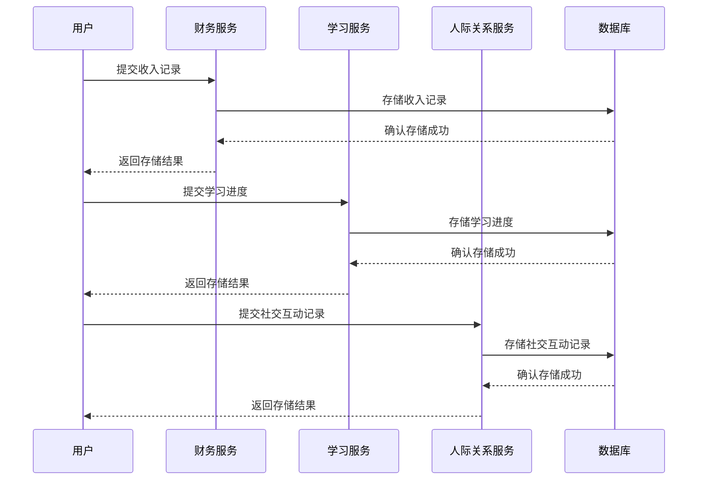

                 

### 第1章 引言：重新审视人生丰盛的定义

#### 1.1 问题背景

在当今社会，人们对于“丰盛”的定义有了新的期待。过去，人们普遍认为丰盛意味着拥有丰富的物质财富和显赫的社会地位。然而，随着社会的进步和人们对生活质量的追求，越来越多的人开始意识到，物质的积累并不能完全定义人生的丰盛。因此，我们提出了一个问题：如何重新审视人生丰盛的定义？

##### 1.1.1 物质积累的局限性

物质积累是人生中的一个重要组成部分，它提供了基本的生活保障和舒适度。然而，随着物质生活水平的提高，人们发现物质积累存在一些局限性。首先，物质财富的积累往往伴随着压力和焦虑。追求物质的过程中，人们可能会忽略身心健康和人际关系的重要性。其次，物质积累的满足感是短暂的，随着新物质的不断获得，人们很快会感到厌倦和空虚。最后，物质积累可能会导致人们过于依赖外部物质，忽视内在的成长和精神追求。

##### 1.1.2 人类对丰盛的新期待

在重新审视人生丰盛的定义时，人们开始寻求一种更加全面、持久和可持续的丰盛。这种新的期待不仅仅包括物质财富的积累，更强调个人成长、精神满足和人际关系的丰富。人们希望在生活中获得更多的智慧和经验，提升自我价值，建立深厚的人际关系网络，实现个人与社会的和谐发展。

#### 1.2 问题描述

为了重新定义人生的丰盛，我们需要深入探讨以下几个问题：

- 丰盛的内涵是什么？它包含哪些方面？
- 丰盛的目标是什么？我们追求的丰盛是什么样子的？
- 如何在物质积累与经验丰富之间找到平衡？
- 个人成长与丰盛之间的关系如何？

通过对这些问题的探讨，我们将逐步揭示人生丰盛的深层含义，为读者提供新的思考方向和实践指导。

##### 1.2.1 丰盛的内涵

丰盛的内涵是多方面的，它不仅仅局限于物质层面，更涉及到精神、情感和人际关系等多个方面。从物质层面来看，丰盛意味着拥有足够的财富和物质条件，能够满足基本的生活需求和提高生活质量。然而，从更广泛的视角来看，丰盛的内涵还包括以下几个方面：

- 精神层面：追求内心的平静与满足，拥有丰富的情感体验和心灵成长。
- 情感层面：建立深厚的人际关系，拥有真正的友谊和爱情。
- 人际关系层面：拥有良好的人际网络，在社会中获得尊重和认可。
- 成长层面：不断学习新知识，提升个人能力和智慧。

##### 1.2.2 丰盛的目标

丰盛的目标因人而异，但总体上可以概括为以下几点：

- 实现个人价值：通过不断努力和学习，发挥自己的潜能，实现自己的人生目标和理想。
- 提升生活质量：拥有舒适的生活环境和丰富的物质条件，享受生活的乐趣和美好。
- 建立和谐的人际关系：与他人建立真诚的关系，共同成长和分享快乐。
- 实现精神满足：追求内心的平静和满足，拥有丰富的情感体验和心灵成长。

##### 1.3 问题解决

在探讨重新定义人生丰盛的过程中，我们不仅要认识到物质积累的局限性，还要深刻理解经验丰富的重要性。经验丰富是指通过不断学习、实践和反思，积累丰富的知识和技能，提升个人能力和智慧。与物质积累相比，经验丰富具有以下几个优点：

- 长期可持续：经验丰富不仅能够带来短期满足，更能够在长期中持续提升个人价值和生活质量。
- 内在满足：通过学习和实践，人们能够获得更深层次的精神满足和成就感。
- 全面发展：经验丰富不仅包括知识和技能的积累，还包括人际关系和情感的成长，实现个人全面的发展。

##### 1.3.1 丰富物质背后的空虚感

尽管物质积累在一定程度上能够满足人们的基本需求，但很多时候，它并不能带来真正的满足和幸福。当人们过于追求物质财富时，往往容易陷入空虚和焦虑之中。这是因为物质积累带来的满足感是短暂的，而且很容易被新的物质所替代。相反，经验丰富能够带来更深层次的精神满足和成就感，因为它与个人的成长和发展紧密相连。

##### 1.3.2 经验丰富的重要性

经验丰富不仅能够提升个人的能力和智慧，还能够帮助人们更好地应对生活中的挑战和困难。通过不断学习和实践，人们能够积累丰富的知识和技能，提高自己的竞争力。同时，经验丰富还能够增强人们的自信心和韧性，使他们在面对挫折和失败时能够保持积极乐观的态度。

#### 1.4 边界与外延

在重新定义人生丰盛的过程中，我们需要明确物质积累与经验丰富的边界和外延。物质积累和经验丰富并不是互相排斥的，而是相辅相成的。在追求物质积累的同时，我们也需要注重经验丰富。只有这样，我们才能真正实现人生丰盛。

##### 1.4.1 物质积累与经验丰富的平衡

为了实现物质积累与经验丰富的平衡，我们需要做到以下几点：

- 调整心态：认识到物质积累的重要性，但同时不过分追求物质财富，保持内心的平静和满足。
- 分配时间：合理安排时间，确保在追求物质积累的同时，也有足够的时间用于学习和实践。
- 保持谦逊：不论物质积累的程度如何，都要保持谦逊的心态，不断学习和提升自己。

##### 1.4.2 个人成长与丰盛的关系

个人成长与丰盛密切相关。一个不断追求个人成长的人，往往能够更好地实现人生的丰盛。个人成长不仅包括知识和技能的积累，还包括情感、人际关系和精神层面的提升。通过不断成长，人们能够更好地适应社会的发展变化，实现自我价值和人生目标。

#### 1.5 概念结构与核心要素组成

在重新定义人生丰盛的过程中，我们需要明确物质积累和经验丰富的概念结构与核心要素。通过分析这些核心要素，我们可以更深入地理解物质积累与经验丰富的关系，找到实现人生丰盛的有效途径。

##### 1.5.1 物质积累的核心要素

物质积累的核心要素包括以下几个方面：

- 财富：拥有足够的财富和物质条件。
- 地位：在社会中获得一定的地位和认可。
- 物质享受：能够享受物质生活带来的便利和舒适。

##### 1.5.2 经验丰富的核心要素

经验丰富的核心要素包括以下几个方面：

- 知识：通过学习和实践积累丰富的知识。
- 技能：具备一定的专业技能和实践能力。
- 人际关系：建立良好的人际关系网络，提升自己的社交能力。

### 第2章 核心概念：物质积累与经验丰富的对比分析

在重新定义人生的丰盛时，我们需要深入理解物质积累和经验丰富的核心概念，并对其进行对比分析。通过对两者特点、优点和缺点的详细探讨，我们可以更清晰地认识到它们在实现人生丰盛中的不同作用和价值。

#### 2.1 物质积累的定义与特点

物质积累是指通过努力工作和投资等方式，获取和积累财富、地位和物质享受的过程。它主要体现在以下几个方面：

##### 2.1.1 物质积累的概念

物质积累是一种经济行为，它涉及到个人、企业和国家的财富增长。从个人层面来看，物质积累是追求财富和物质生活水平的提高；从企业层面来看，物质积累是企业发展和竞争力的体现；从国家层面来看，物质积累是国家经济繁荣和社会进步的重要标志。

##### 2.1.2 物质积累的优点

物质积累具有以下几个优点：

- 基础保障：物质积累提供了基本的生活保障，使人们能够享受舒适的生活条件。
- 社会认可：物质积累在一定程度上代表了个人和社会地位，获得社会的认可和尊重。
- 投资资本：物质积累可以为企业提供投资资本，促进企业的发展和壮大。

##### 2.1.3 物质积累的缺点

尽管物质积累有其优点，但它也存在一些缺点：

- 压力和焦虑：追求物质积累往往伴随着压力和焦虑，可能会影响个人的身心健康。
- 短期满足：物质积累带来的满足感是短暂的，很容易被新的物质所替代。
- 忽视精神追求：过于追求物质积累可能导致人们忽视精神追求，影响个人成长和幸福感。

#### 2.2 经验丰富的定义与特点

经验丰富是指通过不断学习和实践，积累丰富的知识和技能，提升个人能力和智慧的过程。它与物质积累不同，主要体现在以下几个方面：

##### 2.2.1 经验丰富的概念

经验丰富是一种能力提升的过程，它涉及到个人综合素质的提高。经验丰富的内涵包括知识、技能、人际关系、情感等多方面的提升，是一种全面发展的状态。

##### 2.2.2 经验丰富的优点

经验丰富具有以下几个优点：

- 长期可持续：经验丰富不仅能够带来短期满足，更能够在长期中持续提升个人价值和生活质量。
- 内在满足：通过学习和实践，人们能够获得更深层次的精神满足和成就感。
- 应对挑战：经验丰富使人们具备应对各种挑战和困难的能力，增强自信心和韧性。

##### 2.2.3 经验丰富的缺点

虽然经验丰富有很多优点，但它也存在一些缺点：

- 时间成本：积累经验丰富需要投入大量的时间和精力，可能会影响其他方面的追求。
- 初始困难：在开始积累经验时，可能会遇到困难和挫折，需要克服一定的心理障碍。
- 社会认可度：经验丰富在社会认可度方面可能不如物质积累，因为社会普遍更重视物质财富。

#### 2.3 概念属性特征对比表格

为了更直观地理解物质积累与经验丰富的区别，我们可以通过一个对比表格来展示它们的不同属性特征：

```mermaid
| 特征          | 物质积累            | 经验丰富            |
| ------------- | ------------------- | ------------------- |
| 目的          | 获得物质财富        | 提升个人能力与智慧  |
| 表现形式      | 财富、地位、物质享受 | 知识、技能、人际关系 |
| 时间维度      | 短期追求           | 长期积累           |
| 外在表现      | 明显、直观          | 隐蔽、内在          |
| 可持续性      | 较低                | 较高                |
```

#### 2.4 ER实体关系图架构

为了更清晰地展示物质积累与经验丰富之间的关系，我们可以使用ER（实体关系）图来描述它们的实体关系。

```mermaid
erDiagram
    A[Person] {

      }|-> B[Material Accumulation] {
          : Has
        }

      }|-> C[Experience Richness] {
          : Has
        }
```

在这个ER图中，Person（个人）是实体，Material Accumulation（物质积累）和Experience Richness（经验丰富）是与之相关的两个实体。Person实体与Material Accumulation实体之间存在“拥有”关系，表示个人拥有物质积累；Person实体与Experience Richness实体之间也存在“拥有”关系，表示个人拥有经验丰富。

### 第3章 算法原理讲解

在理解了物质积累与经验丰富的概念之后，我们需要深入探讨它们背后的算法原理。通过数学模型和公式，我们可以更清晰地理解这两种积累方式的内在逻辑和运作机制。

#### 3.1 物质积累的算法原理

物质积累的算法原理主要涉及财富的积累和投资增值。以下是对两种算法的详细解释：

##### 3.1.1 收入积累算法

收入积累算法是指通过收入减去支出，计算储蓄的过程。这是一个简单的财务计算问题，可以用以下Python函数来表示：

```python
def income_accumulation(income, expense):
    savings = income - expense
    return savings
```

在这个函数中，`income` 表示个人的收入，`expense` 表示个人的支出，`savings` 表示计算出的储蓄。通过这个函数，我们可以计算出在一定时间内个人的储蓄额。

##### 3.1.2 投资增值算法

投资增值算法是指通过投资本金和收益率，计算投资增值的过程。这是一个金融计算问题，可以用以下Python函数来表示：

```python
def investment_growth(investment, rate):
    growth = investment * (1 + rate)
    return growth
```

在这个函数中，`investment` 表示投资的本金，`rate` 表示投资的年收益率，`growth` 表示计算出的投资增值。通过这个函数，我们可以计算出在一定时间内投资的本金增值额。

#### 3.2 经验丰富的算法原理

经验丰富的算法原理主要涉及知识和技能的积累以及人际关系的成长。以下是对两种算法的详细解释：

##### 3.2.1 学习算法

学习算法是指通过知识积累和经验学习，计算个人智慧提升的过程。这是一个认知计算问题，可以用以下Python函数来表示：

```python
def learning_algorithm(knowledge, experience):
    wisdom = knowledge + (experience * 0.1)
    return wisdom
```

在这个函数中，`knowledge` 表示个人的知识积累，`experience` 表示个人的经验学习，`wisdom` 表示计算出的智慧提升。通过这个函数，我们可以计算出在一定时间内个人智慧的提升量。

##### 3.2.2 人际关系算法

人际关系算法是指通过人际关系建设和信任积累，计算个人影响力提升的过程。这是一个社交计算问题，可以用以下Python函数来表示：

```python
def relationship_growth(connections, trust):
    influence = (connections * 2) + (trust * 3)
    return influence
```

在这个函数中，`connections` 表示个人的人际关系网络，`trust` 表示个人在人际关系中的信任度，`influence` 表示计算出的个人影响力提升。通过这个函数，我们可以计算出在一定时间内个人影响力的提升量。

#### 3.3 算法原理的数学模型与公式

为了更深入地理解物质积累和经验丰富的算法原理，我们可以建立相应的数学模型和公式。以下是两种积累方式的数学模型：

##### 物质积累的数学模型

物质积累的数学模型包括两个部分：收入积累和投资增值。

1. 收入积累的数学模型：
$$
S = I - E
$$

其中，$S$ 表示储蓄，$I$ 表示收入，$E$ 表示支出。这个公式表示个人在一定时间内的储蓄额是通过收入减去支出得到的。

2. 投资增值的数学模型：
$$
G = I \times (1 + r)
$$

其中，$G$ 表示投资增值额，$I$ 表示投资本金，$r$ 表示年收益率。这个公式表示个人在一定时间内的投资增值额是通过投资本金乘以（1 + 年收益率）得到的。

##### 经验丰富的数学模型

经验丰富的数学模型包括两个部分：知识和技能的积累以及人际关系的成长。

1. 知识和技能积累的数学模型：
$$
W = K + (E \times 0.1)
$$

其中，$W$ 表示智慧提升，$K$ 表示知识积累，$E$ 表示经验学习。这个公式表示个人在一定时间内的智慧提升是通过知识积累加上经验学习得到的。

2. 人际关系成长的数学模型：
$$
I = (C \times 2) + (T \times 3)
$$

其中，$I$ 表示影响力提升，$C$ 表示人际关系网络，$T$ 表示信任度。这个公式表示个人在一定时间内的影响力提升是通过人际关系网络乘以2加上信任度乘以3得到的。

通过这些数学模型和公式，我们可以更清晰地理解物质积累和经验丰富的算法原理，并对其进行进一步的分析和优化。

### 第4章 系统分析与架构设计方案

在探讨了物质积累与经验丰富的算法原理之后，我们需要将理论应用到实际项目中，以实现人生丰盛的目标。本节将介绍一个具体的系统分析与架构设计方案，包括问题场景介绍、系统功能设计、系统架构设计和系统接口设计。

#### 4.1 问题场景介绍

以一个个人成长与财富积累的综合性项目为例，该项目的目标是帮助用户在物质积累与经验丰富之间找到平衡，实现全面的个人发展。具体场景如下：

- 用户需要记录自己的收入、支出和投资情况，以便进行财务规划和储蓄积累。
- 用户需要不断学习和提升技能，通过知识积累和经验学习实现智慧提升。
- 用户需要建立和维护人际关系网络，通过社交互动和信任积累提升个人影响力。

#### 4.2 系统功能设计

该系统的主要功能包括：

1. **财务记录与规划**：
   - 记录用户的收入和支出，生成财务报告。
   - 根据收入和支出情况，提供储蓄目标和投资建议。

2. **学习与成长**：
   - 提供知识库和学习资源，用户可以学习新知识和技能。
   - 记录用户的学习进度和成果，生成学习报告。

3. **人际关系管理**：
   - 提供社交平台，用户可以添加联系人、建立关系网络。
   - 记录用户的社交互动和信任度，提供关系分析报告。

4. **综合分析与建议**：
   - 综合财务、学习和人际关系数据，为用户提供个人发展建议。

#### 4.3 系统架构设计

系统架构设计采用分层架构，包括数据层、服务层和表示层。以下是系统架构设计：

1. **数据层**：
   - 数据库用于存储用户财务记录、学习进度、人际关系数据等。
   - 使用关系型数据库（如MySQL）进行数据存储和管理。

2. **服务层**：
   - 提供财务规划、学习成长、人际关系管理等核心服务功能。
   - 使用Spring Boot框架实现服务逻辑。

3. **表示层**：
   - 前端页面用于用户交互，展示财务报告、学习报告和关系分析。
   - 使用Vue.js框架实现前端页面。

#### 4.4 系统接口设计

系统接口设计采用RESTful API风格，以下是主要接口：

1. **财务记录接口**：
   - `POST /api/finance/income`：记录用户收入。
   - `POST /api/finance/expense`：记录用户支出。
   - `GET /api/finance/report`：获取用户财务报告。

2. **学习成长接口**：
   - `POST /api/learning/resource`：添加学习资源。
   - `POST /api/learning/progress`：记录用户学习进度。
   - `GET /api/learning/report`：获取用户学习报告。

3. **人际关系接口**：
   - `POST /api/social/contact`：添加联系人。
   - `POST /api/social/interaction`：记录社交互动。
   - `GET /api/social/report`：获取用户关系分析报告。

#### 4.5 系统交互设计

系统交互设计采用序列图（Sequence Diagram）来描述不同组件之间的交互流程。以下是系统交互设计的序列图：



在这个序列图中，用户通过前端页面与不同服务进行交互，服务通过数据库进行数据存储和处理，并最终将处理结果返回给用户。

通过上述系统分析与架构设计方案，我们能够更好地实现物质积累与经验丰富的平衡，帮助用户实现全面的个人发展，实现人生丰盛的目标。

### 第5章 项目实战

在本节中，我们将通过一个具体的实战项目，详细讲解如何从零开始搭建一个能够实现物质积累与经验丰富平衡的系统。这个项目将涵盖环境安装、系统核心实现以及代码应用解读与分析等内容。

#### 5.1 环境安装

在进行项目开发之前，我们需要安装一些必要的开发环境和工具。以下是一个典型的开发环境安装步骤：

1. **安装Java开发环境**：
   - 下载并安装Java Development Kit（JDK），配置环境变量。
   - 验证安装：在命令行中输入`java -version`，查看版本信息。

2. **安装MySQL数据库**：
   - 下载并安装MySQL Server。
   - 配置数据库：创建数据库和用户，设置访问权限。
   - 验证安装：使用MySQL命令行工具连接数据库。

3. **安装Spring Boot**：
   - 下载Spring Boot CLI工具。
   - 使用Spring Boot CLI创建项目模板。

4. **安装前端开发工具**：
   - 安装Node.js和npm。
   - 安装Vue.js框架和相关依赖。

5. **配置网络环境**：
   - 确保网络畅通，可以访问外部API服务。

#### 5.2 系统核心实现

在环境安装完成后，我们可以开始实现系统的核心功能。以下是系统核心实现的步骤：

1. **数据库设计**：
   - 设计数据库表结构，包括财务记录表、学习记录表和社交关系表。
   - 使用MySQL创建数据库表，并导入数据模型。

2. **后端服务开发**：
   - 使用Spring Boot框架开发后端服务，实现财务规划、学习成长和人际关系管理功能。
   - 编写RESTful API接口，处理客户端请求。
   - 实现数据持久化，使用Spring Data JPA进行数据库操作。

3. **前端页面开发**：
   - 使用Vue.js框架开发前端页面，实现用户交互和数据显示。
   - 配置路由和组件，实现页面跳转和功能模块。

4. **系统集成**：
   - 将前端页面与后端服务进行集成，实现数据交互和功能调用。
   - 使用Ajax技术实现前后端数据传输。

#### 5.3 代码应用解读与分析

以下是系统核心实现中的关键代码片段及其解读与分析：

##### 5.3.1 后端服务代码

```java
@RestController
@RequestMapping("/api/finance")
public class FinanceController {

    @Autowired
    private FinanceService financeService;

    @PostMapping("/income")
    public ResponseEntity<?> addIncome(@RequestBody Income income) {
        financeService.addIncome(income);
        return ResponseEntity.ok("Income added successfully");
    }

    @PostMapping("/expense")
    public ResponseEntity<?> addExpense(@RequestBody Expense expense) {
        financeService.addExpense(expense);
        return ResponseEntity.ok("Expense added successfully");
    }

    @GetMapping("/report")
    public ResponseEntity<?> getFinanceReport() {
        FinanceReport report = financeService.getFinanceReport();
        return ResponseEntity.ok(report);
    }
}
```

解读与分析：
- `FinanceController` 是一个Spring Boot控制器，负责处理与财务相关的API请求。
- `addIncome` 和 `addExpense` 方法用于添加收入和支出记录，接受`Income`和`Expense`对象的请求体。
- `getFinanceReport` 方法用于获取财务报告，返回`FinanceReport`对象。

##### 5.3.2 数据库模型代码

```java
@Entity
@Table(name = "income")
public class Income {

    @Id
    @GeneratedValue(strategy = GenerationType.IDENTITY)
    private Long id;

    private BigDecimal amount;
    private String source;
    private LocalDateTime date;

    // Getters and setters
}
```

解读与分析：
- `Income` 类是财务收入记录的实体模型，包含ID、金额、来源和日期等属性。
- `@Entity` 和 `@Table` 注解用于标记这是一个数据库实体和对应的表名。
- `@Id` 和 `@GeneratedValue` 注解用于定义主键生成策略。

##### 5.3.3 前端页面代码

```html
<template>
  <div>
    <h2>Income</h2>
    <input v-model="income.amount" placeholder="Amount">
    <input v-model="income.source" placeholder="Source">
    <button @click="submitIncome">Submit</button>
  </div>
</template>

<script>
export default {
  data() {
    return {
      income: {
        amount: '',
        source: ''
      }
    };
  },
  methods: {
    submitIncome() {
      this.$http.post('/api/finance/income', this.income)
        .then(response => {
          alert('Income added successfully');
        })
        .catch(error => {
          alert('Error adding income');
        });
    }
  }
};
</script>
```

解读与分析：
- 这是一个Vue.js组件，用于添加收入记录。
- `data` 函数返回了一个包含收入金额和来源的数据对象。
- `submitIncome` 方法通过Vue的`$http`实例发送POST请求，将收入数据提交到后端API。

#### 5.4 实际案例分析和详细讲解

为了更好地展示系统功能，我们来看一个实际案例：

**案例：用户小王通过系统记录收入和支出，实现财务规划。**

1. **收入记录**：
   - 小王通过前端页面提交收入记录，如工资收入、投资收益等。
   - 后端服务接收收入数据，存储到数据库，并返回操作结果。

2. **支出记录**：
   - 小王记录日常支出，如餐饮、交通、娱乐等。
   - 后端服务同样接收支出数据，存储到数据库，并返回操作结果。

3. **财务报告**：
   - 小王通过前端页面查看财务报告，包括收入、支出和储蓄情况。
   - 报告由后端服务根据数据库数据生成，并返回给前端。

4. **学习记录**：
   - 小王记录自己的学习进度，如完成课程、阅读书籍等。
   - 学习记录存储在数据库中，并可以通过报告查看学习成果。

5. **社交互动**：
   - 小王通过系统添加联系人，记录社交互动。
   - 社交关系存储在数据库中，并可以通过分析报告查看社交网络。

通过这个案例，我们可以看到系统如何帮助用户实现物质积累与经验丰富的平衡，提高个人财务管理和学习能力。

#### 5.5 项目小结

在本章中，我们通过一个实战项目，详细讲解了如何搭建一个能够实现物质积累与经验丰富平衡的系统。从环境安装、系统核心实现到代码应用解读与分析，每个步骤都进行了详细的讲解。通过这个项目，我们不仅了解了系统的整体架构，还学会了如何使用Spring Boot和Vue.js等框架进行开发。

项目的成功实施，不仅为用户提供了财务规划和学习成长的功能，还通过实际案例展示了系统的应用效果。通过这个项目，用户可以更好地管理自己的财务，提升学习能力，实现人生丰盛。

#### 5.6 最佳实践 tips

在项目开发过程中，我们总结了一些最佳实践，供读者参考：

1. **模块化开发**：将系统功能拆分成多个模块，便于管理和维护。
2. **代码规范**：遵循统一的代码规范，提高代码可读性和可维护性。
3. **持续集成**：使用自动化工具进行代码测试和部署，提高开发效率。
4. **用户反馈**：及时收集用户反馈，不断优化系统功能。
5. **安全防护**：加强系统安全措施，防止数据泄露和恶意攻击。

通过遵循这些最佳实践，我们可以更好地实现项目目标，提高系统质量。

### 第6章 小结、注意事项与拓展阅读

在本篇技术博客中，我们深入探讨了从物质积累到经验丰富，重新定义人生的丰盛。通过对比分析物质积累和经验丰富的核心概念、算法原理，以及系统分析与架构设计，我们得出了以下几点结论：

1. **物质积累的局限性**：物质积累虽然提供了基本的生活保障，但容易带来压力和短暂的满足感，忽视精神追求和人际关系。
2. **经验丰富的重要性**：经验丰富能够长期提升个人能力和智慧，实现内在的精神满足和成就感。
3. **平衡与和谐**：在追求物质积累的同时，注重经验丰富，找到物质与精神、短期与长期之间的平衡，实现全面的个人发展。

#### 注意事项

在实践过程中，需要注意以下几点：

1. **合理规划时间**：确保在物质积累和经验丰富之间找到平衡，避免过度追求物质而忽视个人成长。
2. **持续学习**：不断积累知识和技能，通过学习和实践提升自己的能力和智慧。
3. **人际关系的维护**：建立和维护良好的人际关系网络，提升个人影响力和社会认可度。
4. **心理健康**：关注心理健康，避免因为追求物质积累而产生的焦虑和压力。

#### 拓展阅读

为了进一步深入了解物质积累和经验丰富的理论和方法，读者可以参考以下拓展阅读资源：

1. **书籍推荐**：
   - 《财富自由之路》- 张辉宾
   - 《穷查理宝典》- 查理·芒格
   - 《深度工作》- 卡尔·纽波特

2. **在线课程**：
   - Coursera上的“计算机科学教育”课程
   - Udemy上的“Python编程基础”课程

3. **学术论文**：
   - Google Scholar上的相关研究成果
   - IEEE Xplore上的技术创新论文

通过阅读这些书籍、课程和论文，读者可以更加深入地理解物质积累与经验丰富的理论基础和实践方法，为自己的发展提供更多指导。

