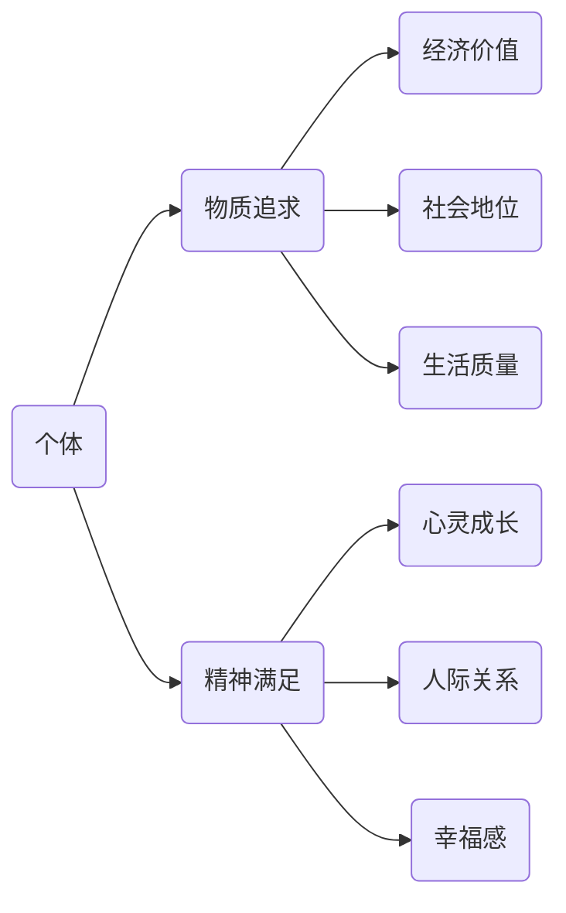

                 

# 从物质追求到心灵满足：现代人的价值观重构之路

> 关键词：价值观重构、物质追求、精神满足、心灵成长、社会进步

> 摘要：
在快速发展的现代社会中，人们对于物质生活的追求日益增强，然而这种追求背后所引发的价值观失衡和心灵缺失现象愈发显著。本文旨在探讨现代人从物质追求转向心灵满足的价值观重构之路，通过逻辑清晰、结构紧凑的分析，为读者提供一种新的思考维度和生活方式。本文将分为以下几个部分：

1. **引言与背景**：介绍现代人的价值观危机及其背景。
2. **核心概念与理论**：解释物质追求与精神满足的内涵，以及价值观重构的理论基础。
3. **实践指导**：探讨个体如何从物质追求转向精神满足。
4. **案例分析**：通过具体案例展示价值观重构的成功实践。
5. **文化与社会影响**：分析文化和社会因素对价值观重构的作用。
6. **结论与展望**：总结文章的主要观点，并对未来进行展望。
7. **附录与进一步阅读**：提供额外的资源和参考文献。

## 引言与背景

### 1.1 问题背景

在当今世界，物质财富的积累和技术进步的飞速发展，使得人们的生活水平得到了显著提高。然而，这种物质繁荣的背后，却隐藏着深刻的价值观危机。现代人在追求物质享受的过程中，往往忽视了精神层面的需求，导致了一系列社会问题，如心理健康问题、人际关系紧张、工作与生活的失衡等。

首先，物质追求带来的心理健康问题不容忽视。在现代社会中，人们为了追求更高的收入和更好的生活质量，常常承受着巨大的工作压力和竞争压力。这种高压状态导致许多人出现焦虑、抑郁等心理问题，严重影响了他们的生活质量和工作效率。

其次，物质追求往往导致人际关系紧张。在追求物质的过程中，人们往往会忽视与家人、朋友和同事的沟通和交流，导致人际关系变得疏离和紧张。此外，物质追求也容易引发人们之间的竞争和嫉妒，加剧了社会的不和谐。

最后，物质追求与生活失衡现象日益严重。在追求物质的过程中，人们往往忽视了生活的质量。工作压力、生活节奏的加快使得许多人陷入了“忙忙碌碌、无所作为”的困境，导致他们无法真正享受到生活的乐趣。

### 1.2 价值观的危机

价值观是人们对待事物和行为的根本观念，是指导个体行为和决策的内在准则。然而，在现代社会中，人们的价值观正面临着严重的危机。

首先，物质追求成为主导价值观。在现代社会中，物质财富的积累成为了人们追求的主要目标。人们把物质财富作为衡量个人成功和幸福的标准，忽视了精神层面的需求和成长。

其次，道德观念的淡化。在追求物质的过程中，许多人忽视了道德伦理的约束，导致了一系列道德沦丧和社会不公的现象。例如，贪污腐败、欺诈行为等。

最后，社会价值观的分裂。在现代社会中，不同群体之间的价值观存在显著差异。一些群体过于追求物质财富，而另一些群体则更注重精神追求和人际关系。这种价值观的分裂导致了社会的不和谐和不稳定。

### 1.3 价值重构的必要性

面对现代人的价值观危机，价值重构显得尤为重要。首先，价值重构有助于解决心理健康问题。通过调整价值观，人们可以更加关注精神层面的需求，减轻心理压力，提高生活质量。

其次，价值重构有助于改善人际关系。通过重新审视价值观，人们可以更加注重与家人、朋友和同事的沟通和交流，建立更加和谐的人际关系。

最后，价值重构有助于实现生活与工作的平衡。通过重新定义成功和幸福，人们可以更加关注生活的质量，实现工作与生活的和谐统一。

总之，现代人的价值观重构之路是一项长期而艰巨的任务，需要我们每个人都积极参与。通过自我反思和不断学习，我们可以逐步走出物质追求的陷阱，实现心灵满足和人生价值。

## 核心概念与理论

### 2.1 物质追求与精神满足

#### 物质追求

物质追求是指个体在物质层面上追求满足和幸福的过程。它通常表现为对财富、地位、物质享受的渴望和努力。物质追求是人类社会发展的原动力，推动了科技进步、经济增长和社会进步。然而，过度追求物质财富也会带来诸多负面影响，如心理压力、道德沦丧和社会不公。

#### 精神满足

精神满足则是指个体在精神层面上追求满足和幸福的过程。它通常表现为对知识、智慧、情感、道德、美感等方面的追求。精神满足是人类心灵成长的重要途径，能够提升个人的幸福感、生命质量和人际关系。

#### 物质追求与精神满足的关系

物质追求与精神满足之间存在紧密的联系和相互作用。一方面，物质追求可以为精神满足提供基础和支持。通过物质追求，个体可以获得更好的生活条件和资源，从而有更多的机会和时间去追求精神满足。

另一方面，精神满足可以促进物质追求的合理性和可持续性。当个体在精神层面上获得满足时，他们会更加理性地看待物质追求，减少盲目和过度的消费行为，从而实现物质追求与精神满足的平衡。

### 2.2 价值观重构的理论基础

#### 价值观的定义

价值观是指个体对待事物和行为的根本观念和评价标准。它是指导个体行为和决策的内在准则，反映了个体对生活、社会、道德等方面的认知和态度。

#### 价值观的形成

价值观的形成受多种因素影响，包括文化背景、家庭教育、社会环境、个人经历等。在现代社会中，随着科技发展和全球化进程，价值观的形成更加多元和复杂。

#### 价值观的分类

价值观可以分为物质价值观和精神价值观。物质价值观侧重于对物质财富的追求和积累，而精神价值观则侧重于对精神层面的追求和满足。

#### 价值观重构的必要性

面对现代社会的物质追求和精神缺失现象，价值观重构显得尤为重要。通过重构价值观，个体可以更加关注精神层面的需求，实现物质追求与精神满足的平衡，提高生活质量和幸福感。

### 2.3 物质价值与精神价值的比较分析

#### 物质价值

物质价值主要体现在以下几个方面：

1. **经济价值**：物质财富的积累可以带来经济上的安全感和满足感。
2. **社会地位**：物质财富的拥有程度可以影响个体在社会中的地位和声望。
3. **生活质量**：物质财富的积累可以提升个体的生活条件和舒适度。

#### 精神价值

精神价值主要体现在以下几个方面：

1. **心灵成长**：精神满足可以促进个体的心灵成长和自我实现。
2. **人际关系**：精神满足有助于建立和维护良好的人际关系。
3. **幸福感**：精神满足可以提高个体的幸福感和生活满意度。

#### 物质价值与精神价值的比较

1. **作用范围**：物质价值主要作用于经济和社会层面，而精神价值则作用于个体心灵层面。
2. **持久性**：物质价值具有一定的时效性，而精神价值则具有更持久的影响力。
3. **内在驱动**：物质价值主要源于外部驱动力，如社会期望和物质刺激；而精神价值主要源于内部驱动力，如个人兴趣、价值观和道德准则。

#### 平衡物质价值与精神价值

在现代社会中，平衡物质价值与精神价值至关重要。通过以下方式可以实现这一平衡：

1. **调整心态**：理性看待物质追求，不过度依赖物质财富。
2. **培养精神追求**：关注个人兴趣、爱好和价值观，提升精神层面的满足感。
3. **践行道德准则**：在追求物质财富的过程中，遵循道德规范，避免道德沦丧。

### 2.4 价值观重构的方法与实践

#### 自我反思

自我反思是价值观重构的重要步骤。通过反思自己的行为和观念，个体可以发现和认识自己的核心价值观，从而有针对性地进行调整和重构。

#### 增强精神追求

增强精神追求有助于实现物质追求与精神满足的平衡。个体可以通过学习、阅读、旅行、艺术创作等方式来丰富自己的精神世界，提升精神层面的满足感。

#### 培养人际关系

良好的人际关系是精神满足的重要来源。个体可以通过与家人、朋友、同事建立和保持良好关系，实现精神层面的满足。

#### 社会参与

积极参与社会活动可以提升个体的社会责任感和归属感，有助于实现物质追求与精神满足的平衡。

## 实践指导

### 3.1 个体如何从物质追求转向精神满足

#### 3.1.1 自我反思

个体可以从以下几个方面进行自我反思：

1. **价值观评估**：评估自己的价值观是否过于侧重物质追求，是否忽视了精神层面的需求。
2. **行为分析**：分析自己的行为是否符合自己的核心价值观，是否存在与价值观不一致的行为。
3. **情绪体验**：反思自己在追求物质财富的过程中是否感到快乐和满足，是否出现了心理压力和焦虑。

#### 3.1.2 增强精神追求

个体可以通过以下方式增强精神追求：

1. **学习新知识**：不断学习新知识，提升自己的认知水平和思维能力。
2. **培养兴趣爱好**：培养自己的兴趣爱好，丰富自己的精神世界。
3. **艺术创作**：参与艺术创作，表达自己的情感和思想。

#### 3.1.3 培养人际关系

个体可以通过以下方式培养人际关系：

1. **沟通技巧**：学习沟通技巧，提高自己与他人的沟通效果。
2. **付出与分享**：主动付出和分享，建立和维持良好的人际关系。
3. **同理心**：培养同理心，理解他人的需求和感受。

### 3.2 社会参与与价值观重构

#### 3.2.1 社会参与的意义

社会参与是指个体积极参与社会事务，为社会做出贡献的过程。社会参与对于价值观重构具有重要意义：

1. **提升社会责任感**：通过社会参与，个体可以更好地了解社会问题和需求，提升自己的社会责任感。
2. **增强归属感**：社会参与可以增强个体的社会归属感，使个体感受到自己的价值和存在意义。
3. **推动社会进步**：社会参与可以促进社会的进步和发展，实现个体与社会的共同成长。

#### 3.2.2 社会参与的途径

个体可以通过以下途径参与社会：

1. **志愿服务**：参与志愿服务，为有需要的人提供帮助。
2. **公益活动**：参与公益活动，关注社会公益事业。
3. **社会运动**：参与社会运动，推动社会变革和进步。

### 3.3 社会与制度的作用

#### 3.3.1 社会的引导作用

社会可以通过以下方式引导个体进行价值观重构：

1. **宣传教育**：通过媒体、教育等途径宣传和推广正确的价值观，引导个体树立正确的价值观。
2. **树立榜样**：通过树立榜样和典型，激励个体追求精神满足，抵制物质追求的诱惑。
3. **社会监督**：通过社会监督，对违反正确价值观的行为进行批评和纠正。

#### 3.3.2 制度的保障作用

制度对于价值观重构也具有重要作用：

1. **法律保障**：通过法律手段保障个体追求精神满足的权利，防止过度物质追求带来的负面影响。
2. **政策支持**：通过政策支持，鼓励和引导个体追求精神满足，提供必要的资源和条件。
3. **制度完善**：不断完善社会制度，消除物质追求带来的社会问题，为个体追求精神满足创造良好的环境。

## 案例分析

### 4.1 个人案例

#### 4.1.1 案例背景

小李是一位年轻的都市白领，工作繁忙，生活节奏快。他一直认为物质财富是衡量个人成功和幸福的标准，因此拼命工作，追求更高的收入和更好的生活质量。

然而，随着物质财富的积累，小李并没有感受到预期的幸福和满足。相反，他开始感到压力越来越大，心情越来越焦虑。在一次偶然的机会，他参加了一场关于心灵成长的讲座，开始重新审视自己的价值观。

#### 4.1.2 案例过程

小李开始从以下几个方面进行改变：

1. **自我反思**：小李通过写日记和思考，反思自己的行为和观念，认识到自己的价值观过于侧重物质追求，忽视了精神层面的需求。
2. **调整心态**：小李开始尝试调整自己的心态，不过度依赖物质财富，更加关注内心的需求和精神满足。
3. **增强精神追求**：小李培养了自己的兴趣爱好，如阅读、写作、绘画等，通过这些活动来丰富自己的精神世界。
4. **培养人际关系**：小李开始主动与家人、朋友和同事沟通，建立和维持良好的人际关系。
5. **社会参与**：小李参与了一些社会公益活动，如志愿服务、环保活动等，提升了自己的社会责任感和归属感。

#### 4.1.3 案例结果

经过一段时间的努力，小李的价值观发生了显著的变化。他不再过分追求物质财富，而是更加关注内心的需求和精神的满足。他的心理健康状况得到了改善，人际关系也变得更加和谐。小李开始享受生活，找到了内心的平静和满足。

### 4.2 社会案例

#### 4.2.1 案例背景

某城市在面临经济发展和环境污染的双重压力下，决定进行一场价值观重构运动，以实现经济与环境的可持续发展。

#### 4.2.2 案例过程

1. **宣传教育**：城市政府通过媒体、教育等途径宣传环保理念和可持续发展的重要性，引导市民树立正确的价值观。
2. **政策支持**：政府出台了一系列政策，如鼓励绿色出行、推广可再生能源等，为市民提供便利和支持。
3. **社会参与**：市民积极参与环保活动，如植树造林、垃圾分类等，共同为环境保护贡献力量。
4. **制度建设**：政府完善了环境保护制度，加强对环境污染的监管和处罚力度，确保环保政策的有效实施。

#### 4.2.3 案例结果

经过一段时间的努力，该城市的环保意识得到了显著提升，市民的生活方式也发生了改变。绿色出行、可再生能源使用等环保行为逐渐成为市民的自觉行动，环境污染问题得到了有效缓解。此外，城市政府还通过开展文化活动、社会公益活动等，进一步提升了市民的精神追求，实现了经济与环境的可持续发展。

### 4.3 案例总结

从以上案例可以看出，价值观重构需要从个人和社会两个层面进行。个人层面，个体需要通过自我反思、调整心态、增强精神追求、培养人际关系和社会参与等方式来实现价值观重构。社会层面，政府和社会组织需要通过宣传教育、政策支持、社会参与和制度建设等方式来引导和推动价值观重构。

通过个人和社会的共同努力，我们可以逐步实现从物质追求到精神满足的转变，提升生活质量和幸福感，实现个体的自我实现和社会的可持续发展。

## 文化与社会影响

### 5.1 文化因素对价值观重构的作用

文化是价值观的基石，对个体的思想、行为和社会结构产生深远影响。在价值观重构过程中，文化因素起着至关重要的作用。

首先，文化传统影响个体的价值观。不同文化背景下的价值观差异显著。例如，儒家文化强调“仁爱”、“中庸”，鼓励个体追求道德和精神层面的满足；而西方文化则更注重个人主义和物质追求。因此，在进行价值观重构时，个体需要审视和反思自身文化传统，找到合适的平衡点。

其次，文化价值观念影响社会的价值观导向。文化作为一种社会共识，对个体和社会的价值观形成和演变起着引导作用。例如，在现代社会中，随着消费主义的兴起，物质财富成为了衡量个人成功和幸福的主要标准。这种文化价值观念需要被重新审视和重构，以实现物质追求与精神满足的平衡。

### 5.2 社会因素对价值观重构的影响

社会因素也是影响价值观重构的重要因素。社会环境、社会关系和社会制度等都会对个体的价值观产生深刻影响。

首先，社会环境对个体的价值观重构起到引导作用。一个开放、包容、公平的社会环境有利于个体树立正确的价值观。例如，在一个倡导创新、尊重个性、鼓励多元化的社会环境中，个体更容易形成开放、包容、创新的价值观。

其次，社会关系对个体的价值观重构具有直接影响。个体在与家人、朋友和同事的互动中，不断调整和反思自己的价值观。例如，在一个和谐、互助的人际关系中，个体更容易培养感恩、尊重和关爱的价值观。

最后，社会制度对价值观重构起到保障作用。一个完善的社会制度可以为个体提供实现价值观重构的资源和条件。例如，通过法律保障公民的基本权益，通过教育培养公民的道德素质，通过政策鼓励社会参与和公益活动，社会制度可以促进个体实现价值观重构。

### 5.3 文化与社会因素相互影响

文化与社会因素相互影响，共同作用于价值观重构。一方面，文化传统和社会环境对个体的价值观产生影响；另一方面，个体的价值观也会反馈到文化和社会环境中，影响文化和社会的演变。

例如，在一个重视道德和精神追求的社会环境中，个体更容易形成正确的价值观，从而推动社会文化的进步。同时，个体的正确价值观也会反馈到社会环境中，促进社会对道德和精神追求的重视，形成良性循环。

总之，文化与社会因素对价值观重构具有深远影响。通过文化传承和社会变革，我们可以逐步实现价值观的重构，推动社会进步和个体幸福。

## 结论与展望

### 6.1 价值重构的必要性

在现代社会，物质追求与精神满足的失衡引发了诸多社会问题，如心理健康问题、人际关系紧张、生活与工作失衡等。因此，对现代人来说，价值重构是一项必要的任务，有助于解决这些问题，实现个体的心灵满足和社会的和谐发展。

### 6.2 价值重构的关键步骤

要实现价值重构，个体需要从以下几个方面入手：

1. **自我反思**：个体应不断反思自己的价值观，识别出过于依赖物质追求的行为和观念，调整心态，树立正确的价值观。
2. **增强精神追求**：个体应培养自己的兴趣爱好，提升精神层面的满足感，通过学习、阅读、艺术创作等方式丰富自己的精神世界。
3. **培养人际关系**：个体应注重与家人、朋友和同事的沟通和交流，建立和维护良好的人际关系，提升生活质量。
4. **社会参与**：个体应积极参与社会事务，关注社会问题，提升社会责任感和归属感，为社会进步贡献力量。

### 6.3 社会与制度的支持

社会与制度在价值重构过程中也发挥着重要作用。政府和社会组织应通过以下方式支持价值重构：

1. **宣传教育**：通过媒体、教育等途径宣传正确的价值观，引导个体树立正确的价值观。
2. **政策支持**：制定有利于价值重构的政策，如鼓励绿色出行、推广公益活动等，为个体提供实现价值观重构的资源和条件。
3. **制度建设**：完善社会制度，保障个体追求精神满足的权利，为个体实现价值观重构创造良好的环境。

### 6.4 未来展望

随着全球化和信息化进程的加快，人们对物质生活的追求将更加多样和个性化。在这一背景下，价值重构将变得越来越重要。通过不断调整和优化价值观，个体和社会可以实现可持续发展，共同迈向更加美好的未来。

总之，价值重构是现代人面对物质追求和精神缺失问题的必然选择。通过自我反思、增强精神追求、培养人际关系和社会参与，个体可以实现心灵满足和自我实现。同时，社会与制度的支持将为价值重构提供坚实的基础。让我们共同努力，走出物质追求的陷阱，迈向心灵满足的新时代。

## 附录与进一步阅读

### 附录

**附录A：核心概念术语说明**

- **物质追求**：个体在物质层面上追求满足和幸福的过程。
- **精神满足**：个体在精神层面上追求满足和幸福的过程。
- **价值观重构**：调整和优化个体的价值观，实现物质追求与精神满足的平衡。

**附录B：概念属性特征对比表格**

| 概念       | 物质追求               | 精神满足               |
|------------|------------------------|------------------------|
| 作用范围   | 经济和社会层面         | 心灵层面               |
| 持久性     | 具有一定的时效性       | 具有更持久的影响力     |
| 内在驱动   | 外部驱动力（如社会期望） | 内部驱动力（如个人兴趣） |

**附录C：ER实体关系图架构**

### 进一步阅读

- **《人类简史》**，作者：尤瓦尔·赫拉利。本书通过宏观的历史视角，探讨了人类文明的演变过程，对现代人的价值观重构具有一定的启示意义。
- **《理性演化：人类行为的心理学基础》**，作者：丹尼尔·卡尼曼。本书探讨了人类行为的心理学基础，对理解现代人的价值观失衡现象具有重要意义。
- **《安静：内向性格的竞争力》**，作者：苏珊·凯恩。本书探讨了内向性格的优势和竞争力，对个体培养精神满足、实现价值观重构具有指导作用。

通过阅读这些书籍，读者可以进一步了解现代人的价值观重构之路，找到适合自己的心灵满足之路。

## 作者信息

**作者：AI天才研究院/AI Genius Institute & 禅与计算机程序设计艺术 /Zen And The Art of Computer Programming**  
AI天才研究院致力于推动人工智能技术的发展和应用，禅与计算机程序设计艺术则强调计算机编程与心灵的和谐统一。本文旨在为读者提供一种全新的思考维度和生活方式，帮助现代人走出物质追求的陷阱，实现心灵满足和人生价值。

