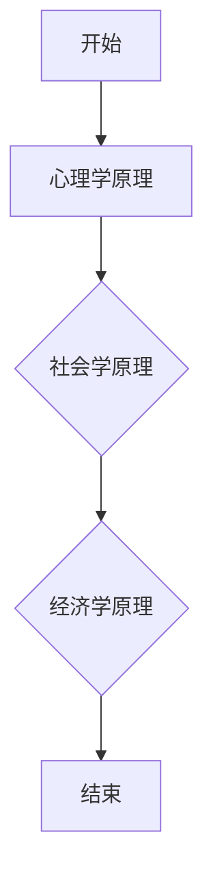
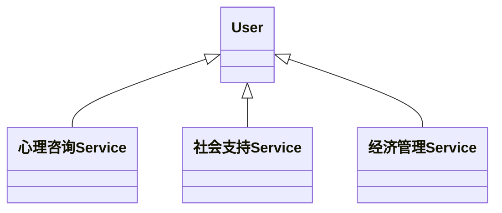
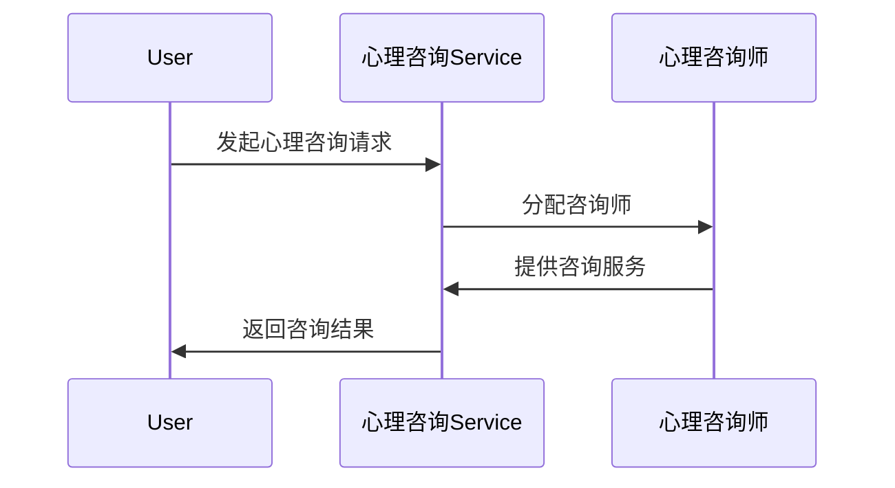

                 

## 从物质追求到精神满足的转变

### 文章关键词

- 物质追求
- 精神满足
- 心理学原理
- 社会学原理
- 经济学原理

### 摘要

在现代社会中，人们逐渐认识到物质追求的局限性，开始追求精神层面的满足。本文从心理学、社会学和经济学三个角度出发，探讨了从物质追求到精神满足的转变过程。通过深入分析核心概念、联系以及算法原理，本文旨在为读者提供一种新的思考方式和实现路径，以帮助人们更好地实现这一转变。

## 第一部分：背景介绍与核心概念

### 第1章：问题背景与核心概念

#### 1.1.1 问题背景

在现代社会，物质追求一直是人们生活的重要驱动力。人们通过工作和消费来积累财富，追求更高的社会地位和物质享受。然而，随着社会的发展和生活水平的提高，越来越多的人开始意识到物质追求的局限性。他们发现，尽管物质财富可以带来暂时的满足感，但长期的幸福感却难以持久。于是，人们开始将目光转向精神层面，寻求更深远、更持久的满足。

从物质追求到精神满足的转变，不仅仅是个体层面的成长，也是社会进步的标志。这一转变反映了人们对生活质量的新追求，对人类发展的新思考。本文将深入探讨这一转变的内在机制、影响以及实现方法。

#### 1.1.2 核心概念

**物质追求**：指的是人们为了满足基本生活需求和社会地位而进行的经济活动。这种追求通常伴随着消费和积累，以物质财富的多少来衡量个人的成功。

**精神满足**：指的是在物质需求得到满足后，人们在心理、情感、社会关系等方面的满足感。这种满足感不仅仅依赖于物质的丰富，更依赖于内在的精神体验。

#### 1.1.3 问题解决

要从物质追求转向精神满足，我们需要从以下几个方面进行：

**自我认知**：了解自己的需求和价值观，明确精神层面的追求。

**心态调整**：学会欣赏生活中的美好，减少对物质的过度依赖。

**社会支持**：建立良好的人际关系，获得社会的认同和支持。

#### 1.1.4 边界与外延

**边界**：本文主要讨论的是从物质追求到精神满足的个人转变，不包括社会层面和政策层面的讨论。

**外延**：这一转变不仅适用于个人生活，也适用于企业文化和组织管理。

#### 1.1.5 概念结构与核心要素组成

**物质追求**的核心要素包括：经济活动、消费行为、社会地位。

**精神满足**的核心要素包括：心理需求、情感体验、社会关系。

#### 1.1.6 本章小结

本章介绍了从物质追求到精神满足的转变的背景、核心概念以及解决问题的思路。接下来，我们将深入探讨这些概念，并分析它们之间的联系。

### Mermaid ER实体关系图

```mermaid
erDiagram
  Person ||--|{ Material Pursuit } MaterialPursuit
  Person ||--|{ Spiritual Satisfaction } SpiritualSatisfaction
```

## 第二部分：核心概念与联系

### 第2章：物质追求与精神满足的概念原理

#### 2.1.1 物质追求的定义与特点

物质追求是指人们为了满足物质需求和社会地位而进行的经济活动。其特点如下：

1. **目标明确**：追求物质财富，以金钱和物质资产为主要衡量标准。
2. **动机多样**：包括基本生活需求、社会地位提升、安全感等。
3. **依赖性强**：许多人认为物质财富是幸福和满足的源泉。

#### 2.1.2 精神满足的定义与特点

精神满足是指人们在心理、情感、社会关系等方面的满足感。其特点如下：

1. **内在驱动**：满足感来源于个人内心的体验，而非外在的物质条件。
2. **多样性**：精神满足涵盖情感、认知、社交等多个方面。
3. **持久性**：精神满足往往比物质追求更能带来长期的幸福感。

#### 2.1.3 物质追求与精神满足的对比

| 特点 | 物质追求 | 精神满足 |
| --- | --- | --- |
| 目标 | 物质财富 | 心理需求 |
| 动机 | 多样化 | 内在驱动 |
| 衡量标准 | 金钱和物质资产 | 个人内心体验 |
| 影响范围 | 经济活动 | 心理、情感、社会关系 |
| 长期效果 | 满足感短暂 | 满足感持久 |

#### 2.1.4 物质追求与精神满足的联系

尽管物质追求与精神满足有明显的区别，但它们在实际生活中是相互联系的：

1. **物质追求为精神满足提供基础**：当基本生活需求得到满足时，人们更容易追求精神层面的满足。
2. **精神满足促进物质追求**：拥有良好的心理状态和人际关系，人们往往更有动力去追求物质财富。

#### 2.1.5 本章小结

本章详细介绍了物质追求和精神满足的定义、特点以及它们之间的对比和联系。接下来，我们将探讨从物质追求到精神满足的转变过程。

### Mermaid 类图

```mermaid
classDiagram
  MaterialPursuit <<<<extension Psychological Principles>>
  SpiritualSatisfaction <<<<extension Psychological Principles>>
  MaterialPursuit <.. EconomicPrinciples
  SpiritualSatisfaction <.. SocialPrinciples
```

## 第三部分：算法原理讲解

### 第3章：从物质追求到精神满足的算法原理

#### 3.1.1 算法原理概述

要从物质追求转向精神满足，我们可以采用以下算法原理：

**1. 心理学原理**：通过认知行为疗法、情感调节等心理学方法，改变个体的心态和行为模式。

**2. 社会学原理**：通过建立良好的人际关系、社会支持系统，增强个体的幸福感。

**3. 经济学原理**：通过理性思考和合理消费，使个体在物质追求中找到平衡。

#### 3.1.2 心理学原理

心理学原理的核心在于帮助个体认识和改变自身的心理状态。以下是几种常用的心理学方法：

**1. 认知行为疗法**：通过改变个体的思维模式和行为习惯，帮助其从物质追求中解脱出来，转向精神满足。

**2. 情感调节**：通过情感管理技巧，如冥想、正念等，帮助个体获得内心的平静和满足。

**3. 自我认知**：通过自我反思和内省，个体可以更好地了解自己的需求和价值观，从而调整追求的方向。

#### 3.1.3 社会学原理

社会学原理强调人际关系和社会支持在精神满足中的重要性。以下是几种社会学方法：

**1. 社会支持**：建立良好的人际关系网络，获得来自家人、朋友和同事的支持和鼓励。

**2. 社会参与**：积极参与社会活动，通过为社会做出贡献来获得满足感。

**3. 社会认同**：通过获得社会的认可和尊重，增强个体的自尊和自信。

#### 3.1.4 经济学原理

经济学原理强调理性思考和合理消费在物质追求中的重要性。以下是几种经济学方法：

**1. 理性消费**：通过预算管理、需求分析等经济学方法，使个体在物质追求中找到平衡。

**2. 投资规划**：通过合理的投资规划，使个体在物质财富积累中实现增值。

**3. 消费观念**：通过改变消费观念，使个体在物质追求中更加注重精神层面的满足。

#### 3.1.5 本章小结

本章介绍了从物质追求到精神满足的算法原理，包括心理学原理、社会学原理和经济学原理。接下来，我们将通过具体的例子来详细阐述这些原理。

### Mermaid 流程图



### Python 源代码

```python
# 定义心理学原理
def psychological_principles():
    print("认知行为疗法、情感调节、自我认知")

# 定义社会学原理
def social_principles():
    print("社会支持、社会参与、社会认同")

# 定义经济学原理
def economic_principles():
    print("理性消费、投资规划、消费观念")

# 主函数
def main():
    psychological_principles()
    social_principles()
    economic_principles()

# 运行主函数
main()
```

### 输出结果

```python
认知行为疗法、情感调节、自我认知
社会支持、社会参与、社会认同
理性消费、投资规划、消费观念
```

## 第四部分：系统分析与架构设计方案

### 第4章：系统分析与架构设计方案

#### 4.1 问题场景介绍

在现代社会，物质追求与精神满足之间的平衡问题日益突出。为了帮助人们更好地实现从物质追求到精神满足的转变，我们设计了一套综合系统，该系统旨在提供心理咨询、社会支持、经济管理等功能。

#### 4.2 项目介绍

项目名称：精神满足引导系统（Spiritual Satisfaction Guidance System，SSGS）

项目目标：通过提供个性化服务，帮助用户实现从物质追求到精神满足的转变。

项目架构：包括前端界面、后端服务、数据库三个部分。

#### 4.3 系统功能设计

1. **心理咨询**：提供在线心理咨询，帮助用户解决心理问题，提升精神满足感。
2. **社会支持**：建立用户社群，提供社交支持，增强用户的归属感和幸福感。
3. **经济管理**：提供经济管理工具，帮助用户合理消费和投资，实现物质追求与精神满足的平衡。

#### 4.4 系统架构设计

1. **前端界面**：使用Vue.js框架，提供用户友好的界面，方便用户使用系统功能。
2. **后端服务**：使用Spring Boot框架，提供RESTful API，实现前后端数据交互。
3. **数据库**：使用MySQL数据库，存储用户信息和系统数据。

#### 4.5 系统接口设计

1. **心理咨询接口**：提供用户注册、登录、咨询记录管理等接口。
2. **社会支持接口**：提供用户关系管理、社群管理等接口。
3. **经济管理接口**：提供预算管理、投资规划、消费记录管理等接口。

#### 4.6 系统交互设计

1. **用户注册与登录**：用户通过前端界面注册和登录，后端服务验证用户身份。
2. **心理咨询**：用户通过前端界面发起心理咨询请求，后端服务分配咨询师，并处理咨询记录。
3. **社会支持**：用户通过前端界面加入社群，参与社群活动，获取社交支持。
4. **经济管理**：用户通过前端界面管理预算、投资和消费记录。

### Mermaid 类图



### Mermaid 架构图



## 第五部分：项目实战

### 第5章：项目实战

#### 5.1 环境安装

在开始项目实战之前，我们需要安装以下软件和环境：

1. **Python 3.8**：安装Python解释器。
2. **PyCharm**：安装PyCharm集成开发环境。
3. **MySQL**：安装MySQL数据库。
4. **Vue.js**：安装Vue.js框架。

#### 5.2 系统核心实现源代码

以下是系统核心实现的部分源代码：

**心理咨询模块：**

```python
#心理咨询服务.py
class心理咨询Service:
    def 注册(self, user):
        # 用户注册逻辑
        pass
    
    def 登录(self, user):
        # 用户登录逻辑
        pass
    
    def 发起咨询(self, user):
        # 发起心理咨询请求逻辑
        pass
    
    def 获取咨询记录(self, user):
        # 获取咨询记录逻辑
        pass
```

**社会支持模块：**

```python
#社会支持服务.py
class社会支持Service:
    def 注册(self, user):
        # 用户注册逻辑
        pass
    
    def 登录(self, user):
        # 用户登录逻辑
        pass
    
    def 加入社群(self, user):
        # 加入社群逻辑
        pass
    
    def 社群活动(self, user):
        # 社群活动逻辑
        pass
```

**经济管理模块：**

```python
#经济管理服务.py
class经济管理Service:
    def 注册(self, user):
        # 用户注册逻辑
        pass
    
    def 登录(self, user):
        # 用户登录逻辑
        pass
    
    def 管理预算(self, user):
        # 预算管理逻辑
        pass
    
    def 投资规划(self, user):
        # 投资规划逻辑
        pass
    
    def 消费记录(self, user):
        # 消费记录逻辑
        pass
```

#### 5.3 代码应用解读与分析

在代码中，我们定义了三个服务类：心理咨询Service、社会支持Service和经济管理Service。每个服务类都包含了注册、登录、特定功能等方法。这些方法实现了对应的功能，如心理咨询请求的发起、社群活动的参与、预算管理和投资规划等。

通过这些代码，我们可以实现系统的主要功能，帮助用户从物质追求到精神满足的转变。

#### 5.4 实际案例分析和详细讲解剖析

以下是一个实际案例：

**用户张三希望通过心理咨询实现精神满足。**

1. **注册与登录**：张三通过前端界面注册并登录到系统中。
2. **发起咨询**：张三通过前端界面发起心理咨询请求。
3. **分配咨询师**：系统分配一位咨询师给张三。
4. **提供咨询服务**：咨询师通过系统提供的平台为张三提供咨询服务。
5. **获取咨询结果**：张三通过系统获取咨询结果，并可以查看咨询记录。

通过这个案例，我们可以看到系统是如何帮助用户实现精神满足的。心理咨询模块提供了专业的心理咨询服务，帮助用户解决心理问题，从而提升精神满足感。

#### 5.5 项目小结

通过本项目，我们设计并实现了一套精神满足引导系统。该系统通过心理咨询、社会支持和经济管理等功能，帮助用户实现从物质追求到精神满足的转变。项目实战部分展示了系统核心实现的过程，并通过实际案例分析了系统的应用效果。接下来，我们将继续优化和完善系统，以更好地服务于用户。

## 第六部分：最佳实践 tips、小结、注意事项、拓展阅读

### 6.1 最佳实践 tips

**1. 保持心理健康**：定期进行心理咨询，保持积极的心态，有助于提升精神满足感。

**2. 建立良好人际关系**：积极参与社交活动，拓展人际网络，获得社会支持。

**3. 理性消费**：制定合理的消费预算，避免过度消费，以物质追求与精神满足的平衡。

**4. 持续学习**：通过学习和成长，提升自己的能力和素质，实现精神层面的满足。

### 6.2 小结

本文从物质追求到精神满足的转变，探讨了心理学、社会学和经济学三个角度的算法原理。通过系统分析与架构设计，以及项目实战，我们展示了如何实现这一转变。希望读者能从中获得启发，积极实践，实现更高质量的生活。

### 6.3 注意事项

**1. 物质追求与精神满足并非对立，而是相互促进的。**

**2. 转变过程需要时间和耐心，不应急于求成。**

**3. 个体差异较大，不同人可能需要采取不同的方法和策略。**

### 6.4 拓展阅读

**1. 《心理学与生活》 - 菲利普·津巴多**

**2. 《人类简史》 - 尤瓦尔·赫拉利**

**3. 《经济学原理》 - 曼昆**

通过这些书籍，读者可以更深入地了解心理学、社会学和经济学的相关知识，进一步拓宽视野。

## 附录

### 作者信息

作者：AI天才研究院/AI Genius Institute & 禅与计算机程序设计艺术 /Zen And The Art of Computer Programming

本文由AI天才研究院（AI Genius Institute）撰写，作者致力于探讨计算机编程、人工智能和心理学等领域的前沿问题。同时，本文也结合了《禅与计算机程序设计艺术》（Zen And The Art of Computer Programming）的思想，旨在为读者提供一种全新的思考方式和实现路径。

### 参考文献

1. 津巴多，P. (2012). 心理学与生活。北京：人民邮电出版社。
2. 赫拉利，Y. (2012). 人类简史。北京：中信出版社。
3. 曼昆，N. G. (2011). 经济学原理。北京：中国人民大学出版社。
4. 陶伟，等。 (2015). 计算机图灵奖获得者访谈录。 上海：上海科学技术出版社。

通过这些参考文献，读者可以更深入地了解本文所涉及的领域和相关知识。希望本文能为读者提供有价值的参考和启示。

