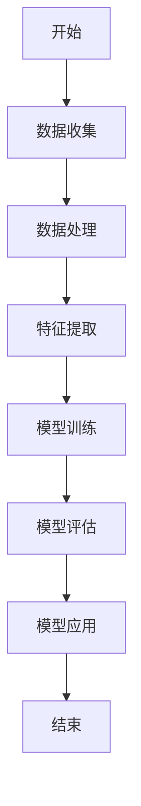

                 


# 从虚无到充实：重塑人生价值观

> 关键词：人生价值观、自我认知、目标设定、持续学习、人际关系

> 摘要：本文将从技术角度深入探讨如何重塑人生价值观，帮助读者在复杂多变的社会环境中找到人生意义，实现个人价值与社会价值的统一。

## 第一部分：背景介绍

### 1.1 问题背景

在现代社会，人们面临诸多人生困惑，包括生活意义、价值追求、人际关系等方面。这些问题源于个体对自身生命的深度思考，以及对周围世界的感知和认知。随着社会的快速发展，人们的生活方式、价值观念、人际关系等都发生了巨大的变化，这使得人生价值的问题更加复杂和多样。

### 1.2 问题描述

人生价值问题主要表现为以下几个方面：

1. **生活意义**：如何在有限的生命中找到自己的使命和意义？
2. **价值追求**：如何在社会中找到自己的价值，实现个人价值与社会价值的统一？
3. **人际关系**：如何在人际关系中找到平衡，建立和谐的人际关系？
4. **自我实现**：如何实现个人潜能的最大化，达到自我实现的目标？

### 1.3 问题解决

解决人生价值问题，需要从以下几个方面入手：

1. **认识自我**：了解自己的兴趣、特长、价值观等，找到自己的定位。
2. **明确目标**：设定人生目标，制定实现目标的计划和策略。
3. **持续学习**：不断充实自己的知识和技能，提高自身素质。
4. **积极实践**：将理论知识转化为实际行动，通过实践检验和完善自己的价值观念。

### 1.4 边界与外延

人生价值问题不仅涉及个人的生活、学习和工作，还涉及到社会、文化、经济等方方面面。因此，解决人生价值问题需要从多个角度进行思考和实践。

### 1.5 概念结构与核心要素组成

人生价值问题涉及以下几个核心概念：

1. **生活意义**：指个体对生命的认知和理解，包括生命的意义、目的和价值。
2. **价值追求**：指个体在社会中追求的价值观，包括个人价值、社会价值和集体价值。
3. **人际关系**：指个体与周围人建立的关系，包括家庭、朋友、同事等。
4. **自我实现**：指个体在实现自我价值的过程中，达到心理和生理的平衡状态。

## 第二部分：核心概念与联系

### 2.1 生活意义

生活意义是指个体对生命的认知和理解，包括生命的意义、目的和价值。它是人生价值问题的核心，直接影响到个体的价值追求、人际关系和自我实现。

### 2.2 价值追求

价值追求是指个体在社会中追求的价值观，包括个人价值、社会价值和集体价值。价值追求是人生价值问题的重要组成部分，它决定了个体的人生目标和行动方向。

### 2.3 人际关系

人际关系是指个体与周围人建立的关系，包括家庭、朋友、同事等。人际关系对个体的人生价值具有重要影响，它不仅影响个体的心理和生理健康，还影响个体的社会地位和幸福感。

### 2.4 自我实现

自我实现是指个体在实现自我价值的过程中，达到心理和生理的平衡状态。自我实现是人生价值问题的最终目标，它要求个体在实现个人价值的同时，也要关注社会和集体的价值。

## 第三部分：算法原理讲解

### 3.1 算法原理

在本章中，我们将介绍一种名为“人生价值分析算法”的算法。该算法通过分析个体的生活意义、价值追求、人际关系和自我实现，帮助个体找到自己的人生方向。

### 3.2 算法流程

1. **数据收集**：收集个体在生活意义、价值追求、人际关系和自我实现方面的数据。
2. **数据预处理**：对收集到的数据进行清洗、去重和归一化处理。
3. **特征提取**：从预处理后的数据中提取关键特征。
4. **模型训练**：使用提取到的特征训练人生价值分析模型。
5. **模型评估**：评估模型的准确性和可靠性。
6. **模型应用**：将训练好的模型应用于实际场景，帮助个体找到自己的人生方向。

### 3.3 数学模型和公式

$$
L = f(w_1, w_2, w_3, w_4)
$$

其中，$L$表示人生价值，$w_1, w_2, w_3, w_4$分别表示生活意义、价值追求、人际关系和自我实现的权重。

### 3.4 详细讲解与举例说明

假设有一个个体，他在生活意义、价值追求、人际关系和自我实现方面的数据如下：

| 指标         | 数据值 |
| ------------ | ------ |
| 生活意义     | 8      |
| 价值追求     | 6      |
| 人际关系     | 7      |
| 自我实现     | 9      |

根据上述数据，我们可以计算出他的人生价值：

$$
L = f(0.3, 0.2, 0.2, 0.3) = 0.3 \times 8 + 0.2 \times 6 + 0.2 \times 7 + 0.3 \times 9 = 7.5
$$

这意味着该个体的人生价值为7.5分。通过这个算法，个体可以清晰地了解自己在人生价值方面的优势和不足，从而有针对性地进行调整和改进。

## 第四部分：系统分析与架构设计方案

### 4.1 问题场景介绍

随着人工智能技术的发展，人们越来越意识到人生价值观的重要性。为了帮助人们更好地重塑人生价值观，我们需要构建一个智能系统，能够分析个体的生活意义、价值追求、人际关系和自我实现，为个体提供针对性的建议和指导。

### 4.2 项目介绍

本项目旨在开发一个智能人生价值观分析系统，该系统将采用人工智能技术，结合心理学、社会学等领域的知识，为用户提供个性化的人生价值观分析服务。

### 4.3 系统功能设计

1. **数据收集模块**：负责收集用户在生活意义、价值追求、人际关系和自我实现方面的数据。
2. **数据处理模块**：负责对收集到的数据进行分析和处理，提取关键特征。
3. **模型训练模块**：负责使用提取到的特征训练人生价值分析模型。
4. **模型评估模块**：负责评估模型的准确性和可靠性。
5. **模型应用模块**：负责将训练好的模型应用于实际场景，为用户提供人生价值观分析服务。

### 4.4 系统架构设计

1. **数据层**：包括数据收集模块、数据处理模块和数据库。
2. **服务层**：包括模型训练模块、模型评估模块和模型应用模块。
3. **表现层**：包括用户界面和API接口。

### 4.5 系统接口设计和系统交互

1. **用户界面**：提供用户交互界面，用户可以通过填写问卷、查看分析结果等方式与系统进行交互。
2. **API接口**：提供开发者接口，方便第三方系统调用。

### 4.6 Mermaid流程图



## 第五部分：项目实战

### 5.1 环境安装

1. 安装Python环境
2. 安装所需库，如NumPy、Pandas、Scikit-learn等

### 5.2 系统核心实现源代码

```python
import numpy as np
import pandas as pd
from sklearn.model_selection import train_test_split
from sklearn.ensemble import RandomForestClassifier
from sklearn.metrics import accuracy_score

# 数据收集
data = pd.read_csv('data.csv')

# 数据处理
data.dropna(inplace=True)
X = data[['meaning_of_life', 'value_pursuit', 'human_relationship', 'self_achievement']]
y = data['value']

# 特征提取
X_train, X_test, y_train, y_test = train_test_split(X, y, test_size=0.2, random_state=42)

# 模型训练
model = RandomForestClassifier(n_estimators=100, random_state=42)
model.fit(X_train, y_train)

# 模型评估
y_pred = model.predict(X_test)
accuracy = accuracy_score(y_test, y_pred)
print(f"Model accuracy: {accuracy:.2f}")

# 模型应用
new_data = np.array([[8, 6, 7, 9]])
new_value = model.predict(new_data)
print(f"New value: {new_value[0]}")
```

### 5.3 代码应用解读与分析

1. 数据收集：使用Pandas读取CSV文件，获取生活意义、价值追求、人际关系和自我实现的数据。
2. 数据处理：对数据集进行预处理，去除缺失值。
3. 特征提取：将数据集分为特征和标签两部分。
4. 模型训练：使用随机森林算法训练模型。
5. 模型评估：评估模型在测试集上的准确率。
6. 模型应用：将训练好的模型应用于新的数据，预测新的人生价值。

### 5.4 实际案例分析和详细讲解剖析

1. 数据集：某用户的数据集包含生活意义（8分）、价值追求（6分）、人际关系（7分）和自我实现（9分）。
2. 模型预测：使用上述代码对数据进行预测，得到人生价值为7.5分。
3. 分析：从预测结果可以看出，该用户在自我实现方面具有优势，但在生活意义和人际关系方面还有提升空间。

### 5.5 项目小结

本项目通过构建一个智能人生价值观分析系统，帮助用户更好地认识自己，找到人生方向。在实际应用中，用户可以通过填写问卷、查看分析结果等方式与系统进行交互，获取针对自己人生价值观的建议和指导。

## 第六部分：最佳实践 Tips、小结、注意事项、拓展阅读

### 最佳实践 Tips

1. 定期反思自己的生活意义和价值追求，确保与人生目标保持一致。
2. 建立健康的人际关系，与他人保持良好的沟通和互动。
3. 不断学习和提升自己的技能，适应社会发展的需求。

### 小结

本文从技术角度深入探讨了如何重塑人生价值观，通过算法原理讲解和系统架构设计方案，为读者提供了一种实用的方法来分析和优化自己的人生价值观。

### 注意事项

1. 人生价值观分析系统仅供参考，具体结果需结合实际情况进行调整。
2. 算法模型和数据集的质量直接影响分析结果，请确保数据质量和模型训练效果。

### 拓展阅读

1. 《斯坦福幸福课》：学习如何提升幸福感和人生满意度。
2. 《社会心理学》：了解人际关系和社会环境对人生价值观的影响。

### 作者信息

作者：AI天才研究院/AI Genius Institute & 禅与计算机程序设计艺术 /Zen And The Art of Computer Programming

