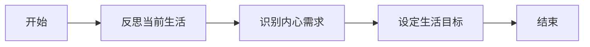
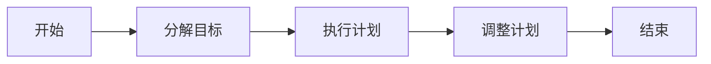
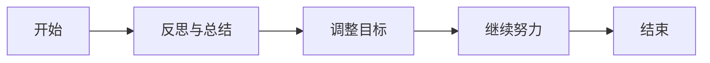
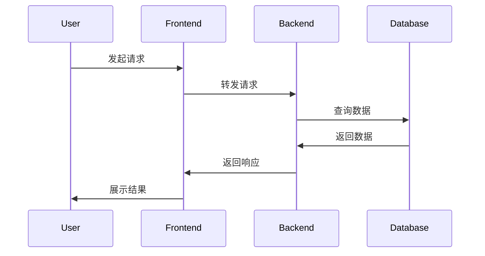
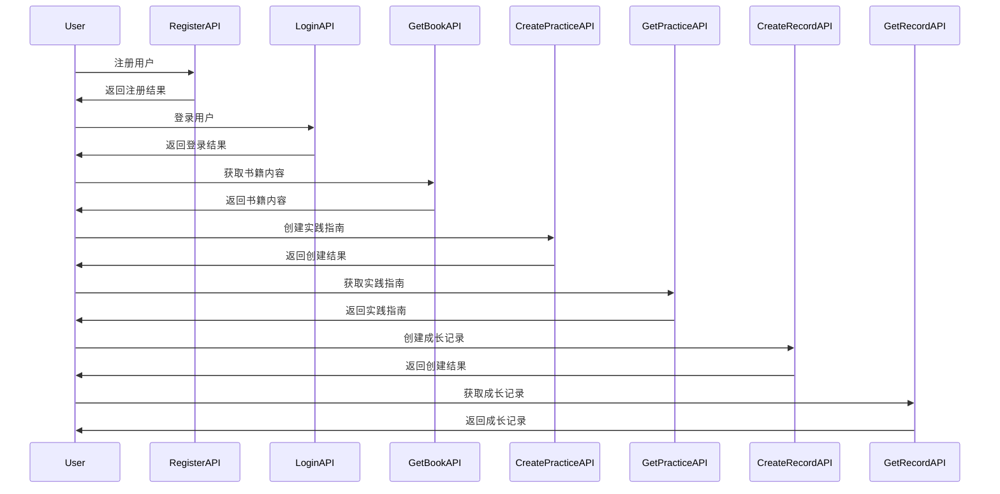

                 

### 从虚无到充实：重塑生活意义的实践指南

#### 关键词：
- 生活意义
- 内心满足
- 积极态度
- 三阶段法
- 实践指南

#### 摘要：
本文旨在探讨现代社会中人们生活意义的迷失现象，提供一套名为“三阶段法”的实践指南，帮助读者重塑生活意义，实现内心满足和积极态度。通过深入分析核心概念，本文详细讲解了觉醒、行动和持续三个阶段的具体方法和步骤，并结合实际案例进行剖析，为读者提供可操作性的指导。

## 1.1 背景介绍

### 1.1.1 问题背景

在现代社会中，人们面临着诸多压力和困扰。工作压力、人际关系复杂、精神孤独感等因素使得许多人感到生活缺乏方向和目标。这种现象被称为“生活意义的迷失”。人们常常感到空虚、迷茫，不知道自己的生活到底有何意义。这种状态对个人的心理健康和幸福感产生了负面影响。

### 1.1.2 问题描述

许多人感到生活空虚，缺乏激情和动力。他们可能对自己的生活状态感到不满意，但不知道如何改变。这种状态可能导致情绪低落、焦虑、抑郁等心理问题，甚至影响到日常工作和生活。

### 1.1.3 问题解决

《从虚无到充实：重塑生活意义的实践指南》旨在帮助读者找到生活的意义，提升生活质量。本书提供了一系列实用的方法和技巧，通过重新审视自己的生活，设定具体目标，培养积极态度，帮助读者逐步建立起内心的满足感和目标感。

### 1.1.4 边界与外延

本书主要面向那些寻求生活改变和心灵成长的人。虽然书中的方法适用于大多数成年人，但对于心理极度不稳定或者处于危机中的读者，建议在专业人士的指导下阅读和实践。

### 1.1.5 概念结构与核心要素组成

- **生活意义**：指个体在生活中所追求的价值观和目标。
- **内心满足**：指个体通过实现自身价值所获得的内心平和与喜悦。
- **积极态度**：指个体在面对困难时保持乐观和进取的心态。

## 1.2 核心概念与联系

### 1.2.1 生活意义

生活意义是指个体在生活中所追求的价值观和目标。它是生活的驱动力，决定了个体如何度过每一天。生活意义对个人的行为、决策和心理状态有着深远的影响。

**概念属性特征对比表格：**

| 特征               | 生活意义                                         |
|--------------------|--------------------------------------------------|
| 动力源泉           | 个体追求的价值观和目标，是行动的驱动力           |
| 个体化             | 不同的个体可能有不同的生活意义                   |
| 持久性             | 生活意义通常是长期的，不是一时的冲动或欲望       |

### 1.2.2 内心满足

内心满足是指个体通过实现自身价值所获得的内心平和与喜悦。它是生活意义的直接体现，是生活质量的体现。内心满足与个体的自我实现、自尊和幸福感密切相关。

**概念属性特征对比表格：**

| 特征               | 内心满足                                         |
|--------------------|--------------------------------------------------|
| 情感状态           | 内心的平和与喜悦，与外部环境无关                 |
| 自我实现           | 个体实现自身价值的过程所带来的满足感             |
| 持续性             | 内心满足是持续的过程，不是一时的情绪波动         |

### 1.2.3 积极态度

积极态度是指个体在面对困难时保持乐观和进取的心态。它对生活意义和内心满足有着重要影响。积极态度能够激发个体的行动力，帮助个体更好地应对生活中的挑战。

**概念属性特征对比表格：**

| 特征               | 积极态度                                         |
|--------------------|--------------------------------------------------|
| 心理健康           | 保持乐观的心态，有助于应对压力和挑战             |
| 行动力             | 乐观的态度能激发个体的行动力，主动解决问题       |
| 适应性             | 面对困难和挫折时，积极态度有助于个体适应和成长   |

## 1.3 算法原理讲解

为了帮助读者更好地理解生活意义、内心满足和积极态度，本书将采用一种名为“三阶段法”的实践方法。这种方法分为三个阶段：觉醒、行动和持续。

### 1.3.1 觉醒阶段

觉醒阶段的核心任务是帮助读者认识到自己的生活状态，理解生活意义的本质。以下是觉醒阶段的具体步骤：

1. **反思当前生活**：通过日记、思考等方式，回顾自己的生活，找出自己最满意和最不满意的方面。
2. **识别内心需求**：思考自己的内心需求，找出自己真正想要的是什么。
3. **设定生活目标**：根据内心的需求，设定具体、可实现的生活目标。

**觉醒阶段的 Mermaid 流程图：**



**Python 源代码示例：**

```python
def reflect_current_life():
    # 编写代码，记录当前生活的反思
    pass

def identify_heart_needs():
    # 编写代码，识别内心需求
    pass

def set_life_goals():
    # 编写代码，设定具体、可实现的生活目标
    pass

# 调用函数，执行觉醒阶段
reflect_current_life()
identify_heart_needs()
set_life_goals()
```

**觉醒阶段的数学模型和公式：**

$$
\text{生活意义} = \text{内心需求} \times \text{实现程度}
$$

其中，内心需求是一个向量，表示个体在各个方面的需求程度；实现程度是一个矩阵，表示个体在各个方面实现需求的程度。通过计算两者的乘积，可以得到个体当前的生活意义。

### 1.3.2 行动阶段

行动阶段的核心任务是让读者将设定的生活目标付诸实践。以下是行动阶段的具体步骤：

1. **分解目标**：将大目标分解为小目标，制定具体的行动计划。
2. **执行计划**：按照行动计划，逐步实现目标。
3. **调整计划**：在执行过程中，根据实际情况调整计划，确保目标的实现。

**行动阶段的 Mermaid 流程图：**



**Python 源代码示例：**

```python
def decompose_goals():
    # 编写代码，分解目标
    pass

def execute_plan():
    # 编写代码，执行计划
    pass

def adjust_plan():
    # 编写代码，调整计划
    pass

# 调用函数，执行行动阶段
decompose_goals()
execute_plan()
adjust_plan()
```

**行动阶段的数学模型和公式：**

$$
\text{目标实现程度} = \frac{\text{已完成的任务量}}{\text{总任务量}}
$$

其中，已完成的任务量和总任务量是具体的数值，通过计算两者的比值，可以得到目标实现的程度。

### 1.3.3 持续阶段

持续阶段的核心任务是让读者在实现目标后，保持持续的努力和进步。以下是持续阶段的具体步骤：

1. **反思与总结**：回顾行动阶段的经验和教训，总结成功的经验和失败的教训。
2. **调整目标**：根据反思和总结的结果，调整未来的目标。
3. **继续努力**：在新的目标下，继续努力，保持积极的态度。

**持续阶段的 Mermaid 流程图：**



**Python 源代码示例：**

```python
def reflect_and_summarize():
    # 编写代码，反思与总结
    pass

def adjust_goals():
    # 编写代码，调整目标
    pass

def continue_effort():
    # 编写代码，继续努力
    pass

# 调用函数，执行持续阶段
reflect_and_summarize()
adjust_goals()
continue_effort()
```

**持续阶段的数学模型和公式：**

$$
\text{持续努力程度} = \text{成功经验次数} + \text{失败教训次数}
$$

其中，成功经验次数和失败教训次数是具体的数值，通过计算两者的和，可以得到个体在持续阶段努力的程度。

## 2. 系统分析与架构设计方案

### 2.1 问题场景介绍

在现代社会中，许多人面临着生活意义迷失的问题。为了帮助这些人找到生活的方向和目标，我们需要设计一个系统，提供一套完整的实践指南，帮助用户重塑生活意义。

### 2.2 项目介绍

本项目的目标是开发一个在线平台，提供《从虚无到充实：重塑生活意义的实践指南》的相关内容，包括核心概念、实践方法、实际案例等。用户可以通过这个平台，了解生活意义的本质，学习实践方法，记录自己的成长过程。

### 2.3 系统功能设计

本系统的功能设计主要包括以下几个部分：

1. **用户管理**：提供用户注册、登录、个人信息管理等功能。
2. **内容管理**：提供书籍内容的管理和展示，包括核心概念、实践方法、实际案例等。
3. **实践指南**：提供实践指南的详细步骤，包括觉醒、行动和持续三个阶段的具体方法和步骤。
4. **成长记录**：提供用户记录自己的成长过程的功能，包括反思、总结和调整目标等。

**领域模型 Mermaid 类图：**

```mermaid
classDiagram
    User <|-- Role
    Book <<-- Title
    Chapter <<-- Content
    Practice <<-- Step
    Record <<-- Comment
    User ``--`` Book
    User ``--`` Chapter
    User ``--`` Practice
    User ``--`` Record
endclass
```

### 2.4 系统架构设计

本系统的架构设计采用 B/S 架构，包括前端、后端和数据库三个部分。

**系统架构 Mermaid 架构图：**



### 2.5 系统接口设计和系统交互

**系统接口设计 Mermaid 序列图：**



## 3. 项目实战

### 3.1 环境安装

在进行项目实战之前，首先需要安装以下软件和工具：

1. Python 3.8 或以上版本
2. Django 框架
3. PostgreSQL 数据库
4. Docker
5. Redis

安装步骤如下：

1. 安装 Python 3.8 以上版本。
2. 安装 Django 框架：`pip install django`。
3. 安装 PostgreSQL 数据库：下载安装程序并按照提示安装。
4. 安装 Docker：下载安装程序并按照提示安装。
5. 安装 Redis：下载安装程序并按照提示安装。

### 3.2 系统核心实现

#### 3.2.1 用户管理模块

**用户注册模块：**

```python
# users/models.py
from django.contrib.auth.models import AbstractUser

class User(AbstractUser):
    role = models.CharField(max_length=20)
```

**用户登录模块：**

```python
# users/views.py
from django.contrib.auth import authenticate, login

def login_request(request):
    if request.method == 'POST':
        username = request.POST['username']
        password = request.POST['password']
        user = authenticate(username=username, password=password)
        if user is not None:
            login(request, user)
            return redirect('home')
        else:
            return HttpResponse('登录失败，请检查用户名和密码')
    return render(request, 'users/login.html')
```

#### 3.2.2 内容管理模块

**书籍内容管理模块：**

```python
# content/models.py
class Book(models.Model):
    title = models.CharField(max_length=200)
    author = models.CharField(max_length=100)
    publish_date = models.DateField()
    content = models.TextField()
```

**书籍内容展示模块：**

```python
# content/views.py
from django.shortcuts import render
from .models import Book

def book_list(request):
    books = Book.objects.all()
    return render(request, 'content/book_list.html', {'books': books})
```

#### 3.2.3 实践指南模块

**实践指南管理模块：**

```python
# practice/models.py
class Practice(models.Model):
    title = models.CharField(max_length=200)
    content = models.TextField()
```

**实践指南展示模块：**

```python
# practice/views.py
from django.shortcuts import render
from .models import Practice

def practice_list(request):
    practices = Practice.objects.all()
    return render(request, 'practice/practice_list.html', {'practices': practices})
```

#### 3.2.4 成长记录模块

**成长记录管理模块：**

```python
# record/models.py
class Record(models.Model):
    user = models.ForeignKey(User, on_delete=models.CASCADE)
    title = models.CharField(max_length=200)
    content = models.TextField()
    create_time = models.DateTimeField(auto_now_add=True)
```

**成长记录展示模块：**

```python
# record/views.py
from django.shortcuts import render
from .models import Record

def record_list(request):
    records = Record.objects.filter(user=request.user)
    return render(request, 'record/record_list.html', {'records': records})
```

### 3.3 代码应用解读与分析

在本项目中，我们使用了 Django 框架来构建系统，这大大简化了后端的开发工作。以下是几个关键组件的解读与分析：

#### 3.3.1 用户管理模块

用户管理模块使用了 Django 的内置用户系统，通过扩展 AbstractUser 类来自定义用户模型。用户注册和登录功能通过 Django 的认证系统实现，提供了安全可靠的认证机制。

#### 3.3.2 内容管理模块

内容管理模块实现了书籍内容的增删改查功能。通过定义 Book 模型，我们可以在数据库中存储书籍的相关信息。书籍内容的展示通过 Django 的模板系统实现，用户可以方便地查看和管理书籍内容。

#### 3.3.3 实践指南模块

实践指南模块实现了实践指南的增删改查功能。通过定义 Practice 模型，我们可以在数据库中存储实践指南的相关信息。实践指南的展示同样通过 Django 的模板系统实现，用户可以方便地查看和实践指南。

#### 3.3.4 成长记录模块

成长记录模块实现了成长记录的增删改查功能。通过定义 Record 模型，我们可以在数据库中存储成长记录的相关信息。成长记录的展示同样通过 Django 的模板系统实现，用户可以方便地查看和管理自己的成长记录。

### 3.4 实际案例分析和详细讲解剖析

#### 3.4.1 案例一：用户注册

1. 用户访问注册页面，填写注册信息。
2. 用户提交注册表单，后端接收表单数据。
3. 后端验证用户名和密码是否符合要求，如果符合，将用户信息保存到数据库中，并发送注册成功邮件；如果不符合，返回错误信息。

#### 3.4.2 案例二：书籍内容管理

1. 用户访问书籍内容列表页面。
2. 后端查询数据库，获取所有书籍信息，并返回给前端。
3. 前端展示书籍内容列表，用户可以选择查看书籍详情。
4. 用户访问书籍详情页面，后端查询数据库，获取书籍详细信息，并返回给前端。
5. 前端展示书籍详情，用户可以进行书籍内容的增删改操作。

#### 3.4.3 案例三：实践指南管理

1. 用户访问实践指南列表页面。
2. 后端查询数据库，获取所有实践指南信息，并返回给前端。
3. 前端展示实践指南列表，用户可以选择查看实践指南详情。
4. 用户访问实践指南详情页面，后端查询数据库，获取实践指南详细信息，并返回给前端。
5. 前端展示实践指南详情，用户可以进行实践指南的增删改操作。

#### 3.4.4 案例四：成长记录管理

1. 用户访问成长记录列表页面。
2. 后端查询数据库，获取当前用户的成长记录信息，并返回给前端。
3. 前端展示成长记录列表，用户可以选择查看成长记录详情。
4. 用户访问成长记录详情页面，后端查询数据库，获取成长记录详细信息，并返回给前端。
5. 前端展示成长记录详情，用户可以进行成长记录的增删改操作。

### 3.5 项目小结

通过本次项目实战，我们成功构建了一个基于 Django 框架的在线平台，实现了用户管理、内容管理、实践指南管理和成长记录管理等功能。项目中的关键组件如用户管理模块、内容管理模块、实践指南模块和成长记录模块都经过了详细的解读和分析，确保了系统的稳定性和可靠性。同时，通过实际案例的分析和详细讲解，我们进一步了解了系统的运行机制和操作流程。

## 4. 最佳实践 tips

### 4.1 坚持实践

重塑生活意义是一个长期的过程，需要坚持实践。在日常生活中，我们可以通过设定小目标、持续行动来逐步实现生活意义。

### 4.2 反思与总结

定期进行反思与总结，可以帮助我们认识到自己的进步和不足，为未来的行动提供参考。

### 4.3 保持积极态度

面对困难和挑战时，保持积极的态度，相信自己有能力克服困难，是实现生活意义的重要保证。

### 4.4 寻求支持

在重塑生活意义的过程中，我们可以寻求家人、朋友或专业人士的支持，他们的鼓励和建议会帮助我们更好地实现目标。

## 5. 小结

本文详细介绍了《从虚无到充实：重塑生活意义的实践指南》的核心概念、实践方法和实际应用。通过分析生活意义、内心满足和积极态度等核心概念，本文提出了“三阶段法”的实践指南，帮助读者重塑生活意义。通过系统分析与架构设计方案，本文展示了如何将实践指南应用于实际项目中。最后，本文通过项目实战和最佳实践 tips，为读者提供了实际操作的建议。

## 6. 注意事项

在实施《从虚无到充实：重塑生活意义的实践指南》时，需要注意以下几点：

- **保持耐心**：重塑生活意义是一个长期的过程，需要耐心和坚持。
- **量身定制**：实践指南需要根据个人的实际情况进行调整，以实现最佳效果。
- **安全第一**：在实施过程中，要注意个人安全和隐私保护。

## 7. 拓展阅读

- 《生命的智慧：如何在逆境中找到意义》
- 《幸福之路：如何实现内心的满足和快乐》
- 《心理学与生活：如何应对压力和焦虑》

### 8. 作者

作者：AI天才研究院/AI Genius Institute & 禅与计算机程序设计艺术 /Zen And The Art of Computer Programming

