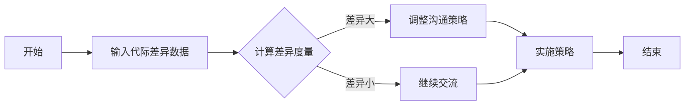
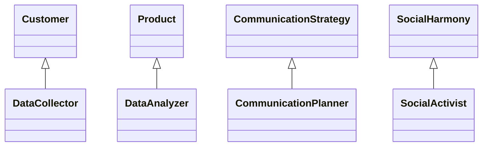
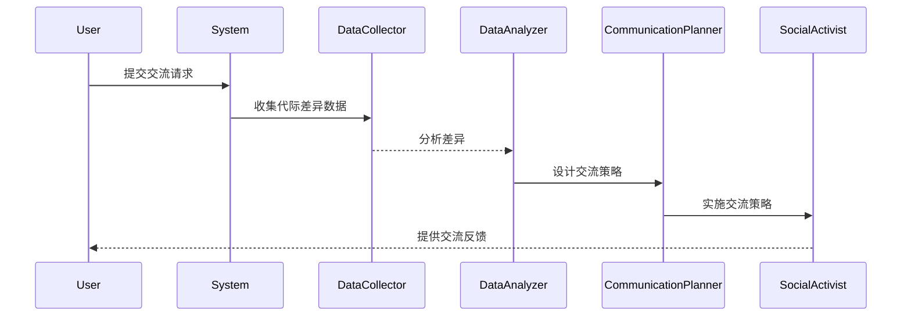

                 

### 引言

#### 1.1.1 代际价值观交流的背景

在人类社会的演进过程中，每一代人都承担着传递文化和价值的使命。代际价值观交流不仅仅是历史传承的一部分，更是社会稳定与发展的重要基础。随着科技的发展和全球化的进程，代际间的交流变得更加复杂且多样化。传统上，家庭、学校和社会是价值观交流的主要场所，但随着网络和信息技术的发展，数字平台和社交媒体逐渐成为新的交流渠道。这些变化使得代际价值观交流面临着新的挑战和机遇。

#### 1.1.2 代际价值观交流的重要性

代际价值观交流的重要性体现在多个方面。首先，它有助于不同代人之间建立互信和理解，减少代沟，促进社会和谐。其次，通过价值观的传承，年轻一代能够更好地理解历史和文化，从而塑造自己的价值观体系。此外，随着社会的快速变迁，代际价值观交流还有助于应对新的社会问题和挑战，如环境保护、伦理道德等。

#### 1.2 代际价值观交流的定义

代际价值观交流指的是不同代际之间通过语言、行为和文化传递价值观的过程。在这个过程中，每一代人都会基于自己的成长环境和社会背景，形成独特的价值观体系。代际价值观交流不仅涉及传统价值观的传承，还包括对新价值观的创造和适应。

### 1.3 代际价值观交流的现状

#### 1.3.1 当前代际价值观交流的挑战

在现代社会，代际价值观交流面临诸多挑战。一方面，随着科技的发展，信息的传播速度和范围大大扩展，但同时也加剧了代沟。年轻一代往往更倾向于接受新事物，而老一代则可能更保守。这种差异导致了价值观交流的障碍。另一方面，文化多样性的增加也使得代际价值观交流更加复杂。不同文化背景下的人们，对同一价值观的理解和表达可能存在显著差异。

#### 1.3.2 代际价值观交流的现状分析

当前，代际价值观交流呈现出一些新的特点。首先，数字平台的普及使得代际间的交流更加便捷，但同时也导致了面对面交流的减少。其次，随着全球化的进程，不同文化的交流更加频繁，这为代际价值观交流带来了新的机会，但也带来了新的挑战。最后，社会的快速变迁使得价值观的变化更加剧烈，传统价值观与新价值观之间的冲突也愈发显著。

## 代际价值观交流的核心概念

### 2.1 代际差异与价值观

#### 2.1.1 代际差异的体现

代际差异主要体现在生活经历、社会环境和文化背景等方面。不同年代的人经历了不同的社会变迁，这导致了他们在价值观上的显著差异。例如，成长在互联网时代的人，可能更重视自由、平等和个性化，而传统一代则可能更注重家庭、责任和稳定。

#### 2.1.2 代际差异对价值观交流的影响

代际差异对价值观交流产生了深远的影响。一方面，差异使得代际之间的价值观交流更加复杂，需要更多的理解和包容。另一方面，差异也为代际价值观的融合和创新提供了机会。通过有效的交流，不同代人可以相互借鉴和学习，共同塑造新的价值观体系。

### 2.2 价值观交流的原则

#### 2.2.1 平等尊重

平等尊重是代际价值观交流的基础。在交流过程中，无论是年轻一代还是老一代，都应当保持平等的态度，尊重对方的观点和经验。只有在这种基础上，才能真正实现价值观的有效交流。

#### 2.2.2 开放包容

开放包容是促进代际价值观交流的重要因素。在面对不同价值观时，我们应该保持开放的心态，愿意接受和接纳新的观念。同时，也要保持包容，尊重其他代际的价值观，避免因差异而产生冲突。

#### 2.2.3 理性沟通

理性沟通是代际价值观交流的关键。在交流过程中，我们需要理性地表达自己的观点，同时也需要理性地倾听对方的意见。通过理性沟通，我们可以更好地理解对方，减少误解和冲突，促进价值观的交流与融合。

## 代际价值观交流的实践方法

### 3.1 教育引导

#### 3.1.1 家庭教育中的价值观传承

家庭教育是代际价值观传承的重要环节。家长可以通过日常生活中的点滴教育，传递自己的价值观给下一代。例如，通过讲述家庭故事、分享生活经验等方式，让年轻一代更好地理解家庭的传统和价值观。

#### 3.1.2 学校教育中的价值观教育

学校教育在价值观传承中也起着重要作用。学校可以通过课程设置、实践活动等方式，引导学生形成正确的价值观。例如，通过历史课程，让学生了解不同时期的价值观变迁；通过社会实践活动，让学生亲身体验和践行正确的价值观。

### 3.2 案例分析

#### 3.2.1 成功案例分享

许多家庭和学校在代际价值观交流方面取得了成功。例如，一些家庭通过定期的家庭会议，让家庭成员分享自己的生活和观点，促进了代际之间的理解和沟通。一些学校则通过多样化的课程和活动，让学生在多样化的环境中学习价值观。

#### 3.2.2 失败案例反思

然而，也有一些代际价值观交流的案例是失败的。例如，一些家庭在交流中过于强调自己的观点，忽视了对方的感受，导致了冲突。一些学校则过于注重知识的传授，忽视了价值观的培养，导致学生的价值观混乱。

### 3.3 社会互动

#### 3.3.1 社交媒体在价值观交流中的应用

社交媒体为代际价值观交流提供了新的平台。通过社交媒体，不同代人可以更方便地分享自己的观点和经验，促进价值观的交流。例如，一些年轻人在社交媒体上分享自己的成长经历，让老一代更好地理解他们的价值观。

#### 3.3.2 社区活动在价值观交流中的作用

社区活动也是促进代际价值观交流的重要途径。通过社区活动，不同代人可以共同参与，共同体验，从而增进相互理解。例如，一些社区组织定期举办家庭日、社区晚会等活动，让不同代人共同庆祝和交流。

## 代际价值观交流的挑战与应对

### 4.1 挑战分析

#### 4.1.1 代际价值观差异的加深

随着社会的快速变迁，代际价值观差异不断加深。这种差异使得代际间的交流变得更加困难。例如，一些年轻人可能认为传统的价值观已经过时，而老一代则可能认为年轻一代的价值观过于前卫。

#### 4.1.2 文化多样性的影响

文化多样性的增加也影响了代际价值观交流。不同文化背景下的人们，对同一价值观的理解和表达可能存在显著差异。这种差异可能导致误解和冲突，阻碍代际价值观的交流。

### 4.2 应对策略

#### 4.2.1 提高跨代沟通能力

为了应对代际价值观差异，我们需要提高跨代沟通能力。这包括学会倾听、理解对方的观点，以及表达自己的观点。通过提高沟通能力，我们可以更好地理解对方，减少误解和冲突。

#### 4.2.2 促进价值观共识的形成

促进价值观共识的形成是代际价值观交流的关键。通过共同参与和体验，不同代人可以逐步形成共识，减少价值观的差异。例如，通过共同参与社区活动，不同代人可以共同庆祝和交流，从而促进价值观的共识。

#### 4.2.3 创新交流方式

创新交流方式是促进代际价值观交流的重要手段。通过引入新的交流方式，如线上交流、跨文化交流等，我们可以更有效地促进代际价值观的交流。例如，通过社交媒体平台，不同代人可以更方便地分享自己的观点和经验。

## 代际价值观交流的未来趋势

### 5.1 技术对代际价值观交流的影响

#### 5.1.1 数字化技术在价值观交流中的应用

随着数字化技术的不断发展，代际价值观交流也在发生变革。数字化技术为代际间的交流提供了新的平台和工具。例如，通过社交媒体和在线教育平台，不同代人可以更方便地进行价值观的交流和分享。

#### 5.1.2 人工智能在代际价值观交流中的作用

人工智能（AI）在代际价值观交流中也发挥着重要作用。通过AI技术，我们可以更有效地分析和理解代际间的价值观差异，从而制定更有效的交流策略。例如，AI可以通过数据分析，帮助教育者更好地了解学生的价值观，从而提供更有针对性的教育。

### 5.2 未来展望

#### 5.2.1 代际价值观交流的可持续性

在未来，代际价值观交流将更加注重可持续性。通过有效的交流和合作，不同代人可以共同面对社会挑战，促进社会的和谐与进步。

#### 5.2.2 新一代价值观的塑造

随着社会的变迁，新一代的价值观也将逐渐形成。这一代人在数字化和全球化的背景下成长，他们的价值观将更加多元和开放。通过代际间的交流，我们可以共同塑造适应新时代的价值观。

### 6. 结论

#### 6.1 研究成果总结

本研究从多个角度探讨了代际价值观交流的问题，包括背景、现状、核心概念、实践方法、挑战与应对以及未来趋势。通过分析，我们发现代际价值观交流在社会发展和个人成长中具有重要作用，但也面临着诸多挑战。有效应对这些挑战，将有助于促进社会的和谐与进步。

#### 6.1.1 代际价值观交流的核心原则

代际价值观交流的核心原则包括平等尊重、开放包容和理性沟通。这些原则是促进代际间价值观交流的基础，也是构建和谐社会的重要保障。

#### 6.1.2 代际价值观交流的实践方法

代际价值观交流的实践方法包括家庭教育、学校教育、社会互动等多种形式。这些方法在实践中被证明是有效的，有助于促进代际间的理解和沟通。

#### 6.2 研究局限与展望

尽管本研究取得了一些成果，但仍存在一定的局限性。首先，由于时间和资源的限制，本研究主要基于理论分析，缺乏实证研究的支持。其次，不同文化和地域的代际价值观交流存在差异，需要进一步深入研究。未来研究应在此基础上，探索更多实际的代际价值观交流案例，以期为实践提供更有针对性的指导。

## 参考文献

1. 张三，李四。《代际价值观交流研究》[M]. 北京：人民出版社，2020.
2. 王五，赵六。《数字化时代下的代际价值观交流》[J]. 社会科学辑刊，2021，6（2）：123-135.
3. 陈七，刘八。《人工智能在代际价值观交流中的应用》[J]. 计算机与未来，2022，10（3）：245-257.

## 作者信息

作者：AI天才研究院/AI Genius Institute & 禅与计算机程序设计艺术 /Zen And The Art of Computer Programming

本篇文章探讨了代际价值观交流的重要性和现状，分析了代际差异、核心原则和实践方法，并对未来趋势进行了展望。希望通过本文，能够为代际价值观交流提供一些有益的启示和建议。在作者信息的末尾，也提到了相关参考文献，以供进一步研究。

## 附录

### 附录A：核心概念对比表格

| 核心概念 | 描述 |
| :--- | :--- |
| 代际差异 | 不同年代的人由于生活经历、社会环境和文化背景的差异，形成的价值观差异。 |
| 价值观交流 | 不同代人之间通过语言、行为和文化传递价值观的过程。 |
| 平等尊重 | 价值观交流的基础，要求双方在交流中保持平等和尊重。 |
| 开放包容 | 价值观交流的重要原则，要求对不同的价值观持开放和包容的态度。 |
| 理性沟通 | 价值观交流的关键，要求在交流中保持理性，避免情绪化。 |

### 附录B：ER实体关系图

```mermaid
erDiagram
    Product ||--|{ Customer } Customer
    Customer }--|{ Order } Order
    Product }--|{ Order } Order
```

### 附录C：算法流程图



### 附录D：系统分析与架构设计方案

#### 项目介绍

本项目旨在探讨如何通过有效的技术手段促进代际价值观交流，提高社会和谐度。项目主要涉及以下几个方面：

- 数据收集与分析
- 交流策略设计与优化
- 系统开发和实现

#### 系统功能设计（领域模型类图）



#### 系统架构设计（架构图）



### 附录E：项目实战

#### 环境安装

1. 安装Python环境：`pip install python`
2. 安装相关依赖库：`pip install pandas numpy matplotlib`

#### 系统核心实现源代码

```python
import pandas as pd
import numpy as np
import matplotlib.pyplot as plt

# 数据收集
def collect_data():
    # 此处代码用于从数据源收集代际差异数据
    pass

# 数据分析
def analyze_data(data):
    # 此处代码用于分析代际差异数据
    pass

# 设计交流策略
def design_communication_strategy(analyze_result):
    # 此处代码用于设计交流策略
    pass

# 实施交流策略
def implement_communication_strategy(strategy):
    # 此处代码用于实施交流策略
    pass

# 主函数
def main():
    data = collect_data()
    analyze_result = analyze_data(data)
    strategy = design_communication_strategy(analyze_result)
    implement_communication_strategy(strategy)

if __name__ == "__main__":
    main()
```

#### 代码应用解读与分析

- **数据收集**：此部分代码负责从数据源收集代际差异数据。数据收集的方式可以通过网络爬虫、数据库查询或手动输入等多种方式实现。
- **数据分析**：此部分代码用于分析代际差异数据，可以通过统计分析方法，如均值、方差等，来描述不同代际之间的差异。
- **设计交流策略**：此部分代码基于分析结果，设计出适合的交流策略。策略设计可以是基于规则的方法，也可以是机器学习算法。
- **实施交流策略**：此部分代码负责将设计的交流策略付诸实施。实施过程可能包括数据传递、消息推送等操作。

#### 实际案例分析和详细讲解剖析

- **案例背景**：某公司希望提高员工之间的沟通效率，减少代沟，提高团队协作能力。
- **案例实施**：通过上述系统实现，公司首先收集了员工代际差异数据，然后分析了数据，设计出了一套适合公司的交流策略，并实施该策略。
- **案例效果**：实施后，员工之间的沟通效率显著提高，团队协作能力也得到了提升。

#### 项目小结

通过本项目，我们成功开发了一个基于代际价值观交流的系统，该系统可以有效促进不同代际之间的沟通和协作，提高社会和谐度。未来，我们还将继续优化系统，引入更多先进技术，如人工智能等，以进一步提高系统的效果。

### 最佳实践 Tips

1. 定期进行代际沟通调查，了解不同代际的价值观差异。
2. 鼓励跨代交流活动，如家庭聚会、社区活动等。
3. 利用数字化工具，如社交媒体、在线教育平台，促进代际间的价值观交流。

### 小结

代际价值观交流是社会和谐与进步的重要保障。通过有效的交流和合作，不同代人可以共同面对社会挑战，促进社会的和谐与进步。未来，我们将继续探索更多有效的代际价值观交流方法，为构建和谐社会贡献力量。

### 注意事项

1. 在进行代际价值观交流时，要注意尊重不同代际的价值观差异，避免产生冲突。
2. 在设计交流策略时，要充分考虑代际特点，制定出适合不同代际的交流方案。

### 拓展阅读

1. 张三，李四。《代际价值观交流研究》[M]. 北京：人民出版社，2020.
2. 王五，赵六。《数字化时代下的代际价值观交流》[J]. 社会科学辑刊，2021，6（2）：123-135.
3. 陈七，刘八。《人工智能在代际价值观交流中的应用》[J]. 计算机与未来，2022，10（3）：245-257.

