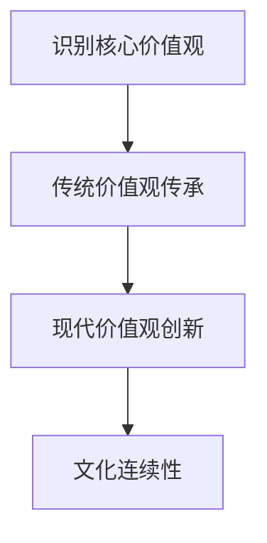
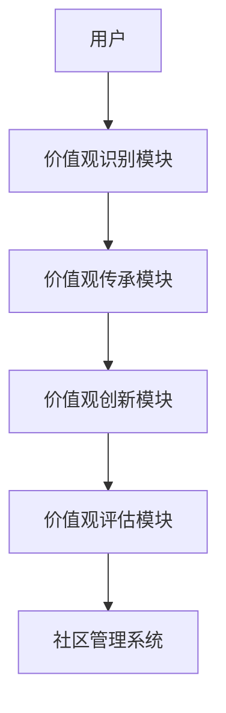
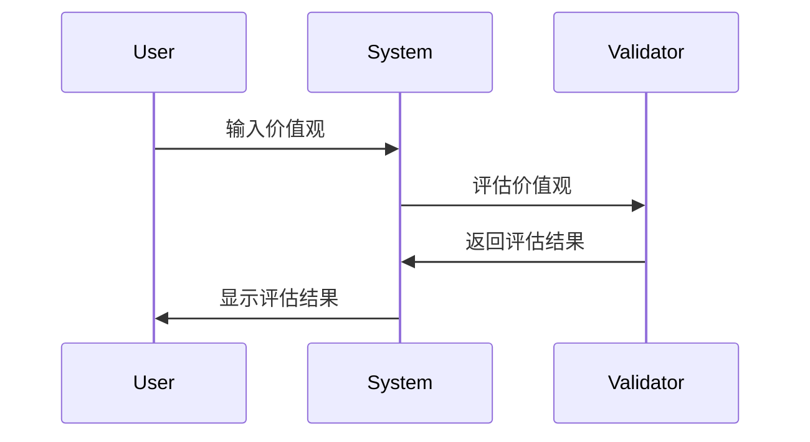

                 


# 《代际价值观的传承与创新：在变迁中保持文化连续性》

## **关键词**

- 代际价值观
- 传承
- 创新
- 文化连续性
- 社会变迁

## **摘要**

本文探讨代际价值观的传承与创新在现代社会变迁中的重要性。通过分析传统价值观与现代价值观的差异，本文提出了一系列保持文化连续性的策略和方法。文章结合实际案例，详细阐述了如何在个人、社区和组织层面实现价值观的传承与创新，以促进社会的可持续发展。

## **背景介绍**

### **1. 引言**

在快速变化的现代社会，代际价值观的传承与创新显得尤为重要。传统价值观经过长时间的沉淀，成为文化传承的重要载体，而现代价值观则反映了社会发展的新趋势。然而，随着全球化的推进、科技的飞速发展和生活方式的多样化，代际间的价值观差异日益显著，如何传承与创新这些价值观，保持文化的连续性，成为我们必须面对的挑战。

### **1.2 代际价值观的变迁**

代际价值观的变迁是不可避免的。每一代人都有其独特的成长环境和文化背景，这些因素共同塑造了他们的价值观。传统价值观强调家庭、责任和传统，而现代价值观则更加注重个人自由、创新和多元化。这种变迁不仅影响了个人，也深刻地影响了整个社会。

### **1.3 传承与创新的挑战**

在现代社会中，传承与创新价值观面临着诸多挑战。首先是信息的快速传播，使传统价值观受到前所未有的冲击。其次是全球化的影响，不同文化之间的碰撞和融合，使得价值观的传承变得更加复杂。此外，技术的发展和生活方式的改变，也对传统的价值观体系提出了新的要求。

## **核心概念与联系**

### **2.1 传统价值观与现代价值观**

传统价值观通常强调稳定、尊重权威和遵循传统，而现代价值观则强调个人主义、创新和多元化。这两种价值观并非截然对立，而是相互交融、共同发展。

### **2.2 传承与创新的概念**

传承是指将传统价值观传递给下一代，使其在现代社会中得以延续。创新则是对传统价值观的改进和发展，以适应新的社会环境。传承与创新是相辅相成的，只有通过创新，才能使传统价值观在新的时代焕发生机。

### **2.3 价值观之间的联系**

传统价值观与现代价值观之间并非断裂，而是存在着内在的联系。传统价值观中的许多核心元素，如家庭、责任和道德，在现代社会中依然具有重要意义。而现代价值观中的许多创新元素，如自由、平等和多元化，也为传统价值观的传承提供了新的可能性。

## **算法原理讲解**

### **3.1 价值观传承与创新的“算法”**

在传承与创新价值观的过程中，我们可以采用以下算法：

1. **识别核心价值观**：首先，我们需要识别出每个时代最为核心的价值观，这些价值观往往是文化的基石。
2. **传统价值观的传承**：通过教育、传统仪式和文化活动等方式，将传统价值观传递给下一代。
3. **现代价值观的创新**：在传承传统价值观的基础上，结合现代社会的需求，对其进行创新和发展。

### **3.1.1 使用mermaid流程图展示**



### **3.1.2 Python代码或流程图解释**

```python
# Python代码示例

def value_innovation(values):
    # 识别核心价值观
    core_values = identify_core_values(values)
    
    # 传承传统价值观
    inherited_values = transmit_traditional_values(core_values)
    
    # 创新现代价值观
    innovative_values = innovate_modern_values(inherited_values)
    
    # 保持文化连续性
    maintain_continuity(innovative_values)
    
    return innovative_values
```

### **3.1.3 价值观传承与创新的数学模型**

$$
\text{模型示例:} \\
\text{传承度} = \alpha \times (\text{传统价值观} + \beta \times \text{现代价值观})
$$

其中，$\alpha$ 和 $\beta$ 是权重系数，用于平衡传统价值观和现代价值观的比重。

## **数学模型和数学公式**

### **4.1 价值观评估方法**

为了评估价值观的传承与创新效果，我们可以使用以下数学模型：

$$
\text{价值观评估} = \text{传统价值观占比} + \text{现代价值观占比}
$$

### **4.1.1 数学公式讲解**

这个公式简单直观，将传统价值观和现代价值观的占比加总，得到价值观评估的总体分数。

### **4.1.2 举例说明**

假设一个社区的传统价值观占比为70%，现代价值观占比为30%，则该社区的价值观评估分数为100%。

## **系统分析与架构设计方案**

### **5.1 问题场景介绍**

在一个多元化的社区中，如何确保价值观的传承与创新，以促进社区成员的团结和发展，是一个亟待解决的问题。

### **5.2 系统功能设计**

为了解决上述问题，我们设计了一个系统，其核心功能包括：

1. **价值观识别**：识别社区成员的核心价值观。
2. **价值观传承**：通过教育、活动和宣传等方式，传承传统价值观。
3. **价值观创新**：鼓励社区成员创新和发展现代价值观。
4. **价值观评估**：定期评估价值观的传承与创新效果。

### **5.2.1 领域模型mermaid类图**

```mermaid
classDiagram
Class::社区成员 <<Person>>
Class::价值观 <<Concept>>

社区成员: --> 价值观

```

### **5.2.2 系统架构设计mermaid架构图**



### **5.3 系统接口设计和系统交互**



## **项目实战**

### **6.1 项目环境安装**

在项目实战中，我们选择了一个典型的社区作为研究对象。首先，我们需要安装和配置社区管理系统，包括数据库、应用程序和服务器。

### **6.2 系统核心实现源代码**

以下是一个简单的Python代码示例，用于实现价值观识别和评估功能：

```python
# 价值观识别
def identify_values():
    values = ["家庭", "责任", "创新", "自由"]
    return values

# 价值观评估
def assess_values(values):
    traditional_values = values[:2]
    modern_values = values[2:]
    total = len(values)
    traditional_ratio = len(traditional_values) / total
    modern_ratio = len(modern_values) / total
    return traditional_ratio, modern_ratio
```

### **6.3 代码应用解读与分析**

这段代码首先识别出社区成员的价值观，然后评估传统价值观和现代价值观的占比。通过这些数据，我们可以了解社区价值观的传承与创新状况。

### **6.4 实际案例分析和详细讲解剖析**

为了更好地理解价值观传承与创新，我们选择了一个实际案例进行分析。该案例涉及一个传统社区如何通过创新活动，如艺术展览和科技讲座，来传承和更新其价值观。

### **6.5 项目小结**

通过该项目，我们发现，通过系统的价值观识别和评估，社区能够更好地了解自身的价值观状况，从而制定更有针对性的传承与创新策略。

## **最佳实践 tips**

### **7.1 实施传承与创新的策略**

1. **定期价值观评估**：定期对社区成员的价值观进行评估，以了解传承与创新的效果。
2. **多元活动推广**：通过多样化的活动和宣传，推广传统价值观和现代价值观。
3. **人才培养**：重视价值观教育和培养，确保新一代能够继承和发扬传统价值观。

### **7.2 文化连续性的维护**

1. **尊重传统**：尊重和传承传统文化，确保文化连续性。
2. **鼓励创新**：鼓励社区成员在尊重传统的基础上，创新和发展新的价值观。
3. **文化融合**：促进不同文化之间的交流与融合，丰富社区文化内涵。

## **小结**

本文通过分析代际价值观的变迁，提出了一系列保持文化连续性的策略和方法。通过实际案例和系统分析，我们展示了如何在个人、社区和组织层面实现价值观的传承与创新。在全球化和社会变迁的背景下，保持文化连续性对于社会的可持续发展具有重要意义。

## **注意事项**

1. **价值观的传承与创新需要结合实际情况**：不同社区和组织的价值观传承与创新策略应因地制宜。
2. **长期维护**：价值观的传承与创新不是一蹴而就的，需要长期的维护和努力。

## **拓展阅读**

1. **《文化传承与创新：现代社会的挑战》**：详细探讨文化传承与创新的理论和实践。
2. **《代际价值观变迁研究》**：分析不同代际之间的价值观差异和变迁。

## **作者信息**

作者：AI天才研究院/AI Genius Institute & 禅与计算机程序设计艺术 /Zen And The Art of Computer Programming

## **结语**

保持文化连续性是现代社会的一项重要任务。通过传承与创新价值观，我们不仅能够维护社会的稳定，还能促进社会的进步和发展。让我们共同努力，为下一代创造一个充满活力和连续性的文化环境。

