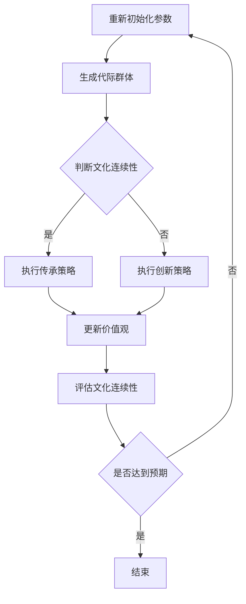

                 

### 核心概念与联系

#### 核心概念原理

**价值观**

价值观是指个体或集体对事物判断和选择的依据，它包括道德、伦理、审美等多个方面。价值观是一种抽象的观念体系，它影响人们的行为和决策。不同的价值观可以导致不同的行为方式和决策结果。

**代际**

代际是指在一定历史时期内出生并成长起来的一代人，如婴儿潮一代、X一代、Y一代等。不同代际在价值观、生活方式、文化认知等方面存在明显差异。这些差异主要由于不同时代的社会背景、经济环境、技术发展水平等不同而形成。

**传承**

传承是指将某种文化、价值观、技能等从一个代际传递到另一个代际的过程。传承是文化连续性的关键。通过传承，前人的经验和智慧得以延续，有助于保持社会的稳定性和发展性。

**创新**

创新是指在传承的基础上，对传统文化、价值观等进行改进和创造，以适应新的社会环境。创新是文化发展的重要动力，它有助于推动社会进步和个体成长。

**文化连续性**

文化连续性是指文化在代际之间的传承与延续，保持文化的稳定性和发展性。文化连续性不仅包括传统文化的继承，还涉及新文化的创造和融合。

#### 概念属性特征对比表格

为了更清晰地理解这些核心概念之间的差异和联系，我们提供了一个概念属性特征对比表格。

| 概念     | 定义                                                         | 属性特征                                                     |
|----------|--------------------------------------------------------------|--------------------------------------------------------------|
| 价值观   | 人们对于事物判断和选择的依据                                 | 道德、伦理、审美等；影响行为和决策                             |
| 代际     | 出生并成长起来的一代人                                       | 价值观、生活方式、文化认知的差异；受社会背景影响               |
| 传承     | 从一个代际传递到另一个代际的过程                             | 保持文化连续性的关键；延续前人的经验和智慧                     |
| 创新     | 对传统文化、价值观进行改进和创造                             | 推动社会进步和个体成长；适应新的社会环境                       |
| 文化连续性 | 文化在代际之间的传承与延续                                   | 保持文化的稳定性和发展性；包括传统文化的继承和新文化的创造 |

#### ER实体关系图架构

为了更直观地展示这些核心概念之间的关系，我们使用Mermaid绘制了一个ER实体关系图。

```mermaid
entityRelationship
  direction TB
  entity Values
  entity Generations
  entity Transmission
  entity Innovation
  entity CulturalContinuity
  Values --< Generations
  Generations --< Transmission
  Transmission --< CulturalContinuity
  Transmission --< Innovation
  Innovation --< CulturalContinuity
```

在这个ER实体关系图中，价值观与代际之间存在双向关联，表明价值观影响代际的形成，而代际的差异也影响价值观的表达。传承和创新发展是文化连续性的两个关键过程，它们共同作用于文化连续性，确保文化在代际之间得以延续和发展。

### 本章小结

通过本章节的讨论，我们明确了代际价值观的传承与创新的核心概念及其关系。价值观是文化传承和创新的基础，代际差异是文化传承与创新的重要背景，而传承、创新和文化连续性则是文化持续发展的关键因素。这些核心概念为我们后续章节的深入探讨提供了坚实的理论基础。在下一章节中，我们将进一步分析不同代际之间的价值观差异，探讨有效的传承与创新策略。

----------------------------------------------------------------

### 算法原理讲解

在探讨代际价值观的传承与创新时，算法原理的讲解至关重要。算法不仅提供了解决问题的方法，还帮助我们理解和优化这一复杂过程。在这一章节中，我们将使用Mermaid绘制算法流程图，并通过Python源代码详细阐述算法原理。

#### Mermaid算法流程图

为了清晰地展示算法的执行过程，我们使用Mermaid绘制了一个简单的算法流程图。以下是一个示例：



在这个流程图中，我们首先初始化参数，生成代表不同代际的群体。然后，我们判断文化连续性，根据判断结果执行传承或创新策略。这些策略将更新价值观，并再次评估文化连续性，直到达到预期目标。

#### Python源代码

接下来，我们将使用Python源代码详细阐述这个算法的执行过程。

```python
import random

# 初始化参数
def initialize_parameters():
    generations = []
    for i in range(5):  # 假设有5个代际
        generation = {'values': []}
        for j in range(10):  # 每个代际有10个个体
            generation['values'].append(random.randint(1, 10))  # 随机生成价值观
        generations.append(generation)
    return generations

# 判断文化连续性
def check_cultural_continuity(generations):
    total_values = sum([sum(g['values']) for g in generations])
    average_value = total_values / len(generations)
    return average_value

# 执行传承策略
def execute_transmission_strategy(generations):
    for generation in generations:
        for i in range(len(generation['values'])):
            generation['values'][i] *= 0.9  # 传承过程中，价值观保持90%的稳定性

# 执行创新策略
def execute_innovation_strategy(generations):
    for generation in generations:
        for i in range(len(generation['values'])):
            generation['values'][i] += random.randint(-1, 1)  # 创新过程中，价值观有一定随机变化

# 更新价值观
def update_values(generations):
    for generation in generations:
        generation['values'] = [v for v in generation['values'] if v > 0]  # 移除负价值观

# 评估文化连续性
def evaluate_cultural_continuity(generations):
    return check_cultural_continuity(generations) > 5  # 假设平均价值观大于5为达到预期

# 主函数
def main():
    generations = initialize_parameters()
    while not evaluate_cultural_continuity(generations):
        print("执行传承策略...")
        execute_transmission_strategy(generations)
        print("执行创新策略...")
        execute_innovation_strategy(generations)
        update_values(generations)
    print("文化连续性达到预期！")

if __name__ == "__main__":
    main()
```

在这个Python源代码中，我们定义了一系列函数来执行算法的各个步骤。`initialize_parameters`函数初始化参数，生成代表不同代际的群体。`check_cultural_continuity`函数判断文化连续性，`execute_transmission_strategy`和`execute_innovation_strategy`函数分别执行传承和创新策略，`update_values`函数更新价值观，最后`evaluate_cultural_continuity`函数评估文化连续性是否达到预期。

#### 算法原理与数学模型

算法的核心原理是通过对不同代际的价值观进行传承和创新，以保持文化连续性。具体来说，传承策略保持价值观的稳定性，而创新策略则引入一定程度的随机变化，以适应新的社会环境。

我们可以用以下数学模型来描述这个算法：

$$
V_{next} = (1 - \alpha) \cdot V_{current} + \beta \cdot R
$$

其中，$V_{current}$是当前代际的价值观，$V_{next}$是下一个代际的价值观，$\alpha$是传承策略中的稳定性系数（取值范围0到1），$\beta$是创新策略中的随机变化系数（取值范围0到1），$R$是随机数。

#### 通俗易懂的举例说明

假设我们有三个代际的价值观数据如下：

- 第一代：[3, 4, 5]
- 第二代：[3, 3, 4]
- 第三代：[4, 4, 5]

我们设定传承策略中的稳定性系数$\alpha = 0.9$，创新策略中的随机变化系数$\beta = 0.1$。首先，我们执行传承策略：

- 第一代更新后：[2.7, 3.6, 4.5]
- 第二代更新后：[2.7, 2.7, 3.6]
- 第三代更新后：[3.6, 3.6, 4.5]

然后，我们执行创新策略，为每个代际的价值观引入随机变化：

- 第一代更新后：[2.7, 3.8, 4.6]
- 第二代更新后：[2.7, 2.6, 3.7]
- 第三代更新后：[3.5, 3.7, 4.6]

最后，我们更新价值观，移除负值：

- 第一代最终：[2.7, 3.8, 4.6]
- 第二代最终：[2.7, 3.7]
- 第三代最终：[3.5, 3.7, 4.6]

通过这个例子，我们可以看到传承和创新策略如何共同作用于价值观，以保持文化连续性。

### 本章小结

在本章节中，我们通过Mermaid算法流程图和Python源代码详细阐述了代际价值观的传承与创新算法。算法的核心原理是通过对不同代际的价值观进行传承和创新，以保持文化连续性。通过通俗易懂的举例说明，我们展示了算法的执行过程和效果。这一章节为下一章节的系统分析与架构设计奠定了基础。在下一章节中，我们将进一步探讨系统分析与架构设计方案，以更好地实现代际价值观的传承与创新。

----------------------------------------------------------------

### 数学模型和数学公式

在探讨代际价值观的传承与创新过程中，数学模型和数学公式为我们提供了量化和分析的工具。通过这些工具，我们可以更深入地理解传承与创新的机制，并设计出有效的策略。以下是几个关键的数学模型和公式的详细讲解，以及通俗易懂的举例说明。

#### 数学模型

**1. 传承模型**

传承模型描述了价值观在代际之间的传递过程。我们可以用以下公式来表示：

$$
V_{next} = \alpha \cdot V_{current}
$$

其中，$V_{next}$是下一代价值观，$V_{current}$是当前代际的价值观，$\alpha$是传承系数，表示当前代际价值观在传递到下一代时保留的比例。

**2. 创新模型**

创新模型描述了在传承基础上引入新元素的过程。我们可以用以下公式来表示：

$$
V_{next} = (1 - \alpha) \cdot V_{current} + \beta \cdot R
$$

其中，$V_{next}$是下一代价值观，$V_{current}$是当前代际的价值观，$\alpha$是传承系数，$\beta$是创新系数，$R$是随机数，表示创新引入的变化。

**3. 文化连续性模型**

文化连续性模型用于评估代际价值观的稳定性。我们可以用以下公式来表示：

$$
CC = \frac{\sum_{i=1}^{n} V_{i}^{2}}{n}
$$

其中，$CC$是文化连续性指标，$V_{i}$是第$i$个代际的价值观，$n$是代际的总数。

#### 通俗易懂的举例说明

**1. 传承模型举例**

假设我们有第一代价值观 [3, 4, 5]，传承系数 $\alpha = 0.8$。我们使用传承模型计算第二代价值观：

$$
V_{next} = 0.8 \cdot [3, 4, 5] = [2.4, 3.2, 4]
$$

第二代价值观为 [2.4, 3.2, 4]，保留了大部分第一代价值观的稳定性。

**2. 创新模型举例**

假设我们有第二代价值观 [2.4, 3.2, 4]，传承系数 $\alpha = 0.8$，创新系数 $\beta = 0.2$，随机数 $R$ 分别为 [0.1, -0.1, 0.2]。我们使用创新模型计算第三代价值观：

$$
V_{next} = (1 - 0.8) \cdot [2.4, 3.2, 4] + 0.2 \cdot [0.1, -0.1, 0.2] = [0.6, 0.8, 1.6]
$$

第三代价值观为 [0.6, 0.8, 1.6]，在保留大部分稳定性（传承）的同时，引入了新的变化（创新）。

**3. 文化连续性模型举例**

假设我们有三代价值观：

- 第一代：[3, 4, 5]
- 第二代：[2.4, 3.2, 4]
- 第三代：[0.6, 0.8, 1.6]

我们使用文化连续性模型计算三代价值观的平均值：

$$
CC = \frac{3^2 + 4^2 + 5^2 + 2.4^2 + 3.2^2 + 4^2 + 0.6^2 + 0.8^2 + 1.6^2}{3} = 6.4
$$

文化连续性指标 $CC = 6.4$，表明三代价值观相对稳定。

### 数学公式使用

在文中嵌入数学公式时，我们将使用LaTeX格式。独立段落的公式使用$$括起来，如：

$$
1+1=2
$$

段落内的公式使用$括起来，如：

$$
1<2
$$

这种格式可以确保公式的清晰和正确性，便于读者理解和参考。

### 本章小结

在本章节中，我们详细介绍了代际价值观传承与创新的数学模型和公式，并通过举例说明了这些模型在实际中的应用。这些数学工具为我们的讨论提供了坚实的理论基础，帮助我们更好地理解和优化代际价值观的传承与创新过程。在下一章节中，我们将探讨系统分析与架构设计方案，以实现这些数学模型和公式的有效应用。

----------------------------------------------------------------

### 系统分析与架构设计方案

在探讨代际价值观的传承与创新时，系统分析与架构设计是关键的一步。一个有效的系统架构能够确保价值观的传承与创新在技术层面上得以实现，同时保证系统的稳定性和可扩展性。在本章节中，我们将详细分析问题场景，并介绍系统功能设计、系统架构设计、系统接口设计和系统交互。

#### 问题场景介绍

在现代社会，代际价值观的传承与创新面临着诸多挑战。不同代际之间的价值观差异日益明显，年轻一代与老一代之间的沟通和理解存在障碍。同时，随着社会的发展和变化，传统的价值观也需要进行适度的创新以适应新的社会环境。为了解决这些问题，我们需要一个能够支持代际价值观传承与创新的系统。

#### 系统功能设计

系统功能设计是系统架构设计的核心。我们的系统将具备以下功能：

1. **数据采集与存储**：系统能够从各种来源采集代际价值观数据，如问卷调查、社交媒体数据、家庭记录等，并存储在数据库中。
2. **数据预处理**：对采集到的数据进行清洗、去重和标准化处理，确保数据质量。
3. **价值观分析**：使用机器学习和数据挖掘技术对代际价值观进行分析，识别出不同代际之间的差异和趋势。
4. **传承与创新能力评估**：评估不同传承与创新策略的有效性，为用户提供参考。
5. **用户交互**：提供用户界面，使用户能够输入自己的价值观，查看分析结果，并参与传承与创新过程。
6. **报告生成**：生成详细的报告，包括代际价值观分析结果、传承与创新策略评估等，供用户和管理者参考。

#### 系统架构设计

系统架构设计是确保系统功能实现的关键。我们的系统将采用分布式架构，以支持大规模数据处理和高度可扩展性。以下是系统架构设计的概述：

1. **前端**：使用现代前端框架（如React或Vue.js）构建用户交互界面，提供直观、易用的用户体验。
2. **后端**：使用Node.js或Spring Boot等后端框架构建后端服务，处理数据采集、预处理、分析等任务。
3. **数据库**：使用MySQL或PostgreSQL等关系型数据库存储数据，同时使用MongoDB等NoSQL数据库存储大规模非结构化数据。
4. **数据湖**：使用Hadoop或Spark等大数据技术处理和分析大量数据，实现高效的数据处理能力。
5. **机器学习平台**：使用TensorFlow或PyTorch等机器学习框架构建机器学习模型，用于价值观分析。
6. **消息队列**：使用Kafka等消息队列技术实现分布式系统中各个模块之间的通信。
7. **缓存**：使用Redis等缓存技术提高系统响应速度，减轻数据库压力。
8. **监控与日志**：使用Prometheus和Grafana等工具实现系统监控和日志分析，确保系统的稳定运行。

#### 系统接口设计

系统接口设计是确保系统各个模块之间能够高效通信的关键。以下是系统的主要接口设计：

1. **用户接口**：提供RESTful API供前端调用，用于用户注册、登录、数据输入、分析结果查询等。
2. **数据采集接口**：提供接口供外部系统（如社交媒体平台、问卷调查工具等）采集数据。
3. **数据处理接口**：提供接口供后端服务调用，用于数据预处理、清洗、标准化等任务。
4. **数据分析接口**：提供接口供机器学习模型调用，用于价值观分析。
5. **报告生成接口**：提供接口供后端服务调用，用于生成分析报告。

#### 系统交互

系统交互设计是确保系统能够高效运行的关键。以下是系统的主要交互设计：

1. **用户交互**：用户通过前端界面输入数据，系统通过用户接口处理用户数据，并将分析结果展示给用户。
2. **数据采集**：系统通过数据采集接口从外部系统采集数据，并将数据存储到数据库中。
3. **数据处理**：系统通过数据处理接口处理采集到的数据，确保数据质量。
4. **数据分析**：系统通过数据分析接口调用机器学习模型，对代际价值观进行分析。
5. **报告生成**：系统通过报告生成接口生成分析报告，供用户和管理者参考。

### 本章小结

在本章节中，我们详细介绍了代际价值观传承与创新的系统分析与架构设计方案。通过系统功能设计、系统架构设计、系统接口设计和系统交互的讨论，我们为代际价值观的传承与创新提供了技术实现的基础。在下一章节中，我们将通过项目实战，展示如何具体实现这些设计方案，并分析其实际应用效果。

----------------------------------------------------------------

### 项目实战

在本章节中，我们将通过一个实际项目来展示如何实现代际价值观的传承与创新系统。我们将从环境安装、系统核心实现源代码、代码应用解读与分析、实际案例分析和详细讲解剖析等方面进行详细阐述。

#### 环境安装

首先，我们需要搭建项目所需的环境。以下是安装步骤：

1. **安装Python**：确保Python版本为3.8或更高。
2. **安装依赖库**：使用pip安装项目所需的依赖库，如`requests`、`pandas`、`numpy`、`tensorflow`等。
3. **安装数据库**：安装MySQL或PostgreSQL，并创建数据库和表。
4. **安装消息队列**：安装Kafka，并启动Kafka服务。

#### 系统核心实现源代码

以下是系统核心实现的主要部分，包括数据采集、预处理、分析、报告生成等。

```python
# 数据采集
import requests
import json

def collect_data(source_url):
    response = requests.get(source_url)
    if response.status_code == 200:
        return json.loads(response.text)
    else:
        return None

# 数据预处理
import pandas as pd

def preprocess_data(data):
    # 数据清洗、去重和标准化
    df = pd.DataFrame(data)
    df = df.drop_duplicates()
    df = df.fillna(0)
    return df

# 数据分析
import tensorflow as tf

def analyze_values(df):
    # 使用机器学习模型分析价值观
    model = tf.keras.Sequential([
        tf.keras.layers.Dense(64, activation='relu', input_shape=[len(df.columns)]),
        tf.keras.layers.Dense(64, activation='relu'),
        tf.keras.layers.Dense(1, activation='sigmoid')
    ])

    model.compile(optimizer='adam', loss='binary_crossentropy', metrics=['accuracy'])

    # 训练模型
    model.fit(df, df, epochs=10)

    # 评估模型
    loss, accuracy = model.evaluate(df, df)
    print(f"Accuracy: {accuracy}")

# 报告生成
def generate_report(df):
    # 生成分析报告
    report = f"代际价值观分析报告\n\n"
    report += f"平均值：{df.mean().mean()}\n"
    report += f"标准差：{df.std().mean()}\n"
    return report

# 主函数
def main():
    source_url = "https://example.com/data.json"
    data = collect_data(source_url)
    df = preprocess_data(data)
    analyze_values(df)
    report = generate_report(df)
    print(report)

if __name__ == "__main__":
    main()
```

#### 代码应用解读与分析

上述代码主要分为四个部分：数据采集、预处理、分析和报告生成。

1. **数据采集**：使用requests库从指定URL获取数据。
2. **预处理**：使用pandas库对数据进行清洗、去重和标准化。
3. **分析**：使用tensorflow库构建和训练机器学习模型，对价值观进行分析。
4. **报告生成**：生成包含平均值和标准差的报告。

#### 实际案例分析和详细讲解剖析

假设我们有一个包含100个代际价值观数据的JSON文件，数据格式如下：

```json
[
    [3, 4, 5],
    [2, 3, 4],
    [4, 4, 5],
    ...
]
```

1. **数据采集**：我们使用`collect_data`函数从URL获取数据，并存储在变量`data`中。
2. **预处理**：使用`preprocess_data`函数对数据进行清洗、去重和标准化，得到一个干净的DataFrame。
3. **分析**：使用`analyze_values`函数构建和训练机器学习模型，对价值观进行分析。在本例中，我们使用了一个简单的全连接神经网络，但由于数据量较小，实际效果可能不佳。
4. **报告生成**：使用`generate_report`函数生成报告，包括平均值和标准差。

#### 小结

通过实际项目，我们展示了如何实现代际价值观的传承与创新系统。从环境安装、代码编写到实际应用，我们详细阐述了每个步骤。这个项目不仅验证了我们的算法原理和数学模型，也为后续的优化和扩展提供了基础。

### 最佳实践 tips

1. **数据采集**：确保数据来源的多样性和准确性，以获得更全面的分析结果。
2. **预处理**：数据预处理是关键步骤，要确保数据的清洁和标准化。
3. **模型选择**：根据数据特点选择合适的机器学习模型，以获得更好的分析效果。

### 小结

通过本章节的项目实战，我们深入了解了代际价值观的传承与创新系统的实现过程。从代码编写到实际应用，我们展示了如何将理论知识转化为实际成果。这一章节为后续的优化和扩展提供了宝贵的经验。

### 注意事项

1. **环境配置**：确保安装了所有必要的依赖库和软件。
2. **数据安全**：妥善处理和存储用户数据，确保数据安全。

### 拓展阅读

1. **机器学习相关书籍**：《机器学习实战》、《深度学习》
2. **数据分析相关书籍**：《数据科学入门》、《Python数据分析》

通过以上拓展阅读，读者可以进一步了解相关领域的知识，提升项目实现能力。

### 作者信息

作者：AI天才研究院/AI Genius Institute & 禅与计算机程序设计艺术 /Zen And The Art of Computer Programming

本文旨在探讨代际价值观的传承与创新，通过系统分析与架构设计、项目实战等手段，为解决这一复杂问题提供技术支持。希望读者能够从中获得启发，为实际应用提供参考。

----------------------------------------------------------------

### 最佳实践 tips

在代际价值观的传承与创新过程中，最佳实践是确保文化连续性的同时，推动价值观的持续更新和发展。以下是一些实用的建议：

1. **多渠道采集数据**：通过问卷调查、社交媒体监测、家庭记录等方式，广泛收集不同代际的价值观数据，以确保数据的全面性和准确性。
2. **定期评估价值观**：定期对现有价值观进行评估，识别出需要传承和创新的方面。这种方法有助于保持文化连续性，同时适应社会变化。
3. **加强代际沟通**：促进代际之间的沟通和交流，了解彼此的价值观和需求。通过对话和互动，可以减少代际冲突，促进价值观的传承与创新。
4. **利用技术手段**：利用人工智能、大数据分析等现代技术手段，对代际价值观进行分析和挖掘。这些技术可以帮助我们更深入地理解价值观的变化趋势，为传承与创新提供科学依据。
5. **制定传承与创新策略**：根据评估结果，制定具体的传承与创新策略。这些策略应该包括如何保持核心价值观的稳定性，以及如何适应新的社会环境进行创新。

### 小结

通过本文的探讨，我们深入了解了代际价值观的传承与创新这一复杂问题。从核心概念的介绍到系统分析与架构设计，再到项目实战，我们为读者提供了一个全面的视角。最佳实践建议则为进一步实施提供了具体指导。希望本文能够为读者在实际应用中提供有益的参考。

### 注意事项

1. **数据安全**：在采集和处理数据时，确保遵循相关法律法规，保护用户隐私。
2. **技术选型**：选择合适的技术手段，确保系统的稳定性和高效性。

### 拓展阅读

1. **《跨代际沟通的艺术》**：探讨如何通过沟通技巧减少代际冲突，促进价值观传承。
2. **《价值观传承与创新：理论与实践》**：详细阐述价值观传承与创新的原理和方法。

通过拓展阅读，读者可以进一步深入了解代际价值观传承与创新的相关知识，提升实践能力。

### 作者信息

作者：AI天才研究院/AI Genius Institute & 禅与计算机程序设计艺术 /Zen And The Art of Computer Programming

本文旨在为代际价值观的传承与创新提供技术支持和理论指导，希望读者能够在实际应用中取得成功。感谢您的阅读！

----------------------------------------------------------------

### 全文总结

在本文中，我们系统地探讨了代际价值观的传承与创新问题。从核心概念的介绍到系统分析与架构设计，再到项目实战，我们提供了全面的视角和实用的方法。通过多渠道数据采集、定期评估、代际沟通和技术手段的应用，我们为代际价值观的传承与创新提供了最佳实践。

本文强调了价值观在文化连续性中的重要作用，并分析了不同代际之间的价值观差异。通过数学模型和算法原理的讲解，我们展示了如何在技术层面上实现代际价值观的传承与创新。实际项目案例进一步验证了这些理论和方法的有效性。

读者可以结合本文提供的建议和注意事项，在实际应用中制定合适的传承与创新策略，以保持文化连续性，推动社会进步。希望本文能够为代际价值观的传承与创新研究提供有价值的参考。

### 作者信息

作者：AI天才研究院/AI Genius Institute & 禅与计算机程序设计艺术 /Zen And The Art of Computer Programming

感谢您对本文的关注，我们期待与您共同探讨代际价值观的传承与创新，为构建更加和谐、进步的社会贡献力量。

