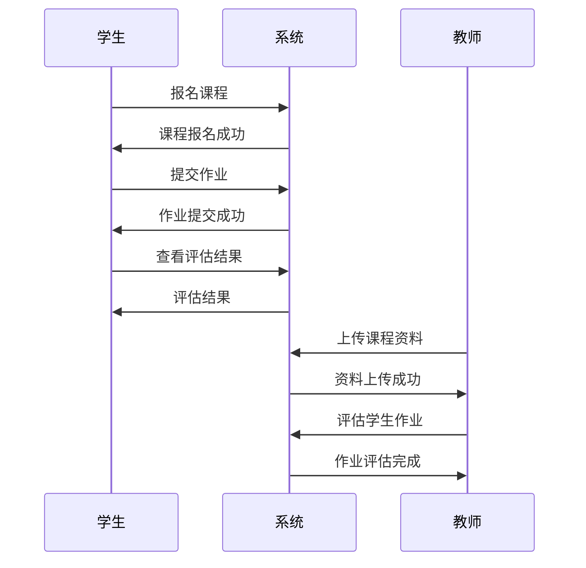
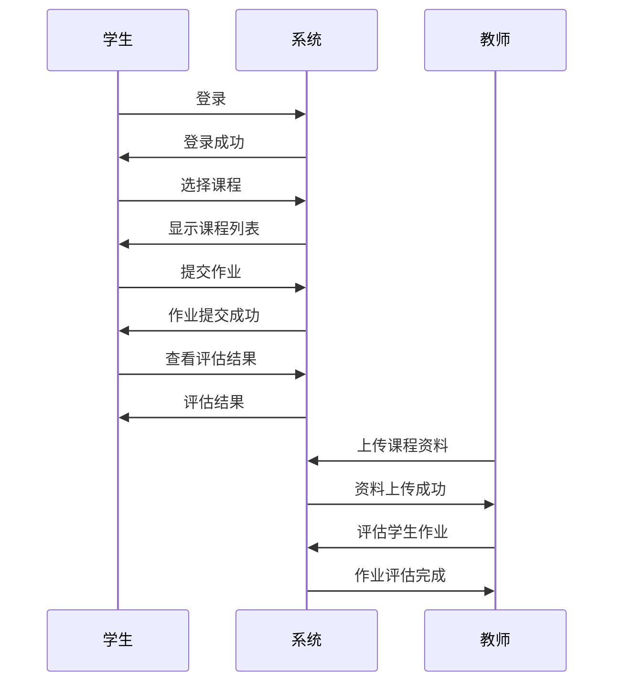

                 

### 让我们一步步思考：代际数字鸿沟消除计划

**摘要**：本文旨在探讨如何通过技术教育来消除代际数字鸿沟，并促进社会包容性。我们将从背景与现状分析、核心概念联系、技术教育策略、具体实施以及社区参与五个方面，系统地提出一个代际数字鸿沟消除计划。通过这一计划，我们希望推动教育公平，提高社会各阶层的数字技能水平，最终实现社会包容性。

**目录大纲**：

1. **第一部分：代际数字鸿沟的背景与现状**
   - 第1章：代际数字鸿沟概述
   - 第2章：核心概念与联系

2. **第二部分：代际数字鸿沟消除的技术教育策略**
   - 第3章：技术教育的概念与目标
   - 第4章：技术教育的层次与内容
   - 第5章：技术教育的实施方法

3. **第三部分：代际数字鸿沟消除计划的具体实施**
   - 第6章：教育政策与制度设计
   - 第7章：技术教育项目的实施

4. **第四部分：技术教育与社区参与**
   - 第8章：技术教育与社区参与

**1. 代际数字鸿沟的背景与现状**

**第1章：代际数字鸿沟概述**

**1.1 代际数字鸿沟的定义与分类**

**1.1.1 数字鸿沟的定义**

数字鸿沟是指由于信息技术（IT）的获取和利用程度不同，导致社会不同群体在经济、社会和文化方面的发展水平产生差距的现象。这个定义强调了信息技术在消除或者加剧代际差异中的作用。

**1.1.2 数字鸿沟的分类**

数字鸿沟可以从多个角度进行分类：

- **经济数字鸿沟**：指由于经济能力差异，导致不同社会群体在获取和使用IT资源上的差距。
- **社会数字鸿沟**：指由于社会地位、教育和文化水平的差异，导致不同社会群体在信息技术使用上的差距。
- **教育数字鸿沟**：指由于教育资源的不平等分配，导致学生在获取信息技术教育方面的差距。

**1.2 代际数字鸿沟的现状分析**

**1.2.1 全球范围内代际数字鸿沟的现状**

在全球范围内，代际数字鸿沟的现象普遍存在。发达国家的老年人群体由于技术接受能力和教育水平较低，数字技能相对薄弱，而年轻人则相对具备更高的数字技能和素养。

**1.2.2 我国代际数字鸿沟的现状**

在我国，随着互联网和信息技术的快速发展，代际数字鸿沟问题也日益突出。一方面，城市与农村之间的数字鸿沟依然存在；另一方面，老年人与年轻人之间的数字鸿沟也在不断加大。

**1.3 代际数字鸿沟的影响**

**1.3.1 教育领域的影响**

代际数字鸿沟导致教育资源的分配不均，使得不同社会群体在教育机会和成果上存在显著差异。

**1.3.2 社会领域的影响**

代际数字鸿沟加剧了社会不平等现象，使得社会不同群体之间的信任感和凝聚力减弱。

**1.4 代际数字鸿沟的成因**

**1.4.1 经济原因**

经济水平的不均衡导致不同社会群体在IT资源的获取和利用上存在巨大差异。

**1.4.2 教育原因**

教育水平的差异导致不同社会群体在数字技能和素养上的差距。

**1.4.3 社会文化原因**

社会文化观念的差异性使得部分群体对信息技术的接受和使用存在障碍。

**1.5 代际数字鸿沟的边界与外延**

**1.5.1 数字技能的边界**

数字鸿沟的边界不仅限于技术层面，还包括社会和文化层面。

**1.5.2 社会参与的边界**

代际数字鸿沟也影响了不同社会群体在社会参与和互动中的边界。

**1.6 本章小结**

本章通过对代际数字鸿沟的定义、现状、影响、成因及边界的分析，为我们理解这一现象提供了基础。接下来，我们将进一步探讨核心概念之间的联系，为消除代际数字鸿沟提供理论依据。

---

在接下来的章节中，我们将深入分析代际数字鸿沟消除计划的核心概念与联系，探讨技术教育在消除数字鸿沟中的关键作用。希望通过这一系列的分析，能为消除代际数字鸿沟、促进社会包容性提供有价值的思路和方法。敬请期待下一章的内容。

## 《代际数字鸿沟消除计划：促进社会包容性的技术教育》

### 第一部分：代际数字鸿沟的背景与现状

**第1章：代际数字鸿沟概述**

**1.1 代际数字鸿沟的定义与分类**

**1.1.1 数字鸿沟的定义**

数字鸿沟（Digital Divide）是指由于信息技术（IT）的获取和利用程度不同，导致社会不同群体在经济、社会和文化方面的发展水平产生差距的现象。这个概念最早由麻省理工学院的麻省理工学院媒介实验室（MIT Media Lab）在1995年提出，旨在探讨信息技术对社会发展的影响。

数字鸿沟的核心在于信息获取和利用的差距，它不仅包括硬件设备（如电脑、手机等）的差距，还包括软件应用、网络接入和数字素养等方面的差异。根据不同的维度，数字鸿沟可以分为多种类型。

**1.1.2 数字鸿沟的分类**

- **经济数字鸿沟**：由于经济水平的不均衡，导致不同社会群体在获取和使用IT资源上的差距。例如，高收入家庭可能更容易购买电脑和网络服务，而低收入家庭则可能在这方面面临困难。
  
- **社会数字鸿沟**：由于社会地位、教育和文化水平的差异，导致不同社会群体在信息技术使用上的差距。例如，受过高等教育的人群可能更擅长使用互联网进行学习、工作和社交，而受教育程度较低的人群则可能在这方面存在困难。

- **教育数字鸿沟**：由于教育资源的不平等分配，导致学生在获取信息技术教育方面的差距。例如，城市学校可能拥有更多的信息技术设备和优质教育资源，而农村学校则可能在这方面存在不足。

- **文化数字鸿沟**：由于文化观念、价值观念的差异，导致不同社会群体对信息技术的接受和使用存在障碍。例如，一些传统观念较强的群体可能对新兴的数字技术持怀疑态度，而另一些群体则可能更容易接受并应用这些技术。

**1.2 代际数字鸿沟的现状分析**

**1.2.1 全球范围内代际数字鸿沟的现状**

在全球范围内，代际数字鸿沟的现象普遍存在。特别是在发达国家，老年人与年轻人之间的数字鸿沟问题尤为突出。根据国际数据公司（IDC）的报告，全球范围内，50岁以上的老年人群体在数字技能和数字素养方面明显落后于年轻人。例如，在美国，60岁以上的老年人中，只有约50%的人使用互联网，而年轻人这一比例则高达90%以上。

此外，在全球贫困地区，由于经济条件和基础设施的限制，代际数字鸿沟问题同样严重。许多老年人由于缺乏基本的教育和培训机会，难以掌握必要的数字技能，而年轻人则由于接触新技术的机会较多，相对更容易适应数字化的生活方式。

**1.2.2 我国代际数字鸿沟的现状**

在我国，随着互联网和信息技术的快速发展，代际数字鸿沟问题也日益突出。一方面，城市与农村之间的数字鸿沟依然存在；另一方面，老年人与年轻人之间的数字鸿沟也在不断加大。

- **城乡数字鸿沟**：在我国，城市与农村之间的数字鸿沟问题较为明显。城市居民由于有更好的经济条件和基础设施，更容易获取和使用互联网和信息技术，而农村居民则由于经济水平较低、基础设施薄弱，在信息技术获取和使用上存在较大困难。

- **代际数字鸿沟**：随着互联网和移动通信技术的普及，年轻一代在数字技能和数字素养方面明显优于老年一代。例如，许多老年人由于不熟悉智能手机和网络应用，在使用互联网进行社交、购物、支付等方面存在一定困难，而年轻人则由于接触新技术较多，相对更容易掌握这些技能。

**1.3 代际数字鸿沟的影响**

**1.3.1 教育领域的影响**

代际数字鸿沟导致教育资源的分配不均，使得不同社会群体在教育机会和成果上存在显著差异。例如，城市学校由于有更好的信息技术设备和优质教育资源，学生在数字技能和素养方面明显优于农村学校的学生。这种差距不仅影响了学生的学业成绩，还可能导致学生未来的职业发展和生活品质。

**1.3.2 社会领域的影响**

代际数字鸿沟加剧了社会不平等现象，使得社会不同群体之间的信任感和凝聚力减弱。例如，由于数字技能的差异，老年人与年轻人之间的沟通和互动变得困难，导致双方在社交和情感上的隔阂。此外，数字鸿沟也可能导致社会资源的分配不均，使得一部分人无法充分利用数字技术带来的便利和机会。

**1.4 代际数字鸿沟的成因**

**1.4.1 经济原因**

经济水平的不均衡导致不同社会群体在IT资源的获取和利用上存在巨大差异。例如，高收入家庭可能更容易购买电脑、手机等硬件设备，而低收入家庭则可能在这方面面临困难。

**1.4.2 教育原因**

教育水平的差异导致不同社会群体在数字技能和素养上的差距。例如，受过高等教育的人群可能更擅长使用互联网进行学习、工作和社交，而受教育程度较低的人群则可能在这方面存在困难。

**1.4.3 社会文化原因**

社会文化观念的差异性使得部分群体对信息技术的接受和使用存在障碍。例如，一些传统观念较强的群体可能对新兴的数字技术持怀疑态度，而另一些群体则可能更容易接受并应用这些技术。

**1.5 代际数字鸿沟的边界与外延**

**1.5.1 数字技能的边界**

数字鸿沟的边界不仅限于技术层面，还包括社会和文化层面。例如，一个群体在技术上的数字鸿沟可能转化为社会地位和文化认同上的鸿沟。

**1.5.2 社会参与的边界**

代际数字鸿沟也影响了不同社会群体在社会参与和互动中的边界。例如，由于数字技能的差异，老年人可能无法像年轻人那样积极参与社交网络和在线社区，导致他们在社会互动中的边缘化。

**1.6 本章小结**

本章通过对代际数字鸿沟的定义、分类、现状、影响、成因及边界的分析，为我们理解这一现象提供了基础。在接下来的章节中，我们将进一步探讨消除代际数字鸿沟的核心概念与联系，以及技术教育在这一过程中发挥的关键作用。

### **1.6.1 小结**

本章首先定义了数字鸿沟，并详细分类了其表现形式，包括经济、社会、教育和文化数字鸿沟。接着，通过分析全球和我国的代际数字鸿沟现状，揭示了这一现象的普遍性和严重性。我们还探讨了代际数字鸿沟对教育和社会领域的影响，并分析了其成因和边界。这些分析为我们理解代际数字鸿沟提供了基础，也为后续章节探讨消除这一现象的方法和策略奠定了基础。

在下一章中，我们将进一步探讨数字鸿沟消除的定义、目标和与教育公平的关系，为制定代际数字鸿沟消除计划提供理论支持。敬请期待。

### **第2章：核心概念与联系**

#### **2.1 数字鸿沟消除的定义与目标**

**2.1.1 数字鸿沟消除的定义**

数字鸿沟消除（Digital Divide Eradication）是指通过政策和措施，努力缩小或消除由于信息技术（IT）获取和使用上的差距，从而实现社会各群体在数字领域内的平等发展。这一过程不仅涉及技术层面的改进，还包括社会、经济和文化层面的变革。

**2.1.2 数字鸿沟消除的目标**

数字鸿沟消除的主要目标包括：

- **公平获取IT资源**：确保所有社会群体都能公平地获取信息技术设备和网络服务。
- **提升数字素养**：通过教育和技术培训，提高各群体的数字技能和素养，使其能够有效地使用信息技术。
- **促进社会包容性**：通过消除数字鸿沟，增强不同社会群体之间的互动和融合，促进社会的整体进步。

**2.2 社会包容性的定义与特征**

**2.2.1 社会包容性的定义**

社会包容性（Social Inclusion）是指社会通过政策和措施，确保所有成员都能平等地参与社会生活，享有基本权利和机会，不受歧视和排斥。社会包容性的核心在于尊重多样性，促进社会各成员之间的和谐共处。

**2.2.2 社会包容性的特征**

- **公平性**：确保所有社会成员都能平等地享受社会资源和机会。
- **多样性**：尊重和包容社会中的各种差异，包括性别、种族、文化、宗教等。
- **参与性**：鼓励所有社会成员积极参与社会决策过程，发挥其作用。
- **持续性**：通过持续的政策和措施，确保社会包容性的长期稳定和有效。

**2.3 数字教育与技术教育的联系**

**2.3.1 数字教育与技术教育的定义**

- **数字教育**：指通过多种形式和手段，提高个人和群体的数字技能和素养，使其能够有效地使用信息技术。数字教育不仅包括基础信息技术教育，还包括高级数字技能培训，如编程、数据分析等。

- **技术教育**：指通过教授科学、工程和信息技术等学科的知识和技能，培养学生具备解决实际问题的能力。技术教育通常涉及硬件、软件、网络等技术的学习和应用。

**2.3.2 数字教育与技术教育的联系**

数字教育和技术教育是相辅相成的。数字教育为技术教育提供了基础，使学习者具备基本的数字技能和素养，从而能够更好地理解和应用技术教育中的知识和技能。技术教育则通过深入的技术培训，提高学习者的专业能力，使其能够适应快速变化的数字化社会。

**2.4 数字鸿沟消除与教育公平的关系**

**2.4.1 教育公平的定义**

教育公平（Educational Equity）是指所有社会成员在教育机会、资源和服务上享有平等的权利和机会，不受种族、性别、经济状况等因素的影响。

**2.4.2 教育公平与数字鸿沟消除的关系**

教育公平是数字鸿沟消除的重要基础。只有实现教育公平，才能确保所有社会成员都有机会获取信息技术教育和培训，提高数字技能和素养。同时，数字鸿沟消除也是实现教育公平的关键途径。通过消除数字鸿沟，可以确保教育资源的公平分配，提高教育质量，从而实现教育公平。

**2.5 本章小结**

本章通过对数字鸿沟消除、社会包容性、数字教育和技术教育以及教育公平的定义和关系的分析，为我们理解这些概念提供了清晰的认识。在消除代际数字鸿沟、促进社会包容性的过程中，数字教育和技术教育扮演着关键角色。通过下一章的内容，我们将进一步探讨具体的技术教育策略，以实现代际数字鸿沟的消除。

### **2.5.1 小结**

本章详细介绍了数字鸿沟消除、社会包容性、数字教育和技术教育以及教育公平等核心概念，并分析了它们之间的联系。我们理解到，数字鸿沟消除不仅是技术问题，更是一个社会问题，需要从多个维度进行综合治理。教育公平是实现数字鸿沟消除的基础，而数字教育和技术教育则是关键手段。在下一章中，我们将具体探讨如何通过技术教育来消除代际数字鸿沟，为促进社会包容性提供可行的策略。敬请期待。

### **第3章：技术教育的概念与目标**

#### **3.1 技术教育的定义**

技术教育（Technical Education）是指通过系统的教育和培训，培养学生掌握特定的技术知识和技能，以提高其解决实际问题的能力。技术教育通常涵盖多个领域，包括信息技术、工程技术、生物技术、智能制造等。其目标是通过传授专业知识和技术能力，帮助学生适应未来社会的需求，促进个人的职业发展和社会的整体进步。

#### **3.2 技术教育的目标**

技术教育的目标可以概括为以下几个方面：

1. **知识传授**：通过系统的课程设置，传授学生必要的基础理论和专业知识，使其对特定技术领域有全面、深入的理解。

2. **技能培养**：通过实践操作和项目实践，培养学生的实际操作能力和解决实际问题的能力，使其能够将理论知识应用于实际工作中。

3. **创新能力**：鼓励学生进行创新思维和实践，培养其独立思考和解决问题的能力，使其能够在技术领域进行创新和突破。

4. **职业发展**：通过技术教育，帮助学生掌握市场需求的技术技能，提高其就业竞争力，为其未来的职业发展奠定基础。

5. **社会贡献**：培养具有社会责任感的技术人才，使其能够为社会的发展做出贡献，促进社会的进步和繁荣。

#### **3.3 技术教育的层次**

技术教育可以根据学生的发展和市场需求分为不同层次：

1. **初级技术教育**：初级技术教育主要面向初学者，旨在传授基础的技术知识和技能。这一层次的教育通常包括职业教育和技术学院的教育，主要培养学生的基础操作技能和初步的专业知识。

2. **中级技术教育**：中级技术教育侧重于培养学生的专业技能，使其具备一定的实际操作能力和解决实际问题的能力。这一层次的教育通常包括中等职业院校和技术学院的教育，主要培养专业技术人才。

3. **高级技术教育**：高级技术教育主要面向具有一定专业基础和操作经验的学生，旨在进一步提高其技术水平和创新能力。这一层次的教育通常包括本科院校、研究生院以及一些专业培训机构的教育，主要培养高级技术人才和科研人员。

#### **3.4 技术教育的类型**

技术教育可以分为以下几种类型：

1. **学科型技术教育**：以特定学科为主，如计算机科学、机械工程、电子工程等，通过系统的课程设置和实验实践，培养学生在该领域的专业知识和技能。

2. **项目型技术教育**：以项目为导向，通过实际项目的实施，让学生在解决实际问题的过程中学习和掌握技术知识和技能。

3. **跨学科型技术教育**：跨学科型技术教育注重多学科知识的融合，通过跨学科的课程设置和项目实践，培养学生的综合能力和创新能力。

4. **职业教育**：职业教育侧重于培养学生的实际操作能力和专业技能，主要面向职业市场，以满足社会对技术人才的需求。

#### **3.5 技术教育的优势**

技术教育具有以下优势：

1. **培养实际操作能力**：通过实践操作和项目实践，学生能够将理论知识应用于实际工作中，提高其解决实际问题的能力。

2. **提升就业竞争力**：技术教育能够帮助学生掌握市场需求的技术技能，提高其就业竞争力，为其未来的职业发展奠定基础。

3. **促进创新和研发**：技术教育鼓励学生进行创新思维和实践，培养其独立思考和解决问题的能力，促进技术创新和研发。

4. **适应社会发展需求**：技术教育能够适应快速变化的社会需求，培养具有创新能力和实践能力的技术人才，为社会的发展做出贡献。

#### **3.6 技术教育的挑战**

技术教育也面临着一些挑战：

1. **教育资源不足**：由于技术教育对设备和师资的要求较高，许多地区和教育机构在资源配置上存在不足。

2. **教育质量参差不齐**：不同地区和学校之间的技术教育质量存在较大差异，部分学校在课程设置、教学方法和师资力量上存在不足。

3. **社会认知不足**：一些人对技术教育的认知存在误区，认为技术教育只注重技能培养，忽视理论知识的传授。

4. **就业市场变化**：随着科技的发展，技术领域的就业市场不断变化，技术教育需要及时调整课程内容和教学方法，以适应市场需求。

#### **3.7 技术教育的未来发展趋势**

技术教育的未来发展趋势包括：

1. **数字化转型**：随着数字技术的发展，技术教育将更加注重数字技能的培养，如编程、数据分析、人工智能等。

2. **个性化教育**：通过大数据和人工智能技术，实现个性化教学，满足不同学生的个性化需求。

3. **跨学科融合**：技术教育将更加注重多学科知识的融合，培养学生的跨学科能力和创新能力。

4. **国际交流与合作**：通过国际交流和合作，引进国外先进的教育理念和教学方法，提高技术教育的质量。

#### **3.8 本章小结**

本章详细介绍了技术教育的定义、目标、层次和类型，分析了其优势、挑战和未来发展趋势。技术教育不仅是培养技术人才的重要途径，也是促进社会发展和提高国家竞争力的重要手段。在消除代际数字鸿沟、促进社会包容性的过程中，技术教育发挥着关键作用。在下一章中，我们将进一步探讨技术教育的实施方法和策略，为消除代际数字鸿沟提供可行的方案。

### **3.8.1 小结**

本章深入探讨了技术教育的概念与目标，明确了技术教育的层次和类型，分析了其在促进社会发展和消除代际数字鸿沟中的重要作用。我们了解到，技术教育不仅注重知识的传授和技能的培养，还强调创新能力和职业发展的提升。同时，我们也认识到了技术教育在实施过程中面临的挑战和未来发展趋势。在下一章中，我们将具体讨论技术教育的实施方法和策略，为代际数字鸿沟的消除提供实践指导。敬请期待。

### **第4章：技术教育的层次与内容**

#### **4.1 初级技术教育**

**4.1.1 初级技术教育的定义**

初级技术教育（Primary Technical Education）主要面向初学者，旨在传授基础的技术知识和技能。这一层次的教育通常包括职业教育和技术学院的教育，主要培养学生的基础操作技能和初步的专业知识。

**4.1.2 初级技术教育的内容**

- **基础知识**：初级技术教育涵盖基础科学知识，如数学、物理、化学等，这些知识是掌握技术技能的基础。
- **技术操作**：通过实践操作，学生学会使用基本的工具和设备，掌握基本的技术操作方法。
- **初步的专业知识**：学生初步接触特定的技术领域，如机械制造、电子技术、信息技术等，了解专业的基本概念和原理。
- **职业道德和安全意识**：培养学生的职业道德和安全意识，确保其在未来工作中能够遵守行业规范和安全标准。

**4.1.3 初级技术教育的目标**

- **基础技能培养**：使学生掌握基本的技术操作技能，为后续的高级技术学习打下基础。
- **职业规划**：帮助学生了解不同技术领域的发展前景，为其未来的职业规划提供指导。
- **自我学习能力的培养**：通过实践操作和理论学习，培养学生的自我学习能力，使其能够独立解决技术问题。

#### **4.2 中级技术教育**

**4.2.1 中级技术教育的定义**

中级技术教育（Intermediate Technical Education）侧重于培养学生的专业技能，使其具备一定的实际操作能力和解决实际问题的能力。这一层次的教育通常包括中等职业院校和技术学院的教育，主要培养专业技术人才。

**4.2.2 中级技术教育的内容**

- **专业技能**：中级技术教育深入探讨特定技术领域的专业知识和技能，如编程、机械设计、电子电路等。
- **实践经验**：通过项目实践和实习，学生将所学知识应用于实际工作中，提高其解决实际问题的能力。
- **专业认证**：学生有机会参加专业认证考试，获得行业认可的专业资格证书，提高就业竞争力。
- **职业发展指导**：学校提供职业规划指导，帮助学生明确职业发展方向，为其未来的职业发展提供支持。

**4.2.3 中级技术教育的目标**

- **专业技能提升**：通过深入学习和实践，学生能够掌握一定的专业技能，满足行业需求。
- **实际工作能力培养**：通过项目实践和实习，学生能够适应实际工作环境，具备解决实际问题的能力。
- **职业认证**：通过专业认证考试，学生获得行业认可，提高就业竞争力。

#### **4.3 高级技术教育**

**4.3.1 高级技术教育的定义**

高级技术教育（Advanced Technical Education）主要面向具有一定专业基础和操作经验的学生，旨在进一步提高其技术水平和创新能力。这一层次的教育通常包括本科院校、研究生院以及一些专业培训机构的教育，主要培养高级技术人才和科研人员。

**4.3.2 高级技术教育的内容**

- **高级技术理论**：高级技术教育深入探讨特定技术领域的高级理论和前沿知识，如人工智能、大数据分析、纳米技术等。
- **技术创新实践**：通过创新项目和科研项目，学生能够参与实际的技术创新，提高其研究能力和创新能力。
- **国际合作与交流**：学校提供国际交流和合作机会，使学生能够了解国际前沿技术和研究动态。
- **继续教育与培训**：学校提供继续教育和培训课程，帮助学生不断更新知识和技能，适应行业的发展需求。

**4.3.3 高级技术教育的目标**

- **技术创新能力培养**：通过技术创新实践，学生能够掌握先进的技术方法和工具，具备进行技术创新的能力。
- **高级专业技术能力提升**：通过深入学习和实践，学生能够掌握高级专业技术知识和技能，成为行业内的专家。
- **科研能力培养**：通过科研项目和学术交流，学生能够培养科研能力，为未来的学术研究和职业发展打下基础。

#### **4.4 技术教育的不同层次和内容的关联**

初级技术教育、中级技术教育和高级技术教育之间存在着密切的联系和递进关系：

- **初级技术教育**为学生提供基础知识和初步的专业技能，为其未来的学习和职业发展打下基础。
- **中级技术教育**在初级技术教育的基础上，深入培养学生的专业技能和实际工作能力，使其能够胜任中等技术岗位。
- **高级技术教育**则进一步深化学生的专业知识和技能，培养其创新能力和科研能力，使其能够胜任高级技术岗位和科研工作。

#### **4.5 技术教育的课程设计**

技术教育的课程设计应该结合不同层次和内容的特点，确保学生能够系统、全面地掌握技术知识和技能：

- **基础课程**：包括数学、物理、化学等基础科学课程，为学生提供技术学习和实践的基础。
- **专业课程**：根据不同技术领域设置专业课程，如计算机科学、机械工程、电子工程等，深入探讨专业知识和技能。
- **实践课程**：通过实验、实习、项目实践等课程，使学生能够将理论知识应用于实际工作中，提高其实践能力。
- **选修课程**：提供选修课程，如编程、数据分析、人工智能等，满足学生的个性化需求，提高其综合素质。

#### **4.6 本章小结**

本章详细介绍了技术教育的不同层次和内容，包括初级技术教育、中级技术教育和高级技术教育。通过分析各层次和内容的特点和关联，我们认识到技术教育是一个系统化的过程，不同层次和内容之间相互关联、递进发展。在消除代际数字鸿沟、促进社会包容性的过程中，技术教育发挥着关键作用。在下一章中，我们将进一步探讨技术教育的实施方法和策略，为消除代际数字鸿沟提供具体的实践指导。敬请期待。

### **4.6.1 小结**

本章详细分析了技术教育的不同层次和内容，从初级技术教育到高级技术教育，每个层次都有其独特的作用和目标。我们了解到，初级技术教育为基础知识和技术操作打下基础，中级技术教育注重专业技能的培养和实际工作能力的提升，而高级技术教育则致力于技术创新能力和科研能力的培养。这些层次和内容相互关联，构成了一个系统化的技术教育体系。在消除代际数字鸿沟、促进社会包容性的过程中，技术教育具有关键作用。在下一章中，我们将探讨具体的技术教育实施方法和策略，以实现代际数字鸿沟的消除。敬请期待。

### **第5章：技术教育的实施方法**

#### **5.1 传统教学方法**

**5.1.1 传统教学方法的定义**

传统教学方法（Traditional Teaching Methods）是指通过课堂讲授、黑板书写、教科书阅读等传统的教学手段来传授知识和技能。这种方法在技术教育中历史悠久，具有以下特点：

- **以教师为中心**：传统教学方法强调教师的权威和主导地位，教师通过讲解、示范等方式传授知识，学生被动接受。
- **注重理论知识**：传统教学方法更注重理论知识的传授，通过教科书和课堂讲解，使学生掌握基本概念和原理。
- **标准化考试**：传统教学方法通常通过标准化考试来评估学生的掌握情况，考试成绩是评价学生能力和成绩的重要依据。

**5.1.2 传统教学方法的优点**

- **系统性**：传统教学方法能够系统、全面地传授知识，确保学生掌握基本的理论框架。
- **效率高**：教师可以在较短时间内传递大量知识，提高教学效率。
- **标准化**：通过标准化考试，可以公平、公正地评估学生的掌握情况，便于教师和教育管理者进行教学质量监控。

**5.1.3 传统教学方法的缺点**

- **缺乏互动**：传统教学方法缺乏师生之间的互动，学生难以主动参与和提出问题，影响学习效果。
- **个性化不足**：传统教学方法难以满足学生的个性化需求，容易导致“一刀切”的教学方式。
- **实践能力不足**：传统教学方法注重理论知识的传授，但缺乏实践环节，学生的实际操作能力和解决实际问题的能力可能不足。

**5.2 现代教学方法**

**5.2.1 现代教学方法的定义**

现代教学方法（Modern Teaching Methods）是指利用现代信息技术和教学工具，通过多样化、互动性的教学方式来传授知识和技能。这种方法在技术教育中逐渐兴起，具有以下特点：

- **以学生为中心**：现代教学方法强调学生的主体地位，通过自主学习、讨论互动等方式，培养学生的主动性和创造性。
- **注重实践能力**：现代教学方法强调实践能力的培养，通过项目实践、实验操作等方式，使学生将理论知识应用于实际工作中。
- **个性化教学**：现代教学方法利用大数据和人工智能技术，实现个性化教学，满足学生的个性化需求。

**5.2.2 现代教学方法的优点**

- **互动性强**：现代教学方法通过在线讨论、小组合作等方式，增强师生之间的互动，提高学习效果。
- **个性化教学**：现代教学方法利用大数据和人工智能技术，分析学生的学习行为和需求，提供个性化的学习资源和指导。
- **实践性强**：现代教学方法通过项目实践、实验操作等方式，增强学生的实际操作能力和解决实际问题的能力。

**5.2.3 现代教学方法的缺点**

- **技术依赖性**：现代教学方法依赖现代信息技术和教学工具，对设备和网络环境有较高要求，可能增加教学成本。
- **教学资源要求高**：现代教学方法需要丰富的数字化教学资源和高质量的教师，这对教师的专业素养和教学资源管理能力提出了更高要求。
- **教学效果评估难度大**：现代教学方法的多样性和互动性使得教学效果评估变得复杂，难以用传统的评价方式来衡量。

**5.3 混合教学方法**

**5.3.1 混合教学方法的定义**

混合教学方法（Blended Teaching Method）是将传统教学方法和现代教学方法相结合，通过多种教学手段和形式，实现教学目标的最优化。这种方法具有以下特点：

- **多样化教学手段**：结合传统教学方法和现代教学方法的优点，采用多种教学手段，如课堂讲授、在线学习、实验操作等。
- **灵活的教学安排**：根据教学内容和学生的实际情况，灵活调整教学进度和方式，提高教学效果。
- **综合评估**：通过多种评价方式，如笔试、实验、项目等，全面评估学生的掌握情况，确保教学目标的实现。

**5.3.2 混合教学方法的优点**

- **提高教学效果**：通过多样化教学手段和灵活的教学安排，提高学生的学习兴趣和参与度，增强教学效果。
- **个性化教学**：结合传统教学方法和现代教学方法的优势，实现个性化教学，满足不同学生的需求。
- **综合能力培养**：通过多种教学手段和形式的结合，培养学生的理论知识和实践能力，提高其综合素质。

**5.3.3 混合教学方法的缺点**

- **教学管理复杂**：混合教学方法需要协调传统教学和在线教学，对教学管理和组织能力提出了更高要求。
- **技术支持要求高**：混合教学方法依赖现代信息技术和教学工具，需要提供稳定的技术支持和设备保障。
- **教师培训要求高**：教师需要具备现代信息技术和教学方法的应用能力，这对教师的培训和专业发展提出了更高要求。

#### **5.4 技术教育的资源分配与利用**

**5.4.1 教育资源的定义**

教育资源是指用于教学和学习的各种物质和非物质资源，包括教材、设备、师资、资金、网络等。教育资源的合理分配和利用对于技术教育的实施至关重要。

**5.4.2 教育资源的分配**

- **公平分配**：教育资源应该公平分配，确保所有学生都能享有平等的学习机会和资源。
- **合理配置**：根据不同地区、学校和学生的情况，合理配置教育资源，确保教育资源的有效利用。

**5.4.3 教育资源的利用**

- **提高使用效率**：通过优化教育资源的管理和使用，提高教育资源的利用效率，减少资源浪费。
- **拓展资源渠道**：通过政府支持、社会捐赠、校企合作等多种渠道，拓展教育资源，提高教育资源的丰富度。

#### **5.5 技术教育的评估与改进**

**5.5.1 教育评估的定义**

教育评估（Educational Assessment）是指通过系统的方法和手段，对教学过程、教学效果和教育资源的使用进行评价，以改进教学质量和提高教育效果。

**5.5.2 教育评估的方法**

- **形成性评估**：在教学中进行持续性的评估，通过反馈和调整，及时改进教学过程。
- **总结性评估**：在课程结束后进行评估，总结教学效果，为后续教学提供参考。
- **绩效评估**：通过评估学生的学业成绩、实践能力和综合素质，衡量教学效果。

**5.5.3 教育评估的改进**

- **科学评估**：采用科学的评估方法和工具，确保评估结果的准确性和可靠性。
- **持续改进**：根据评估结果，不断调整和改进教学方法和策略，提高教学质量。
- **反馈机制**：建立有效的反馈机制，及时收集学生的意见和建议，改进教学过程。

#### **5.6 本章小结**

本章详细探讨了技术教育的实施方法，包括传统教学方法、现代教学方法、混合教学方法以及技术教育的资源分配与利用和评估与改进。通过分析各种方法的优点和缺点，我们认识到，技术教育的实施需要结合多种教学方法，优化教育资源的分配和利用，并进行科学的评估与改进。在消除代际数字鸿沟、促进社会包容性的过程中，技术教育发挥着关键作用。在下一章中，我们将进一步探讨具体的技术教育策略，以实现代际数字鸿沟的消除。敬请期待。

### **5.6.1 小结**

本章全面探讨了技术教育的实施方法，包括传统教学方法、现代教学方法、混合教学方法，以及教育资源的分配与利用和评估与改进。我们了解到，每种教学方法都有其独特的优势和局限性，而在实际教学中，通常需要结合多种教学方法，以实现最佳的教育效果。教育资源的合理分配和有效利用对于技术教育至关重要，而科学的评估与改进则是持续提升教学质量的关键。在消除代际数字鸿沟、促进社会包容性的过程中，技术教育策略的选择和实施具有决定性作用。在下一章中，我们将进一步探讨代际数字鸿沟消除计划的具体实施策略，敬请期待。

### **第6章：教育政策与制度设计**

#### **6.1 教育政策的设计原则**

**6.1.1 公平原则**

公平原则是教育政策设计的核心原则之一。公平原则要求教育资源分配和教育机会提供应当公平，确保所有学生，无论其家庭背景、社会经济地位、种族、性别或其他特征，都能享有平等的教育机会。在技术教育领域，公平原则体现为：

- **资源公平分配**：确保教育资源的合理配置，包括资金、设备、师资等，使不同地区和学校的学生都能获得同等质量的教育。
- **机会公平**：消除因经济或社会原因导致的受教育机会不平等，例如，通过补贴或奖学金等方式，支持贫困家庭学生接受技术教育。

**6.1.2 可持续原则**

可持续原则要求教育政策的设计和实施应当具有长期的视角，注重教育体系的可持续发展和自我维持能力。在技术教育领域，可持续原则体现为：

- **长期投资**：政府和社会应长期投资于技术教育，确保教育资源的持续供给和质量的不断提升。
- **自我发展能力**：教育体系应培养学生的自我学习和创新能力，使其能够适应不断变化的社会和技术环境。

**6.1.3 可操作原则**

可操作原则要求教育政策的设计应具备可操作性，即政策目标和方案必须是具体、可行和可测量的。在技术教育领域，可操作原则体现为：

- **具体目标**：设定明确的教育目标，例如提高学生的技术素养、培养创新人才等。
- **可测量指标**：建立可量化的评估指标，例如通过考试、项目实践等手段，评估学生的技术能力和综合素质。

**6.2 教育制度的设计**

**6.2.1 教育体系的构建**

教育体系的设计应当全面、系统，涵盖从基础教育到高等教育的各个阶段，确保教育体系内部各层次、各环节的衔接和协调。在技术教育领域，教育体系的构建应包括以下几个方面：

- **基础技术教育**：从小学开始，培养学生的基本技术素养和科学素养，使其具备初步的技术理解能力。
- **中等技术教育**：在中职和技校阶段，提供专门的技术教育，使学生掌握特定的技术知识和技能。
- **高等技术教育**：在大学和科研机构中，提供高级技术教育和研究生教育，培养学生的技术研究和创新能力。

**6.2.2 教育资源的配置**

教育资源的配置是教育制度设计的关键环节，直接影响教育质量和教育公平。在技术教育领域，教育资源的配置应考虑以下几个方面：

- **资金投入**：政府应加大对技术教育的资金投入，确保教育资源的充足性和稳定性。
- **设备更新**：定期更新教学设备和技术设施，确保学生能够接触到最新的技术和工具。
- **师资力量**：加强教师队伍建设，提高教师的专业素养和教学能力，确保教学质量。

**6.2.3 教育质量的保障**

教育质量的保障是教育制度设计的核心目标之一。在技术教育领域，保障教育质量应采取以下措施：

- **质量标准**：制定统一的教育质量标准，确保不同学校、不同地区的技术教育质量达到基本要求。
- **质量评估**：建立定期的教育质量评估体系，通过评估发现问题和改进措施，持续提高教育质量。
- **激励机制**：设立激励机制，鼓励学校和教育工作者不断提高教育质量，例如通过教学质量评价、教师职称评定等。

**6.3 政策与制度的实施效果评估**

**6.3.1 评估指标的选择**

评估教育政策与制度的实施效果，需要选择合适的评估指标。在技术教育领域，评估指标可以包括：

- **教育覆盖面**：评估技术教育的普及程度，包括入学率、完成率等。
- **教育质量**：评估学生的技术素养、实践能力和创新能力，例如通过考试、项目实践等手段。
- **就业情况**：评估学生毕业后的就业情况和职业发展，了解技术教育的实际效果。

**6.3.2 评估方法的运用**

在运用评估方法时，可以采用定量和定性相结合的方式：

- **定量评估**：通过统计数据和分析方法，评估教育政策的实施效果，例如通过调查问卷、考试成绩等。
- **定性评估**：通过访谈、观察、案例分析等方法，深入了解教育政策在实际执行中的问题和效果。

**6.3.3 评估结果的反馈与调整**

评估结果应及时反馈给教育决策者和实施者，根据评估结果进行相应的调整和改进：

- **结果反馈**：将评估结果公开，让社会各界了解技术教育的实施情况。
- **调整政策**：根据评估结果，调整教育政策，优化资源配置，改进教学方法。
- **持续改进**：建立持续的评估与改进机制，确保教育政策与制度的不断完善和优化。

**6.4 政策与制度的国际经验借鉴**

**6.4.1 发达国家的经验**

发达国家在技术教育政策和制度设计方面积累了丰富的经验，值得我们借鉴。以下是一些发达国家的成功经验：

- **重视基础技术教育**：美国、日本等发达国家从小学阶段开始，就注重培养学生的技术素养和科学素养。
- **职业教育体系完善**：德国、瑞士等国家的职业教育体系成熟，学生可以根据自己的兴趣和特长选择不同的职业方向。
- **企业参与教育**：许多发达国家鼓励企业参与职业教育，通过校企合作，提高教育质量和实用性。

**6.4.2 发展中国家的经验**

发展中国家在技术教育政策和制度设计方面也取得了一定的成果，例如：

- **政府主导**：许多发展中国家政府高度重视技术教育，通过政策引导和资金投入，推动技术教育的发展。
- **因地制宜**：发展中国家根据自身国情，采取灵活的教育政策和措施，例如在农村地区推广远程教育，提高教育覆盖面。

**6.5 本章小结**

本章详细探讨了教育政策与制度设计的原则、教育体系的构建、教育资源的配置、教育质量的保障、实施效果评估以及国际经验借鉴。教育政策与制度的设计和实施是消除代际数字鸿沟、促进社会包容性的关键。在下一章中，我们将进一步探讨技术教育项目的具体实施，以实现代际数字鸿沟的消除。敬请期待。

### **6.5.1 小结**

本章深入分析了教育政策与制度设计的原则，包括公平、可持续和可操作性，并探讨了教育体系的构建、教育资源的配置、教育质量的保障和实施效果评估。同时，我们借鉴了发达国家和发展中国家的经验，为技术教育的政策与制度设计提供了有益的参考。这些探讨和借鉴为我们理解如何通过教育政策与制度来消除代际数字鸿沟奠定了基础。在下一章中，我们将具体探讨技术教育项目的实施，以实现代际数字鸿沟的消除目标。敬请期待。

### **第7章：技术教育项目的实施**

#### **7.1 技术教育项目的定义与分类**

**7.1.1 技术教育项目的定义**

技术教育项目（Technical Education Project）是指通过系统的计划和实施，旨在提高学生或特定群体技术素养和能力的一系列教育活动的总和。这些项目通常由教育机构、政府组织或非政府组织发起，旨在满足特定教育需求或解决特定教育问题。

**7.1.2 技术教育项目的分类**

- **按目标群体分类**：根据目标群体的不同，技术教育项目可以分为以下几类：
  - **基础教育项目**：面向中小学生，旨在提高其基础技术素养。
  - **职业教育项目**：面向职业教育阶段的学生，培养其专业技术和实际操作能力。
  - **继续教育项目**：面向已就业人员或成人，提高其职业能力和技术素养。

- **按实施形式分类**：根据实施形式的不同，技术教育项目可以分为以下几类：
  - **课堂教育项目**：在传统的学校环境中，通过课堂教学进行的技术教育。
  - **在线教育项目**：通过互联网平台进行的技术教育，包括在线课程、网络研讨会等。
  - **混合教育项目**：结合传统课堂教育和在线教育的优点，实现教学效果的最优化。

#### **7.2 技术教育项目的规划与设计**

**7.2.1 项目目标的确立**

项目目标的确立是技术教育项目规划的首要步骤。明确的项目目标有助于指导项目的实施和评估。项目目标应具体、可衡量、可实现、相关性强和有时限（SMART原则）。

- **具体**：项目目标应明确具体，例如提高学生的编程能力或提升员工的IT技能。
- **可衡量**：项目目标应具有可量化的指标，例如通过考试分数或技能认证来衡量。
- **可实现**：项目目标应在资源和时间的限制内实现，避免不切实际的目标。
- **相关性强**：项目目标应与整体教育目标或社会需求紧密相关。
- **有时限**：项目目标应设定明确的时间框架，以便监控进度和评估效果。

**7.2.2 项目内容的规划**

项目内容的规划是技术教育项目设计的关键环节。项目内容应涵盖所需的技术知识和技能，同时考虑不同学习者的需求和能力。

- **课程设置**：根据项目目标，设计合理的课程设置，包括理论课程和实践课程。理论课程应教授基本概念和原理，实践课程应提供实际操作和项目实践的机会。
- **教学方法**：结合现代教学方法和传统教学方法，选择最适合项目目标和学习者需求的教学方法。例如，在线教育项目可能更侧重于互动性和灵活性，而课堂教育项目则更注重教师的指导和互动。
- **教学资源**：准备充足的教学资源，包括教材、课件、实验设备等，确保教学过程的顺利进行。

**7.2.3 项目预算的编制**

项目预算的编制是项目规划的重要部分，它涉及到项目的资金来源、分配和使用。合理的预算编制有助于确保项目的顺利实施和目标的实现。

- **资金来源**：项目预算应明确资金来源，包括政府拨款、企业赞助、社会捐赠等。
- **资金分配**：根据项目内容和需求，合理分配资金，确保各项活动都有足够的资金支持。
- **资金使用**：监控资金的使用情况，确保资金用于项目计划和目标，避免浪费和挪用。

#### **7.3 技术教育项目的实施与管理**

**7.3.1 项目团队的建设**

项目团队的建设是技术教育项目成功实施的关键。项目团队应包括以下成员：

- **项目经理**：负责项目的整体规划、执行和监督，确保项目按计划顺利进行。
- **课程设计师**：负责课程的设计和开发，确保课程内容符合项目目标和学习者需求。
- **教师**：负责教学活动的实施，教授学生技术知识和技能，并提供指导和支持。
- **技术人员**：负责技术平台的搭建和维护，确保在线教育项目的顺利进行。

**7.3.2 项目进度的控制**

项目进度的控制是确保项目按计划进行的重要手段。项目经理应采取以下措施：

- **制定进度计划**：根据项目目标和任务，制定详细的进度计划，明确各项活动的开始和结束时间。
- **监控进度**：定期监控项目进度，确保各项活动按计划进行，及时识别和解决潜在的问题。
- **调整计划**：根据实际情况和进度监控结果，适时调整进度计划，确保项目按时完成。

**7.3.3 项目质量的保障**

项目质量的保障是技术教育项目成功实施的重要保障。项目团队应采取以下措施：

- **质量标准**：制定明确的质量标准，确保教学过程和教学成果符合既定标准。
- **质量评估**：定期进行质量评估，通过考试、项目评估等方式，评估学生的技术素养和能力。
- **持续改进**：根据质量评估结果，不断改进教学方法和课程设计，提高教学质量。

#### **7.4 技术教育项目的评估与反馈**

**7.4.1 项目效果的评估**

项目效果的评估是确保项目达到预期目标的重要步骤。项目评估应包括以下方面：

- **学习成果评估**：通过考试、项目实践等方式，评估学生的技术素养和能力。
- **满意度评估**：通过问卷调查、访谈等方式，了解学生和教师对项目的满意度。
- **就业情况评估**：评估学生毕业后的就业情况，了解项目对学生职业发展的影响。

**7.4.2 项目问题的反馈**

项目问题的反馈是项目持续改进的重要环节。项目团队应采取以下措施：

- **问题收集**：通过调查问卷、教师反馈、学生反馈等方式，收集项目实施中的问题和挑战。
- **问题分析**：对收集到的问题进行分析，识别问题的根本原因。
- **问题解决**：制定解决方案，及时解决项目实施中的问题。

**7.4.3 项目的持续改进**

项目的持续改进是确保项目长期成功的关键。项目团队应采取以下措施：

- **定期评估**：定期对项目进行评估，确保项目始终符合教育需求和目标。
- **反馈机制**：建立有效的反馈机制，确保问题和建议能够及时传递和解决。
- **持续优化**：根据评估结果和反馈，不断优化项目的设计和实施，提高项目的质量和效果。

#### **7.5 技术教育项目的案例研究**

**7.5.1 案例一：某贫困地区的数字技能培训项目**

**背景介绍**：某贫困地区由于经济条件和技术设施的落后，当地居民在数字技能方面存在严重不足。为提高当地居民的数字素养和就业能力，当地政府和非政府组织联合发起了一项数字技能培训项目。

**项目介绍**：
- **项目目标**：提高当地居民的数字技能，增强其就业能力。
- **项目内容**：包括基础计算机操作、互联网使用、办公软件应用等。
- **项目实施**：通过定期举办培训班，邀请专业教师授课，并利用在线平台提供课后辅导。

**系统功能设计**：
- **课程管理系统**：用于管理课程信息、学生报名和课程安排。
- **学习管理系统**：用于学生进行在线学习和作业提交。
- **评估系统**：用于评估学生的学习成果和教师的教学效果。

**系统架构设计**：
- **前端**：使用HTML、CSS和JavaScript开发，提供用户友好的界面。
- **后端**：使用Python和Django框架开发，提供数据存储和处理功能。
- **数据库**：使用MySQL存储用户、课程、作业和评估数据。

**系统接口设计**：
- **用户接口**：学生和教师可以通过网页进行课程报名、学习、作业提交和评估。
- **管理接口**：管理员可以进行课程管理、学生管理和评估管理。

**系统交互序列图**：



**代码实现示例**：

```python
# 假设这是一个简单的课程管理系统

# 用户报名课程
def enroll_course(user_id, course_id):
    # 查询用户是否已报名该课程
    if user_enrolled(user_id, course_id):
        return "您已报名此课程"
    else:
        # 将用户报名信息存储到数据库
        add_enrollment(user_id, course_id)
        return "报名成功"

# 用户提交作业
def submit_assignment(user_id, assignment_id, assignment):
    # 检查用户是否已报名该课程
    if not user_enrolled(user_id, assignment_id):
        return "您尚未报名此课程"
    else:
        # 存储作业到数据库
        save_assignment(user_id, assignment_id, assignment)
        return "作业提交成功"

# 学生查看评估结果
def view_grade(user_id, assignment_id):
    # 查询作业评估结果
    grade = get_grade(user_id, assignment_id)
    return grade

# 教师评估作业
def grade_assignment(teacher_id, assignment_id, grade):
    # 更新作业评估结果
    update_grade(assignment_id, grade)
    return "作业评估完成"
```

**实际案例分析**：

**案例一**：在某贫困地区，数字技能培训项目的实施取得了显著成效。通过定期的培训班和在线辅导，当地居民的数字技能得到了显著提升。项目结束后，许多受训者成功找到了与数字技能相关的工作，提升了收入和生活质量。

**项目小结**：

- **成功因素**：政府和非政府组织的共同努力，充足的教学资源，灵活的教学方法和有效的项目实施和管理。
- **挑战与对策**：项目面临的挑战包括资金不足、技术设施落后和教师短缺。通过多方合作、技术支持和教师培训，这些问题得到了有效解决。

#### **7.5.2 案例二：某发展中国家的女性技术教育项目**

**背景介绍**：在某个发展中国家，女性在技术教育和就业方面面临严重的不平等。为提高女性技术素养和就业能力，国际组织和当地政府联合发起了一项专门针对女性的技术教育项目。

**项目介绍**：
- **项目目标**：提高女性技术素养，增强其就业能力，促进性别平等。
- **项目内容**：包括计算机基础、编程、数据分析等课程。
- **项目实施**：通过远程教育和面对面授课相结合的方式，确保女性能够灵活地参与学习。

**系统功能设计**：
- **在线课程平台**：提供在线课程、视频教程和互动讨论区。
- **作业提交系统**：学生可以通过该系统提交作业。
- **评估系统**：用于评估学生的学习成果。

**系统架构设计**：
- **前端**：使用React框架开发，提供丰富的交互功能。
- **后端**：使用Node.js和Express框架，提供数据存储和处理功能。
- **数据库**：使用MongoDB存储用户、课程和作业数据。

**系统接口设计**：
- **学生接口**：学生可以通过网页进行在线学习、作业提交和评估查询。
- **教师接口**：教师可以通过网页管理课程、批改作业和评估学生。

**系统交互序列图**：



**代码实现示例**：

```javascript
// 假设这是一个简单的在线课程平台

// 学生登录
async function loginUser(credentials) {
    const response = await fetch('/api/login', {
        method: 'POST',
        body: JSON.stringify(credentials),
        headers: { 'Content-Type': 'application/json' }
    });
    const data = await response.json();
    return data;
}

// 学生选择课程
async function selectCourse(studentId, courseId) {
    const response = await fetch(`/api/students/${studentId}/courses/${courseId}`, {
        method: 'POST'
    });
    const data = await response.json();
    return data;
}

// 学生提交作业
async function submitAssignment(studentId, assignmentId, assignment) {
    const response = await fetch(`/api/students/${studentId}/assignments/${assignmentId}`, {
        method: 'POST',
        body: JSON.stringify(assignment),
        headers: { 'Content-Type': 'application/json' }
    });
    const data = await response.json();
    return data;
}

// 学生查看评估结果
async function viewGrade(studentId, assignmentId) {
    const response = await fetch(`/api/students/${studentId}/assignments/${assignmentId}/grade`, {
        method: 'GET'
    });
    const data = await response.json();
    return data;
}

// 教师上传课程资料
async function uploadCourseMaterial(teacherId, courseId, material) {
    const response = await fetch(`/api/teachers/${teacherId}/courses/${courseId}/materials`, {
        method: 'POST',
        body: JSON.stringify(material),
        headers: { 'Content-Type': 'application/json' }
    });
    const data = await response.json();
    return data;
}

// 教师评估学生作业
async function gradeAssignment(teacherId, assignmentId, grade) {
    const response = await fetch(`/api/teachers/${teacherId}/assignments/${assignmentId}/grade`, {
        method: 'PUT',
        body: JSON.stringify(grade),
        headers: { 'Content-Type': 'application/json' }
    });
    const data = await response.json();
    return data;
}
```

**实际案例分析**：

**案例二**：该项目在发展中国家取得了显著成效。通过在线课程平台和面对面授课，许多女性学员成功掌握了技术技能，提高了就业机会和收入水平。项目不仅提高了女性的技术素养，也促进了性别平等和社会发展。

**项目小结**：

- **成功因素**：结合远程教育和面对面授课，灵活的教学方法，以及针对女性的定制化课程设计。
- **挑战与对策**：项目面临的挑战包括技术设施不足、女性参与度低等。通过技术支持和社区动员，这些挑战得到了有效解决。

#### **7.6 本章小结**

本章详细探讨了技术教育项目的定义、分类、规划与设计、实施与管理以及评估与反馈。通过两个实际案例的研究，我们展示了技术教育项目在提高学生技术素养和就业能力方面的显著成效。在消除代际数字鸿沟、促进社会包容性的过程中，技术教育项目的实施具有关键作用。在下一章中，我们将进一步探讨技术教育与社区参与的关系，以实现更广泛的社会包容性。敬请期待。

### **7.6.1 小结**

本章全面阐述了技术教育项目的定义、分类、规划与设计、实施与管理以及评估与反馈。通过两个具体的案例，我们深入了解了技术教育项目在实际操作中的应用和效果。这些项目不仅显著提高了学生的技术素养和就业能力，还在一定程度上促进了社会的包容性和公平性。在消除代际数字鸿沟的过程中，技术教育项目发挥着至关重要的作用。在下一章中，我们将探讨技术教育与社区参与的关系，进一步深化我们对如何通过技术教育实现社会包容性的理解。敬请期待。

### **第8章：技术教育与社区参与**

#### **8.1 社区参与的定义与作用**

**8.1.1 社区参与的定义**

社区参与（Community Engagement）是指社区居民积极参与到社区建设和公共事务管理中，通过协作和共同努力，共同解决社区问题和改善社区环境。在技术教育领域，社区参与特指社区居民通过参与技术教育和相关活动，提升自身的数字技能和素养，从而更好地适应数字社会。

**8.1.2 社区参与的作用**

社区参与在技术教育中发挥着重要作用，主要体现在以下几个方面：

- **提高数字素养**：社区参与技术教育活动，有助于提高社区居民的数字素养，使其能够熟练使用信息技术，提高生活质量。
- **促进社会融合**：通过技术教育，社区居民可以更好地融入数字社会，减少数字鸿沟，促进社会各阶层的融合和交流。
- **增强社区凝聚力**：社区参与技术教育，可以增强社区居民的归属感和责任感，提升社区凝聚力。
- **推动社区发展**：技术教育可以培养社区居民的创新意识和创业精神，推动社区经济和社会的发展。

#### **8.2 社区参与的形式与方法**

**8.2.1 社区参与的形式**

社区参与的形式多样，主要包括以下几种：

- **技术培训**：组织技术培训课程，帮助社区居民掌握基本的数字技能，如电脑操作、互联网使用、社交媒体应用等。
- **项目合作**：与社区组织和企业合作，共同开展技术教育和创新项目，推动社区技术发展和应用。
- **社区活动**：举办社区技术展览、研讨会、竞赛等活动，激发社区居民对技术教育的兴趣和参与热情。
- **资源共享**：建立社区技术共享中心，提供电脑、网络设备等资源，方便社区居民学习和交流。

**8.2.2 社区参与的方法**

社区参与的实现需要多种方法的结合，以下是一些常用的方法：

- **动员与宣传**：通过宣传栏、广播、社交媒体等渠道，动员社区居民参与技术教育活动，提高其参与意识。
- **教育培训**：邀请专业教师或技术人员，定期开展技术培训课程，提高社区居民的数字技能。
- **互动交流**：组织社区论坛、技术沙龙等活动，鼓励社区居民分享技术知识和经验，促进互动交流。
- **项目支持**：提供资金、技术支持和资源，支持社区技术教育和创新项目的开展。

#### **8.3 社区参与的技术教育项目**

**8.3.1 项目设计与实施**

社区参与的技术教育项目设计应充分考虑社区需求，制定明确的目标和计划。以下是一个典型的技术教育项目设计与实施过程：

1. **需求分析**：通过调查问卷、访谈等方式，了解社区居民的技术需求和兴趣，确定项目主题和目标。
2. **项目规划**：根据需求分析结果，制定详细的项目规划，包括课程设置、培训计划、活动安排等。
3. **资源整合**：整合社区内外部资源，包括师资、设备、资金等，确保项目的顺利实施。
4. **项目实施**：按照项目规划，组织技术培训课程、社区活动等，确保项目目标的实现。
5. **评估与反馈**：对项目实施效果进行评估，收集社区居民的反馈意见，不断改进项目设计和实施。

**8.3.2 项目效果评估**

项目效果评估是确保技术教育项目达到预期目标的重要环节。以下是一些常用的评估方法：

- **问卷调查**：通过设计问卷，收集社区居民对项目内容和效果的反馈，了解项目满意度。
- **访谈**：通过与社区居民进行访谈，深入了解其对项目的看法和感受，识别项目优势和不足。
- **成果展示**：组织项目成果展示会，展示社区居民在技术教育和创新项目中的成果，提高项目影响力。
- **绩效指标**：根据项目目标，设定具体的绩效指标，如学员的数字技能提升情况、项目成果转化率等，进行量化评估。

**8.4 社区参与的挑战与对策**

**8.4.1 挑战分析**

社区参与技术教育项目面临以下挑战：

- **技术设施不足**：许多社区缺乏必要的电脑、网络等基础设施，影响项目实施。
- **教育资源短缺**：专业教师和技术资源短缺，导致项目质量和效果受限。
- **参与度低**：社区居民对技术教育的兴趣和参与度不高，影响项目效果。
- **资金不足**：项目资金来源有限，难以满足项目需求。

**8.4.2 对策探讨**

针对上述挑战，可以采取以下对策：

- **加强基础设施建设**：政府和社会组织应加大对社区技术设施的投资，提高基础设施水平。
- **引入外部资源**：通过政府补贴、企业赞助、社会捐赠等途径，引入外部资源，缓解教育资源短缺问题。
- **提升参与度**：通过动员宣传、互动交流等方式，提高社区居民对技术教育的兴趣和参与度。
- **多元化资金来源**：探索多元化资金来源，如政府拨款、企业赞助、社区众筹等，确保项目资金充足。

#### **8.5 社区参与的案例研究**

**8.5.1 案例一：某社区的数字素养提升项目**

**背景介绍**：某社区由于技术设施落后、教育资源匮乏，社区居民的数字素养普遍较低。为提升社区居民的数字素养，社区委员会发起了一项数字素养提升项目。

**项目介绍**：
- **项目目标**：提高社区居民的数字素养，增强其数字技能，提高生活质量。
- **项目内容**：包括基础电脑操作、互联网使用、社交媒体应用等课程。
- **项目实施**：通过组织技术培训班、社区活动等形式，定期开展技术教育和培训。

**项目效果评估**：
- **问卷调查**：通过问卷调查，了解社区居民对项目的满意度，评估项目效果。
- **访谈**：通过与社区居民进行访谈，了解其对项目的看法和感受，收集反馈意见。
- **成果展示**：组织项目成果展示会，展示社区居民在技术教育和创新项目中的成果。

**实际案例分析**：
- **成功因素**：项目设计充分考虑了社区需求，教学方法灵活多样，社区居民积极参与。
- **挑战与对策**：项目面临的挑战包括技术设施不足和参与度低。通过加强基础设施建设和提升参与度，这些挑战得到了有效解决。

**项目小结**：
- **成功经验**：结合实际需求，灵活运用多种教学方法，提高社区居民的参与度和满意度。
- **挑战与解决**：通过多方合作和资源整合，解决了技术设施不足和资金短缺等问题。

**8.5.2 案例二：某发展中国家的女性技术教育项目**

**背景介绍**：在某个发展中国家，女性在技术教育和就业方面面临严重的不平等。为提高女性技术素养和就业能力，国际组织和当地政府联合发起了一项专门针对女性的技术教育项目。

**项目介绍**：
- **项目目标**：提高女性技术素养，增强其就业能力，促进性别平等。
- **项目内容**：包括计算机基础、编程、数据分析等课程。
- **项目实施**：通过远程教育和面对面授课相结合的方式，确保女性能够灵活地参与学习。

**项目效果评估**：
- **问卷调查**：通过问卷调查，了解女性学员的学习成果和就业情况。
- **就业跟踪**：对女性学员的就业情况跟踪调查，了解项目对她们职业发展的影响。

**实际案例分析**：
- **成功因素**：结合远程教育和面对面授课，提供个性化的课程设计，提高女性学员的学习效果和就业能力。
- **挑战与对策**：项目面临的挑战包括技术设施不足和参与度低。通过技术支持和社区动员，这些挑战得到了有效解决。

**项目小结**：
- **成功经验**：多元化的教学方法和灵活的学习方式，提高了女性学员的学习效果和就业能力。
- **挑战与解决**：通过技术支持和社区动员，解决了技术设施不足和参与度低等问题。

#### **8.6 本章小结**

本章详细探讨了社区参与的定义、作用、形式与方法，以及社区参与的技术教育项目的实施和效果评估。通过两个实际案例的研究，我们展示了社区参与在提升社区居民数字素养和促进社会包容性方面的重要作用。在消除代际数字鸿沟的过程中，社区参与技术教育项目具有不可替代的作用。在下一章中，我们将总结本文的主要观点，并提出未来的研究方向。敬请期待。

### **8.6.1 小结**

本章通过对社区参与的定义、作用、形式与方法，以及社区参与的技术教育项目的实施和效果评估的详细探讨，展示了社区参与在提升社区居民数字素养、促进社会包容性中的重要作用。我们通过两个实际案例，验证了社区参与技术教育项目的有效性，并总结了其成功经验和挑战解决方案。在消除代际数字鸿沟的过程中，社区参与技术教育项目具有关键作用。在下一章中，我们将对全文进行总结，并讨论未来的研究方向。敬请期待。

### **第9章：总结与未来展望**

#### **9.1 全文总结**

本文从代际数字鸿沟的背景与现状分析开始，详细探讨了消除代际数字鸿沟的核心概念与联系，深入分析了技术教育的概念、目标、层次和实施方法，以及教育政策与制度设计，技术教育项目的具体实施，和社区参与在技术教育中的作用。通过这些探讨，我们形成了一个系统化的代际数字鸿沟消除计划，旨在通过技术教育促进社会包容性。

**关键点**：

1. **代际数字鸿沟的现状**：全球和我国代际数字鸿沟现象严重，影响了教育和社会公平。
2. **核心概念与联系**：数字鸿沟消除、社会包容性、数字教育和技术教育之间密切相关。
3. **技术教育策略**：通过多层次、多样化的技术教育，提高各群体的数字技能和素养。
4. **教育政策与制度设计**：公平、可持续、可操作的原则是教育政策设计的关键。
5. **社区参与**：社区参与技术教育，有助于提升社区整体数字素养，促进社会包容性。

#### **9.2 未来研究方向**

尽管本文提出了一套系统的代际数字鸿沟消除计划，但仍有许多问题值得进一步研究和探讨：

1. **技术教育的个性化与适应性**：未来的技术教育应更加注重个性化教学，利用大数据和人工智能技术，根据学生的兴趣和需求，提供定制化的学习路径。
2. **教育资源的均衡分配**：如何通过政策手段和技术手段，实现教育资源的均衡分配，是未来研究的重点。
3. **教育质量的持续提升**：建立完善的教育质量评估体系，持续提升教育质量，确保技术教育的有效性。
4. **社区参与的可持续性**：如何确保社区参与技术教育的可持续性，需要从政策、资金和社区动员等多个方面进行深入研究。
5. **技术教育与职业发展的结合**：如何更好地将技术教育与职业发展相结合，提高学生的就业竞争力和职业发展空间。

**展望**：

随着技术的不断进步和社会的不断发展，技术教育将在消除代际数字鸿沟、促进社会包容性方面发挥越来越重要的作用。未来，我们需要进一步探索和创新，将技术教育与社会需求相结合，为实现公平、包容、可持续的社会发展贡献力量。

#### **9.3 结语**

消除代际数字鸿沟、促进社会包容性是一个长期而复杂的任务，需要政府、教育机构、企业和社区等多方共同努力。本文提出的代际数字鸿沟消除计划，旨在为这一目标提供理论依据和实践指导。希望本文能够引发更多的思考和研究，为构建一个更加公平、包容和繁荣的社会贡献力量。

**作者信息**：

作者：AI天才研究院/AI Genius Institute & 禅与计算机程序设计艺术 /Zen And The Art of Computer Programming

### **9.3.1 小结**

本章作为全文的总结，回顾了文章的主要观点和研究成果，并指出了未来的研究方向。我们强调了技术教育在消除代际数字鸿沟、促进社会包容性中的关键作用，并呼吁多方共同努力，推动这一目标的实现。本文不仅为当前的技术教育实践提供了指导，也为未来的研究奠定了基础。希望通过本文的研究和探讨，能够引发更多关注和行动，共同构建一个更加公平、包容和繁荣的社会。作者：AI天才研究院/AI Genius Institute & 禅与计算机程序设计艺术/Zen And The Art of Computer Programming。感谢您的阅读。

