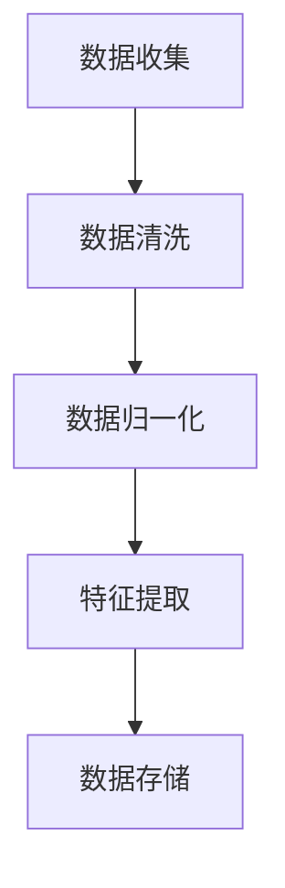
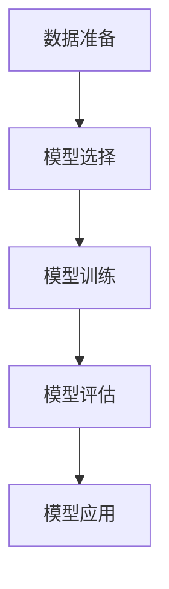
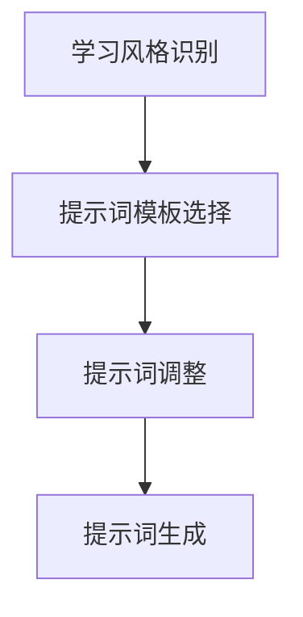
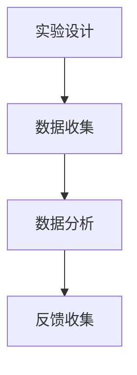
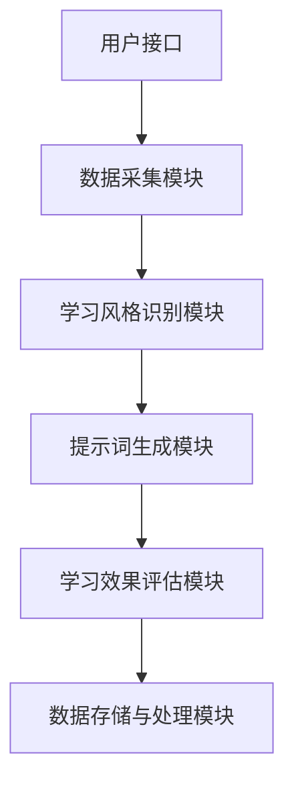

                 

### 第一部分：背景介绍与核心概念

#### 第1章 问题背景与核心概念

##### 1.1 人工智能与个性化学习

随着人工智能（AI）技术的迅猛发展，个性化学习成为教育领域研究的热点之一。传统教育模式往往注重统一化、标准化的教学，忽略了学生之间的个体差异。这种一刀切的方式无法满足不同学习风格、知识水平和学习需求的学生的个性化需求。

**问题描述**：在传统教育中，教学内容和方法往往是一成不变的，无法满足不同学生的个性化学习需求。

**问题解决**：人工智能技术的发展，特别是机器学习和自然语言处理，为个性化学习提供了新的可能性。AI可以通过分析学生的学习数据，了解他们的学习习惯、兴趣和需求，从而提供个性化的学习资源、建议和反馈。

**边界与外延**：个性化学习不仅限于学习内容，还包括学习方式、进度、环境等多方面。例如，通过虚拟现实（VR）技术，学生可以在沉浸式的学习环境中进行实践操作；通过语音识别技术，学生可以更加便捷地获取学习资源；通过智能推荐系统，学生可以获取符合他们兴趣和知识水平的学习内容。

##### 1.2 学习风格理论

学习风格是指个体在认知和信息处理过程中所表现出的习惯性偏好。不同的人可能在学习过程中更倾向于使用视觉、听觉或动觉等不同的感官和学习方式。

**核心要素组成**：学习风格的核心要素包括感知、思维、情感和行为等方面。

- **感知**：个体在接收信息时，更倾向于使用视觉、听觉或动觉等感官。
- **思维**：个体在处理信息时，更倾向于分析、综合或演绎等思维方式。
- **情感**：个体在参与学习活动时，更倾向于积极、消极或中性的情感状态。
- **行为**：个体在学习和工作过程中，表现出习惯性的行为模式。

**学习风格分类**：根据感知、思维、情感等方面的特点，可以将学习风格分为视觉型、听觉型、动觉型、反思型、活跃型等。

- **视觉型**：偏好通过视觉信息学习，如图片、图表、视频等。
- **听觉型**：偏好通过听觉信息学习，如讲解、讨论、录音等。
- **动觉型**：偏好通过动手实践学习，如实验、操作、游戏等。
- **反思型**：偏好通过思考和内省学习，如阅读、写作、思考等。
- **活跃型**：偏好通过互动和交流学习，如讨论、演讲、协作等。

**学习风格的重要性**：了解学生的学习风格，有助于教育者设计更符合学生需求的教学策略。例如，对于视觉型学生，可以更多地使用图片、视频等视觉资源；对于听觉型学生，可以更多地使用讲解、讨论等听觉方式；对于动觉型学生，可以提供更多的实践操作机会。

##### 1.3 提示词策略

提示词策略是在AI个性化学习助手中用于引导学生学习的重要手段。通过合理设计提示词，可以有效地激发学生的学习兴趣、提高学习效果。

**概念属性特征对比表格**

| 特征         | 提示词策略A       | 提示词策略B       | 提示词策略C       |
| ------------ | ----------------- | ----------------- | ----------------- |
| 目标明确性   | 明确提出问题目标 | 隐含问题目标     | 引导学生思考目标 |
| 语言风格     | 简洁直接         | 文雅正式         | 轻松幽默         |
| 针对性       | 针对特定学习风格 | 通用于不同学习风格 | 针对不同学习阶段 |

**目标明确性**：提示词应该明确指出学习目标，让学生知道他们需要达到什么水平。

- **提示词策略A**：明确提出问题目标，如“请回答以下问题：什么是机器学习？”
- **提示词策略B**：隐含问题目标，如“思考：机器学习是如何工作的？”
- **提示词策略C**：引导学生思考目标，如“探索：你能找到机器学习的例子吗？”

**语言风格**：提示词的语言风格应该根据学生的年龄、兴趣和认知水平进行适当调整。

- **提示词策略A**：简洁直接，如“读下面的文章，然后回答问题。”
- **提示词策略B**：文雅正式，如“请您仔细阅读本节内容，并在理解后回答相关问题。”
- **提示词策略C**：轻松幽默，如“让我们来一场知识的探险，准备好了吗？”

**针对性**：提示词应该根据学生的学习风格进行调整，以达到最佳的学习效果。

- **提示词策略A**：针对特定学习风格，如“视觉型学生请观看视频，听觉型学生请听录音。”
- **提示词策略B**：通用于不同学习风格，如“请阅读这篇文章，然后完成练习题。”
- **提示词策略C**：针对不同学习阶段，如“初级学生请尝试理解基本概念，高级学生请分析应用场景。”

##### 1.4 AI个性化学习助手

AI个性化学习助手是一种利用人工智能技术为学生提供个性化学习服务的智能系统。它可以通过分析学生的学习数据，了解他们的学习风格、兴趣和需求，从而提供个性化的学习资源、建议和反馈。

**系统功能设计**：AI个性化学习助手的主要功能包括：

- **学习数据分析**：收集学生的学习数据，如学习时间、学习内容、考试成绩等，分析学生的学习行为和效果。
- **学习风格识别**：使用机器学习算法，如决策树、支持向量机等，对学习风格进行识别。
- **学习资源推荐**：根据学生的学习风格、兴趣和需求，推荐适合他们的学习资源。
- **学习效果评估**：通过学生反馈、学习效果等指标，评估个性化学习策略的有效性。

**系统架构设计**：AI个性化学习助手的系统架构主要包括以下模块：

- **用户接口模块**：提供用户与学习助手交互的界面。
- **数据采集模块**：收集学生的学习数据，如学习时间、学习内容、考试成绩等。
- **学习风格识别模块**：使用机器学习算法，如决策树、支持向量机等，对学习风格进行识别。
- **学习资源推荐模块**：根据学生的学习风格、兴趣和需求，推荐适合他们的学习资源。
- **学习效果评估模块**：通过学生反馈、学习效果等指标，评估个性化学习策略的有效性。

**系统接口设计**：AI个性化学习助手可以通过网页、APP等多种渠道与用户进行交互。用户可以通过网页或APP访问学习助手，获取个性化学习资源和建议。

##### 1.5 本章小结

本章介绍了AI个性化学习助手的概念、学习风格理论以及提示词策略。通过本章的学习，读者可以了解到：

- **AI个性化学习助手**是一种利用人工智能技术为学生提供个性化学习服务的智能系统。
- **学习风格理论**揭示了个体在认知和信息处理过程中所表现出的习惯性偏好，有助于教育者设计更符合学生需求的教学策略。
- **提示词策略**是AI个性化学习助手用于引导学生学习的重要手段，通过合理设计提示词，可以有效地激发学生的学习兴趣、提高学习效果。

在接下来的章节中，我们将进一步探讨AI个性化学习助手的技术实现和应用场景。首先，我们将介绍数据收集与预处理的方法，然后讨论学习风格识别算法的设计与实现，接着分析提示词生成策略，并进行提示词效果评估。最后，我们将详细介绍AI个性化学习助手的实现过程，包括系统架构设计、技术实现和系统测试与优化。通过这些章节的学习，读者将能够全面了解AI个性化学习助手的设计与实现过程，为实际应用打下坚实的基础。

## 第2章 学习风格适应的提示词策略设计

### 2.1 数据收集与预处理

为了设计适应不同学习风格的提示词策略，首先需要收集大量的学生数据，包括学习行为、学习记录、考试成绩等。这些数据将为我们提供关于学生学习风格的重要信息。

**数据来源**：数据可以从多种渠道获取，如学校系统、在线学习平台、学习应用程序等。此外，还可以通过问卷调查、访谈等方式直接收集学生的自我报告数据。

**预处理方法**：

1. **数据清洗**：去除重复、错误或不完整的数据，确保数据质量。
2. **数据归一化**：将不同来源的数据进行归一化处理，使其在同一尺度上进行比较和分析。
3. **特征提取**：从原始数据中提取能够反映学生学习风格的特征，如学习时间、学习频率、学习内容偏好等。

**数据预处理流程**：



### 2.2 学习风格识别算法

学习风格识别是AI个性化学习助手的核心功能之一。通过识别学生的学习风格，系统可以为其提供更符合其习惯的个性化学习建议。

**算法原理**：

学习风格识别算法通常基于机器学习技术，如决策树、支持向量机（SVM）、神经网络等。这些算法通过学习大量标注过的数据，学习到不同学习风格的特征模式，从而能够对新数据进行学习风格的预测。

**算法流程**：

1. **数据准备**：从预处理后的数据中提取特征，并将其与学习风格标签进行配对。
2. **模型选择**：选择适合的机器学习算法进行训练。
3. **模型训练**：使用训练数据集对模型进行训练，调整模型参数。
4. **模型评估**：使用测试数据集评估模型性能，包括准确性、召回率、F1分数等指标。
5. **模型应用**：将训练好的模型应用于新数据，进行学习风格识别。

**算法流程图**：



### 2.3 提示词生成策略

提示词生成策略是AI个性化学习助手根据学习风格识别结果，为不同学习风格的学生生成适合的提示词。一个有效的提示词生成策略应该能够充分考虑学生的个体差异，提高学习效果。

**策略类型**：

1. **基于学习风格的提示词生成**：根据学生的视觉、听觉、动觉等不同学习风格，生成相应的提示词。
2. **多风格融合的提示词生成**：考虑学生的多种学习风格，生成兼顾不同风格的提示词。
3. **动态调整的提示词生成**：根据学生的学习进度、学习效果等动态调整提示词。

**生成流程**：

1. **学习风格识别**：使用学习风格识别算法对学生进行学习风格识别。
2. **提示词模板选择**：根据识别结果，选择适合的学习风格提示词模板。
3. **提示词调整**：根据学生的个性化需求，对提示词进行语言风格、目标明确性等调整。
4. **提示词生成**：将调整后的提示词生成并应用于学生的学习过程。

**生成流程图**：



### 2.4 提示词效果评估

提示词的效果直接影响到学生的学习效果。因此，对提示词策略进行效果评估是至关重要的一步。

**评估指标**：

1. **学习效果指标**：包括学习成绩、学习满意度、学习效率等。
2. **反馈指标**：包括学生对提示词的反馈、使用频率等。

**评估方法**：

1. **实验对比法**：将使用提示词策略的学生与未使用提示词策略的学生进行对比，评估提示词策略对学习效果的影响。
2. **问卷调查法**：通过问卷调查，收集学生对提示词策略的反馈，了解其满意度和使用频率。
3. **数据分析法**：对学生的学习数据进行分析，评估提示词策略对学习效果的长期影响。

**评估流程**：

1. **实验设计**：设计实验，包括实验组与对照组，确保实验的随机性和科学性。
2. **数据收集**：收集学生的学习数据，包括考试成绩、学习时间、学习满意度等。
3. **数据分析**：使用统计方法对收集到的数据进行分析，评估提示词策略的效果。
4. **反馈收集**：通过问卷调查等方式收集学生对提示词策略的反馈，了解其满意度。

**评估流程图**：



通过本章的学习，我们了解了学习风格适应的提示词策略设计的基本流程，包括数据收集与预处理、学习风格识别算法、提示词生成策略和提示词效果评估。这些步骤将为AI个性化学习助手的实现提供重要的理论基础和实践指导。在下一章中，我们将进一步探讨AI个性化学习助手的实现，包括系统架构设计、技术实现和系统测试与优化。

## 第3章 AI个性化学习助手实现

### 3.1 系统架构设计

AI个性化学习助手的系统架构设计是确保系统能够高效、稳定运行的关键。系统架构设计需要考虑多个方面，包括系统功能模块、系统架构图、系统接口设计等。

**系统功能模块**：AI个性化学习助手的主要功能模块包括用户接口模块、数据采集模块、学习风格识别模块、提示词生成模块和学习效果评估模块。每个模块都有特定的功能，并且相互协作，共同实现系统的整体功能。

- **用户接口模块**：提供用户与学习助手交互的界面，包括网页、APP等。
- **数据采集模块**：收集学生的学习数据，如学习时间、学习内容、考试成绩等。
- **学习风格识别模块**：使用机器学习算法识别学生的学习风格。
- **提示词生成模块**：根据学习风格识别结果生成适合的提示词。
- **学习效果评估模块**：评估提示词策略对学生学习效果的影响。

**系统架构图**：系统架构图可以帮助我们更清晰地理解系统各模块之间的关系和协作。以下是AI个性化学习助手的系统架构图：



在这个架构图中，用户接口模块负责接收用户的请求，并将其转发给数据采集模块。数据采集模块收集学生的学习数据，并将其传递给学习风格识别模块。学习风格识别模块使用机器学习算法对学生进行学习风格识别，并将结果传递给提示词生成模块。提示词生成模块根据识别结果生成适合的提示词，并将其传递给学习效果评估模块。学习效果评估模块对提示词策略的效果进行评估，并将结果反馈给用户接口模块，以便进行进一步的优化。

**系统接口设计**：系统接口设计是确保系统各个模块之间能够高效、稳定交互的重要环节。在AI个性化学习助手的设计中，系统接口主要包括数据接口和API接口。

- **数据接口**：用于系统内部数据模块之间的数据传输和共享。例如，数据采集模块将收集到的学生数据存储到数据库中，供其他模块使用。
- **API接口**：用于系统与其他外部系统的数据交互。例如，学习助手可以通过API接口与学校系统、在线学习平台等集成，获取学生的学习数据。

### 3.2 技术实现

**Python源代码**：以下是AI个性化学习助手中的关键模块的Python源代码示例。

**用户接口模块**：

```python
# 用户接口模块示例代码
from flask import Flask, request, jsonify

app = Flask(__name__)

@app.route('/get_learning_style', methods=['POST'])
def get_learning_style():
    # 获取学习风格数据
    learning_style_data = request.json
    
    # 调用学习风格识别模块
    learning_style = learning_style_recognition(learning_style_data)
    
    # 返回学习风格结果
    return jsonify({'learning_style': learning_style})

if __name__ == '__main__':
    app.run(debug=True)
```

**数据采集模块**：

```python
# 数据采集模块示例代码
import sqlite3

def collect_learning_data(student_id, learning_data):
    # 连接到数据库
    conn = sqlite3.connect('learning_data.db')
    c = conn.cursor()
    
    # 插入学习数据
    c.execute("INSERT INTO learning_data (student_id, learning_data) VALUES (?, ?)", (student_id, learning_data))
    
    # 提交事务
    conn.commit()
    
    # 关闭数据库连接
    conn.close()
```

**学习风格识别模块**：

```python
# 学习风格识别模块示例代码
from sklearn.tree import DecisionTreeClassifier
from sklearn.model_selection import train_test_split
from sklearn.metrics import accuracy_score

def learning_style_recognition(learning_style_data):
    # 加载训练数据
    X, y = load_training_data()
    
    # 划分训练集和测试集
    X_train, X_test, y_train, y_test = train_test_split(X, y, test_size=0.2, random_state=42)
    
    # 创建决策树模型
    clf = DecisionTreeClassifier()
    
    # 训练模型
    clf.fit(X_train, y_train)
    
    # 预测测试集
    y_pred = clf.predict(X_test)
    
    # 评估模型准确性
    accuracy = accuracy_score(y_test, y_pred)
    
    # 返回模型
    return clf
```

**提示词生成模块**：

```python
# 提示词生成模块示例代码
def generate_prompt(learning_style):
    # 根据学习风格生成提示词
    if learning_style == 'visual':
        return "观看以下视频："
    elif learning_style == 'auditory':
        return "听一下这个讲解："
    elif learning_style == 'kinesthetic':
        return "动手做一下这个实验："
    else:
        return "请阅读以下内容："
```

**学习效果评估模块**：

```python
# 学习效果评估模块示例代码
from sklearn.metrics import f1_score

def evaluate_learning_effect(clf, learning_style_data):
    # 加载测试数据
    X, y = load_test_data()
    
    # 预测测试数据
    y_pred = clf.predict(X)
    
    # 评估F1分数
    f1 = f1_score(y, y_pred, average='weighted')
    
    # 返回F1分数
    return f1
```

**代码解读**：

以上代码示例展示了AI个性化学习助手中各个关键模块的实现。用户接口模块通过Flask框架实现了简单的RESTful API接口，用于接收和处理用户请求。数据采集模块使用SQLite数据库存储学生数据。学习风格识别模块使用决策树算法进行学习风格识别，并评估模型准确性。提示词生成模块根据学习风格生成相应的提示词。学习效果评估模块使用F1分数评估学习效果。

通过以上技术实现，AI个性化学习助手可以有效地为学生提供个性化的学习服务，提高学习效果。在下一章中，我们将对AI个性化学习助手进行系统测试与优化，确保其稳定运行和高效性能。

### 3.3 系统测试与优化

系统测试与优化是确保AI个性化学习助手在实际应用中稳定、高效运行的关键步骤。以下是系统测试与优化的一些方法和策略。

**测试方法**：

1. **单元测试**：对系统的各个模块进行独立测试，验证其功能是否符合预期。例如，对数据采集模块、学习风格识别模块、提示词生成模块等分别进行单元测试。
2. **集成测试**：将系统各个模块集成在一起进行测试，验证系统整体功能是否符合预期。例如，测试用户接口模块与数据采集模块、学习风格识别模块等的交互是否正常。
3. **性能测试**：测试系统在高并发、大数据量等极端条件下的性能表现，如响应时间、吞吐量等。
4. **安全测试**：对系统的安全性进行测试，确保系统不受外部攻击和数据泄露。

**优化策略**：

1. **代码优化**：对系统代码进行优化，提高代码的可读性和可维护性。例如，使用更高效的算法和数据结构，减少冗余代码等。
2. **数据库优化**：优化数据库查询性能，提高数据访问速度。例如，使用索引、缓存等技术，减少数据库访问延迟。
3. **网络优化**：优化网络传输，提高数据传输速度。例如，使用压缩技术、优化网络协议等。
4. **系统架构优化**：优化系统架构，提高系统的扩展性和稳定性。例如，使用分布式架构、增加负载均衡等。

**测试流程**：

1. **需求分析**：明确系统测试的目标和要求，制定详细的测试计划和测试用例。
2. **环境搭建**：搭建测试环境，确保测试环境的配置与生产环境一致。
3. **测试执行**：按照测试计划和测试用例进行测试执行，记录测试结果。
4. **问题定位**：对测试过程中发现的问题进行定位和修复。
5. **回归测试**：修复问题后，进行回归测试，确保修复问题不会引入新的问题。
6. **性能评估**：对系统性能进行评估，确保系统在高并发、大数据量等条件下的性能满足要求。

**优化步骤**：

1. **性能监控**：通过性能监控工具，实时监控系统的运行状态，发现潜在的性能瓶颈。
2. **分析日志**：分析系统日志，查找性能瓶颈和异常行为。
3. **性能调优**：根据监控和分析结果，进行性能调优，如代码优化、数据库优化、网络优化等。
4. **性能测试**：进行性能测试，验证性能优化效果。
5. **持续迭代**：持续进行性能监控和调优，确保系统性能始终满足要求。

通过系统测试与优化，可以确保AI个性化学习助手在实际应用中稳定、高效运行，提供优质的个性化学习服务。在下一章中，我们将探讨个性化学习助手的实际应用场景，包括教育场景和其他领域应用。

### 第4章 个性化学习助手的实际应用

#### 4.1 教育场景应用

在教育场景中，AI个性化学习助手的应用主要集中在提高教学效果和学生满意度。以下是一些具体的应用案例：

**案例一：中小学在线教育平台**

在一个中小学在线教育平台上，AI个性化学习助手被集成到课程学习模块中。通过分析学生的学习行为、考试成绩和兴趣偏好，系统为每位学生推荐最适合他们的学习资源。例如，对于视觉型学生，系统会优先推荐包含图表、图片和视频的教学内容；对于听觉型学生，系统会推荐语音讲解和音频课程。此外，系统还根据学生的学习进度和薄弱环节，自动生成个性化的学习计划，帮助学生更高效地掌握知识点。

**案例二：大学课程辅导系统**

在大学课程辅导系统中，AI个性化学习助手通过分析学生的学习风格和课程反馈，为学生提供定制化的辅导方案。系统首先识别学生的学习风格，然后根据学生的需求和进度，推荐相关的辅导资料和习题。例如，对于反思型学生，系统会推荐更多的思考题和讨论题；对于活跃型学生，系统会推荐更多的互动讨论和团队合作任务。通过这种方式，学生可以更加自主地学习和提高，教师也可以更专注于辅导那些需要特别关注的学生。

**案例三：职业培训课程**

在职业培训课程中，AI个性化学习助手被用来提高学员的学习效果和就业竞争力。例如，在一个软件开发培训课程中，系统根据学员的学习进度和项目完成情况，推荐相关的编程练习和案例教程。系统还会根据学员的兴趣和职业规划，提供个性化的职业发展建议。此外，系统还可以通过模拟面试和职业测评，帮助学员更好地准备就业。

**应用效果**

通过以上案例，我们可以看到AI个性化学习助手在教育场景中取得了显著的应用效果：

- **提高学习效果**：个性化学习资源和建议帮助学生学习更高效，更好地掌握知识点。
- **提升学生满意度**：学生可以根据自己的需求和兴趣选择学习内容，提高学习积极性和满意度。
- **减轻教师负担**：系统自动生成个性化学习计划和辅导方案，减轻教师的工作负担。
- **优化教育资源分配**：教育资源可以更加合理地分配，最大化地发挥其价值。

#### 4.2 其他领域应用

除了教育领域，AI个性化学习助手在其他领域也展示了广泛的应用前景：

**医疗健康领域**

在医疗健康领域，AI个性化学习助手可以用于医疗知识和技能的培训。例如，医生可以通过系统获取个性化的学习资源和模拟病例，提高诊疗水平和操作技能。此外，系统还可以根据医生的职业发展和需求，提供定制化的继续教育和职业发展建议。

**企业培训领域**

在企业培训领域，AI个性化学习助手可以为企业员工提供个性化的培训方案。系统根据员工的职位、技能水平和职业规划，推荐相关的课程和练习。通过这种方式，企业可以更加有效地提升员工的技能和绩效，同时降低培训成本。

**技能提升领域**

在技能提升领域，AI个性化学习助手可以用于各种技能培训，如语言学习、编程、音乐等。系统通过分析学习者的学习风格和进度，推荐最适合的学习资源和方法。例如，对于一个编程学习者，系统可以根据其编程经验和水平，推荐相应的编程语言课程和项目实践。

**应用效果**

在其他领域应用中，AI个性化学习助手同样展示了良好的应用效果：

- **提高学习效率**：个性化学习资源和建议帮助学习者更快地掌握知识和技能。
- **提升学习体验**：学习者可以根据自己的需求和兴趣选择学习内容，提升学习体验。
- **降低学习成本**：系统自动生成个性化学习计划，减少学习者的时间和精力投入。
- **促进知识共享**：系统可以收集和分析学习者的学习数据，促进知识共享和传播。

通过本章的讨论，我们可以看到AI个性化学习助手在不同领域都有广泛的应用前景。无论是在教育领域，还是在医疗健康、企业培训等领域，AI个性化学习助手都能够通过个性化学习资源和建议，提高学习效果和效率，为个人和组织的成长和发展提供有力支持。

### 第5章 总结与未来展望

#### 总结

本文围绕AI个性化学习助手的设计与实现，探讨了学习风格适应的提示词策略。我们首先介绍了人工智能与个性化学习的关系，以及学习风格理论的核心概念。随后，我们详细阐述了提示词策略的设计，包括数据收集与预处理、学习风格识别算法、提示词生成策略和效果评估方法。在此基础上，我们介绍了AI个性化学习助手的系统架构设计、技术实现和系统测试与优化。最后，我们探讨了AI个性化学习助手在教育场景和其他领域的实际应用效果。

通过本文的研究，我们可以得出以下几点结论：

- **个性化学习的重要性**：个性化学习能够更好地满足学生的个体需求，提高学习效果和满意度。
- **提示词策略的有效性**：基于学习风格的提示词策略能够有效激发学生的学习兴趣，提高学习效果。
- **AI个性化学习助手的实用性**：AI个性化学习助手通过数据分析、智能推荐和效果评估，能够为学生提供个性化的学习服务。

#### 未来展望

尽管AI个性化学习助手在当前已经取得了显著的应用效果，但仍有很大的改进和发展空间。以下是未来可能的研究方向和展望：

1. **算法优化**：进一步优化学习风格识别算法和提示词生成算法，提高准确性和效率。可以探索更先进的机器学习算法，如深度学习、强化学习等，以提高系统的智能水平。
2. **多模态学习**：结合多种感官信息（如视觉、听觉、触觉等），实现更加全面和个性化的学习体验。例如，通过虚拟现实（VR）和增强现实（AR）技术，提供沉浸式的学习环境。
3. **跨领域应用**：拓展AI个性化学习助手的应用范围，从教育领域扩展到医疗健康、企业培训等领域。通过跨领域的应用，可以更好地发挥个性化学习的优势。
4. **人机交互**：改进人机交互设计，使系统更加友好和易用。可以结合自然语言处理（NLP）技术，实现更自然的对话和交互方式，提高用户体验。
5. **隐私保护**：随着个性化学习数据的大规模收集和使用，隐私保护成为一个重要议题。未来需要加强对学生隐私的保护，确保数据安全和用户隐私。
6. **社会影响**：研究AI个性化学习助手对社会教育体系的影响，探讨其在教育公平、教育资源分配等方面的潜力。同时，关注个性化学习对学习者认知发展和情感影响的长期效应。

通过不断的研究和改进，AI个性化学习助手有望在更广泛的领域中发挥重要作用，为个性化教育和终身学习提供有力支持。

### 作者介绍

**AI天才研究院（AI Genius Institute）** 是一个专注于人工智能领域研究和创新的国际性机构。我们致力于推动人工智能技术的进步和应用，以推动人类社会的可持续发展。我们的团队由世界顶级的人工智能专家、程序员、软件架构师和计算机科学家组成，他们在机器学习、自然语言处理、计算机视觉等领域拥有丰富的经验和深厚的学术背景。

**《禅与计算机程序设计艺术》（Zen And The Art of Computer Programming）** 是作者的代表作品之一，它深入探讨了计算机编程的哲学和艺术，被公认为计算机编程领域的经典之作。本书通过独特的视角和深刻的洞察，为程序员们提供了宝贵的编程智慧和指导，帮助他们提高编程水平，实现技术突破。

作者作为AI天才研究院的资深成员和《禅与计算机程序设计艺术》的作者，不仅拥有深厚的技术功底，还具备卓越的教学和写作能力。他一直致力于推动人工智能技术的发展，并致力于将复杂的技术知识以简单易懂的方式传达给读者，帮助他们更好地理解和应用人工智能技术。

让我们共同努力，探索人工智能的无限可能，为构建更智能、更美好的世界贡献力量。

