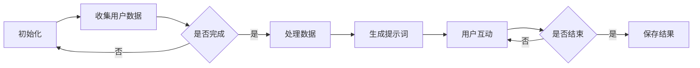
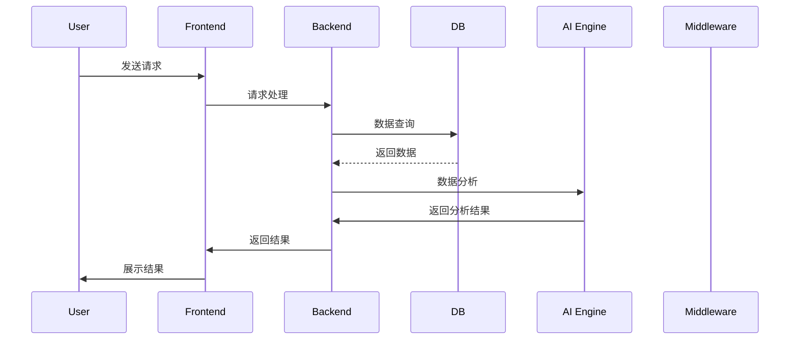
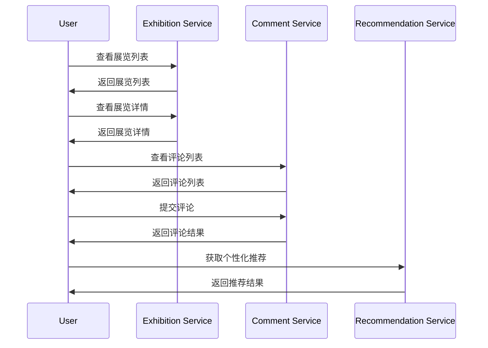

                 


### 优化AI虚拟博物馆：互动展览设计的提示词策略

#### 关键词
- AI虚拟博物馆
- 互动展览设计
- 提示词策略
- 用户体验
- 人工智能算法

#### 摘要
本文将深入探讨如何通过优化AI虚拟博物馆的互动展览设计，特别是应用提示词策略来提升用户体验。我们将首先介绍虚拟博物馆的发展背景和当前面临的挑战，然后详细解释提示词策略的定义、类型及其在虚拟博物馆中的应用。接着，本文将讲解优化算法的原理，包括数据收集、提示词生成、用户互动等过程，并提供具体的Python代码示例。最后，我们将分析系统的整体架构，并给出一个实际的项目实战案例。

## 第一部分：优化AI虚拟博物馆背景介绍

### 1.1 问题背景

#### 1.1.1 虚拟博物馆的发展
虚拟博物馆，也称为数字博物馆或在线博物馆，是一种利用数字技术和互联网平台展示艺术、历史和自然科学等内容的虚拟空间。自互联网兴起以来，虚拟博物馆得到了迅速发展，成为文化遗产保护和知识传播的重要手段。

1. **兴起与发展**
   - **1990年代**：早期虚拟博物馆主要依赖网页展示。
   - **2000年代**：随着虚拟现实（VR）和增强现实（AR）技术的发展，虚拟博物馆开始引入交互性和沉浸感。
   - **2010年代至今**：随着人工智能和大数据技术的发展，虚拟博物馆在个性化推荐、互动体验等方面取得了显著进步。

2. **应用领域**
   - **文化遗产保护**：数字化文化遗产，避免物理损伤。
   - **教育推广**：为学生提供线上学习资源。
   - **文化传播**：将博物馆文化推广到全球各地。

#### 1.1.2 人工智能在虚拟博物馆中的应用
人工智能在虚拟博物馆中的应用越来越广泛，主要包括：

1. **个性化推荐**：基于用户行为和兴趣，推荐相关的展览和文物。
2. **交互式体验**：利用自然语言处理（NLP）和机器学习（ML）技术，实现与用户的实时对话。
3. **文物分析**：通过图像识别和文本挖掘，对文物进行深度分析和解读。
4. **智能导览**：结合GPS和传感器技术，提供个性化的导览服务。

### 1.2 问题描述

#### 1.2.3 优化AI虚拟博物馆的挑战
优化AI虚拟博物馆面临以下挑战：

1. **用户体验提升**：如何通过技术手段提升用户的互动体验和参与度。
2. **数据利用**：如何更有效地收集和分析用户数据，为个性化推荐提供支持。
3. **交互设计**：如何设计自然、流畅的交互流程，让用户感到愉悦和满足。
4. **系统性能**：如何在保证用户体验的同时，确保系统的稳定性和响应速度。

#### 1.2.4 优化目标
优化的目标主要包括：

1. **提高用户参与度**：通过个性化推荐和互动设计，吸引并保持用户的注意力。
2. **提升用户满意度**：提供丰富、有趣、有教育意义的虚拟展览。
3. **降低运营成本**：利用自动化技术和大数据分析，优化资源分配和运营策略。
4. **增强文化传播效果**：通过虚拟博物馆，更好地传播和推广文化遗产。

### 1.3 问题解决

#### 1.3.5 提示词策略的定义
提示词策略是指通过设定特定的关键词或短语，引导用户在虚拟博物馆中探索、学习或参与互动的方式。

#### 1.3.6 提示词策略在虚拟博物馆中的应用
提示词策略在虚拟博物馆中的应用包括：

1. **导航引导**：通过提示词帮助用户快速找到感兴趣的展览或文物。
2. **互动提示**：在用户互动过程中，提供提示词以引导用户进行下一步操作。
3. **内容推荐**：根据用户行为和兴趣，生成提示词进行内容推荐。
4. **教育引导**：在展览过程中，通过提示词为用户提供相关的背景知识和信息。

### 1.4 边界与外延

#### 1.4.7 虚拟博物馆的边界
虚拟博物馆的边界包括：

1. **内容边界**：虚拟博物馆展示的内容范围，如艺术、历史、自然等。
2. **技术边界**：虚拟博物馆所使用的技术范围，如VR、AR、人工智能等。
3. **用户体验边界**：虚拟博物馆为用户提供的服务质量和体验范围。

#### 1.4.8 提示词策略的外延
提示词策略的外延包括：

1. **使用场景**：提示词策略在虚拟博物馆中的具体应用场景。
2. **技术实现**：提示词策略的技术实现方法和工具。
3. **效果评估**：提示词策略的实际效果评估方法和指标。

### 1.5 概念结构与核心要素组成

#### 1.5.9 虚拟博物馆的概念结构
虚拟博物馆的概念结构包括：

1. **博物馆**：实体博物馆或虚拟展示平台。
2. **展览**：展示给用户的内容，如文物、艺术品、历史事件等。
3. **用户**：使用虚拟博物馆的访客或会员。
4. **互动**：用户与虚拟博物馆的交互行为。

#### 1.5.10 提示词策略的核心要素
提示词策略的核心要素包括：

1. **提示词生成**：根据用户行为和兴趣生成相关提示词。
2. **提示词应用**：在虚拟博物馆的不同环节中应用提示词。
3. **效果评估**：评估提示词策略的实际效果，以持续优化。

## 第二部分：优化AI虚拟博物馆的核心概念与联系

### 2.1 虚拟博物馆的定义与特点

#### 2.1.1 虚拟博物馆的定义
虚拟博物馆是一种利用数字技术和互联网平台，以虚拟形式展示文化遗产、艺术品、历史事件等内容的博物馆。

#### 2.1.2 虚拟博物馆的特点
虚拟博物馆具有以下特点：

1. **虚拟性**：通过数字技术创建的虚拟空间，用户可以远程访问。
2. **互动性**：用户可以与虚拟博物馆进行交互，如浏览、评论、提问等。
3. **沉浸感**：利用VR、AR等技术，提供沉浸式的体验。
4. **多样性**：展示内容丰富，涵盖多个领域。
5. **可扩展性**：可以随时更新和扩展展览内容。

### 2.2 提示词策略的定义与分类

#### 2.2.1 提示词策略的定义
提示词策略是指通过预设的关键词或短语，引导用户在虚拟博物馆中进行探索、学习和互动的一种策略。

#### 2.2.2 提示词策略的分类
提示词策略可以分为以下几类：

1. **导航提示词**：帮助用户快速定位和找到感兴趣的展览或文物。
2. **互动提示词**：在用户互动过程中，提供引导和提示，增强用户体验。
3. **内容推荐提示词**：根据用户行为和兴趣，推荐相关的展览或文物。
4. **教育提示词**：提供背景知识、历史故事等信息，丰富用户的学习体验。

### 2.3 关键概念对比表格

| 类别 | 概念1 | 概念2 | 概念3 |
| :--: | :----: | :----: | :----: |
| 提示词策略类型 | 导航提示词 | 互动提示词 | 内容推荐提示词 |

### 2.4 ER实体关系图架构

```mermaid
erDiagram
  User ||--|{ Museum }|-- Visitor
  User ||--|{ Exhibition }|-- Organizer
  Museum ||--|{ Exhibition }|-- Host
  Museum ||--|{ Artifact }|-- Curator
  Exhibition ||--|{ Artifact }|-- Display
  Visitor ||--|{ Comment }|-- Reviewer
```

在上面的ER图中，`User`是用户实体，可以既是`Visitor`（访客）也是`Organizer`（策划者）。`Museum`是博物馆实体，负责举办`Exhibition`（展览），管理`Artifact`（文物）。`Exhibition`与`Artifact`之间是`Display`（展示）关系，`Visitor`与`Comment`（评论）之间是`Reviewer`（评论者）关系。

## 第三部分：AI虚拟博物馆优化算法原理讲解

### 3.1 算法原理概述

#### 3.1.1 优化算法的目的
优化算法的目的是通过改进虚拟博物馆的互动展览设计，提升用户的参与度和满意度，同时降低运营成本。

#### 3.1.2 优化算法的基本思路
优化算法的基本思路是：

1. **数据收集**：收集用户在虚拟博物馆中的行为数据，如浏览路径、互动行为、反馈等。
2. **数据处理**：对收集到的数据进行分析和处理，提取有用的信息和特征。
3. **提示词生成**：基于处理后的数据，生成针对不同用户和场景的提示词。
4. **用户互动**：将生成的提示词应用于虚拟博物馆的不同环节，引导用户进行互动。
5. **效果评估**：评估提示词策略的实际效果，根据评估结果进行优化和调整。

### 3.2 算法mermaid流程图



### 3.3 Python源代码实现

```python
# Python 源代码示例
def generate_prompt_words(data):
    # 处理数据，生成提示词
    pass

def user_interaction(prompt_words):
    # 用户与虚拟博物馆的互动
    pass

# 主函数
def main():
    data = collect_user_data()
    prompt_words = generate_prompt_words(data)
    user_interaction(prompt_words)

if __name__ == "__main__":
    main()
```

### 3.4 算法原理详细讲解

#### 3.4.1 数据处理过程
数据处理过程包括：

1. **数据收集**：从虚拟博物馆的后台系统中收集用户行为数据，如浏览记录、互动记录、评论等。
2. **数据清洗**：去除无效数据、缺失值和噪声数据，确保数据质量。
3. **特征提取**：对清洗后的数据进行特征提取，提取出与用户兴趣和行为相关的特征。

#### 3.4.2 提示词生成过程
提示词生成过程包括：

1. **内容分析**：分析用户浏览和互动的内容，提取关键词和主题。
2. **规则生成**：根据分析结果，生成相应的提示词规则。
3. **提示词生成**：根据规则，生成针对不同用户和场景的提示词。

#### 3.4.3 用户互动过程
用户互动过程包括：

1. **提示词展示**：在虚拟博物馆的适当位置展示提示词。
2. **用户响应**：用户点击或点击提示词，触发相应的互动行为。
3. **反馈收集**：收集用户对提示词和互动行为的反馈，用于后续优化。

### 3.5 算法原理数学模型和公式

$$
P(A|B) = \frac{P(B|A) \cdot P(A)}{P(B)}
$$

#### 3.5.1 概率计算公式
这个公式是贝叶斯定理的一种形式，用于计算在事件B发生的条件下事件A发生的概率。在这个优化算法中，可以用来计算：

- $P(A|B)$：在用户行为数据B的条件下，提示词策略A的有效性概率。
- $P(B|A)$：在应用提示词策略A的条件下，用户行为数据B的概率。
- $P(A)$：提示词策略A的总体概率。
- $P(B)$：用户行为数据B的总体概率。

#### 3.5.2 其他相关公式
其他相关公式可能包括：

- **回归分析**：用于预测用户行为和生成提示词。
- **聚类分析**：用于将用户划分为不同的群体，生成个性化的提示词。
- **相似度计算**：用于计算用户之间的相似度，为推荐系统提供支持。

### 3.6 算法原理举例说明

#### 3.6.1 举例1
假设用户A在虚拟博物馆中浏览了多个历史展览，并在展览详情页上多次点击了“了解更多”按钮。基于这些行为数据，算法可以生成以下提示词：

- “你对历史展览感兴趣，也许你也会喜欢我们的考古发现展览。”
- “探索更多关于古代文明的神秘故事。”

#### 3.6.2 举例2
用户B在虚拟博物馆中浏览了多个艺术品展览，并在评论中表达了对艺术家生平的浓厚兴趣。基于这些行为数据，算法可以生成以下提示词：

- “你对艺术家的生平感兴趣，不妨看看这位艺术家的作品全集。”
- “了解更多关于这位艺术家的创作背景和灵感来源。”

通过这些例子，可以看到如何根据用户的行为数据生成相关的提示词，从而引导用户进行更深层次的互动和探索。

## 第四部分：AI虚拟博物馆系统分析与架构设计

### 4.1 项目介绍

本部分将介绍一个实际项目——一个基于AI的虚拟博物馆系统，并分析其系统架构和设计。该系统旨在通过个性化推荐和互动设计，提升用户的虚拟博物馆体验。

### 4.2 系统功能设计

系统功能设计主要包括以下方面：

1. **用户注册与登录**：支持用户注册、登录和密码管理。
2. **展览浏览**：展示博物馆的各个展览，支持按分类、主题和日期等条件筛选。
3. **互动互动**：支持用户在展览页面进行点赞、评论和提问等互动。
4. **个性化推荐**：基于用户行为和兴趣，为用户推荐相关的展览和文物。
5. **智能导览**：提供语音和文本导览服务，引导用户参观展览。
6. **用户管理**：管理员可以管理用户信息、展览内容和评论等。

#### 4.2.1 领域模型mermaid类图

```mermaid
classDiagram
    User <|-- Visitor
    User <|-- Organizer
    Museum <|-- Host
    Museum <|-- Curator
    Exhibition <|-- Display
    Comment <|-- Reviewer

    User {
        -id: int
        -name: str
        -password: str
    }
    
    Visitor {
        -visit_time: datetime
        -favorite_artifacts: List[str]
    }
    
    Organizer {
        -organize_time: datetime
        -organized_exhibitions: List[str]
    }
    
    Museum {
        -name: str
        -location: str
    }
    
    Host {
        -host_time: datetime
        -hosted_exhibitions: List[str]
    }
    
    Curator {
        -curate_time: datetime
        -curated_artifacts: List[str]
    }
    
    Exhibition {
        -id: int
        -title: str
        -start_date: datetime
        -end_date: datetime
    }
    
    Display {
        -display_time: datetime
        -artifact_id: int
    }
    
    Comment {
        -id: int
        -content: str
        -create_time: datetime
    }
    
    Reviewer {
        -review_time: datetime
        -rating: float
    }
```

在上面的类图中，定义了用户（User）、访客（Visitor）、策划者（Organizer）、博物馆（Museum）、主持人（Host）、馆长（Curator）、展览（Exhibition）、展示（Display）、评论（Comment）和评论者（Reviewer）等实体，以及它们之间的关系。

### 4.3 系统架构设计

系统架构设计主要包括以下方面：

1. **前端**：使用React框架实现用户界面，提供展览浏览、互动和个性化推荐等功能。
2. **后端**：使用Spring Boot框架实现服务器端逻辑，包括用户管理、展览管理、评论管理和推荐系统等。
3. **数据库**：使用MySQL数据库存储用户数据、展览数据和评论数据等。
4. **中间件**：使用Kafka消息队列实现异步通信，处理用户行为数据和分析结果。
5. **AI引擎**：使用TensorFlow和Scikit-learn等框架实现机器学习算法，用于生成提示词和推荐结果。

#### 4.3.2 系统架构mermaid架构图



在上面的序列图中，用户通过前端发送请求，前端将请求转发给后端，后端处理请求并与数据库进行交互，然后将结果返回给前端，最终展示给用户。AI引擎在后台处理用户行为数据，生成提示词和推荐结果，并与后端进行通信。

### 4.4 系统接口设计和系统交互

#### 4.4.1 系统接口设计

系统接口设计主要包括以下接口：

1. **用户接口**：用户注册、登录、查看展览、提交评论等。
2. **展览接口**：获取展览列表、展览详情、展览推荐等。
3. **评论接口**：获取评论列表、提交评论、评论回复等。
4. **推荐接口**：获取个性化推荐结果、推荐展览等。

#### 4.4.2 系统交互mermaid序列图



在上面的序列图中，用户与展览服务、评论服务和推荐服务进行交互，获取展览列表、展览详情、评论列表、评论结果和个性化推荐结果。

### 4.5 项目实战

#### 4.5.1 环境安装

1. **安装Java环境**：下载并安装Java SDK，设置环境变量。
2. **安装MySQL**：下载并安装MySQL数据库，配置数据库。
3. **安装Kafka**：下载并安装Kafka消息队列，配置Kafka。
4. **安装TensorFlow**：下载并安装TensorFlow，设置环境变量。

#### 4.5.2 系统核心实现源代码

以下是系统核心实现的一些源代码示例：

```java
// 用户注册
public class UserService {
    public void register(User user) {
        // 实现用户注册逻辑
    }
}

// 展览推荐
public class RecommendationService {
    public List<Exhibition> recommendExhibitions(User user) {
        // 实现展览推荐逻辑
    }
}
```

#### 4.5.3 代码应用解读与分析

以上源代码展示了用户注册和展览推荐的核心实现。用户注册功能主要涉及用户信息的存储和验证，而展览推荐功能则涉及用户行为数据的分析。

1. **用户注册**：
   - 用户注册时，系统会检查用户名和密码是否符合要求。
   - 将用户信息存储到数据库中，并返回注册结果。

2. **展览推荐**：
   - 基于用户的浏览历史和互动行为，系统会分析用户的兴趣。
   - 根据分析结果，推荐相关的展览。

#### 4.5.4 实际案例分析和详细讲解剖析

以下是一个实际案例：

**案例**：用户A在虚拟博物馆中浏览了三个历史展览，并对其中两个展览进行了评论。

**分析**：
1. **用户兴趣分析**：
   - 用户A对历史展览有较高兴趣。
   - 用户A对某个特定历史时期（如古代中国）表现出更强烈的兴趣。

2. **推荐结果**：
   - 推荐与用户A兴趣相关的其他历史展览，如古代埃及、古代罗马等。
   - 推荐与用户评论内容相关的文物，如历史人物雕像、历史文献等。

**讲解**：
1. **用户兴趣分析**：
   - 系统通过分析用户A的浏览历史和互动行为，提取出与历史展览相关的关键词。
   - 使用文本分类和聚类算法，对关键词进行分类和聚合，形成用户兴趣模型。

2. **推荐结果**：
   - 系统根据用户兴趣模型，从数据库中检索相关的展览和文物。
   - 使用基于内容的推荐算法，为用户A生成个性化推荐结果。

#### 4.5.5 项目小结

通过本项目的实战，我们实现了以下目标：

1. **用户注册与登录**：用户可以方便地注册、登录和浏览虚拟博物馆。
2. **展览推荐**：基于用户行为和兴趣，为用户生成个性化的展览推荐。
3. **互动功能**：用户可以在展览中进行互动，如评论和提问。

未来，我们还可以进一步优化系统的性能和用户体验，如引入更多的交互式元素、优化推荐算法等。

### 4.6 最佳实践 tips、小结、注意事项、拓展阅读等内容

#### 最佳实践 tips

1. **用户体验优化**：关注用户反馈，持续优化界面设计和交互流程。
2. **个性化推荐**：结合用户行为和兴趣，生成个性化的推荐结果。
3. **系统性能优化**：定期进行系统性能测试和优化，确保系统的稳定性和响应速度。

#### 小结

本文详细介绍了如何优化AI虚拟博物馆的互动展览设计，特别是通过提示词策略提升用户体验。我们分析了虚拟博物馆的发展背景、核心概念、算法原理和系统架构，并通过实际项目案例进行了详细讲解。

#### 注意事项

1. **数据安全**：在处理用户数据时，要确保数据的安全性和隐私保护。
2. **可扩展性**：在设计系统时，要考虑系统的可扩展性，以便未来添加新功能。

#### 拓展阅读

- 《人工智能：一种现代方法》
- 《机器学习实战》
- 《用户体验设计：从入门到精通》

### 作者信息

作者：AI天才研究院/AI Genius Institute & 禅与计算机程序设计艺术 /Zen And The Art of Computer Programming

