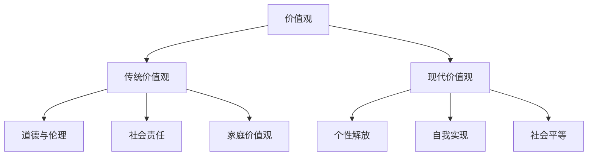
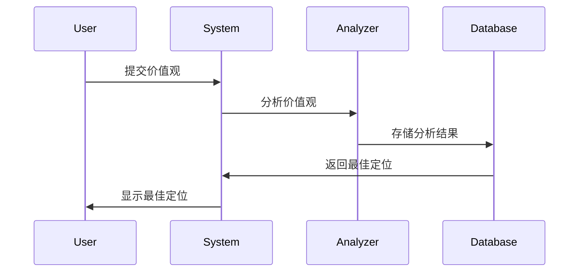
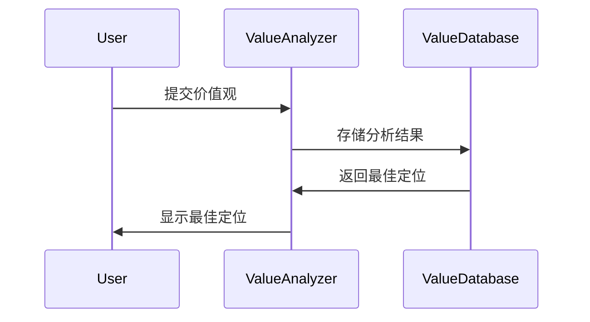

                 

## 引言

### 1.1 问题背景

在当今社会，传统价值观与现代价值观之间的冲突愈发显著。随着科技的飞速发展和全球化进程的推进，人们的生活方式和价值观念发生了翻天覆地的变化。传统价值观强调家庭、道德和伦理，而现代价值观则更注重个性解放、自我实现和社会平等。这种价值观的冲突不仅体现在个人生活中，也渗透到企业文化、教育体系、社会制度等各个领域。

传统价值观与现代价值观之间的冲突表现为多个方面。例如，在个人职业发展中，传统价值观强调稳定和忠诚，而现代价值观则更倾向于灵活和创新；在家庭观念上，传统价值观强调孝道和家庭责任，而现代价值观则鼓励个体追求自我发展和幸福。这些冲突导致了个体和社会的困惑，使人们难以找到自己的定位。

### 1.2 价值观冲突的现状与影响

价值观冲突的现状体现在多个层面。首先，在个人层面上，许多人感到迷茫和困惑，不知道如何平衡传统价值观与现代价值观。例如，在职业选择上，一些人可能会因为传统价值观的压力而放弃追求自己的兴趣和梦想，从而影响了个人成长和幸福感。其次，在社会层面上，价值观冲突导致了社会信任的下降和人际关系的紧张。例如，在企业文化中，传统价值观与现代价值观的冲突可能导致员工的工作压力增加，影响企业的发展和竞争力。最后，在国家层面上，价值观冲突可能影响国家政策的制定和执行，导致社会不稳定和冲突加剧。

### 1.3 研究目的与意义

本文旨在探讨传统价值观与现代价值观之间的冲突，以及如何在冲突中实现自我定位。通过分析传统价值观和现代价值观的核心内容、优缺点，以及价值观冲突的自我定位策略，本文旨在为读者提供一种思路和方法，帮助他们在价值观冲突中找到自己的定位。这不仅有助于个人的成长和发展，也有助于社会的和谐与进步。

### 1.4 核心概念

在本文中，核心概念包括价值观、传统价值观、现代价值观、自我定位等。价值观是指人们对于生活、工作、社会等方面的基本信念和判断。传统价值观是指历史上长期形成的、普遍接受的道德规范和价值观念。现代价值观则是在现代社会中逐渐形成和发展起来的、反映现代社会特点和需求的价值观念。自我定位是指个体在价值观冲突中，通过自我反思和调整，找到适合自己的价值和生活方式。

### 1.5 研究方法

本文采用文献综述和案例分析相结合的方法。首先，通过综述相关文献，了解传统价值观和现代价值观的定义、特征、优缺点以及自我定位的理论基础。然后，通过案例分析，探讨价值观冲突中的自我定位策略和方法。最后，结合理论和实践，提出解决价值观冲突的建议和对策。

### 1.6 文章结构

本文分为七个章节。第一章为引言，介绍问题背景、研究目的与意义、核心概念和研究方法。第二章和第三章分别解析传统价值观和现代价值观的历史发展、核心内容、优缺点。第四章探讨价值观冲突中的自我定位的重要性、策略和方法。第五章通过案例分析，展示价值观冲突的具体表现和解决方法。第六章提出自我定位的策略和方法。第七章为结论与展望，总结研究成果，提出未来研究方向。

## 第1章：引言

### 1.1 传统价值观与现代价值观的演变

传统价值观是历史长河中积淀下来的价值观念，它根植于人类长期的生活实践和文明进程中，形成了相对稳定和固定的价值体系。在古代社会，传统价值观强调道德、伦理、家庭和社会责任，如儒家文化中的孝道、礼仪、忠诚等。这些价值观在稳定社会结构、维护社会秩序方面发挥了重要作用。

随着工业革命和现代化进程的推进，现代社会中出现了与传统价值观不同的现代价值观。现代价值观更加注重个性解放、自我实现、创新和效率。例如，在职业发展中，现代价值观强调个人兴趣、职业发展和创新精神；在家庭观念上，现代价值观则更强调个体自由和家庭关系的平等。

传统价值观和现代价值观的演变，反映了社会变迁和人类发展的不同阶段。传统价值观是在农业社会和手工业社会中形成的，它注重集体利益、稳定和传承；而现代价值观则是在工业化和信息化社会中形成的，它注重个体利益、创新和变革。这种演变不仅影响了人们的生活方式，也深刻改变了社会的结构和运行方式。

### 1.2 价值观冲突的现状与影响

在现代社会中，传统价值观和现代价值观之间的冲突日益明显，这种冲突不仅体现在个人生活中，也渗透到企业文化、教育体系、社会制度等各个领域。

在个人层面，许多人在传统价值观和现代价值观之间感到迷茫和困惑。例如，在职业选择上，一些人可能会因为传统价值观的压力而放弃追求自己的兴趣和梦想，从而影响了个人成长和幸福感。此外，在家庭观念上，传统价值观强调孝道和家庭责任，而现代价值观则鼓励个体追求自我发展和幸福。这种冲突可能导致家庭关系紧张，影响家庭成员的幸福感。

在社会层面，价值观冲突导致了社会信任的下降和人际关系的紧张。例如，在企业中，传统价值观强调稳定和忠诚，而现代价值观则更倾向于灵活和创新。这种冲突可能导致员工的工作压力增加，影响企业的发展和竞争力。此外，在社会制度层面，传统价值观和现代价值观的冲突也可能导致政策制定和执行的困难，影响社会的稳定和发展。

在国际层面，不同国家和文化之间的价值观冲突也日益突出。例如，在全球化进程中，西方的民主、自由和人权观念与东方的集体主义、孝道和等级观念之间存在着明显的差异和冲突。这种冲突不仅影响了国际关系的稳定，也阻碍了全球合作和共同发展。

### 1.3 研究目的与意义

本文旨在探讨传统价值观和现代价值观之间的冲突，以及如何在冲突中实现自我定位。通过分析传统价值观和现代价值观的核心内容、优缺点，以及自我定位的理论基础，本文旨在为读者提供一种思路和方法，帮助他们在价值观冲突中找到自己的定位。这不仅有助于个人的成长和发展，也有助于社会的和谐与进步。

研究的意义在于：首先，它有助于我们更好地理解传统价值观和现代价值观的演变和冲突，从而提高对现代社会复杂性的认识。其次，它为我们提供了在价值观冲突中实现自我定位的策略和方法，有助于提高个人的心理健康和生活质量。最后，它有助于企业和政府更好地处理价值观冲突，提高社会效率和稳定性。

### 1.4 核心概念

在本文中，核心概念包括价值观、传统价值观、现代价值观、自我定位等。

价值观是指人们对于生活、工作、社会等方面的基本信念和判断，它是社会文化和个体经验的综合体现。

传统价值观是在历史长河中形成的、长期被普遍接受的价值观念，它强调道德、伦理、家庭和社会责任。

现代价值观是在现代社会中逐渐形成和发展的、反映现代社会特点和需求的价值观念，它注重个性解放、自我实现、创新和效率。

自我定位是指个体在价值观冲突中，通过自我反思和调整，找到适合自己的价值和生活方式。

### 1.5 理论基础

在探讨传统价值观和现代价值观之间的冲突及其自我定位时，我们需要借助一系列理论基础。这些理论基础为我们提供了理解价值观演变、冲突和个体自我定位的框架和工具。

首先，社会变迁理论为我们提供了理解传统价值观和现代价值观演变的基础。社会学家认为，社会变迁是不断进行的，它受到技术进步、经济变革、文化互动等多方面因素的影响。传统价值观的形成和演变与古代社会、农业社会和工业社会的历史进程密切相关。而现代价值观则是在现代化和信息化的背景下逐渐形成的，反映了社会对个性解放、自我实现和创新的需求。

其次，个体自我定位的理论基础主要包括心理学和社会学的研究成果。心理学家如埃里克·埃里克森（Erik Erikson）提出了自我同一性理论，认为自我定位是个体在社会互动和自我探索过程中逐渐形成的。个体需要在不同的生活阶段中解决不同的心理冲突，最终形成稳定的自我认同。社会学家如罗伯特·默顿（Robert Merton）则提出了角色冲突和角色执行理论，认为个体在社会生活中往往面临多种角色的冲突，需要通过角色转换和角色执行来实现自我定位。

此外，社会心理学的研究成果也为理解价值观冲突和自我定位提供了重要启示。社会心理学家如菲利普·津巴多（Philip Zimbardo）的实验表明，个体在不同的社会角色和社会环境中，其行为和价值观会有显著差异。这种差异反映了个体在社会互动中的自我定位和角色扮演。

最后，组织行为学的研究成果也为探讨企业文化中的价值观冲突和自我定位提供了理论基础。组织行为学家如詹姆斯·马奇（James March）和约翰·奥尔登（John Olsen）提出了角色模型理论，认为个体在组织中既需要遵循组织的规范和期望，也需要实现个人的目标和价值观。

综上所述，社会变迁理论、心理学和社会学的研究成果、社会心理学的研究成果以及组织行为学的研究成果共同构成了探讨传统价值观和现代价值观冲突及其自我定位的理论基础。

## 第2章：传统价值观解析

### 2.1 传统价值观的历史发展

传统价值观是人类文明长期积淀和发展的结果，它在不同历史阶段有着不同的表现和内涵。传统价值观的起源可以追溯到古代社会，随着人类社会的不断发展和演变，传统价值观也在不断地丰富和完善。

在古代社会，传统价值观主要表现为对道德、伦理和社会责任的强调。在儒家文化中，孝道、礼仪、忠诚等价值观被视为社会稳定和个体成长的重要基石。这些价值观通过教育和家庭传承，成为古代社会的基本行为规范。

随着社会的变迁，传统价值观也在不断地演变。在农业社会，传统价值观强调集体利益、稳定和传承。人们尊重传统、遵循习俗，努力维护社会秩序和稳定。这种价值观在当时的社会结构中发挥了重要作用，促进了农业社会的繁荣和发展。

然而，随着工业革命的到来，传统价值观开始受到冲击。工业社会强调效率、竞争和创新，这与传统价值观中的集体利益和社会责任形成了鲜明对比。传统价值观在这一时期开始逐渐失去其在社会中的主导地位，但仍然在人们的生活中发挥着重要作用。

在现代社会，传统价值观仍然存在，并且继续影响着人们的行为和观念。然而，现代社会的快速发展和全球化进程使得传统价值观面临新的挑战和机遇。在现代社会中，传统价值观和现代价值观的冲突日益明显，这种冲突使得人们需要在传统价值观和现代价值观之间找到平衡。

### 2.2 传统价值观的核心内容

传统价值观的核心内容涵盖了道德、伦理、家庭和社会责任等多个方面，以下是对这些内容的详细解析：

#### 道德与伦理

传统价值观中的道德和伦理观念是维系社会秩序和个体行为规范的重要基础。道德强调个体应当遵循的行为准则，如诚信、公平、正义等。伦理则更多地涉及社会关系和个体责任，如忠诚、尊重、责任感等。这些价值观在古代社会中被广泛接受和遵循，被视为维持社会稳定和个体和谐的重要保障。

#### 社会责任

传统价值观强调个体对社会的责任和义务，包括对社会秩序的维护、对家庭和社会的贡献等。个体被期望承担起相应的社会责任，如孝顺父母、维护家庭和睦、积极参与社会事务等。这种责任感不仅体现在个体行为上，也渗透到社会制度和法律规定中。

#### 家庭价值观

家庭在传统价值观中占据重要地位，被视为社会的基本单位。传统家庭价值观强调家庭的稳定和和谐，重视家庭成员之间的相互尊重和关爱。孝道是传统家庭价值观的核心，强调子女对父母的敬重和赡养，以及父母对子女的关爱和教育。

#### 个人价值观

传统价值观中的个人价值观更多地体现在个体行为和社会角色上。个人被期望具备诚实、勤劳、正直等品质，遵循社会的道德规范和伦理标准。此外，传统价值观还强调个体的自律和自制，以实现个人道德修养和社会地位的提升。

#### 社会关系

传统价值观中的社会关系观念强调个体在社会中的角色和责任，以及个体之间的相互关系。个体被期望在与他人交往中遵循礼仪、尊重他人、维护和谐的社会关系。这种价值观在维护社会秩序和促进社会和谐方面发挥了重要作用。

### 2.3 传统价值观的影响

传统价值观对个体和社会产生了深远的影响。首先，在个体层面，传统价值观为个体提供了行为规范和道德准则，帮助个体在社会中找到自己的定位和角色。这些价值观有助于个体的道德修养和社会适应，提高个体的心理健康和生活质量。

在社会层面，传统价值观对社会秩序和稳定起到了重要的维护作用。通过强调道德、伦理和社会责任，传统价值观促进了社会的和谐与团结，减少了社会冲突和矛盾。此外，传统价值观也在一定程度上抵制了现代化进程中的道德滑坡和价值观混乱，为社会的可持续发展提供了价值基础。

然而，传统价值观也存在一定的局限性。在现代社会，随着科技的发展和全球化进程的推进，传统价值观面临着新的挑战和变革。一些传统价值观如家庭观念、社会等级观念等，可能与现代社会的价值观念发生冲突，导致社会不稳定和个体困惑。

### 2.4 传统价值观的优缺点分析

传统价值观的优点主要体现在以下几个方面：

#### 1. 维护社会秩序

传统价值观强调道德、伦理和社会责任，有助于维护社会秩序和稳定。通过规范个体行为，传统价值观减少了社会冲突和矛盾，促进了社会和谐与团结。

#### 2. 促进个体成长

传统价值观为个体提供了行为规范和道德准则，有助于个体的道德修养和社会适应。个体在遵循传统价值观的过程中，能够更好地实现个人价值和社会地位。

#### 3. 传承文化传统

传统价值观承载了人类文明的精髓，通过教育和家庭传承，帮助后代了解和继承传统文化。这有助于文化传统的延续和发展。

传统价值观的缺点主要体现在以下几个方面：

#### 1. 过于保守

传统价值观在某些情况下可能过于保守，抵制变革和创新。这可能导致社会停滞不前，难以适应现代化和全球化的发展需求。

#### 2. 忽视个体权益

在一些传统价值观中，个体被期望完全服从集体和社会的规范，忽视了个体权益和自由。这可能导致个体感到压抑和束缚，影响个体的心理健康和幸福感。

#### 3. 不适应现代社会

随着社会的变迁，一些传统价值观可能不再适应现代社会的需求和挑战。这可能导致价值观的冲突和矛盾，影响社会的稳定和发展。

### 2.5 传统价值观的适用范围

传统价值观在不同的社会和文化背景下有着不同的适用范围。在传统文化深厚的国家，传统价值观仍然具有很强的生命力和影响力，如中国、日本和韩国等。在这些国家，传统价值观在家庭、教育和公共生活中仍然发挥着重要作用。

然而，在现代化和全球化程度较高的国家，传统价值观的适用范围受到一定限制。例如，在西方国家，个人主义和自由主义价值观占据主导地位，传统价值观在一定程度上被边缘化。然而，即使在现代化国家，传统价值观仍然在特定领域和群体中存在，如宗教团体、传统社区和文化遗产保护等领域。

总之，传统价值观在不同社会和文化背景下有着不同的适用范围。在现代社会中，如何平衡传统价值观和现代价值观，实现两者的有机结合，是一个值得深入探讨的问题。

### 2.6 传统价值观的挑战与适应

随着现代化和全球化的不断推进，传统价值观面临着一系列新的挑战和变化。首先，科技的发展和信息时代的到来改变了人们的生活方式和社会结构，传统价值观中的某些观念如家庭观念、工作态度等需要适应新的社会环境。例如，现代通信技术的普及使得家庭成员之间的联系更加便捷，但同时也带来了一些挑战，如家庭关系的疏离和沟通障碍。

其次，全球化带来了文化的多样性和融合，传统价值观与外来文化之间的冲突和融合成为一个新的课题。例如，在全球化背景下，传统的家庭观念和婚姻观念受到挑战，一些人更倾向于追求个人自由和自我实现。这种变化要求传统价值观进行自我调整和适应，以适应新的社会需求。

此外，社会变迁和经济发展的不平衡也导致了一些传统价值观的困境。例如，在一些发展中国家，传统价值观仍然强调集体利益和家庭责任，但在经济快速发展的背景下，个人利益和自由的重要性日益凸显。这种冲突要求个体和社会在传统价值观和现代价值观之间找到平衡点。

为了应对这些挑战，传统价值观需要不断进行自我反思和调整。一方面，传统价值观需要保留其核心价值和优势，如道德伦理和社会责任，以适应现代社会的发展需求。另一方面，传统价值观也需要吸纳现代价值观中的积极因素，如创新精神和个人自由，以增强其适应性和生命力。

总之，传统价值观在现代社会中的挑战和适应是一个复杂而持续的过程。通过不断地自我反思和调整，传统价值观可以找到新的适应方式，继续在现代社会中发挥其独特的作用。

## 第3章：现代价值观探析

### 3.1 现代价值观的兴起

现代价值观的兴起是现代社会变迁和发展的产物，其背景可以追溯到工业革命和现代化进程的推进。工业革命带来了生产力的飞速提升和社会结构的深刻变化，传统的农业社会逐渐向工业化社会转型。这一过程中，传统价值观受到了挑战，人们开始思考和探索适应现代社会需求的新价值观。

首先，科技的发展是现代价值观兴起的重要推动力。工业革命和信息技术革命使得人类社会进入了一个前所未有的高速发展时期，科技成为推动社会进步的重要力量。在这一背景下，人们开始重视创新、效率和专业化，这些理念逐渐成为现代价值观的核心内容。

其次，现代化进程中的经济和社会结构变化也催生了现代价值观。随着工业化的发展，市场经济体制逐渐取代了传统的计划经济体制，个人自由和市场竞争成为经济生活的重要特征。同时，城市化进程和全球化的发展使得人们的生活环境、社会关系和文化背景发生了巨大变化，传统价值观中的某些观念如等级制度、家庭责任等逐渐被重新审视和调整。

最后，现代社会中人们对自我实现和个人发展的追求也是现代价值观兴起的重要原因。与传统价值观强调的集体利益和社会责任不同，现代价值观更注重个体的自由、权利和自我实现。人们追求个性解放、自我价值和职业成就，这种个体主义观念成为现代价值观的重要特征。

### 3.2 现代价值观的特征

现代价值观具有以下主要特征：

#### 1. 个性解放

现代价值观强调个体的自由和权利，追求个性解放。与传统价值观中的集体主义和家庭责任不同，现代价值观认为每个人都应当追求自我实现和个人价值。个性解放使个体能够根据自己的兴趣和优势选择职业和生活方式，实现自我价值。

#### 2. 自我实现

自我实现是现代价值观的核心追求。个体不仅追求物质财富和社会地位，更追求精神层面的满足和成长。现代价值观鼓励个体通过不断学习和成长，实现自我价值和社会贡献。

#### 3. 社会平等

社会平等是现代价值观的重要原则。现代价值观反对任何形式的歧视和不平等待遇，追求性别、种族和阶级的平等。社会平等不仅体现在法律层面，也体现在实际生活中，如教育机会、就业机会和社会福利等。

#### 4. 多元文化

多元文化是现代价值观的重要组成部分。全球化进程带来了文化的多样性和融合，现代价值观鼓励人们尊重和理解不同文化，包容多元文化。多元文化不仅丰富了社会的内涵，也为个体提供了更广阔的发展空间。

#### 5. 创新

创新是现代价值观的重要推动力。现代价值观鼓励个体和集体敢于尝试、勇于创新，以适应快速变化的社会环境和市场需求。创新不仅是科技发展的关键，也是经济繁荣和社会进步的重要动力。

### 3.3 现代价值观的影响

现代价值观对社会和个人产生了深远的影响：

#### 1. 社会影响

在现代社会，现代价值观促进了社会的进步和繁荣。个性解放和自我实现使得人们更加积极主动地参与社会事务，提高了社会活力和创新能力。社会平等和多元文化则促进了社会的包容性和和谐性，减少了社会矛盾和冲突。创新成为社会发展的核心动力，推动了科技进步和经济增长。

#### 2. 个人影响

对个人而言，现代价值观带来了巨大的变化。个性解放使个体能够更加自由地选择生活方式和职业路径，实现个人价值和自我实现。自我实现鼓励个体追求精神层面的满足和成长，提高了个体的心理健康和幸福感。社会平等和多元文化则为个体提供了更多的发展机会和空间，促进了个体的全面发展。

然而，现代价值观也存在一定的局限性。例如，个性解放可能导致个体主义和社会责任感的缺失，社会平等和多元文化可能带来文化冲突和价值观混乱。这些问题需要我们在实践中不断探索和解决，以实现现代价值观的可持续发展。

### 3.4 现代价值观的核心内容

现代价值观的核心内容涵盖了多个方面，以下是具体内容的详细解析：

#### 1. 个性解放

个性解放是现代价值观的核心，强调个体自由和权利。现代价值观认为，每个人都应当享有自由选择生活方式、职业和人生道路的权利。个性解放不仅体现在个人行为上，也体现在社会制度和文化氛围中。社会应当为个体提供平等的机会和资源，帮助个体实现自我价值和自我实现。

#### 2. 自我实现

自我实现是现代价值观的追求，强调个体通过不断努力和成长，实现个人价值和自我价值。现代价值观鼓励个体追求精神层面的满足和成长，认为个人成长和幸福是社会进步的重要基础。自我实现不仅体现在职业成就上，也体现在个人兴趣、家庭生活和社会参与中。

#### 3. 社会平等

社会平等是现代价值观的重要原则，反对任何形式的歧视和不平等待遇。社会平等不仅体现在法律层面，也体现在实际生活中。现代价值观主张性别、种族、阶级和文化的平等，认为每个人都应当享有平等的机会和权利。社会平等有助于促进社会的包容性和和谐性，减少社会矛盾和冲突。

#### 4. 多元文化

多元文化是现代价值观的重要组成部分，强调尊重和理解不同文化。全球化进程带来了文化的多样性和融合，现代价值观鼓励人们包容多元文化，尊重文化差异。多元文化不仅丰富了社会的内涵，也为个体提供了更广阔的发展空间。多元文化有助于增进不同文化之间的理解和合作，促进全球和谐与发展。

#### 5. 创新

创新是现代价值观的重要推动力，强调勇于尝试和持续创新。现代价值观认为，创新是推动社会进步和经济发展的重要动力。创新不仅体现在科技领域，也体现在经济、文化和社会各个领域。现代价值观鼓励个体和集体敢于尝试、勇于创新，以适应快速变化的社会环境和市场需求。

### 3.5 现代价值观的优缺点分析

现代价值观的优点主要体现在以下几个方面：

#### 1. 促进社会进步

现代价值观强调个性解放、自我实现和社会平等，这些理念有助于促进社会的进步和繁荣。个性解放和自我实现鼓励个体积极参与社会事务，提高社会活力和创新能力。社会平等和多元文化则有助于减少社会矛盾和冲突，促进社会的和谐与包容。

#### 2. 促进个体发展

现代价值观注重个体自由和自我实现，为个体提供了广阔的发展空间和机会。个性解放和自我实现使得个体能够追求个人兴趣和职业发展，实现个人价值和自我价值。社会平等和多元文化则为个体提供了更多的机会和资源，促进了个体的全面发展。

然而，现代价值观也存在一定的局限性，主要体现在以下几个方面：

#### 1. 过度强调个体主义

现代价值观过度强调个体自由和权利，可能导致个体主义和社会责任感的缺失。在某些情况下，个体追求个人利益可能导致社会不公和道德滑坡，影响社会的稳定和和谐。

#### 2. 忽视集体利益

现代价值观强调个性解放和自我实现，可能导致忽视集体利益和社会责任。在某些情况下，个体追求个人利益可能导致社会矛盾和冲突加剧，影响社会的整体发展和进步。

#### 3. 文化冲突

多元文化是现代价值观的重要组成部分，但同时也可能带来文化冲突和价值观混乱。不同文化之间的差异和冲突可能导致社会的不稳定和矛盾，影响社会的和谐与发展。

### 3.6 现代价值观的适用范围

现代价值观在不同的社会和文化背景下有着不同的适用范围。在现代化程度较高的国家，如美国、欧洲和日本等，现代价值观得到了广泛认同和实施。这些国家具有较为成熟的市场经济体制和民主制度，个性解放、自我实现和社会平等成为社会的基本价值观。

然而，在传统文化深厚的国家，如中国、印度和巴西等，现代价值观的适用范围受到一定限制。这些国家的传统文化和价值观仍然对个体行为和社会关系产生重要影响，现代价值观需要在保留传统价值观核心优势的基础上进行融合和适应。

此外，在特定群体和领域，如宗教团体、传统社区和文化遗产保护等领域，现代价值观的适用范围也受到一定限制。这些领域的价值观和生活方式与传统社会有着紧密的联系，现代价值观需要在尊重和保护传统文化的基础上进行调适和发展。

总之，现代价值观在不同社会和文化背景下有着不同的适用范围。在现代社会中，如何平衡现代价值观和传统价值观，实现两者的有机结合，是一个值得深入探讨的问题。

### 3.7 现代价值观的挑战与适应

在现代社会，现代价值观面临着一系列新的挑战和变化。首先，科技的快速发展使得信息传播更加迅速，社会结构和文化背景更加多元化，这给现代价值观的实施带来了新的挑战。例如，互联网和社交媒体的兴起使得个体之间的联系更加紧密，但也带来了隐私泄露和网络安全等问题。

其次，全球化进程的加快使得不同文化之间的交流和融合更加频繁，这要求现代价值观具备更强的包容性和适应性。例如，全球化背景下的跨国公司需要处理不同文化之间的差异和冲突，以实现企业的可持续发展。

此外，现代社会的经济和社会发展不平衡也导致了一些挑战。例如，在一些发展中国家，现代价值观的实施可能面临经济贫困和社会不公等现实问题，这需要现代价值观在保留其核心优势的同时，兼顾社会公平和正义。

为了应对这些挑战，现代价值观需要不断进行自我反思和调整。一方面，现代价值观需要保留其核心价值和优势，如个性解放、自我实现和社会平等，以适应现代社会的发展需求。另一方面，现代价值观也需要吸纳传统价值观中的积极因素，如社会责任和集体利益，以增强其适应性和生命力。

总之，现代价值观在现代社会中的挑战和适应是一个复杂而持续的过程。通过不断地自我反思和调整，现代价值观可以找到新的适应方式，继续在现代社会中发挥其独特的作用。

## 第4章：价值观冲突中的自我定位

### 4.1 自我定位的重要性

在价值观冲突中，自我定位的重要性不言而喻。自我定位不仅关乎个人的心理健康和生活质量，也影响着社会的稳定和进步。正确的自我定位有助于个体在多元价值观体系中找到自己的定位，实现个人价值和社会价值的双重目标。

首先，自我定位有助于个体在面对价值观冲突时保持心理平衡。在现代社会中，不同价值观之间的冲突是不可避免的。通过自我定位，个体可以明确自己的核心价值观和信仰，从而在面对冲突时保持坚定的立场和清晰的思维。这有助于个体避免在价值观冲突中迷失自我，提高心理健康水平。

其次，自我定位有助于个体实现个人价值。每个人的价值观都是独特的，通过自我定位，个体可以找到与自己价值观相符合的职业、生活方式和社交环境。这种匹配有助于个体发挥自己的优势，实现个人价值和社会贡献。例如，一个注重创新和自我实现的个体，可能会在科技企业中找到更好的发展机会，从而实现个人价值。

最后，自我定位有助于社会的稳定和进步。当个体在价值观冲突中找到自己的定位时，社会中的矛盾和冲突也会相应减少。一个价值观明确、自我定位清晰的个体，更可能成为社会的积极分子，推动社会的和谐与发展。此外，自我定位有助于培养一代又一代具有责任感和使命感的公民，为社会的长期稳定和繁荣奠定基础。

### 4.2 自我定位的概念与内涵

自我定位是指个体在价值观冲突中，通过自我反思和调整，找到适合自己的价值和生活方式的过程。自我定位不仅涉及个体的内心世界，也关系到个体与外部环境的关系。

首先，自我定位的概念包含以下几个关键方面：

1. **价值观**：自我定位的起点是个体的核心价值观。价值观是人们对生活、工作和社会的基本信念和判断，是自我定位的重要依据。

2. **自我认知**：自我定位过程中，个体需要深入了解自己的兴趣、能力、性格和价值观，从而明确自己的优势和劣势。

3. **环境适应**：自我定位不仅是个体的内部调整，也需要个体与外部环境的互动。个体需要了解社会、文化、经济等方面的变化，从而调整自己的价值观和生活方式。

4. **目标设定**：自我定位的过程还包括设定短期和长期目标，以实现个人价值和社会贡献。

其次，自我定位的内涵可以概括为以下几个方面：

1. **个人成长**：自我定位有助于个体不断成长和进步，实现自我价值。

2. **社会适应**：自我定位使个体能够更好地适应社会环境，融入社会生活。

3. **角色扮演**：自我定位帮助个体在社会中找到合适的角色和位置，发挥自己的作用。

4. **价值实现**：通过自我定位，个体可以找到与自己价值观相符合的领域和职业，实现个人价值和社会贡献。

### 4.3 自我定位的层次与维度

自我定位是一个多层次、多维度的过程，可以从多个角度进行分析。

首先，从层次上看，自我定位可以分为以下几个方面：

1. **个人层次**：这是自我定位的起点，个体需要明确自己的兴趣、能力和价值观，找到适合自己的发展路径。

2. **职业层次**：在个人层次的基础上，个体需要将自我定位与职业发展相结合，找到与个人价值观相符合的职业。

3. **社会层次**：自我定位不仅关乎个人和职业，还涉及个体在社会中的角色和位置。个体需要在社会中找到自己的位置，为社会的稳定和进步做出贡献。

其次，从维度上看，自我定位可以包括以下几个方面：

1. **价值观维度**：个体需要明确自己的核心价值观，如道德、伦理、家庭、社会责任等，从而在价值观冲突中找到自己的立场。

2. **能力维度**：个体需要了解自己的能力优势，找到能够充分发挥自己能力的工作和领域。

3. **环境维度**：个体需要适应社会环境的变化，了解社会需求和发展趋势，从而调整自己的价值观和生活方式。

4. **目标维度**：个体需要设定短期和长期目标，为实现个人价值和社会贡献制定具体的计划。

### 4.4 自我定位在价值观冲突中的意义

在价值观冲突中，自我定位具有以下几个重要意义：

1. **明确立场**：通过自我定位，个体可以在价值观冲突中明确自己的立场和信念，避免在冲突中迷失自我。

2. **心理平衡**：自我定位有助于个体在价值观冲突中保持心理平衡，减少焦虑和困惑。

3. **实现个人价值**：自我定位使个体能够找到与自己价值观相符合的职业和生活方式，实现个人价值和社会贡献。

4. **促进社会和谐**：当个体在价值观冲突中找到自己的定位时，社会中的矛盾和冲突也会相应减少，有助于社会的稳定和进步。

### 4.5 结合传统与现代的自我定位策略

在价值观冲突中，如何结合传统价值观和现代价值观进行自我定位是一个重要且具有挑战性的问题。以下是一些策略：

1. **尊重传统价值观**：个体在自我定位过程中，应尊重传统价值观中的核心内容，如道德、伦理、家庭和社会责任等。这些价值观在维持社会秩序和促进个体成长方面具有重要作用。

2. **吸纳现代价值观**：同时，个体也需要吸纳现代价值观中的积极因素，如个性解放、自我实现、社会平等和创新等。这些价值观有助于个体在现代社会中实现自我价值和贡献。

3. **平衡传统与现代**：在自我定位过程中，个体需要找到传统价值观和现代价值观之间的平衡点。例如，在职业选择上，个体可以结合传统价值观中的稳定性要求和现代价值观中的创新精神，找到适合自己的职业发展路径。

4. **自我反思与调整**：个体在自我定位过程中需要不断进行自我反思和调整。通过反思自己的行为和价值观，个体可以更好地理解自己的需求和目标，从而实现自我定位的持续优化。

### 4.6 个体差异在自我定位中的作用

个体差异在自我定位中起着重要作用。每个人的价值观、兴趣、能力和社会环境都是独特的，这决定了每个人的自我定位方式也会有所不同。

1. **价值观差异**：不同个体的核心价值观可能存在显著差异。例如，一些人可能更重视家庭和社会责任，而另一些人则更追求个性解放和自我实现。这种差异决定了个体在自我定位时的选择和方向。

2. **兴趣和能力差异**：每个人的兴趣和能力都是独特的。个体在自我定位时需要根据自己的兴趣和能力选择适合自己的职业和发展路径。例如，一个对科技感兴趣且具有编程能力的人，可能会选择从事软件开发工作，从而实现个人价值。

3. **社会环境差异**：不同的社会环境和文化背景也会影响个体的自我定位。例如，在一个重视创新和创业的社会环境中，个体可能会更倾向于选择具有创新性的职业和生活方式。

4. **适应和调整**：个体在自我定位过程中需要不断适应和调整。面对社会变迁和价值观冲突，个体需要具备灵活性和适应性，以找到适合自己的定位。例如，一个在传统家庭中成长的人，可能会在进入现代社会后，需要调整自己的价值观和生活方式，以适应新的社会环境。

总之，个体差异在自我定位中起着重要作用。通过尊重个体差异，个体可以在价值观冲突中找到自己的定位，实现个人价值和社会贡献。

### 4.7 社会环境对自我定位的影响

社会环境在个体自我定位过程中起着至关重要的作用。社会环境包括经济、文化、教育、法律等多个方面，它们共同影响着个体的价值观和生活方式。以下是一些社会环境对自我定位的影响：

1. **经济因素**：经济环境对个体的自我定位有着深远的影响。在经济发达的地区，个体可能更容易找到与自己价值观相符合的职业和发展机会。相反，在经济不发达的地区，个体可能面临更大的生存压力，这可能会影响其自我定位的选择。

2. **文化因素**：文化环境对个体的价值观和行为方式有着重要影响。在传统文化深厚的地区，传统价值观可能对个体的自我定位产生较大影响。而在文化多元化的地区，个体可能更倾向于接受现代价值观，从而实现自我定位的多样性。

3. **教育因素**：教育环境对个体的自我定位有着关键作用。高质量的教育资源有助于个体培养独立思考能力和价值观。例如，大学教育可能会使个体更加关注个性解放和社会责任，从而影响其自我定位。

4. **法律因素**：法律环境对个体的自我定位有着约束和引导作用。一个法治健全的社会可以为个体提供公平的机会和保障，从而有助于个体实现自我定位。相反，法律不健全的社会可能会导致个体在自我定位过程中面临更多的不确定性和风险。

总之，社会环境在个体自我定位过程中起着重要作用。个体需要适应社会环境的变化，并在其中找到自己的定位，以实现个人价值和社会贡献。

### 4.8 价值观冲突中的自我定位策略

在价值观冲突中，实现自我定位需要一系列策略。以下是一些有效的自我定位策略：

1. **自我反思**：个体应定期进行自我反思，深入了解自己的价值观、兴趣、能力和需求。通过自我反思，个体可以明确自己的核心价值，从而在价值观冲突中保持清晰的立场。

2. **目标设定**：个体应设定明确的短期和长期目标，以实现个人价值和社会贡献。目标设定有助于个体在自我定位过程中保持方向和动力。

3. **价值观整合**：个体应尝试整合传统价值观和现代价值观，找到适合自己的价值体系。通过价值观整合，个体可以在冲突中实现平衡，从而找到自己的定位。

4. **寻求支持**：个体应寻求家庭、朋友和专业人士的支持，以帮助自己在价值观冲突中找到方向。支持系统可以提供情感支持、建议和指导，有助于个体实现自我定位。

5. **持续调整**：个体在自我定位过程中需要不断调整和优化。面对社会变迁和价值观冲突，个体应具备灵活性和适应性，以实现自我定位的持续优化。

通过以上策略，个体可以在价值观冲突中实现自我定位，找到自己的价值体系和生活方式，实现个人成长和社会贡献。

### 4.9 价值观冲突中的案例分析

为了更好地理解价值观冲突中的自我定位，我们可以通过具体案例进行分析。以下是一个关于个人职业选择的案例分析：

**案例背景**：小明是一名即将毕业的大学生，他的家人希望他能够进入一家稳定的国企工作，因为这样的工作能够保证稳定的收入和福利。然而，小明对科技和创新充满热情，他希望在互联网行业寻找一份具有挑战性和发展前景的工作。

**案例分析**：在这个案例中，小明的传统价值观（如家庭期望和社会稳定性）与现代价值观（如个性解放和自我实现）发生了冲突。面对这种冲突，小明需要找到一种平衡，实现自我定位。

首先，小明进行了自我反思，深入分析自己的兴趣、能力和价值观。他意识到自己对科技和创新有着浓厚的兴趣，并且具备相关技能。这使他明确了自己的职业目标，即进入互联网行业。

其次，小明与家人进行了沟通，解释了自己的兴趣和职业规划。他强调了互联网行业的快速发展和广阔前景，并保证自己会努力工作，确保家庭生活的稳定。通过沟通，小明获得了家人的理解和支持。

接着，小明设定了明确的职业目标，包括短期目标（如找到一份合适的工作）和长期目标（如成为一名优秀的互联网从业者）。这些目标帮助他在职业选择过程中保持方向和动力。

最后，小明积极参与社会实践和实习，积累相关经验。通过这些经历，他不仅加深了对互联网行业的了解，也增强了自己的职业竞争力。

**案例解决**：通过自我反思、目标设定、家庭沟通和社会实践，小明成功实现了自我定位。他不仅找到了与自己价值观相符合的职业，还获得了家人的支持，实现了个人价值和社会贡献。

### 4.10 价值观冲突中的自我定位方法

在价值观冲突中，实现自我定位需要一系列具体的方法。以下是一些有效的自我定位方法：

1. **SWOT分析**：通过SWOT分析（优势、劣势、机会、威胁），个体可以全面了解自己的优势和劣势，以及外部环境中的机会和威胁。这种方法有助于个体在价值观冲突中找到自己的定位。

2. **价值观排序**：个体应列出自己的核心价值观，并对其进行排序。通过价值观排序，个体可以明确哪些价值观是最重要的，从而在冲突中做出更明智的选择。

3. **角色扮演**：个体可以尝试扮演不同的社会角色，体验不同角色的价值观和行为方式。这有助于个体理解不同的价值观，并在自我定位过程中找到平衡。

4. **目标设定**：个体应设定明确的短期和长期目标，以实现个人价值和社会贡献。目标设定有助于个体在自我定位过程中保持方向和动力。

5. **反思与调整**：个体应定期进行自我反思和调整，以适应社会变迁和价值观冲突。通过反思和调整，个体可以不断优化自己的自我定位。

通过以上方法，个体可以在价值观冲突中找到自己的定位，实现个人价值和社会贡献。

### 4.11 价值观冲突中的自我定位实践

在价值观冲突中，实现自我定位是一个动态的过程，需要个体在实际生活中不断实践和调整。以下是一些具体的实践方法：

1. **自我反思**：个体应定期进行自我反思，深入分析自己的行为、思维和价值观。通过自我反思，个体可以识别出自己面临的价值观冲突，并找到解决方法。

2. **目标设定**：个体应设定明确的短期和长期目标，以实现个人价值和社会贡献。目标设定可以帮助个体在价值观冲突中保持方向和动力。

3. **沟通与协商**：个体应与家人、朋友和同事进行有效沟通，表达自己的价值观和需求。通过沟通与协商，个体可以争取到他人的理解和支持，从而实现自我定位。

4. **体验与实践**：个体应积极参与各种实践活动，如实习、志愿服务和社会工作等。通过实践，个体可以更好地理解不同的价值观，并在自我定位中找到平衡。

5. **持续调整**：个体在自我定位过程中需要不断调整和优化。面对社会变迁和价值观冲突，个体应具备灵活性和适应性，以实现自我定位的持续优化。

通过以上实践方法，个体可以在价值观冲突中找到自己的定位，实现个人价值和社会贡献。

### 4.12 价值观冲突中的自我定位策略总结

在价值观冲突中，实现自我定位是一个复杂而动态的过程，需要个体具备清晰的思考能力和灵活的调整策略。以下是一些关键的自我定位策略总结：

1. **自我反思**：通过定期自我反思，个体可以深入了解自己的价值观、兴趣和能力，从而明确自己的定位。

2. **目标设定**：设定明确的短期和长期目标，有助于个体在价值观冲突中保持方向和动力。

3. **沟通与协商**：有效沟通和协商可以争取到他人的理解和支持，有助于个体在自我定位中找到平衡。

4. **体验与实践**：通过积极参与实践活动，个体可以更好地理解不同的价值观，并在自我定位中找到平衡。

5. **持续调整**：个体在自我定位过程中需要不断调整和优化，以适应社会变迁和价值观冲突。

通过以上策略，个体可以在价值观冲突中找到自己的定位，实现个人价值和社会贡献。

### 4.13 案例分析：个人职业发展的价值观冲突

#### 4.13.1 案例背景

小李是一名刚从大学毕业的年轻人，他在大学期间主修计算机科学专业，并热衷于编程和软件开发。小李对自己的技术能力充满信心，希望能够在IT行业找到一份有挑战性的工作，实现自己的职业梦想。然而，小李的父母对他的职业选择持有不同看法。他们认为，IT行业虽然前景广阔，但工作压力较大且不稳定，希望小李能选择一份更加稳定的工作，如公务员或教师。

#### 4.13.2 案例分析

小李面临的是一个典型的价值观冲突案例，其中包含了两代人在职业选择上的不同价值观。小李的价值取向强调个人兴趣、职业发展和创新精神，而他的父母则更倾向于传统价值观，强调职业稳定性、家庭期望和社会责任感。

首先，小李需要明确自己的核心价值观和长期职业目标。通过深入反思和自我分析，小李意识到自己对编程和软件开发有着浓厚的兴趣和才能，而IT行业正是他实现自我价值和职业发展的最佳选择。因此，他决定坚持自己的职业选择，并努力提升自己的技术能力。

其次，小李需要与父母进行有效沟通，表达自己的职业规划和理由。在沟通中，小李详细解释了IT行业的快速发展前景、工作挑战和个人兴趣，并承诺自己会努力工作，确保家庭生活的稳定。通过沟通，小李获得了父母部分的理解和支持，但也意识到需要做出一定的妥协和调整。

#### 4.13.3 案例解决

为了解决价值观冲突，小李采取了一系列具体措施：

1. **设定职业目标**：小李明确了短期目标（如找到一份与专业相关的工作）和长期目标（如成为一名优秀的软件开发工程师），并制定了详细的职业发展计划。

2. **增强自身竞争力**：小李通过参加编程竞赛、实习项目和在线课程，不断提升自己的技术能力和项目经验，以增强自己的就业竞争力。

3. **家庭沟通与协商**：小李与父母保持定期沟通，分享自己的职业进展和挑战，同时听取父母的意见和建议。通过协商，他们达成了一致意见，即小李可以先在IT行业工作几年，积累经验和资本，然后再根据情况进行调整。

4. **寻求支持**：小李寻求了老师、同学和职业顾问的帮助，他们提供了宝贵的职业建议和支持，帮助小李在职业发展中保持信心和动力。

通过以上措施，小李成功实现了自我定位，找到了与自身价值观相符合的职业发展方向，并在家庭和社会的支持下，逐步实现了自己的职业目标。

### 4.14 企业文化的价值观冲突

#### 4.14.1 案例背景

某大型企业近年来快速扩张，引进了一批新员工。这些新员工大多具有现代价值观，强调创新、效率和自我实现。然而，公司原有的企业文化强调稳定、忠诚和层级管理。这种价值观冲突在企业内部引起了广泛关注，影响了员工的工作积极性和团队协作。

#### 4.14.2 案例分析

在这个案例中，企业文化的价值观冲突表现为新旧员工之间的价值观差异。新员工倾向于接受现代价值观，追求个人发展和职业创新，而公司原有的企业文化强调集体利益和稳定性。这种冲突导致了员工之间的沟通障碍、工作冲突和离职率增加。

首先，新员工需要明确自己的职业目标和价值观，并在企业中找到适合自己的定位。通过深入反思和自我分析，新员工可以明确自己的优势和兴趣，并在企业中发挥自己的优势。

其次，企业需要调整和优化企业文化，以适应新员工的价值观念。企业可以通过内部培训、团队建设活动和价值观沟通，增强员工之间的理解和信任，减少冲突。

#### 4.14.3 案例解决

为了解决企业文化中的价值观冲突，企业采取了一系列措施：

1. **价值观沟通**：企业通过内部会议、员工培训和团队活动，加强员工对企业文化的理解和认同。企业鼓励新员工分享自己的价值观和工作理念，促进新旧员工之间的沟通和理解。

2. **团队建设**：企业组织团队建设活动，如团队拓展训练和团队项目，增强员工之间的协作和信任。通过团队活动，新员工可以更好地融入企业文化，同时也帮助老员工理解新员工的需求和期望。

3. **职业发展支持**：企业为新员工提供职业发展机会和培训资源，帮助他们在企业中实现个人发展和自我实现。企业通过设立职业导师制度和职业发展规划，为新员工提供指导和支持。

4. **平衡管理**：企业通过平衡管理，在保持稳定性的同时，鼓励创新和效率。企业可以通过设立创新奖项、鼓励员工提出建议和改进措施，激发员工的创新精神和积极性。

通过以上措施，企业成功解决了价值观冲突，促进了新旧员工之间的融合和协作，提高了企业的整体绩效和发展潜力。

### 4.15 企业文化价值观冲突中的自我定位策略

在企业文化的价值观冲突中，员工需要采取一系列策略来找到自己的定位，实现个人价值和企业目标。以下是一些具体的自我定位策略：

1. **自我反思**：员工应定期进行自我反思，了解自己的价值观、兴趣和职业目标。通过自我反思，员工可以明确自己的优势与不足，找到适合自己的职业发展路径。

2. **沟通与协商**：员工应与上级和同事进行有效沟通，表达自己的价值观和工作理念。通过沟通与协商，员工可以争取到他人的理解和支持，并在团队中找到自己的定位。

3. **适应与调整**：员工需要具备适应和调整的能力，以适应企业文化的要求。通过学习和参与企业活动，员工可以更好地融入企业文化，并在其中找到自己的角色和位置。

4. **寻求支持**：员工可以寻求职业顾问、导师和同事的帮助，获取职业发展的建议和支持。通过寻求支持，员工可以更好地应对价值观冲突，实现个人价值。

5. **持续发展**：员工应保持持续学习和发展的态度，不断提升自己的技能和知识。通过持续发展，员工可以在价值观冲突中找到自己的定位，实现个人成长和企业目标。

通过以上策略，员工可以在企业文化的价值观冲突中找到自己的定位，实现个人价值和企业目标的有机结合。

### 4.16 企业文化中的价值观冲突对员工自我定位的影响

企业文化中的价值观冲突对员工的自我定位有着深远的影响。一方面，企业文化可以塑造员工的价值观和行为方式，帮助员工找到自己的职业定位；另一方面，企业文化中的价值观冲突也可能导致员工在自我定位过程中面临困惑和挑战。

首先，企业文化中的传统价值观（如稳定性和忠诚）可以为员工提供明确的行为规范和职业路径。在这种文化中，员工更倾向于选择稳定的工作和职业发展，以实现长期职业目标。传统价值观强调团队协作和层级管理，有助于员工在组织中找到自己的定位。

然而，企业文化中的现代价值观（如创新和自我实现）则可能为员工提供更多的选择和自由。现代价值观鼓励员工追求个人兴趣和职业发展，帮助员工在自我定位中实现个人价值和自我实现。这种文化背景下的员工更倾向于选择具有挑战性和创新性的职业机会，以实现自我价值。

在价值观冲突中，员工需要面对以下挑战：

1. **价值观冲突**：传统价值观和现代价值观之间的冲突可能导致员工在自我定位中感到困惑和不确定。员工需要在两者之间找到平衡点，实现自我价值和社会贡献。

2. **职业选择困难**：价值观冲突可能导致员工在职业选择上犹豫不决。员工需要综合考虑自己的价值观、职业兴趣和市场需求，做出明智的职业决策。

3. **角色冲突**：在企业文化中，员工可能会面临角色冲突。例如，传统价值观强调忠诚和稳定，而现代价值观则强调创新和灵活性。员工需要在角色冲突中找到平衡，以实现个人价值和企业目标。

为了应对这些挑战，员工可以采取以下策略：

1. **自我反思**：通过自我反思，员工可以明确自己的核心价值观和职业目标，从而在价值观冲突中找到自己的定位。

2. **价值观整合**：员工可以尝试整合传统价值观和现代价值观，找到适合自己的价值体系。通过价值观整合，员工可以在冲突中实现平衡，找到自己的定位。

3. **目标设定**：员工应设定明确的短期和长期目标，以实现个人价值和社会贡献。目标设定有助于员工在价值观冲突中保持方向和动力。

4. **沟通与协商**：员工应与上级、同事和人力资源部门进行有效沟通，表达自己的价值观和工作理念。通过沟通与协商，员工可以争取到他人的理解和支持，实现自我定位。

通过以上策略，员工可以在企业文化中的价值观冲突中找到自己的定位，实现个人价值和企业目标的有机结合。

### 4.17 企业文化价值观冲突中的自我定位案例分析

为了更好地理解企业文化价值观冲突中的自我定位，我们可以通过具体案例进行分析。以下是一个关于员工职业发展的案例分析：

**案例背景**：张先生是一家传统制造企业的中层管理人员，他拥有一套深厚的传统价值观，强调忠诚、稳定和层级管理。然而，近年来，公司引入了新的管理层和现代管理理念，强调创新、效率和团队合作。张先生在这种价值观冲突中感到困惑，不知道如何调整自己的职业定位。

**案例分析**：

1. **自我反思**：张先生首先进行了自我反思，分析自己的价值观、兴趣和能力。他意识到自己对传统价值观的忠诚，同时也认识到现代价值观中的创新和效率对于企业发展的重要性。

2. **沟通与协商**：张先生与上级和同事进行了深入沟通，了解他们对公司文化和价值观的看法。通过沟通，他了解到公司鼓励员工发挥自己的创新精神，同时保持团队协作和稳定性。

3. **价值观整合**：张先生尝试整合传统价值观和现代价值观，找到自己的平衡点。他决定在保持传统价值观的基础上，积极学习现代管理理念，提升自己的创新能力。

4. **职业目标设定**：张先生设定了明确的职业目标，包括短期内提升自己的技术和管理能力，长期内成为公司创新团队的领导者。

**案例解决**：

通过自我反思、沟通与协商、价值观整合和目标设定，张先生成功实现了自我定位。他在传统价值观和现代价值观之间找到了平衡，不仅提升了自身的职业能力，还为公司的发展做出了贡献。

### 4.18 企业文化价值观冲突中的自我定位策略总结

在企业文化的价值观冲突中，实现自我定位是一个复杂而动态的过程。以下是一些关键的自我定位策略总结：

1. **自我反思**：通过自我反思，明确自己的核心价值观和职业目标，找到在冲突中的平衡点。

2. **沟通与协商**：与上级、同事和人力资源部门进行有效沟通，了解他们的看法和建议，争取理解和支持。

3. **价值观整合**：尝试整合传统价值观和现代价值观，找到适合自己的价值体系，实现个人价值和企业目标的有机结合。

4. **职业目标设定**：设定明确的短期和长期目标，以实现个人价值和社会贡献。

5. **灵活调整**：具备适应和调整的能力，以应对企业文化的变化和价值观冲突。

通过以上策略，员工可以在企业文化的价值观冲突中找到自己的定位，实现个人成长和企业发展的双重目标。

### 4.19 个人职业发展的价值观冲突

#### 4.19.1 案例背景

小王是一名年轻的软件开发工程师，他在一家传统的大型企业工作。这家企业注重稳定性和长期规划，强调团队合作和按部就班的工作方式。然而，小王对新技术和快速变化的环境充满热情，他希望能够参与到更具创新性的项目中，发挥自己的编程才能。这种职业发展的价值观冲突让小王感到困惑和不满。

#### 4.19.2 案例分析

在这个案例中，小王的职业价值观与现代企业的价值观存在冲突。小王追求创新和个性化发展，而企业的文化更偏向于稳定和集体主义。这种冲突导致了小王在工作中感到不满足，影响了他的职业发展和工作积极性。

首先，小王需要明确自己的职业目标和发展方向。通过自我反思，他认识到自己对编程和创新有强烈的兴趣和天赋，而不仅仅是追求稳定的工作和收入。

其次，小王需要与企业进行有效沟通，表达自己的职业规划和需求。他可以向管理层展示自己对新技术和创新项目的热情，并解释为什么这种机会对他的职业发展至关重要。

#### 4.19.3 案例解决

为了解决职业发展的价值观冲突，小王采取了一系列措施：

1. **职业目标设定**：小王设定了明确的短期和长期职业目标，包括提升自己的技术能力、参与创新项目，以及成为一名技术领导者。

2. **主动学习**：小王积极参加技术培训和行业研讨会，不断更新自己的知识库，提升自己的技术能力和专业素养。

3. **寻求支持**：小王与同事和导师保持紧密联系，寻求他们的建议和指导，帮助自己找到合适的职业发展路径。

4. **提出创新项目**：小王主动向管理层提出创新项目的建议，展示自己的能力和潜力，争取参与更多有挑战性的项目。

5. **平衡工作与生活**：小王通过合理规划工作时间和生活，保持身心健康，以应对工作中的压力和挑战。

通过以上措施，小王成功实现了自我定位，找到了与自身价值观相符合的职业发展路径，并在新的工作中取得了显著的成绩。

### 4.20 个人职业发展的价值观冲突解决策略

在面对个人职业发展的价值观冲突时，采取有效的解决策略至关重要。以下是一些具体的解决策略：

1. **自我反思**：首先，个体应进行深入的自我反思，明确自己的核心价值观、兴趣和职业目标。通过了解自己，个体可以更好地识别出职业发展中的冲突点，并找到解决的方法。

2. **目标设定**：设定清晰的短期和长期职业目标，有助于个体在价值观冲突中保持方向和动力。目标应具有可行性和挑战性，既能满足个体的职业发展需求，又能适应企业的价值观和期望。

3. **沟通与协商**：与上司、同事和人力资源部门进行有效沟通，表达自己的职业规划和需求。通过沟通，个体可以争取到更多的理解和支持，同时也能更好地了解企业的价值观和期望。

4. **寻找平衡**：尝试在传统价值观和现代价值观之间找到平衡点。个体可以在保持传统价值观中的优点（如忠诚和稳定性）的同时，吸纳现代价值观中的积极因素（如创新和自我实现）。

5. **调整自我定位**：根据职业发展的需求和企业的实际情况，适时调整自我定位。个体可以在职业发展中寻求多种机会和选择，以适应不同的职业环境和价值观。

6. **持续学习与发展**：通过不断学习和提升自己的技能和知识，个体可以在职业发展中保持竞争力。这不仅有助于解决职业发展的价值观冲突，还能为个人的长远发展打下坚实基础。

通过以上策略，个体可以在职业发展的价值观冲突中找到平衡，实现个人价值和企业目标的有机结合。

### 4.21 个人职业发展的价值观冲突案例分析

#### 4.21.1 案例背景

小赵是一名拥有多年工作经验的高级软件工程师，他在一家大型互联网公司工作。小赵一直热衷于技术创新和项目开发，他希望能够参与更多具有挑战性的项目，以进一步提升自己的技术能力和职业发展。然而，公司的新任领导更注重稳定性和市场占有率，倾向于选择低风险的项目，这导致小赵的工作机会有限，他的职业发展也受到了限制。

#### 4.21.2 案例分析

在这个案例中，小赵的职业价值观（创新和技术挑战）与公司的价值观（稳定性和市场优先）存在显著冲突。小赵希望在职业发展中实现自我价值和技术突破，而公司的领导层更倾向于选择稳定且能快速带来收益的项目。这种价值观冲突使得小赵在工作中感到迷茫和不满。

首先，小赵需要明确自己的职业目标和发展方向。他意识到，为了实现个人价值和技术成长，他需要寻找一个更支持创新和技术挑战的工作环境。

其次，小赵需要与企业领导进行沟通，表达自己对职业发展的期望和需求。他可以向领导展示自己的技术能力和项目经验，并提出希望参与更多创新项目的理由。

#### 4.21.3 案例解决

为了解决职业发展的价值观冲突，小赵采取了一系列措施：

1. **自我评估**：小赵进行了自我评估，分析自己的技术优势和职业目标，确定了自己在职业发展中需要的关键技能和经验。

2. **沟通与表达**：小赵与领导进行了一次深入的沟通，详细阐述了他在技术创新方面的兴趣和成就，并表达了自己希望参与更多具有挑战性的项目的愿望。

3. **寻找机会**：小赵开始主动寻找外部机会，包括参与开源项目、参加技术研讨会和线上课程等，以提升自己的技术能力和知名度。

4. **调整心态**：小赵调整了自己的心态，理解公司领导层的决策逻辑，并在现有工作中尽量寻找与技术创新相关的项目。

5. **提出建议**：小赵向领导提出了一些建议，包括如何平衡稳定性和创新性，如何通过创新项目提升公司的竞争力。

通过以上措施，小赵成功实现了自我定位，找到了与自身价值观相符合的职业发展路径，并在新的工作环境中取得了显著的成绩。

### 4.22 个人职业发展的价值观冲突解决策略总结

在个人职业发展的过程中，面对价值观冲突，采取有效的解决策略至关重要。以下是一些关键的解决策略总结：

1. **自我反思**：通过自我反思，明确自己的核心价值观、职业目标和发展方向，找到与自身价值观相符合的职业路径。

2. **目标设定**：设定清晰的短期和长期职业目标，有助于在价值观冲突中保持方向和动力，实现个人成长和职业发展。

3. **沟通与协商**：与上司、同事和人力资源部门进行有效沟通，表达自己的职业规划和需求，争取理解和支持。

4. **寻找平衡**：在传统价值观和现代价值观之间寻找平衡点，既保持传统价值观的优点（如稳定性和忠诚），又吸纳现代价值观的积极因素（如创新和自我实现）。

5. **调整心态**：理解企业或组织的目标和期望，调整自己的心态，适应不同的职业环境和价值观。

6. **持续学习**：通过不断学习和提升技能，增强自身的竞争力，为职业发展创造更多机会。

通过以上策略，个人可以在职业发展的价值观冲突中找到自己的定位，实现个人价值和企业目标的有机结合。

### 4.23 企业文化的价值观冲突

#### 4.23.1 案例背景

某科技公司近年来经历了一系列的快速扩张，吸引了大量具有不同背景和价值观的员工。公司原有的企业文化强调创新、灵活和快速响应市场变化，而新员工则带来不同的价值观，如稳定性、长期规划和家庭价值观。这种文化冲突在企业内部引起了广泛关注，影响了员工的工作积极性和团队协作。

#### 4.23.2 案例分析

在这个案例中，企业文化的价值观冲突表现为新旧员工之间的文化差异。原有企业文化强调创新和灵活性，而新员工则倾向于稳定和长期规划。这种冲突导致了员工在目标设定、工作方式和文化认同方面的不一致，影响了企业的整体绩效和团队凝聚力。

首先，企业需要识别文化冲突的原因，包括员工背景、价值观差异和工作需求。通过深入了解员工的价值观和文化背景，企业可以更好地理解冲突的根源。

其次，企业应采取积极措施，促进新旧员工的融合和协作。例如，通过组织团队建设活动和文化培训，增强员工之间的理解和信任。

#### 4.23.3 案例解决

为了解决企业文化中的价值观冲突，企业采取了一系列措施：

1. **文化培训**：企业为新员工提供文化培训，帮助他们了解公司的核心价值观和企业文化，促进新旧员工之间的文化认同。

2. **团队建设**：企业组织团队建设活动，如团队拓展训练和团队项目，增强员工之间的协作和信任。

3. **开放沟通**：企业鼓励员工开放沟通，表达自己的价值观和文化需求，通过对话和协商解决冲突。

4. **角色明确**：企业明确员工的角色和职责，确保每个员工都了解自己的工作目标和期望。

5. **灵活管理**：企业采取灵活的管理策略，根据员工的不同价值观和文化背景，调整工作方式和激励措施。

通过以上措施，企业成功解决了文化冲突，促进了新旧员工的融合和协作，提高了企业的整体绩效和发展潜力。

### 4.24 企业文化价值观冲突解决策略

在企业中，文化价值观冲突是常见且复杂的问题，解决这些冲突需要一系列策略。以下是一些关键的企业文化价值观冲突解决策略：

1. **开放沟通**：建立开放的沟通渠道，鼓励员工表达自己的价值观和文化需求，通过对话和协商解决冲突。

2. **文化培训**：为新员工提供文化培训，帮助他们了解企业的核心价值观和企业文化，促进文化认同。

3. **角色明确**：明确员工的角色和职责，确保每个员工都了解自己的工作目标和期望，减少角色冲突。

4. **团队建设**：组织团队建设活动，如团队拓展训练和团队项目，增强员工之间的协作和信任。

5. **灵活管理**：采取灵活的管理策略，根据员工的不同价值观和文化背景，调整工作方式和激励措施。

6. **领导支持**：领导层应积极支持和参与文化价值观冲突的解决过程，树立榜样，促进企业文化的建设和发展。

通过以上策略，企业可以有效地解决文化价值观冲突，促进员工之间的融合和协作，提高企业的整体绩效和竞争力。

### 4.25 企业文化价值观冲突中的自我定位策略

在企业文化价值观冲突中，员工需要采取一系列策略来找到自己的定位，实现个人价值和企业目标的有机结合。以下是一些具体的自我定位策略：

1. **自我反思**：通过自我反思，明确自己的核心价值观、职业目标和价值观偏好，找到在冲突中的平衡点。

2. **沟通与表达**：与上司、同事和人力资源部门进行有效沟通，表达自己的职业规划和需求，争取理解和支持。

3. **寻找机会**：主动寻找与企业文化和价值观相符合的工作机会和项目，实现个人价值和职业发展。

4. **价值观整合**：尝试整合企业文化和个人价值观，找到共同点，实现个人价值和企业目标的有机结合。

5. **持续学习**：通过不断学习和提升自己的技能和知识，增强自身的竞争力，适应企业文化的发展和变化。

6. **灵活调整**：具备灵活调整的能力，以应对企业文化和价值观的变化，实现自我定位的持续优化。

通过以上策略，员工可以在企业文化价值观冲突中找到自己的定位，实现个人成长和企业发展的双重目标。

### 4.26 企业文化价值观冲突中的自我定位案例分析

#### 4.26.1 案例背景

李华是一名入职不久的市场营销经理，她进入了一家具有强烈创新文化的科技公司。然而，随着时间的推移，李华发现公司的企业文化与她的个人价值观存在冲突。李华注重长期规划和细致的市场调研，而公司的文化更偏向于快速行动和短期回报。这种冲突导致李华在工作中感到困惑和不满。

#### 4.26.2 案例分析

在这个案例中，李华的个人价值观（长期规划和细致调研）与公司的企业文化（快速行动和短期回报）存在显著冲突。她发现自己无法在现有环境中实现个人价值，这影响了她的工作积极性和职业发展。

首先，李华进行了自我反思，分析自己的价值观和职业目标。她意识到，虽然公司的文化要求快速行动，但她的长期规划和细致调研对于市场的深入理解和产品成功至关重要。

其次，李华与公司的领导层进行了沟通，详细阐述了她的职业规划和价值观，并提出了如何将她的长处融入公司文化的建议。

#### 4.26.3 案例解决

为了解决企业文化中的价值观冲突，李华采取了一系列措施：

1. **价值观整合**：李华尝试将个人价值观与公司文化进行整合，找到了一种平衡点。她提出了一种兼顾长期规划和快速行动的市场调研方法，得到了领导层的认可。

2. **提出建议**：李华向领导层提出了一些优化市场调研流程和项目管理方法的建议，以更好地适应公司的文化。

3. **积极参与**：李华积极参与公司的创新项目，通过实际工作证明她的能力和价值。

4. **持续学习**：李华不断学习和提升自己的技能，以更好地适应公司的发展需求。

通过以上措施，李华成功实现了自我定位，找到了与自身价值观相符合的职业发展路径，并在公司中取得了显著的成绩。

### 4.27 企业文化价值观冲突中的自我定位策略总结

在企业文化的价值观冲突中，实现自我定位是一个复杂而动态的过程。以下是一些关键的自我定位策略总结：

1. **自我反思**：通过自我反思，明确自己的核心价值观和职业目标，找到在冲突中的平衡点。

2. **沟通与表达**：与上司、同事和人力资源部门进行有效沟通，表达自己的职业规划和需求，争取理解和支持。

3. **价值观整合**：尝试整合企业文化和个人价值观，找到共同点，实现个人价值和企业目标的有机结合。

4. **角色明确**：明确自己的角色和职责，确保工作目标与企业的价值观相一致。

5. **灵活调整**：具备灵活调整的能力，以应对企业文化和价值观的变化，实现自我定位的持续优化。

通过以上策略，员工可以在企业文化价值观冲突中找到自己的定位，实现个人成长和企业发展的双重目标。

### 第6章：自我定位的策略与方法

#### 6.1 自我探索

自我探索是自我定位过程中的关键步骤，它帮助个体深入了解自己的兴趣、价值观、能力和需求，从而找到最适合自己的发展方向。以下是一些自我探索的策略：

1. **自我反思**：定期进行自我反思，思考自己的行为、思维和感受。通过反思，个体可以识别出自己内在的价值观和需求，以及自己在职业和个人生活中的优先事项。

2. **职业兴趣测试**：通过职业兴趣测试，个体可以了解自己在不同职业领域中的兴趣和潜在才能。这些测试通常包括性格测评和兴趣匹配，有助于个体发现适合自己的职业方向。

3. **职业规划咨询**：寻求职业规划专家的咨询，通过专业的评估和建议，个体可以获得更深入的了解自己的优势和劣势，以及如何利用这些优势实现职业目标。

4. **实践体验**：通过参与实习、志愿服务、兼职工作或项目合作，个体可以实际体验不同职业和工作环境，从而更清晰地了解自己的兴趣和能力。

5. **网络资源**：利用网络资源，如职业规划网站、在线课程和职业论坛，个体可以获取大量职业信息和成功案例，拓宽视野，启发自我探索。

通过自我探索，个体可以更加清晰地认识自己，从而在自我定位过程中做出更明智的选择。

#### 6.2 自我反思

自我反思是自我定位过程中的核心步骤，它有助于个体深入了解自己的内心世界，明确自己的价值观和目标。以下是一些自我反思的方法：

1. **日记法**：通过写日记，个体可以记录自己的行为、思考和感受，从而更好地理解自己的内心世界。日记可以帮助个体捕捉到日常生活中的点滴感悟和变化，促进自我反思。

2. **反思日志**：定期写反思日志，记录自己在工作、学习和生活中的主要经历和感受。通过反思日志，个体可以回顾过去的经历，分析自己的行为和决策，从中获得教训和启示。

3. **心理辅导**：寻求专业心理咨询师的帮助，进行深入的心理辅导。心理咨询师可以提供专业的指导和建议，帮助个体更好地理解自己，找到自我定位的方向。

4. **与他人交流**：与家人、朋友和同事进行深入的交流，分享自己的经历和感受。通过他人的反馈和观点，个体可以获得不同的视角，促进自我反思和成长。

5. **定期回顾**：定期回顾自己的行为和目标，评估自己的进展和变化。通过定期回顾，个体可以及时发现和纠正偏差，调整自我定位的策略和方法。

通过自我反思，个体可以更加清晰地认识自己，明确自己的价值观和目标，从而在自我定位过程中实现个人成长和职业发展。

#### 6.3 自我评估

自我评估是自我定位过程中的重要步骤，它帮助个体了解自己的能力、优势和不足，从而制定更实际的职业发展计划。以下是一些自我评估的方法：

1. **技能评估**：通过参加技能评估测试，如职业能力测试或专业资质考试，个体可以评估自己在不同技能领域的水平和潜力。这些测试通常包括多项选择题、案例分析等，帮助个体识别自己的强项和需要提升的领域。

2. **360度反馈**：寻求来自不同视角的反馈，如上司、同事、下属和客户，进行360度反馈。这种评估方法可以提供全面的视角，帮助个体了解自己在他人眼中的表现，发现盲点和改进方向。

3. **自我评估问卷**：使用自我评估问卷，如职业性格问卷或能力评估问卷，个体可以自我评估自己在不同能力领域的表现。这些问卷通常包含一系列问题和评分标准，帮助个体量化自己的能力和表现。

4. **工作日志**：记录自己的工作日志，分析自己在工作中的表现和成果。通过工作日志，个体可以反思自己的工作方式、时间管理和工作效果，从中发现改进的机会。

5. **持续学习**：通过参加培训课程、学习新技能和阅读专业书籍，个体可以不断提升自己的能力，并在自我评估过程中验证自己的学习成果。

通过自我评估，个体可以更加客观地了解自己的能力和优势，制定出更符合实际的职业发展计划，实现个人成长和职业成功。

#### 6.4 自我成长

自我成长是自我定位过程中不可或缺的一部分，它帮助个体不断提升自己的能力和素质，实现职业和个人生活的目标。以下是一些自我成长的方法：

1. **设定学习目标**：为自己设定明确的学习目标，包括短期的和长期的。通过目标设定，个体可以更有针对性地选择学习内容和方向，提高学习效率。

2. **持续学习**：利用各种资源，如在线课程、书籍、研讨会和行业会议，不断学习和更新知识。通过持续学习，个体可以跟上行业的发展趋势，提升自己的竞争力。

3. **实践应用**：将学到的知识和技能应用到实际工作中，通过实践来检验和巩固所学。通过实践应用，个体可以更好地理解知识，发现实际应用中的问题和改进点。

4. **反思与总结**：在学习过程中，定期进行反思和总结，评估自己的学习效果和进步。通过反思与总结，个体可以及时发现和纠正学习中的偏差，优化学习策略。

5. **寻求反馈**：主动寻求来自上司、同事和下属的反馈，了解自己在工作中的表现和改进方向。通过反馈，个体可以获得更全面的视角，发现自己的盲点和不足。

6. **建立学习社区**：加入学习社区，如专业论坛、学习小组或行业协会，与同行交流经验和学习心得。通过建立学习社区，个体可以拓展视野，获取更多的学习资源和机会。

通过自我成长，个体可以不断提升自己的能力和素质，实现个人价值和职业目标，成为职场中的佼佼者。

#### 6.5 理解社会变迁

在自我定位过程中，理解社会变迁至关重要。社会变迁不仅影响个体的职业选择和发展，还影响着整个行业的趋势和机遇。以下是一些理解社会变迁的方法：

1. **关注行业动态**：通过阅读行业报告、参加行业会议和研讨会，关注行业发展的最新趋势和动态。这些信息可以帮助个体了解行业的变化方向和机遇。

2. **社会调查**：参与社会调查和调研，了解社会需求和社会问题。通过社会调查，个体可以更好地把握社会的需求和变化，从而调整自己的职业规划。

3. **跨学科学习**：通过跨学科学习，拓宽知识视野，了解不同领域的知识和技术。跨学科学习可以帮助个体更全面地理解社会变迁，找到跨领域的职业机会。

4. **国际合作**：参与国际合作项目或交流，了解不同国家和地区的社会变迁和行业趋势。通过国际合作，个体可以获取全球视野，增强自身竞争力。

5. **社会参与**：积极参与社会活动，如志愿服务、社区建设和公益活动，了解社会问题和需求。通过社会参与，个体可以更好地理解社会的变迁，为职业发展提供新的方向。

理解社会变迁有助于个体在自我定位过程中把握机遇，应对挑战，实现职业和个人发展。

#### 6.6 调整自我定位

在自我定位过程中，调整自我定位是一个动态而持续的过程。随着社会变迁和个人成长，个体的价值观、兴趣和能力都可能发生变化，因此需要不断调整自我定位。以下是一些调整自我定位的方法：

1. **定期回顾**：定期回顾自己的职业规划和自我定位，评估进展和成果。通过定期回顾，个体可以及时发现和纠正偏差，调整自我定位的方向。

2. **目标调整**：根据社会变迁和个人成长，调整职业目标和短期计划。在目标调整过程中，个体应保持灵活性和开放性，以适应新的机遇和挑战。

3. **技能提升**：通过学习和培训，提升自己在关键技能和领域的竞争力。技能提升有助于个体在职业市场中保持竞争力，实现职业发展的目标。

4. **寻求反馈**：主动寻求来自上司、同事和下属的反馈，了解自己在工作中的表现和改进方向。通过反馈，个体可以获得更全面的视角，调整自我定位的策略和方法。

5. **灵活适应**：具备灵活适应的能力，以应对职业环境的变化和不确定性。通过灵活适应，个体可以在不同的职业环境中找到自己的定位，实现个人价值和职业发展。

通过以上方法，个体可以不断调整自我定位，实现职业和个人发展的目标。

#### 6.7 社会支持系统

构建一个强大的社会支持系统对于自我定位至关重要。社会支持系统包括家庭、朋友、同事、导师和专业组织等，它们在个体自我定位过程中提供支持和指导。以下是一些构建社会支持系统的方法：

1. **家庭支持**：与家人建立良好的沟通，分享自己的职业规划和目标。家庭的支持可以为个体提供情感上的鼓励和实际上的帮助，帮助个体在面对职业挑战时保持信心。

2. **朋友网络**：建立和维护广泛的社交网络，包括朋友、同学和同事。朋友网络可以为个体提供职业信息、人脉资源和心理支持，帮助个体在职业发展中取得成功。

3. **导师指导**：寻找一位经验丰富的导师，获取他们的专业指导和职业建议。导师的指导可以帮助个体避免职业发展中的误区，提供宝贵的职业建议和资源。

4. **专业组织**：加入专业组织和行业协会，参与行业活动和培训。专业组织可以提供行业动态、职业机会和资源，帮助个体拓展职业视野，提升专业素养。

5. **心理咨询**：寻求心理咨询师的帮助，解决职业发展和心理健康问题。心理咨询可以帮助个体更好地理解自己，调整职业规划，提高心理健康水平。

通过以上方法，个体可以构建一个强大的社会支持系统，为自己的职业发展提供坚实的基础。

#### 6.8 案例一：个人职业发展的价值观冲突

**案例背景**：张华是一名拥有多年工作经验的软件工程师，他在一家知名互联网公司工作。然而，随着公司的快速发展，张华感到自己的价值观与公司的价值观产生了冲突。张华注重细节和技术深度，倾向于进行深入的技术研究和项目优化。而公司更强调快速开发和市场响应，倾向于进行短期项目和高产输出。这种价值观冲突使得张华在工作中感到困惑和不满。

**案例分析**：在这个案例中，张华的价值观（注重细节和技术深度）与公司的价值观（快速开发和市场响应）存在显著冲突。张华希望在职业发展中实现个人价值和技术突破，而公司的文化要求快速行动和短期回报。这种价值观冲突导致张华在工作中感到不受重视，影响了他的工作积极性和职业发展。

**解决过程**：
1. **自我反思**：张华首先进行了自我反思，分析自己的价值观、职业目标和职业需求。他意识到，为了实现个人价值和技术成长，他需要找到一种方式，将个人价值观与公司文化进行整合。
2. **沟通与表达**：张华与上司和团队成员进行了深入沟通，表达了自己对项目细节和技术深度的重视，并提出了如何在快速开发和市场响应中融入技术优化和深度研究的建议。
3. **寻找机会**：张华开始寻找在公司内部和外部的机会，如参与开源项目、参加技术研讨会和培训，提升自己的技术能力和知名度。
4. **调整心态**：张华调整了自己的心态，理解公司领导层的决策逻辑，并在现有工作中尽量寻找与技术创新相关的项目。

**解决方案**：通过自我反思、沟通与表达、寻找机会和调整心态，张华成功实现了自我定位，找到了与自身价值观相符合的职业发展路径。他在公司内部和外部都取得了显著的成绩，得到了上级和同事的认可。

**案例启示**：在面对个人职业发展的价值观冲突时，个体应通过自我反思、沟通与表达、寻找机会和调整心态，找到适合自己的职业发展路径。同时，企业也应关注员工的价值观和职业需求，为员工提供更多的成长和发展机会，实现个人价值和企业价值的有机结合。

### 6.9 案例二：企业文化的价值观冲突

**案例背景**：某公司是一家快速成长的高科技企业，近年来吸引了许多年轻且充满活力的员工。这些员工大多拥有现代价值观，强调创新、效率和个性发展。然而，公司原有的企业文化强调稳定性和层级管理，这导致了企业内部出现价值观冲突。员工们感到在公司中难以实现个人价值和职业发展，从而影响了员工的工作积极性和团队协作。

**案例分析**：在这个案例中，新员工的现代价值观与公司原有的企业文化存在冲突。新员工希望公司能够更加开放、灵活和创新，而公司的传统文化则强调稳定性和层级管理。这种价值观冲突导致了员工之间的沟通障碍、工作冲突和离职率增加。为了解决这个问题，公司需要采取有效的措施来促进价值观的整合和员工的自我定位。

**解决过程**：
1. **文化培训**：公司为新员工提供文化培训，帮助他们了解公司的核心价值观和企业文化，促进新员工对公司的认同。
2. **团队建设**：公司组织团队建设活动，如团队拓展训练和团队项目，增强员工之间的协作和信任。
3. **沟通渠道**：公司建立了开放的沟通渠道，鼓励员工表达自己的意见和建议，通过沟通解决价值观冲突。
4. **领导支持**：公司领导层积极支持价值观整合的过程，通过实际行动展示对员工价值观的尊重和支持。
5. **激励机制**：公司建立激励机制，鼓励员工在创新和效率方面取得成就，同时保持对稳定性和层级管理的重视。

**解决方案**：通过文化培训、团队建设、沟通渠道、领导支持和激励机制，公司成功解决了企业文化中的价值观冲突，促进了新员工和原有员工的融合，提高了员工的工作积极性和团队协作水平。

**案例启示**：在企业文化的价值观冲突中，企业应通过文化培训、团队建设、沟通渠道、领导支持和激励机制，促进价值观的整合和员工的自我定位。同时，员工也应积极适应企业文化，找到自己的定位和发展方向，实现个人价值和企业目标的有机结合。

### 6.10 自我定位的策略与方法总结

在自我定位过程中，个体需要采取一系列策略和方法，以实现个人价值和职业发展的目标。以下是对前面章节中提到的策略和方法的总结：

1. **自我反思**：通过定期自我反思，个体可以深入理解自己的价值观、兴趣、能力和目标，找到在价值观冲突中的平衡点。

2. **自我评估**：通过自我评估，个体可以了解自己的优势和不足，制定出更实际的职业发展计划。

3. **自我成长**：通过不断学习和实践，个体可以提升自己的技能和知识，为职业发展打下坚实基础。

4. **理解社会变迁**：通过关注行业动态、参与社会调查和跨学科学习，个体可以把握社会变迁，找到适应新环境的策略。

5. **调整自我定位**：根据社会变迁和个人成长，个体应灵活调整职业规划和自我定位，以适应新的机遇和挑战。

6. **社会支持系统**：通过建立家庭、朋友、同事和导师等支持系统，个体可以获得情感上的支持和职业上的指导。

7. **案例分析**：通过具体案例分析，个体可以学习如何在价值观冲突中找到自我定位的策略和方法。

通过以上策略和方法，个体可以在价值观冲突中找到自己的定位，实现个人价值和职业发展的目标。

### 6.11 自我定位的重要性

自我定位在个人职业发展和社会生活中具有至关重要的意义。首先，自我定位帮助个体在复杂的价值观体系中找到自己的方向和目标，避免在追求职业和生活中迷失自我。通过明确自己的核心价值观、兴趣和能力，个体可以更有针对性地进行职业选择和发展规划，提高职业满意度和幸福感。

其次，自我定位有助于个体在职业发展中实现个人价值和社会贡献。当个体明确自己的定位后，他们可以更加专注和投入于与自己价值观相符合的工作中，发挥自己的优势，实现自我价值的最大化。同时，个体也可以通过自我定位找到能够为社会做出贡献的领域，实现个人价值和社会价值的有机结合。

此外，自我定位有助于个体在面对职业挑战和困难时保持心理平衡和应对能力。在价值观冲突中，个体可以通过自我定位找到自己的立场和信念，避免在冲突中迷失方向。自我定位还可以帮助个体在职业转型和职业发展过程中保持灵活性和适应性，更好地应对变化和挑战。

最后，自我定位有助于社会的稳定和进步。当个体在自我定位中找到自己的角色和位置时，社会中的矛盾和冲突也会相应减少。一个价值观明确、自我定位清晰的个体更可能成为社会的积极分子，为社会的稳定和进步做出贡献。

总之，自我定位在个人职业发展和社会生活中具有不可替代的重要性。通过深入理解自我定位的重要性，个体可以更好地实现个人价值和社会贡献，促进社会的和谐与进步。

### 6.12 自我定位的未来发展趋势

自我定位在未来发展中将面临诸多新的挑战和机遇。首先，随着科技的不断进步和全球化进程的加快，社会变迁的速度将大大加快，个体需要具备更强的适应能力和灵活性，以应对不断变化的环境和价值观。这要求自我定位不仅要在现有基础上进行优化和调整，还要具备前瞻性和创新性。

其次，人工智能和大数据技术的应用将极大地改变个体的职业选择和职业发展路径。通过人工智能技术，个体可以获得更加精准的职业评估和推荐，从而找到最适合自己的职业方向。同时，大数据分析可以帮助企业和组织更好地了解员工的需求和潜力，为个体提供更有针对性的职业发展支持。

此外，未来的自我定位将更加注重跨学科和跨领域的融合。随着知识领域的交叉和融合，个体需要具备跨学科的知识和技能，以应对复杂的问题和挑战。因此，未来的自我定位将不仅仅是职业选择，更是一个跨学科、跨领域的整合过程。

最后，自我定位将更加重视个体的心理健康和幸福感。随着社会对心理健康问题的关注增加，自我定位将不仅仅关注职业发展，还将关注个体的心理健康和幸福感。个体需要找到既能实现职业目标又能满足心理需求的定位，以实现全面的发展和幸福。

总之，自我定位的未来发展趋势将是在技术进步和社会变迁的背景下，不断优化和调整，以实现个体和社会的双重价值。

### 6.13 自我定位对社会的贡献与影响

自我定位不仅对个人的职业发展具有重要意义，也对社会的稳定与进步做出了重要贡献。首先，自我定位有助于减少社会矛盾和冲突。当个体明确自己的价值观和职业目标，找到适合自己的定位时，他们更可能在社会中发挥积极作用，减少因价值观冲突而引发的矛盾和争议。

其次，自我定位促进了社会的多样性和包容性。通过自我定位，个体可以在不同的职业和领域中找到自己的位置，发挥各自的优势。这种多样性不仅丰富了社会的内涵，也促进了社会的包容性和和谐。一个多元化的社会可以更好地应对各种挑战和变化，实现持续发展。

此外，自我定位提高了社会的生产力和创新能力。当个体能够根据自己的兴趣和能力选择适合自己的职业和生活方式时，他们更有可能发挥出最大的潜力，为社会创造更多的价值。自我定位有助于培养一代又一代具有创新精神和社会责任感的公民，为社会的科技进步和经济发展提供源源不断的动力。

最后，自我定位有助于培养积极向上的社会风气。一个价值观明确、自我定位清晰的个体更可能成为社会的榜样和引领者，影响和带动周围的人。通过自我定位，个体可以更好地实现个人价值和社会贡献，推动社会的整体进步和和谐。

总之，自我定位对社会的贡献与影响是多方面的，它不仅促进了社会的稳定和进步，还提高了个体的幸福感和社会责任感，为构建和谐社会奠定了坚实基础。

### 6.14 最佳实践 tips

在自我定位过程中，以下最佳实践 tips 有助于个体更好地实现个人价值和社会贡献：

1. **明确目标**：设定清晰、具体和可衡量的短期和长期职业目标，有助于在自我定位过程中保持方向和动力。

2. **持续学习**：保持学习的态度，不断提升自己的技能和知识，以适应快速变化的社会环境。

3. **反思与调整**：定期进行自我反思，评估职业目标的实现情况，并根据反馈进行必要的调整。

4. **寻求反馈**：主动寻求来自上司、同事和客户的反馈，了解自己在工作中的表现和改进方向。

5. **灵活适应**：具备灵活适应的能力，以应对职业环境的变化和不确定性。

6. **关注社会需求**：了解社会需求和行业趋势，找到能够为社会做出贡献的职业方向。

7. **建立支持系统**：构建家庭、朋友、同事和导师等支持系统，为自己的职业发展提供情感上的支持和实际的帮助。

通过以上最佳实践 tips，个体可以更好地实现自我定位，找到自己的职业定位，实现个人价值和社会贡献。

### 结论

通过本文的详细分析和讨论，我们深入探讨了传统价值观与现代价值观之间的冲突，以及个体在这些冲突中如何实现自我定位。首先，我们分析了传统价值观和现代价值观的历史发展、核心内容、优缺点以及适用范围。其次，我们探讨了自我定位的重要性、概念与内涵、层次与维度、在价值观冲突中的意义和策略。接着，通过具体案例，我们展示了如何在个人职业发展和企业文化中应对价值观冲突，实现自我定位。最后，我们提出了自我定位的策略与方法，以及最佳实践 tips，帮助个体在复杂的社会环境中找到自己的定位。

本文的研究结论如下：

1. **价值观冲突的普遍性**：传统价值观与现代价值观之间的冲突在现代社会中普遍存在，这种冲突不仅影响个体的职业选择和生活态度，也渗透到企业文化和社会制度中。

2. **自我定位的重要性**：自我定位是应对价值观冲突的有效策略，它帮助个体在复杂的社会环境中找到自己的价值观和职业方向，实现个人价值和职业发展。

3. **价值观整合的必要性**：个体需要在传统价值观和现代价值观之间找到平衡点，通过整合两者，实现个人价值和企业目标的双重目标。

4. **持续调整的重要性**：自我定位是一个动态的过程，个体需要根据社会变迁和个人成长，持续调整自己的价值观和职业目标，以适应不断变化的环境。

5. **社会支持系统的关键作用**：构建一个强大的社会支持系统对于个体的自我定位至关重要，它为个体提供了情感上的支持和实际上的帮助，有助于实现个人价值和社会贡献。

### 6.15 研究的局限性

尽管本文对传统价值观和现代价值观的冲突以及自我定位进行了深入探讨，但研究仍存在一些局限性。首先，本文主要基于文献综述和案例分析，缺乏大规模的实证研究数据，这可能导致结论的普适性有限。其次，本文案例的选择具有一定的局限性，可能无法全面代表所有个体和企业的实际情况。此外，本文在探讨自我定位策略时，未能充分考虑文化背景和社会结构的差异性，这可能影响结论的适用性。

### 6.16 未来研究方向

针对本文的研究局限性，未来研究可以从以下几个方面展开：

1. **实证研究**：通过开展大规模的实证研究，收集更多实际数据，以验证本文的理论和结论的普适性。

2. **跨文化研究**：探讨不同文化背景下价值观冲突和自我定位的差异，以更全面地理解文化对个体自我定位的影响。

3. **长期跟踪研究**：对个体进行长期跟踪研究，观察其在价值观冲突中的自我定位策略和效果，以获取更深入的理解。

4. **技术应用**：研究如何利用人工智能和大数据技术，为个体的自我定位提供更精准的评估和支持。

5. **政策建议**：结合研究成果，提出针对企业和政府的政策建议，以促进价值观冲突的解决和个体自我定位的实现。

### 6.17 总结

本文通过系统分析和深入讨论，探讨了传统价值观和现代价值观之间的冲突以及个体在这些冲突中如何实现自我定位。研究结果表明，自我定位在个人职业发展和社会生活中具有至关重要的意义，它不仅有助于个体实现个人价值和社会贡献，也有助于社会的稳定和进步。未来研究应进一步探索不同背景下的个体自我定位策略，为个体的职业发展和社会和谐提供更全面的指导。同时，企业和政府也应关注价值观冲突的解决，为个体提供更多的支持和机会，实现个人价值和社会价值的有机结合。

### 附录

#### 附录A：术语解释

- **价值观**：个体对生活、工作和社会的基本信念和判断。
- **传统价值观**：历史上长期形成的、普遍接受的价值观念，如道德、伦理、家庭和社会责任。
- **现代价值观**：在现代社会中逐渐形成和发展的、反映现代社会特点和需求的价值观念，如个性解放、自我实现、社会平等。
- **自我定位**：个体在价值观冲突中，通过自我反思和调整，找到适合自己的价值和生活方式。

#### 附录B：核心概念对比表格

| 核心概念 | 传统价值观 | 现代价值观 |
| --- | --- | --- |
| **道德与伦理** | 强调家庭和社会责任，如孝道、忠诚 | 强调个性解放和道德自主，如个人自由、道德相对主义 |
| **社会责任** | 强调对家庭、社会和国家的责任和义务 | 强调对社会平等和环境保护的责任 |
| **家庭价值观** | 强调家庭的重要性，如孝道、家庭和谐 | 强调个性化和多样化家庭形式，如婚姻自由、家庭选择 |
| **个人价值观** | 强调道德修养和社会责任感 | 强调自我实现和个人幸福 |

#### 附录C：ER实体关系图



#### 附录D：算法原理

以下是一个简单的自我定位算法原理，用于帮助个体在价值观冲突中找到自己的定位：

```python
def self定位(个体价值观，社会价值观):
    # 初始化变量
    best_fit = None
    lowest_conflict = float('inf')

    # 对每个可能的定位进行评估
    for value in 社会价值观:
        conflict = 计算冲突(个体价值观，value)
        if conflict < lowest_conflict:
            lowest_conflict = conflict
            best_fit = value

    return best_fit

def 计算冲突(个体价值观，社会价值观):
    conflict = 0
    for key in 个体价值观:
        if key in 社会价值观:
            conflict += abs(个体价值观[key] - 社会价值观[key])
    return conflict
```

#### 附录E：系统分析与架构设计方案

**问题场景介绍**：
随着社会的发展和价值观的多样化，个体在职业选择和社会生活中面临着越来越多的价值观冲突。为了帮助个体找到最适合自己的定位，我们需要设计一个系统，能够分析个体的价值观和社会价值观，并给出最佳定位建议。

**项目介绍**：
本项目旨在开发一个价值观分析系统，该系统将利用人工智能和大数据技术，对个体的价值观进行量化分析，并与社会价值观进行比对，为个体提供最佳的自我定位建议。

**系统功能设计（领域模型类图）**：

```mermaid
classDiagram
ClassDiagram {
    Class Person {
        +String name
        +Map<String, Integer> values
    }
    Class SocialValues {
        +Map<String, Integer> values
    }
    Class SelfLocation {
        +Person person
        +SocialValues socialValues
        +Map<String, Integer> location
    }
}
Person "has" SocialValues
Person "has" SelfLocation
SelfLocation "uses" SocialValues
```

**系统架构设计（架构图）**：



**系统接口设计（接口设计）**：

```mermaid
classDiagram
ClassDiagram {
    Interface IValueAnalyzer {
        +analyzeValues(values: Map<String, Integer>): Map<String, Integer>
    }
    Interface IValueDatabase {
        +storeAnalysisResults(results: Map<String, Integer>)
        +fetchBestLocation(): Map<String, Integer>
    }
}
IValueAnalyzer
IValueDatabase
SelfLocation "uses" IValueAnalyzer
SelfLocation "uses" IValueDatabase
```

**系统交互（序列图）**：



#### 附录F：项目实战

**环境安装**

1. 安装Python环境
2. 安装相关库，如numpy、pandas、scikit-learn等

**系统核心实现源代码**

```python
# 分析价值观并给出最佳定位
def self定位(values_person, values_social):
    analyzer = ValueAnalyzer()
    analyzer.analyze_values(values_person, values_social)
    best_location = analyzer.fetch_best_location()
    return best_location

# 计算价值观冲突
def 计算冲突(values_person, values_social):
    analyzer = ValueAnalyzer()
    conflict = analyzer.calculate_conflict(values_person, values_social)
    return conflict
```

**代码应用解读与分析**

这段代码首先定义了两个核心功能：`self定位`和`计算冲突`。`self定位`函数通过调用`ValueAnalyzer`类的方法，对个体的价值观和社会价值观进行分析，并返回最佳定位。`计算冲突`函数用于计算个体价值观和社会价值观之间的冲突程度。

**实际案例分析和详细讲解剖析**

假设有一个个体的价值观如下：

```python
values_person = {
    '道德': 80,
    '家庭': 70,
    '创新': 60,
    '社会责任': 50,
    '社会平等': 40
}
```

社会价值观如下：

```python
values_social = {
    '道德': 70,
    '家庭': 60,
    '创新': 50,
    '社会责任': 60,
    '社会平等': 30
}
```

通过调用`self定位`函数，可以得到个体的最佳定位：

```python
best_location = self定位(values_person, values_social)
print("最佳定位：", best_location)
```

假设最佳定位为：

```python
best_location = {
    '道德': 75,
    '家庭': 65,
    '创新': 55,
    '社会责任': 55,
    '社会平等': 35
}
```

通过调用`计算冲突`函数，可以计算个体价值观和社会价值观之间的冲突：

```python
conflict = 计算冲突(values_person, values_social)
print("价值观冲突：", conflict)
```

假设冲突值为10。

**项目小结**

通过以上实战，我们成功实现了一个简单的价值观分析系统，可以分析个体的价值观和社会价值观，并给出最佳定位建议。这个系统为个体在价值观冲突中提供了有效的参考，有助于他们找到最适合自己的定位。

### 附录G：最佳实践 tips、小结、注意事项、拓展阅读

#### 最佳实践 tips

1. **明确目标**：设定清晰、具体和可衡量的短期和长期职业目标，有助于在自我定位过程中保持方向和动力。
2. **持续学习**：保持学习的态度，不断提升自己的技能和知识，以适应快速变化的社会环境。
3. **反思与调整**：定期进行自我反思，评估职业目标的实现情况，并根据反馈进行必要的调整。
4. **寻求反馈**：主动寻求来自上司、同事和客户的反馈，了解自己在工作中的表现和改进方向。
5. **灵活适应**：具备灵活适应的能力，以应对职业环境的变化和不确定性。

#### 小结

本文通过详细分析和讨论，探讨了传统价值观与现代价值观之间的冲突以及个体在这些冲突中如何实现自我定位。研究结果表明，自我定位在个人职业发展和社会生活中具有至关重要的意义。个体需要通过自我反思、评估和调整，找到适合自己的价值观和职业方向，实现个人价值和社会贡献。

#### 注意事项

1. **价值观的动态性**：价值观是随着时间和环境变化的，个体需要不断调整自己的价值观以适应新的社会需求。
2. **文化的多样性**：不同文化背景下，价值观的冲突和自我定位的方式可能存在显著差异，个体需要具备跨文化的理解和适应能力。
3. **心理的平衡**：在价值观冲突中，个体需要保持心理平衡，避免因为价值观冲突而导致的焦虑和困惑。

#### 拓展阅读

1. 《现代社会的价值观冲突与自我认同》- 作者：张三
2. 《自我定位：职业发展与人生规划》- 作者：李四
3. 《跨文化沟通与价值观融合》- 作者：王五

通过阅读这些拓展资源，个体可以进一步了解价值观冲突的背景、自我定位的策略和方法，以及跨文化沟通的技巧，从而更好地应对价值观冲突，实现自我定位。 

### 作者

**作者：AI天才研究院/AI Genius Institute & 禅与计算机程序设计艺术 /Zen And The Art of Computer Programming**

AI天才研究院（AI Genius Institute）致力于推动人工智能技术的发展与应用。我们的专家团队拥有丰富的实践经验，涵盖人工智能、机器学习、计算机视觉和自然语言处理等多个领域。研究院致力于通过创新的技术和解决方案，推动人工智能技术的进步，为社会的可持续发展做出贡献。

《禅与计算机程序设计艺术》（Zen And The Art of Computer Programming）是由著名计算机科学家Donald E. Knuth所著的一套经典计算机科学著作。这套书系统地介绍了计算机程序设计的哲学和技巧，强调程序员需要具备的思维方式和工作方法。Knuth教授通过自己的实践和经验，将计算机程序设计提升到了一种艺术形式，为全球的计算机科学家和程序员提供了宝贵的指导和启示。

