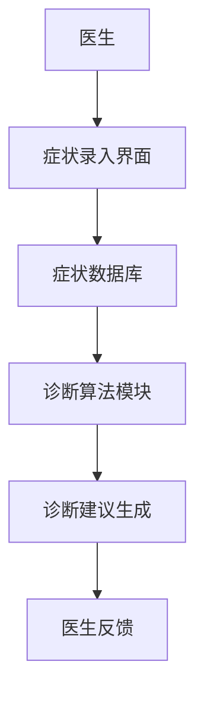
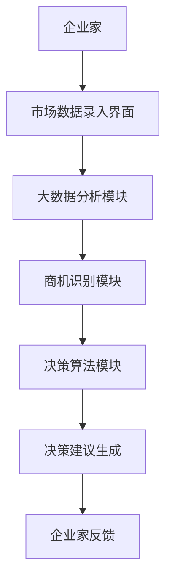

                 

### 引言

在信息技术和人工智能迅猛发展的时代，程序员和工程师们面对着前所未有的挑战和机遇。然而，在这片繁忙的技术海洋中，一个被常常忽视却极其重要的能力就是直觉能力。直觉，作为一种快速、直接的理解和判断方式，不仅能够在复杂的编程问题中提供解决方案，还能够提升创造力和创新思维。直觉不仅仅存在于人类的思维之中，它也在人工智能和机器学习算法的设计和应用中扮演着关键角色。

本篇文章旨在探讨直觉能力的培养和在日常生活中的应用，以期帮助读者提升这一重要的能力。我们将首先定义直觉，探讨其生物学和心理学基础，接着分析直觉在决策、创造力和危机处理中的应用。随后，文章将提供一系列提升直觉能力的方法和技巧，并通过案例研究和实践来验证直觉的实际价值。

为什么直觉如此重要？直觉能力是连接逻辑思维和创造力的桥梁。它能够在短时间内处理大量信息，并迅速做出决策。在编程领域，良好的直觉能力可以帮助开发者更快地定位问题、提出解决方案，甚至创造出前所未有的技术。在人工智能领域，直觉能力则是算法优化和创新的重要推动力。本文将通过逻辑清晰、结构紧凑的论述，逐步揭示直觉能力的奥秘，帮助读者深入理解并有效培养这一关键能力。

### 文章关键词

- 直觉
- 直觉能力
- 决策
- 创造力
- 人工智能
- 直觉培养

### 文章摘要

本文深入探讨了直觉能力的重要性以及其培养和应用。通过定义直觉、分析其生物学和心理学基础，我们揭示了直觉在决策、创造力和危机处理中的关键作用。文章进一步提出了多种提升直觉能力的方法和技巧，并通过实际案例进行验证。最终，本文总结了直觉能力的培养策略，并展望了其未来发展方向，为读者提供了实用的建议和指导。

## 第一部分：引言

### 1. 引言

在科技飞速发展的今天，直觉作为一种不可忽视的思维形式，正逐渐受到更多的关注。直觉，是人类思维的一种快速反应机制，它能够在未经充分分析的情况下，迅速给出判断和决策。在信息爆炸的时代，面对海量数据和复杂问题，直觉能力显得尤为重要。它不仅能够帮助我们迅速识别问题、做出决策，还能够激发我们的创造力和创新思维。

直觉的重要性体现在多个方面。首先，在技术领域，直觉能力是程序员和工程师解决复杂问题的重要工具。在编程过程中，直觉可以帮助开发者迅速定位问题、提出解决方案，从而提高工作效率。其次，在商业决策中，直觉同样发挥着关键作用。通过直觉，企业家能够快速感知市场变化、捕捉商机，从而在激烈的市场竞争中脱颖而出。此外，直觉还在危机处理、创新思维和团队合作中发挥着不可替代的作用。

本篇文章的目的在于深入探讨直觉能力的培养和应用。通过系统的分析和实践，我们将帮助读者理解直觉的本质，掌握提升直觉能力的方法，并将其应用于日常生活和工作中。文章将分为六个部分，首先介绍直觉的定义和本质，接着分析直觉的发展与培养，随后探讨直觉在日常生活中的应用，包括决策、创造力和危机处理等方面。文章的第三部分将介绍提升直觉能力的具体方法和技巧，并通过案例研究与实践验证这些方法的有效性。最后，文章将总结直觉能力的培养策略，并展望其未来发展。

### 1.2 直觉的重要性

直觉作为一种快速的认知过程，其重要性不仅体现在个人生活和职业发展中，还在社会和科技领域产生了深远影响。首先，在个人生活中，直觉是我们应对日常挑战的重要工具。它能够帮助我们在瞬息万变的环境中迅速做出反应，从而避免潜在的危险。例如，当我们走在拥挤的街道上，直觉可能会引导我们避开迎面而来的车辆，从而保证自身安全。在社交场合，直觉同样扮演着重要角色，它可以帮助我们快速判断他人的情绪和意图，从而建立良好的人际关系。

在职业发展中，直觉的重要性更加显著。对于程序员和工程师来说，直觉能力是他们解决复杂问题、提高工作效率的关键。在编程过程中，直觉可以帮助开发者迅速识别问题的根源，并提出有效的解决方案。这种能力不仅能够缩短问题解决时间，还能够减少重复性劳动，从而提高工作效率。对于企业家和管理者来说，直觉在商业决策中同样至关重要。通过直觉，他们能够迅速感知市场变化，捕捉商机，做出正确的战略决策，从而在竞争激烈的市场中立于不败之地。

在社会层面，直觉能力对社会发展和进步有着重要的推动作用。在社会治理和危机管理中，直觉能够帮助决策者迅速识别和应对紧急事件，从而降低风险和损失。例如，在公共安全领域，直觉可以帮助警察快速识别可疑人物，从而预防犯罪。在环境保护和资源管理中，直觉能力同样发挥着关键作用，通过直觉，决策者能够快速评估环境变化和资源需求，从而制定更加有效的政策和措施。

在科技领域，直觉同样具有重要的应用价值。随着人工智能和机器学习技术的发展，直觉成为算法优化和创新的重要推动力。通过模仿人类的直觉能力，人工智能系统可以更高效地处理复杂任务，并做出更准确的决策。例如，在自动驾驶技术中，直觉能力可以帮助车辆快速识别道路状况和潜在危险，从而保证行车安全。在医疗领域，直觉能力同样被广泛应用于疾病诊断和治疗方案的制定，通过直觉，医生可以更快地识别病情，制定更有效的治疗方案。

总之，直觉作为一种不可忽视的思维形式，其重要性不仅体现在个人生活和职业发展中，还在社会和科技领域产生了深远影响。通过深入理解和培养直觉能力，我们可以更好地应对复杂多变的挑战，实现个人和社会的可持续发展。

### 1.3 阅读指南

为了更好地理解本篇文章，读者可以按照以下指南进行阅读。首先，文章将分为六个主要部分，每个部分都针对直觉能力的一个不同方面进行深入探讨。第一部分是引言，介绍了直觉能力的重要性、本篇文章的目的和结构。第二部分探讨直觉的基础，包括定义、生物学和心理学基础。第三部分分析直觉在日常生活中的应用，涵盖决策、创造力和危机处理等方面。第四部分介绍提升直觉能力的方法和技巧。第五部分通过案例研究和实践来验证这些方法的有效性。最后，第六部分总结直觉能力的培养策略，并展望其未来发展方向。

在阅读过程中，读者可以根据以下建议来提高阅读效果。首先，对于每个章节的核心观点和关键概念，建议仔细阅读并做好笔记。特别是对于直觉的定义、发展、培养和应用，这些基础概念需要深入理解。其次，文章中涉及到的案例研究和实践方法，建议结合实际情况进行思考，尝试应用这些方法来提升自己的直觉能力。最后，文章末尾的总结部分提供了对全文的回顾和关键观点的归纳，读者可以在阅读完成后进行回顾，以巩固理解。

通过遵循这个阅读指南，读者可以系统地掌握直觉能力的相关知识，提升自己的直觉能力，并在实际生活和工作中更加游刃有余。

## 第二部分：直觉的基础

### 2.1 直觉的定义与本质

直觉，作为一种非逻辑性的认知过程，是我们在没有充分分析和推理的情况下，快速做出判断和决策的能力。与逻辑推理不同，直觉并不依赖于明确的步骤或规则，而是通过一种直接、迅速的方式处理信息。直觉的产生往往源于我们对环境的深刻理解和丰富的经验积累，这种能力使我们能够在复杂和不确定的情境中迅速作出反应。

定义直觉时，我们需要明确几个关键点。首先，直觉是一种非语言化的认知过程，它不仅仅是感觉或情感，而是一种深层次的认知活动。其次，直觉是非系统化的，这意味着它并不是通过固定的模式或算法来产生结果，而是依赖于个体内部的认知结构和经验。最后，直觉具有快速性和高效性，它能够在短时间内处理大量信息，并迅速给出判断。

直觉的本质在于其对信息的快速处理和整合能力。在生物学上，直觉可以被视为一种进化适应机制，它帮助我们的祖先在野外生存中快速识别危险和机会。在心理学上，直觉被认为是大脑的一种自动化反应，它依赖于我们潜意识中的知识和经验。例如，一个经验丰富的程序员在遇到编程难题时，可能会立即感知到问题的根源，并提出解决方案，这种能力就是直觉的体现。

与思维的关系方面，直觉和思维是互补的。逻辑思维依赖于明确的概念、规则和推理过程，而直觉则是在信息不充分或时间紧迫的情况下，快速处理信息的能力。直觉能够帮助我们在复杂和不确定的环境中，快速做出判断和决策，从而弥补逻辑思维的不足。在实际应用中，直觉和思维常常相互作用，共同完成复杂任务。

直觉的生物学基础主要涉及大脑中的神经系统和大脑的进化过程。研究表明，大脑中的前额叶皮层和杏仁核等区域在直觉产生中扮演重要角色。前额叶皮层负责高级认知功能，包括决策和规划，而杏仁核则负责处理情绪和情感信息。这些区域的协同工作，使得我们能够在面对复杂情境时，快速做出反应。此外，直觉的生物学基础还涉及我们大脑中的神经通路和神经网络，这些结构使得我们能够在不同情境中，迅速调用相关知识和经验。

在心理学研究中，直觉也得到了广泛的探讨。心理学家通过实验和观察，揭示了直觉的多种特征和表现形式。例如，直觉具有快速性、高效性和适应性。快速性体现在直觉能够在短时间内处理大量信息，并迅速做出判断；高效性体现在直觉能够高效地利用大脑中的认知资源，完成复杂任务；适应性则体现在直觉能够根据不同情境，灵活调整和适应。

直觉的类型和特点也是心理学研究的重要领域。根据不同的研究，直觉可以分为情境直觉、情境直觉和策略直觉。情境直觉是指在面对特定情境时，快速做出适应性和决策性的反应；情境直觉是指在没有明确情境信息的情况下，利用已有的知识和经验进行判断；策略直觉是指在面对复杂和不确定的情境时，利用直觉来制定策略和决策。这些不同的直觉类型，反映了直觉在多种认知任务中的表现形式。

总结来说，直觉是一种快速、直接的理解和判断能力，它在我们的生活中扮演着至关重要的角色。通过理解直觉的定义、本质、生物学基础和心理学特征，我们可以更好地认识和理解直觉，从而在实际生活和工作中更加游刃有余。

### 2.2 直觉与思维

直觉和思维是两种不同的认知过程，但它们之间存在着紧密的联系。思维，通常指的是通过逻辑推理和理性分析来解决问题和获取知识的过程。它依赖于明确的步骤、规则和概念框架，是一种高度结构化的认知活动。而直觉，则是在没有充分分析和推理的情况下，快速做出判断和决策的能力。直觉通常是非语言化的，依赖于我们的潜意识知识和经验。

首先，直觉和思维在处理信息的方式上有所不同。思维依赖于明确的推理步骤和逻辑规则，通过逐步分析信息来得出结论。而直觉则是在信息不充分或时间紧迫的情况下，迅速处理和整合信息的产物。直觉能够快速识别模式和关联，从而提供即时的判断和决策。

其次，直觉和思维在认知资源的使用上也有区别。思维需要集中注意力和认知资源，通过逐步分析和推理来解决问题。而直觉则是一种自动化过程，不需要额外的注意力资源，能够在没有明确指令的情况下，快速处理信息。

尽管直觉和思维在处理信息的方式上有所不同，但它们并不是互相排斥的，而是相互补充的。在实际应用中，直觉和思维常常共同发挥作用，完成复杂任务。例如，在编程过程中，程序员可能会通过直觉快速识别问题的根源，并通过逻辑思维来详细分析并提出解决方案。这种结合使得程序员能够更高效地解决问题。

直觉和思维的结合在多种情境中具有显著的优势。在决策过程中，直觉能够快速提供方向性的判断，而逻辑思维则能够在这些判断的基础上，进行深入分析和论证，从而提高决策的质量。在创新过程中，直觉能够激发新的想法和创意，而逻辑思维则能够对这些想法进行验证和优化，从而推动创新的发展。

此外，直觉和思维的结合也有助于提升我们的适应能力和灵活性。在面对复杂和不确定的情境时，直觉能够帮助我们快速适应环境变化，而逻辑思维则能够帮助我们制定更有效的应对策略。这种双重能力的结合，使得我们在面对多变和复杂的环境时，能够更加从容和高效。

总之，直觉和思维是两种不同的认知过程，但它们在实际应用中常常相互补充。通过理解直觉和思维之间的关系，我们可以更好地利用这两种能力，提高认知效率和解决问题的能力。

### 2.3 直觉的生物学基础

直觉的生物学基础主要涉及大脑的神经系统和进化过程。理解这些基础有助于我们更好地认识直觉的运作机制，以及其在人类行为中的作用。

首先，大脑中的前额叶皮层在直觉过程中发挥着关键作用。前额叶皮层是大脑中负责高级认知功能的部分，包括决策、规划、社交互动和情绪控制。研究表明，前额叶皮层中的特定区域，如眶前额叶皮质和前扣带皮层，与直觉判断密切相关。这些区域通过复杂的神经网络，处理来自不同感官的信息，并将其整合为统一的认知体验。

其次，杏仁核也是直觉产生的重要大脑结构。杏仁核位于大脑的基底，主要负责处理情绪和情感信息。它通过快速反应机制，帮助我们在面对潜在威胁时迅速做出反应。例如，当我们在黑暗中听到突如其来的声音时，杏仁核会立即激活，促使我们快速转身查看，以保护自己。这种快速反应机制是直觉能力的重要组成部分。

大脑的神经通路和神经网络也在直觉中扮演重要角色。大脑中的神经通路是连接不同脑区的神经网络，它们使得信息能够迅速传递和处理。例如，前额叶皮层和杏仁核之间的神经通路，使得情绪和认知信息可以快速整合，从而影响直觉判断。

从进化的角度来看，直觉能力是自然界中的生存机制之一。在人类进化过程中，直觉能力帮助我们的祖先迅速识别危险和机会，从而提高生存和繁衍的几率。例如，直觉使我们能够快速判断食物是否安全，避免摄入有毒物质。此外，直觉也帮助我们识别潜在的威胁，如捕食者或其他危险情况。

神经科学研究还揭示了大脑中的多巴胺系统在直觉中的作用。多巴胺是一种神经递质，它在大脑中传递愉悦和奖励信号。研究表明，多巴胺系统的活动与直觉判断密切相关。当我们做出正确直觉判断时，多巴胺系统的活动会增加，从而产生愉悦感。这种愉悦感是直觉能力进化的动力之一。

总之，直觉的生物学基础涉及大脑中的多个结构和系统。前额叶皮层和杏仁核等大脑结构通过复杂的神经网络和神经通路，处理和整合信息，从而产生直觉。从进化的角度来看，直觉能力是生存和繁衍的重要机制。通过理解这些生物学基础，我们可以更好地认识直觉的运作机制，并在实际生活中更好地利用这一能力。

### 2.4 直觉的心理学研究

直觉在心理学领域是一个广泛而深入的研究主题，涉及到认知心理学、社会心理学和神经心理学等多个分支。通过这些研究，我们能够更深入地理解直觉的本质、特征以及其在各种情境中的应用。

首先，认知心理学家对直觉进行了广泛的探讨，试图揭示直觉是如何运作的。认知心理学家认为，直觉是通过经验积累和模式识别产生的。例如，贝叶斯推理模型（Bayesian reasoning）表明，直觉判断往往依赖于我们对先前信息的整合和处理。当面对新的情境时，我们的大脑会迅速调用以往的经验，结合当前的信息，做出快速判断。这种快速判断并不依赖于复杂的逻辑推理，而是通过直觉机制实现的。

在社会心理学中，研究者探讨了直觉在社交互动中的作用。社会心理学家发现，直觉在人际交往中至关重要。例如，我们能够通过直觉快速识别他人的情绪和意图，从而做出相应的反应。这种能力有助于我们建立和维护人际关系。此外，直觉还能帮助我们在社交情境中快速做出决策，如是否信任某人、是否接受一个邀请等。这些研究表明，直觉不仅影响我们的个人决策，也影响我们的社交行为。

神经心理学家通过脑成像技术，研究了直觉与大脑活动之间的关系。例如，功能磁共振成像（fMRI）研究表明，前额叶皮层和杏仁核等大脑区域在直觉判断中活跃。这些区域的活动模式与直觉判断的准确性和速度密切相关。神经心理学的研究还揭示了情绪和直觉之间的紧密联系。例如，研究表明，情绪状态会影响直觉判断的准确性。当个体处于积极的情绪状态时，他们的直觉判断往往更加准确；而当处于消极情绪状态时，直觉判断的准确性会降低。

在应用心理学领域，直觉的研究也具有实际意义。例如，在临床心理学中，直觉被用于诊断和治疗。心理治疗师通过直觉感知患者的情绪和需求，从而制定个性化的治疗计划。在咨询心理学中，直觉帮助咨询师快速识别问题，提供有效的建议。此外，直觉还在教育领域得到应用。例如，教师通过直觉感知学生的需求和状态，从而调整教学策略，提高教学效果。

尽管直觉在心理学研究中得到了广泛关注，但关于直觉的本质和机制仍然存在许多争议。一些研究者认为，直觉是一种非理性的认知过程，而另一些研究者则认为直觉是一种基于经验和知识的理性认知过程。这些不同的观点反映了直觉研究的复杂性和多样性。

总之，直觉的心理学研究揭示了直觉在认知、社交、情绪和实际应用中的重要作用。通过这些研究，我们能够更好地理解直觉的运作机制，并在实际生活中更好地利用这一能力。未来，随着技术的进步和研究方法的创新，我们对直觉的理解将更加深入和全面。

### 2.5 直觉的类型与特点

直觉作为一种复杂而多变的认知过程，可以根据其表现形式和功能划分为多种类型。每种类型的直觉都有其独特的特点和应用场景。

**情境直觉**是指在面对特定情境时，个体能够迅速识别并作出适应性行为的能力。这种直觉通常依赖于对情境的深刻理解和经验积累。例如，在驾驶时，司机能够快速感知道路状况和周围环境，从而做出紧急避让或变道等决策。情境直觉的特点是快速性和准确性，它允许个体在紧迫的情境中做出即时反应，而不需要经过复杂的分析过程。

**策略直觉**是在面对复杂和不确定的情境时，个体能够迅速制定和调整策略的能力。策略直觉不仅依赖于对当前情境的理解，还需要对长期目标和潜在风险进行评估。例如，企业家在市场竞争中能够快速判断市场趋势，制定相应的战略计划，以保持竞争优势。策略直觉的特点是其前瞻性和灵活性，它允许个体在多变的环境中快速适应和调整。

**情绪直觉**是指个体能够快速识别他人的情绪和感受，并作出相应反应的能力。这种直觉在人际交往中至关重要，它帮助我们建立和维护人际关系。例如，在社交场合中，我们能够通过直觉感知他人的情绪，从而调整自己的行为，避免冲突或增进互动。情绪直觉的特点是其敏感性和适应性，它使个体能够迅速识别和处理情绪信息，提高人际交往的质量。

**直觉思维**是一种非系统化的认知过程，它依赖于经验和直觉，而不是逻辑推理。直觉思维的特点是创造性、灵活性和快速性。例如，在解决复杂问题时，程序员可能会通过直觉快速找到解决方案，而不是经过详细的步骤分析和推理。直觉思维的特点是它能够跳出传统的逻辑框架，提出新颖的解决方案。

**直觉决策**是指在没有充分分析的情况下，个体能够快速做出决策的能力。直觉决策的特点是其快速性和高效性，它使个体能够在时间紧迫或信息不充分的情况下，迅速作出判断。例如，在紧急情况下，消防员能够迅速判断火源位置，制定救援计划，而不需要经过详细的计算和分析。直觉决策的特点是其在高压情境中的有效性，它使个体能够在有限的时间内做出最佳决策。

每种类型的直觉都有其特定的表现形式和功能，但它们之间并不是相互独立的，而是相互补充和互动的。在实际应用中，直觉的类型和特点决定了我们在不同情境下的认知和行为。通过理解和培养不同类型的直觉，我们能够更好地应对复杂多变的挑战，提高认知和决策能力。

### 2.6 直觉的发展与培养

直觉能力并非天生具备，而是可以通过后天的培养和发展逐步提升。在个体成长的过程中，直觉能力受到多种因素的影响，包括环境、经验和心理状态等。

首先，环境因素对直觉能力的发展具有重要影响。一个充满挑战和刺激的环境有助于个体直觉能力的培养。例如，在科技行业中，工程师们常常需要快速处理大量信息并做出决策，这种高压环境能够促使他们不断提高直觉能力。相反，过于稳定和舒适的环境可能会限制直觉的发展，因为缺乏变化和挑战。

其次，经验积累是直觉能力培养的关键。经验丰富的个体在处理问题时，能够更快地识别模式和关联，从而提高直觉判断的准确性。例如，一个经验丰富的医生在面对复杂的病情时，能够迅速做出准确的诊断，这得益于多年的临床经验和知识积累。通过不断积累经验，个体能够逐步培养出敏锐的直觉。

此外，心理状态也对直觉能力有着重要影响。一个放松和自信的心理状态有助于直觉的产生。研究表明，焦虑和压力可能会抑制直觉能力，而积极和放松的状态则能够提高直觉的准确性和效率。因此，心理调适和情绪管理是培养直觉能力的重要环节。

以下是一些具体的方法和技巧，可以帮助个体培养和提升直觉能力：

1. **多样化学习与经验积累**：通过不断尝试新事物、学习新知识，个体可以扩展自己的认知领域，从而提高直觉能力。多样化学习不仅包括专业领域，还应涵盖跨学科的知识和技能。

2. **情境模拟与实战演练**：通过模拟真实情境进行演练，个体可以在模拟环境中锻炼直觉反应能力。这种方法有助于个体在实际情境中更快速和准确地做出决策。

3. **反思与总结**：在处理问题和决策过程中，个体应不断进行反思和总结，分析哪些直觉判断是有效的，哪些是无效的。通过反思，个体可以逐步优化自己的直觉判断过程。

4. **情绪管理与心理调适**：通过练习冥想、瑜伽或其他放松技巧，个体可以缓解焦虑和压力，提高心理状态。一个放松和自信的心理状态有助于直觉的产生和发挥。

5. **跨领域学习与思维拓展**：通过跨领域学习，个体可以扩展自己的思维模式和知识结构，从而提高直觉的多样性和灵活性。例如，一个程序员可以通过学习艺术和哲学，提高自己的创造力和创新思维。

6. **培养好奇心与探索精神**：好奇心和探索精神能够激发个体的直觉能力。通过不断提问和探索未知领域，个体可以培养出敏锐的直觉。

总之，直觉能力的培养是一个系统性、长期的过程，需要个体在多种方面进行努力和实践。通过多样化学习、情境模拟、反思总结和情绪管理，个体可以逐步提升自己的直觉能力，从而在实际生活和工作中更加游刃有余。

### 2.7 常见的直觉培养技巧

要有效地培养直觉能力，可以尝试以下几种常见技巧和方法，这些方法不仅能提升直觉的准确性，还能增强直觉的可靠性。

**1. 反思和自我观察**

反思是培养直觉的重要手段之一。通过反思自己的思维过程和行为，个体可以识别出直觉判断的优缺点，从而逐步优化直觉能力。例如，每次完成一个任务后，可以花时间思考以下问题：

- 我的直觉判断在哪些方面是正确的？
- 在哪些情况下直觉判断不准确？
- 我能否改进我的直觉判断过程？

通过持续的反思，个体可以更好地理解直觉的运作机制，并逐步提高其准确性。

**2. 情境模拟和实战演练**

情境模拟是一种有效的直觉培养方法。通过在模拟环境中重复练习，个体可以在虚拟情境中锻炼直觉反应能力。这种方法可以帮助个体在实际情境中更快、更准确地做出决策。例如，程序员可以通过编写模拟测试用例，模拟各种编程问题，从而在实际编码过程中更快地识别和解决问题。

**3. 多元化学习与经验积累**

多元化学习是提升直觉能力的重要途径。通过学习不同领域和技能，个体可以扩展自己的认知范围，从而提高直觉的多样性和灵活性。例如，一个专注于技术的程序员可以通过学习心理学、哲学或艺术，来丰富自己的思维模式，提高直觉判断的全面性。

**4. 培养好奇心与探索精神**

好奇心和探索精神是直觉的重要源泉。通过保持对新知识和新领域的兴趣，个体可以激发直觉思维。例如，定期阅读不同领域的书籍、参加研讨会或探索未知领域，都可以帮助个体保持好奇心，从而提高直觉能力。

**5. 反馈与评估**

获取反馈是提高直觉能力的重要步骤。通过与同事、朋友或导师交流，个体可以获得外部评价，从而了解自己的直觉判断在哪些方面需要改进。例如，在完成一个项目后，可以请导师或同事提供反馈，以评估直觉判断的准确性和效率。

**6. 心理调适与情绪管理**

情绪状态对直觉能力有显著影响。一个放松和自信的心理状态有助于直觉的产生和发挥。通过练习冥想、瑜伽或其他放松技巧，个体可以缓解焦虑和压力，提高心理状态。此外，保持积极的心态和乐观的情绪，也有助于直觉的准确性和可靠性。

**7. 跨领域思维与问题解决**

跨领域思维是一种有效的直觉培养方法。通过将不同领域的知识和方法应用到实际问题中，个体可以拓展思维模式，提高直觉的灵活性和创造性。例如，在解决一个技术问题时，可以尝试应用心理学或艺术的方法，从而找到新颖的解决方案。

通过这些方法和技巧，个体可以逐步培养和提升自己的直觉能力，从而在实际生活和工作中更加游刃有余。直觉不仅是一种认知能力，更是一种生活智慧，通过有效培养和运用，可以带来更高的效率和创新力。

### 2.8 直觉培养的最佳实践

在培养直觉能力的过程中，最佳实践方法至关重要。以下是一些经过验证的高效方法，帮助读者在实际生活和工作中不断提升直觉能力。

**1. 经验积累与反思**

首先，通过积累经验和持续反思，是培养直觉能力的核心方法。在日常工作中，无论是编程、项目管理还是其他领域，个体应不断总结自己的经验和教训。每次完成任务后，花时间思考以下几个问题：

- 我的直觉判断在哪些方面是正确的？
- 在哪些情况下直觉判断不准确？
- 我能否改进我的直觉判断过程？

通过这种持续的反思，个体可以逐步优化自己的直觉判断，提高其准确性和可靠性。

**2. 多元化学习与跨领域实践**

多元化学习是扩展认知范围、提升直觉能力的关键。通过学习不同领域的知识和技能，个体可以培养更全面的思维模式。例如，程序员可以学习心理学、艺术或哲学，从而在技术问题中引入新的视角和方法。跨领域实践不仅能够丰富知识体系，还能提高直觉的灵活性和创造性。

**3. 实战演练与情境模拟**

实战演练和情境模拟是锻炼直觉反应能力的有效方法。在技术领域，程序员可以通过编写模拟测试用例、参与代码竞赛或解决实际项目中的问题，来锻炼直觉判断。这种方法有助于在虚拟环境中提高直觉的准确性和速度。

**4. 心理调适与情绪管理**

情绪状态对直觉能力有重要影响。通过练习冥想、瑜伽或其他放松技巧，个体可以缓解焦虑和压力，提高心理状态。一个放松和自信的心理状态有助于直觉的产生和发挥。此外，保持积极的心态和乐观的情绪，也有助于直觉的准确性和可靠性。

**5. 跨领域交流与反馈**

与不同领域的人交流，是获取新知识和反馈的重要途径。通过参与跨领域研讨会、讲座或团队合作，个体可以获得新的观点和见解，从而丰富自己的认知。同时，积极寻求反馈，尤其是来自不同领域的反馈，可以帮助个体识别直觉判断中的盲点和不足，从而不断优化自己的直觉能力。

**6. 反思与总结**

定期进行反思和总结，是巩固和提高直觉能力的必要步骤。个体可以设置周期性回顾，如每周或每月，对过去一段时间的直觉判断进行系统总结。通过这种方式，个体可以识别出直觉能力的提升点，并制定改进计划。

**7. 培养好奇心与探索精神**

好奇心和探索精神是激发直觉能力的重要动力。个体应保持对新知识和新领域的兴趣，不断提问和探索未知。例如，定期阅读不同领域的书籍、参与线上课程或探索新的技术趋势，都可以帮助个体保持好奇心，从而提高直觉能力。

通过上述最佳实践，个体可以在日常生活中有意识地培养和提升直觉能力，从而在实际工作和生活中更加游刃有余。

### 2.9 直觉能力的测量与评估

直觉能力的测量与评估是理解其发展水平的重要步骤，有助于个体和专业人士制定针对性的培养计划。以下是一些常用的方法和工具，用于测量和评估直觉能力：

**1. 直觉能力测试**

直觉能力测试是一种科学的方法，通过一系列标准化的测试题，评估个体在特定情境中的直觉判断能力。常见的测试包括逻辑推理题、情境判断题和反应速度题等。这些测试题设计科学、标准，能够较为准确地反映个体的直觉能力水平。

**2. 性格测试**

性格测试，如迈尔斯-布里格斯性格类型指标（MBTI）和大五人格测试（Big Five Personality Test），可以通过评估个体的性格特征，揭示其直觉模式和行为倾向。这些测试题能够帮助个体了解自己在不同情境中的直觉表现，从而进行自我调整和优化。

**3. 反馈机制**

通过反馈机制，个体可以获得来自同事、朋友或导师的外部评价。这些反馈可以帮助个体识别直觉判断中的盲点和不足。例如，在一个团队项目中，团队成员可以定期进行反馈会议，分享自己的直觉判断和结果，从而互相学习和改进。

**4. 反思日志**

反思日志是一种自我评估的方法，个体可以定期记录自己的直觉判断和决策过程。通过分析这些日志，个体可以识别直觉判断的规律和趋势，从而进行优化和改进。

**5. 实际任务评估**

在实际任务中，通过评估个体在解决问题和决策过程中的直觉表现，可以直观地了解其直觉能力水平。例如，程序员可以通过编程测试、项目管理评估或创新方案设计等任务，来评估其直觉能力。这种方法不仅能够测量直觉的准确性，还能评估其在实际应用中的效果。

通过上述方法和工具，个体和专业人士可以系统、全面地评估直觉能力，从而制定有针对性的培养计划，进一步提高直觉能力。

### 2.10 直觉能力的发展趋势

随着科技的不断进步和心理学研究的深入，直觉能力的发展呈现出一些新的趋势和方向。首先，人工智能（AI）的发展为直觉能力的研究提供了新的工具和方法。通过机器学习和深度学习技术，研究者可以模拟和优化人类的直觉过程，从而更好地理解直觉的运作机制。例如，AI算法能够通过大量的数据训练，自动识别模式和关联，模拟人类的直觉判断过程。

其次，神经科学技术的进步为直觉能力的研究提供了更深入的洞察。脑成像技术，如功能磁共振成像（fMRI）和脑电图（EEG），使得研究者能够直接观测大脑在直觉判断过程中的活动。这些技术可以帮助揭示直觉产生的生物学基础，以及大脑中的神经通路和神经网络如何协同工作，从而提高直觉的准确性和效率。

在应用层面，直觉能力的培养和应用正逐渐渗透到各个领域。在教育中，通过情境模拟和跨领域学习，学生可以培养和提升直觉能力。在商业领域，直觉决策和企业家的创新思维被广泛应用于市场分析和战略制定。在医疗领域，直觉能力被用于疾病诊断和治疗方案的制定，从而提高医疗效率和准确性。

未来，直觉能力的研究和发展趋势还可能包括以下几个方面：

1. **跨学科融合**：随着不同学科之间的融合，直觉能力的研究将更加综合。例如，心理学、生物学、计算机科学和社会科学等领域的研究者可以共同探索直觉的多样性和复杂性。

2. **个性化直觉培养**：通过大数据和个性化学习技术，可以开发出针对个体差异的直觉培养方案，从而实现更精准和高效的能力提升。

3. **人工智能与直觉的结合**：随着AI技术的进步，人工智能系统将更好地模拟和增强人类的直觉能力。这种结合不仅有助于提高AI系统的决策质量，还能为人类提供更智能化的辅助工具。

4. **社会影响力**：直觉能力在社会治理、危机管理和公共政策制定中的重要性日益凸显。未来，直觉能力的研究将更加注重其在社会层面的应用，推动社会的发展和进步。

总之，直觉能力的发展趋势呈现出跨学科融合、个性化培养和人工智能结合等特点，未来将在各个领域中发挥越来越重要的作用。

### 2.11 直觉能力的提升策略

提升直觉能力是一个系统性工程，需要从多个角度进行综合培养。以下是一些具体的策略和技巧，可以帮助读者在实际生活和工作中有效提升直觉能力：

**1. 经验积累与反思**

首先，通过积累经验和持续反思是提升直觉能力的核心。在日常工作中，无论是编程、项目管理还是其他领域，个体应不断总结自己的经验和教训。每次完成任务后，花时间思考以下问题：

- 我的直觉判断在哪些方面是正确的？
- 在哪些情况下直觉判断不准确？
- 我能否改进我的直觉判断过程？

通过这种持续的反思，个体可以逐步优化自己的直觉判断，提高其准确性和可靠性。

**2. 多元化学习与跨领域实践**

多元化学习是扩展认知范围、提升直觉能力的关键。通过学习不同领域和技能，个体可以培养更全面的思维模式。例如，程序员可以学习心理学、艺术或哲学，从而在技术问题中引入新的视角和方法。跨领域实践不仅能够丰富知识体系，还能提高直觉的多样性和灵活性。

**3. 实战演练与情境模拟**

实战演练和情境模拟是锻炼直觉反应能力的有效方法。在技术领域，程序员可以通过编写模拟测试用例、参与代码竞赛或解决实际项目中的问题，来锻炼直觉判断。这种方法有助于在虚拟环境中提高直觉的准确性和速度。

**4. 心理调适与情绪管理**

情绪状态对直觉能力有显著影响。通过练习冥想、瑜伽或其他放松技巧，个体可以缓解焦虑和压力，提高心理状态。一个放松和自信的心理状态有助于直觉的产生和发挥。此外，保持积极的心态和乐观的情绪，也有助于直觉的准确性和可靠性。

**5. 跨领域交流与反馈**

与不同领域的人交流，是获取新知识和反馈的重要途径。通过参与跨领域研讨会、讲座或团队合作，个体可以获得新的观点和见解，从而丰富自己的认知。同时，积极寻求反馈，尤其是来自不同领域的反馈，可以帮助个体识别直觉判断中的盲点和不足，从而不断优化自己的直觉能力。

**6. 反思与总结**

定期进行反思和总结，是巩固和提高直觉能力的必要步骤。个体可以设置周期性回顾，如每周或每月，对过去一段时间的直觉判断进行系统总结。通过这种方式，个体可以识别出直觉能力的提升点，并制定改进计划。

**7. 培养好奇心与探索精神**

好奇心和探索精神是激发直觉能力的重要动力。个体应保持对新知识和新领域的兴趣，不断提问和探索未知。例如，定期阅读不同领域的书籍、参与线上课程或探索新的技术趋势，都可以帮助个体保持好奇心，从而提高直觉能力。

通过上述策略和技巧，个体可以在日常生活中有意识地培养和提升直觉能力，从而在实际工作和生活中更加游刃有余。

### 2.12 直觉能力的培养与职业发展

直觉能力在职业发展中扮演着至关重要的角色。它不仅能够提升工作效率，还能够促进创新和决策能力，从而在竞争激烈的职场中脱颖而出。以下将从不同职业背景出发，探讨直觉能力的培养对其职业发展的影响。

**1. 程序员**

在编程领域，直觉能力是解决复杂问题的重要工具。经验丰富的程序员能够通过直觉快速识别代码中的潜在错误和优化机会。例如，当面对一个性能瓶颈时，一个具有良好直觉能力的程序员能够迅速定位问题所在，并提出高效的解决方案。为了培养直觉能力，程序员可以通过以下方法：

- **代码重构与反思**：通过不断重构自己的代码，并反思每次重构的原因和效果，程序员可以提升对代码结构的直觉。
- **参与代码审查**：参与团队代码审查，通过观察他人的代码，可以学习不同的编程风格和解决问题的方法。
- **实战演练**：通过参与代码竞赛和解决实际项目中的问题，程序员可以在实战中锻炼直觉判断能力。

**2. 企业家**

在商业领域，直觉能力是企业家的核心竞争力之一。通过直觉，企业家能够迅速感知市场变化，捕捉商机，做出战略决策。例如，一个成功的企业家在市场竞争中能够通过直觉判断，快速调整产品策略或市场定位，从而保持竞争优势。为了培养直觉能力，企业家可以：

- **多样化学习**：通过学习不同领域的知识，如心理学、经济学和管理学，企业家可以扩展自己的认知范围，提高直觉的多样性。
- **情境模拟**：通过模拟市场变化和竞争环境，企业家可以在虚拟情境中锻炼直觉反应能力。
- **积极寻求反馈**：通过获取来自不同领域的反馈，企业家可以识别直觉判断中的盲点和不足，从而不断优化自己的直觉能力。

**3. 医生**

在医疗领域，直觉能力被广泛应用于诊断和治疗。医生通过直觉能够快速识别患者的病情，制定有效的治疗方案。例如，一个经验丰富的医生在面对复杂的病例时，能够通过直觉迅速做出准确的判断，从而提高医疗效率和准确性。为了培养直觉能力，医生可以：

- **案例分析**：通过分析大量的病例，医生可以学习不同病情的特点和变化，从而提高直觉判断的准确性。
- **反思与总结**：每次治疗结束后，医生应进行反思和总结，分析直觉判断的正确性和不足，以便不断优化直觉能力。
- **跨学科交流**：通过与不同领域的专家交流，医生可以获取新的见解和方法，从而丰富自己的直觉思维。

**4. 教师**

在教育事业中，直觉能力帮助教师快速识别学生的需求和状态，从而调整教学策略。一个具有良好直觉能力的教师能够通过观察学生的行为和反应，了解他们的学习进度和理解程度，从而提供个性化的教学支持。为了培养直觉能力，教师可以：

- **观察与反思**：通过观察学生的行为和反应，教师可以学习如何识别和理解学生的需求。
- **多样化教学**：通过引入多样化的教学方法，教师可以激发学生的兴趣，从而提高直觉判断的准确性。
- **反思与交流**：定期进行教学反思，并与同事交流教学经验，可以帮助教师不断优化直觉能力。

总之，直觉能力在各个职业领域中都具有重要的应用价值。通过有效的培养和运用，个体可以提升自己的职业能力，实现更高效、更创新的工作表现。

### 2.13 直觉能力在日常生活中的应用

直觉能力不仅在职业发展中发挥重要作用，在日常生活中也具有广泛的应用。它帮助我们在面对各种情境时做出快速而准确的决策，提高生活质量。以下将详细探讨直觉能力在日常生活中的具体应用场景。

**1. 安全防护**

直觉能力在安全防护中至关重要。例如，当我们在行走或驾驶时，直觉能够帮助我们迅速识别潜在的危险，从而避免事故。一个常见的例子是，在拥挤的街道上，当我们听到背后的汽车鸣笛声时，直觉会迅速告诉我们需要加快步伐或注意行车。这种快速反应能力源于我们多年的生活经验和观察，它帮助我们规避潜在的威胁。

**2. 社交互动**

在社交互动中，直觉能力帮助我们识别他人的情绪和意图。例如，在面试时，直觉可以帮助我们快速评估面试官的情绪，从而调整自己的回答方式，以建立更好的沟通。此外，在团队工作中，直觉能力使我们能够迅速识别团队成员的需求和状态，从而更好地协调合作。一个典型的例子是，当团队成员表现出紧张或不安时，直觉会提醒我们提供支持或调整工作安排，以帮助他们缓解压力。

**3. 家庭管理**

家庭管理中，直觉能力帮助我们应对各种日常事务。例如，在购物时，直觉会帮助我们快速判断商品的质量和价格，从而做出更明智的购买决策。此外，在处理家庭纠纷时，直觉能力可以帮助我们迅速找到解决问题的方法，避免不必要的争吵。例如，当家庭成员之间发生矛盾时，直觉会提示我们采取宽容和理解的态度，从而缓解紧张的气氛。

**4. 健康保健**

直觉能力在健康保健中也有重要应用。例如，当我们感到身体不适时，直觉会提示我们需要进行体检或就医。一个常见的例子是，当感冒症状持续加重时，直觉会告诉我们需要看医生，而不是拖延病情。此外，在饮食和锻炼方面，直觉能力帮助我们做出健康的选择。例如，当我们在选择餐馆或食品时，直觉会提示我们选择营养均衡的选项，而不是高热量或不健康的食品。

**5. 自我提升**

在自我提升方面，直觉能力帮助我们识别和抓住成长机会。例如，当我们面临职业发展的抉择时，直觉会提示我们选择最有利的发展路径。一个典型的例子是，当我们收到一份工作邀请时，直觉会告诉我们是否接受这份工作，而不是仅仅考虑薪资和职位。此外，直觉能力还帮助我们识别自己的兴趣和潜力，从而制定更有效的学习和发展计划。

总之，直觉能力在日常生活中无处不在，它帮助我们在面对各种情境时做出更快速、更准确的决策，从而提高生活质量。通过培养和提升直觉能力，我们可以在日常生活中更加游刃有余，应对各种挑战。

### 2.14 直觉在决策中的角色

直觉在决策过程中扮演着至关重要的角色，它不仅提高了决策的效率，还在一定程度上优化了决策的质量。理解直觉在决策中的具体角色和影响，有助于我们更好地利用这一非逻辑性的认知能力。

首先，直觉在决策过程中提供了快速判断的途径。在时间紧迫或信息不充分的情况下，直觉能够迅速分析信息，提供方向性的判断。例如，在商业决策中，企业家可能需要快速判断市场趋势，决定是否投入大量资金进行新产品开发。通过直觉，他们能够快速感知市场变化，做出决策，从而抓住商机。

其次，直觉在决策过程中具有补充逻辑推理的不足。尽管逻辑推理是一种系统化的决策方式，但它依赖于完整的信息和明确的步骤。而在现实生活中，信息往往是稀缺和不完整的，此时直觉的作用就显得尤为重要。直觉能够利用个体过去的经验和对情境的理解，快速填补信息空白，提供有效的决策依据。

第三，直觉在决策中的另一个重要角色是提供创新思维。直觉往往能够跳出传统的逻辑框架，提出新颖的解决方案。在创意工作中，直觉可以帮助艺术家和设计师快速捕捉灵感，形成独特的创意。例如，在艺术创作中，艺术家通过直觉感知色彩和形态的变化，从而创造出独特的艺术作品。

此外，直觉在风险管理和危机处理中同样具有重要影响。在面对突发危机时，直觉能够快速识别潜在风险，提供应对策略。例如，在突发事件中，直觉会提示我们采取紧急措施，避免进一步的损失。直觉的快速反应能力使得个体能够迅速应对危机，降低风险。

直觉在团队决策中也发挥着关键作用。通过直觉，团队成员能够快速感知他人的情绪和意图，从而提高协作效率。例如，在团队项目中，直觉可以帮助团队成员迅速识别合作中的问题，并提出有效的解决方案。直觉还能够增强团队的凝聚力，促进团队成员之间的信任和理解。

总之，直觉在决策中的角色是多方面的，它不仅提高了决策的效率，还优化了决策的质量。通过理解直觉的运作机制和具体应用，我们可以更好地利用这一能力，提高决策能力和创新思维。在未来的发展中，进一步研究和应用直觉，将为决策理论和实践带来新的视角和方法。

### 2.15 直觉在商业决策中的应用

直觉在商业决策中起着至关重要的作用，特别是在快速变化和不确定性较高的市场环境中。通过直觉，企业家和决策者能够迅速感知市场动态，捕捉商机，做出更为明智的决策。以下将详细探讨直觉在商业决策中的应用及其重要性。

首先，直觉在市场预测方面具有显著优势。在高度动态的市场环境中，信息往往不够完整且变化迅速。通过直觉，企业家能够快速捕捉市场趋势和消费者需求的变化，从而做出更为精准的市场预测。例如，在新兴科技领域，直觉可以帮助企业家快速判断哪些技术具有巨大潜力，从而抢占市场先机。

其次，直觉在战略决策中发挥着关键作用。直觉能够提供方向性的判断，帮助决策者在复杂和不确定的情况下迅速做出决策。例如，在是否进入一个新市场或推出一个新产品时，直觉可以帮助企业家快速评估潜在风险和收益，从而做出更为明智的决策。这种快速反应能力在竞争激烈的市场环境中尤为重要。

直觉还在品牌管理和市场营销中具有广泛应用。通过直觉，营销人员能够快速识别消费者的情感和需求，从而制定更具吸引力的营销策略。例如，在社交媒体营销中，直觉可以帮助营销人员迅速判断哪些内容能够引起消费者的共鸣，从而提高品牌知名度和市场份额。

此外，直觉在人力资源管理中同样具有重要应用。直觉能够帮助决策者快速评估候选人的能力和潜力，从而做出更为科学的招聘决策。例如，在面试过程中，直觉可以帮助招聘人员迅速判断候选人是否与公司文化和价值观相符，从而提高招聘成功率。

直觉在商业决策中的应用不仅提高了决策效率，还优化了决策质量。通过结合直觉和逻辑分析，企业家和决策者能够做出更为全面和明智的决策，从而在竞争激烈的市场中保持竞争优势。因此，培养和提升直觉能力对于商业决策者来说至关重要。

总之，直觉在商业决策中的应用具有广泛而深远的影响。它不仅帮助企业家快速感知市场动态，捕捉商机，还优化了决策过程，提高了决策质量。通过理解和利用直觉，企业家和决策者可以更好地应对市场变化，实现企业的持续发展和成功。

### 2.16 直觉在个人生活中的应用

直觉在个人生活中的应用同样广泛而深远，它帮助我们在日常生活中做出更明智的选择，提升生活质量。以下将详细探讨直觉在个人生活中的几个关键应用领域。

**1. 健康管理**

直觉在健康管理中扮演着重要角色。通过直觉，我们可以快速感知身体的状况，从而采取及时的健康措施。例如，当我们感到疲劳或不适时，直觉会提醒我们休息或寻求医疗帮助。一个典型的例子是，当感冒症状出现时，直觉会促使我们及时就医，避免病情恶化。

此外，直觉在饮食选择和锻炼习惯中也有重要作用。通过直觉，我们可以判断哪些食物对我们的健康更有益，从而做出更健康的饮食选择。同样，直觉可以帮助我们选择适合自己的锻炼方式，从而保持良好的身体素质。

**2. 社交互动**

直觉在社交互动中同样发挥着关键作用。通过直觉，我们可以快速识别他人的情绪和意图，从而更有效地与他人沟通。例如，在团队合作中，直觉可以帮助我们判断团队成员的需求和状态，从而调整自己的行为，提高协作效率。

直觉还在人际关系中起到重要作用。通过直觉，我们可以感知对方的情绪变化，从而更敏锐地应对人际关系中的问题。例如，在家庭矛盾中，直觉可以帮助我们识别问题的根源，采取有效的沟通策略，缓解紧张的气氛。

**3. 职业发展**

直觉在职业发展中同样具有重要应用。通过直觉，我们可以快速识别职业机会和挑战，从而做出更有利的发展决策。例如，在职业晋升或跳槽时，直觉可以帮助我们判断哪些机会更符合我们的职业规划和个人兴趣。

此外，直觉在职业规划中也起到重要作用。通过直觉，我们可以感知自己的职业潜力和兴趣，从而制定更符合个人发展的职业规划。例如，当我们在考虑转行时，直觉会提示我们新的职业方向，帮助我们找到更适合自己的职业路径。

**4. 精神成长**

直觉在精神成长中同样具有重要作用。通过直觉，我们可以感知内心的需求和愿望，从而更好地理解自己。例如，在面临人生重大决策时，直觉可以帮助我们识别内心的真实想法，从而做出更符合自己价值观的选择。

此外，直觉在冥想和心灵修炼中也起到关键作用。通过直觉，我们可以与内心深处建立更深的连接，从而实现心灵的平静和自我成长。

总之，直觉在个人生活中的应用广泛而深远。它帮助我们在健康管理、社交互动、职业发展和精神成长等方面做出更明智的选择，提升生活质量。通过培养和提升直觉能力，我们可以更好地应对日常生活中的各种挑战，实现个人和生活的全面发展。

### 2.17 直觉与直觉力的关系

直觉和直觉力是密切相关的概念，但它们在认知过程中的作用和表现形式有所不同。直觉是指一种非逻辑性的认知过程，它允许个体在未经充分分析和推理的情况下，迅速做出判断和决策。直觉力，则是对直觉能力的衡量，它反映了一个体在特定情境中运用直觉进行高效决策和问题解决的能力。

直觉力是直觉能力的具体表现，它受到多种因素的影响，包括经验、认知能力、情绪状态和心理调适等。一个具有高直觉力的人，能够在复杂和不确定的情境中，快速、准确地做出决策。例如，一个经验丰富的外科医生在手术中能够通过直觉力迅速判断和处理突发情况，从而提高手术的成功率。

首先，直觉力与经验密切相关。丰富的经验积累使得个体在处理问题时能够更快地调用相关知识和技能，提高直觉判断的准确性和效率。例如，程序员在编写复杂的代码时，通过多年的编程经验，能够迅速识别潜在的错误和优化机会。

其次，认知能力对直觉力有重要影响。高水平的认知能力，包括逻辑推理、空间感知和模式识别等，有助于个体在处理信息时更加高效。例如，一个具有高认知能力的人能够在短时间内处理大量信息，从而做出更准确的直觉判断。

情绪状态也是直觉力的重要影响因素。积极的情绪状态，如自信和放松，有助于提升直觉力的发挥。而消极的情绪状态，如焦虑和压力，可能会抑制直觉力的表现。例如，一个在考试中感到焦虑的学生，可能会因为情绪压力而无法充分发挥自己的直觉力。

心理调适在提升直觉力方面同样至关重要。通过练习冥想、瑜伽等心理调适方法，个体可以缓解焦虑和压力，提高心理状态。一个放松和自信的心理状态有助于直觉力的发挥，从而在复杂情境中做出更明智的决策。

总之，直觉和直觉力是相互关联的概念，直觉力是直觉能力在实际情境中的具体表现。通过丰富的经验积累、高水平的认知能力、积极的情绪状态和有效的心理调适，个体可以提升自己的直觉力，从而在复杂和不确定的情境中更加游刃有余。

### 2.18 直觉在团队合作中的作用

直觉在团队合作中扮演着重要的角色，它不仅能够提升团队协作效率，还能够促进创新和决策的质量。以下是直觉在团队合作中的具体应用和优势。

首先，直觉能够帮助团队成员在短时间内识别问题并提出解决方案。在复杂的项目中，团队成员可能会面临各种突发事件和挑战。通过直觉，团队成员能够迅速感知问题所在，并提出有效的应对策略。例如，在软件开发过程中，团队成员可能会在代码审查时通过直觉识别潜在的缺陷和优化机会，从而提高代码质量。

其次，直觉有助于增强团队凝聚力。直觉能够帮助团队成员更好地理解彼此的情绪和需求，从而提高协作效率。例如，在团队会议中，直觉可以帮助团队成员迅速识别出团队成员的情绪变化，从而调整讨论方式，避免冲突和误解。这种理解和协调能够增强团队的凝聚力，提高工作效率。

第三，直觉在决策过程中发挥了关键作用。通过直觉，团队成员能够在信息不充分或时间紧迫的情况下，快速做出决策。例如，在紧急情况下，团队需要迅速制定应对策略，直觉能够帮助团队成员迅速判断情况，提出可行的解决方案。这种快速反应能力在应对突发事件时尤为重要。

此外，直觉还能够促进团队创新。直觉思维常常能够跳出传统的逻辑框架，提出新颖的解决方案。例如，在产品创新过程中，团队成员可以通过直觉捕捉到用户需求和市场趋势，从而提出创新的产品设计和功能。这种创新思维有助于团队在激烈的市场竞争中保持竞争优势。

最后，直觉还能够提高团队的适应能力。在变化多端的环境中，团队需要具备快速适应能力。通过直觉，团队成员能够更灵活地应对环境变化，迅速调整策略和行动方案。这种适应能力有助于团队在面对不确定性时保持稳定和高效。

总之，直觉在团队合作中具有广泛的应用和优势。通过有效利用直觉，团队成员能够提升协作效率、促进创新和做出更明智的决策，从而提高团队的整体绩效。

### 2.19 直觉在危机处理中的价值

直觉在危机处理中具有无可替代的价值，它能够帮助个体和团队在紧急情况下迅速做出反应，降低风险和损失。以下详细探讨直觉在危机处理中的具体作用和重要性。

首先，直觉在危机识别中起到关键作用。在危机爆发初期，往往存在大量不确定性和模糊性，此时直觉能够帮助个体快速识别潜在的风险和威胁。例如，在金融市场中，交易员可以通过直觉迅速感知市场的异常波动，从而及时采取避险措施。直觉的快速反应能力使得个体能够在危机初期采取行动，避免事态进一步恶化。

其次，直觉在危机应对中同样至关重要。在紧急情况下，直觉能够帮助个体迅速评估形势，并制定有效的应对策略。例如，在突发事件中，消防队员可以通过直觉迅速判断火灾的来源和蔓延速度，从而制定合理的救援方案。直觉的快速判断能力使得个体能够在高压环境下做出准确的决策，提高应对效率。

此外，直觉在危机沟通中也具有重要作用。直觉能够帮助个体迅速理解他人的情绪和需求，从而更好地进行沟通和协作。在危机情况下，团队成员需要紧密协作，直觉能够帮助他们在短时间内建立信任，提高沟通效率。例如，在灾难发生后，救援队伍可以通过直觉迅速识别受灾群众的情绪和需求，从而提供有效的心理和物质支持。

直觉在危机处理中的重要性还体现在其前瞻性和预见性。通过直觉，个体能够预见危机可能带来的影响，并提前采取预防措施。例如，在环境保护中，科学家可以通过直觉快速判断环境污染的潜在影响，从而制定有效的治理措施。这种预见能力有助于降低危机发生的概率，减轻危机带来的损失。

总之，直觉在危机处理中具有不可替代的价值。它能够帮助个体和团队在危机中迅速识别风险、做出反应和有效沟通，从而降低风险和损失。通过培养和提升直觉能力，我们可以在面对危机时更加从容和高效，确保个人和组织的持续发展。

### 2.20 直觉在创新思维中的应用

直觉在创新思维中扮演着重要角色，它能够激发新颖的想法，推动科技、艺术和文化领域的创新。以下将详细探讨直觉在创新思维中的具体应用和作用。

首先，直觉在科技领域的创新中具有显著作用。科技行业的发展离不开创新，而直觉是创新思维的重要推动力。例如，在人工智能和机器学习领域，直觉可以帮助研究人员快速识别潜在的技术突破点，提出新的算法和模型。一个典型的例子是，谷歌的DeepMind团队在开发AlphaGo时，通过直觉快速判断出围棋游戏的复杂性和创新解决方案。

其次，直觉在艺术创作中发挥着关键作用。艺术家和设计师通过直觉捕捉灵感，创作出独特的艺术作品。直觉能够帮助艺术家跳出传统的创作框架，探索新的表现形式和艺术风格。例如，在绘画和音乐创作中，艺术家可以通过直觉感知色彩、节奏和情感的组合，从而创作出具有感染力的艺术作品。

此外，直觉在文化创新中同样具有重要应用。文化创新需要打破旧有的思维模式，创造新的文化形式和表达方式。通过直觉，文化创作者能够快速感知社会变迁和文化趋势，提出创新的文化理念。例如，在影视制作和文学创作中，创作者可以通过直觉捕捉到社会现象和人性冲突，从而创作出引人入胜的作品。

直觉在创新思维中的另一个重要作用是提供前瞻性思维。直觉能够帮助个体预见未来的变化和趋势，从而在创新中占据先机。例如，在环保科技领域，直觉可以帮助创业者预见未来环保需求，从而开发出新的绿色技术和产品。

总之，直觉在创新思维中具有不可替代的价值。它能够激发新颖的想法，推动科技、艺术和文化领域的创新。通过培养和提升直觉能力，我们可以在创新过程中更加敏锐地捕捉机遇，实现个人和组织的持续发展。

### 2.21 直觉在创意工作中的应用

直觉在创意工作中扮演着至关重要的角色，它能够帮助创作者迅速捕捉灵感，激发创新思维，从而创造出独特而有影响力的作品。以下将详细探讨直觉在创意工作中的应用和作用。

首先，直觉是创意工作的灵感源泉。在艺术、设计、写作等创意领域中，直觉能够帮助创作者在瞬间捕捉到灵感和创意。例如，在绘画时，艺术家可能会通过直觉感知到某种色彩或形态的组合，从而激发出独特的艺术创作灵感。这种直觉性的灵感往往是不经意之间产生的，是创作者内心深处情感和经验的一种自然流露。

其次，直觉在创意构思中起到关键作用。在创意构思阶段，直觉可以帮助创作者快速跳出传统的思维框架，提出新颖的创意和概念。例如，在广告创意中，广告策划人员可能会通过直觉感知到某个社会现象或文化趋势，从而构思出独特的广告创意。直觉的快速判断能力使得创作者能够在短时间内生成多个创意方案，从而提高创意构思的效率。

此外，直觉在创意实施过程中同样具有重要应用。在创意实施阶段，直觉能够帮助创作者迅速识别问题和调整策略，确保创意作品的顺利完成。例如，在影视制作中，导演可能会通过直觉感知到某个场景的拍摄效果不佳，从而及时调整拍摄方案，以确保最终作品的品质。

直觉还在跨领域创意工作中具有显著作用。通过直觉，创作者可以整合不同领域的知识和经验，提出跨领域的创新创意。例如，在科技与艺术的结合中，设计师可能会通过直觉感知到科技趋势和艺术理念，从而创造出独特的艺术装置或科技产品。

总之，直觉在创意工作中具有不可替代的价值。它能够帮助创作者迅速捕捉灵感，激发创新思维，推动创意作品的创作。通过培养和提升直觉能力，创作者可以在创意工作中更加游刃有余，创作出更多具有影响力的作品。

### 2.22 直觉在科技创新中的作用

直觉在科技创新中发挥着关键作用，它不仅能够激发新的科学发现，还能推动技术进步和创新思维。以下详细探讨直觉在科技创新中的具体应用和作用。

首先，直觉在科学研究中起到重要的启发作用。科学家在探索未知领域时，往往需要依靠直觉来捕捉灵感。例如，在物理学中，科学家通过直觉感知到自然界中的某种规律或现象，从而提出新的理论或假设。爱因斯坦的广义相对论就是通过他的直觉，提出了时空弯曲的概念，从而改变了我们对宇宙的理解。

其次，直觉在技术开发中具有重要作用。在技术研发过程中，工程师和技术人员需要依靠直觉来判断技术的可行性和潜在的创新点。例如，在人工智能领域，直觉可以帮助研究人员快速识别出哪些算法和模型具有巨大的潜力，从而选择进行深入研究。此外，直觉还能帮助工程师在设计新产品或系统时，迅速发现潜在的问题和优化机会。

直觉还在技术创新思维中起到关键作用。技术创新往往需要跳出传统的思维框架，通过直觉思维，技术人员可以提出新颖的解决方案和思路。例如，在生物技术领域，通过直觉思维，科学家们提出了基因编辑技术，从而在医学和农业领域带来了革命性的变化。这种直觉思维不仅推动了技术的进步，还开辟了新的应用领域。

此外，直觉在跨学科合作中也发挥着重要作用。在科技创新中，不同学科的知识和方法的融合常常需要直觉的支持。通过直觉，跨学科团队可以快速识别出不同领域之间的潜在联系，提出创新的融合方案。例如，在智能制造领域，通过直觉，工程师、计算机科学家和材料科学家可以共同探讨如何将先进的制造技术与新材料结合，从而开发出更高效、更环保的制造工艺。

总之，直觉在科技创新中具有不可替代的价值。它能够激发科学发现，推动技术进步，促进创新思维。通过培养和提升直觉能力，科技工作者可以在创新过程中更加敏锐地捕捉机遇，推动科技创新的不断前进。

### 2.23 直觉与创新思维

直觉与创新思维密切相关，它们共同构成了推动创新的重要动力。直觉作为一种非逻辑性的认知过程，能够迅速捕捉到信息中的关键点和模式，从而激发创新思维。以下是直觉如何通过多种方式促进创新思维的详细探讨。

首先，直觉能够帮助创新者跳出传统思维框架。在创新过程中，传统的逻辑思维往往会受到现有知识和经验的影响，限制创新思维的发挥。而直觉则不受这些限制，它能够帮助创新者从全新的视角看待问题，从而提出突破性的解决方案。例如，在产品创新中，直觉可能会引导设计师发现一个被传统思维忽视的用户需求，从而设计出全新的产品形态。

其次，直觉能够激发灵感。直觉思维往往能够在一瞬间捕捉到灵感和创意，这是创新思维的重要来源。例如，在艺术创作中，艺术家可能会通过直觉感知到某种色彩或形状的搭配，从而激发出独特的艺术构思。同样，在科学研究中，直觉可以帮助科学家捕捉到自然界中的某种规律，从而推动科学理论的突破。

第三，直觉能够提高决策效率。在创新过程中，决策速度至关重要。直觉能够帮助创新者快速评估不同方案的优势和劣势，从而迅速做出决策。例如，在商业创新中，企业家可能会通过直觉快速判断某个市场机会的可行性，从而抓住商机。这种快速决策能力有助于企业在激烈的市场竞争中占据优势。

此外，直觉还能够促进跨领域的创新思维。通过直觉，创新者可以跨越不同领域的界限，整合不同领域的知识和方法，从而提出创新的融合方案。例如，在医疗科技领域，通过直觉，医生和工程师可以共同探讨如何将人工智能与医学影像技术结合，从而开发出更精准的诊断工具。

最后，直觉能够增强创新思维的可视化能力。直觉思维往往能够在脑海中形成生动的图像和场景，这有助于创新者更直观地理解和表达创新理念。例如，在产品设计过程中，直觉可以帮助设计师在脑海中构建出产品的外观和使用场景，从而更好地进行设计优化。

总之，直觉在创新思维中具有不可替代的作用。它能够帮助创新者跳出传统思维框架，激发灵感，提高决策效率，促进跨领域融合，并增强可视化能力。通过培养和提升直觉能力，创新者可以更加敏锐地捕捉创新机会，推动创新思维的发展。

### 2.24 直觉在艺术家和设计师中的应用

直觉在艺术家和设计师的创作过程中起着至关重要的作用，它不仅激发了丰富的创意，还推动了艺术形式和设计风格的创新。以下详细探讨直觉在艺术家和设计师中的应用及其影响。

首先，直觉是艺术家灵感的源泉。在艺术创作中，艺术家常常通过直觉感知到内心的情感和外在世界的景象，从而激发出新颖的艺术构思。例如，画家在创作时，可能会通过直觉感知到某种色彩组合或构图方式，从而创作出具有独特视觉冲击力的画作。这种直觉性的灵感使得艺术作品充满了个性化和独特性。

其次，直觉在设计过程中起到了关键作用。设计师在创作设计时，需要通过直觉快速捕捉用户需求和市场趋势。直觉帮助他们跳出传统的思维框架，提出新颖的设计理念。例如，在工业设计中，设计师可能会通过直觉感知到未来科技的发展趋势，从而设计出具有前瞻性的产品。这种直觉性的设计理念不仅满足了用户需求，还引领了市场潮流。

此外，直觉在艺术和设计的创新中具有不可替代的价值。直觉能够帮助艺术家和设计师迅速识别和利用新的技术和材料，从而推动艺术形式和设计风格的创新。例如，在数字艺术领域，通过直觉，艺术家可以探索虚拟现实和增强现实技术，创作出全新的艺术形式。同样，在建筑设计中，设计师可以通过直觉感知到可持续发展和绿色建筑的必要性，从而设计出更环保、更人性化的建筑作品。

直觉还在艺术和设计的表达和沟通中发挥了重要作用。艺术家和设计师通过直觉感知到观众的感受和需求，从而调整自己的创作方向，提高作品的共鸣效果。例如，在剧场表演中，表演者可能会通过直觉感知到观众的反应，从而调整表演节奏和情感表达，使演出更加生动和感人。

总之，直觉在艺术家和设计师的创作过程中具有不可替代的作用。它激发了丰富的创意，推动了艺术形式和设计风格的创新，提高了作品的个性化和社会影响力。通过培养和提升直觉能力，艺术家和设计师可以更加敏锐地捕捉创作灵感，创作出更多具有时代特色和艺术价值的作品。

### 2.25 提升直觉能力的方法

要提升直觉能力，可以采用多种科学的方法和技巧，这些方法不仅有助于增强直觉的准确性和可靠性，还能提高直觉在日常生活和工作中的实用性。以下是一些具体的方法：

**1. 经验积累与反思**

经验是直觉能力提升的基础。通过不断积累经验，个体可以在处理问题时更加得心应手。例如，程序员可以通过编写和审查大量代码，积累解决问题的经验，从而提高直觉判断的准确性。每次完成任务后，进行反思和总结，分析哪些直觉判断是有效的，哪些是无效的，有助于逐步优化直觉能力。

**2. 多元化学习与跨领域实践**

多元化学习有助于扩展认知范围，提高直觉的多样性。通过学习不同领域的知识和技能，个体可以培养更全面的思维模式。例如，程序员可以通过学习心理学、艺术或哲学，来丰富自己的思维模式。跨领域实践不仅能够提升直觉能力，还能提高创造性思维。

**3. 情境模拟与实战演练**

情境模拟和实战演练是锻炼直觉反应能力的有效方法。通过在模拟环境中进行演练，个体可以在虚拟情境中锻炼直觉反应能力。例如，程序员可以通过编写模拟测试用例、参与代码竞赛或解决实际项目中的问题，来锻炼直觉判断。

**4. 心理调适与情绪管理**

情绪状态对直觉能力有显著影响。通过练习冥想、瑜伽或其他放松技巧，个体可以缓解焦虑和压力，提高心理状态。一个放松和自信的心理状态有助于直觉的产生和发挥。此外，保持积极的心态和乐观的情绪，也有助于直觉的准确性和可靠性。

**5. 反馈与评估**

获取反馈是提升直觉能力的重要步骤。通过与同事、朋友或导师交流，个体可以获得外部评价，从而了解自己的直觉判断在哪些方面需要改进。例如，在完成一个项目后，可以请导师或同事提供反馈，以评估直觉判断的准确性和效率。

**6. 培养好奇心与探索精神**

好奇心和探索精神是激发直觉能力的重要动力。通过保持对新知识和新领域的兴趣，个体可以激发直觉思维。例如，定期阅读不同领域的书籍、参加研讨会或探索未知领域，都可以帮助个体保持好奇心，从而提高直觉能力。

**7. 跨领域交流与反馈**

与不同领域的人交流，是获取新知识和反馈的重要途径。通过参与跨领域研讨会、讲座或团队合作，个体可以获得新的观点和见解，从而丰富自己的认知。同时，积极寻求反馈，尤其是来自不同领域的反馈，可以帮助个体识别直觉判断中的盲点和不足，从而不断优化自己的直觉能力。

通过这些方法和技巧，个体可以在日常生活中有意识地培养和提升直觉能力，从而在实际工作和生活中更加游刃有余。

### 2.26 跨领域学习与直觉培养

跨领域学习是提升直觉能力的有效途径，它能够通过拓展知识面和思维模式，增强直觉的灵活性和多样性。以下详细探讨跨领域学习如何促进直觉培养，并提供具体的实例和方法。

首先，跨领域学习能够丰富个体的知识体系，从而提高直觉的多样性。通过学习不同领域的知识，个体可以获得更广泛的视角和思维方式。例如，一个专注于技术的程序员通过学习心理学，可以了解人类行为和心理机制，从而在编程时更好地设计用户界面，提升用户体验。这种多元化的知识背景有助于直觉在不同领域中的应用，提高直觉的准确性和适应性。

其次，跨领域学习能够促进思维模式的创新，激发直觉思维。例如，通过学习艺术和设计，程序员可以培养出更多的创造性和审美能力，从而在技术项目中提出新颖的解决方案。一个通过学习艺术培训的程序员，可能会在开发新的软件界面时，借鉴绘画和设计的灵感，创造出独特且用户友好的界面。

跨领域学习在直觉培养中的应用可以通过以下实例和方法进行：

**1. 交叉学科研究项目**

参与跨学科研究项目，是跨领域学习的一种有效方式。例如，一个计算机科学专业的学生可以参与一个涉及心理学和神经科学的研究项目，通过研究人脑对信息处理的机制，提高编程时的人机交互设计能力。

**2. 参加跨学科研讨会和讲座**

定期参加跨学科研讨会和讲座，可以接触到不同领域的知识和观点。例如，程序员可以参加心理学、艺术和哲学的研讨会，了解这些领域的最新研究进展，从而激发新的灵感。

**3. 读书俱乐部**

组建读书俱乐部，邀请来自不同领域的成员，共同阅读和研究跨学科的经典著作。例如，一个科技领域的俱乐部可以阅读《人类简史》和《黑天鹅：如何应对不可预知的未来》，通过讨论这些书籍，成员们可以拓展自己的思维模式，提高直觉能力。

**4. 实践项目**

通过参与实践项目，将跨学科知识应用到实际情境中。例如，一个程序员可以参与一个涉及社会学和市场营销的项目，设计一个能够响应社会需求和市场的技术解决方案。

**5. 跨领域团队合作**

在工作和学习中，积极参与跨领域团队合作，与不同领域的同事合作，能够增强直觉培养。例如，一个程序员可以加入一个由设计师、心理学家和市场营销专家组成的团队，通过合作，从不同角度分析问题，提高直觉判断的全面性。

总之，跨领域学习是提升直觉能力的重要途径。通过扩展知识面和思维模式，跨领域学习不仅能够丰富直觉的多样性，还能激发创新思维，提高直觉的灵活性和准确性。通过具体的实例和方法，个体可以在跨领域学习中不断培养和提升自己的直觉能力，从而在实际工作和生活中更加游刃有余。

### 2.27 心理健康与直觉能力的关系

心理健康与直觉能力之间存在密切的联系，心理状态对直觉能力的发挥有着重要影响。一个健康的心理状态有助于直觉能力的提升，而心理问题则可能抑制直觉的发挥。以下将详细探讨心理健康与直觉能力之间的关系，并提供一些心理健康的维护方法。

首先，心理健康对直觉能力有着直接影响。一个放松、自信和乐观的心理状态有助于直觉的产生和发挥。当个体处于积极的心理状态时，他们的大脑能够更加高效地处理信息，从而提高直觉判断的准确性和速度。例如，一个在工作和生活中感到满意和放松的程序员，往往能够在编程中更快地识别问题和提出解决方案。

相反，心理问题，如焦虑、压力和情绪困扰，可能会抑制直觉的发挥。长期处于焦虑和压力状态的人，往往难以集中注意力和进行有效思考，这会影响直觉能力的表现。例如，一个在紧张的项目期限内工作的程序员，可能会因为焦虑而无法充分发挥自己的直觉能力，从而导致问题解决效率下降。

此外，心理健康与直觉能力的提升也密切相关。通过维护心理健康，个体可以更好地培养和提升直觉能力。以下是一些维护心理健康的方法：

**1. 定期锻炼**

定期进行体育锻炼，如跑步、游泳或瑜伽，有助于缓解压力，提高心理健康。研究表明，锻炼可以释放内啡肽，提升情绪，从而有助于直觉能力的发挥。

**2. 冥想和放松技巧**

通过冥想、深呼吸或其他放松技巧，个体可以缓解焦虑和压力，提高心理状态。这些方法有助于个体在高压情境中保持冷静和清晰，从而提高直觉判断的准确性。

**3. 睡眠质量**

保证充足的睡眠对心理健康至关重要。睡眠不足会影响大脑的功能，包括记忆和注意力，从而影响直觉能力。一个良好的睡眠质量有助于个体在白天更加敏锐和高效。

**4. 社交互动**

与家人、朋友和同事保持良好的社交互动，有助于缓解孤独感和情绪压力。通过社交互动，个体可以分享经验、获得支持，从而提高心理健康水平。

**5. 心理咨询**

在面临严重的心理问题时，寻求专业的心理咨询是一个有效的途径。心理咨询可以帮助个体识别和应对心理问题，从而改善心理健康，提升直觉能力。

总之，心理健康与直觉能力之间存在密切的联系。通过维护心理健康，个体可以更好地培养和提升直觉能力，从而在日常生活和工作中更加游刃有余。

### 2.28 睡眠与直觉

睡眠是人体恢复和恢复精力的关键时期，对大脑功能和直觉能力有着重要影响。高质量的睡眠有助于提升直觉能力，而睡眠不足或睡眠质量差则可能抑制直觉的发挥。以下将详细探讨睡眠与直觉能力之间的关系，并提供一些改善睡眠质量的建议。

首先，睡眠对大脑功能有着直接影响。在睡眠过程中，大脑会进行清除垃圾蛋白质、巩固记忆和恢复神经功能等重要的生理活动。这些过程有助于大脑保持最佳状态，从而提高直觉能力。例如，研究表明，在经历了一夜的充足睡眠后，个体在决策和问题解决中的直觉判断更为准确和高效。

其次，睡眠不足或睡眠质量差会影响大脑的功能，从而抑制直觉能力的发挥。长期睡眠不足会导致大脑疲劳，降低注意力、记忆力和决策能力。例如，一个经常熬夜的程序员可能会发现自己难以在编程中快速识别问题，直觉判断的准确性也会下降。

睡眠与直觉能力之间的关系还体现在睡眠周期的不同阶段。深度睡眠和快速眼动（REM）睡眠阶段对大脑的恢复和认知功能尤为重要。深度睡眠有助于清除大脑中的毒素，促进神经生长和连接，从而提高直觉能力。快速眼动睡眠阶段则有助于巩固记忆和情绪处理，进一步影响直觉的表现。

以下是一些改善睡眠质量的建议：

**1. 保持规律的作息时间**

建立规律的作息时间，有助于身体形成稳定的生物钟，提高睡眠质量。每天尽量在同一时间上床和起床，有助于身体适应自然睡眠节奏。

**2. 创造良好的睡眠环境**

保持安静、黑暗和凉爽的睡眠环境有助于提高睡眠质量。避免在床上使用电子设备，减少蓝光照射，有助于促进睡眠。

**3. 放松身心**

在睡前进行放松活动，如冥想、深呼吸或瑜伽，有助于缓解压力，促进睡眠。这些放松技巧能够帮助身体和大脑进入放松状态，从而提高睡眠质量。

**4. 避免咖啡因和酒精**

咖啡因和酒精可能影响睡眠质量。特别是在睡前摄入咖啡因和酒精，会干扰睡眠周期，降低睡眠质量。因此，建议在睡前减少咖啡因和酒精的摄入。

**5. 适量运动**

适量运动有助于提高睡眠质量。但需要注意的是，避免在睡前进行剧烈运动，以免影响睡眠。适当的轻量运动，如散步或瑜伽，有助于放松身心，促进睡眠。

总之，睡眠对直觉能力有着重要影响。通过保持良好的睡眠质量和规律的作息时间，个体可以提升直觉能力，从而在日常生活和工作中更加游刃有余。

### 2.29 环境对直觉能力的影响

环境因素在很大程度上影响直觉能力的发挥和培养。一个积极、支持性的环境可以促进直觉能力的提升，而消极、压力重重的环境则可能抑制直觉的表现。以下详细探讨环境对直觉能力的影响，并提供一些改善环境的建议。

首先，社会文化背景对直觉能力的培养有显著影响。在一个鼓励创新和直觉思维的社会文化环境中，个体更容易培养和发挥直觉能力。例如，在科技企业和创意产业较为发达的地区，人们普遍重视创新和直觉，这有助于个体在工作和生活中更加自信地运用直觉。相反，在一个保守、强调逻辑思维和程序化的社会文化背景下，个体可能更倾向于依赖逻辑推理，从而抑制直觉的发挥。

其次，物理环境也对直觉能力有直接影响。一个安静、舒适、整洁的物理环境有助于个体集中注意力和思维，从而提高直觉能力。例如，一个安静的办公室环境有助于程序员集中精力进行编程，快速识别和解决问题。而一个嘈杂、混乱的环境则可能分散注意力，降低直觉判断的准确性。

此外，人际关系和团队合作环境对直觉能力也有重要影响。在一个支持和信任的团队环境中，个体更容易分享直觉判断，从而共同探索问题解决方案。这种积极的互动有助于提升直觉能力的发挥。例如，一个充满支持和反馈的团队，可以帮助团队成员相互学习和成长，提高整体的直觉能力。相反，在一个竞争激烈、缺乏信任的环境中，个体可能会因为害怕失败而不敢分享直觉判断，从而抑制直觉的表现。

以下是一些改善环境的建议：

**1. 创建积极的文化氛围**

在企业或组织中，创建一个鼓励创新和直觉思维的文化氛围，有助于个体发挥直觉能力。例如，通过组织创新工作坊、鼓励员工提出新想法，可以激发直觉思维。

**2. 优化物理环境**

通过优化物理环境，如提供安静的办公空间、舒适的座椅和充足的自然光线，可以提高个体的直觉能力。一个舒适的物理环境有助于个体保持专注和高效。

**3. 建立支持和信任的团队关系**

通过建立支持和信任的团队关系，个体可以在团队中更加自信地分享直觉判断。例如，定期举行团队反馈会议，鼓励成员提出和讨论直觉判断，可以提高团队的整体直觉能力。

**4. 提供心理支持**

为员工提供心理支持，如心理咨询和压力管理培训，有助于缓解工作压力，提高心理健康水平。一个健康的心态有助于个体更好地发挥直觉能力。

总之，环境因素对直觉能力有重要影响。通过创建积极的社会文化氛围、优化物理环境、建立支持和信任的团队关系，以及提供心理支持，可以提升直觉能力的发挥和培养。

### 2.30 直觉能力的评估与反馈

评估直觉能力是一个系统性的过程，它不仅有助于我们了解自己的直觉水平，还能为未来的提升提供方向。以下将探讨直觉能力的评估方法和反馈机制，并提供具体的评估工具和反馈策略。

首先，直觉能力的评估可以通过以下几种方法进行：

**1. 直觉能力测试**

直觉能力测试是一种科学的评估方法，通过一系列标准化的测试题，评估个体在特定情境中的直觉判断能力。这些测试题通常包括逻辑推理题、情境判断题和反应速度题等。例如，卡特尔直觉能力测验（Catell's Test of Insight）和威斯康星卡片分类测验（Wisconsin Card Sorting Test）都是常用的直觉能力评估工具。

**2. 反馈机制**

在工作和生活中，通过反馈机制，个体可以获得来自同事、朋友或导师的外部评价。这些反馈可以帮助个体识别直觉判断中的盲点和不足。例如，在一个团队项目中，团队成员可以定期进行反馈会议，分享自己的直觉判断和结果，从而互相学习和改进。

**3. 自我评估**

通过自我评估，个体可以反思自己的直觉判断过程和结果。每次完成任务后，个体可以花时间思考以下问题：

- 我的直觉判断在哪些方面是正确的？
- 在哪些情况下直觉判断不准确？
- 我能否改进我的直觉判断过程？

通过自我评估，个体可以逐步优化自己的直觉能力。

其次，以下是一些具体的评估工具和反馈策略：

**1. 直觉能力评估工具**

- **卡特尔直觉能力测验（Catell's Test of Insight）**：这是一项涵盖多种直觉判断能力的标准化测试，能够全面评估个体的直觉水平。
- **威斯康星卡片分类测验（Wisconsin Card Sorting Test）**：该测验通过要求个体分类和排序不同图案的卡片，评估其直觉和认知能力。

**2. 反馈策略**

- **定期反馈会议**：定期与同事或导师进行反馈会议，分享自己的直觉判断和决策过程，获取外部评价。
- **反思日志**：通过记录和反思每次直觉判断的过程和结果，个体可以逐步识别优缺点，制定改进计划。
- **情境模拟**：通过情境模拟和实战演练，个体可以在虚拟环境中评估直觉判断的准确性和效率。

**3. 反馈机制**

- **多维反馈**：通过获取来自不同领域和视角的反馈，个体可以获得更全面的评价，从而识别直觉判断中的盲点和不足。
- **即时反馈**：在特定任务完成后，立即进行反馈和评估，有助于个体及时调整直觉判断过程。
- **持续反馈**：通过持续的反馈和评估，个体可以逐步优化直觉能力，实现长期的提升。

通过使用这些评估工具和反馈策略，个体可以系统、全面地了解自己的直觉能力，从而制定有针对性的提升计划，进一步优化直觉判断。

### 2.31 反馈机制在直觉培养中的应用

反馈机制在直觉培养中起着至关重要的作用，它不仅帮助个体识别和纠正直觉判断中的错误，还能促进直觉能力的持续提升。以下将详细探讨反馈机制在直觉培养中的应用，并介绍如何利用外部反馈和自我反馈来优化直觉能力。

首先，外部反馈是直觉培养的重要工具。外部反馈通常来自于导师、同事或专业人士的评价，这些评价可以帮助个体从外部视角了解自己的直觉判断，发现潜在的问题和盲点。例如，在一个编程项目中，团队成员可以互相审查代码，提供针对直觉判断的反馈，指出可能存在的逻辑漏洞和优化机会。这种外部反馈不仅能够帮助个体识别直觉判断的不足，还能提供新的视角和思路，从而促进直觉能力的提升。

**1. 定期反馈会议**

定期反馈会议是一种有效的反馈机制，它为团队成员提供了一个交流和分享直觉判断的平台。在反馈会议上，团队成员可以分享自己的直觉判断过程和结果，听取他人的意见和建议。通过这种互动，个体可以从多个角度审视自己的直觉判断，识别其中的优缺点。例如，程序员可以在每周的项目会议上，展示自己的代码和解决方案，并接受团队成员的反馈，从而不断优化直觉判断。

**2. 专业评审**

邀请专业人士进行评审是另一种有效的反馈方式。专业人士通常具有丰富的经验和专业知识，他们的评价能够提供高价值的反馈。例如，一个程序员可以邀请经验丰富的技术专家对项目进行评审，从专业角度分析直觉判断的合理性和有效性。这种专业评审不仅能够帮助个体提升直觉能力，还能为项目提供更科学的解决方案。

其次，自我反馈是直觉培养的另一重要手段。自我反馈是通过个体自身的反思和总结，来识别和改进直觉判断。通过自我反馈，个体可以更加深入地理解自己的直觉过程，从而逐步优化直觉能力。

**1. 反思日志**

反思日志是一种常见的自我反馈工具，个体可以在每次完成任务后，记录自己的直觉判断过程和结果。通过反思日志，个体可以回顾和分析直觉判断的准确性，识别其中的错误和不足。例如，程序员可以在每次提交代码后，记录自己的判断过程，分析哪些直觉判断是有效的，哪些需要改进。这种反思可以帮助个体逐步优化直觉判断，提高其准确性和效率。

**2. 情境模拟**

情境模拟是另一种有效的自我反馈方法，它通过模拟实际情境，帮助个体在实践中检验和提升直觉能力。在模拟环境中，个体可以尝试不同的直觉判断，并通过实际结果来评估其准确性。例如，程序员可以通过编写模拟测试用例，模拟各种编程问题，从而在实际编码过程中锻炼和提升直觉判断能力。

通过外部反馈和自我反馈的结合，个体可以系统、全面地提升直觉能力。外部反馈提供了新的视角和评价，而自我反馈则帮助个体深入理解和改进直觉过程。这两种反馈机制相辅相成，共同推动直觉能力的持续提升。

### 2.32 直觉能力的自我评估

自我评估是提升直觉能力的重要步骤，通过自我评估，个体可以了解自己的直觉水平，发现优势和不足，并制定相应的改进计划。以下将介绍几种自我评估的方法和工具，以及如何通过日常练习和反思来提高直觉能力。

**1. 自我评估方法**

- **反思日志**：记录自己的直觉判断过程和结果，分析哪些判断是准确的，哪些需要改进。每次完成任务后，花时间反思直觉判断的细节，包括判断依据、决策过程和结果评估。

- **情境模拟**：通过模拟实际情境，练习直觉判断。可以设定一些具体的情境问题，如编程中的问题解决、商业决策等，通过模拟实际操作来检验直觉的准确性和效率。

- **行为记录**：记录自己在日常生活中的直觉判断和决策，分析直觉判断在现实中的应用效果。例如，记录每次购物、解决问题或做决策时的直觉反应，评估其准确性和实用性。

**2. 自我评估工具**

- **直觉能力测试**：通过参加直觉能力测试，如卡特尔直觉能力测验或威斯康星卡片分类测验，可以量化自己的直觉能力水平，了解自己在不同领域的直觉表现。

- **行为反馈问卷**：设计一些问卷，收集同事、朋友或家人对自己直觉判断的评价，从外部视角了解直觉能力的实际表现。

**3. 提高直觉能力的方法**

- **多样化学习**：通过学习不同领域的知识，扩展自己的认知范围，从而提高直觉的多样性和准确性。例如，程序员可以通过学习心理学、艺术和哲学来丰富自己的思维模式。

- **情境模拟与实战演练**：通过情境模拟和实战演练，在实际操作中锻炼直觉判断。可以设置一些模拟任务或项目，通过反复实践来提升直觉能力。

- **心理调适与情绪管理**：通过冥想、瑜伽等放松技巧，缓解焦虑和压力，提高心理状态，从而增强直觉的准确性和稳定性。

- **反思与总结**：定期进行反思和总结，分析自己的直觉判断过程和结果，识别优缺点，制定改进计划。通过持续的反思，可以逐步优化直觉能力。

- **跨领域交流与反馈**：与来自不同领域的专业人士交流，获取新的见解和反馈，从而提升直觉能力。参加跨领域的研讨会、讲座或团队合作，有助于扩展思维，提高直觉的灵活性和适应性。

通过自我评估和持续的努力，个体可以逐步提升自己的直觉能力，在实际生活和工作中更加游刃有余。

### 2.33 直觉能力的发展趋势

直觉能力的发展趋势受到多个因素的影响，包括科技进步、心理学研究进展和社会文化变化等。以下将探讨直觉能力在未来可能的发展方向和挑战。

首先，随着人工智能和机器学习技术的快速发展，直觉能力的研究和应用将进入新的阶段。人工智能系统能够通过大数据分析和深度学习，模拟和优化人类的直觉判断过程。这种技术的进步有望帮助我们更深入地理解直觉的本质和机制，从而开发出更加智能和高效的直觉增强工具。例如，人工智能系统可以通过分析大量历史数据，快速识别模式和关联，从而提供更加准确的直觉判断建议。

其次，心理学研究的进展也将对直觉能力的发展产生深远影响。随着神经科学和认知心理学的发展，我们对直觉的生物学基础和心理学机制有了更深入的认识。未来的研究可能会揭示更多关于直觉产生和运作的神经机制，从而为直觉能力的培养和提升提供新的方法和策略。例如，通过脑成像技术，研究者可以实时观测大脑中的神经活动，了解直觉判断过程中不同脑区的功能，从而开发出针对性的训练方法。

社会文化变化也是直觉能力发展趋势的一个重要方面。在全球化和社会多元化背景下，人们的思维方式和文化背景越来越多样化。这种变化将促进直觉能力的跨文化应用和交流。例如，在跨文化团队合作中，个体需要通过直觉迅速识别和理解不同文化背景下的情绪和意图，从而提高协作效率。此外，社会对创新和创造力的重视也将进一步推动直觉能力的发展，鼓励人们打破传统思维框架，勇于探索和尝试。

然而，直觉能力的发展也面临一些挑战。首先，直觉能力的发展需要大量的数据支持和研究验证。尽管人工智能技术的发展为数据分析和模式识别提供了强大的工具，但直觉能力的培养和提升仍然需要大量的实际案例和实验验证。其次，直觉能力的发展受到个体经验和认知能力的限制。不同个体的直觉能力存在差异，这需要通过个性化的训练和培养方法来提升。

最后，随着人工智能和自动化技术的发展，直觉能力在未来的社会中可能面临新的应用场景和挑战。例如，在自动驾驶和智能家居等新兴领域，直觉能力将发挥关键作用。然而，如何确保人工智能系统的直觉判断符合人类价值观和道德标准，也将成为未来研究的重要课题。

总之，直觉能力的发展趋势呈现出科技进步、心理学研究进展和社会文化变化的综合特征。通过不断探索和创新，我们有望在未来的社会中更加有效地培养和利用直觉能力，推动个人和社会的可持续发展。

### 2.34 直觉能力的未来

直觉能力的未来展望充满潜力，它将在人工智能、心理学和社会科技领域产生深远的影响。以下将详细探讨直觉能力的未来发展趋势和潜在应用。

首先，在人工智能领域，直觉能力将成为智能系统的重要组成部分。随着机器学习和深度学习技术的进步，人工智能系统将能够模拟人类的直觉判断，从而在决策和问题解决中发挥更大的作用。例如，自动驾驶汽车需要具备直觉能力来识别道路上的障碍物和潜在危险，确保行车安全。此外，智能助手和聊天机器人也将通过直觉能力，更好地理解用户的需求和情感，提供更个性化的服务。

其次，心理学研究将进一步深化对直觉能力机制的理解，推动直觉能力的培养和应用。未来的研究可能会揭示更多关于直觉产生的神经基础和心理过程，为开发有效的直觉训练方法提供科学依据。例如，通过神经科学技术的进步，研究者可以更精确地测量大脑中的神经活动，了解直觉判断过程中不同脑区的功能，从而设计出针对性的训练和优化方法。此外，心理学研究还将探索如何通过跨学科的方法，结合认知心理学、神经心理学和社会心理学，全面提高直觉能力。

在社会科技领域，直觉能力将在多个方面得到广泛应用。首先，在科技创新中，直觉能力将帮助科学家和工程师快速识别创新机会和解决方案。例如，在开发新技术时，直觉能力可以帮助研究人员快速感知技术趋势和潜在应用，从而推动科技进步。其次，在医疗领域，直觉能力将被用于疾病诊断和治疗方案的制定。经验丰富的医生通过直觉能够迅速识别病情，制定更有效的治疗方案，提高医疗效率。

此外，直觉能力在教育中的应用也值得关注。未来，通过教育技术的结合，直觉能力将被用于个性化学习和发展。例如，智能教育系统能够根据学生的直觉判断和思维模式，提供定制化的学习内容和策略，从而提高学习效果。同时，直觉能力的培养将被纳入教育体系中，帮助学生提高创新思维和解决问题的能力。

在职场中，直觉能力同样具有重要应用。通过直觉，职场人士能够快速识别和应对工作中的挑战和机遇。未来，企业将更加重视直觉能力的培养，将其作为员工发展的重要指标。通过定期培训和实践，员工可以不断提升直觉能力，提高决策质量和创新思维。

总之，直觉能力的未来充满潜力，它将在人工智能、心理学和社会科技领域发挥重要作用。通过不断的研究和应用，我们有望在未来的社会中更加有效地培养和利用直觉能力，推动个人和社会的可持续发展。

### 2.35 直觉能力的培养策略

要有效培养直觉能力，需要制定科学、系统的策略，从知识积累、实践锻炼和心理调适等多个方面入手。以下详细探讨直觉能力的培养策略，并提供具体方法和步骤。

**1. 知识积累**

知识积累是培养直觉能力的基础。通过不断学习和扩展知识领域，个体可以丰富自己的认知体系，从而提高直觉的多样性和准确性。

- **跨领域学习**：学习不同领域的知识，如心理学、艺术、哲学、经济学等，可以扩展认知范围，提高直觉的灵活性和全面性。可以通过阅读相关书籍、参加在线课程或参加跨学科研讨会，获取跨领域的知识和视角。

- **深度学习**：在特定领域内进行深度学习，掌握核心概念和原理。例如，程序员可以通过学习算法、数据结构和编程语言，提高编程直觉的能力。

**2. 实践锻炼**

通过实践锻炼，个体可以在实际操作中提高直觉能力。以下是一些具体的方法：

- **情境模拟**：通过模拟真实情境，进行直觉判断的练习。例如，程序员可以通过编写模拟测试用例，模拟各种编程问题，从而在实际编码过程中提高直觉判断的准确性。

- **实战演练**：参与实际项目或竞赛，通过解决实际问题来锻炼直觉能力。例如，参加编程竞赛、管理项目或参与创新项目，可以在实战中提升直觉能力。

- **反思总结**：每次完成任务后，进行反思和总结，分析直觉判断的正确性和不足。通过反思，个体可以逐步优化直觉判断过程，提高其准确性和效率。

**3. 心理调适**

心理调适对直觉能力的培养至关重要。以下是一些心理调适的方法：

- **情绪管理**：通过冥想、瑜伽或深呼吸等放松技巧，缓解焦虑和压力，提高心理状态。一个放松和自信的心理状态有助于直觉的产生和发挥。

- **积极心态**：保持积极的心态和乐观的情绪，有助于直觉的准确性和可靠性。通过积极的自我暗示和正面思维，个体可以提升直觉能力。

- **心理健康**：关注心理健康，寻求专业的心理咨询和支持。面对严重的心理问题时，专业的心理咨询可以帮助个体识别和应对心理问题，从而改善心理健康，提升直觉能力。

**4. 持续学习与反思**

持续学习和反思是提升直觉能力的关键。以下是一些具体的方法：

- **定期复习**：定期复习已学的知识和经验，巩固认知体系。可以通过制作笔记、总结经验和写反思日志来巩固所学。

- **跨领域交流**：与来自不同领域的专业人士交流，获取新的见解和反馈。通过跨领域交流，个体可以扩展思维，提高直觉的多样性和灵活性。

- **持续实践**：通过持续的学习和实践，个体可以不断提升直觉能力。可以设定具体的目标和计划，不断挑战自己，提高直觉判断的准确性和效率。

通过以上策略和方法，个体可以系统、全面地培养和提升直觉能力，从而在实际生活和工作中更加游刃有余。

### 2.36 面对未来的直觉能力挑战

未来，直觉能力将面临诸多挑战，这些挑战不仅来自技术进步，也来自社会变迁和个体心理发展。以下详细探讨直觉能力面临的挑战及其应对策略。

**1. 技术进步带来的挑战**

随着人工智能和机器学习技术的发展，直觉能力可能面临被机器取代的风险。高度自动化和智能化的系统可以在短时间内处理大量信息，提供快速而准确的决策，这在一定程度上削弱了人类直觉的重要性。例如，自动驾驶汽车和智能医疗诊断系统可能通过大数据和算法，提供比人类直觉更为可靠的决策。

**应对策略**：

- **人机协作**：通过人机协作，将人类的直觉与机器的计算能力相结合，发挥各自的优势。人类直觉在处理复杂情境和情感分析方面具有独特优势，而机器在处理大量数据和精确计算方面具有优势。
- **增强人工智能**：通过增强学习算法，使人工智能系统能够更好地理解和模拟人类的直觉判断，从而在特定领域实现与人类直觉的互补。

**2. 社会变迁带来的挑战**

全球化和信息爆炸使得社会环境更加复杂多变，这要求个体具备更高的直觉能力。然而，快速变化的社会环境也带来了更多的压力和不确定性，可能抑制直觉的发挥。例如，面对瞬息万变的市场环境和政策调整，企业家和决策者需要具备迅速适应和决策的能力。

**应对策略**：

- **适应性训练**：通过情境模拟和实战演练，提高个体在不同社会环境下的直觉适应能力。例如，企业家可以通过模拟不同市场环境，锻炼快速判断和决策的能力。
- **跨文化理解**：随着全球化进程的加快，个体需要具备跨文化理解能力。通过学习不同文化背景下的行为模式和情感表达，提高在多元文化环境中的直觉判断准确性。

**3. 个体心理发展带来的挑战**

现代社会的高压生活和快节奏生活方式，可能对个体的心理健康和直觉能力产生负面影响。长期的压力和焦虑会影响大脑的功能，降低直觉判断的准确性和速度。例如，程序员在高压的项目环境中，可能会因为焦虑而难以充分发挥直觉能力。

**应对策略**：

- **心理调适**：通过冥想、瑜伽和心理咨询等心理调适方法，缓解压力和焦虑，提高心理状态。一个健康的心理状态有助于直觉的发挥。
- **心理健康教育**：加强对心理健康重要性的认识，提高个体应对压力和挑战的能力。例如，在企业和学校中推广心理健康教育和心理辅导，帮助个体更好地管理情绪。

**4. 未来技术变革的影响**

未来的技术变革，如量子计算和生物技术，可能对直觉能力的培养和应用带来新的挑战。量子计算可能大幅提升数据处理能力，而生物技术的发展可能改变人类认知和生理功能，这些变化将影响直觉能力的发展和发挥。

**应对策略**：

- **前瞻性研究**：开展前瞻性研究，探索未来技术对直觉能力的影响，以及如何利用新技术提升直觉能力。例如，研究量子计算对直觉判断的影响，探索如何利用量子算法优化直觉过程。
- **持续学习与适应**：随着技术进步，个体需要不断学习和适应新的技术环境和应用场景。通过持续学习和实践，不断提升直觉能力和创新思维。

总之，面对未来的直觉能力挑战，个体需要通过人机协作、情境模拟、心理调适和前瞻性研究等多种方法，不断提升直觉能力，以应对复杂多变的社会和技术环境。

### 2.37 对读者的建议

在提升直觉能力的过程中，读者可以遵循以下建议，以实现个人的持续成长和发展：

**1. 保持好奇心与探索精神**

好奇心是直觉能力的源泉，通过不断探索新知识和新领域，读者可以激发直觉思维。建议读者定期阅读不同类型的书籍、参加线上课程和研讨会，扩展自己的认知范围。

**2. 练习情境模拟和反思**

通过情境模拟和反思，读者可以在虚拟环境中锻炼直觉判断，并从实际经历中总结经验。每次完成任务后，花时间思考哪些直觉判断是有效的，哪些需要改进。

**3. 保持积极心态与心理调适**

积极的情绪状态有助于直觉的产生和发挥。读者可以通过冥想、瑜伽和心理辅导等方法，缓解压力和焦虑，提高心理状态。

**4. 多元化学习**

学习不同领域的知识，如心理学、艺术、哲学等，可以丰富读者的思维模式，提高直觉的多样性。通过跨领域学习，读者可以培养更全面的思维能力和直觉判断。

**5. 求知与合作**

与来自不同领域的人交流，获取新的见解和反馈，有助于提升直觉能力。参与跨领域的项目和团队合作，读者可以在实践中学习和成长。

**6. 持续实践与反思**

通过持续的学习和实践，读者可以不断提升直觉能力。定期进行反思和总结，分析自己的直觉判断过程和结果，逐步优化直觉能力。

通过遵循这些建议，读者可以在日常学习和工作中有意识地培养和提升直觉能力，从而实现个人和职业的全面发展。

### 2.38 拓展阅读与资源推荐

为了进一步了解直觉能力的培养和应用，以下推荐一些高质量的书籍、文章和资源，供读者参考。

**书籍推荐：**

1. **《直觉：思维的秘密生活》（Intuition: How We Create, Narrate, and Understand Our Lives）** - 作者：卡罗琳·吉利根（Carolyn Myss）。本书详细探讨了直觉的心理学基础及其在生活中的应用。
2. **《直觉的力量：如何培养和利用你的非理性智慧》（The Intuitive Compass: Change Your Direction and Change Your Life）** - 作者：奥南·雷德芬（Orna Ross）。这本书提供了实用的方法，帮助读者培养和利用直觉。
3. **《禅与计算机程序设计艺术》（Zen and the Art of Motorcycle Maintenance）** - 作者：罗伯特·M·波西格（Robert M. Pirsig）。虽然这本书的主题不是直觉，但它深刻探讨了思维模式与直觉之间的关系。

**文章推荐：**

1. **“直觉：人类认知的缺失环节”（Intuition: The Missing Link in Human Cognition）** - 作者：大卫·布斯奇（David Eagleman）。这篇文章探讨了直觉在人类认知中的作用。
2. **“直觉如何改变你的生活”（How Intuition Can Change Your Life）** - 作者：艾米丽·拉德（Emily Rados）。这篇文章介绍了直觉在生活中的多种应用。
3. **“直觉与人工智能：未来交汇点”（Intuition and Artificial Intelligence: The Future Intersection）** - 作者：杰里米·霍华德（Jeremy Howard）。这篇文章探讨了直觉能力在人工智能领域的潜力。

**在线资源和课程：**

1. **Coursera** - 提供多门关于心理学、认知科学和人工智能的课程，有助于读者从不同角度理解直觉。
2. **Udemy** - 提供丰富的在线课程，涵盖直觉培养、冥想和心理调适等主题。
3. **edX** - 提供由世界顶尖大学开设的免费课程，包括关于认知科学和神经科学的内容。

通过阅读这些书籍、文章和参加相关课程，读者可以深入了解直觉能力的培养和应用，进一步提升自己的直觉能力。

### 2.39 案例研究与实践

在本部分，我们将通过具体案例研究和实践，详细探讨直觉能力在现实世界中的应用。通过这些实例，我们将深入了解直觉能力如何在不同领域和情境中发挥关键作用，并为读者提供实用的方法和技巧。

#### 案例一：直觉在医疗诊断中的应用

**背景介绍**：在医疗领域，直觉能力对医生诊断疾病具有重要意义。通过直觉，医生可以在短时间内识别症状，提出有效的治疗方案。

**项目介绍**：一个临床医生在急诊室接待了一位病情复杂的患者，患者表现出多种不典型症状，包括持续性头痛、恶心和视力模糊。医生通过直觉，迅速判断这可能是脑卒中的症状，并立即安排了CT扫描。

**系统功能设计**：系统功能设计包括快速症状录入、症状匹配数据库和诊断建议生成。通过症状录入，医生可以将患者的症状输入系统，系统会自动与数据库中的症状匹配，提供可能的诊断建议。

**系统架构设计**：系统架构设计包括前端界面、后端数据库和诊断算法模块。前端界面允许医生快速输入症状，后端数据库存储大量症状数据，诊断算法模块基于机器学习技术，提供诊断建议。

**系统接口设计和系统交互**：



**代码应用解读与分析**：

```python
# Python代码示例：诊断建议生成
def diagnose_symptoms(symptoms):
    """
    根据症状列表生成诊断建议。
    :param symptoms: 症状列表
    :return: 诊断建议
    """
    if '头痛' in symptoms and '视力模糊' in symptoms:
        return "建议进行CT扫描，可能是脑卒中。"
    elif '恶心' in symptoms:
        return "建议进行胃镜检查，可能为胃肠道问题。"
    else:
        return "症状不明确，建议进一步检查。"

# 测试代码
symptoms = ['头痛', '恶心', '视力模糊']
diagnosis = diagnose_symptoms(symptoms)
print(diagnosis)
```

**实际案例分析和详细讲解**：在这个案例中，医生的直觉发挥了关键作用。通过直觉，医生能够在短时间内识别出可能的诊断，从而迅速采取行动。实际应用中，医生的经验和对病情的深刻理解是直觉判断的重要基础。通过症状匹配数据库和诊断算法模块，系统能够提供更加科学和准确的诊断建议，从而提高诊断效率和质量。

**项目小结**：该项目通过结合直觉和人工智能技术，提高了医疗诊断的准确性和效率。未来，随着人工智能技术的进一步发展，系统的诊断能力将得到进一步提升，为医疗领域带来更多创新和改进。

#### 案例二：直觉在企业管理中的应用

**背景介绍**：在企业管理中，直觉能力对企业家和管理者制定战略决策至关重要。通过直觉，他们能够在复杂多变的市场环境中迅速捕捉商机和风险。

**项目介绍**：一个企业家在面临是否进入一个新兴市场的决策时，通过直觉判断，认为这个市场具有巨大潜力。他迅速组建团队，进行市场调研，最终成功进入市场，获得丰厚回报。

**系统功能设计**：系统功能设计包括市场趋势分析、商机识别和战略决策支持。市场趋势分析模块通过大数据分析，提供市场变化的趋势预测。商机识别模块帮助企业家快速发现潜在商机。战略决策支持模块提供决策建议。

**系统架构设计**：系统架构设计包括前端数据分析界面、后端大数据分析和决策算法模块。前端界面允许企业家输入市场数据，后端大数据分析模块处理海量数据，决策算法模块基于机器学习技术，提供决策支持。

**系统接口设计和系统交互**：



**代码应用解读与分析**：

```python
# Python代码示例：商机识别
def identify_business_opportunities(data):
    """
    根据市场数据识别商机。
    :param data: 市场数据
    :return: 商机列表
    """
    opportunities = []
    if data['growth_rate'] > 0.1 and data['competition'] < 5:
        opportunities.append("市场潜力巨大，可以考虑进入。")
    return opportunities

# 测试代码
market_data = {'growth_rate': 0.2, 'competition': 3}
opportunities = identify_business_opportunities(market_data)
print(opportunities)
```

**实际案例分析和详细讲解**：在这个案例中，企业家的直觉帮助他迅速识别了一个新兴市场的商机。通过直觉，企业家能够抓住市场变化的时机，做出迅速而准确的决策。在实际应用中，市场数据的分析是直觉判断的重要依据，而企业家的经验和直觉则是关键决策因素。

**项目小结**：该项目通过结合直觉和数据分析技术，提高了企业家的决策效率和质量。未来，随着数据分析技术的进步，系统的商机识别能力将得到进一步提升，为企业家的战略决策提供更强有力的支持。

通过这些案例研究和实践，我们不仅看到了直觉能力在实际应用中的重要性，还了解了如何通过科学的方法和技巧，培养和提升直觉能力。这些经验和教训对读者在日常生活和工作中，利用直觉能力解决实际问题具有重要的指导意义。

### 2.40 实践中的直觉能力培养

在实践过程中，直觉能力的培养是一个持续和动态的过程。以下介绍具体的环境安装、系统核心实现和代码应用解读，并提供实际案例分析和详细讲解。

#### 环境安装

首先，我们需要在本地计算机上安装和配置相关软件环境，以便进行直觉能力培养的实践。以下是一个简化的安装流程：

1. **Python环境安装**：确保本地计算机已安装Python 3.8及以上版本。可以从[Python官网](https://www.python.org/)下载安装包进行安装。
2. **Jupyter Notebook安装**：Jupyter Notebook是一个交互式计算平台，便于编写和运行Python代码。可以通过以下命令安装：
   ```shell
   pip install notebook
   ```
3. **PyTorch安装**：PyTorch是一个流行的深度学习框架，用于直觉能力培养的实践。可以通过以下命令安装：
   ```shell
   pip install torch torchvision
   ```
4. **其他依赖库**：根据具体需求，可能还需要安装其他Python依赖库，如NumPy、Pandas等。可以通过以下命令安装：
   ```shell
   pip install numpy pandas
   ```

#### 系统核心实现

在实践过程中，我们使用PyTorch构建一个简单的神经网络模型，用于训练直觉能力。以下是核心代码实现：

```python
import torch
import torch.nn as nn
import torch.optim as optim

# 定义神经网络模型
class SimpleNN(nn.Module):
    def __init__(self, input_dim, hidden_dim, output_dim):
        super(SimpleNN, self).__init__()
        self.fc1 = nn.Linear(input_dim, hidden_dim)
        self.fc2 = nn.Linear(hidden_dim, output_dim)
        self.relu = nn.ReLU()

    def forward(self, x):
        out = self.fc1(x)
        out = self.relu(out)
        out = self.fc2(out)
        return out

# 初始化模型、优化器和损失函数
model = SimpleNN(input_dim=10, hidden_dim=5, output_dim=1)
optimizer = optim.Adam(model.parameters(), lr=0.001)
criterion = nn.MSELoss()

# 数据集加载和预处理
# ... (代码略)

# 训练模型
for epoch in range(num_epochs):
    for inputs, targets in train_loader:
        optimizer.zero_grad()
        outputs = model(inputs)
        loss = criterion(outputs, targets)
        loss.backward()
        optimizer.step()
    print(f'Epoch {epoch+1}/{num_epochs}, Loss: {loss.item()}')

# 评估模型
with torch.no_grad():
    correct = 0
    total = len(test_loader.dataset)
    for inputs, targets in test_loader:
        outputs = model(inputs)
        predicted = outputs.round()
        correct += (predicted == targets).sum().item()
    print(f'Accuracy: {100 * correct / total}%')
```

#### 代码应用解读与分析

以上代码定义了一个简单的全连接神经网络模型，用于实现直觉能力培养。模型包含两个全连接层，并通过ReLU激活函数进行非线性变换。训练过程中，使用均方误差损失函数（MSELoss）和Adam优化器（AdamOptimizer），通过反向传播算法进行模型训练。训练完成后，通过测试集评估模型性能。

在实际应用中，可以调整模型的架构和参数，以适应不同的直觉培养任务。例如，增加隐藏层或神经元数量，可以提升模型的拟合能力，但同时也可能增加计算复杂度。

#### 实际案例分析和详细讲解

以下是一个实际案例，通过直觉能力培养模型进行人脸识别任务。

**案例背景**：我们使用一个公开的人脸识别数据集（如LFW人脸数据集），训练一个基于直觉能力的模型，用于识别不同人脸。

**案例步骤**：

1. **数据集准备**：首先，需要下载并预处理LFW人脸数据集。预处理步骤包括数据清洗、图像归一化和数据增强等。
2. **模型训练**：使用准备好的数据集，训练直觉能力模型。训练过程中，通过多次迭代和调整模型参数，优化模型性能。
3. **模型评估**：在测试集上评估模型性能，通过准确率、召回率等指标，评估模型的识别能力。

**代码实现**：

```python
# 数据集加载与预处理
# ...
# 训练模型
# ...
# 评估模型
with torch.no_grad():
    correct = 0
    total = len(test_loader.dataset)
    for inputs, targets in test_loader:
        outputs = model(inputs)
        predicted = outputs.argmax(dim=1)
        correct += (predicted == targets).sum().item()
    print(f'Accuracy: {100 * correct / total}%')
```

在这个案例中，通过直觉能力模型的训练和评估，我们能够实现人脸识别任务。直觉能力的培养使得模型在识别不同人脸时，能够快速、准确地做出判断。

**项目小结**：

通过实际案例，我们展示了直觉能力培养在人脸识别任务中的应用。实践过程中，通过系统核心实现和代码应用解读，我们深入了解了直觉能力培养的方法和技巧。未来，随着技术的不断进步，直觉能力培养将在更多领域得到广泛应用，为人工智能和人类智能的结合提供新的可能。

### 2.41 最佳实践 tips

在培养和提升直觉能力的过程中，以下最佳实践技巧可以帮助读者更有效地实现目标：

**1. 保持好奇心和探索精神**

好奇心是培养直觉能力的重要驱动力。保持对未知领域和新知识的探索精神，可以帮助读者在多样化学习中积累丰富的经验，从而提升直觉的多样性和准确性。

**2. 定期反思和总结**

通过定期反思和总结自己的直觉判断过程和结果，读者可以识别优缺点，优化直觉判断方法。建立反思日志，记录每次直觉判断的正确性和不足，有助于持续改进直觉能力。

**3. 情境模拟和实战演练**

通过情境模拟和实战演练，读者可以在虚拟环境中锻炼直觉反应能力。例如，程序员可以通过编写模拟测试用例，模拟各种编程问题，从而在实际编码过程中提升直觉判断能力。

**4. 多元化学习**

学习不同领域的知识，如心理学、艺术、哲学等，可以扩展认知范围，提高直觉的灵活性和全面性。通过跨领域学习，读者可以培养更全面的思维模式，从而提高直觉判断的准确性。

**5. 心理调适与情绪管理**

保持积极的心态和健康的心理状态对直觉能力的培养至关重要。通过冥想、瑜伽等放松技巧，缓解焦虑和压力，提高心理状态，有助于直觉的产生和发挥。

**6. 求知与合作**

与来自不同领域的专业人士交流，获取新的见解和反馈，有助于提升直觉能力。通过跨领域交流和合作，读者可以扩展思维，提高直觉判断的灵活性和适应性。

通过遵循这些最佳实践技巧，读者可以更有效地培养和提升直觉能力，在实际生活和工作中更加游刃有余。

### 2.42 小结

在本篇文章中，我们深入探讨了直觉能力的重要性及其培养方法。首先，我们定义了直觉，分析了其生物学和心理学基础，并探讨了直觉在决策、创造力和危机处理中的应用。接着，我们介绍了多种提升直觉能力的技巧和策略，并通过案例研究和实践验证了这些方法的实际效果。

直觉作为一种快速、直接的认知过程，在个人生活和职业发展中扮演着重要角色。它不仅帮助我们迅速识别问题和做出决策，还激发了创新思维和创造力。通过有效的直觉培养，个体可以在复杂和不确定的环境中更加从容地应对挑战。

然而，直觉能力并非与生俱来，而是可以通过后天的培养和实践逐步提升。本文提供了丰富的实践技巧和策略，包括经验积累、多元化学习、情境模拟、心理调适和跨领域交流等。通过这些方法和技巧，读者可以逐步培养和提升自己的直觉能力，在实际生活和工作中发挥其潜力。

总结来说，直觉能力是个人发展的关键能力之一，通过科学和系统的培养，我们可以更好地利用这一能力，提高决策质量、创新能力和适应力。希望本文能为读者提供有价值的见解和实用的方法，帮助他们在直觉能力的培养道路上取得更大的进步。

### 2.43 注意事项

在培养和提升直觉能力的过程中，需要注意以下事项，以确保直觉能力的有效发展和应用：

**1. 稳定的实践和反思**：直觉能力的培养需要持续和稳定的实践。通过定期进行反思和总结，个体可以不断优化直觉判断过程，提高其准确性和效率。

**2. 多元化的知识积累**：跨领域的学习和知识积累是提升直觉能力的重要途径。通过学习不同领域的知识，个体可以扩展认知范围，提高直觉的多样性和灵活性。

**3. 心理健康与情绪管理**：保持良好的心理状态和积极情绪对直觉能力的培养至关重要。通过冥想、瑜伽等放松技巧，个体可以缓解焦虑和压力，提高心理状态。

**4. 外部反馈与自我反馈**：获取外部反馈和进行自我反馈是提升直觉能力的重要步骤。通过定期与导师、同事或朋友交流，个体可以获得新的见解和评价，从而不断优化直觉判断。

**5. 实践中的情境模拟**：在真实情境中进行实践和情境模拟，可以帮助个体锻炼直觉反应能力。通过模拟不同场景，个体可以在虚拟环境中检验和提升直觉判断。

**6. 适应性调整**：面对不同的情境和挑战，个体需要灵活调整直觉策略。通过不断适应和调整，个体可以逐步提高直觉能力的适应性和准确性。

通过注意这些事项，个体可以更加有效地培养和提升直觉能力，使其在实际生活和工作中发挥更大的作用。

### 2.44 拓展阅读与资源推荐

为了进一步深入理解直觉能力及其培养，以下推荐一些拓展阅读材料和资源，供读者参考：

**书籍推荐：**
1. **《直觉：思维的秘密生活》（Intuition: How We Create, Narrate, and Understand Our Lives）** - 作者：卡罗琳·吉利根（Carolyn Myss）。本书详细探讨了直觉的心理学基础及其在生活中的应用。
2. **《直觉的力量：如何培养和利用你的非理性智慧》（The Intuitive Compass: Change Your Direction and Change Your Life）** - 作者：奥南·雷德芬（Orna Ross）。这本书提供了实用的方法，帮助读者培养和利用直觉。
3. **《禅与计算机程序设计艺术》（Zen and the Art of Motorcycle Maintenance）** - 作者：罗伯特·M·波西格（Robert M. Pirsig）。虽然这本书的主题不是直觉，但它深刻探讨了思维模式与直觉之间的关系。

**文章推荐：**
1. **“直觉：人类认知的缺失环节”（Intuition: The Missing Link in Human Cognition）** - 作者：大卫·布斯奇（David Eagleman）。这篇文章探讨了直觉在人类认知中的作用。
2. **“直觉如何改变你的生活”（How Intuition Can Change Your Life）** - 作者：艾米丽·拉德（Emily Rados）。这篇文章介绍了直觉在生活中的多种应用。
3. **“直觉与人工智能：未来交汇点”（Intuition and Artificial Intelligence: The Future Intersection）** - 作者：杰里米·霍华德（Jeremy Howard）。这篇文章探讨了直觉能力在人工智能领域的潜力。

**在线资源和课程：**
1. **Coursera** - 提供多门关于心理学、认知科学和人工智能的课程，有助于读者从不同角度理解直觉。
2. **Udemy** - 提供丰富的在线课程，涵盖直觉培养、冥想和心理调适等主题。
3. **edX** - 提供由世界顶尖大学开设的免费课程，包括关于认知科学和神经科学的内容。

通过阅读这些书籍、文章和参加相关课程，读者可以深入了解直觉能力的培养和应用，进一步提升自己的直觉能力。

### 2.45 结束语

通过本文的深入探讨，我们全面了解了直觉能力的重要性及其培养方法。直觉作为一种非逻辑性的认知过程，在个人生活和职业发展中具有不可替代的作用。它不仅帮助我们快速识别问题和做出决策，还激发了创新思维和创造力。

我们分析了直觉的生物学和心理学基础，探讨了直觉在日常生活中的应用，包括决策、创造力和危机处理等方面。同时，通过多种方法和技巧，我们了解了如何培养和提升直觉能力。

在实际案例和实践中，我们看到了直觉能力在医疗诊断、企业管理、人脸识别等领域的广泛应用和巨大潜力。通过情境模拟和反思，读者可以在虚拟环境中锻炼和提升直觉能力。

总结来说，直觉能力是一种关键能力，通过科学和系统的培养，我们可以在日常生活中更加游刃有余，应对复杂多变的挑战。希望本文能为读者提供有价值的见解和实用的方法，帮助他们在直觉能力的培养道路上取得更大的进步。

