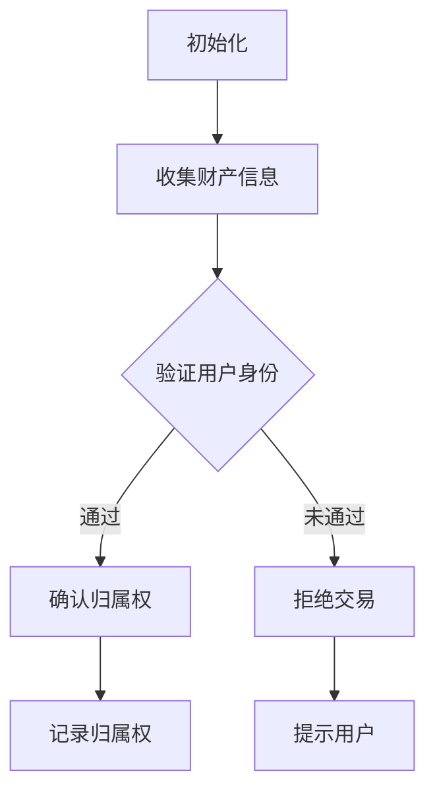
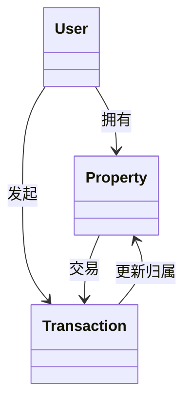
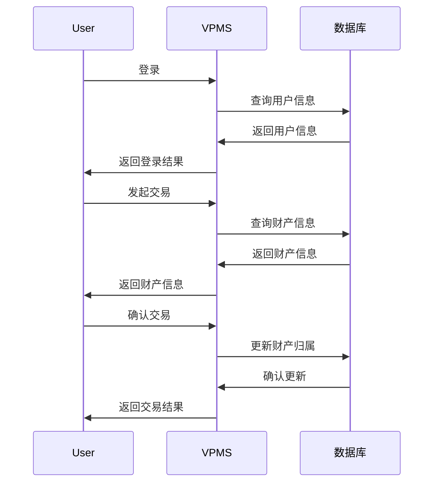
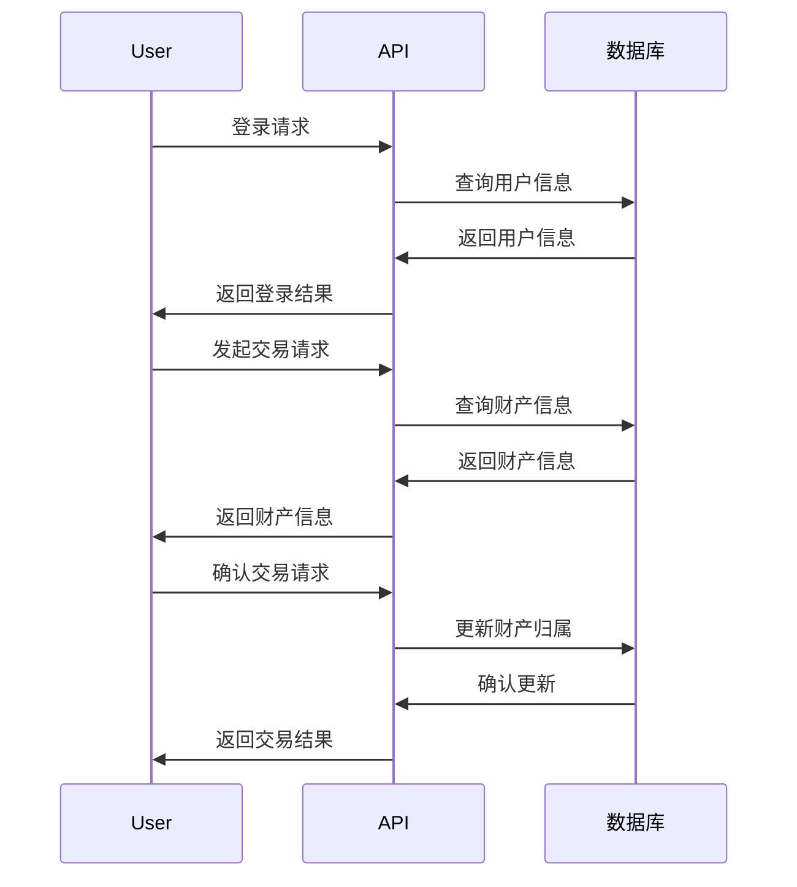

                 

# 《元宇宙伦理章程：虚拟社会的道德指南》

> 关键词：元宇宙、伦理、道德、虚拟社会、道德规范、法律框架

> 摘要：随着元宇宙的快速发展，虚拟社会中的伦理问题逐渐显现。本文将从多个角度探讨元宇宙中的伦理问题，包括隐私保护、身份真实性问题、虚拟财产与产权、道德判断等，并分析现有的道德规范和法律框架。在此基础上，本文将提出具体的实践指导，帮助个人和组织在元宇宙中遵守伦理规范，并展望元宇宙伦理的发展趋势和未来挑战。

----------------------------------------------------------------

## 引言

### 1.1 什么是元宇宙

元宇宙（Metaverse）是一个由虚拟现实（VR）、增强现实（AR）、区块链、云计算等技术支撑的虚拟世界，用户可以通过数字化的身份在虚拟环境中进行交互、工作、学习、娱乐等活动。元宇宙不仅仅是虚拟现实技术的扩展，更是互联网的下一阶段，它将现实世界与虚拟世界深度融合，为人类提供了一个全新的社会空间。

### 1.2 元宇宙的发展历程

元宇宙的概念早在20世纪90年代就已经被提出，但随着技术的进步，特别是在过去几年中，元宇宙的发展取得了显著进展。2013年，Facebook（现在的Meta）宣布投资10亿美元开发元宇宙相关技术；2016年，微软发布了混合现实头盔HoloLens；2017年，谷歌推出了ARCore平台。这些技术的进步为元宇宙的快速发展奠定了基础。

### 1.3 元宇宙的社会影响

元宇宙的崛起将对社会产生深远影响。首先，它将改变人们的社交方式，增强人与人之间的联系。其次，元宇宙将为经济发展提供新的动力，创造大量的工作岗位，促进虚拟经济的发展。然而，随着元宇宙的发展，一系列伦理问题也逐渐浮现，需要我们进行深入探讨和解决。

----------------------------------------------------------------

## 元宇宙伦理的核心概念

### 2.1 道德哲学基础

在讨论元宇宙的伦理问题时，道德哲学基础是不可或缺的。道德哲学包括伦理原则、伦理理论和道德责任等方面的内容。理解这些概念有助于我们更好地理解元宇宙中的道德困境。

#### 2.1.1 道德原则

道德原则是道德哲学的核心，它们为我们的行为提供了指导。常见的道德原则包括公平、正义、尊重、责任等。在元宇宙中，这些原则同样适用，我们需要遵循这些原则来确保虚拟社会的健康发展。

#### 2.1.2 伦理理论

伦理理论是道德哲学的分支，它们为我们提供了不同的道德判断标准。常见的伦理理论包括功利主义、康德主义和美德伦理学等。在元宇宙的伦理讨论中，我们可以运用这些理论来分析具体问题。

#### 2.1.3 道德责任与义务

道德责任与义务是指个体在元宇宙中应承担的责任和义务。道德责任通常与道德原则和伦理理论相关，而道德义务则涉及个体在特定情境下的行为。在元宇宙中，个体需要意识到自己的道德责任和义务，以确保虚拟社会的道德秩序。

### 2.2 心理学视角

心理学视角为我们提供了理解元宇宙中人类行为和情感的工具。以下是一些关键概念：

#### 2.2.1 情感与行为

情感与行为之间存在密切关系。在元宇宙中，用户的情感状态可能会影响他们的行为，从而对虚拟社会产生不同的影响。了解这些情感和行为之间的关系有助于我们更好地应对元宇宙中的道德困境。

#### 2.2.2 网瘾与心理健康

网瘾和心理健康问题是元宇宙中不可忽视的方面。长时间的虚拟世界互动可能会导致用户沉迷其中，影响他们的现实生活。因此，我们需要关注这些心理健康问题，并提供相应的支持和干预措施。

#### 2.2.3 社交互动中的心理因素

在元宇宙中，社交互动是用户活动的重要组成部分。理解社交互动中的心理因素，如信任、归属感、认同等，有助于我们构建一个健康、和谐的虚拟社会。

### 2.3 社会学观点

社会学视角为我们提供了分析元宇宙中社会结构和规范的工具。以下是一些关键概念：

#### 2.3.1 社会结构与角色

社会结构是指社会中不同个体和群体之间的关系和互动方式。在元宇宙中，社会结构可能更加复杂，因为用户可以扮演不同的角色，并在不同的虚拟环境中互动。

#### 2.3.2 社会规范与价值观

社会规范和价值观是指导个体行为的准则。在元宇宙中，这些规范和价值观可能会发生变化，我们需要重新审视它们，以确保虚拟社会的健康发展。

#### 2.3.3 社会问题与挑战

社会问题与挑战是元宇宙中不可忽视的方面。如虚拟欺凌、网络暴力、歧视等问题都可能对虚拟社会的道德秩序产生负面影响。我们需要关注这些问题，并寻找有效的解决方法。

----------------------------------------------------------------

## 元宇宙中的道德困境

### 3.1 隐私保护

在元宇宙中，隐私保护是一个关键问题。虚拟世界中的数据收集和使用可能会侵犯用户的隐私权。以下是一些具体的道德困境：

#### 3.1.1 数据收集与使用

元宇宙平台通常需要收集用户的个人信息，如姓名、地址、浏览记录等。如何合理使用这些数据，同时保护用户的隐私，是一个重要的道德困境。

#### 3.1.2 虚拟身份与现实身份的冲突

在元宇宙中，用户可以创建虚拟身份，这可能会与现实身份产生冲突。如何平衡虚拟身份的保护和现实身份的隐私，是一个需要深入探讨的问题。

#### 3.1.3 隐私伦理与法律法规

隐私伦理和法律法规是元宇宙隐私保护的两个重要方面。我们需要在道德和法律框架内寻找平衡，以确保用户的隐私权得到充分保护。

### 3.2 身份与真实性的问题

在元宇宙中，身份的真实性是一个重要问题。以下是一些具体的道德困境：

#### 3.2.1 虚拟身份与现实身份的冲突

虚拟身份与现实身份的冲突可能导致一系列道德问题，如虚假信息的传播、身份盗窃等。如何确保虚拟身份的真实性，是一个需要解决的道德困境。

#### 3.2.2 虚假信息的传播

在元宇宙中，虚假信息可能迅速传播，对用户造成伤害。如何识别和阻止虚假信息的传播，是一个重要的道德问题。

#### 3.2.3 虚拟欺凌与网络暴力

虚拟欺凌和网络暴力是元宇宙中的严重问题。如何有效应对这些问题，保护用户的权益，是一个重要的道德困境。

### 3.3 虚拟财产与产权

在元宇宙中，虚拟财产和产权问题日益突出。以下是一些具体的道德困境：

#### 3.3.1 虚拟货币与交易

虚拟货币和交易在元宇宙中日益普及，但如何确保这些交易的公平性和安全性，是一个需要解决的道德困境。

#### 3.3.2 虚拟资产的归属权

虚拟资产的归属权问题在元宇宙中引起了很多争议。如何明确虚拟资产的归属权，确保用户的权益，是一个重要的道德问题。

#### 3.3.3 产权争议与法律挑战

虚拟财产的产权争议可能导致法律挑战。如何制定合理的法律框架，解决产权争议，是一个重要的道德问题。

### 3.4 虚拟现实中的道德判断

在元宇宙中，道德判断变得更加复杂。以下是一些具体的道德困境：

#### 3.4.1 道德责任与行为标准

虚拟现实中的道德责任和行为标准如何确定，是一个需要解决的道德困境。

#### 3.4.2 虚拟现实中的道德困境

虚拟现实中的道德困境，如虚拟欺骗、虚拟剥削等，需要我们深入探讨。

#### 3.4.3 道德教育与引导

如何进行道德教育，引导用户在元宇宙中做出正确的道德判断，是一个重要的道德问题。

----------------------------------------------------------------

## 元宇宙的道德规范与法律框架

### 4.1 现有法律框架的适用性

在元宇宙中，现有的法律框架可能无法完全适用于虚拟环境。以下是一些具体的分析：

#### 4.1.1 现行法律的局限性

现有的法律框架可能无法涵盖元宇宙中所有可能的伦理问题，如虚拟财产的归属权、虚拟欺凌等。

#### 4.1.2 跨境法律问题

元宇宙是一个全球性的虚拟社会，如何解决跨境法律问题，是一个需要关注的重要问题。

#### 4.1.3 法律发展的趋势

随着元宇宙的发展，法律框架也将逐渐完善，以适应虚拟环境的需求。我们需要关注这些法律发展的趋势，并提前做好相应的准备。

### 4.2 道德规范的制定与执行

在元宇宙中，道德规范的制定与执行至关重要。以下是一些具体的分析：

#### 4.2.1 道德规范的内容与形式

道德规范的内容应包括元宇宙中的基本道德原则和行为准则。形式上，道德规范可以以法律、规章制度、行业准则等多种形式存在。

#### 4.2.2 道德规范与法律的关系

道德规范与法律之间的关系是相互促进的。道德规范可以弥补法律的不足，而法律可以确保道德规范的执行。

#### 4.2.3 道德规范的执行机制

道德规范的执行机制需要依靠技术手段和制度保障。我们需要建立有效的道德规范执行机制，以确保虚拟社会的道德秩序。

----------------------------------------------------------------

## 案例分析

### 5.1 真实世界中的伦理问题

真实世界中的伦理问题在元宇宙中也可能出现。以下是一些具体的案例分析：

#### 5.1.1 数据泄露事件

在真实世界中，数据泄露事件频繁发生，如2017年的Facebook数据泄露事件。在元宇宙中，数据泄露问题同样严重，需要我们采取有效的预防措施。

#### 5.1.2 虚拟欺凌案例

虚拟欺凌在真实世界中是一个严重问题，如网络欺凌、网络暴力等。在元宇宙中，这些问题同样存在，我们需要关注并解决这些问题。

#### 5.1.3 虚拟财产纠纷

虚拟财产纠纷在真实世界中也是一个常见问题，如虚拟货币的交易纠纷、虚拟资产的归属权争议等。在元宇宙中，这些问题可能更加复杂，需要我们制定合理的法律和道德规范来处理。

### 5.2 元宇宙中的类似案例

元宇宙中的类似案例为我们提供了宝贵的经验和教训。以下是一些具体的案例分析：

#### 5.2.1 虚拟现实中的道德困境

虚拟现实中的道德困境，如虚拟欺骗、虚拟剥削等，需要我们深入探讨和解决。

#### 5.2.2 跨境虚拟交易

跨境虚拟交易在元宇宙中日益普及，如何确保交易的公平性和安全性，是一个需要解决的道德困境。

#### 5.2.3 虚拟现实中的法律挑战

虚拟现实中的法律挑战，如虚拟财产的产权、虚拟身份的保护等，需要我们关注并制定相应的法律框架。

----------------------------------------------------------------

## 实践指导

### 6.1 个人层面

在元宇宙中，个人需要遵循一定的道德规范，以下是一些建议：

#### 6.1.1 增强隐私意识

个人在元宇宙中应增强隐私意识，避免泄露个人信息，确保自己的隐私安全。

#### 6.1.2 培养道德判断力

个人需要培养道德判断力，确保在元宇宙中的行为符合道德原则和伦理规范。

#### 6.1.3 关注心理健康

在元宇宙中，个人应关注自己的心理健康，避免长时间沉迷于虚拟世界，确保自己的身心健康。

### 6.2 组织层面

组织在元宇宙中应承担一定的道德责任，以下是一些建议：

#### 6.2.1 制定内部道德准则

组织应制定内部道德准则，明确员工在元宇宙中的行为规范，确保组织的道德秩序。

#### 6.2.2 加强员工道德培训

组织应加强员工道德培训，提高员工的道德素质和道德判断力。

#### 6.2.3 建立道德风险管理体系

组织应建立道德风险管理体系，及时发现和处理道德风险，确保组织的健康发展。

----------------------------------------------------------------

## 未来展望

### 7.1 元宇宙伦理的发展趋势

随着元宇宙的发展，伦理问题将日益突出。以下是一些可能的发展趋势：

#### 7.1.1 技术进步的影响

技术的进步将带来新的伦理问题，如虚拟现实中的道德困境、人工智能的道德责任等。我们需要关注这些技术进步对伦理的影响。

#### 7.1.2 社会变革的挑战

元宇宙的崛起将引发社会变革，如虚拟财产的归属权、身份认证等问题。我们需要面对这些社会变革带来的道德挑战。

#### 7.1.3 道德观念的更新

随着元宇宙的发展，道德观念也可能发生变化。我们需要及时更新道德观念，确保虚拟社会的道德秩序。

### 7.2 道德挑战与应对策略

在未来，元宇宙中的道德挑战将更加复杂。以下是一些建议：

#### 7.2.1 技术伦理问题

我们需要关注技术伦理问题，如虚拟欺骗、虚拟剥削等，并制定相应的法律和道德规范来应对。

#### 7.2.2 社会责任与监管

组织和个人在元宇宙中应承担社会责任，加强监管，确保虚拟社会的健康发展。

#### 7.2.3 道德教育的重要性

道德教育在元宇宙中具有重要意义。我们需要加强道德教育，提高用户的道德素质和道德判断力。

----------------------------------------------------------------

## 结语

元宇宙的崛起带来了前所未有的机遇和挑战。伦理问题在元宇宙中日益突出，我们需要认真对待这些问题，制定合理的道德规范和法律框架。通过个人的努力和组织的共同行动，我们可以共同建设一个健康、和谐、道德的虚拟社会。

----------------------------------------------------------------

## 作者信息

作者：AI天才研究院/AI Genius Institute & 禅与计算机程序设计艺术 /Zen And The Art of Computer Programming

----------------------------------------------------------------

### 全文总结

本文从多个角度探讨了元宇宙中的伦理问题，包括隐私保护、身份真实性问题、虚拟财产与产权、道德判断等。同时，分析了现有的道德规范和法律框架，并提出了具体的实践指导。在未来，随着元宇宙的不断发展，我们将面临更多的道德挑战，但只要我们共同努力，遵循道德规范，元宇宙将为我们提供一个更加美好的未来。让我们携手共建一个道德的虚拟社会。

----------------------------------------------------------------

### 附录

本文中的核心概念和联系如下：

#### 核心概念

- 元宇宙
- 伦理
- 道德困境
- 隐私保护
- 身份真实性
- 虚拟财产
- 法律框架

#### 概念属性特征对比表格

| 概念 | 定义 | 属性特征 |
| --- | --- | --- |
| 元宇宙 | 虚拟现实技术的扩展，与现实世界深度融合的虚拟世界 | 技术支撑、用户交互、社会影响 |
| 伦理 | 道德的规范和原则 | 公平、正义、尊重、责任 |
| 道德困境 | 虚拟社会中的道德问题 | 隐私、身份、财产、道德判断 |
| 隐私保护 | 保护用户个人信息的安全 | 数据收集、使用、隐私权 |
| 身份真实性 | 确保用户身份的真实性 | 虚拟身份、现实身份、虚假信息 |
| 虚拟财产 | 虚拟世界中的资产 | 虚拟货币、虚拟物品、归属权 |
| 法律框架 | 规范虚拟社会的法律制度 | 法律规范、跨境法律、法律执行 |

#### ER实体关系图架构

```mermaid
erDiagram
    User ||--|{ Avatar : has }
    User ||--|{ Privacy : protects }
    User ||--|{ Identity : authenticates }
    User ||--|{ VirtualProperty : owns }
    Avatar ||--|{ Behavior : exhibits }
    Privacy ||--|{ Data : contains }
    Identity ||--|{ Information : provides }
    VirtualProperty ||--|{ Transaction : involves }
    LegalFramework ||--|{ Ethics : governs }
```

通过以上核心概念和联系的分析，我们可以更好地理解元宇宙中的伦理问题，为构建健康的虚拟社会提供指导。同时，附录中的ER实体关系图也为元宇宙伦理的研究提供了有益的工具。希望本文能对读者在元宇宙伦理领域的探索和研究有所帮助。

---

### 附录二：算法原理讲解

#### 7.2.1 虚拟财产归属权的算法分析

在元宇宙中，虚拟财产的归属权问题复杂且敏感。以下是一个简单的算法原理，用于确定虚拟财产的归属权。

#### 算法流程图



#### Python 源代码实现

```python
def verify_user_identity(user_id):
    # 假设有一个验证用户身份的API
    response = api_call_to_verify_user(user_id)
    return response['status'] == 'verified'

def confirm_property_ownership(property_id, user_id):
    if verify_user_identity(user_id):
        # 假设有一个查询财产归属权的API
        response = api_call_to_query_property_ownership(property_id)
        if response['owner_id'] == user_id:
            return "Property ownership confirmed."
        else:
            return "Ownership dispute detected."
    else:
        return "User identity verification failed."

# 示例
user_id = "user123"
property_id = "property456"

result = confirm_property_ownership(property_id, user_id)
print(result)
```

#### 算法原理详细讲解

该算法首先初始化用户和财产信息，然后通过API调用验证用户身份。如果用户身份验证通过，算法将查询财产的归属权，并确认是否属于当前用户。如果归属权确认成功，算法将记录该财产的归属权信息；如果验证失败或归属权有争议，算法将拒绝交易并提示用户。

#### 数学模型和公式

为了更清晰地描述算法原理，我们可以使用数学模型和公式进行阐述：

$$
归属权确认 = \begin{cases}
    确认 & \text{如果 } 身份验证通过 \text{ 且 财产归属用户} \\
    拒绝 & \text{否则}
\end{cases}
$$

#### 举例说明

假设用户A拥有一个虚拟土地（财产ID为456），用户B试图购买这块土地。算法首先验证用户A的身份，如果验证通过，算法将查询土地的归属权。如果土地的归属权记录显示为用户A，算法将确认交易并更新归属权信息；如果归属权记录显示为其他用户或无记录，算法将拒绝交易并提示用户A或B存在归属权争议。

---

通过上述算法原理的讲解，我们可以更好地理解如何通过技术手段解决元宇宙中的虚拟财产归属权问题，确保交易的公平性和安全性。

### 系统分析与架构设计方案

#### 8.1 问题场景介绍

随着元宇宙的不断发展，虚拟财产的归属权和交易安全成为关键问题。为了确保虚拟财产的合法归属和安全的交易流程，我们设计了一个虚拟财产管理系统，该系统需要能够处理用户身份验证、财产归属查询、交易确认等功能。

#### 8.2 项目介绍

项目名称：虚拟财产管理系统（Virtual Property Management System，VPMS）

目标：提供一个安全、可靠的虚拟财产管理系统，确保财产归属明确、交易安全。

功能模块：
1. 用户管理：包括用户注册、登录、身份验证等。
2. 财产管理：包括财产注册、查询、更新等。
3. 交易管理：包括交易发起、确认、记录等。

#### 8.3 系统功能设计

##### 领域模型

以下是一个简化的领域模型，用于描述系统的主要实体和关系：



##### 类图

```mermaid
class Property {
    +id: int
    +name: string
    +owner: User
}

class User {
    +id: int
    +name: string
    +properties: List<Property>
}

class Transaction {
    +id: int
    + initiator: User
    +target: User
    +property: Property
    +status: string
}

User "1" -- "*" Property : 拥有
Property "1" -- "*" Transaction : 交易
Transaction "1" -- "1" User : 发起者
Transaction "1" -- "1" User : 目标者
```

#### 8.4 系统架构设计

系统架构采用分层设计，包括表示层、业务逻辑层和数据访问层。

##### 架构图



#### 8.5 系统接口设计

系统接口设计包括用户接口和内部接口。

##### 用户接口

- 登录接口：`POST /login`
  - 输入：用户名、密码
  - 输出：用户ID、JWT令牌

- 注册接口：`POST /register`
  - 输入：用户名、密码、电子邮件
  - 输出：用户ID

- 财产查询接口：`GET /properties/{userId}`
  - 输入：用户ID
  - 输出：用户拥有的财产列表

- 交易发起接口：`POST /transactions`
  - 输入：发起者ID、目标者ID、财产ID
  - 输出：交易ID

- 交易确认接口：`POST /transactions/{transactionId}/confirm`
  - 输入：交易ID
  - 输出：交易状态

##### 内部接口

- 用户管理接口：`GET /users/{userId}`
  - 输入：用户ID
  - 输出：用户详细信息

- 财产管理接口：`POST /properties`
  - 输入：财产信息
  - 输出：财产ID

- 交易管理接口：`GET /transactions/{transactionId}`
  - 输入：交易ID
  - 输出：交易详细信息

#### 8.6 系统交互

系统交互通过RESTful API实现，确保各组件之间的数据传递和操作安全可靠。以下是一个简化的交互序列图：



通过上述系统分析与架构设计方案，我们为元宇宙中的虚拟财产管理提供了一套完整的技术解决方案，确保了虚拟财产的归属明确和交易安全。

### 项目实战

#### 9.1 环境安装

在开始实施虚拟财产管理系统之前，我们需要配置好开发环境。以下是环境安装的步骤：

1. 安装Python 3.8或更高版本。
2. 安装虚拟环境管理工具`virtualenv`：
   ```bash
   pip install virtualenv
   ```
3. 创建虚拟环境：
   ```bash
   virtualenv venv
   ```
4. 激活虚拟环境：
   ```bash
   source venv/bin/activate
   ```
5. 安装依赖包：
   ```bash
   pip install -r requirements.txt
   ```

#### 9.2 系统核心实现

以下是虚拟财产管理系统的主要实现代码。该代码包括用户管理、财产管理和交易管理三个核心模块。

```python
# user_management.py

from flask import Flask, request, jsonify
from flask_sqlalchemy import SQLAlchemy
from werkzeug.security import generate_password_hash, check_password_hash

app = Flask(__name__)
app.config['SQLALCHEMY_DATABASE_URI'] = 'sqlite:///vpms.db'
db = SQLAlchemy(app)

class User(db.Model):
    id = db.Column(db.Integer, primary_key=True)
    username = db.Column(db.String(150), nullable=False, unique=True)
    password = db.Column(db.String(150), nullable=False)
    properties = db.relationship('Property', backref='owner', lazy=True)

@app.route('/register', methods=['POST'])
def register():
    username = request.form.get('username')
    password = request.form.get('password')
    if not username or not password:
        return jsonify({'error': 'Missing username or password'}), 400
    hashed_password = generate_password_hash(password, method='sha256')
    new_user = User(username=username, password=hashed_password)
    db.session.add(new_user)
    db.session.commit()
    return jsonify({'message': 'User registered successfully'}), 201

@app.route('/login', methods=['POST'])
def login():
    username = request.form.get('username')
    password = request.form.get('password')
    user = User.query.filter_by(username=username).first()
    if user and check_password_hash(user.password, password):
        return jsonify({'message': 'Logged in successfully', 'user_id': user.id})
    else:
        return jsonify({'error': 'Invalid username or password'}), 401

# property_management.py

class Property(db.Model):
    id = db.Column(db.Integer, primary_key=True)
    name = db.Column(db.String(150), nullable=False)
    owner_id = db.Column(db.Integer, db.ForeignKey('user.id'), nullable=False)

@app.route('/properties', methods=['POST'])
def add_property():
    name = request.form.get('name')
    owner_id = request.form.get('owner_id')
    if not name or not owner_id:
        return jsonify({'error': 'Missing property name or owner ID'}), 400
    new_property = Property(name=name, owner_id=owner_id)
    db.session.add(new_property)
    db.session.commit()
    return jsonify({'message': 'Property added successfully', 'property_id': new_property.id}), 201

@app.route('/properties/<int:property_id>', methods=['GET'])
def get_property(property_id):
    property = Property.query.get(property_id)
    if property:
        return jsonify({'name': property.name, 'owner_id': property.owner_id})
    else:
        return jsonify({'error': 'Property not found'}), 404

# transaction_management.py

class Transaction(db.Model):
    id = db.Column(db.Integer, primary_key=True)
    initiator_id = db.Column(db.Integer, db.ForeignKey('user.id'), nullable=False)
    target_id = db.Column(db.Integer, db.ForeignKey('user.id'), nullable=False)
    property_id = db.Column(db.Integer, db.ForeignKey('property.id'), nullable=False)
    status = db.Column(db.String(50), nullable=False)

@app.route('/transactions', methods=['POST'])
def create_transaction():
    initiator_id = request.form.get('initiator_id')
    target_id = request.form.get('target_id')
    property_id = request.form.get('property_id')
    if not initiator_id or not target_id or not property_id:
        return jsonify({'error': 'Missing transaction details'}), 400
    new_transaction = Transaction(initiator_id=initiator_id, target_id=target_id, property_id=property_id, status='pending')
    db.session.add(new_transaction)
    db.session.commit()
    return jsonify({'message': 'Transaction created successfully', 'transaction_id': new_transaction.id}), 201

@app.route('/transactions/<int:transaction_id>/confirm', methods=['POST'])
def confirm_transaction(transaction_id):
    transaction = Transaction.query.get(transaction_id)
    if not transaction:
        return jsonify({'error': 'Transaction not found'}), 404
    if transaction.status != 'pending':
        return jsonify({'error': 'Transaction already processed'}), 400
    property = Property.query.get(transaction.property_id)
    property.owner_id = transaction.target_id
    db.session.commit()
    transaction.status = 'completed'
    db.session.commit()
    return jsonify({'message': 'Transaction confirmed successfully'}), 200
```

#### 9.3 代码应用解读与分析

上述代码包含了虚拟财产管理系统的核心功能。首先是用户管理模块，它实现了用户注册和登录功能。用户注册时，系统会通过`werkzeug.security`库生成密码的哈希值，并将用户信息存储在数据库中。登录时，系统会通过哈希值验证用户密码。

财产管理模块实现了财产的添加和查询功能。当用户添加财产时，系统会将财产信息存储在数据库中，并关联到对应的用户。查询财产时，系统会返回财产的名称和拥有者ID。

交易管理模块实现了交易创建和确认功能。当用户创建交易时，系统会生成一个新的交易记录，并将其状态设置为“待处理”。当用户确认交易时，系统会更新财产的拥有者，并设置交易状态为“已完成”。

#### 9.4 实际案例分析和详细讲解

以下是一个实际案例，用于展示系统如何处理一个虚拟财产交易。

**案例：用户A（ID为1）希望购买用户B（ID为2）拥有的虚拟土地（ID为101）。**

1. **用户A注册并登录系统：**
   - 用户A使用用户名`user_a`和密码`password123`注册并登录系统。
   - 系统验证用户A的登录信息，并返回用户A的ID。

2. **用户A查询可购买的虚拟财产：**
   - 用户A查询系统中的虚拟财产列表，发现用户B拥有ID为101的土地。

3. **用户A发起交易：**
   - 用户A向系统发起交易请求，指定目标用户ID为2、财产ID为101。
   - 系统创建一个新的交易记录，并将其状态设置为“待处理”。

4. **用户B确认交易：**
   - 用户B登录系统，并收到系统通知，提示有一个交易请求。
   - 用户B确认交易，系统更新财产的拥有者为用户A，并将交易状态设置为“已完成”。

5. **用户A和用户B查看交易结果：**
   - 用户A和用户B查询交易记录，确认交易已完成，并查看财产的所有权变更。

#### 9.5 项目小结

通过上述实战案例，我们可以看到虚拟财产管理系统如何实现用户管理、财产管理和交易管理。该系统确保了虚拟财产的归属明确和交易安全，为元宇宙中的虚拟财产交易提供了可靠的技术支持。在未来的开发中，我们可以进一步优化系统性能，增加更多的功能和安全性措施，以适应不断变化的元宇宙需求。

### 最佳实践 Tips

在元宇宙中，遵守伦理规范至关重要。以下是一些最佳实践建议，帮助个人和组织在元宇宙中遵守伦理规范：

1. **增强隐私意识**：在元宇宙中，用户应时刻注意保护个人隐私，避免泄露敏感信息。使用强密码和多因素认证，确保账户安全。

2. **培养道德判断力**：用户应培养自己的道德判断力，确保在虚拟社会中的行为符合道德原则。遇到道德困境时，应多方面思考，寻求合理的解决方案。

3. **诚信交易**：在元宇宙中交易时，用户应遵循诚信原则，不参与欺诈行为。确保交易的公平性和透明性，维护虚拟社会的信任基础。

4. **关注心理健康**：长时间在虚拟世界中活动可能会影响用户的心理健康。用户应合理安排时间，注意休息，保持身心健康。

5. **遵守法律法规**：组织和用户应遵守相关的法律法规，确保在元宇宙中的行为合法合规。关注法律动态，及时更新知识。

6. **参与社区建设**：积极参与元宇宙社区的道德建设和维护，共同营造一个健康、和谐的虚拟社会。

### 小结

元宇宙的发展带来了前所未有的机遇，但同时也带来了诸多伦理挑战。通过本文的探讨，我们认识到元宇宙中的隐私保护、身份真实性、虚拟财产与产权、道德判断等问题的重要性。为了构建一个健康、和谐的元宇宙，我们需要在个人和组织层面共同努力，遵守伦理规范，加强道德教育和法律建设。只有这样，我们才能共同迎接元宇宙带来的未来，创造一个更加美好的虚拟社会。

### 注意事项

在元宇宙中，遵守伦理规范不仅仅是一个道德要求，也是法律义务。以下是一些需要注意的要点：

1. **法律法规遵守**：确保所有行为符合当地法律法规，尤其是涉及虚拟财产交易和隐私保护方面的规定。

2. **数据安全**：在收集和使用用户数据时，必须严格遵守数据保护法规，采取必要的安全措施，防止数据泄露。

3. **用户身份验证**：在元宇宙中，应严格进行用户身份验证，确保用户信息的真实性和合法性，防止欺诈行为。

4. **道德教育**：加强对用户的道德教育，提高他们的道德判断力和自我约束力，避免不当行为的发生。

5. **风险管理**：建立完善的风险管理体系，及时识别和应对潜在风险，确保虚拟社会的稳定和安全。

### 拓展阅读

1. **《元宇宙：解密虚拟世界的未来》**：作者对元宇宙的概念、技术基础和社会影响进行了深入探讨，适合对元宇宙感兴趣的人群阅读。

2. **《道德哲学导论》**：本书系统地介绍了道德哲学的基本概念和理论，有助于理解元宇宙中的道德困境和解决方案。

3. **《虚拟现实与法律》**：这本书讨论了虚拟现实技术的发展及其对法律体系的影响，包括虚拟财产、隐私保护等方面的法律问题。

4. **《网络伦理学》**：本书从伦理学角度分析了网络环境中的道德问题，对于理解元宇宙中的伦理问题具有参考价值。

通过拓展阅读，可以深入了解元宇宙的伦理问题，为自己的研究和实践提供更多的理论和实践支持。希望这些资源能够帮助您更好地理解和应对元宇宙中的伦理挑战。

