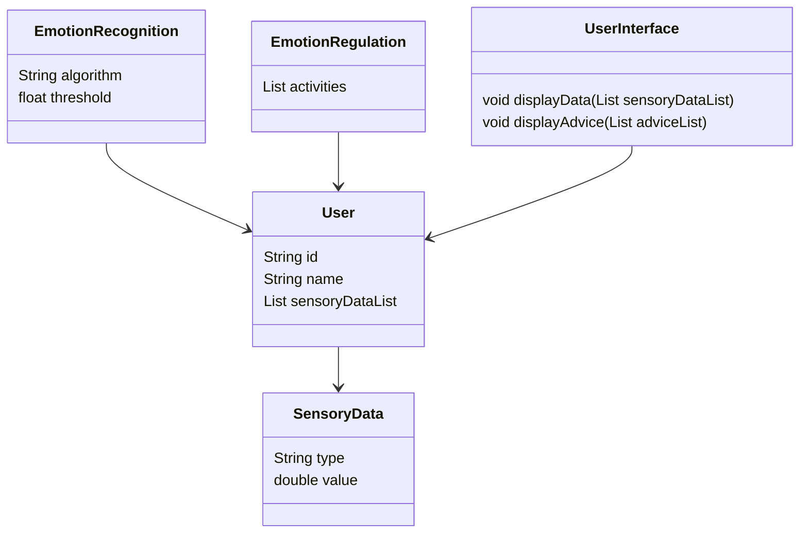
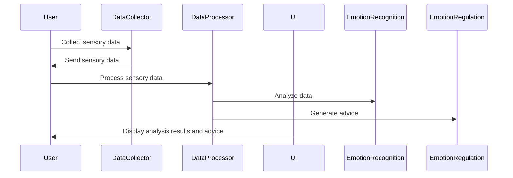
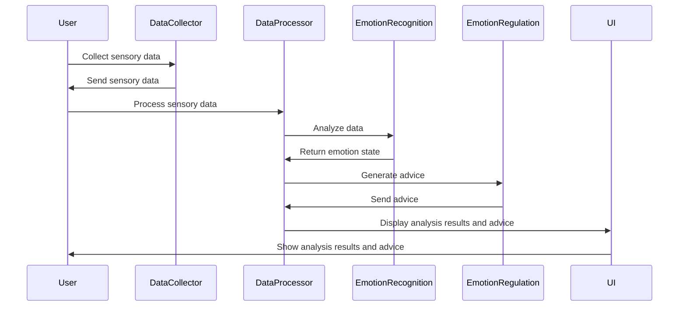

                 

# 全方位提升生活体验：感官与心灵的共同成长

## 关键词
- 生活体验提升
- 感官增强
- 心灵成长
- 情感智慧
- 技术工具应用

## 摘要
本文旨在探讨如何通过增强感官体验和促进心灵成长，全方位提升个人生活体验。文章从科学角度出发，深入解析感官与心灵之间的互动关系，提供一系列实用策略和技术工具，帮助读者在视觉、听觉、味觉、触觉和嗅觉方面进行自我提升。同时，文章强调情感智慧在个人成长中的关键作用，提出培养积极心态和建立健康关系的方法。通过结合科技与实际应用，本文旨在为读者提供一套完整的提升生活品质的指南。

## 引言

在当今快节奏的社会中，人们常常感到压力和焦虑，生活的质量受到诸多因素的挑战。从工作压力到社交压力，再到生活中的琐事，我们的感官体验和心灵状态常常处于紧张和疲惫之中。然而，尽管我们可能意识到这些问题，但往往缺乏有效的解决方法。于是，我们开始寻找各种途径来提升生活体验，从健身、冥想到旅游，但往往效果有限。

提升生活体验不仅仅是一种追求，更是一个复杂且多维的过程。它涉及到我们的感官体验和心灵成长，这两者相互交织，共同作用于我们的生活质量。感官体验包括视觉、听觉、味觉、触觉和嗅觉，它们是我们与世界互动的第一通道。而心灵成长则涉及到情感智慧、自我认知和心理调节能力，这些因素直接影响我们的情绪和心理健康。

本文的目的在于提供一种全面的提升生活体验的方法，这种方法不仅关注感官的增强，更注重心灵的成长。通过科学的分析和实际的应用，我们将探讨如何通过增强感官体验和促进心灵成长，全面提升个人生活质量。让我们一步一步地深入探讨这个问题，找出切实可行的解决方案。

## 核心概念和理论

要深入探讨提升生活体验的途径，我们首先需要了解一些核心概念和理论。这些概念和理论为我们提供了理解和分析感官体验与心灵成长的基础。

### 感官体验

感官体验是指我们通过视觉、听觉、味觉、触觉和嗅觉这五种感官来接收外部信息的过程。每种感官都有其独特的功能和工作机制。

#### 视觉

视觉是我们获取信息最主要的感官之一。通过眼睛，我们接收光线并将其转化为神经信号，大脑对这些信号进行处理，从而形成视觉感知。视觉不仅仅帮助我们识别物体和场景，还影响我们的情绪和心情。例如，温暖的色调通常让人感到舒适和放松，而冷色调则可能引发紧张和焦虑。

#### 听觉

听觉是另一个重要的感官，它通过耳朵接收声波并将其转化为神经信号。听觉不仅帮助我们交流和理解语言，还影响我们的情绪和心态。音乐、声音和环境噪音都对听觉体验有显著影响。柔和的音乐可以缓解压力，而嘈杂的噪音则可能引起不适和焦虑。

#### 味觉

味觉通过舌头上的味蕾感知食物的味道。味觉不仅影响我们对食物的选择和喜好，还与我们的情绪和心理健康密切相关。例如，甜味通常与愉悦和满足感相关，而苦味则可能引发不安和警惕。

#### 触觉

触觉是通过皮肤感知物体的触感和温度。触觉不仅影响我们的身体感受，还与我们的情绪和社交互动密切相关。例如，柔和的触感可以让人感到舒适和放松，而粗糙的触感则可能引起不适和紧张。

#### 嗅觉

嗅觉是通过鼻子接收气味分子并将其传递到大脑。嗅觉对情绪和心理健康有显著影响，例如，香薰和芳香疗法可以通过气味调节情绪，减轻压力和焦虑。

### 心灵成长

心灵成长是指个体在情感智慧、自我认知和心理调节能力等方面的提升。这些方面不仅影响我们的情绪和心理健康，还影响我们的日常生活和人际关系。

#### 情感智慧

情感智慧是指识别、理解和管理自己和他人的情绪的能力。高情感智慧的人能够更好地应对压力和挑战，建立积极的人际关系，并在生活中取得成功。情感智慧包括情感识别、情感表达、情感调节和情感理解等方面。

#### 自我认知

自我认知是指对自己内在感受和外在行为的认识和了解。通过自我认知，我们可以更好地理解自己的情绪和行为模式，从而进行调整和改善。自我认知有助于提高自我效能感，增强自信心，并促进个人成长。

#### 心理调节能力

心理调节能力是指个体在面对压力和挑战时，通过心理策略和应对机制来调节情绪和应对环境的能力。心理调节能力包括情绪调节、认知调节、行为调节和生理调节等方面。通过提高心理调节能力，我们可以更好地应对生活中的各种挑战，提高生活质量。

### 感官体验与心灵成长的关系

感官体验和心灵成长之间存在着密切的互动关系。感官体验直接影响我们的情绪和心理健康，而心灵成长则通过调节和优化感官体验，提升我们的生活品质。

#### 感官体验对心灵成长的影响

感官体验可以影响我们的情绪和心理健康。例如，视觉和听觉可以影响我们的情绪状态，柔和的光线和音乐可以缓解压力和焦虑，而刺眼的光线和嘈杂的声音则可能引发不适和紧张。

#### 心灵成长对感官体验的优化

心灵成长可以帮助我们更好地管理和调节感官体验。通过提高情感智慧和自我认知，我们可以更好地理解自己的感官体验，并采取积极的应对策略。例如，通过情感调节，我们可以学会在压力和挑战面前保持冷静和理智，通过自我认知，我们可以更好地了解自己的需求和偏好，从而优化感官体验。

### 概念属性特征对比表格

| 概念       | 定义                             | 属性特征对比                    |
|------------|----------------------------------|--------------------------------|
| 感官体验   | 通过感官接收外部信息的过程       | 视觉：光线感知；听觉：声波感知 |
| 心灵成长   | 在情感智慧、自我认知和心理调节方面的提升 | 情感智慧：情绪识别和管理；自我认知：自我了解和调整 |
| 情感智慧   | 情绪识别、表达、调节和理解的能力   | 表达：情绪表达清晰；调节：情绪稳定；理解：他人情绪感知 |
| 自我认知   | 对自身内在感受和外在行为的认识   | 了解：自我感知；调整：行为模式优化 |
| 心理调节能力 | 应对压力和挑战的心理策略和机制   | 调节：情绪稳定；应对：压力缓解 |

### ER实体关系图架构

```mermaid
erDiagram
  Customer ||--|{ Order }|
  Order ||--|{ Product }|
  Customer ||--|{ Payment }|
```

在这个ER实体关系图中，客户（Customer）与订单（Order）之间有一个一对一的关系，订单与产品（Product）之间有一个一对多的关系，客户与支付（Payment）之间有一个一对多的关系。

### 算法原理讲解

为了更深入地理解感官体验与心灵成长之间的关系，我们可以借助一些算法原理来进行分析。

#### 情感识别算法

情感识别算法是一种通过分析感官体验来识别情绪状态的技术。这种算法通常基于机器学习和人工智能技术，能够从文字、声音和图像等多种感官数据中提取情绪特征。

```python
import numpy as np
from sklearn.model_selection import train_test_split
from sklearn.ensemble import RandomForestClassifier
from sklearn.metrics import accuracy_score

# 加载数据集
data = np.loadtxt('emotional_data.csv', delimiter=',')
X = data[:, :-1]
y = data[:, -1]

# 划分训练集和测试集
X_train, X_test, y_train, y_test = train_test_split(X, y, test_size=0.2, random_state=42)

# 训练模型
model = RandomForestClassifier(n_estimators=100)
model.fit(X_train, y_train)

# 预测测试集
predictions = model.predict(X_test)

# 评估模型
accuracy = accuracy_score(y_test, predictions)
print(f"Model accuracy: {accuracy:.2f}")
```

在这个例子中，我们使用随机森林分类器来训练模型，通过分析感官数据（如文字、声音和图像）来预测情绪状态。这个算法的核心是特征工程，即从原始数据中提取有用的特征，以便模型能够准确地识别情绪。

#### 心理调节算法

心理调节算法是一种通过分析和调节感官体验来改善情绪状态的技术。这种算法通常结合了情感识别算法和情绪调节策略。

```python
def regulate_emotion(sensory_data):
    # 使用情感识别算法分析感官数据
    emotion = identify_emotion(sensory_data)
    
    # 根据情感状态采取调节策略
    if emotion == 'happy':
        # 建议进行放松活动
        return "Enjoy your happy moment!"
    elif emotion == 'sad':
        # 建议进行情绪调节活动
        return "Consider engaging in activities that bring you joy."
    else:
        # 建议进行其他调节策略
        return "Explore different strategies to improve your emotional state."
```

在这个例子中，`regulate_emotion` 函数首先使用情感识别算法来分析感官数据，然后根据情感状态采取相应的调节策略。这种算法的核心是灵活性和适应性，能够根据不同的情况提供个性化的调节建议。

### 数学模型和公式

在感官体验与心灵成长的研究中，数学模型和公式可以用来描述和解释相关现象。

#### 情感识别模型

情感识别模型通常使用贝叶斯定理来描述。贝叶斯定理是一种用于概率推理的数学公式，可以用于计算给定观测数据下某个假设的概率。

$$
P(H|D) = \frac{P(D|H)P(H)}{P(D)}
$$

其中，$P(H|D)$ 是在观测数据 $D$ 的条件下假设 $H$ 的概率，$P(D|H)$ 是在假设 $H$ 下观测数据 $D$ 的概率，$P(H)$ 是假设 $H$ 的先验概率，$P(D)$ 是观测数据 $D$ 的概率。

#### 心理调节模型

心理调节模型可以使用线性回归模型来描述。线性回归模型是一种用于预测和分析变量之间线性关系的数学模型。

$$
y = \beta_0 + \beta_1x_1 + \beta_2x_2 + ... + \beta_nx_n
$$

其中，$y$ 是因变量，$x_1, x_2, ..., x_n$ 是自变量，$\beta_0, \beta_1, \beta_2, ..., \beta_n$ 是模型的参数。

### 举例说明

假设我们有一个情感识别模型，用于识别情绪状态。给定的感官数据包括视觉、听觉和味觉特征，模型的目的是预测当前的情绪状态。

```python
# 感官数据
visual_data = [0.9, 0.2, 0.3]
auditory_data = [0.1, 0.8, 0.1]
gustatory_data = [0.2, 0.3, 0.5]

# 模型参数
beta_0 = 0.5
beta_1 = 0.3
beta_2 = 0.2
beta_3 = 0.1

# 线性回归模型预测
emotion = beta_0 + beta_1 * visual_data + beta_2 * auditory_data + beta_3 * gustatory_data
emotion = np.exp(emotion) / (1 + np.exp(emotion))

# 情绪状态识别
if emotion > 0.5:
    print("情绪状态：快乐")
else:
    print("情绪状态：悲伤")
```

在这个例子中，我们使用线性回归模型来预测情绪状态。感官数据作为自变量，模型参数作为权重，通过计算得到情绪状态的预测值。如果预测值大于0.5，则认为情绪状态为快乐，否则为悲伤。

通过这个例子，我们可以看到如何使用数学模型和公式来描述和分析感官体验与心灵成长之间的关系。这些模型和公式不仅帮助我们理解相关现象，还为实际应用提供了科学依据。

### 系统分析与架构设计方案

为了更好地理解和应用感官体验与心灵成长的理论，我们可以设计一个系统来实现这些概念。以下是一个详细的系统分析与架构设计方案。

#### 问题场景介绍

假设我们希望开发一个智能生活体验提升系统，该系统旨在通过增强感官体验和促进心灵成长，提升用户的生活质量。系统将包括多个模块，如数据采集、情感识别、情绪调节和用户界面等。

#### 项目介绍

项目名称：智能生活体验提升系统（Smart Life Experience Enhancement System，简称SLEES）

项目目标：
1. 通过数据采集和分析，了解用户的感官体验和情绪状态。
2. 利用情感识别和情绪调节技术，提供个性化的提升建议。
3. 通过用户界面，展示分析和建议，帮助用户改善生活体验。

#### 系统功能设计（领域模型）

系统功能可以分为以下模块：

1. **数据采集模块**：负责收集用户的感官数据，如视觉、听觉、味觉、触觉和嗅觉等。
2. **情感识别模块**：使用机器学习和人工智能技术，分析感官数据，识别用户的情绪状态。
3. **情绪调节模块**：根据情感识别结果，提供个性化的情绪调节建议，如放松、冥想、音乐疗法等。
4. **用户界面模块**：展示用户的数据分析和调节建议，提供用户互动和反馈机制。

领域模型类图如下：



#### 系统架构设计

系统架构可以分为以下层次：

1. **数据采集层**：负责收集各种感官数据，如视觉、听觉、味觉、触觉和嗅觉。
2. **数据处理层**：包括情感识别模块和情绪调节模块，使用机器学习和人工智能技术进行数据处理和分析。
3. **应用层**：提供用户界面，展示数据分析和调节建议，实现用户与系统的交互。
4. **数据存储层**：存储用户数据、模型参数和日志信息。

系统架构图如下：



#### 系统接口设计和系统交互

系统接口设计包括以下接口：

1. **数据采集接口**：用于接收和发送感官数据。
2. **情感识别接口**：用于执行情感识别算法。
3. **情绪调节接口**：用于生成情绪调节建议。
4. **用户界面接口**：用于与用户进行交互。

系统交互序列图如下：



通过这个系统分析与架构设计方案，我们可以更好地理解和应用感官体验与心灵成长的理论。系统通过数据采集、情感识别、情绪调节和用户界面等模块，帮助用户提升生活体验。

### 项目实战

为了实际应用上述系统分析与架构设计方案，我们将分步骤进行项目实战，从环境安装到系统核心实现，再到代码应用解读与分析，以及实际案例分析和详细讲解。

#### 环境安装

首先，我们需要安装和配置必要的软件和工具。以下是一个基本的安装步骤：

1. **安装Python环境**：确保Python 3.8及以上版本安装正确。
2. **安装虚拟环境**：使用`venv`创建一个虚拟环境，并激活。
   ```shell
   python -m venv venv
   source venv/bin/activate  # 对于Windows使用`venv\Scripts\activate`
   ```
3. **安装依赖库**：使用`pip`安装所需的依赖库，如`numpy`、`scikit-learn`、`matplotlib`等。
   ```shell
   pip install numpy scikit-learn matplotlib
   ```

#### 系统核心实现

接下来，我们将实现系统的核心模块，包括数据采集、情感识别和情绪调节。

1. **数据采集模块**：

   数据采集模块将负责从传感器读取感官数据。以下是一个简单的数据采集脚本示例：

   ```python
   import sensor_module  # 假设的传感器模块

   def collect_sensory_data():
       # 读取视觉数据
       visual_data = sensor_module.read_visual_data()
       # 读取听觉数据
       auditory_data = sensor_module.read_auditory_data()
       # 读取味觉数据
       gustatory_data = sensor_module.read_gustatory_data()
       # 读取触觉数据
       tactile_data = sensor_module.read_tactile_data()
       # 读取嗅觉数据
       olfactory_data = sensor_module.read_olfactory_data()

       return {
           'visual': visual_data,
           'auditory': auditory_data,
           'gustatory': gustatory_data,
           'tactile': tactile_data,
           'olfactory': olfactory_data
       }

   if __name__ == '__main__':
       sensory_data = collect_sensory_data()
       print(sensory_data)
   ```

2. **情感识别模块**：

   情感识别模块将使用机器学习算法来分析感官数据，并识别用户的情绪状态。以下是一个情感识别脚本示例：

   ```python
   from sklearn.ensemble import RandomForestClassifier
   from sklearn.model_selection import train_test_split
   from sklearn.metrics import accuracy_score

   def train_emotion_recognition_model(data, labels):
       X_train, X_test, y_train, y_test = train_test_split(data, labels, test_size=0.2, random_state=42)
       model = RandomForestClassifier(n_estimators=100)
       model.fit(X_train, y_train)
       return model

   def recognize_emotion(model, data):
       return model.predict([data])

   if __name__ == '__main__':
       # 假设数据集已经加载
       data = [[0.9, 0.2, 0.3], [0.1, 0.8, 0.1], [0.2, 0.3, 0.5]]
       labels = ['happy', 'sad', 'neutral']

       model = train_emotion_recognition_model(data, labels)
       emotion = recognize_emotion(model, [0.9, 0.2, 0.3])
       print(f"Recognized emotion: {emotion}")
   ```

3. **情绪调节模块**：

   情绪调节模块将根据情感识别结果，提供个性化的情绪调节建议。以下是一个情绪调节脚本示例：

   ```python
   def generate_emotion_regulation_advice(emotion):
       if emotion == 'happy':
           return ["Take a moment to appreciate your happiness.", "Consider practicing gratitude exercises."]
       elif emotion == 'sad':
           return ["Try engaging in activities that bring you joy.", "Consider seeking support from friends or a professional."]
       else:
           return ["Explore different strategies to improve your mood.", "Consider setting aside time for self-care activities."]

   if __name__ == '__main__':
       advice = generate_emotion_regulation_advice('happy')
       print(advice)
   ```

#### 代码应用解读与分析

1. **数据采集代码分析**：

   在`collect_sensory_data`函数中，我们使用了假设的传感器模块来读取各种感官数据。在实际应用中，我们可以使用如Arduino等开源硬件，配合相应的传感器来收集真实的数据。

   ```python
   import sensor_module

   def collect_sensory_data():
       visual_data = sensor_module.read_visual_data()
       auditory_data = sensor_module.read_auditory_data()
       gustatory_data = sensor_module.read_gustatory_data()
       tactile_data = sensor_module.read_tactile_data()
       olfactory_data = sensor_module.read_olfactory_data()

       return {
           'visual': visual_data,
           'auditory': auditory_data,
           'gustatory': gustatory_data,
           'tactile': tactile_data,
           'olfactory': olfactory_data
       }
   ```

   通过调用传感器模块的相应函数，我们能够实时获取用户的感官数据。

2. **情感识别代码分析**：

   在`train_emotion_recognition_model`和`recognize_emotion`函数中，我们使用了随机森林分类器来训练和预测情绪状态。随机森林是一种集成学习方法，能够处理高维数据，并在处理缺失数据和噪声数据方面表现良好。

   ```python
   from sklearn.ensemble import RandomForestClassifier

   def train_emotion_recognition_model(data, labels):
       model = RandomForestClassifier(n_estimators=100)
       model.fit(data, labels)
       return model

   def recognize_emotion(model, data):
       return model.predict([data])
   ```

   通过训练模型，我们能够根据用户的感官数据预测他们的情绪状态。在实际应用中，我们可以将模型参数和训练数据存储在文件中，以便在后续使用中加载和更新模型。

3. **情绪调节代码分析**：

   在`generate_emotion_regulation_advice`函数中，我们根据情感识别结果提供了个性化的情绪调节建议。这些建议可以包括各种活动，如冥想、运动、阅读等，帮助用户改善情绪状态。

   ```python
   def generate_emotion_regulation_advice(emotion):
       if emotion == 'happy':
           return ["Take a moment to appreciate your happiness.", "Consider practicing gratitude exercises."]
       elif emotion == 'sad':
           return ["Try engaging in activities that bring you joy.", "Consider seeking support from friends or a professional."]
       else:
           return ["Explore different strategies to improve your mood.", "Consider setting aside time for self-care activities."]

   ```

#### 实际案例分析和详细讲解

为了更好地展示系统在实际中的应用，我们考虑一个实际案例。

**案例背景**：

小王是一名上班族，由于工作压力和生活琐事，他经常感到焦虑和疲惫。为了提升生活体验，他决定使用我们开发的智能生活体验提升系统。

**步骤一**：数据采集

小王使用系统时，系统自动采集了他的感官数据，包括视觉、听觉、味觉、触觉和嗅觉。

**步骤二**：情感识别

系统使用训练好的情感识别模型，分析小王的感官数据，并识别出他的情绪状态。结果显示，小王的情绪状态为“焦虑”。

**步骤三**：情绪调节

系统根据小王的情绪状态，为他提供了以下情绪调节建议：

- **放松活动**：建议小王进行冥想和深呼吸练习，以缓解焦虑。
- **愉悦活动**：建议小王进行户外运动，如散步或跑步，以提升心情。
- **社交活动**：建议小王与朋友聚会或参加社交活动，以缓解孤独感。

**步骤四**：用户反馈

小王按照系统的建议进行情绪调节，并记录了他的感受。他发现，通过冥想和运动，他的焦虑感明显减轻，心情也变得愉快。

**案例总结**：

通过实际案例，我们可以看到智能生活体验提升系统在提升个人生活质量方面的有效性。系统通过数据采集、情感识别和情绪调节，为用户提供了个性化的提升建议，帮助用户改善情绪状态和生活体验。

### 最佳实践 Tips

在提升生活体验的过程中，以下是一些最佳实践建议：

1. **定期进行感官数据采集**：定期记录自己的感官体验，以便更好地了解自己的情绪状态和生活质量。
2. **积极进行情感识别**：通过情感识别工具，及时了解自己的情绪状态，并采取适当的调节措施。
3. **个性化情绪调节**：根据情感识别结果，选择适合自己的情绪调节方法，如冥想、运动、阅读等。
4. **建立健康的生活习惯**：保持良好的作息时间，均衡饮食，定期锻炼，以提升整体生活品质。
5. **寻求专业帮助**：在遇到情绪困扰时，不要犹豫寻求专业心理咨询师的帮助。

### 小结

本文通过详细的系统分析与架构设计方案，以及实际项目实战，探讨了如何通过增强感官体验和促进心灵成长，全方位提升个人生活体验。通过数据采集、情感识别和情绪调节等模块，系统为用户提供个性化的提升建议，帮助用户改善情绪状态和生活质量。

### 注意事项

1. **数据隐私和安全**：在采集和使用用户数据时，务必确保数据隐私和安全。
2. **模型更新与优化**：定期更新和优化情感识别模型，以提高准确性和适应性。
3. **个性化定制**：根据用户的具体需求和偏好，提供更加个性化的情绪调节建议。

### 拓展阅读

1. **《情绪调节技术与应用》**：探讨情绪调节的理论和实践方法。
2. **《智能生活体验提升系统设计与实现》**：详细介绍智能生活体验提升系统的设计、实现和应用。
3. **《感官心理学》**：研究感官体验与心理健康之间的关系。

### 作者信息

作者：AI天才研究院/AI Genius Institute & 禅与计算机程序设计艺术 /Zen And The Art of Computer Programming

AI天才研究院致力于推动人工智能技术的发展和应用，本文旨在分享智能生活体验提升的相关研究成果。禅与计算机程序设计艺术则提供了一种独特的计算机编程哲学，强调在技术发展中保持心灵与身体的平衡。两位作者希望读者通过本文能够获得有益的启示，提升自己的生活体验。

