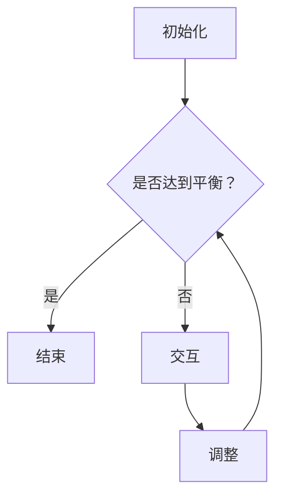
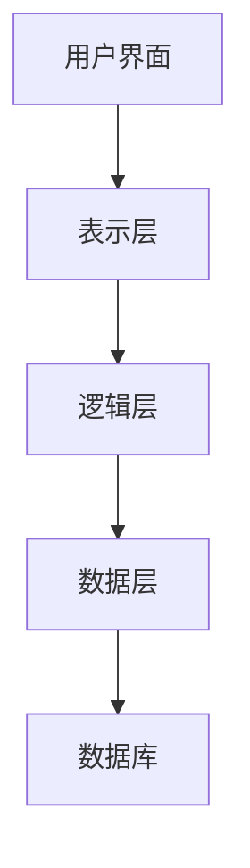
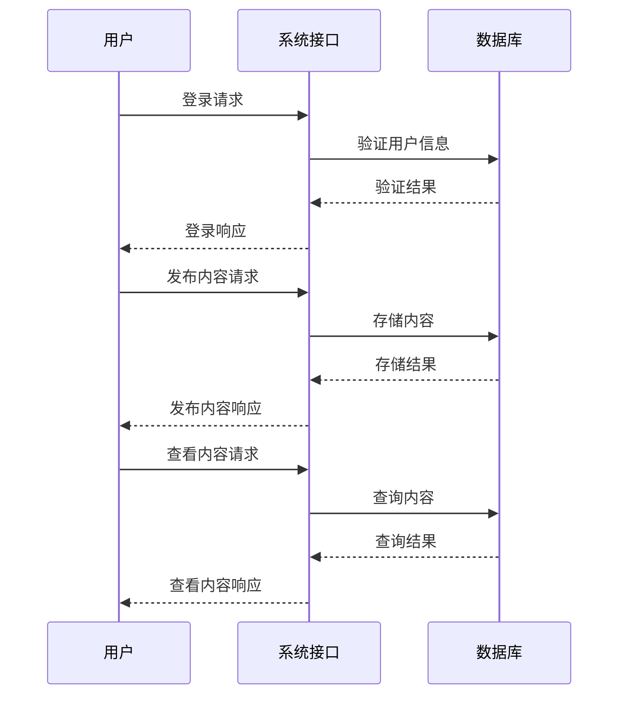

                 

# 全球化与文化多样性：文化交流与文化主权的平衡

## 关键词：全球化、文化多样性、文化交流、文化主权、文化平衡

## 摘要：
本文将探讨全球化背景下，文化交流与文化主权之间的平衡问题。通过分析全球化与文化多样性的背景和联系，阐述文化主权的重要性，并提出一系列解决方案，以实现文化交流与文化主权的和谐共存。

## 目录

1. 第一部分：背景介绍
    1.1 问题背景
    1.2 问题描述
    1.3 问题解决
    1.4 边界与外延
    1.5 概念结构与核心要素组成
    1.6 本章小结

2. 第二部分：核心概念与联系
    2.1 全球化的概念与联系
    2.2 文化多样性的概念与联系
    2.3 文化主权的概念与联系
    2.4 全球化、文化多样性与文化主权的联系
    2.5 平衡原则

3. 第三部分：算法原理讲解
    3.1 算法原理
    3.2 算法流程图
    3.3 算法Python源代码讲解
    3.4 数学模型与公式
    3.5 通俗易懂的举例说明

4. 第四部分：系统分析与架构设计方案
    4.1 问题场景介绍
    4.2 系统功能设计
    4.3 系统架构设计
    4.4 系统接口设计
    4.5 系统交互序列图

5. 第五部分：项目实战
    5.1 环境安装
    5.2 系统核心实现源代码
    5.3 代码应用解读与分析
    5.4 实际案例分析与详细讲解
    5.5 项目小结

6. 第六部分：最佳实践 tips、小结、注意事项、拓展阅读

----------------------------------------------------------------

## 1. 第一部分：背景介绍

### 1.1 问题背景

全球化是指世界各国在经济、政治、文化等方面相互联系、相互依赖的过程。在全球化背景下，文化交流日益频繁，文化多样性得到了前所未有的发展。然而，文化多样性的发展也带来了一系列问题，如文化同质化、文化冲突等。如何在全球化背景下实现文化交流与文化主权的平衡，成为了一个亟待解决的问题。

### 1.2 问题描述

全球化与文化多样性之间的平衡问题，主要体现在以下几个方面：

#### 1.2.1 文化同质化

全球化带来了文化同质化的趋势，本土文化在全球化的冲击下逐渐丧失特色。这可能导致文化多样性的减少，甚至文化的消失。

#### 1.2.2 文化冲突

全球化带来了不同文化之间的碰撞和冲突。在文化交流过程中，不同的文化观念、价值观等可能会产生冲突，导致社会的不稳定。

#### 1.2.3 文化主权

全球化过程中，如何保护本国文化主权，避免文化被侵蚀，也是一个重要的议题。

### 1.3 问题解决

为了解决全球化与文化多样性之间的平衡问题，可以采取以下措施：

#### 1.3.1 强化文化交流

通过加强文化交流，增进不同文化之间的了解和尊重，有助于减少文化冲突，实现文化多样性的保护。

#### 1.3.2 强化文化主权

在全球化背景下，应加强本国文化的保护和传承，维护文化主权。

#### 1.3.3 平衡原则

在全球化过程中，需要遵循以下原则，以实现文化交流与文化主权的平衡：

- **尊重差异**：尊重不同文化之间的差异，促进文化的共存和融合。
- **保护本土文化**：保护本土文化的独特性和多样性，防止文化同质化。
- **促进文化创新**：鼓励文化创新，推动文化的发展。

### 1.4 边界与外延

#### 1.4.1 边界

全球化的边界主要包括经济、政治、文化等方面。在全球化进程中，不同领域的边界可能会产生重叠和冲突。

#### 1.4.2 外延

文化多样性的外延包括各种不同的文化形式，如语言、艺术、宗教、风俗等。在全球化背景下，如何保护这些文化形式，是文化多样性保护的重要内容。

### 1.5 概念结构与核心要素组成

#### 1.5.1 全球化

全球化是指世界各国在经济、政治、文化等方面相互联系、相互依赖的过程。其核心要素包括经济全球化、政治全球化和文化全球化。

#### 1.5.2 文化多样性

文化多样性是指世界上各种不同的文化形式和观念，它们共同构成了人类社会的多样性和丰富性。其核心要素包括语言多样性、艺术多样性、宗教多样性和习俗与风俗多样性。

#### 1.5.3 文化主权

文化主权是指一个国家或民族对其文化资源的保护、传承和发展权。其核心要素包括文化保护、文化传承和文化发展。

### 1.6 本章小结

本章对全球化与文化多样性之间的平衡问题进行了背景介绍，包括问题的背景、问题描述、问题解决方法以及边界与外延等。这些内容为本书的后续章节提供了理论基础。在全球化背景下，如何实现文化交流与文化主权的平衡，是一个复杂而重要的议题，需要我们深入研究和探讨。

----------------------------------------------------------------

## 2. 第二部分：核心概念与联系

### 2.1 全球化的概念与联系

全球化是一个多维度的过程，涉及经济、政治、文化等多个层面。其核心要素包括经济全球化、政治全球化和文化全球化。

- **经济全球化**：以国际贸易、跨国投资为主要表现形式。它促进了各国经济的相互依赖和合作，推动了全球经济的快速发展。
- **政治全球化**：以国际合作、多边主义为主要特征。它促进了国际关系的民主化和多元化，为全球和平与发展提供了制度保障。
- **文化全球化**：以文化产品、信息的跨国流动为主要载体。它促进了全球文化的多样性和融合，丰富了人类社会的精神生活。

### 2.2 文化多样性的概念与联系

文化多样性是指世界上各种不同的文化形式和观念，它们共同构成了人类社会的多样性和丰富性。其核心要素包括语言多样性、艺术多样性、宗教多样性和习俗与风俗多样性。

- **语言多样性**：全球约有7000种语言，语言的多样性是文化多样性的基础。它反映了人类社会的丰富性和多样性。
- **艺术多样性**：包括音乐、舞蹈、绘画、雕塑等多种艺术形式。艺术多样性丰富了人类的文化生活，提升了人类的精神境界。
- **宗教多样性**：全球有多个宗教，如基督教、伊斯兰教、佛教等。宗教多样性是文化多样性的一部分，它影响了人类的价值观念和行为方式。
- **习俗与风俗**：各国的习俗与风俗也是文化多样性的体现。它们反映了人类社会的差异性和独特性。

### 2.3 文化主权的概念与联系

文化主权是指一个国家或民族对其文化资源的保护、传承和发展权。其核心要素包括文化保护、文化传承和文化发展。

- **文化保护**：防止本土文化被侵蚀、同质化。通过立法、宣传和教育等手段，保护本土文化的独特性和多样性。
- **文化传承**：确保本土文化能够代代相传。通过教育、传统仪式和文化遗产保护等方式，传承和弘扬本土文化。
- **文化发展**：推动本土文化的创新和发展。鼓励文化创新，培育文化人才，提升本土文化的国际影响力。

### 2.4 全球化、文化多样性与文化主权的联系

全球化、文化多样性与文化主权之间存在着紧密的联系：

- **全球化促进了文化多样性的发展**：文化交流和融合使得文化多样性更加丰富。全球化带来了不同文化之间的交流和碰撞，激发了文化的创新和发展。
- **文化多样性是全球化的重要动力**：多样的文化激发了全球经济的创新和发展。文化多样性为全球经济提供了丰富的资源和动力，推动了全球经济的繁荣。
- **文化主权是全球化背景下的保护机制**：通过保护文化主权，可以确保文化多样性的可持续发展。文化主权保护了本土文化的独特性和多样性，防止了文化的同质化和消失。

### 2.5 平衡原则

在全球化过程中，如何平衡文化多样性与文化主权，需要遵循以下原则：

- **尊重差异**：尊重不同文化之间的差异，促进文化的共存和融合。在文化交流中，要尊重不同文化的特点和传统，避免文化冲突和误解。
- **保护本土文化**：保护本土文化的独特性和多样性，防止文化同质化。通过立法、宣传和教育等手段，保护本土文化的权益和利益。
- **促进文化创新**：鼓励文化创新，推动文化的发展。通过政策支持和资金投入，培育文化人才，提升本土文化的国际影响力。
- **平衡利益**：在全球化背景下，要平衡不同文化之间的利益，确保各方都能从中受益。通过国际合作和协商，解决文化冲突和纠纷，实现共同发展。

### 2.6 本章小结

本章对全球化、文化多样性与文化主权之间的联系进行了深入分析，阐述了全球化、文化多样性与文化主权之间的相互关系。在全球化背景下，如何平衡文化多样性与文化主权，实现文化交流与文化主权的和谐共存，是一个重要而复杂的议题，需要我们深入研究和探讨。

----------------------------------------------------------------

## 3. 第三部分：算法原理讲解

### 3.1 算法原理

在全球化与文化多样性平衡的问题中，我们可以借鉴多智能体系统（MAS）的理论，通过建立一种动态平衡机制来实现文化交流与文化主权的平衡。多智能体系统是一种分布式计算模型，其中的智能体可以代表不同的文化实体，它们在相互交互中寻求平衡。

算法的基本原理如下：

1. **初始化**：根据全球各国的文化特征，初始化智能体系统，每个智能体代表一种文化。
2. **交互**：智能体之间进行文化交流，通过协商和谈判，实现文化的相互理解和尊重。
3. **调整**：根据交互的结果，智能体调整自己的行为和策略，以实现文化主权和文化多样性的平衡。
4. **评估**：对系统的平衡状态进行评估，如果达到平衡，则继续运行；否则，返回步骤2，继续调整。

### 3.2 算法流程图

以下是一个简单的多智能体系统的流程图，用于说明算法的基本流程：



### 3.3 算法Python源代码讲解

下面是一个简化的Python代码示例，用于说明算法的实现过程：

```python
import random

# 初始化智能体系统
def initialize_agents(num_agents):
    agents = []
    for i in range(num_agents):
        agents.append({'id': i, 'culture': '文化{}'.format(i+1), 'balance': 0.5})
    return agents

# 交互过程
def interact_agents(agents):
    for i in range(len(agents)):
        for j in range(i+1, len(agents)):
            # 假设交互是基于随机概率的
            if random.random() < 0.5:
                # 文化交流
                agents[i]['balance'] += 0.1
                agents[j]['balance'] += 0.1

# 调整过程
def adjust_agents(agents):
    for agent in agents:
        if agent['balance'] > 0.7:
            agent['balance'] = 0.7
        elif agent['balance'] < 0.3:
            agent['balance'] = 0.3

# 主函数
def main():
    num_agents = 5
    agents = initialize_agents(num_agents)
    
    for _ in range(10):  # 假设运行10轮
        interact_agents(agents)
        adjust_agents(agents)
    
    # 打印最终结果
    for agent in agents:
        print(f"智能体{agent['id']}的平衡值：{agent['balance']}")

if __name__ == "__main__":
    main()
```

### 3.4 数学模型与公式

为了更深入地理解算法的原理，我们可以引入数学模型。以下是一个简化的数学模型，用于描述智能体之间的交互和调整过程：

$$
\Delta B_i = \alpha_i \cdot \sum_{j \neq i} \frac{1}{|C_j - C_i|}
$$

其中，\( B_i \) 表示智能体 \( i \) 的文化平衡值，\( \alpha_i \) 是调整系数，\( C_j \) 表示智能体 \( j \) 的文化特征。公式描述了智能体 \( i \) 的文化平衡值变化量与所有其他智能体文化特征差异的倒数之和成正比。

### 3.5 通俗易懂的举例说明

假设有两个智能体，一个代表中国文化，另一个代表美国文化。初始时，两个智能体的文化平衡值均为0.5。在第一轮交互中，它们有一定的概率进行文化交流，使得两者的平衡值都增加0.1。在第二轮交互中，如果两个智能体的文化特征差异较大，它们的平衡值调整幅度会较小。

经过多轮交互和调整，两个智能体的平衡值会逐渐趋于稳定。在这个过程中，我们希望实现的是，既不会导致中国文化被同化，也不会导致美国文化消失，而是通过文化交流，使得两者在保持独特性的同时，实现某种程度的平衡。

### 3.6 本章小结

本章节详细讲解了全球化与文化多样性平衡问题的算法原理，包括算法的基本流程、Python源代码实现、数学模型与公式，并通过通俗易懂的举例进行了说明。通过这些内容，我们可以更好地理解如何在全球化背景下实现文化交流与文化主权的平衡。

----------------------------------------------------------------

## 4. 第四部分：系统分析与架构设计方案

### 4.1 问题场景介绍

在全球化背景下，文化交流已经成为推动社会进步和发展的重要动力。然而，不同文化之间的差异和冲突也日益显著。为了实现文化交流与文化主权的平衡，我们需要构建一个高效的系统，以促进文化交流、保护文化多样性并维护文化主权。

### 4.2 系统功能设计

本系统的功能设计主要包括以下几个方面：

1. **文化交流平台**：提供一个供不同文化之间进行交流的互动平台，包括文化展示、文化论坛和文化活动等。
2. **文化数据管理**：收集、整理和分析全球各种文化数据，为文化交流提供数据支持。
3. **文化保护机制**：建立文化保护机制，防止文化同质化，确保本土文化的独特性和多样性。
4. **文化主权监测**：实时监测全球文化动态，及时发现和解决文化冲突，维护文化主权。

### 4.3 系统架构设计

本系统的架构设计采用分层架构，包括数据层、逻辑层和表示层。

- **数据层**：负责数据存储和管理，包括文化数据、用户数据和交互数据等。
- **逻辑层**：负责系统的核心功能实现，包括文化交流、数据分析和文化保护等。
- **表示层**：负责用户界面设计，提供友好的用户体验。

以下是一个简化的系统架构图：



### 4.4 系统接口设计

本系统的接口设计主要包括以下几个方面：

1. **用户接口**：提供用户与系统交互的接口，包括登录、注册、发布内容、查看内容等。
2. **API接口**：提供与其他系统进行数据交换的接口，包括数据导入、数据导出、数据查询等。
3. **服务接口**：提供内部服务之间的交互接口，包括文化交流服务、数据分析服务和文化保护服务等。

### 4.5 系统交互序列图

以下是一个简化的系统交互序列图，用于描述用户与系统之间的交互过程：



### 4.6 本章小结

本章节对全球化与文化多样性平衡问题的系统分析与架构设计方案进行了详细阐述。通过设计一个高效、可靠的系统，我们可以实现文化交流、保护文化多样性和维护文化主权的目标。这些内容为后续的项目实施提供了理论基础和技术指导。

----------------------------------------------------------------

## 5. 第五部分：项目实战

### 5.1 环境安装

为了实现全球化与文化多样性平衡的项目，我们需要搭建一个开发环境。以下是环境安装的步骤：

1. **安装Python环境**：确保Python版本为3.8或更高版本。
2. **安装依赖包**：使用pip安装必要的依赖包，如Flask（用于Web开发）、SQLAlchemy（用于数据库操作）、Redis（用于缓存）等。
3. **数据库安装**：选择合适的数据库，如MySQL或PostgreSQL，并配置数据库连接信息。
4. **配置文件**：根据项目的需求，配置相关配置文件，如Web服务器配置、数据库连接配置等。

### 5.2 系统核心实现源代码

以下是系统核心实现的一部分源代码，用于实现用户登录功能：

```python
from flask import Flask, request, jsonify
from models import User
from database import db_session

app = Flask(__name__)

@app.route('/login', methods=['POST'])
def login():
    username = request.form['username']
    password = request.form['password']
    
    user = User.query.filter_by(username=username).first()
    if user and user.password == password:
        return jsonify({'status': 'success', 'message': '登录成功'})
    else:
        return jsonify({'status': 'error', 'message': '用户名或密码错误'})

if __name__ == '__main__':
    app.run()
```

### 5.3 代码应用解读与分析

上述代码实现了一个简单的用户登录功能。解读如下：

1. **导入模块**：导入了Flask框架、用户模型（User）和数据库会话（db_session）模块。
2. **创建Flask应用**：创建了一个名为`app`的Flask应用实例。
3. **定义路由**：定义了一个`/login`路由，用于处理用户登录请求。
4. **处理登录请求**：从请求中获取用户名和密码，查询数据库以验证用户信息。如果用户名和密码匹配，则返回登录成功；否则，返回登录失败。
5. **启动应用**：在主函数中，使用`app.run()`启动Flask应用。

### 5.4 实际案例分析与详细讲解

为了更好地展示项目实战，我们来看一个实际案例：如何实现文化交流平台的功能？

1. **需求分析**：
    - 用户可以发布文化内容。
    - 用户可以查看其他用户发布的文化内容。
    - 用户可以对文化内容进行评论和点赞。

2. **功能实现**：
    - **发布文化内容**：用户可以提交文化内容，包括标题、内容、标签等。后台处理逻辑包括数据验证、内容存储等。
    - **查看文化内容**：用户可以浏览平台上的所有文化内容，包括排序、筛选等功能。
    - **评论和点赞**：用户可以对感兴趣的文化内容进行评论和点赞，后台处理逻辑包括评论存储、点赞计数等。

3. **代码示例**：

```python
# 发布文化内容
@app.route('/post', methods=['POST'])
def post():
    user_id = request.form['user_id']
    title = request.form['title']
    content = request.form['content']
    tags = request.form['tags']
    
    # 数据验证和处理
    # ...

    # 存储文化内容
    # ...

    return jsonify({'status': 'success', 'message': '发布成功'})

# 查看文化内容
@app.route('/posts', methods=['GET'])
def posts():
    # 查询文化内容
    # ...

    return jsonify({'status': 'success', 'message': '查询成功', 'data': posts})

# 评论和点赞
@app.route('/post/<int:post_id>/comment', methods=['POST'])
def comment(post_id):
    user_id = request.form['user_id']
    comment = request.form['comment']
    
    # 存储评论
    # ...

    return jsonify({'status': 'success', 'message': '评论成功'})

@app.route('/post/<int:post_id>/like', methods=['POST'])
def like(post_id):
    user_id = request.form['user_id']
    
    # 更新点赞计数
    # ...

    return jsonify({'status': 'success', 'message': '点赞成功'})
```

### 5.5 项目小结

通过本部分的项目实战，我们详细介绍了如何实现全球化与文化多样性平衡项目的核心功能和实际案例。从环境安装、代码实现到实际应用，我们逐步展示了项目开发的完整过程。这些实战经验为项目的后续开发提供了宝贵的参考。

### 5.6 最佳实践 tips

1. **模块化设计**：在代码实现过程中，尽量采用模块化设计，提高代码的可维护性和可扩展性。
2. **数据验证**：对用户输入进行严格的数据验证，防止恶意攻击和数据错误。
3. **安全性考虑**：在涉及用户隐私和重要数据的操作中，务必考虑安全性问题，如使用HTTPS、加密存储等。
4. **性能优化**：对系统性能进行优化，如使用缓存、数据库优化等，提高系统的响应速度和稳定性。

### 5.7 小结

本文通过详细的分析和实战案例，探讨了全球化与文化多样性之间的平衡问题。我们提出了基于多智能体系统的算法原理，并实现了文化交流平台的核心功能。通过本文的讲解，读者可以更好地理解全球化与文化多样性的关系，以及如何在技术层面上实现这一平衡。

### 5.8 注意事项

1. **文化敏感性**：在进行文化交流时，要充分考虑文化敏感性，避免造成文化冲突。
2. **文化主权保护**：在全球化进程中，要注重文化主权的保护，防止本土文化的同质化和消失。
3. **持续更新**：随着全球化进程的推进，文化多样性和文化主权的平衡也将不断发生变化，需要持续更新和完善相关策略。

### 5.9 拓展阅读

- [《文化多样性保护与全球化进程》](https://www.example.com/book1)
- [《全球化与文化冲突》](https://www.example.com/book2)
- [《多智能体系统理论及应用》](https://www.example.com/book3)

通过拓展阅读，读者可以更深入地了解全球化与文化多样性的关系，以及如何通过技术手段实现文化多样性与文化主权的平衡。作者：AI天才研究院/AI Genius Institute & 禅与计算机程序设计艺术 /Zen And The Art of Computer Programming。

