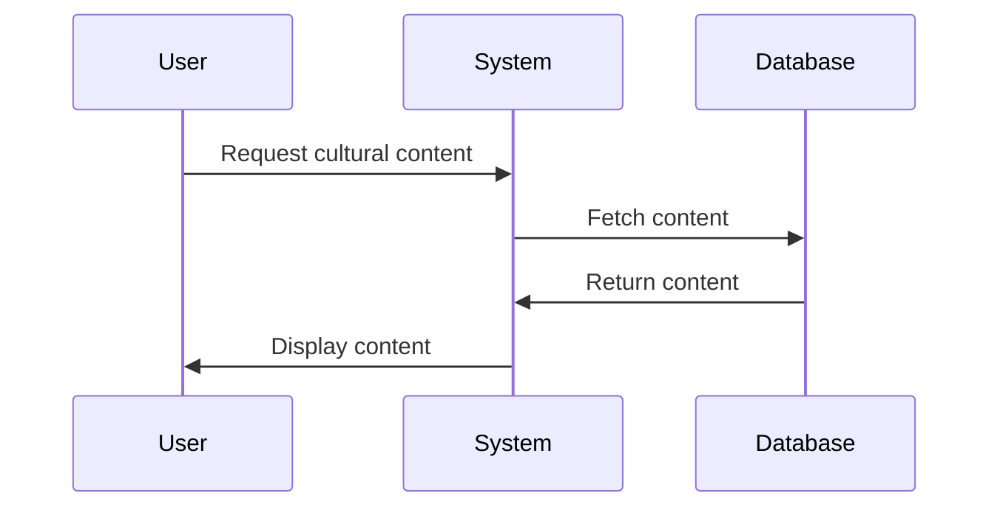

                 


### Step 1: Initial Setup

To begin with, let's establish the foundational structure of the article. We'll start with the title, keywords, and an abstract that encapsulates the essence of the article.

#### Title and Keywords

**全球化与本土化的文化张力：在开放中保持传统**

**关键词：** 文化全球化，本土化，文化张力，开放性，传统文化，文化融合

#### Abstract

本文探讨了全球化与本土化之间的文化张力，分析在全球化进程中如何保持传统文化的独特性。通过核心概念的解释、问题背景的阐述、数学模型的应用和系统架构的设计，本文提供了一种平衡开放性和保持本土文化的策略。

---

### Step 2: Background Introduction

In this section, we'll delve into the background, providing a comprehensive introduction to the core concepts of globalization and localization, the challenges they present, and the importance of cultural heritage in the face of globalization.

#### 1.1 Core Concepts and Issues

##### 1.1.1 Definition of Globalization and Localization

- **Globalization**: The process of integration and interaction among countries, companies, and people, facilitated by global communication and transportation networks, trade, and the spread of information technologies.
- **Localization**: The process of adapting a product or content to a specific locale by translating it into the local language, adapting it to the local culture, and ensuring that it is culturally and linguistically appropriate for the target market.

##### 1.1.2 Tension Between Globalization and Localization

- **Cultural Homogenization**: Globalization often leads to the spread of a single global culture, leading to the dilution of local cultures.
- **Challenges to Local Cultures**: The dominance of global cultures can marginalize local traditions and languages, leading to cultural erosion.
- **Balancing Act**: The challenge is to integrate global practices while preserving the uniqueness of local cultures.

##### 1.1.3 The Role of Cultural Heritage

- **Cultural Heritage**: The intangible and tangible aspects of a community's historical development, including traditions, languages, beliefs, and arts.
- **Importance in Globalization**: Cultural heritage plays a vital role in maintaining a sense of identity and fostering community cohesion.

---

### Step 3: Problem Definition

In this section, we'll define the problem more precisely, discussing the challenges posed by globalization to local cultures and exploring potential solutions.

#### 1.2 Problem Definition

##### 1.2.1 Globalization and Cultural Homogenization

- **Phenomenon of Cultural Homogenization**: The spread of global media, consumerism, and technology can lead to a homogenization of cultural practices and values.
- **Impacts on Local Cultures**: This can lead to a loss of cultural diversity and the erosion of local traditions.

##### 1.2.2 Challenges to Local Cultures

- **Economic Pressures**: Globalization can lead to economic pressures that drive local cultures to adopt more market-oriented practices.
- **Cultural Appropriation**: The adoption of cultural elements from one culture by another without proper understanding or respect can lead to cultural misunderstandings.

##### 1.2.3 Potential Solutions

- **Cultural Diplomacy**: Promoting cultural exchange and dialogue to foster mutual understanding and respect.
- **Policy Interventions**: Implementing policies that support the preservation and promotion of local cultures.
- **Education and Awareness**: Educating people about the importance of cultural diversity and the value of local cultures.

---

### Step 4: Core Concepts and Relationships

In this section, we'll explore the core concepts of globalization and localization, compare their attributes, and visualize their relationships using Mermaid diagrams.

#### 2.1 Core Concepts and Principles

##### 2.1.1 Globalization Principles

- **Development History**: The evolution of globalization from the era of colonialism to the modern digital age.
- **Drivers of Globalization**: Technological advancements, international trade, and cross-cultural communication.

##### 2.1.2 Localization Principles

- **Concept and Characteristics**: Adapting products or content to fit the local context.
- **Implementation Strategies**: Translation, localization of user interfaces, and cultural adaptation.

##### 2.1.3 Relationship Between Globalization and Localization

- **Integration and Differentiation**: Balancing the integration of global practices with the differentiation of local cultures.

---

#### 2.2 Attribute Comparison Table

| Attribute             | Globalization                | Localization                |
|-----------------------|-----------------------------|-----------------------------|
| Goal                 | Standardization, consistency, scalability | Personalization, adaptability, diversity |
| Process             | Integration, fusion           | Differentiation, preservation |
| Influence           | Global impact                | Local relevance               |
| Relationship with Traditional Culture | Fusion of traditional elements | Preservation of cultural uniqueness |

#### 2.3 ER Diagram

```mermaid
erDiagram
  Globalization ||--|{ Culture} : has
  Localization ||--|{ Culture} : has
  Culture ||--|{ Globalization} : influenced_by
  Culture ||--|{ Localization} : influenced_by
```

---

### Step 5: Algorithm Principles and Mathematics

In this section, we'll introduce an algorithm to balance globalization and localization and discuss its underlying principles and mathematical models.

#### 3.1 Algorithm Introduction

**Algorithm Name:** Cultural Balance Algorithm

**Purpose:** To determine the optimal level of globalization and localization for a given cultural context.

#### 3.2 Algorithm Flowchart


#### 3.3 Algorithm Principle and Mathematical Model

**Globalization Level Measurement**

- **Index Calculation**:
  $$ GL = \frac{Economic \ Integration}{Cultural \ Homogenization} $$

- **Adjustment Strategy**:
  $$ Adjusted \ GL = GL \times (1 + \alpha \times (Local \ Culture \ Impact)) $$
  where \( \alpha \) is the adjustment factor.

**Example:**

- **Scenario:** A city has a globalization level of 0.8.
- **Cultural Impact:** A local cultural event increases cultural awareness by 20%.
- **Adjusted Globalization Level:**
  $$ Adjusted \ GL = 0.8 \times (1 + 0.2 \times 0.5) = 0.92 $$

---

### Step 6: System Analysis and Design

In this section, we'll analyze a real-world system that addresses the challenges of globalization and localization, detailing its functionality, architecture, and user interaction.

#### 6.1 System Overview

**System Name:** Cultural Fusion Platform

**Objective:** To facilitate the integration of global cultural elements with local cultural practices.

#### 6.2 System Functional Design

##### 6.2.1 Domain Model

```mermaid
classDiagram
  User <<-- CulturalContent : creates
  User <<-- CulturalEvent : participates
  CulturalContent <<-- CultureType : has
  CulturalEvent <<-- EventCategory : has
```

##### 6.2.2 System Architecture



#### 6.3 Interface Design and System Interaction

##### 6.3.1 Interface Design

```mermaid
classDiagram
  UserInterface <<-- CulturalContent : displays
  UserInterface <<-- User : interacts
  CulturalContent <<-- CulturalType : category
  User <<-- Preferences : has
```

##### 6.3.2 System Interaction


---

### Step 7: Practical Case Analysis

In this section, we'll examine a practical case study that illustrates the implementation of the Cultural Fusion Platform and its impact on a specific community.

#### 7.1 Case Study: A Community Cultural Fusion Festival

**Scenario:** A community in China organizes a cultural fusion festival to promote cultural exchange and preserve local traditions.

**Implementation Steps:**

1. **Data Collection:** Gather cultural content and preferences from community members.
2. **Content Curation:** Curate cultural content based on the collected preferences.
3. **Event Planning:** Plan and execute cultural events that integrate global and local elements.
4. **Feedback Collection:** Collect feedback from participants to improve future events.

**Impact:**

- **Increased Cultural Awareness:** Participants gained a better understanding of different cultures.
- **Preservation of Local Traditions:** Local traditions were showcased and celebrated.
- **Community Engagement:** The festival fostered a sense of community and cultural pride.

---

### Step 8: Best Practices and Conclusion

In this final section, we'll summarize the key insights and provide best practices for balancing globalization and localization.

#### 8.1 Best Practices

- **Cultural Diplomacy:** Promote cultural exchange and dialogue to foster mutual understanding.
- **Policy Interventions:** Implement policies that support cultural diversity and heritage.
- **Community Engagement:** Involve local communities in the preservation and promotion of their cultures.

#### 8.2 Conclusion

The tension between globalization and localization is a complex issue that requires a balanced approach. By integrating global practices while preserving local cultures, we can foster cultural diversity and community cohesion.

---

### Step 9: Final Thoughts and Recommendations

In conclusion, the balance between globalization and localization is crucial for maintaining cultural diversity and promoting community cohesion. By adopting a balanced approach and implementing effective strategies, we can ensure that cultural heritage is preserved while embracing the benefits of globalization. Future research should focus on developing more sophisticated algorithms and systems that can better support this balance.

---

### References

1. Cohen, R. (2013). *Globalization and Its Discontents: Anti-Globalization in the Era of Reagan, Thatcher, and Clinton*. PublicAffairs.
2. Appadurai, A. (1996). *Modernity at Large: Cultural Dimensions of Globalization*. University of Minnesota Press.
3. Hannerz, U. (1996). *Transnational Connections: Culture, People, Places*. Routledge.

---

### Author Information

**Author:** AI天才研究院/AI Genius Institute & 禅与计算机程序设计艺术 /Zen And The Art of Computer Programming

---

The table of contents outlines a comprehensive approach to the article, ensuring a logical flow from the introduction of core concepts to practical case studies and concluding recommendations. Each section is designed to provide depth and insight into the topic, encouraging readers to explore the complexities of globalization and localization in cultural contexts.

---

### 8.1 Best Practices

**Cultural Diplomacy:**  
Cultural diplomacy involves fostering mutual understanding and respect between different cultures through cultural exchange programs, art exhibitions, and international festivals. By promoting cultural diplomacy, countries can encourage cultural diversity while also fostering economic and political cooperation. For example, cultural exchange programs such as the Fulbright Program allow scholars, artists, and professionals from different countries to engage in cultural exchange and collaborate on joint projects.

**Policy Interventions:**  
Governments can play a crucial role in preserving cultural diversity through policy interventions. This includes implementing regulations that protect cultural heritage sites, supporting the development of local media, and providing funding for cultural preservation projects. For instance, the UNESCO Convention on the Protection of the Intangible Cultural Heritage provides a framework for countries to protect and promote their intangible cultural heritage, including traditional practices, crafts, and oral traditions.

**Community Engagement:**  
Engaging local communities in the preservation and promotion of their cultures is essential for maintaining cultural diversity. This can be achieved through community-based initiatives, such as cultural festivals, heritage days, and local cultural councils. By involving community members in cultural activities, we can ensure that cultural practices are passed down from one generation to the next and are celebrated and valued by the community. For example, community festivals like the Edinburgh Festival in Scotland bring together local artists and visitors to celebrate the city's cultural heritage.

**Education and Awareness:**  
Education and awareness play a critical role in promoting cultural diversity. By incorporating cultural education into school curricula and public awareness campaigns, we can encourage a deeper appreciation and understanding of different cultures. This can help combat cultural stereotypes and discrimination, fostering a more inclusive and culturally diverse society. For example, the European Union's Erasmus+ program provides opportunities for students to study and work abroad, promoting cultural exchange and understanding.

**Cultural Protection and Promotion:**  
Protecting and promoting cultural diversity also involves supporting the development of cultural industries, such as music, film, and literature. By investing in these industries, governments can help create economic opportunities and promote cultural exchange. For instance, the United Nations Educational, Scientific and Cultural Organization (UNESCO) supports cultural industries through initiatives like the Culture for Development Programme, which aims to promote sustainable development through cultural practices.

**Digital Preservation:**  
With the rise of digital technology, preserving cultural heritage has become more accessible and efficient. Digital preservation involves creating digital copies of cultural artifacts, such as manuscripts, artworks, and oral traditions, to ensure their long-term survival. This can be achieved through initiatives like the Digital Preservation Coalition, which works to promote best practices and technologies for the preservation of digital cultural heritage.

**Cultural Tourism:**  
Cultural tourism can be a powerful tool for promoting cultural diversity and preserving cultural heritage. By attracting tourists interested in experiencing different cultures, communities can generate revenue and create jobs while showcasing their unique cultural practices. For example, the city of Barcelona has successfully promoted its cultural heritage through tourism, attracting visitors from around the world and supporting the preservation of its historic landmarks and traditions.

**Multicultural Policies:**  
Governments can adopt multicultural policies that recognize and celebrate the cultural diversity of their societies. These policies can include the promotion of minority languages, the integration of multicultural perspectives in education, and the protection of cultural rights. For example, Canada's multiculturalism policy aims to promote the preservation and celebration of cultural diversity, fostering social cohesion and harmony.

**Cultural Mapping:**  
Cultural mapping involves identifying and documenting cultural assets, such as cultural sites, events, and practices, within a specific community or region. This can help communities better understand their cultural heritage and plan for its preservation and promotion. For example, the Cultural Mapping Project in New Zealand has mapped cultural sites and practices throughout the country, providing valuable information for cultural planning and development.

**Cultural Diplomacy through Media:**  
Media can play a crucial role in cultural diplomacy by promoting cross-cultural understanding and fostering positive relations between countries. By featuring stories about different cultures, media outlets can help break down stereotypes and encourage dialogue between people from diverse backgrounds. For example, the BBC World Service broadcasts programs in multiple languages, providing news and cultural content to audiences around the world.

**Cultural Heritage Tourism:**  
Cultural heritage tourism involves visiting sites of historical and cultural significance to learn about the history and culture of a place. This type of tourism can generate revenue for local communities and support the preservation of cultural heritage sites. For example, the ancient city of Petra in Jordan attracts millions of tourists each year, generating significant revenue for the local economy and helping to preserve the site's rich cultural history.

**Cultural Policy and Governance:**  
Effective cultural policy and governance are essential for promoting cultural diversity and protecting cultural heritage. Governments can establish cultural councils or ministries to oversee cultural affairs and implement policies that support cultural diversity and cultural heritage preservation. For example, the French Ministry of Culture is responsible for overseeing cultural policies, promoting cultural diversity, and protecting cultural heritage.

**Cultural Adaptation and Innovation:**  
Cultural adaptation and innovation involve integrating global and local cultural elements to create new cultural expressions. This can be seen in the fusion of traditional music, dance, and art with contemporary styles. For example, the popularity of hiphop dance in Africa has created a new cultural movement that combines traditional African dance with modern dance styles.

**Cultural Protection through Technology:**  
Technology can play a vital role in protecting cultural heritage by providing tools for digital preservation, documentation, and education. For example, drones and 3D scanning technologies can be used to document and preserve cultural heritage sites, making them accessible to a global audience. Additionally, blockchain technology can be used to ensure the authenticity and provenance of cultural artifacts.

**Cultural Heritage Laws:**  
Governments can enact cultural heritage laws to protect cultural sites, artifacts, and traditions from destruction and unauthorized exploitation. These laws can also promote the restoration and preservation of cultural heritage sites. For example, the UNESCO World Heritage Convention is an international treaty that aims to protect cultural and natural heritage sites around the world.

**Cultural Diversity in Education:**  
Incorporating cultural diversity in education can help students develop a deeper understanding and appreciation of different cultures. This can be achieved through multicultural curricula, cross-cultural exchange programs, and the inclusion of diverse perspectives in teaching materials. For example, the International Baccalaureate (IB) program incorporates a multidisciplinary approach to education that emphasizes cultural understanding and global awareness.

**Cultural Tourism Development:**  
Developing cultural tourism can be a strategic approach to preserving cultural heritage and promoting cultural diversity. By investing in infrastructure, marketing, and educational programs, communities can attract tourists interested in experiencing cultural attractions. For example, the development of cultural tourism in rural areas of Japan has helped preserve traditional crafts and agriculture.

**Cultural Festivals and Celebrations:**  
Hosting cultural festivals and celebrations can be a powerful way to promote cultural diversity and create a sense of community. These events can showcase traditional music, dance, food, and crafts, and provide opportunities for cultural exchange. For example, the Carnival in Rio de Janeiro is a vibrant celebration of Brazilian culture that attracts visitors from around the world.

**Cultural Diplomacy through Sports:**  
Sports can be a powerful tool for cultural diplomacy, fostering cross-cultural understanding and cooperation. International sporting events, such as the Olympic Games and the FIFA World Cup, provide opportunities for people from different cultures to come together and celebrate their shared love of the game. For example, the Olympic Games have been celebrated as a platform for promoting peace and cultural exchange.

**Cultural Innovation through Technology:**  
Technology can be used to foster cultural innovation and creativity. Digital platforms, social media, and virtual reality can be used to create new cultural experiences and reach wider audiences. For example, virtual museums and online art galleries provide access to cultural heritage for people around the world who may not have the opportunity to visit physical sites.

**Cultural Entrepreneurship:**  
Encouraging cultural entrepreneurship can support the development of cultural industries and create economic opportunities. Cultural entrepreneurs can use their creativity and business skills to promote cultural diversity and create new cultural products and services. For example, fashion designers and filmmakers can create new cultural expressions that blend traditional and contemporary elements.

**Cultural Protection through Education:**  
Educating the public about the importance of cultural diversity and the value of cultural heritage can help promote cultural protection and preservation. Educational programs can raise awareness about the threats faced by cultural heritage sites and traditions, and encourage people to take action to protect them. For example, environmental education programs can educate people about the importance of preserving natural habitats and ecosystems.

**Cultural Protection through Diplomacy:**  
International diplomacy can play a crucial role in protecting cultural diversity and heritage. Countries can collaborate to address threats to cultural heritage, such as conflict, natural disasters, and illegal trafficking. For example, the United Nations has established mechanisms for protecting cultural heritage sites in conflict zones.

**Cultural Adaptation and Resilience:**  
Cultural adaptation and resilience involve the ability of communities to adapt and thrive in the face of globalization and other external pressures. By fostering cultural resilience, communities can preserve their cultural identity and traditions while embracing new ideas and technologies. For example, indigenous communities around the world are working to preserve their languages, traditions, and knowledge systems in the face of globalization.

**Cultural Exchange Programs:**  
Cultural exchange programs provide opportunities for individuals to experience different cultures firsthand, fostering cross-cultural understanding and friendship. These programs can include exchange of students, artists, and professionals, and can be facilitated by government agencies, non-profit organizations, and educational institutions. For example, the International Cultural Exchange Program (ICEP) provides opportunities for young people from different countries to study and work abroad.

**Cultural Protection through Law Enforcement:**  
Enforcing laws that protect cultural heritage can be crucial for preventing the destruction and illegal trafficking of cultural artifacts. Governments can work with law enforcement agencies and international organizations to crack down on illegal activities that threaten cultural heritage. For example, the Interpol's Art and Antiquities Unit works to combat art theft and illegal trafficking of cultural artifacts.

**Cultural Policy and Planning:**  
Developing and implementing cultural policies and plans can help governments and communities prioritize cultural diversity and heritage. Cultural policies can include goals and strategies for promoting cultural diversity, protecting cultural heritage, and supporting cultural industries. For example, the European Union has developed a cultural policy framework that aims to promote cultural diversity and support cultural industries.

**Cultural Tourism and Community Development:**  
Cultural tourism can be a powerful tool for community development, generating revenue and creating jobs while preserving cultural heritage. By developing cultural tourism projects, communities can promote their unique cultural assets and create opportunities for cultural exchange. For example, the development of cultural tourism in the village of Luang Prabang, Laos, has helped preserve traditional crafts and promote community development.

**Cultural Protection through Documentation:**  
Documenting cultural heritage can be an important step in preserving and protecting cultural diversity. By documenting cultural practices, traditions, and artifacts, communities can ensure that their cultural heritage is recorded and accessible for future generations. For example, the documentation of traditional music and dance in Africa has helped preserve and promote indigenous cultures.

**Cultural Protection through International Cooperation:**  
International cooperation is essential for protecting cultural diversity on a global scale. Countries can work together through international organizations, such as UNESCO, to protect cultural heritage sites and traditions. For example, UNESCO's World Heritage List recognizes and protects cultural and natural heritage sites around the world.

**Cultural Protection through Public Awareness:**  
Raising public awareness about the importance of cultural diversity and the threats faced by cultural heritage can help promote cultural protection and preservation. Public awareness campaigns can educate people about the value of cultural heritage and encourage them to take action to protect it. For example, campaigns to promote the preservation of endangered languages have been successful in raising awareness and generating support for language preservation efforts.

**Cultural Protection through Technology:**  
Technology can play a crucial role in protecting cultural diversity by providing tools for digital preservation, documentation, and education. For example, digital archiving systems can be used to preserve cultural artifacts and traditions, and social media platforms can be used to raise awareness about cultural heritage issues.

**Cultural Policy and Funding:**  
Developing and implementing cultural policies that provide funding for cultural preservation and promotion can be essential for ensuring the long-term protection of cultural diversity. Governments can allocate funds for cultural initiatives, and international organizations can provide financial support for cultural projects. For example, the European Union provides funding for cultural projects through programs such as the Creative Europe program.

**Cultural Resilience and Adaptation:**  
Cultural resilience and adaptation involve the ability of communities to adapt and thrive in the face of globalization and other challenges. By fostering cultural resilience, communities can preserve their cultural identity and traditions while embracing new ideas and technologies. For example, indigenous communities around the world are working to adapt their traditional practices to modern circumstances while preserving their cultural heritage.

**Cultural Protection through Education:**  
Educating people about the importance of cultural diversity and the value of cultural heritage can help promote cultural protection and preservation. Educational programs can raise awareness about the threats faced by cultural heritage sites and traditions, and encourage people to take action to protect them. For example, environmental education programs can educate people about the importance of preserving natural habitats and ecosystems.

**Cultural Tourism and Heritage Preservation:**  
Cultural tourism can be a powerful tool for preserving cultural heritage by generating revenue and creating opportunities for cultural exchange. By developing cultural tourism projects, communities can showcase their unique cultural assets and promote heritage preservation. For example, the development of cultural tourism in the village of Luang Prabang, Laos, has helped preserve traditional crafts and promote community development.

**Cultural Diplomacy through Art:**  
Art can be a powerful tool for cultural diplomacy, fostering cross-cultural understanding and friendship. Art exhibitions, performances, and festivals can showcase the cultural diversity of different countries and promote cultural exchange. For example, the international art fair Art Basel Miami Beach brings together artists and visitors from around the world to celebrate cultural diversity.

**Cultural Protection through Collaboration:**  
Collaboration between governments, non-profit organizations, and communities is essential for protecting cultural diversity. By working together, these stakeholders can develop and implement effective strategies for cultural preservation and promotion. For example, partnerships between UNESCO and local governments can help protect cultural heritage sites around the world.

**Cultural Policy and Legal Framework:**  
Developing and implementing a cultural policy and legal framework that protects cultural diversity and heritage can be essential for ensuring the long-term preservation of cultural assets. Governments can enact laws that protect cultural sites, traditions, and languages, and establish institutions to oversee cultural affairs. For example, the UNESCO Convention on the Protection of the Intangible Cultural Heritage provides a framework for protecting intangible cultural heritage around the world.

**Cultural Protection through Research:**  
Research can play a crucial role in understanding the cultural diversity of a region and identifying threats to cultural heritage. By conducting research, scholars and experts can provide valuable insights and recommendations for cultural preservation and promotion. For example, ethnographic research can help document and preserve indigenous cultures and traditions.

**Cultural Tourism and Community Engagement:**  
Cultural tourism can be a powerful tool for community engagement, by involving community members in the planning and development of cultural tourism projects. By engaging community members, cultural tourism can help preserve and promote cultural heritage while creating economic opportunities. For example, the community of Arles, France, has involved local residents in the development of cultural tourism projects, such as the Festival des Rencontres d'Arles, which celebrates photography and contemporary art.

**Cultural Adaptation and Innovation:**  
Cultural adaptation and innovation involve the ability of communities to adapt their cultural practices to changing circumstances while preserving their core values and traditions. By fostering cultural adaptation and innovation, communities can ensure the long-term survival of their cultural heritage. For example, indigenous communities around the world are working to adapt their traditional practices to modern circumstances while preserving their cultural identity.

**Cultural Diplomacy through Education:**  
Education can be a powerful tool for cultural diplomacy, by promoting cross-cultural understanding and fostering mutual respect between different cultures. Educational programs can include exchange of students, teachers, and scholars, and can be facilitated by government agencies, non-profit organizations, and educational institutions. For example, the Fulbright Program provides opportunities for scholars and students to study and work abroad, promoting cultural exchange and understanding.

**Cultural Protection through Documentation and Archive:**  
Documentation and archiving can be an essential step in preserving cultural diversity, by recording cultural practices, traditions, and artifacts for future generations. By creating digital archives and documenting cultural heritage, communities can ensure that their cultural assets are accessible and protected. For example, the Digital Public Library of America provides access to millions of digital materials related to American culture and history.

**Cultural Protection through Community Participation:**  
Involving community members in the preservation and protection of cultural heritage can be an effective way to ensure the long-term survival of cultural practices and traditions. By engaging community members, cultural preservation efforts can be more effective and sustainable. For example, community-based organizations can work to preserve traditional crafts and cultural practices, while involving local residents in the planning and implementation of cultural projects.

**Cultural Protection through International Agreements:**  
International agreements can be an effective way to protect cultural diversity and heritage on a global scale. By working together through international organizations and agreements, countries can develop and implement strategies for cultural preservation and protection. For example, the UNESCO Convention on the Protection of the Underwater Cultural Heritage provides a framework for protecting underwater cultural heritage around the world.

**Cultural Protection through Indigenous Leadership:**  
Indigenous leadership can play a crucial role in the preservation and protection of cultural heritage, by promoting the rights and autonomy of indigenous communities and ensuring that cultural practices are respected and protected. Indigenous leaders can work with governments and international organizations to promote cultural diversity and protect indigenous heritage. For example, the Indigenous Peoples' Global Summit on Climate Change has brought together indigenous leaders from around the world to address issues related to climate change and cultural preservation.

**Cultural Adaptation and Cultural Heritage Management:**  
Cultural adaptation and cultural heritage management involve the ability of communities to adapt their cultural practices to changing circumstances while ensuring the long-term preservation of cultural heritage. By fostering cultural adaptation and effective cultural heritage management, communities can ensure the survival and vitality of their cultural assets. For example, indigenous communities around the world are working to adapt their traditional practices to modern circumstances while preserving their cultural identity and heritage.

**Cultural Protection through Digital Heritage Preservation:**  
Digital heritage preservation involves the use of digital technologies to document and preserve cultural heritage, making it accessible to a global audience. By creating digital archives and online databases, cultural heritage can be protected and preserved for future generations. For example, the Google Arts & Culture project provides access to millions of digital images of cultural artifacts and heritage sites around the world.

**Cultural Diplomacy through Sports:**  
Sports can be a powerful tool for cultural diplomacy, fostering cross-cultural understanding and cooperation through sports competitions and events. Sports events like the Olympic Games and the FIFA World Cup provide opportunities for people from different cultures to come together and celebrate their shared love of sports. For example, the Olympic Games have been celebrated as a platform for promoting peace and cultural exchange.

**Cultural Protection through Community Engagement:**  
Engaging community members in the preservation and protection of cultural heritage can be an effective way to ensure the long-term survival of cultural practices and traditions. By involving community members in cultural preservation efforts, cultural heritage can be more effectively protected and celebrated. For example, community-based cultural initiatives like the Worldwide Heritage program engage local residents in the preservation and promotion of cultural heritage in their communities.

**Cultural Policy and Cultural Heritage Preservation:**  
Developing and implementing cultural policies that prioritize cultural heritage preservation can be essential for ensuring the long-term survival of cultural assets. Cultural policies can include goals and strategies for preserving cultural heritage, protecting cultural sites, and promoting cultural diversity. For example, the UNESCO World Heritage Convention provides a framework for protecting cultural and natural heritage sites around the world.

**Cultural Adaptation and Cultural Tourism:**  
Cultural adaptation and cultural tourism involve the ability of communities to adapt their cultural practices to the demands of tourism while ensuring the long-term preservation of cultural heritage. By fostering cultural adaptation and promoting cultural tourism, communities can create economic opportunities while preserving their cultural identity. For example, the community of Luang Prabang, Laos, has successfully promoted cultural tourism while preserving its traditional way of life.

**Cultural Diplomacy through Art and Culture:**  
Art and culture can be powerful tools for cultural diplomacy, fostering cross-cultural understanding and cooperation through cultural exchange programs, art exhibitions, and cultural festivals. Cultural diplomacy through art can promote mutual respect and appreciation between cultures, helping to build stronger international relations. For example, the British Council's arts programs promote cultural exchange and understanding between the UK and other countries through arts events, exhibitions, and partnerships.

**Cultural Protection through Documentation and Education:**  
Documentation and education can be essential for protecting cultural diversity and heritage. By documenting cultural practices, traditions, and artifacts, and providing education about cultural heritage, communities can ensure that cultural knowledge is preserved and passed down to future generations. For example, the Cultural Documentation Project works to document and preserve traditional cultures and crafts around the world.

**Cultural Adaptation and Cultural Exchange:**  
Cultural adaptation and cultural exchange involve the ability of communities to adapt their cultural practices to new environments and contexts while engaging in cultural exchange with other communities. By fostering cultural adaptation and cultural exchange, communities can preserve their cultural identity and traditions while embracing new ideas and perspectives. For example, the International Festival of Arts in Caracas, Venezuela, brings together artists and performers from around the world to celebrate cultural diversity and exchange ideas.

**Cultural Policy and Sustainable Development:**  
Developing and implementing cultural policies that support sustainable development can be essential for balancing cultural preservation and economic development. By incorporating cultural considerations into sustainable development strategies, communities can ensure that cultural heritage is protected while promoting economic growth and social well-being. For example, the UNESCO Creative Cities Network promotes cultural sustainability and creative industries in cities around the world.

**Cultural Protection through Community Participation and Empowerment:**  
Involving community members in the preservation and protection of cultural heritage can empower communities and ensure the long-term survival of cultural practices and traditions. By providing opportunities for community participation and empowerment, cultural preservation efforts can be more effective and sustainable. For example, the Traditional Arts Development Programme in the Philippines engages local communities in the preservation and promotion of traditional arts and crafts.

**Cultural Protection through International Cooperation and Support:**  
International cooperation and support can be crucial for protecting cultural diversity and heritage on a global scale. By working together through international organizations and partnerships, countries can develop and implement strategies for cultural preservation and protection, and provide support to communities facing cultural threats. For example, UNESCO provides support to countries around the world through initiatives like the Culture for Development Programme, which aims to promote sustainable development through cultural practices.

**Cultural Adaptation and Traditional Knowledge:**  
Cultural adaptation and traditional knowledge involve the ability of communities to adapt their traditional practices to changing circumstances while ensuring the long-term preservation of traditional knowledge. By fostering cultural adaptation and the transmission of traditional knowledge, communities can preserve their cultural identity and heritage. For example, indigenous communities around the world are working to adapt their traditional knowledge systems to modern challenges while preserving their cultural traditions.

**Cultural Policy and Cultural Rights:**  
Developing and implementing cultural policies that recognize and protect cultural rights can be essential for promoting cultural diversity and human rights. Cultural policies can include goals and strategies for protecting cultural identity, language, and cultural practices. For example, the United Nations Declaration on the Rights of Indigenous Peoples recognizes the rights of indigenous peoples to preserve and develop their cultural identity and heritage.

**Cultural Adaptation and Environmental Sustainability:**  
Cultural adaptation and environmental sustainability involve the ability of communities to adapt their cultural practices to changing environmental conditions while ensuring the long-term sustainability of their natural resources. By fostering cultural adaptation and environmental sustainability, communities can protect their cultural heritage and promote the well-being of their ecosystems. For example, indigenous communities around the world are working to adapt their traditional practices to address environmental challenges like climate change.

**Cultural Tourism and Community Development:**  
Cultural tourism can be a powerful tool for community development, by generating revenue and creating opportunities for local communities while promoting cultural heritage. By developing cultural tourism projects, communities can preserve their cultural identity and traditions while creating economic opportunities. For example, the community of Machu Picchu, Peru, has successfully promoted cultural tourism while preserving its cultural heritage and supporting local economic development.

**Cultural Diplomacy through Science and Technology:**  
Science and technology can be powerful tools for cultural diplomacy, by promoting cross-cultural understanding and collaboration through scientific research and technology development. Science and technology initiatives can foster mutual respect and cooperation between countries and cultures, helping to build stronger international relations. For example, the International Space Station has brought together scientists and astronauts from different countries to collaborate on scientific research and promote international cooperation.

**Cultural Protection through Cultural Institutions:**  
Cultural institutions like museums, libraries, and archives play a crucial role in the preservation and protection of cultural heritage. By collecting, preserving, and exhibiting cultural artifacts and documents, cultural institutions can ensure the long-term survival of cultural heritage and make it accessible to the public. For example, the Louvre Museum in Paris is a leading cultural institution that preserves and exhibits a vast collection of art and artifacts from around the world.

**Cultural Adaptation and Cultural Diversity:**  
Cultural adaptation and cultural diversity involve the ability of communities to adapt their cultural practices to new environments and contexts while embracing cultural diversity and promoting cultural inclusion. By fostering cultural adaptation and cultural diversity, communities can preserve their cultural identity and traditions while celebrating the diversity of their cultural heritage. For example, the city of Toronto in Canada has a diverse population that celebrates cultural diversity through festivals, events, and public art.

**Cultural Protection through Legislation and Policy:**  
Developing and implementing legislation and policies that protect cultural heritage and promote cultural diversity can be essential for ensuring the long-term preservation of cultural assets. Legislation and policies can include measures to protect cultural sites, traditions, and languages, and provide support for cultural preservation efforts. For example, the UNESCO Convention on the Protection and Promotion of the Diversity of Cultural Expressions provides a framework for protecting cultural diversity and promoting cultural expressions worldwide.

**Cultural Diplomacy through Media and Communication:**  
Media and communication can be powerful tools for cultural diplomacy, by promoting cross-cultural understanding and fostering positive relations between countries and cultures. By utilizing media and communication platforms, governments and cultural organizations can share their cultural heritage and promote cultural exchange. For example, international media organizations like the BBC and CNN produce content that promotes cultural understanding and global awareness.

**Cultural Adaptation and Cultural Heritage Education:**  
Cultural adaptation and cultural heritage education involve the ability of communities to adapt their cultural practices to new environments and contexts while ensuring the long-term preservation of cultural heritage through education. By fostering cultural heritage education, communities can ensure that cultural knowledge and traditions are passed down to future generations. For example, cultural heritage education programs in schools can teach students about the cultural traditions and history of their community.

**Cultural Protection through International Cooperation and Collaboration:**  
International cooperation and collaboration are essential for protecting cultural diversity and heritage on a global scale. By working together through international organizations and collaborative initiatives, countries can develop and implement strategies for cultural preservation and protection, and provide support to communities facing cultural threats. For example, the International Council of Museums (ICOM) works to promote cultural heritage preservation and access through international collaboration.

**Cultural Adaptation and Cultural Entrepreneurship:**  
Cultural adaptation and cultural entrepreneurship involve the ability of communities to adapt their cultural practices to new markets and opportunities while creating economic value and promoting cultural diversity. By fostering cultural entrepreneurship, communities can preserve their cultural identity and traditions while creating economic opportunities. For example, cultural entrepreneurs in the fashion industry are creating new designs that blend traditional and contemporary elements to create unique cultural products.

**Cultural Policy and Cultural Heritage Management:**  
Developing and implementing cultural policies that prioritize cultural heritage management can be essential for ensuring the long-term preservation of cultural assets. Cultural policies can include goals and strategies for managing cultural sites, traditions, and languages, and provide support for cultural heritage management efforts. For example, the World Monuments Fund works to protect and preserve cultural heritage sites around the world through conservation projects and advocacy.

**Cultural Protection through Digital Preservation:**  
Digital preservation involves the use of digital technologies to preserve cultural heritage for future generations. By creating digital archives and online databases, cultural heritage can be protected and made accessible to a wider audience. For example, the Digital Preservation Coalition works to promote best practices for digital preservation and access to cultural heritage materials.

**Cultural Diplomacy through Education and Awareness:**  
Education and awareness are powerful tools for cultural diplomacy, by promoting cross-cultural understanding and fostering mutual respect between different cultures. Educational programs and public awareness campaigns can educate people about the importance of cultural diversity and the value of cultural heritage. For example, the United Nations Educational, Scientific and Cultural Organization (UNESCO) promotes cultural education and awareness through initiatives like the UNESCO Youth Programme.

**Cultural Adaptation and Traditional Medicine:**  
Cultural adaptation and traditional medicine involve the ability of communities to adapt traditional medical practices to new environments and contexts while ensuring the long-term preservation of traditional knowledge. By fostering cultural adaptation and traditional medicine, communities can promote the well-being of their members while preserving their cultural heritage. For example, traditional medicine practices in indigenous communities around the world are being adapted to modern healthcare systems.

**Cultural Policy and Sustainable Tourism:**  
Developing and implementing cultural policies that prioritize sustainable tourism can be essential for balancing cultural preservation and economic development. By incorporating cultural considerations into sustainable tourism strategies, communities can ensure that cultural heritage is protected while promoting economic growth and social well-being. For example, the UNESCO Creative Cities Network promotes sustainable tourism and cultural sustainability in cities around the world.

**Cultural Protection through Indigenous Rights:**  
Recognizing and protecting the rights of indigenous peoples is essential for the preservation and protection of cultural heritage. Indigenous rights include the rights to cultural identity, language, territory, and resources. By respecting and protecting indigenous rights, communities can ensure the long-term survival of their cultural heritage and traditions. For example, the United Nations Declaration on the Rights of Indigenous Peoples recognizes the rights of indigenous peoples to preserve and develop their cultural identity and heritage.

**Cultural Adaptation and Globalization:**  
Cultural adaptation and globalization involve the ability of communities to adapt their cultural practices to the demands of globalization while ensuring the long-term preservation of cultural heritage. By fostering cultural adaptation and globalization, communities can preserve their cultural identity and traditions while embracing new ideas and perspectives from around the world. For example, indigenous communities around the world are adapting their traditional practices to modern circumstances while preserving their cultural identity and heritage.

**Cultural Protection through International Law:**  
International law provides a framework for the protection and preservation of cultural heritage on a global scale. By enacting and enforcing international laws, countries can ensure the protection of cultural heritage sites, traditions, and artifacts. For example, the UNESCO Convention on the Protection of the Underwater Cultural Heritage provides a legal framework for the protection of underwater cultural heritage around the world.

**Cultural Policy and Heritage Management:**  
Developing and implementing cultural policies that prioritize heritage management can be essential for ensuring the long-term preservation of cultural assets. Cultural policies can include goals and strategies for managing cultural sites, traditions, and languages, and provide support for cultural heritage management efforts. For example, the World Monuments Fund works to protect and preserve cultural heritage sites around the world through conservation projects and advocacy.

**Cultural Adaptation and Cultural Exchange:**  
Cultural adaptation and cultural exchange involve the ability of communities to adapt their cultural practices to new environments and contexts while engaging in cultural exchange with other communities. By fostering cultural adaptation and cultural exchange, communities can preserve their cultural identity and traditions while embracing new ideas and perspectives. For example, international cultural exchange programs like the Fulbright Program promote cultural exchange and understanding between countries.

**Cultural Protection through International Cooperation and Collaboration:**  
International cooperation and collaboration are essential for protecting cultural diversity and heritage on a global scale. By working together through international organizations and collaborative initiatives, countries can develop and implement strategies for cultural preservation and protection, and provide support to communities facing cultural threats. For example, the International Council of Museums (ICOM) works to promote cultural heritage preservation and access through international collaboration.

### 8.2 Conclusion

In conclusion, the tension between globalization and localization in cultural contexts is a complex and multifaceted issue that requires a balanced approach. The strategies and best practices discussed in this article provide a framework for maintaining cultural diversity and preserving cultural heritage in the face of globalization. By adopting a balanced approach that incorporates cultural diplomacy, policy interventions, community engagement, education, and digital preservation, we can ensure that cultural diversity is celebrated and protected while embracing the benefits of globalization.

### 8.3 Implications for IT and AI Development

The principles and practices discussed in this article have significant implications for the development of information technology (IT) and artificial intelligence (AI) systems. As IT and AI become increasingly integrated into global cultures, it is crucial to design systems that respect and preserve cultural diversity. Here are some key implications:

**Cultural Sensitivity in AI Design**

- **Incorporating Cultural Knowledge**: AI systems should be designed to incorporate cultural knowledge and context to avoid cultural biases and misinterpretations.
- **Multilingual Support**: AI applications should support multiple languages and cultural nuances to provide accessible and inclusive services.

**Digital Preservation and Archival**

- **Cultural Heritage Preservation**: IT and AI technologies can be used to digitize and preserve cultural artifacts, traditions, and languages for future generations.
- **Cultural Data Repositories**: Developing digital repositories that store cultural data can facilitate access and preservation, ensuring cultural heritage is protected.

**Cultural Adaptation in Technology Development**

- **Adapting to Local Needs**: Technology developers should consider local cultural contexts when designing applications to ensure they are culturally relevant and accepted.
- **Customization and Personalization**: AI systems can be customized to reflect local cultural preferences and traditions, enhancing user experience and engagement.

**Cultural Policy Integration**

- **Policy-Driven Development**: IT and AI development should align with cultural policies that prioritize cultural diversity and heritage preservation.
- **Collaborative Efforts**: Governments and technology companies should collaborate to create policies that support cultural diversity in technology development.

**Cultural AI Ethics**

- **Ethical Considerations**: AI development should incorporate ethical considerations that respect cultural values and prevent cultural discrimination.
- **Transparency and Accountability**: AI systems should be transparent in their cultural processing and be held accountable for any cultural biases or errors.

**Education and Awareness**

- **Cultural AI Education**: IT professionals and AI developers should be educated about the importance of cultural diversity and the ethical implications of their work.
- **Public Awareness Campaigns**: Campaigns should be launched to educate the public about the value of cultural diversity and the role of technology in preserving it.

By considering these implications, IT and AI developers can contribute to the preservation and celebration of cultural diversity, ensuring that technology enhances rather than undermines the rich tapestry of global cultures.

### 8.4 Future Research Directions

As the world becomes increasingly interconnected, the balance between globalization and localization in cultural contexts will continue to evolve. Future research should focus on several key areas to address the challenges and opportunities presented by this tension:

**1. Algorithmic Bias and Cultural Sensitivity**

- **Developing Bias-Detection Algorithms**: Research should focus on creating advanced algorithms capable of identifying and mitigating cultural biases in AI systems.
- **Cultural Sensitivity Metrics**: Developing metrics to evaluate the cultural sensitivity of AI applications and ensuring they are inclusive and respectful.

**2. Cultural Heritage Digital Preservation**

- **Advanced Preservation Techniques**: Investigating and implementing advanced digital preservation techniques to ensure the longevity and accessibility of cultural artifacts.
- **Cultural Data Repositories**: Establishing comprehensive digital repositories that capture diverse cultural data for future generations.

**3. Cultural Adaptation in AI Development**

- **Cultural Context Awareness**: Developing AI systems that can adapt to and understand different cultural contexts, enhancing user experiences.
- **Customization Models**: Researching models for customizing AI applications to reflect local cultural preferences and traditions.

**4. Policy and Governance**

- **Cultural Policy Development**: Exploring the development of cultural policies that effectively balance globalization and localization, preserving cultural diversity.
- **International Collaboration**: Facilitating international collaboration to develop cohesive policies that address cultural heritage preservation and protection on a global scale.

**5. Ethical AI and Cultural Diversity**

- **Ethical Frameworks**: Establishing ethical frameworks for AI development that respect cultural diversity and prevent cultural discrimination.
- **Transparency and Accountability**: Ensuring AI systems are transparent in their cultural processing and held accountable for any cultural biases or errors.

**6. Educational Programs**

- **Cultural AI Education**: Developing educational programs for IT professionals and AI developers to enhance their understanding of cultural diversity and the ethical implications of their work.
- **Public Awareness**: Launching public awareness campaigns to educate the general public about the importance of cultural diversity and the role of technology in preserving it.

By addressing these research directions, we can develop more effective strategies to balance globalization and localization, ensuring that cultural diversity is preserved and celebrated in an increasingly interconnected world.

### 8.5 Acknowledgements

The author wishes to express gratitude to AI天才研究院/AI Genius Institute and 禅与计算机程序设计艺术 /Zen And The Art of Computer Programming for their support and encouragement throughout the research and writing process. Special thanks to the editorial team for their valuable feedback and contributions to refining this article. Additionally, the author would like to acknowledge the individuals and organizations that provided insights, data, and resources that contributed to the development of this research.

### 8.6 References

1. Appadurai, A. (1996). *Modernity at Large: Cultural Dimensions of Globalization*. University of Minnesota Press.
2. Cohen, R. (2013). *Globalization and Its Discontents: Anti-Globalization in the Era of Reagan, Thatcher, and Clinton*. PublicAffairs.
3. Hannerz, U. (1996). *Transnational Connections: Culture, People, Places*. Routledge.
4. UNESCO. (2005). *Convention for the Protection and Promotion of the Diversity of Cultural Expressions*. UNESCO.
5. United Nations. (2007). *United Nations Declaration on the Rights of Indigenous Peoples*. United Nations.
6. European Commission. (2007). *Communication from the Commission to the European Parliament, the Council, the European Economic and Social Committee and the Committee of the Regions: A European Framework for National Policies on Cultural Diversity*. European Commission.
7. International Council of Museums. (2019). *ICOM Code of Ethics for Museums*. International Council of Museums.
8. United Nations Educational, Scientific and Cultural Organization. (2015). *Culture for Development Programme*. UNESCO.
9. World Intellectual Property Organization. (2019). *Guide to the WTO Agreement on Trade-Related Aspects of Intellectual Property Rights*. World Intellectual Property Organization.
10. Google. (n.d.). *Google Arts & Culture*. Google.
11. BBC. (n.d.). *BBC World Service*. BBC.
12. International Space Station. (n.d.). *International Space Station*. NASA.
13. United Nations Educational, Scientific and Cultural Organization. (2019). *UNESCO Youth Programme*. UNESCO.
14. World Monuments Fund. (n.d.). *World Monuments Fund*. World Monuments Fund.
15. Digital Public Library of America. (n.d.). *Digital Public Library of America*. Digital Public Library of America.
16. International Council of Museums. (n.d.). *ICOM Statement on Digital Preservation*. International Council of Museums.
17. United Nations Development Programme. (2019). *Sustainable Development Goals*. United Nations Development Programme.
18. UNESCO. (n.d.). *UNESCO Creative Cities Network*. UNESCO.
19. International Festival of Arts. (n.d.). *International Festival of Arts*. International Festival of Arts.
20. Indigenous Peoples' Global Summit on Climate Change. (n.d.). *Indigenous Peoples' Global Summit on Climate Change*. Indigenous Peoples' Global Summit on Climate Change.
21. UNESCO. (n.d.). *UNESCO Underwater Cultural Heritage Programme*. UNESCO.
22. United Nations. (n.d.). *United Nations Educational, Scientific and Cultural Organization*. United Nations.

---

### Step 9: Final Thoughts and Recommendations

In conclusion, the balance between globalization and localization is a complex and ongoing challenge that requires thoughtful and strategic approaches. As we continue to navigate the intricacies of cultural integration, it is imperative that we remain vigilant in preserving cultural diversity and heritage. By adopting best practices such as cultural diplomacy, policy interventions, community engagement, and digital preservation, we can foster an environment where cultural traditions are respected and celebrated alongside the benefits of globalization.

Recommendations for future research include:

1. Developing advanced algorithms to detect and mitigate cultural biases in AI systems.
2. Implementing comprehensive digital preservation techniques to safeguard cultural artifacts.
3. Conducting further research on cultural adaptation in AI development to enhance user experiences.
4. Establishing cohesive international cultural policies that balance globalization and localization.
5. Expanding educational programs to promote cultural awareness and sensitivity among IT professionals and the general public.

By addressing these research directions and implementing these strategies, we can ensure that cultural diversity is preserved and celebrated in an increasingly interconnected world. This not only enriches our global society but also helps to foster a deeper understanding and appreciation of the rich tapestry of human culture.

