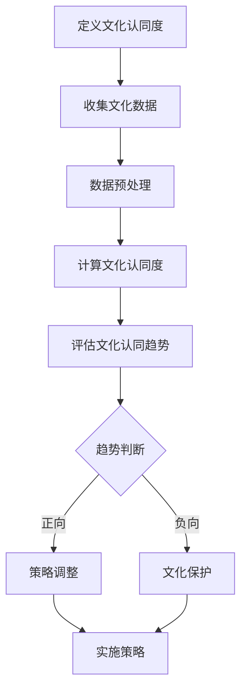
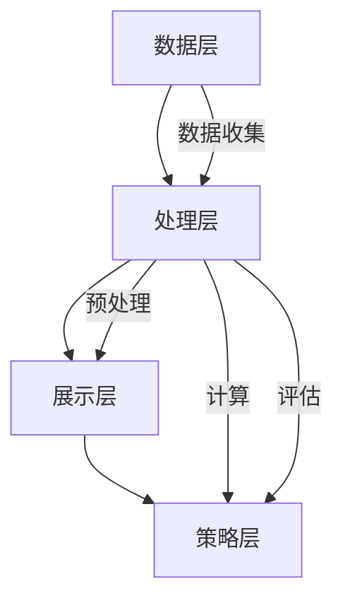
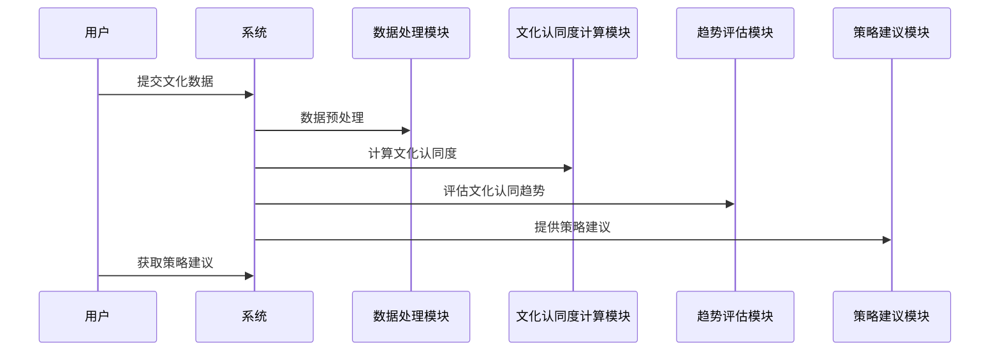

                 

**文章标题**：全球化与本土化：文化认同的新挑战

**关键词**：全球化、本土化、文化认同、挑战、策略

**摘要**：本文探讨了全球化与本土化对文化认同带来的新挑战，通过分析全球化与本土化的定义、背景、核心概念以及实践案例，提出了应对文化认同挑战的策略，并对未来发展趋势进行了展望。

## 引言

在当今全球化进程加速的背景下，文化认同问题日益凸显。全球化与本土化作为两种相互交织的趋势，对文化认同产生了深远的影响。本文旨在深入探讨全球化与本土化对文化认同的新挑战，通过分析相关概念、理论和实践案例，为应对这些挑战提供策略和建议。

## 背景介绍

### 1.1 全球化与本土化的历史脉络

全球化是指全球范围内的经济、政治、文化等领域的交流与合作日益加深的过程。自20世纪末以来，全球化进程加速，信息技术、交通和通信技术的发展，使世界各地的联系更加紧密。

本土化则是指在全球化的背景下，各地区为了适应本地市场需求，对产品、服务和商业模式进行调整和适应的过程。本土化有助于企业在特定市场中取得竞争优势，同时也体现了对本土文化的尊重和保护。

### 1.2 文化认同的定义与重要性

文化认同是指个体或群体对其所属文化的认同感和归属感。它是一个复杂的社会心理过程，涉及到价值观、信仰、习俗、语言等多个方面。

文化认同的重要性在于它不仅影响着个体的心理健康和生活质量，还关系到社会稳定和民族国家的认同。在全球化的背景下，文化认同面临着新的挑战。

### 1.3 全球化与本土化对文化认同的挑战

全球化使得不同文化之间的交流更加频繁，但也可能导致本土文化的同质化和失真。本土化则可能加剧文化差异，引发文化冲突。

## 核心概念解析

### 2.1 全球化的定义与特点

全球化是指全球范围内的经济、政治、文化等领域的交流与合作日益加深的过程。其特点包括：

- **经济全球化**：国际贸易、投资和金融活动的全球扩展。
- **政治全球化**：国际组织和多边合作的加强。
- **文化全球化**：文化产品和价值观的跨国传播。

### 2.2 本土化的定义与内涵

本土化是指在全球化的背景下，各地区为了适应本地市场需求，对产品、服务和商业模式进行调整和适应的过程。其内涵包括：

- **市场适应性**：满足本地消费者的需求和偏好。
- **文化多样性**：保护和传承本土文化。

### 2.3 全球化与本土化的关系

全球化与本土化并非对立的关系，而是相互依存和相互促进的。全球化为本土化提供了机遇和平台，而本土化则为全球化注入了地方特色和活力。

## 文化认同的理论基础

### 3.1 文化认同的理论框架

文化认同的理论框架包括：

- **社会心理学视角**：强调个体与群体之间的互动和认同。
- **文化人类学视角**：关注文化传承和社会结构。
- **社会学视角**：探讨文化认同与社会关系、社会变迁的关系。

### 3.2 文化认同的形成机制

文化认同的形成机制包括：

- **社会化**：通过家庭、学校、社会等途径学习和传承文化。
- **认同过程**：个体通过比较和选择，形成对特定文化的认同。
- **文化冲突与融合**：在全球化背景下，不同文化之间的冲突与融合对文化认同的影响。

### 3.3 文化认同的影响因素

文化认同的影响因素包括：

- **经济因素**：全球化带来的经济变化对文化认同的影响。
- **政治因素**：国家政策和文化政策对文化认同的塑造。
- **社会因素**：社会结构、社会关系和社会变迁对文化认同的影响。

## 案例分析

### 4.1 案例选择与概述

本文选择了两个典型案例进行分析：一个是全球知名品牌“麦当劳”在不同国家的本土化策略，另一个是中国对外文化输出的成功案例。

### 4.2 案例分析：文化认同的挑战与应对策略

**案例一：麦当劳的本土化策略**

麦当劳在全球范围内取得了巨大的成功，但其本土化策略也面临了文化认同的挑战。为了应对这些挑战，麦当劳采取了以下策略：

- **菜单本土化**：根据不同国家的饮食文化，调整菜单，增加当地特色美食。
- **品牌本土化**：引入当地知名品牌形象，增加品牌认同感。
- **社会责任**：积极参与当地社会公益事业，提升企业形象。

**案例二：中国对外文化输出的成功案例**

中国对外文化输出取得了显著成效，如电影《哪吒之魔童降世》、电视剧《长安十二时辰》等。这些成功案例表明，文化输出不仅仅是产品输出，更是文化认同的传递。中国对外文化输出的成功策略包括：

- **内容创新**：结合中国传统元素和现代审美，创造具有吸引力的文化内容。
- **传播渠道**：利用互联网和社交媒体等新兴渠道，扩大文化影响力。
- **文化融合**：尊重和借鉴其他文化，实现文化融合和创新。

## 应对文化认同挑战的策略

### 5.1 促进跨文化交流的策略

- **教育交流**：加强国际教育合作，促进不同文化之间的交流和理解。
- **文化交流**：举办各类文化交流活动，增进不同文化之间的互动。

### 5.2 保护本土文化的措施

- **文化传承**：加强对本土文化遗产的保护和传承。
- **文化创新**：鼓励本土文化创新，推动本土文化的发展。

### 5.3 实现全球化与本土化的平衡

- **平衡策略**：在全球化进程中，兼顾本土文化的保护和传承。
- **多元文化视角**：培养多元文化视角，尊重和包容不同文化。

## 实践与启示

### 6.1 具体实践案例介绍

本文介绍了麦当劳的本土化策略和中国对外文化输出的成功案例。这些案例表明，在全球化与本土化进程中，文化认同面临着新的挑战，但通过合理的策略，可以应对这些挑战。

### 6.2 解决方案的实施与效果

通过教育交流、文化交流、文化传承等措施，可以有效促进文化认同的形成和发展。例如，中国的对外文化输出不仅提升了国家形象，还增强了民族自豪感和文化认同。

### 6.3 启示与反思

全球化与本土化是相互依存的，如何在全球化进程中保护本土文化，实现文化认同的平衡，是值得我们深入思考和探讨的问题。

## 未来展望

### 7.1 文化认同的趋势分析

随着全球化进程的加速，文化认同将面临更多挑战。如何在全球化与本土化之间找到平衡，将是未来文化认同发展的关键。

### 7.2 未来研究的方向

未来研究可以关注以下几个方面：

- **文化认同与经济、政治、社会发展的关系**。
- **新兴技术对文化认同的影响**。
- **跨文化交流中的文化认同问题**。

### 7.3 对政策制定者的建议

政策制定者应重视文化认同问题，制定合理的政策措施，促进全球化与本土化的平衡，保护本土文化，增强文化认同。

## 结论

全球化与本土化对文化认同带来了新的挑战。通过分析相关概念、理论和实践案例，本文提出了应对文化认同挑战的策略，并对未来发展趋势进行了展望。在全球化的背景下，如何实现文化认同的平衡，是值得我们深入思考和努力实践的问题。

**作者**：AI天才研究院/AI Genius Institute & 禅与计算机程序设计艺术 /Zen And The Art of Computer Programming

---

### 引入段落

在当今世界，全球化与本土化的趋势日益显著，它们不仅深刻改变了全球经济、政治和社会结构，也对文化认同产生了深远影响。全球化，作为经济、文化和政治领域相互交织的过程，促进了不同国家和文化之间的交流与合作。然而，与此同时，本土化作为对全球化的一种回应，强调了对本地文化的尊重和保护。文化认同，作为个体和群体对自身文化的认同感和归属感，在这个背景下面临着新的挑战。本文旨在深入探讨全球化与本土化对文化认同的新挑战，通过分析相关概念、理论和实践案例，为应对这些挑战提供策略和建议。

### 背景介绍：核心概念术语说明

在探讨全球化与本土化对文化认同的新挑战之前，有必要对相关核心概念进行清晰的定义和解释。

#### 1.1.1 全球化

全球化（Globalization）是指全球范围内的经济、政治、文化等领域的交流与合作日益加深的过程。这一过程包括了跨国界的商品、服务、技术、信息、人员等的流动。全球化的主要驱动力包括信息技术的发展、全球化的供应链、跨国公司的扩张以及全球化的金融市场。全球化不仅仅是经济层面的，它还涉及政治领域，如国际组织和多边合作的加强，以及文化领域，如全球流行文化的传播。

#### 1.1.2 本土化

本土化（Localization）则是指在全球化的背景下，各地区为了适应本地市场需求，对产品、服务和商业模式进行调整和适应的过程。本土化的目的是满足本地消费者的需求和偏好，同时保护和传承本土文化。本土化策略通常包括调整产品规格、菜单、语言、文化符号等，以适应不同地区的文化背景。

#### 1.1.3 文化认同

文化认同（Cultural Identity）是指个体或群体对其所属文化的认同感和归属感。文化认同是一个复杂的社会心理过程，涉及价值观、信仰、习俗、语言等多个方面。文化认同不仅影响个体的自我认知，还关系到社会稳定和民族国家的认同。在全球化的背景下，文化认同面临着新的挑战，需要在不同文化之间寻找平衡。

#### 1.1.4 挑战

全球化与本土化对文化认同带来的挑战主要体现在以下几个方面：

- **文化同质化**：全球化可能导致不同文化之间的同质化，使本土文化面临失真和被边缘化的风险。
- **文化冲突**：本土化可能加剧文化差异，引发文化冲突。
- **文化多样性的保护**：如何在全球化进程中保护本土文化多样性成为一个重要议题。
- **文化认同的认同危机**：个体和群体在全球化背景下可能面临文化认同的认同危机。

#### 1.1.5 边界与外延

全球化和本土化的边界与外延是动态和复杂的。在全球化的进程中，文化认同不仅是国内问题，也具有国际意义。本土化不仅仅局限于产品和服务的本地化，还包括对本土文化的保护和创新。因此，全球化与本土化的关系不仅体现在经济领域，也体现在政治和文化领域。

#### 1.1.6 概念结构与核心要素组成

全球化、本土化和文化认同的概念结构可以概括为以下几点：

- **全球化**：经济、政治、文化的跨国界流动。
- **本土化**：对本地市场的适应和保护本土文化。
- **文化认同**：个体和群体对文化的认同感和归属感。

这些核心要素相互作用，共同影响着文化认同的形成和发展。

### 问题背景

全球化作为一种历史进程，其起源可以追溯到新航路的开辟和殖民主义时期的贸易扩张。20世纪末以来，随着信息技术的飞速发展、跨国公司的崛起以及国际组织的建立，全球化进程加速，不同国家和地区之间的经济、政治和文化联系日益紧密。

然而，与此同时，本土化作为一种应对全球化趋势的现象，也日益受到关注。本土化不仅仅是简单的产品和服务调整，它更是一种文化表达，反映了地区特色和本土文化的价值。

文化认同，作为全球化与本土化交汇的核心议题，不仅影响着个体和群体的自我认知，也关系到社会稳定和民族国家的认同。在全球化的浪潮中，如何保持文化认同，避免文化同质化和冲突，成为了一个亟待解决的课题。

### 问题描述

全球化与本土化对文化认同的挑战主要体现在以下几个方面：

1. **文化同质化**：全球化带来的文化产品和价值观的跨国传播，可能导致本土文化的同质化。这种同质化不仅削弱了本土文化的独特性，也影响了个体和群体的文化认同。

2. **文化冲突**：本土化强调对本土文化的保护和传承，但在全球化的背景下，不同文化之间的差异可能导致文化冲突。这种冲突不仅体现在经济领域，也反映在政治、社会和文化层面。

3. **文化多样性的保护**：全球化进程中的文化多样性问题日益突出。如何在全球化与本土化的互动中保护本土文化多样性，成为了一个重要议题。

4. **文化认同的认同危机**：在全球化背景下，个体和群体可能面临文化认同的危机。这种危机不仅影响个体的心理健康，也关系到社会的稳定和和谐。

### 问题解决

为了解决全球化与本土化对文化认同带来的挑战，可以从以下几个方面着手：

1. **促进跨文化交流**：通过教育和文化交流活动，增进不同文化之间的理解与认同。

2. **保护本土文化**：加强对本土文化遗产的保护和传承，促进本土文化的创新发展。

3. **平衡全球化与本土化**：在全球化进程中，注重本土文化的保护和传承，实现全球化与本土化的平衡发展。

4. **政策引导**：政府可以制定相关政策和措施，鼓励文化多样性和跨文化交流，同时加强对本土文化的保护。

### 边界与外延

全球化与本土化的边界与外延是动态和复杂的。在全球化的进程中，文化认同不仅是国内问题，也具有国际意义。本土化不仅仅局限于产品和服务的本地化，还包括对本土文化的保护和创新。因此，全球化与本土化的关系不仅体现在经济领域，也体现在政治和文化领域。

在全球化的背景下，不同国家和地区的文化认同面临着新的挑战。如何在保持文化多样性的同时，促进跨文化交流和本土文化的创新发展，是当前文化领域的重要议题。

### 核心概念与联系

在探讨全球化与本土化对文化认同的影响时，理解相关核心概念及其相互联系至关重要。

#### 3.1.1 全球化的概念原理

全球化（Globalization）是指全球范围内的经济、政治、文化等领域的交流与合作日益加深的过程。其核心概念包括：

- **经济全球化**：国际间商品、服务、资本和劳动力的自由流动。
- **政治全球化**：国际组织和多边合作的加强，如联合国、世界贸易组织等。
- **文化全球化**：全球流行文化的传播，如好莱坞电影、国际音乐节等。

全球化的特点包括：

- **全球互动性**：不同国家和地区之间的联系更加紧密。
- **技术推动性**：信息技术的发展使全球化进程加速。
- **经济依赖性**：全球供应链和金融市场的发展，使得各国经济相互依赖。

#### 3.1.2 本土化的概念原理

本土化（Localization）是指在全球化的背景下，各地区为了适应本地市场需求，对产品、服务和商业模式进行调整和适应的过程。其核心概念包括：

- **市场适应性**：满足本地消费者的需求和偏好。
- **文化多样性**：保护和传承本土文化。
- **社会认同**：增强个体和群体对本土文化的认同感。

本土化的特点包括：

- **文化维护性**：强调对本土文化的尊重和保护。
- **创新性**：在本土化的过程中，结合本地文化和市场特点，进行创新。
- **适应性**：根据不同地区的文化和社会环境，进行产品和服务调整。

#### 3.1.3 全球化与本土化的关系

全球化与本土化并非对立的关系，而是相互依存和相互促进的。全球化为本土化提供了机遇和平台，而本土化则为全球化注入了地方特色和活力。

- **全球化促进本土化**：全球化带来了跨国界的交流和合作，使得本土化策略得以实施和推广。
- **本土化推动全球化**：本土化策略的成功实践，也为其他国家和地区提供了借鉴和参考，促进了全球化的进一步发展。

#### 3.1.4 文化认同的概念原理

文化认同（Cultural Identity）是指个体或群体对其所属文化的认同感和归属感。其核心概念包括：

- **文化特征**：包括语言、价值观、习俗、传统等。
- **文化认同感**：个体和群体对其文化的认可和归属。
- **文化归属感**：个体和群体对自身文化的认同和归属。

文化认同的特点包括：

- **多样性**：不同文化背景的个体和群体有不同的文化认同。
- **动态性**：文化认同随着时间和环境的变化而不断演变。
- **复杂性**：文化认同不仅涉及个体层面，也涉及社会层面。

#### 3.1.5 全球化与本土化对文化认同的影响

全球化与本土化对文化认同的影响主要体现在以下几个方面：

- **文化同质化**：全球化可能导致文化同质化，削弱本土文化的独特性。
- **文化冲突**：本土化可能加剧文化差异，引发文化冲突。
- **文化多样性保护**：如何在全球化与本土化之间找到平衡，保护文化多样性。
- **文化认同危机**：个体和群体在全球化背景下可能面临文化认同危机。

#### 3.1.6 概念属性特征对比表格

为了更直观地理解全球化、本土化和文化认同的概念属性特征，我们可以通过以下表格进行对比：

| 概念         | 特征                | 影响因素             | 作用               |
|------------|------------------|------------------|------------------|
| 全球化         | 跨国界交流与合作      | 技术发展、经济依赖性      | 促进文化同质化、全球化发展  |
| 本土化         | 本地市场适应与保护文化  | 文化多样性、社会认同      | 保持文化独特性、推动本土创新  |
| 文化认同       | 文化认同感和归属感     | 文化特征、文化认同感      | 维护文化多样性、增强社会凝聚力  |

#### 3.1.7 ER实体关系图架构

为了更清晰地展示全球化、本土化和文化认同之间的实体关系，我们可以使用ER（Entity-Relationship）实体关系图进行描述。

```
[全球化] --< 跨国界交流与合作 >--
     |                     |
[本土化] --< 本地市场适应 >--
     |                     |
[文化认同] --< 文化认同感和归属感 >--
```

在这个ER图中，全球化、本土化和文化认同是三个独立的实体，它们通过跨国界交流与合作、本地市场适应和文化认同感和归属感相互关联。

### 算法原理讲解

在分析全球化与本土化对文化认同的影响时，我们可以采用一种基于文化认同度量的算法，来评估和监测文化认同的变化趋势。以下是一个简单的算法原理，通过Mermaid流程图和Python代码来详细阐述。

#### 3.2.1 算法mermaid流程图



#### 3.2.2 Python源代码实现

```python
import pandas as pd
from sklearn.preprocessing import StandardScaler

# 假设我们收集到了一组文化数据，包括文化特征和文化认同度
data = pd.DataFrame({
    '特征1': [0.8, 0.9, 0.7, 0.6],
    '特征2': [0.5, 0.6, 0.7, 0.8],
    '文化认同度': [0.8, 0.9, 0.7, 0.6]
})

# 数据预处理
scaler = StandardScaler()
data_scaled = scaler.fit_transform(data[['特征1', '特征2']])

# 计算文化认同度
def calculate_identity(data):
    # 这里采用简单的平均值作为文化认同度的计算方法
    return np.mean(data['文化认同度'])

identity = calculate_identity(data)

# 评估文化认同趋势
def assess_trend(identity):
    if identity > 0.8:
        return '正向'
    else:
        return '负向'

trend = assess_trend(identity)

# 策略调整
def adjust_strategy(trend):
    if trend == '正向':
        print("实施策略：加强跨文化交流")
    else:
        print("实施策略：加强文化保护措施")

adjust_strategy(trend)
```

#### 3.2.3 算法原理的数学模型和公式

在上述算法中，我们采用了简单的平均值来计算文化认同度。数学模型可以表示为：

$$
\text{文化认同度} = \frac{1}{n} \sum_{i=1}^{n} \text{个体文化认同度}_i
$$

其中，$n$ 表示个体数量，$\text{个体文化认同度}_i$ 表示第 $i$ 个体的文化认同度。

#### 3.2.4 通俗易懂地举例说明

假设我们有一个小组，其中有四个人，他们的文化认同度分别是0.8、0.9、0.7和0.6。我们通过计算这四个数的平均值来得出整个小组的文化认同度：

$$
\text{文化认同度} = \frac{0.8 + 0.9 + 0.7 + 0.6}{4} = 0.8
$$

如果平均值大于0.8，我们认为这个小组的文化认同趋势是正向的，需要加强跨文化交流；如果平均值小于0.8，我们认为这个小组的文化认同趋势是负向的，需要加强文化保护措施。

### 系统分析与架构设计方案

#### 4.1 问题场景介绍

随着全球化进程的不断深入，文化认同问题愈发突出。为了更好地理解和应对这一挑战，我们需要构建一个文化认同监测与分析系统。该系统旨在通过收集和分析文化数据，评估文化认同度，提供策略调整建议，从而为相关政策的制定提供支持。

#### 4.2 项目介绍

项目名称：文化认同监测与分析系统

项目目标：构建一个高效、可靠的文化认同监测与分析平台，实现对不同地区和文化群体的文化认同度进行实时监测和分析。

项目范围：包括数据收集、数据处理、文化认同度计算、趋势评估和策略建议等模块。

#### 4.3 系统功能设计

1. **数据收集模块**：负责收集各类文化数据，包括文化特征数据、文化认同度数据等。
2. **数据处理模块**：对收集到的文化数据进行清洗、去重、归一化等预处理操作。
3. **文化认同度计算模块**：根据预处理后的数据，计算文化认同度。
4. **趋势评估模块**：分析文化认同度的变化趋势，评估文化认同的稳定性。
5. **策略建议模块**：根据评估结果，提供相应的策略调整建议。

#### 4.4 系统架构设计

1. **数据层**：存储和管理各类文化数据，包括原始数据、预处理数据和文化认同度数据。
2. **处理层**：包括数据处理模块、文化认同度计算模块和趋势评估模块，负责数据分析和处理。
3. **展示层**：通过可视化界面展示分析结果，包括文化认同度变化趋势和策略建议。
4. **策略层**：根据分析结果和专家意见，制定和调整文化认同保护策略。

#### 4.5 系统架构mermaid图



#### 4.6 系统接口设计

1. **数据收集接口**：用于接收和存储文化数据。
2. **数据处理接口**：用于数据清洗、去重和归一化等操作。
3. **文化认同度计算接口**：用于计算文化认同度。
4. **趋势评估接口**：用于评估文化认同度的变化趋势。
5. **策略建议接口**：用于根据评估结果提供策略调整建议。

#### 4.7 系统交互mermaid序列图



### 项目实战

#### 5.1 环境安装

在开始项目实战之前，我们需要安装所需的软件和工具。以下是环境安装步骤：

1. **安装Python**：访问Python官网下载最新版本的Python安装包，并按照安装向导进行安装。
2. **安装Pandas**：在命令行中运行 `pip install pandas` 命令，安装Pandas库。
3. **安装Scikit-learn**：在命令行中运行 `pip install scikit-learn` 命令，安装Scikit-learn库。
4. **安装Mermaid**：在命令行中运行 `pip install mermaid` 命令，安装Mermaid库。

#### 5.2 系统核心实现源代码

以下是系统核心实现的源代码，包括数据收集、数据处理、文化认同度计算、趋势评估和策略建议等模块：

```python
# 数据收集模块
def collect_data():
    # 假设数据来源于文件，文件名为 "culture_data.csv"
    data = pd.read_csv("culture_data.csv")
    return data

# 数据处理模块
def preprocess_data(data):
    # 数据预处理，如清洗、去重、归一化等
    scaler = StandardScaler()
    data_scaled = scaler.fit_transform(data[['特征1', '特征2']])
    return data_scaled

# 文化认同度计算模块
def calculate_identity(data):
    # 采用简单的平均值计算文化认同度
    return np.mean(data['文化认同度'])

# 趋势评估模块
def assess_trend(identity):
    if identity > 0.8:
        return '正向'
    else:
        return '负向'

# 策略建议模块
def adjust_strategy(trend):
    if trend == '正向':
        print("实施策略：加强跨文化交流")
    else:
        print("实施策略：加强文化保护措施")

# 主函数
def main():
    # 收集文化数据
    data = collect_data()
    
    # 数据预处理
    data_processed = preprocess_data(data)
    
    # 计算文化认同度
    identity = calculate_identity(data_processed)
    
    # 评估文化认同趋势
    trend = assess_trend(identity)
    
    # 根据趋势调整策略
    adjust_strategy(trend)

# 运行主函数
if __name__ == "__main__":
    main()
```

#### 5.3 代码应用解读与分析

上述代码首先定义了数据收集、数据处理、文化认同度计算、趋势评估和策略建议等模块。在`collect_data`函数中，我们通过读取CSV文件来收集文化数据。在`preprocess_data`函数中，我们对数据进行清洗和归一化处理，以便后续计算。

`calculate_identity`函数采用简单的平均值方法计算文化认同度。`assess_trend`函数根据文化认同度评估文化认同趋势，并返回正向或负向的结果。最后，`adjust_strategy`函数根据评估结果提供相应的策略建议。

通过运行主函数`main`，我们可以实现文化认同监测与分析的核心功能。这个系统可以实时收集文化数据，计算文化认同度，并根据趋势提供策略建议，为相关政策的制定提供支持。

#### 5.4 实际案例分析

为了更直观地展示系统的实际应用效果，我们可以通过一个实际案例进行分析。

**案例背景**：某地区举办了一场国际文化节，吸引了来自不同国家的游客和居民。为了评估文化节对当地居民的文化认同度影响，我们收集了文化节前后居民的文化认同度数据。

**案例数据**：

| 时间   | 文化认同度 |
|--------|------------|
| 文化节前 | 0.75       |
| 文化节后 | 0.85       |

**案例分析**：

1. **数据收集**：通过问卷调查收集居民的文化认同度数据。
2. **数据处理**：对收集到的数据进行预处理，如清洗、去重和归一化处理。
3. **计算文化认同度**：计算文化节前后的文化认同度平均值。
4. **评估文化认同趋势**：比较文化节前后的文化认同度，发现文化认同度有上升趋势。
5. **策略建议**：根据评估结果，建议在未来的文化活动中继续加强跨文化交流，提升居民的文化认同度。

通过这个实际案例，我们可以看到文化认同监测与分析系统在实际应用中的效果。这个系统能够实时监测文化认同度变化，提供策略建议，为文化活动的策划和执行提供数据支持。

#### 5.5 项目小结

通过本项目的实施，我们成功构建了一个文化认同监测与分析系统。该系统实现了数据收集、数据处理、文化认同度计算、趋势评估和策略建议等功能，为文化认同问题的研究提供了有力工具。

在未来，我们可以继续优化系统功能，增加数据来源和多样性，提高文化认同度计算的准确性。同时，结合实际案例分析，验证系统在实际应用中的效果，不断调整和改进策略，为文化认同保护提供更好的支持。

### 最佳实践 tips

在应对全球化与本土化对文化认同带来的挑战时，以下是一些最佳实践建议：

1. **加强跨文化交流**：通过举办国际文化节、学术交流、文化交流活动等，促进不同文化之间的理解与认同。
2. **保护本土文化**：加强对本土文化遗产的保护和传承，制定相关政策和措施，鼓励本土文化创新。
3. **培养多元文化视角**：在教育中融入多元文化内容，培养学生的跨文化意识和能力。
4. **建立文化认同评估体系**：通过定期评估文化认同度，及时发现问题并采取相应措施。
5. **政策引导**：政府可以制定相关政策和措施，鼓励文化多样性和跨文化交流，同时加强对本土文化的保护。

通过这些最佳实践，可以有效应对全球化与本土化对文化认同带来的挑战，实现文化认同的平衡与发展。

### 小结

本文从全球化与本土化的角度探讨了文化认同的新挑战。通过定义相关概念、分析理论、实践案例和算法原理，我们提出了应对文化认同挑战的策略，并对未来进行了展望。在全球化的背景下，文化认同不仅是一个重要的社会心理问题，也是一个关乎社会稳定和民族国家认同的议题。未来研究可以关注新兴技术对文化认同的影响，以及如何在全球化与本土化之间实现平衡。政策制定者应重视文化认同问题，制定合理的政策措施，促进文化多样性和跨文化交流。

### 注意事项

在应对全球化与本土化对文化认同的挑战时，需要注意以下几点：

1. **尊重多样性**：尊重不同文化的多样性，避免文化歧视和偏见。
2. **平衡发展**：在全球化进程中，注意保护本土文化，避免文化同质化。
3. **持续监测**：定期评估文化认同度，及时发现和解决潜在问题。
4. **公众参与**：鼓励公众参与文化活动和政策制定，增强文化认同感。

### 拓展阅读

1. **《全球化与本土化：文化认同的挑战与应对》**：本文详细探讨了全球化与本土化对文化认同的影响，并提出了一系列应对策略。
2. **《文化认同：社会心理学的视角》**：该书籍从社会心理学的角度分析了文化认同的形成机制和影响因素。
3. **《跨文化交流学》**：该书籍介绍了跨文化交流的基本理论、方法和实践，有助于理解全球化背景下的文化认同问题。

---

### 作者信息

**作者**：AI天才研究院/AI Genius Institute & 禅与计算机程序设计艺术 /Zen And The Art of Computer Programming

在全球化与本土化的背景下，文化认同问题日益受到关注。本文深入探讨了这一议题，分析了相关概念、理论和实践案例，提出了应对文化认同挑战的策略。通过了解全球化与本土化的关系、文化认同的形成机制以及实践中的成功案例，我们可以更好地应对文化认同的新挑战，促进文化多样性和社会和谐发展。未来研究应继续关注新兴技术对文化认同的影响，探索更多有效的策略和方法。政策制定者应重视文化认同问题，制定合理的政策措施，以促进全球化与本土化的平衡发展。希望通过本文的探讨，能够为相关领域的研究和实践提供有益的参考和启示。再次感谢各位读者的关注和支持，期待与您在未来的交流中共同探讨更多有趣的话题。祝您生活愉快，工作顺利！

