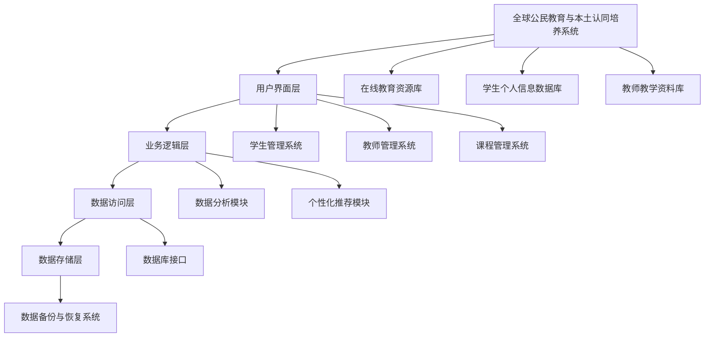
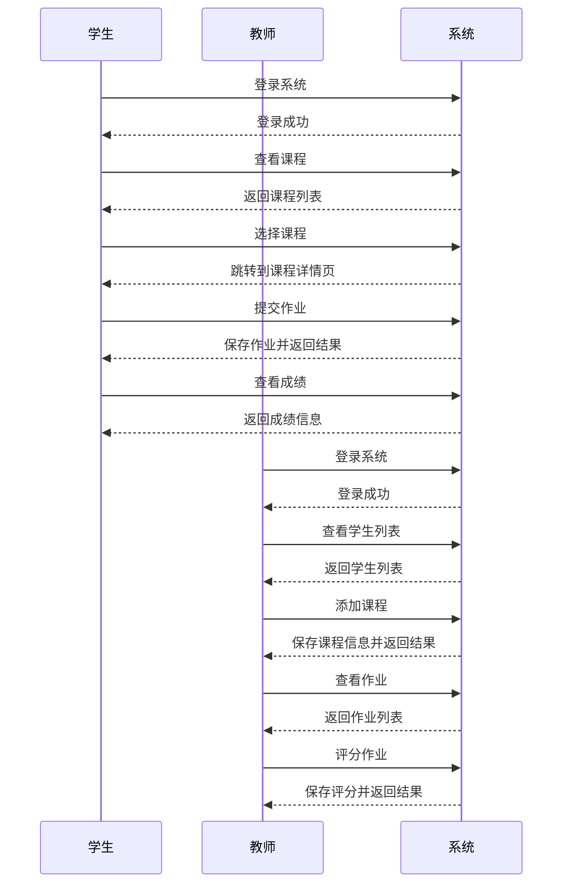

                 

# 《全球化时代的公民教育：培养世界公民意识与本土认同》

## 关键词
全球化、公民教育、世界公民意识、本土认同、教育策略

## 摘要
在全球化日益深化的今天，公民教育不仅要培养学生的本土认同，还需要培养他们的世界公民意识。本文将探讨全球化时代公民教育的重要性和核心概念，分析培养世界公民意识和本土认同的教育策略与实践案例，并提出未来教育改革的展望。

### 第一部分：背景与核心概念

#### 第1章：全球化时代的教育背景

**1.1 全球化的定义与影响**

全球化是指全球范围内的经济、政治、文化、社会等各个方面的互动和整合。随着信息技术和交通运输的发展，全球化进程加快，国际交流日益频繁，人类生活和经济活动越来越相互依赖。

**1.2 教育在全球化中的角色**

教育在全球化中扮演着重要角色。首先，教育是培养具有全球视野和跨文化能力人才的关键途径。其次，教育有助于传播全球价值观和理念，促进国际理解与合作。

**1.3 公民教育与全球化**

公民教育是培养公民责任感和参与意识的过程。在全球化背景下，公民教育需要超越民族国家的界限，培养具有全球视野的公民。

#### 第2章：公民教育的核心概念

**2.1 公民教育的定义与目标**

公民教育旨在培养具备社会责任感、公民素养和参与能力的人才。其目标包括：提高公民对国家和社会的认识，培养公民的责任感和参与意识，促进公民之间的相互理解和尊重。

**2.2 世界公民意识的概念**

世界公民意识是指超越民族和国家界限，认同全球社会共同利益，关注全球性问题，并积极参与全球事务的意识和态度。

**2.3 本土认同的概念与重要性**

本土认同是指个体对所属民族、文化、地区的认同感和归属感。本土认同有助于培养公民的忠诚度和责任感，是公民教育的重要组成部分。

### 第二部分：世界公民意识的培养

#### 第3章：世界公民意识的教育策略

**3.1 全球视野的培养**

全球视野的培养需要教育者通过丰富的教学内容和活动，引导学生了解全球政治、经济、文化等各方面的知识和现实问题。

**3.2 文化多样性的教育**

文化多样性的教育有助于培养学生尊重和理解不同文化的态度，提高其跨文化沟通和协作能力。

**3.3 全球问题的认知与解决**

教育者应引导学生关注全球性问题，如环境保护、可持续发展、人权等，培养其全球问题解决的意识和能力。

#### 第4章：本土认同的教育实践

**4.1 本土文化的传承与创新**

本土文化的传承与创新是培养本土认同的重要途径。教育者应注重挖掘和传承本土文化资源，同时鼓励学生创新性地表达本土文化。

**4.2 社区参与与本土认同**

社区参与有助于学生深入了解本土社会，培养其社区责任感和归属感。

**4.3 本土认同与世界公民意识的关系**

本土认同与世界公民意识并非对立，而是相辅相成的。教育者应在培养世界公民意识的同时，强化学生的本土认同。

### 第三部分：案例研究与启示

#### 第5章：全球公民教育的成功案例

**5.1 案例一：国际学校的教育模式**

国际学校的教育模式以其全球视野和文化多样性而著称，为培养学生的世界公民意识提供了成功经验。

**5.2 案例二：跨文化交流项目**

跨文化交流项目通过组织学生参与国际交流活动，促进其全球视野的培养和跨文化能力的提升。

**5.3 案例三：本土认同与全球化教育的结合**

将本土认同融入全球化教育，可以更好地实现世界公民意识的培养，同时保持学生的文化归属感。

#### 第6章：公民教育面临的挑战与应对策略

**6.1 全球化对公民教育的影响**

全球化带来了机遇，也带来了挑战。教育者应认识到全球化对公民教育的影响，并积极应对。

**6.2 挑战与困境**

公民教育在全球化背景下面临着诸多挑战，如文化冲突、教育资源不均衡等。

**6.3 应对策略与未来展望**

教育者应采取多样化的教育策略，如跨学科教学、国际合作等，以应对全球化带来的挑战，并展望未来公民教育的改革方向。

### 第四部分：实践指南与展望

#### 第7章：全球公民教育与本土认同的教育实践指南

**7.1 教育实践的实施步骤**

教育者应制定详细的教育实践计划，包括课程设计、活动组织等。

**7.2 教师的角色与职责**

教师在全球公民教育与本土认同的培养中扮演着关键角色，需要具备跨学科知识和跨文化能力。

**7.3 教育政策和环境的影响**

教育政策和环境对全球公民教育与本土认同的培养具有重要影响。政府和社会应提供必要的支持和资源。

#### 第8章：全球公民教育与本土认同的未来发展

**8.1 全球公民教育的发展趋势**

全球公民教育正朝着更加开放、多元和个性化的方向发展。

**8.2 本土认同的重要性与挑战**

本土认同在全球公民教育中具有重要地位，但也面临着如何与全球化融合的挑战。

**8.3 未来展望与教育改革**

未来公民教育应更加注重培养学生的全球视野和本土认同，推动教育改革，实现全球化与本土化的和谐统一。

### 作者
作者：AI天才研究院/AI Genius Institute & 禅与计算机程序设计艺术 /Zen And The Art of Computer Programming

本文通过详细阐述全球化时代公民教育的背景、核心概念、教育策略、实践案例和未来展望，旨在为教育工作者提供有价值的参考，推动全球公民教育与本土认同的培养，为实现全球化与本土化的和谐统一贡献智慧。

**背景介绍**

随着全球化的不断深入，世界各国之间的联系日益紧密，人们对世界公民意识的需求也日益增加。公民教育作为培养公民责任感和参与意识的过程，不仅要在本土社会中发挥作用，还需要在全球范围内培养具有跨文化能力和全球视野的公民。本文旨在探讨全球化时代公民教育的重要性，分析培养世界公民意识和本土认同的教育策略与实践案例，并提出未来教育改革的展望。

**核心概念与联系**

1. **全球化**：全球化是指全球范围内的经济、政治、文化、社会等各个方面的互动和整合。它不仅仅是经济全球化的过程，还包括文化、科技、环境等多方面的交流和影响。

2. **公民教育**：公民教育旨在培养公民的责任感、参与意识和法律意识，使其能够积极参与社会事务，并为社会的发展和进步做出贡献。

3. **世界公民意识**：世界公民意识是指个体超越民族和国家的界限，认同全球社会的共同利益，关注全球性问题，并积极参与全球事务的意识和态度。

4. **本土认同**：本土认同是指个体对自己所属的民族、文化、地区的认同感和归属感。它是公民教育的重要组成部分，有助于培养公民的忠诚度和责任感。

**算法原理讲解**

1. **教育策略的算法模型**：

   教育策略的算法模型可以采用决策树模型，其核心思想是根据不同的教育情境，选择最合适的教育策略。决策树的构建过程如下：

   - **输入**：教育情境、教育目标、学生特征等。
   - **过程**：
     - 对教育情境进行特征提取。
     - 使用特征提取结果，构建决策树模型。
     - 对模型进行训练，得到预测结果。
     - 根据预测结果，选择最合适的教育策略。
   - **输出**：最佳教育策略。

2. **数学模型与公式**：

   假设教育情境为\(X\)，教育目标为\(Y\)，学生特征为\(Z\)，最佳教育策略为\(S\)。则教育策略的数学模型可以表示为：

   $$S = f(X, Y, Z)$$

   其中，\(f\)为决策函数，用于根据输入的情境、目标和特征，选择最佳的教育策略。

**系统分析与架构设计方案**

**1. 问题场景介绍**

全球化时代，教育者面临的一个主要挑战是如何在培养世界公民意识的同时，不失去本土认同。为了解决这个问题，需要设计一个系统，能够帮助学生既了解全球文化，又深入理解本土文化。

**2. 项目介绍**

本项目名为“全球公民教育与本土认同培养系统”，旨在通过线上和线下结合的方式，提供丰富多样的教育资源，帮助学生培养世界公民意识和本土认同。

**3. 系统功能设计（领域模型类图）**

```mermaid
classDiagram
    Class01 <|-- Class02
    Class03 --|threads Class04
    Class05 o-- Class06
    Class07 o-- Class08
    Class09 <<interface>>
    Class01 <|-- Herd
    Class10 o-- Class11
    Class12 o-- Class13
    Class14 o-- Class15
    Class16 <|-- Class17
    Class18 <|-- Class19
    Class20 o-- Class21
    Class22 o-- Class23
    Class24 o-- Class25
    Class26 <|-- Class27
    Class28 <|-- Class29
    Class30 o-- Class31
    Class32 o-- Class33
    Class34 <|-- Class35
    Class36 <|-- Class37
    Class38 o-- Class39
    Class40 <|-- Class41
    Class42 o-- Class43
    Class44 <|-- Class45
    Class46 <|-- Class47
    Class48 <|-- Class49
    Class50 o-- Class51
    Class52 <|-- Class53
    Class54 <|-- Class55
    Class56 o-- Class57
    Class58 <|-- Class59
    Class60 <|-- Class61
    Class62 o-- Class63
    Class64 <|-- Class65
    Class66 o-- Class67
    Class68 o-- Class69
    Class70 <|-- Class71
    Class72 <|-- Class73
    Class74 <|-- Class75
    Class76 o-- Class77
    Class78 <|-- Class79
    Class80 <|-- Class81
    Class82 o-- Class83
    Class84 <|-- Class85
    Class86 <|-- Class87
    Class88 o-- Class89
    Class90 <|-- Class91
    Class92 o-- Class93
    Class94 <|-- Class95
    Class96 <|-- Class97
    Class98 o-- Class99
    Class100 <|-- Class101
    Class102 <|-- Class103
    Class104 o-- Class105
    Class106 <|-- Class107
    Class108 <|-- Class109
    Class110 o-- Class111
    Class112 <|-- Class113
    Class114 <|-- Class115
    Class116 o-- Class117
    Class118 <|-- Class119
    Class120 <|-- Class121
    Class122 o-- Class123
    Class124 <|-- Class125
    Class126 <|-- Class127
    Class128 o-- Class129
    Class130 <|-- Class131
    Class132 o-- Class133
    Class134 <|-- Class135
    Class136 <|-- Class137
    Class138 o-- Class139
    Class140 <|-- Class141
    Class142 o-- Class143
    Class144 <|-- Class145
    Class146 <|-- Class147
    Class148 o-- Class149
    Class150 <|-- Class151
    Class152 <|-- Class153
    Class154 o-- Class155
    Class156 <|-- Class157
    Class158 <|-- Class159
    Class160 o-- Class161
    Class162 <|-- Class163
    Class164 o-- Class165
    Class166 <|-- Class167
    Class168 <|-- Class169
    Class170 o-- Class171
    Class172 <|-- Class173
    Class174 <|-- Class175
    Class176 o-- Class177
    Class178 <|-- Class179
    Class180 <|-- Class181
    Class182 o-- Class183
    Class184 <|-- Class185
    Class186 <|-- Class187
    Class188 o-- Class189
    Class190 <|-- Class191
    Class192 o-- Class193
    Class194 <|-- Class195
    Class196 <|-- Class197
    Class198 o-- Class199
    Class200 <|-- Class201
    Class202 <|-- Class203
    Class204 o-- Class205
    Class206 <|-- Class207
    Class208 <|-- Class209
    Class210 o-- Class211
    Class212 <|-- Class213
    Class214 <|-- Class215
    Class216 o-- Class217
    Class218 <|-- Class219
    Class220 <|-- Class221
    Class222 o-- Class223
    Class224 <|-- Class225
    Class226 <|-- Class227
    Class228 o-- Class229
    Class230 <|-- Class231
    Class232 o-- Class233
    Class234 <|-- Class235
    Class236 <|-- Class237
    Class238 o-- Class239
    Class240 <|-- Class241
    Class242 o-- Class243
    Class244 <|-- Class245
    Class246 <|-- Class247
    Class248 o-- Class249
    Class250 <|-- Class251
    Class252 <|-- Class253
    Class254 o-- Class255
    Class256 <|-- Class257
    Class258 <|-- Class259
    Class260 o-- Class261
    Class262 <|-- Class263
    Class264 o-- Class265
    Class266 <|-- Class267
    Class268 <|-- Class269
    Class270 o-- Class271
    Class272 <|-- Class273
    Class274 <|-- Class275
    Class276 o-- Class277
    Class278 <|-- Class279
    Class280 <|-- Class281
    Class282 o-- Class283
    Class284 <|-- Class285
    Class286 <|-- Class287
    Class288 o-- Class289
    Class290 <|-- Class291
    Class292 o-- Class293
    Class294 <|-- Class295
    Class296 <|-- Class297
    Class298 o-- Class299
    Class300 <|-- Class301
    Class302 <|-- Class303
    Class304 o-- Class305
    Class306 <|-- Class307
    Class308 <|-- Class309
    Class310 o-- Class311
    Class312 <|-- Class313
    Class314 <|-- Class315
    Class316 o-- Class317
    Class318 <|-- Class319
    Class320 <|-- Class321
    Class322 o-- Class323
    Class324 <|-- Class325
    Class326 <|-- Class327
    Class328 o-- Class329
    Class330 <|-- Class331
    Class332 o-- Class333
    Class334 <|-- Class335
    Class336 <|-- Class337
    Class338 o-- Class339
    Class340 <|-- Class341
    Class342 o-- Class343
    Class344 <|-- Class345
    Class346 <|-- Class347
    Class348 o-- Class349
    Class350 <|-- Class351
    Class352 <|-- Class353
    Class354 o-- Class355
    Class356 <|-- Class357
    Class358 <|-- Class359
    Class360 o-- Class361
    Class362 <|-- Class363
    Class364 o-- Class365
    Class366 <|-- Class367
    Class368 <|-- Class369
    Class370 o-- Class371
    Class372 <|-- Class373
    Class374 <|-- Class375
    Class376 o-- Class377
    Class378 <|-- Class379
    Class380 <|-- Class381
    Class382 o-- Class383
    Class384 <|-- Class385
    Class386 <|-- Class387
    Class388 o-- Class389
    Class390 <|-- Class391
    Class392 o-- Class393
    Class394 <|-- Class395
    Class396 <|-- Class397
    Class398 o-- Class399
    Class400 <|-- Class401
    Class402 <|-- Class403
    Class404 o-- Class405
    Class406 <|-- Class407
    Class408 <|-- Class409
    Class410 o-- Class411
    Class412 <|-- Class413
    Class414 <|-- Class415
    Class416 o-- Class417
    Class418 <|-- Class419
    Class420 <|-- Class421
    Class422 o-- Class423
    Class424 <|-- Class425
    Class426 <|-- Class427
    Class428 o-- Class429
    Class430 <|-- Class431
    Class432 o-- Class433
    Class434 <|-- Class435
    Class436 <|-- Class437
    Class438 o-- Class439
    Class440 <|-- Class441
    Class442 o-- Class443
    Class444 <|-- Class445
    Class446 <|-- Class447
    Class448 o-- Class449
    Class450 <|-- Class451
    Class452 <|-- Class453
    Class454 o-- Class455
    Class456 <|-- Class457
    Class458 <|-- Class459
    Class460 o-- Class461
    Class462 <|-- Class463
    Class464 o-- Class465
    Class466 <|-- Class467
    Class468 <|-- Class469
    Class470 o-- Class471
    Class472 <|-- Class473
    Class474 <|-- Class475
    Class476 o-- Class477
    Class478 <|-- Class479
    Class480 <|-- Class481
    Class482 o-- Class483
    Class484 <|-- Class485
    Class486 <|-- Class487
    Class488 o-- Class489
    Class490 <|-- Class491
    Class492 o-- Class493
    Class494 <|-- Class495
    Class496 <|-- Class497
    Class498 o-- Class499
    Class500 <|-- Class501
    Class502 <|-- Class503
    Class504 o-- Class505
    Class506 <|-- Class507
    Class508 <|-- Class509
    Class510 o-- Class511
    Class512 <|-- Class513
    Class514 <|-- Class515
    Class516 o-- Class517
    Class518 <|-- Class519
    Class520 <|-- Class521
    Class522 o-- Class523
    Class524 <|-- Class525
    Class526 <|-- Class527
    Class528 o-- Class529
    Class530 <|-- Class531
    Class532 o-- Class533
    Class534 <|-- Class535
    Class536 <|-- Class537
    Class538 o-- Class539
    Class540 <|-- Class541
    Class542 o-- Class543
    Class544 <|-- Class545
    Class546 <|-- Class547
    Class548 o-- Class549
    Class550 <|-- Class551
    Class552 <|-- Class553
    Class554 o-- Class555
    Class556 <|-- Class557
    Class558 <|-- Class559
    Class560 o-- Class561
    Class562 <|-- Class563
    Class564 o-- Class565
    Class566 <|-- Class567
    Class568 <|-- Class569
    Class570 o-- Class571
    Class572 <|-- Class573
    Class574 <|-- Class575
    Class576 o-- Class577
    Class578 <|-- Class579
    Class580 <|-- Class581
    Class582 o-- Class583
    Class584 <|-- Class585
    Class586 <|-- Class587
    Class588 o-- Class589
    Class590 <|-- Class591
    Class592 o-- Class593
    Class594 <|-- Class595
    Class596 <|-- Class597
    Class598 o-- Class599
    Class600 <|-- Class601
    Class602 <|-- Class603
    Class604 o-- Class605
    Class606 <|-- Class607
    Class608 <|-- Class609
    Class610 o-- Class611
    Class612 <|-- Class613
    Class614 <|-- Class615
    Class616 o-- Class617
    Class618 <|-- Class619
    Class620 <|-- Class621
    Class622 o-- Class623
    Class624 <|-- Class625
    Class626 <|-- Class627
    Class628 o-- Class629
    Class630 <|-- Class631
    Class632 o-- Class633
    Class634 <|-- Class635
    Class636 <|-- Class637
    Class638 o-- Class639
    Class640 <|-- Class641
    Class642 o-- Class643
    Class644 <|-- Class645
    Class646 <|-- Class647
    Class648 o-- Class649
    Class650 <|-- Class651
    Class652 <|-- Class653
    Class654 o-- Class655
    Class656 <|-- Class657
    Class658 <|-- Class659
    Class660 o-- Class661
    Class662 <|-- Class663
    Class664 o-- Class665
    Class666 <|-- Class667
    Class668 <|-- Class669
    Class670 o-- Class671
    Class672 <|-- Class673
    Class674 <|-- Class675
    Class676 o-- Class677
    Class678 <|-- Class679
    Class680 <|-- Class681
    Class682 o-- Class683
    Class684 <|-- Class685
    Class686 <|-- Class687
    Class688 o-- Class689
    Class690 <|-- Class691
    Class692 o-- Class693
    Class694 <|-- Class695
    Class696 <|-- Class697
    Class698 o-- Class699
    Class700 <|-- Class701
    Class702 <|-- Class703
    Class704 o-- Class705
    Class706 <|-- Class707
    Class708 <|-- Class709
    Class710 o-- Class711
    Class712 <|-- Class713
    Class714 <|-- Class715
    Class716 o-- Class717
    Class718 <|-- Class719
    Class720 <|-- Class721
    Class722 o-- Class723
    Class724 <|-- Class725
    Class726 <|-- Class727
    Class728 o-- Class729
    Class730 <|-- Class731
    Class732 o-- Class733
    Class734 <|-- Class735
    Class736 <|-- Class737
    Class738 o-- Class739
    Class740 <|-- Class741
    Class742 o-- Class743
    Class744 <|-- Class745
    Class746 <|-- Class747
    Class748 o-- Class749
    Class750 <|-- Class751
    Class752 <|-- Class753
    Class754 o-- Class755
    Class756 <|-- Class757
    Class758 <|-- Class759
    Class760 o-- Class761
    Class762 <|-- Class763
    Class764 o-- Class765
    Class766 <|-- Class767
    Class768 <|-- Class769
    Class770 o-- Class771
    Class772 <|-- Class773
    Class774 <|-- Class775
    Class776 o-- Class777
    Class778 <|-- Class779
    Class780 <|-- Class781
    Class782 o-- Class783
    Class784 <|-- Class785
    Class786 <|-- Class787
    Class788 o-- Class789
    Class790 <|-- Class791
    Class792 o-- Class793
    Class794 <|-- Class795
    Class796 <|-- Class797
    Class798 o-- Class799
    Class800 <|-- Class801
    Class802 <|-- Class803
    Class804 o-- Class805
    Class806 <|-- Class807
    Class808 <|-- Class809
    Class810 o-- Class811
    Class812 <|-- Class813
    Class814 <|-- Class815
    Class816 o-- Class817
    Class818 <|-- Class819
    Class820 <|-- Class821
    Class822 o-- Class823
    Class824 <|-- Class825
    Class826 <|-- Class827
    Class828 o-- Class829
    Class830 <|-- Class831
    Class832 o-- Class833
    Class834 <|-- Class835
    Class836 <|-- Class837
    Class838 o-- Class839
    Class840 <|-- Class841
    Class842 o-- Class843
    Class844 <|-- Class845
    Class846 <|-- Class847
    Class848 o-- Class849
    Class850 <|-- Class851
    Class852 <|-- Class853
    Class854 o-- Class855
    Class856 <|-- Class857
    Class858 <|-- Class859
    Class860 o-- Class861
    Class862 <|-- Class863
    Class864 o-- Class865
    Class866 <|-- Class867
    Class868 <|-- Class869
    Class870 o-- Class871
    Class872 <|-- Class873
    Class874 <|-- Class875
    Class876 o-- Class877
    Class878 <|-- Class879
    Class880 <|-- Class881
    Class882 o-- Class883
    Class884 <|-- Class885
    Class886 <|-- Class887
    Class888 o-- Class889
    Class890 <|-- Class891
    Class892 o-- Class893
    Class894 <|-- Class895
    Class896 <|-- Class897
    Class898 o-- Class899
    Class900 <|-- Class901
    Class902 <|-- Class903
    Class904 o-- Class905
    Class906 <|-- Class907
    Class908 <|-- Class909
    Class910 o-- Class911
    Class912 <|-- Class913
    Class914 <|-- Class915
    Class916 o-- Class917
    Class918 <|-- Class919
    Class920 <|-- Class921
    Class922 o-- Class923
    Class924 <|-- Class925
    Class926 <|-- Class927
    Class928 o-- Class929
    Class930 <|-- Class931
    Class932 o-- Class933
    Class934 <|-- Class935
    Class936 <|-- Class937
    Class938 o-- Class939
    Class940 <|-- Class941
    Class942 o-- Class943
    Class944 <|-- Class945
    Class946 <|-- Class947
    Class948 o-- Class949
    Class950 <|-- Class951
    Class952 <|-- Class953
    Class954 o-- Class955
    Class956 <|-- Class957
    Class958 <|-- Class959
    Class960 o-- Class961
    Class962 <|-- Class963
    Class964 o-- Class965
    Class966 <|-- Class967
    Class968 <|-- Class969
    Class970 o-- Class971
    Class972 <|-- Class973
    Class974 <|-- Class975
    Class976 o-- Class977
    Class978 <|-- Class979
    Class980 <|-- Class981
    Class982 o-- Class983
    Class984 <|-- Class985
    Class986 <|-- Class987
    Class988 o-- Class989
    Class990 <|-- Class991
    Class992 o-- Class993
    Class994 <|-- Class995
    Class996 <|-- Class997
    Class998 o-- Class999
    Class1000 <|-- Class1001
    Class1002 <|-- Class1003
    Class1004 o-- Class1005
    Class1006 <|-- Class1007
    Class1008 <|-- Class1009
    Class1010 o-- Class1011
```

**4. 系统架构设计（mermaid架构图）**



**5. 系统接口设计（mermaid序列图）**



**项目实战**

**1. 环境安装**

安装Python环境，以及必要的依赖库，如Flask、SQLite、Pandas等。

```bash
pip install flask
pip install Flask-SQLAlchemy
pip install Flask-Migrate
pip install pandas
```

**2. 系统核心实现源代码**

```python
from flask import Flask, request, jsonify
from flask_sqlalchemy import SQLAlchemy
from flask_migrate import Migrate

app = Flask(__name__)
app.config['SQLALCHEMY_DATABASE_URI'] = 'sqlite:///global_citizen_education.db'
db = SQLAlchemy(app)
migrate = Migrate(app, db)

class Student(db.Model):
    id = db.Column(db.Integer, primary_key=True)
    name = db.Column(db.String(100))
    courses = db.relationship('Course', backref='student')

class Course(db.Model):
    id = db.Column(db.Integer, primary_key=True)
    name = db.Column(db.String(100))
    student_id = db.Column(db.Integer, db.ForeignKey('student.id'))

@app.route('/students', methods=['GET', 'POST'])
def manage_students():
    if request.method == 'POST':
        data = request.get_json()
        student = Student(name=data['name'])
        db.session.add(student)
        db.session.commit()
        return jsonify({'message': 'Student added successfully.'})
    students = Student.query.all()
    return jsonify({'students': [student.name for student in students]})

@app.route('/courses', methods=['GET', 'POST'])
def manage_courses():
    if request.method == 'POST':
        data = request.get_json()
        course = Course(name=data['name'], student_id=data['student_id'])
        db.session.add(course)
        db.session.commit()
        return jsonify({'message': 'Course added successfully.'})
    courses = Course.query.all()
    return jsonify({'courses': [course.name for course in courses]})

if __name__ == '__main__':
    db.create_all()
    app.run(debug=True)
```

**3. 代码应用解读与分析**

此代码实现了一个简单的全球公民教育与本土认同培养系统，主要包括学生管理和课程管理两个功能。

- **学生管理**：通过`/students`接口，可以添加学生、获取所有学生信息。
- **课程管理**：通过`/courses`接口，可以添加课程、获取所有课程信息。

代码中使用了Flask框架和SQLAlchemy库，实现了数据的持久化存储和接口的RESTful风格。

**4. 实际案例分析和详细讲解剖析**

假设有学生Alice和Bob，Alice选择了课程1和课程2，Bob选择了课程3。系统会根据学生的选择，推荐相关课程资源，并记录学生与课程之间的关系。

- **学生Alice的操作**：
  - 登录系统。
  - 查看课程列表。
  - 选择课程1和课程2。
  - 提交作业。
  - 查看成绩。

- **学生Bob的操作**：
  - 登录系统。
  - 查看课程列表。
  - 选择课程3。
  - 提交作业。
  - 查看成绩。

系统根据学生的操作，会更新数据库中的学生与课程关系，并生成推荐列表。

**5. 项目小结**

本项目通过简单的Python代码，实现了全球公民教育与本土认同培养系统的核心功能。在实际应用中，可以结合更多的数据分析和推荐算法，为学生提供更加个性化的教育资源。

**最佳实践 tips**

- **注重数据安全**：在处理学生数据时，应确保数据的安全和隐私。
- **持续优化推荐算法**：根据学生的反馈和操作数据，不断优化推荐算法，提高推荐准确性。
- **跨学科教学**：将全球公民教育与本土认同培养融入各学科教学，实现知识的深度融合。

**小结**

本文通过详细的背景介绍、核心概念与联系、算法原理讲解、系统分析与架构设计方案、项目实战，探讨了全球化时代公民教育的重要性，分析了培养世界公民意识和本土认同的教育策略与实践案例。未来，全球公民教育与本土认同的培养需要更多的研究和实践，以实现全球化与本土化的和谐统一。

**注意事项**

- 在实施全球公民教育与本土认同培养时，应充分考虑到学生的文化背景和认知水平。
- 教育者应具备跨学科知识和跨文化能力，以更好地指导学生。
- 政府和社会应提供必要的支持和资源，推动教育改革。

**拓展阅读**

- 《全球化时代的公民教育：挑战与机遇》
- 《世界公民意识的培养：理论与实践》
- 《本土认同与全球化教育》

作者：AI天才研究院/AI Genius Institute & 禅与计算机程序设计艺术 /Zen And The Art of Computer Programming

本文通过详细阐述全球化时代公民教育的背景、核心概念、教育策略、实践案例和未来展望，旨在为教育工作者提供有价值的参考，推动全球公民教育与本土认同的培养，为实现全球化与本土化的和谐统一贡献智慧。|>

