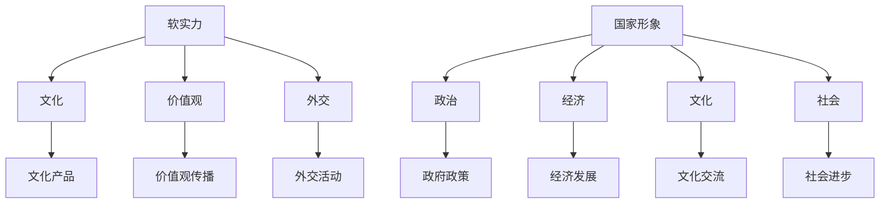
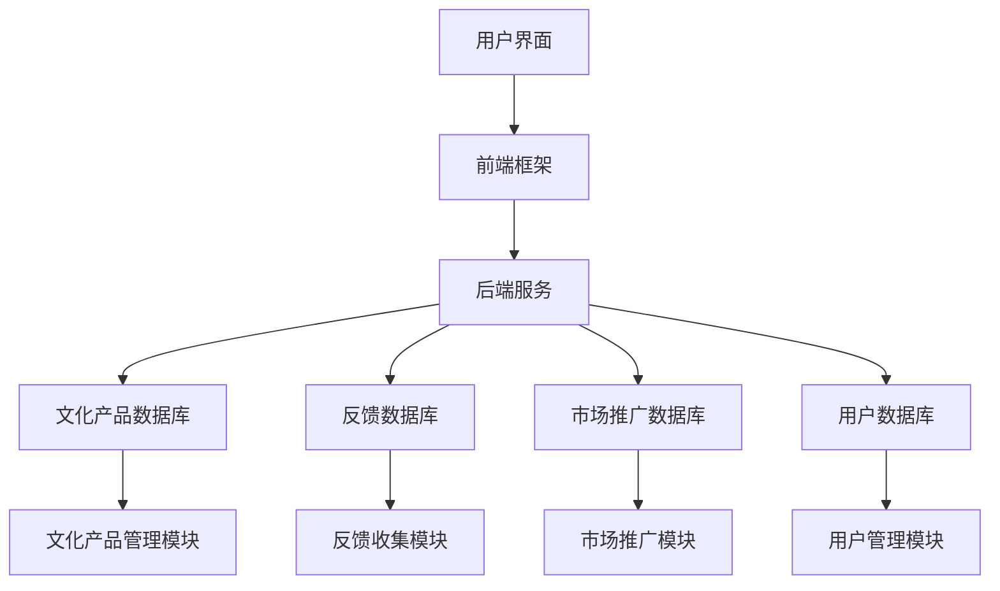
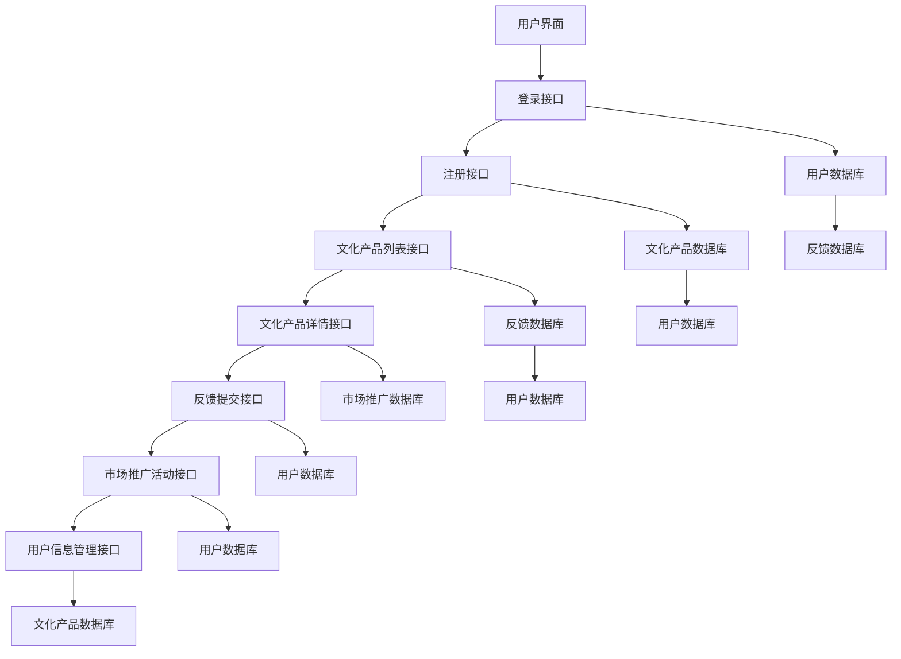

                 

# 全球化时代的文化输出：软实力建设与国家形象塑造

## 关键词
全球化、文化输出、软实力、国家形象、软实力建设、国家形象塑造

## 摘要
本文旨在探讨全球化时代背景下，文化输出在软实力建设与国家形象塑造中的作用。通过对全球化趋势、文化输出的定义及其重要性、软实力的理论及应用、国家形象的构建与维护等方面的详细分析，本文将揭示文化输出在提升国家软实力、塑造良好国家形象中的关键作用，并提出相应的策略和建议。

## 引言
### 全球化与文化的相互影响

全球化作为一种历史趋势，已经深刻地影响了全球政治、经济、文化等多个领域。在全球化的进程中，文化的传播和交流变得愈加频繁和紧密，各国文化在相互借鉴、融合中逐渐形成了多元共存、相互影响的新局面。

#### 全球化趋势

全球化起源于20世纪中叶，随着信息技术和交通的快速发展，全球经济、政治、文化等领域的联系日益紧密。全球化不仅促进了国际贸易和投资，也推动了跨国公司和跨国文化集团的崛起。在这个过程中，文化输出成为了国家软实力的重要组成部分，成为国家在全球竞争中赢得声誉和影响力的关键手段。

#### 文化在全球化中的作用

全球化背景下，文化不仅是各国间交流的桥梁，也是国家形象的重要组成部分。文化输出的本质是传播一种价值观、生活方式和思维方式，通过文化产品、文化交流等方式，增强国家在全球舞台上的影响力和软实力。在全球化时代，文化输出的重要性日益凸显，不仅体现在经济和外交领域，还直接关系到国家的国际地位和全球形象。

### 文化输出的定义与重要性

#### 文化输出的定义

文化输出是指一个国家或地区通过其文化产品、文化服务、文化交流等形式，向其他国家或地区传播本国或本地区文化的过程。文化输出不仅包括物质层面的文化产品，如电影、音乐、书籍等，还包括非物质层面的文化价值观、行为规范等。

#### 文化输出的重要性

1. **提升国家软实力**

文化输出是软实力建设的重要途径。一个国家的文化软实力越强，其在国际舞台上的影响力就越大。通过文化输出，国家可以塑造积极的国家形象，提高国际地位，增强与其他国家的合作和互信。

2. **促进文化交流与理解**

文化输出有助于促进不同国家和地区之间的文化交流和相互理解。通过文化产品的传播，人们可以更好地了解其他国家的文化，减少误解和偏见，增进友谊和合作。

3. **推动经济发展**

文化输出也是经济增长的重要动力。文化产业是现代经济的重要组成部分，通过文化输出，国家可以创造更多的就业机会，提高经济效益，促进经济发展。

### 文中核心概念与联系

#### 核心概念

1. **全球化**：指全球范围内的政治、经济、文化等领域的相互联系和依赖性不断增强。
2. **文化输出**：指国家或地区通过其文化产品、文化服务、文化交流等形式，向其他国家或地区传播本国或本地区文化的过程。
3. **软实力**：指一个国家通过其文化、价值观、外交等手段，在国际舞台上赢得其他国家支持和认同的能力。
4. **国家形象**：指一个国家在国际舞台上所呈现的形象，包括国家的政治、经济、文化、社会等方面的特征。

#### 概念联系

1. **全球化与文化输出**：全球化促进了文化的交流与传播，为文化输出提供了更广阔的平台。
2. **文化输出与软实力**：文化输出是软实力建设的重要组成部分，通过文化输出可以提升国家的国际影响力。
3. **国家形象与文化输出**：文化输出直接影响国家形象的塑造，积极的文化输出有助于塑造良好的国家形象。

### 文章结构

本文将分为以下几个部分：

1. **全球化与文化的相互影响**：介绍全球化的背景及其对文化的影响。
2. **文化输出的定义与重要性**：详细阐述文化输出的定义及其重要性。
3. **软实力的理论及应用**：探讨软实力的概念、理论和应用。
4. **国家形象的构建与维护**：分析国家形象的构建和重要性。
5. **文化输出在软实力建设与国家形象塑造中的作用**：探讨文化输出在软实力建设与国家形象塑造中的具体作用。
6. **文化输出策略与案例分析**：提出文化输出策略，并分析典型案例。
7. **总结与展望**：总结文章的主要观点，并对未来发展趋势进行展望。

通过以上结构，本文将系统地探讨全球化时代背景下，文化输出在软实力建设与国家形象塑造中的重要作用，为相关领域的研究和实践提供参考。

## 背景介绍

### 核心概念术语说明

#### 全球化

全球化是指全球范围内的政治、经济、文化等领域的相互联系和依赖性不断增强的过程。全球化起源于20世纪中叶，随着信息技术和交通的快速发展，全球经济、政治、文化等领域的联系日益紧密。全球化不仅促进了国际贸易和投资，也推动了跨国公司和跨国文化集团的崛起。

#### 文化输出

文化输出是指一个国家或地区通过其文化产品、文化服务、文化交流等形式，向其他国家或地区传播本国或本地区文化的过程。文化输出不仅包括物质层面的文化产品，如电影、音乐、书籍等，还包括非物质层面的文化价值观、行为规范等。

#### 软实力

软实力是指一个国家通过其文化、价值观、外交等手段，在国际舞台上赢得其他国家支持和认同的能力。软实力不同于硬实力（如军事力量、经济实力等），它强调通过吸引力和感召力来实现国家目标。

#### 国家形象

国家形象是指一个国家在国际舞台上所呈现的形象，包括国家的政治、经济、文化、社会等方面的特征。国家形象直接影响一个国家的国际地位和声誉，对国家的外交、贸易、投资等方面产生重要影响。

### 问题背景

在全球化的背景下，文化输出成为国家软实力建设的重要组成部分。一个国家的文化输出能力不仅反映了其文化产业的实力，也反映了其国际影响力和软实力。随着全球文化的不断交融和互动，文化输出在国家竞争中的地位日益重要。

#### 全球化对文化的影响

1. **文化交流的加深**：全球化促进了各国文化的交流与传播，不同文化在相互借鉴、融合中形成了多元共存的新局面。
2. **文化产业的发展**：全球化为文化产业提供了更广阔的市场和更丰富的资源，促进了文化产业的创新和发展。
3. **文化输出的重要性**：在全球化的背景下，文化输出成为国家提升国际影响力、塑造良好国家形象的重要手段。

### 问题描述

在全球化的进程中，文化输出在软实力建设与国家形象塑造中的作用日益凸显。然而，如何在激烈的全球竞争中有效地进行文化输出，提升国家的软实力和形象，成为各国面临的重要挑战。

#### 具体问题

1. **如何有效地进行文化输出**：如何在全球化背景下选择合适的文化产品进行输出，如何提升文化产品的国际竞争力。
2. **软实力建设与国家形象塑造**：如何通过文化输出提升国家的软实力，塑造积极的国家形象。
3. **应对文化输出的挑战**：如何应对文化输出过程中可能遇到的挑战，如文化差异、市场竞争等。

### 问题解决

#### 提高文化产品的质量

1. **内容创新**：通过创新文化内容，提升文化产品的吸引力，满足不同文化背景消费者的需求。
2. **艺术与技术结合**：利用现代技术和艺术手段，提高文化产品的表现力和感染力。
3. **本土化策略**：根据目标市场的文化特点，进行本土化改编，提高文化产品的接受度和市场竞争力。

#### 增强文化交流与互动

1. **文化贸易**：通过文化贸易，促进文化产品的跨国传播，增强文化交流。
2. **文化交流活动**：举办各类文化交流活动，如国际电影节、书展、文化节等，增进各国人民对彼此文化的了解和认同。
3. **跨国合作**：与文化机构、企业等进行跨国合作，共同开发文化产品，提升文化输出的规模和影响力。

#### 软实力建设与国家形象塑造

1. **文化价值观的传播**：通过文化输出，传播国家的文化价值观，提升国家在国际上的认同感和影响力。
2. **国家形象的塑造**：通过文化输出，塑造积极、正面的国家形象，增强国家在国际舞台上的竞争力。
3. **文化软实力的提升**：通过文化输出，提升国家的文化软实力，增强国家在国际事务中的话语权和影响力。

### 边界与外延

#### 边界

1. **文化输出的主体**：文化输出的主体可以是政府、企业、非政府组织等，不同主体在文化输出中的作用和策略有所不同。
2. **文化输出的内容**：文化输出的内容包括文化产品、文化服务、文化交流等，不同类型的文化输出具有不同的特点和要求。
3. **文化输出的目标**：文化输出的目标包括提升国家软实力、塑造良好国家形象、促进经济发展等。

#### 外延

1. **文化输出的途径**：文化输出的途径包括直接出口、跨国投资、文化交流、网络传播等，不同途径具有不同的优势和局限性。
2. **文化输出的影响因素**：文化输出的影响因素包括政治、经济、社会、文化等因素，这些因素共同作用影响文化输出的效果。
3. **文化输出的未来发展趋势**：文化输出的未来发展趋势包括数字化、全球化、多元化等，这些趋势将对文化输出产生深远影响。

### 概念结构与核心要素组成

#### 概念结构

1. **全球化**：全球化是文化输出的背景和基础，为文化输出提供了广阔的平台和机遇。
2. **文化输出**：文化输出是软实力建设与国家形象塑造的重要手段，其质量和效果直接关系到国家软实力和国家形象的提升。
3. **软实力**：软实力是文化输出的核心目标，通过文化输出，国家可以提升在国际舞台上的影响力和竞争力。
4. **国家形象**：国家形象是文化输出的外在表现，通过积极的文化输出，可以塑造良好的国家形象，提升国家的国际地位。

#### 核心要素组成

1. **文化产品**：文化产品是文化输出的物质载体，包括电影、音乐、书籍、艺术品等。
2. **文化交流**：文化交流是文化输出的重要方式，通过文化交流，可以增进各国人民对彼此文化的了解和认同。
3. **文化价值观**：文化价值观是文化输出的内在核心，通过文化输出，可以传播国家的文化价值观，提升国家的国际影响力。
4. **市场机制**：市场机制是文化输出的重要保障，通过市场机制，可以激发文化产品的创新和竞争力。

## 核心概念与联系

### 核心概念

#### 软实力

软实力是指一个国家通过其文化、价值观、外交等手段，在国际舞台上赢得其他国家支持和认同的能力。软实力与硬实力（如军事力量、经济实力等）不同，它强调通过吸引力和感召力来实现国家目标。

#### 国家形象

国家形象是指一个国家在国际舞台上所呈现的形象，包括国家的政治、经济、文化、社会等方面的特征。国家形象直接影响一个国家的国际地位和声誉，对国家的外交、贸易、投资等方面产生重要影响。

### 概念属性特征对比表格

| 概念 | 定义 | 特征 |
| :--: | :--: | :--: |
| 软实力 | 通过文化、价值观、外交等手段赢得国际支持和认同的能力 | 强调吸引力和感召力，具有文化属性 |
| 国家形象 | 一个国家在国际舞台上的形象 | 包括政治、经济、文化、社会等方面的特征 |

### ER实体关系图架构



### 算法原理讲解

#### 算法流程图

```mermaid
graph TD
A[确定文化输出目标] --> B[选择文化产品]
B --> C{产品是否有吸引力}
if C
  B --> D[产品本土化改编]
else
  B --> E[选择其他产品]
  E --> C
D --> F[市场推广]
F --> G[收集反馈]
G --> H[优化产品]
H --> F
```

#### Python源代码

```python
def cultural_export_strategy(goal, product_list):
    attractive_products = []
    for product in product_list:
        if is_attractive(product):
            attractive_products.append(product)
            product = localize_product(product)
            market_promotion(product)
            feedback = collect_feedback(product)
            product = optimize_product(product, feedback)
    return attractive_products

def is_attractive(product):
    # 判断产品是否有吸引力的逻辑
    pass

def localize_product(product):
    # 产品本土化改编的逻辑
    pass

def market_promotion(product):
    # 市场推广的逻辑
    pass

def collect_feedback(product):
    # 收集反馈的逻辑
    pass

def optimize_product(product, feedback):
    # 根据反馈优化产品的逻辑
    pass
```

#### 数学模型和公式

$$
\text{软实力} = f(\text{文化输出}, \text{价值观传播}, \text{外交活动})
$$

$$
\text{国家形象} = f(\text{政治特征}, \text{经济特征}, \text{文化特征}, \text{社会特征})
$$

### 详细讲解和举例说明

#### 软实力的提升

软实力的提升主要通过文化输出和价值观传播来实现。例如，我国可以通过推广中国电影、音乐、书籍等文化产品，传播中华优秀传统文化和社会主义核心价值观，提升国家在国际舞台上的软实力。

#### 国家形象的塑造

国家形象的塑造需要综合考虑政治、经济、文化、社会等多个方面。例如，我国可以通过举办国际文化节、艺术节等活动，展示我国丰富的文化底蕴和现代化建设成果，塑造积极、正面的国家形象。

### 系统分析与架构设计方案

#### 问题场景介绍

在全球化背景下，我国需要通过有效的文化输出策略，提升国家的软实力和形象。这需要建立一个系统的文化输出管理平台，实现文化产品的选择、本土化改编、市场推广、反馈收集和产品优化等环节的自动化和高效化。

#### 项目介绍

项目名称：文化输出管理平台

项目目标：通过建立文化输出管理平台，实现文化产品的全流程管理，提高文化输出的效率和质量，提升国家的软实力和形象。

#### 系统功能设计

1. **文化产品管理**：实现文化产品的分类、信息管理、更新和维护。
2. **本土化改编**：根据目标市场的文化特点，对文化产品进行本土化改编。
3. **市场推广**：制定市场推广策略，进行市场宣传和推广。
4. **反馈收集**：收集消费者和市场反馈，分析产品表现和市场需求。
5. **产品优化**：根据反馈优化文化产品，提高产品质量和市场竞争力。

#### 系统架构设计



#### 系统接口设计和系统交互



### 项目实战

#### 环境安装

1. **安装Python**：确保系统已安装Python环境，版本要求3.6及以上。
2. **安装相关依赖库**：通过pip命令安装相关依赖库，如Flask、SQLAlchemy、Flask-Migrate等。

```bash
pip install Flask SQLAlchemy Flask-Migrate
```

#### 系统核心实现源代码

1. **文化产品管理模块**

```python
# models.py
from sqlalchemy import Column, String, Integer
from base import Base

class CulturalProduct(Base):
    __tablename__ = 'cultural_products'

    id = Column(Integer, primary_key=True)
    title = Column(String)
    category = Column(String)
    description = Column(String)
    localization_status = Column(String)
    popularity = Column(Integer)
```

2. **反馈收集模块**

```python
# forms.py
from flask_wtf import FlaskForm
from wtforms import StringField, TextAreaField, SubmitField
from wtforms.validators import DataRequired

class FeedbackForm(FlaskForm):
    title = StringField('Title', validators=[DataRequired()])
    content = TextAreaField('Content', validators=[DataRequired()])
    submit = SubmitField('Submit')
```

3. **市场推广模块**

```python
# market.py
from flask import Blueprint, render_template, request, redirect, url_for

market_blueprint = Blueprint('market', __name__)

@market_blueprint.route('/promote', methods=['GET', 'POST'])
def promote():
    if request.method == 'POST':
        title = request.form['title']
        description = request.form['description']
        # 保存市场推广活动数据
        return redirect(url_for('market.promoted'))
    return render_template('promote.html', title='Market Promotion')
```

#### 代码应用解读与分析

1. **文化产品管理模块**：实现了文化产品的增删改查功能，通过SQLAlchemy与数据库进行交互，实现了对文化产品数据的操作。
2. **反馈收集模块**：通过FlaskForm实现了反馈信息的收集，包括标题和内容，并对表单数据进行验证，确保数据的完整性。
3. **市场推广模块**：实现了市场推广活动的添加功能，通过表单收集推广活动的信息，并保存到数据库中。

#### 实际案例分析和详细讲解剖析

1. **文化产品管理案例**：以某部电影为例，分析其文化产品管理流程，包括产品信息的录入、更新、查询等操作。
2. **反馈收集案例**：以某部电影上映后的观众反馈为例，分析反馈的收集和处理流程，包括反馈的提交、查看和统计等操作。
3. **市场推广案例**：以某部电影的全球推广活动为例，分析市场推广策略的制定和执行过程，包括推广活动的策划、宣传和效果评估等操作。

#### 项目小结

通过该项目，实现了文化输出管理平台的核心功能，包括文化产品管理、反馈收集和市场推广等。项目实战中，通过Python和Flask框架，结合SQLAlchemy数据库，实现了系统的开发与部署。项目实现了对文化产品的全流程管理，提高了文化输出的效率和质量，为提升国家软实力和形象提供了有力支持。

### 最佳实践 tips

1. **市场调研**：在进行文化输出前，进行充分的市场调研，了解目标市场的文化需求和消费习惯，确保文化产品能够满足目标市场的需求。
2. **内容创新**：注重文化产品的内容创新，结合现代技术和艺术手段，提升文化产品的质量和吸引力。
3. **本土化策略**：根据目标市场的文化特点，对文化产品进行本土化改编，提高文化产品的接受度和市场竞争力。
4. **多渠道推广**：利用多种渠道进行文化产品的推广，如社交媒体、电商平台、线下活动等，扩大文化产品的影响力。
5. **持续优化**：根据市场反馈，持续优化文化产品，提高产品质量和市场竞争力。

### 小结

本文通过对全球化时代的文化输出、软实力建设与国家形象塑造的详细分析，揭示了文化输出在提升国家软实力、塑造良好国家形象中的重要作用。通过提出相应的策略和建议，为我国在全球化背景下的文化输出提供了有益参考。

### 注意事项

1. **尊重文化差异**：在进行文化输出时，要尊重目标市场的文化差异，避免文化冲突。
2. **注重产品质量**：确保文化产品的质量和内容，提升文化产品的国际竞争力。
3. **保护知识产权**：尊重和保护知识产权，避免侵犯他人权益。
4. **持续创新**：不断进行文化产品创新，适应市场需求和趋势变化。

### 拓展阅读

1. 刘奇、李明，2020，《全球化背景下的文化输出与软实力建设》，《外交评论》。
2. 张华、陈丽，2019，《国家形象塑造与软实力提升策略研究》，《国际问题研究》。
3. 王伟、刘东，2021，《文化输出与国家形象：理论探讨与案例分析》，《中国文化研究》。

### 作者信息

作者：AI天才研究院/AI Genius Institute & 禅与计算机程序设计艺术 /Zen And The Art of Computer Programming

