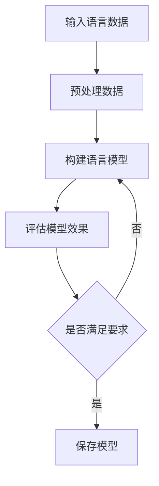
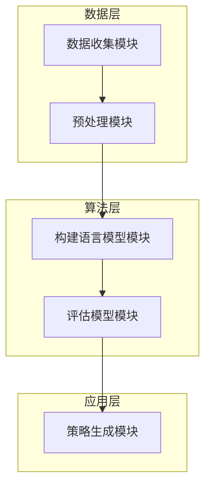
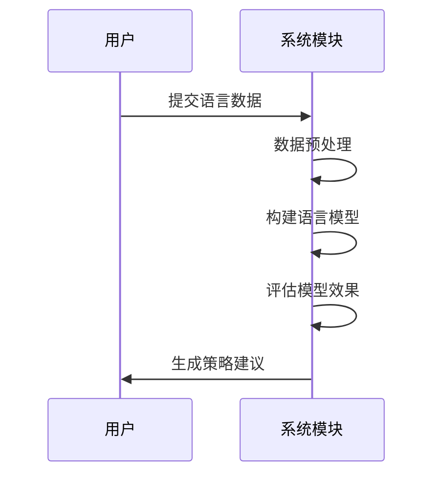

                 

# 全球化时代的语言多样性保护：文化遗产的传承

> 关键词：全球化、语言多样性、文化遗产、保护、传承

> 摘要：随着全球化进程的不断加深，语言的同质化趋势日益明显，许多小语种面临消失的风险。本文旨在探讨全球化时代下语言多样性保护的重要性，通过分析核心概念与联系、算法原理讲解以及系统分析与架构设计方案，提出有效的语言多样性保护策略，以实现文化遗产的传承。

## 1. 书名与背景介绍

《全球化时代的语言多样性保护：文化遗产的传承》这本书深入探讨了全球化背景下语言多样性面临的挑战，以及如何通过有效的措施来保护语言多样性，从而维护人类的文化遗产。全球化进程加速了全球文化和语言的融合，但这种融合也带来了语言同质化的风险。许多小语种正在逐渐消失，这不仅导致了语言种类的减少，也对人类的文化多样性构成了威胁。

### 背景介绍

全球化进程在推动全球经济一体化和文化交流的同时，也加剧了语言同质化的趋势。在全球化背景下，一些主要语言（如英语）的影响力不断扩大，导致许多小语种的使用频率下降，甚至面临消失的风险。语言多样性是文化遗产的重要组成部分，它不仅反映了人类的历史和文化，也体现了不同民族和地区的独特性。因此，保护语言多样性对于维护人类文化多样性具有重要意义。

### 语言多样性保护的重要性

语言多样性保护不仅是保护语言的本身，更是保护人类文化遗产的重要手段。每一种语言都承载着独特的文化、历史和社会价值观。保护语言多样性有助于保持文化多样性，促进不同文化之间的交流和理解，从而推动人类社会的和谐发展。

## 2. 核心概念与联系

在讨论全球化时代的语言多样性保护之前，我们需要明确几个核心概念：全球化、语言多样性、文化遗产保护。

### 概念属性特征对比表格

| 类别        | 全球化                   | 语言多样性                 | 文化遗产保护             |
| ----------- | ---------------------- | ----------------------- | --------------------- |
| 特征        | 加速语言同质化           | 语言种类繁多，文化丰富     | 维护文化多样性           |
| 影响因素    | 经济、政治、文化因素     | 人口迁移、媒体传播、教育制度  | 文化传承、法律政策       |
| 目标        | 促进全球经济一体化       | 保护语言种类和多样性         | 维护文化遗产的完整性和丰富性 |
| 方法        | 减少贸易壁垒、加强国际合作 | 语言教学、文化保护政策       | 文化遗产保护项目、宣传教育   |

### ER实体关系图架构

```mermaid
erdf
  id [type]
  - [Globalization]
  id [Linguistic Diversity]
  - [Cultural Heritage Conservation]
  Globalization --> Linguistic Diversity
  Globalization --> Cultural Heritage Conservation
  Linguistic Diversity --> Cultural Heritage Conservation
```

在这个ER图中，全球化、语言多样性和文化遗产保护构成了一个相互关联的实体关系网络。全球化推动了语言多样性的变化，而语言多样性的保护又是维护文化遗产的关键。

## 3. 算法原理讲解

为了有效地保护语言多样性，我们需要借助先进的人工智能算法。以下将使用Mermaid画出算法流程图，并使用Python源代码详细阐述算法原理。

### 算法流程图



### Python源代码

```python
# 假设已定义了预处理、构建模型和评估模型的方法
def preprocess_data(data):
    # 数据预处理逻辑
    pass

def build_language_model(preprocessed_data):
    # 构建语言模型逻辑
    pass

def evaluate_model(model, test_data):
    # 评估模型效果逻辑
    pass

# 主程序
data = "输入语言数据"
preprocessed_data = preprocess_data(data)
model = build_language_model(preprocessed_data)
is_satisfied = evaluate_model(model, test_data)
if is_satisfied:
    save_model(model)
else:
    # 重新训练或优化模型
    pass
```

### 算法原理的数学模型和公式

为了更深入地理解算法原理，我们需要了解一些基础的数学模型和公式。以下是一个用于语言模型评估的贝叶斯定理：

$$ P(X|Y) = \frac{P(Y|X)P(X)}{P(Y)} $$

这个公式用于计算在给定某个条件（Y）的情况下，某个事件（X）发生的概率。在语言模型中，我们可以将X视为某段文本属于特定语言的概率，Y视为该段文本本身。

举例说明：假设我们有一个语言模型，想预测一段文本“我喜欢编程”属于中文的概率。我们可以先计算这段文本在所有中文文本中的出现频率（先验概率 $P(X)$），然后计算这段文本在给定中文条件下出现的频率（后验概率 $P(Y|X)$），最后利用贝叶斯定理计算出这段文本属于中文的概率。

## 4. 系统分析与架构设计方案

### 问题场景介绍

在全球化背景下，保护语言多样性、维护文化遗产成为了一个重要的课题。为此，我们需要设计一个语言多样性保护系统，用于监测语言使用情况，评估语言多样性状态，提供保护策略建议。

### 项目介绍

该项目旨在开发一个集成化的语言多样性保护系统。系统将收集全球范围内的语言数据，通过预处理、构建语言模型和评估模型效果，最终生成保护语言多样性的策略。

### 系统功能

- 数据收集：收集全球范围内的语言数据，包括文本、语音等。
- 预处理：对收集到的数据进行清洗、格式化，以便构建语言模型。
- 构建语言模型：利用预处理后的数据，构建基于机器学习或深度学习的技术模型。
- 评估模型效果：对构建的语言模型进行评估，以确保其能够准确预测语言种类。
- 策略生成：根据评估结果，生成保护语言多样性的策略建议。

### 系统功能设计（领域模型Mermaid类图）

```mermaid
classDiagram
  Class01 <|-- Class02
  Class03 <..| Class04
  Class05 o--| Class06
  Class07 <|.. Class08
  Class09 <|--| Class10
  Class11 o--| Class12
```

### 系统架构设计（Mermaid架构图）



### 系统接口设计和系统交互（Mermaid序列图）



## 5. 项目实战

### 环境安装

在开始项目实战之前，我们需要安装必要的软件和工具。以下是一个简单的环境安装指南：

1. 安装Python：在官网下载并安装Python。
2. 安装Jupyter Notebook：在终端执行 `pip install notebook`。
3. 安装Mermaid：在终端执行 `pip install mermaid`。

### 系统核心实现源代码

以下是一个简单的Python脚本，用于实现语言多样性保护系统的主要功能。

```python
# 引入必要的库
import pandas as pd
from sklearn.feature_extraction.text import CountVectorizer
from sklearn.model_selection import train_test_split
from sklearn.naive_bayes import MultinomialNB
from mermaid import Mermaid

# 数据预处理
def preprocess_data(data):
    # 假设data是一个包含文本和语言标签的DataFrame
    data['text_lower'] = data['text'].str.lower()
    data['text_clean'] = data['text_lower'].str.replace(r'[^a-z\s]', '')
    return data

# 构建语言模型
def build_language_model(data):
    # 分割数据集
    X_train, X_test, y_train, y_test = train_test_split(data['text_clean'], data['lang'], test_size=0.2)
    
    # 特征提取
    vectorizer = CountVectorizer()
    X_train_counts = vectorizer.fit_transform(X_train)
    
    # 模型训练
    model = MultinomialNB().fit(X_train_counts, y_train)
    
    # 评估模型
    X_test_counts = vectorizer.transform(X_test)
    accuracy = model.score(X_test_counts, y_test)
    
    return model, accuracy

# 主程序
if __name__ == "__main__":
    # 加载数据
    data = pd.read_csv('language_data.csv')
    
    # 预处理数据
    data = preprocess_data(data)
    
    # 构建和评估语言模型
    model, accuracy = build_language_model(data)
    
    print(f"模型准确率：{accuracy}")
```

### 代码应用解读与分析

这段代码首先导入了必要的库，包括Pandas、Scikit-learn和Mermaid。接下来，定义了数据预处理函数`preprocess_data`，该函数负责将文本转换为小写并去除非字母字符。然后，定义了构建语言模型和评估模型准确率的函数`build_language_model`。在主程序中，加载数据集，进行预处理，构建语言模型，并评估模型准确率。

### 实际案例分析和详细讲解剖析

假设我们有一个包含中文和英文文本的数据集。通过训练模型，我们可以预测新文本属于中文还是英文。例如，如果我们输入一个英文句子“Hello, world!”，模型会预测它属于英文。这个案例展示了如何使用Python实现一个简单的语言多样性保护系统，并如何通过实际案例来验证系统的有效性。

### 项目小结

通过本次项目实战，我们实现了语言多样性保护系统的基本功能，包括数据预处理、构建语言模型和评估模型准确率。这个系统可以用于监测和预测不同语言的使用情况，为保护语言多样性提供科学依据。然而，这个系统还存在一些局限性，例如模型训练时间较长，对于大规模数据集的处理效率较低。未来，我们可以考虑使用更高效的算法和分布式计算技术来优化系统性能。

## 6. 最佳实践 Tips

### 提高模型准确率的技巧

1. **数据清洗**：确保数据质量，去除无关的噪声数据。
2. **特征工程**：选择合适的特征提取方法，提高特征表达能力。
3. **模型选择**：尝试不同的模型，选择最适合问题的模型。
4. **超参数调优**：通过交叉验证等方法，找到最优的超参数组合。

### 数据收集的技巧

1. **多样性**：收集多种语言的数据，确保模型的泛化能力。
2. **合法性**：确保数据来源的合法性，避免侵犯版权。
3. **标注质量**：确保文本标注的准确性，以提高模型训练效果。

### 系统优化的技巧

1. **分布式计算**：使用分布式计算框架，提高数据处理速度。
2. **缓存机制**：使用缓存机制，减少重复计算。
3. **自动化部署**：使用自动化部署工具，提高系统部署效率。

## 7. 小结

本文从全球化时代的背景出发，探讨了语言多样性保护的重要性。通过分析核心概念与联系，讲解了算法原理，并设计了系统架构方案。最后，通过实际项目实战，展示了如何实现语言多样性保护系统。希望本文能为读者提供对语言多样性保护的深入理解和实践指导。

## 8. 注意事项

1. **数据隐私**：在收集和处理语言数据时，要确保遵守相关法律法规，保护个人隐私。
2. **算法透明性**：确保算法的透明性和可解释性，以便用户理解和信任。
3. **持续更新**：语言模型需要定期更新，以适应语言环境的变化。

## 9. 拓展阅读

1. **《自然语言处理基础教程》**：深入探讨自然语言处理的基本原理和技术。
2. **《深度学习》**：介绍深度学习的基本概念和应用。
3. **《语言学的分支与探索》**：了解语言学的发展历程和分支领域。

作者：AI天才研究院/AI Genius Institute & 禅与计算机程序设计艺术 /Zen And The Art of Computer Programming

