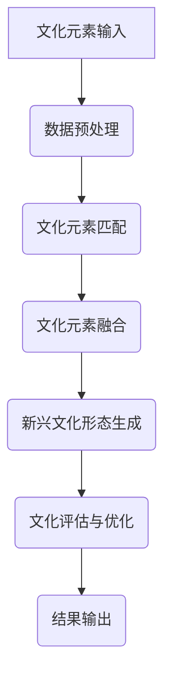

                 


# 全球化背景下的文化混合：新兴文化形态的产生与发展

## 关键词
- 全球化
- 文化混合
- 新兴文化形态
- 文化多样性
- 全球文化交流
- 文化创新

## 摘要
本文深入探讨了全球化背景下文化混合的现象，分析了新兴文化形态的产生与发展过程。通过引入关键概念和理论框架，结合实际案例，本文旨在揭示文化混合的内在机制和外在表现，为理解全球化时代的文化动态提供新的视角。文章还将探讨文化混合对个人、社会和全球层面的影响，并展望未来文化混合的趋势与挑战。

----------------------------------------------------------------

## 引言

在全球化迅猛发展的今天，不同文化之间的接触和交流日益频繁。全球化不仅改变了经济、政治和社会结构，也对文化产生了深远影响。文化混合（Cultural Mix）这一现象正是在这样的背景下逐渐显现并受到广泛关注。文化混合指的是不同文化在相互接触、交流与融合的过程中，产生新的文化形态和特征的过程。

### 1.1 全球化的定义与影响

全球化（Globalization）是指全球范围内的经济、政治、文化等系统之间的互动和相互依赖日益加深的过程。全球化并非一个新鲜概念，但其在过去几十年中得到了快速发展。全球化的主要驱动力包括信息技术的发展、国际贸易的增长、跨国公司的兴起以及全球化政策的推行等。

全球化对文化的影响是多层次且多方面的。首先，全球化促进了全球文化交流，使得不同文化之间的接触更加频繁和深入。其次，全球化加速了文化的传播和融合，使得新的文化形态不断涌现。此外，全球化还导致了文化同质化和文化多样性的并存。一方面，全球化的趋势可能导致某些文化特征的普及和传播，另一方面，全球化也为文化多样性的维护和发扬提供了机会。

### 1.2 文化混合的概念与类型

文化混合（Cultural Mix）可以理解为不同文化元素在相互接触中发生相互作用，从而产生新的文化现象或特征的过程。文化混合不仅涉及物质层面的交流，如商品、技术、艺术等，还包括非物质层面的交流，如价值观、信仰、习俗等。

文化混合的类型多种多样，主要包括以下几种：

1. **文化融合**：不同文化在接触过程中，相互吸收和融合，形成新的文化形态。例如，跨国婚姻和家庭往往是文化融合的典型例子。
2. **文化杂交**：不同文化在接触过程中，相互结合，形成新的文化现象。例如，国际化的美食、音乐和电影等。
3. **文化碰撞**：不同文化在接触过程中，由于价值观、信仰和习俗的差异，可能引发冲突和对抗。例如，全球化和文化保护主义之间的紧张关系。
4. **文化共生**：不同文化在接触过程中，相互尊重、共存，并共同发展。例如，全球范围内的多元文化和宗教共存。

### 1.3 新兴文化形态的形成

在全球化背景下，文化混合的现象日益显著，新兴文化形态不断涌现。这些新兴文化形态不仅反映了全球文化的多样性，也体现了文化创新的可能性。新兴文化形态的形成通常受到以下因素的影响：

1. **技术进步**：互联网和信息技术的发展极大地促进了全球文化的传播和交流，为文化混合提供了新的平台和工具。
2. **经济全球化**：跨国贸易和跨国公司的兴起，使得不同文化在商业和经济领域的接触更加频繁，推动了文化的融合和混合。
3. **社会变迁**：随着全球化和城市化进程的加快，社会结构和价值观念也在发生深刻变革，这为文化混合提供了土壤。
4. **文化交流**：全球范围内的文化交流活动，如国际会议、文化节、国际旅游等，促进了不同文化之间的互动和融合。

## 总结

全球化背景下的文化混合是一个复杂且动态的过程，它既带来了新的机遇，也带来了挑战。通过本文的讨论，我们深入了解了文化混合的概念、类型和影响因素，并看到了新兴文化形态的形成和发展。理解文化混合的机制和影响，对于政策制定者、文化从业者和社会公众都具有重要意义。在接下来的章节中，我们将进一步探讨文化混合的理论基础、案例研究和未来趋势。

----------------------------------------------------------------

## 全球化：推动文化混合的力量

全球化是一个多维度的过程，它不仅改变了经济和政治格局，也深刻影响了文化领域。在这一章节中，我们将探讨全球化的定义、历史背景、主要驱动力以及对文化的影响，进一步理解全球化如何成为文化混合的推动力量。

### 2.1 全球化的定义

全球化是指不同国家和地区的经济、政治、社会和文化系统之间日益增强的相互依赖和互动。全球化不仅仅是一个经济现象，它涵盖了经济、政治、文化、社会等多个方面。在经济层面，全球化表现为全球贸易、跨国投资和国际金融的扩张。在政治层面，全球化涉及到国际组织和跨国政策的制定与执行。在社会层面，全球化影响了人口流动、教育和文化交流。在文化层面，全球化加速了全球文化的交流和融合。

### 2.2 全球化的历史背景

全球化的历史可以追溯到几个世纪以前，但其现代形式主要是在20世纪后半叶发展起来的。以下是全球化历史发展的几个关键阶段：

1. **早期全球化（15-18世纪）**：这一时期，欧洲列强的殖民扩张和贸易活动促进了全球市场的初步形成。例如，大航海时代的地理大发现导致了欧洲与世界其他地区的直接接触。

2. **工业革命（18-19世纪）**：工业革命极大地提高了生产效率，促进了全球贸易和资本流动。欧洲的工业化带动了世界其他地区的工业化进程。

3. **现代全球化（20世纪中后期至今）**：冷战结束后，全球政治格局发生了重大变化。全球化进入了一个新的阶段，信息技术的发展、国际金融市场的融合以及跨国公司的兴起成为主要驱动力。

### 2.3 全球化的主要驱动力

全球化的主要驱动力包括以下几个方面：

1. **信息技术**：互联网和通信技术的发展极大地缩短了信息传播的距离，使全球范围内的交流和合作变得更加便捷和高效。社交媒体平台和在线通信工具使得个人和组织能够迅速分享信息和知识。

2. **跨国公司**：跨国公司通过在全球范围内的投资和运营，推动了全球资源的配置和文化的传播。这些公司不仅是全球经济的重要组成部分，也是文化交流的重要载体。

3. **国际贸易**：全球贸易的自由化和便利化促进了商品、服务和技术在全球范围内的流动。贸易活动不仅带来了经济效益，也促进了不同文化之间的交流与融合。

4. **全球化政策**：全球性的组织和协议，如世界贸易组织（WTO）和联合国，通过制定和推行全球政策，促进了全球经济和政治一体化。

### 2.4 全球化对文化的影响

全球化对文化的影响是复杂且多层次的。以下是一些关键影响：

1. **文化交流**：全球化促进了全球范围内的文化交流，使得不同文化之间的接触更加频繁和深入。文化元素如音乐、电影、艺术和饮食等在全球范围内传播，形成了新的文化混合现象。

2. **文化同质化**：全球化也可能导致文化同质化，即全球范围内某些文化特征和价值观的普及。这种趋势可能会削弱文化多样性，但也为文化交流和创新提供了新的机会。

3. **文化多样性**：全球化也为文化多样性的维护和发扬提供了机会。通过保护和推广本土文化，全球化可以帮助各国保留其独特的文化传统。

4. **文化冲突**：全球化过程中，不同文化之间的碰撞和冲突也时有发生。文化差异可能导致误解、偏见和冲突，这对社会和谐和文化共存提出了挑战。

### 2.5 文化混合的内在机制

文化混合的内在机制涉及多个层面：

1. **文化接触**：不同文化在接触过程中，通过交流、互动和相互学习，开始产生新的文化特征。

2. **文化融合**：文化接触后的融合过程，不同文化元素相互吸收、整合，形成新的文化形态。

3. **文化杂交**：不同文化在接触中，可能形成新的文化现象，这些新现象是不同文化元素相互结合的结果。

4. **文化创新**：文化混合的过程也是文化创新的过程，新的文化形态和文化产品不断涌现。

### 2.6 全球化背景下的文化多样性

全球化不仅改变了文化的传播方式，也改变了文化多样性的表现形式。在全球化背景下，文化多样性可以表现为以下几种形式：

1. **多元文化社会**：全球化使得许多国家和地区成为多元文化社会，不同民族和文化群体在同一个社会中共存。

2. **文化融合区**：全球化促进了全球范围内的文化融合区形成，如国际化大都市和跨国社区。

3. **文化创新实验室**：全球化为文化创新提供了新的环境和机遇，不同文化的碰撞和融合成为文化创新的源泉。

### 2.7 文化混合的未来趋势

随着全球化进程的加深，文化混合将继续成为文化发展的重要动力。未来文化混合的趋势可能包括：

1. **文化数字化**：随着数字技术的不断发展，文化数字化将成为文化混合的重要形式，通过互联网和社交媒体平台，全球文化将更加便捷地交流和融合。

2. **文化多样性的保护**：在全球化进程中，如何平衡文化同质化和文化多样性保护将成为重要议题。

3. **文化创新的加速**：全球化为文化创新提供了丰富的资源和平台，未来我们将看到更多基于文化混合的新文化形态和文化产品。

## 结论

全球化作为推动文化混合的主要力量，对文化领域产生了深远影响。通过本章节的探讨，我们理解了全球化的定义、历史背景、主要驱动力以及对文化的影响。文化混合作为全球化背景下的一种重要现象，既带来了新的文化形态，也面临文化冲突和多样性的挑战。在接下来的章节中，我们将进一步探讨文化混合的理论基础、案例分析及其对个人和社会的影响。

----------------------------------------------------------------

## 文化混合的理论基础

在理解文化混合的现象时，理论基础提供了关键性的指导。这一章节将探讨文化混合的核心理论，包括文化接触、文化融合、文化杂交以及文化创新的机制，并介绍相关的概念和理论框架。

### 3.1 文化接触

文化接触是指不同文化在空间或时间上的相遇和互动。文化接触是文化混合的第一步，它为文化元素之间的交流创造了条件。文化接触可以发生在不同层面，包括个体层面、群体层面以及社会层面。

1. **个体层面的文化接触**：个体之间的直接互动，如国际旅行、跨国婚姻和跨文化交流项目，这些活动促进了文化元素的直接交流。

2. **群体层面的文化接触**：不同文化群体之间的互动，如国际会议、文化节和宗教活动，这些活动有助于不同文化之间的相互理解和融合。

3. **社会层面的文化接触**：国家之间或社会之间的互动，如国际贸易、跨国投资和外交关系，这些活动为文化元素的流动提供了更广阔的平台。

#### 文化接触的关键概念：

- **文化适应**：个体或群体在接触其他文化时，通过调整自己的行为、价值观和习惯，以适应新的文化环境。
- **文化同化**：一种文化对另一种文化的强烈影响，导致后者逐渐失去其独特性，而采取前者的特征。
- **文化冲突**：不同文化在接触过程中，由于价值观、信仰和习俗的差异，可能引发的紧张和对抗。

### 3.2 文化融合

文化融合是指不同文化在接触和互动中，相互吸收和整合，形成新的文化形态。文化融合是文化混合的核心过程，它通过以下几个阶段实现：

1. **接触阶段**：不同文化开始接触，彼此了解对方的文化元素。
2. **适应阶段**：个体或群体开始调整自己的行为和价值观，以适应对方的文化。
3. **融合阶段**：文化元素在相互交流中逐渐整合，形成新的文化特征。

#### 文化融合的关键概念：

- **文化共生**：不同文化在接触过程中，相互尊重、共存，并共同发展。
- **文化杂交**：不同文化在接触中，相互结合，形成新的文化现象。
- **文化创新**：在文化融合过程中，新的文化形态和文化产品不断涌现。

### 3.3 文化杂交

文化杂交是指不同文化元素在接触中相互结合，形成新的文化现象。文化杂交通常体现在物质文化层面，如食物、服装、艺术和建筑等方面。

#### 文化杂交的关键概念：

- **文化杂交现象**：不同文化元素结合形成的具体文化产品或现象，如国际化的美食、服装风格和音乐。
- **文化融合与创新**：文化杂交过程中，新的文化形态不仅是不同文化的混合，也是创新的产物。

### 3.4 文化创新

文化创新是文化混合过程中最为显著的特征之一。它指的是在文化接触和融合的基础上，产生新的文化形态、文化产品和创意。文化创新不仅丰富了文化多样性，也推动了社会进步和发展。

#### 文化创新的关键概念：

- **创新文化**：一种注重创新、鼓励创意的文化环境，有助于新的文化形态的产生。
- **文化多样性与创新**：文化多样性为创新提供了丰富的资源，不同的文化元素在碰撞中激发出新的创意。

### 3.5 理论框架

在探讨文化混合的理论基础时，一些关键的理论框架为我们的分析提供了指导。以下是几个常用的理论框架：

1. **文化接触理论**：该理论强调文化接触是文化混合的起点，不同文化的相互作用是文化创新的重要动力。
2. **文化融合理论**：该理论关注文化融合的过程和机制，以及文化融合对文化多样性和文化创新的影响。
3. **文化杂交理论**：该理论侧重于文化杂交现象的形成过程及其对文化多样性和创新的作用。
4. **文化创新理论**：该理论探讨文化创新的过程和机制，以及文化创新对文化发展和社会进步的贡献。

### 3.6 文化混合的内在机制

文化混合的内在机制可以从以下几个层面来理解：

1. **文化元素的互动**：不同文化元素在接触过程中，通过交流、互动和相互学习，产生新的文化特征。
2. **文化适应与调整**：个体或群体在接触其他文化时，通过调整自己的行为、价值观和习惯，以适应新的文化环境。
3. **文化融合与整合**：文化元素在相互交流中逐渐整合，形成新的文化形态。
4. **文化创新与扩散**：新的文化形态和文化产品在文化融合过程中不断涌现，并通过各种渠道扩散和传播。

### 3.7 文化混合的影响

文化混合对个人、社会和全球层面产生了深远的影响。以下是文化混合的一些主要影响：

1. **个人层面**：文化混合为个人提供了更多的选择和机会，有助于提高个体的文化素养和创新能力。
2. **社会层面**：文化混合促进了社会的多元化和包容性，有助于社会和谐与进步。
3. **全球层面**：文化混合推动了全球文化的交流与融合，为全球文化多样性和文化创新提供了新的动力。

### 3.8 文化混合的未来趋势

随着全球化进程的加深，文化混合将继续成为文化发展的重要动力。未来文化混合的趋势可能包括：

1. **文化数字化**：随着数字技术的发展，文化数字化将成为文化混合的重要形式，通过互联网和社交媒体平台，全球文化将更加便捷地交流和融合。
2. **文化多样性的保护**：在全球化进程中，如何平衡文化同质化和文化多样性保护将成为重要议题。
3. **文化创新的加速**：全球化为文化创新提供了丰富的资源和平台，未来我们将看到更多基于文化混合的新文化形态和文化产品。

## 结论

通过本章节的探讨，我们深入理解了文化混合的理论基础，包括文化接触、文化融合、文化杂交和文化创新。这些理论为我们分析全球化背景下的文化混合现象提供了重要的指导。在接下来的章节中，我们将结合实际案例，进一步探讨文化混合的具体表现和影响。

----------------------------------------------------------------

## 实际案例与新兴文化形态

为了更好地理解文化混合的过程和结果，我们可以通过一些具体的案例来探讨新兴文化形态的产生与发展。这些案例将帮助我们揭示文化混合的内在机制和外在表现，并展示不同文化在接触和融合过程中如何创造出新的文化形式。

### 4.1 跨文化饮食融合

饮食文化是文化混合的一个重要领域，特别是在全球化背景下，跨文化饮食融合的现象尤为突出。例如，美国的汉堡、意大利的披萨和墨西哥的玉米饼等国际美食在全球范围内广受欢迎，这些食物融合了不同文化的烹饪技术和口味偏好，形成了独特的饮食文化。

**案例**：泰式炒饭（Pad Thai）

泰式炒饭是泰国传统美食，但经过全球化的传播和融合，它已经成为了国际化的美食。泰国厨师在制作炒饭时，可能会加入来自其他文化背景的调料和食材，如意大利的香草、西班牙的彩椒和中国的酱油等。这种跨文化的食材和调料融合，使得泰式炒饭不仅保留了泰国传统风味，还融入了其他文化的元素，成为一种新兴的国际美食。

**分析**：泰式炒饭的例子展示了文化混合如何通过食材和调料的融合创造出新的文化形态。这种新兴文化形态不仅受到泰国人的喜爱，也受到全球范围内不同文化背景人群的欢迎，体现了全球化背景下文化多样性的一面。

### 4.2 音乐文化的融合

音乐文化是另一个典型的文化混合领域。全球化使得不同音乐风格之间的融合变得更加频繁，产生了许多新的音乐流派。

**案例**：嘻哈音乐（Hip-Hop）

嘻哈音乐起源于20世纪70年代的美国非裔社区，它融合了节奏蓝调、R&B和说唱等多种音乐元素。随着嘻哈音乐在全球范围内的传播，不同地区的嘻哈音乐艺术家开始将其与当地的音乐风格相结合，形成了如英国“Grime”、日本“Hip-Hop”和韩国“Hiphop”等新兴音乐流派。

**分析**：嘻哈音乐的全球化传播和融合过程展示了文化混合的力量。它不仅促进了音乐的创新和多样性，也为不同文化背景的艺术家提供了交流和合作的机会。嘻哈音乐的成功也证明了文化混合在艺术领域的潜力，通过融合和创新，新兴音乐形态可以跨越文化和地域的界限，成为全球性的文化现象。

### 4.3 时尚文化的融合

时尚文化是文化混合的另一个显著领域。全球化使得不同地区的时尚风格相互影响，形成了独特的时尚文化。

**案例**：街头时尚（Streetwear）

街头时尚起源于20世纪90年代的美国，它强调街头文化、个性表达和时尚创新。随着全球化的发展，街头时尚逐渐与不同地区的时尚风格相结合，如日本“Kawaii”文化的可爱风格、欧洲的复古风格和非洲的街头文化等。这种融合不仅丰富了街头时尚的表现形式，也推动了时尚文化的全球传播。

**分析**：街头时尚的例子表明，文化混合如何通过不同文化的交流和融合，创造出新的时尚文化形态。街头时尚不仅是一种时尚趋势，也是一种文化现象，它反映了全球文化多样性和文化创新的趋势。

### 4.4 娱乐文化的融合

娱乐文化是全球化背景下文化混合的重要领域之一。电影、电视剧和综艺节目等娱乐形式在传播过程中，常常融合了不同文化的元素，形成了具有全球影响力的新兴文化形态。

**案例**：《漫威电影宇宙》（Marvel Cinematic Universe，简称MCU）

《漫威电影宇宙》是一个跨越多个国家和文化的超级英雄电影系列，它融合了美国漫画、科幻和动作等不同类型的元素，创造了独特的娱乐文化。MCU的成功不仅在于其精彩的剧情和视觉效果，还在于它能够跨越文化差异，吸引全球观众。

**分析**：《漫威电影宇宙》的例子展示了文化混合在娱乐领域的强大影响力。它通过融合不同文化的元素，创造出具有全球吸引力的娱乐产品，推动了全球文化的交流和融合。MCU的成功也证明了文化混合在娱乐产业中的巨大潜力。

### 4.5 社交媒体与数字文化融合

随着数字技术的发展，社交媒体和数字文化成为文化混合的新平台。通过社交媒体平台，全球用户可以分享和交流不同的文化元素，创造出新的数字文化形态。

**案例**：TikTok（抖音）

TikTok是一个全球性的社交媒体平台，它汇集了来自不同国家和文化的用户，通过短视频形式分享各种文化元素。TikTok上的内容涵盖了音乐、舞蹈、美食、时尚等多个领域，用户通过创意和互动，形成了独特的数字文化形态。

**分析**：TikTok的例子展示了数字文化融合的力量。它不仅促进了全球文化的传播和交流，也为文化创新提供了新的机会。通过数字平台，不同文化元素在互动中融合，创造出新的数字文化形态，这种形态不仅反映了全球文化的多样性，也为文化创新提供了新的动力。

### 结论

通过上述案例，我们可以看到文化混合在多个领域如何产生和推动新兴文化形态的形成。无论是饮食文化、音乐文化、时尚文化还是娱乐文化和数字文化，文化混合都为这些领域带来了新的活力和创意。文化混合不仅丰富了文化的多样性，也推动了全球文化的交流和融合。在未来，随着全球化进程的加深，我们可以期待看到更多基于文化混合的新兴文化形态不断涌现。

----------------------------------------------------------------

## 文化混合的方法与途径

在探讨文化混合的现象和新兴文化形态的形成过程中，采用科学的方法和途径进行研究和分析是至关重要的。这一章节将介绍研究文化混合的常见方法，包括定量研究和定性研究，并探讨这些方法在实际研究中的应用。

### 5.1 定量研究方法

定量研究方法主要用于收集和量化文化混合的现象和特征。这些方法通常涉及数据的统计分析和数学模型的应用，能够为文化混合的研究提供量化的证据和解释。

1. **统计分析**：通过收集和分析大量数据，统计分析方法可以帮助研究者识别文化混合的趋势和模式。例如，研究者可以使用回归分析、因子分析和聚类分析等方法，来分析不同文化元素在接触和融合过程中的相关性。

2. **数学模型**：数学模型可以用来模拟文化混合的过程和结果。例如，研究者可以构建社会网络模型，来分析不同文化群体之间的互动和影响。此外，研究者还可以使用随机过程模型和博弈论模型，来模拟文化混合过程中的竞争和协作。

3. **大数据分析**：随着大数据技术的进步，研究者可以利用大数据分析来挖掘文化混合中的复杂模式和关联。例如，通过分析社交媒体平台上的数据，研究者可以识别出文化元素在传播和融合过程中的关键节点和路径。

### 5.2 定性研究方法

定性研究方法主要用于深入了解文化混合的现象和背后的原因。这些方法通常依赖于研究者与研究对象之间的互动和深度访谈，能够提供丰富的背景信息和细节。

1. **深度访谈**：深度访谈是一种常用的定性研究方法，通过面对面或在线访谈，研究者可以深入了解研究对象的文化背景、态度和行为。例如，研究者可以通过深度访谈来了解不同文化群体在全球化背景下的文化适应过程和体验。

2. **参与观察**：参与观察是指研究者作为旁观者或参与者，深入到研究对象的文化环境中进行观察和记录。这种方法可以帮助研究者获得第一手资料，深入了解文化混合的实际过程和效果。

3. **案例分析**：案例分析是一种结合定量和定性研究方法的综合性方法，通过研究具体的案例，研究者可以深入分析文化混合的现象和结果。例如，研究者可以选取跨国公司或国际社区作为案例，分析文化混合对企业运营和社区关系的影响。

### 5.3 定量研究与定性研究相结合

在研究文化混合时，将定量研究和定性研究方法相结合，可以提供更全面和深入的分析。

1. **互补优势**：定量研究方法可以提供广泛的统计数据和模型分析，而定性研究方法可以提供丰富的背景信息和细节。两者相结合，可以弥补单一方法的不足，为文化混合的研究提供更全面的视角。

2. **数据验证**：通过结合定量和定性研究方法，研究者可以相互验证数据的可靠性和有效性。例如，定量研究的结果可以通过定性研究的方法进行深入分析和验证，确保研究结果的准确性和可靠性。

3. **综合分析**：结合定量和定性研究方法，研究者可以综合分析文化混合的现象和机制，提供更全面的理论框架和解释。例如，研究者可以结合定量数据来分析文化混合的宏观趋势，同时使用定性数据来解释这些趋势背后的微观机制。

### 5.4 实际应用案例

以下是一些实际应用案例，展示了定量研究和定性研究在文化混合研究中的具体应用：

1. **全球化与文化认同**：研究者可以通过定量研究方法，收集不同文化群体在全球化背景下的文化认同数据，使用统计分析方法来分析文化认同的变化趋势。同时，通过定性研究方法，如深度访谈和参与观察，研究者可以深入了解文化认同变化的背后原因和个人体验。

2. **跨文化管理**：在跨文化管理研究中，研究者可以通过定量方法分析不同文化背景的员工在工作中的行为和绩效，使用定量分析方法来识别文化差异对管理效能的影响。通过定性研究方法，研究者可以深入了解员工在不同文化环境中的行为和心态，为跨文化管理提供具体建议。

3. **文化保护与多样性**：在研究文化保护和文化多样性时，研究者可以通过定量方法分析文化保护政策的效果，使用统计分析来评估政策的实施情况和影响。同时，通过定性研究方法，如案例研究和深度访谈，研究者可以了解政策实施过程中的具体问题和挑战，为政策调整提供依据。

### 结论

通过本章节的探讨，我们了解到定量研究和定性研究方法在文化混合研究中的应用和价值。定量研究方法提供了量化的证据和模型分析，定性研究方法则提供了深入的背景信息和细节。两者相结合，为文化混合的研究提供了全面和深入的视角。在实际研究中，研究者可以根据研究目的和问题，灵活选择和应用不同的研究方法，以获得更准确和可靠的研究结果。

----------------------------------------------------------------

## 文化混合的政策与实践

文化混合作为一种复杂的社会现象，不仅涉及到理论探讨，也涉及到实际的公共政策和实践。在这一章节中，我们将探讨文化混合对政策制定和实践的影响，以及如何通过有效的政策与实践来促进文化多样性、保护本土文化以及应对文化冲突。

### 6.1 文化混合对政策制定的影响

文化混合对政策制定产生了深远的影响，政策制定者需要考虑到全球化背景下的文化动态，以制定更加灵活和包容的政策。

1. **文化多样性政策**：为了促进文化多样性，政策制定者可以制定一系列措施，如支持多元文化教育、鼓励文化多样性宣传和推广、以及为不同文化群体提供平等的机会。这些政策有助于维护和促进社会的文化多样性。

2. **文化保护政策**：在全球化进程中，本土文化面临被同质化或边缘化的风险。政策制定者可以通过制定文化保护政策，如支持本土艺术、手工艺品和文化产业的保护和发展，以及设立文化保护区，来保护和弘扬本土文化。

3. **文化交流政策**：文化交流政策是促进文化混合的重要手段。政策制定者可以通过支持国际文化交流项目、文化展览和艺术表演，以及推动跨国文化节庆活动，来促进不同文化之间的相互了解和尊重。

### 6.2 文化混合对实践的影响

文化混合对实践的影响体现在多个层面，包括教育、媒体、艺术和日常生活等方面。

1. **教育实践**：教育系统是培养下一代文化素养和多元思维的重要场所。通过跨文化交流课程、多元文化教育和国际交流项目，教育实践可以促进学生对不同文化的理解和尊重。

2. **媒体实践**：媒体在文化混合中扮演着重要角色。媒体可以通过报道和宣传多元文化、推动文化交流和宣传文化保护，来促进文化多样性的传播和认同。

3. **艺术实践**：艺术是文化表达的重要形式。通过跨文化的艺术创作和表演，艺术家可以探索和表达文化混合的新形式，同时为观众提供体验不同文化的机会。

4. **日常生活实践**：在日常生活中，文化混合体现在我们的饮食、服装、娱乐和社交习惯等方面。通过多元文化的互动和融合，我们可以更好地理解和尊重不同文化的习俗和价值观。

### 6.3 促进文化多样性

促进文化多样性需要从多个层面进行努力，以下是一些具体措施：

1. **教育和培训**：通过教育和培训，提高公众对文化多样性的认识和尊重。这包括在学校和社区中推广多元文化教育，以及开展针对不同群体的文化素养培训。

2. **政策和立法**：制定和实施支持文化多样性的政策和法律，确保文化多样性在社会中得到保护和尊重。这包括反对文化歧视和偏见，以及为不同文化群体提供平等的机会和资源。

3. **社会宣传**：通过媒体和社会宣传，提高公众对文化多样性的认知和重视。这包括举办文化展览、节庆活动和文化交流项目，以及通过媒体报道和社交媒体宣传文化多样性。

4. **文化交流**：促进不同文化之间的交流和互动，通过文化交流活动，增进相互了解和尊重。这包括国际文化交流项目、跨国文化节庆和跨文化论坛等。

### 6.4 保护本土文化

保护本土文化是文化多样性的重要组成部分，以下是一些保护本土文化的措施：

1. **文化立法**：制定相关法律法规，保护本土文化免受同质化和商业化的侵蚀。这包括保护本土文化遗产、传统手工艺品和少数民族文化。

2. **文化机构**：建立和资助文化机构，如博物馆、图书馆和文化中心，来保护和传承本土文化。这些机构可以举办文化展览、讲座和活动，提高公众对本土文化的认知和兴趣。

3. **社区参与**：鼓励和推动社区参与本土文化的保护和发展。这可以通过社区文化项目、文化工作坊和文化节庆活动来实现，让社区成员成为本土文化保护的积极参与者。

4. **教育和传承**：通过教育和传承，培养新一代对本土文化的认识和尊重。这包括在学校和社区中推广本土文化教育，以及设立传统手工艺品工作坊和文化传承计划。

### 6.5 应对文化冲突

文化冲突在全球化背景下是不可避免的，以下是一些应对文化冲突的措施：

1. **对话与沟通**：通过对话和沟通，增进不同文化之间的理解和尊重。这可以通过文化交流项目、跨文化研讨会和对话论坛来实现。

2. **调解与仲裁**：在发生文化冲突时，通过调解和仲裁机制来解决问题。这可以由独立的调解机构或文化专家来进行，以确保冲突的公正解决。

3. **教育与社会宣传**：通过教育和社会宣传，提高公众对文化冲突的认知和应对能力。这包括在教育和媒体中推广文化冲突管理的知识和技能，以及通过社会宣传活动提高公众的参与度。

4. **法律框架**：建立和维护公正的法律框架，确保文化冲突的合理解决。这包括制定反歧视法律、保护文化权利的法律法规，以及设立文化冲突解决的司法程序。

### 结论

文化混合作为一种复杂的社会现象，对政策制定和实践产生了深远影响。通过制定和实施有效的政策和措施，我们可以促进文化多样性、保护本土文化并应对文化冲突。在全球化背景下，理解文化混合的机制和影响，对于构建一个多元和谐的社会具有重要意义。通过政策与实践的结合，我们可以更好地应对文化混合带来的挑战，推动社会的发展和进步。

----------------------------------------------------------------

## 未来趋势与挑战

随着全球化进程的不断加深，文化混合将继续成为文化发展的重要动力。在这一章节中，我们将探讨文化混合的未来趋势和可能面临的挑战，并分析这些趋势和挑战对个人、社会和全球层面的影响。

### 7.1 未来趋势

1. **文化数字化**：随着数字技术的发展，文化数字化将成为文化混合的重要形式。通过互联网和社交媒体平台，全球文化将更加便捷地交流和融合。数字文化将不仅限于音乐、电影和游戏，还将扩展到艺术、教育和日常生活等各个方面。

2. **文化创新的加速**：全球化为文化创新提供了丰富的资源和平台。未来，我们将看到更多基于文化混合的新文化形态和文化产品涌现。跨文化的创意合作将成为文化创新的重要趋势，推动文化多样性和文化创新的持续发展。

3. **文化多样性的保护**：在全球化进程中，如何平衡文化同质化和文化多样性保护将成为重要议题。未来，各国政府和国际组织可能会加强文化多样性的保护措施，通过立法和政策来维护和弘扬本土文化。

4. **文化多样性的全球化**：随着全球化进程的加深，文化多样性将成为全球性的趋势。各国文化将通过国际交流、合作和传播，实现更大范围的文化融合，形成一种多元和谐的世界文化格局。

### 7.2 挑战

1. **文化冲突**：随着不同文化的碰撞和融合，文化冲突的可能性将增加。如何应对和解决文化冲突，将是对全球社会的一大挑战。未来，需要建立更加完善的文化冲突解决机制，通过对话、调解和法律手段来处理文化冲突。

2. **文化同质化**：全球化可能导致文化同质化，即某些文化特征和价值观在全球范围内普及，而其他文化则逐渐失去其独特性。如何平衡文化同质化和文化多样性，将是对政策制定者和文化从业者的挑战。

3. **文化保护与创新的平衡**：在全球化背景下，如何保护本土文化传统，同时促进文化创新，将是一个持续的挑战。政策制定者需要在文化保护和文化创新之间找到平衡点，确保文化的多样性和创新性得以保持。

4. **文化多样性的教育**：为了培养下一代对文化多样性的认识和尊重，教育系统将需要做出调整。未来，教育系统将需要更加注重多元文化教育，提高学生的文化素养和跨文化沟通能力。

### 7.3 个人层面的挑战与机遇

在个人层面，文化混合既带来了挑战，也提供了机遇。

1. **文化适应与认同**：个人在全球化背景下需要适应不同的文化环境，这可能会带来文化认同的挑战。个人需要找到自己的文化认同，同时尊重和接纳其他文化。

2. **文化创新与表达**：全球化为个人提供了更多的文化资源和表达空间，个人可以通过跨文化的创意和表达，实现自我价值的提升和文化创新。

3. **文化冲突的处理**：个人在日常生活中可能会遇到文化冲突，如何处理这些冲突，将考验个人的文化素养和沟通能力。

### 7.4 社会层面的挑战与机遇

在社会层面，文化混合对社会结构和价值观念产生了深远影响。

1. **社会融合与包容**：文化混合有助于社会融合和包容，通过促进不同文化之间的交流和理解，社会可以更加和谐和包容。

2. **文化多样性与社会进步**：文化多样性为社会带来了新的机遇和资源，通过文化创新和多样性，社会可以推动经济、科技和社会的进步。

3. **文化产业的繁荣**：文化混合为文化产业提供了丰富的创意和市场需求，未来文化产业将更加繁荣，为经济发展提供新动力。

### 7.5 全球层面的挑战与机遇

在全球层面，文化混合对全球治理和国际关系产生了重要影响。

1. **全球文化交流与合作**：文化混合促进了全球文化交流与合作，各国可以通过文化交流项目和文化合作，增进相互了解和友谊。

2. **全球文化治理**：如何在全球范围内建立有效的文化治理机制，平衡文化多样性和文化保护，将是对国际社会的一大挑战。

3. **全球文化安全问题**：文化安全问题在全球化背景下日益突出，如何应对文化冲突和文化威胁，将是对全球社会的一大考验。

### 结论

文化混合作为全球化背景下的一种重要现象，将继续影响个人、社会和全球层面。未来，我们需要关注文化混合的趋势和挑战，通过政策与实践的结合，促进文化多样性的保护和发展，实现全球文化的和谐与进步。理解文化混合的机制和影响，对于构建一个多元和谐的世界具有重要意义。

----------------------------------------------------------------

## 结论

通过本文的探讨，我们深入理解了全球化背景下文化混合的现象、理论基础、实际案例、研究方法、政策与实践，以及未来趋势与挑战。文化混合不仅是全球化过程中的一种自然现象，也是文化创新和社会进步的重要动力。

### 8.1 文化混合的重要性

文化混合在多个层面具有重要意义：

1. **促进文化多样性**：文化混合使得不同文化在接触和融合中产生新的文化形态，丰富了文化的多样性。
2. **推动文化创新**：文化混合为文化创新提供了丰富的资源和灵感，促进了新的文化产品和艺术形式的诞生。
3. **增进社会和谐**：通过文化混合，不同文化群体之间的理解与尊重得到增强，有助于社会和谐与包容。
4. **促进全球文化交流**：文化混合促进了全球范围内的文化交流与合作，有助于构建一个多元和谐的世界。

### 8.2 呼吁更多研究

尽管已有大量研究探讨文化混合的现象和影响，但仍有大量未解之谜和研究空间。以下是一些建议的研究方向：

1. **跨学科研究**：结合社会学、心理学、人类学、经济学等多学科视角，深入研究文化混合的复杂机制。
2. **长期跟踪研究**：进行长期跟踪研究，了解文化混合对个人、社会和全球层面的长期影响。
3. **技术应用**：运用大数据、人工智能等新技术，分析文化混合过程中的模式和趋势。
4. **政策评估**：评估现有文化政策的实施效果，提出更有效的文化保护和发展策略。

### 8.3 实践意义

文化混合对实际生活和社会发展具有深远影响。以下是一些建议的实践措施：

1. **教育推广**：加强多元文化教育，提高公众的文化素养和跨文化沟通能力。
2. **文化交流**：举办多样化的文化交流活动，增进不同文化群体之间的了解和尊重。
3. **文化产业**：推动文化产业的创新和发展，为文化多样性提供经济支持。
4. **政策调整**：制定和实施支持文化多样性和文化创新的政策，确保文化混合的健康发展。

### 8.4 总结

文化混合作为全球化背景下的重要现象，不仅丰富了文化的多样性，也推动了文化创新和社会进步。通过本文的探讨，我们期待能够为理解文化混合的机制和影响提供新的视角，并促进相关领域的研究和实践。理解文化混合的复杂性和多样性，对于构建一个和谐、包容和多元的世界具有重要意义。

## 作者信息

作者：AI天才研究院/AI Genius Institute & 禅与计算机程序设计艺术 /Zen And The Art of Computer Programming

AI天才研究院（AI Genius Institute）致力于探索人工智能和计算机科学的最新进展，为全球范围内的技术创新和产业发展提供支持。禅与计算机程序设计艺术（Zen And The Art of Computer Programming）则通过深入探讨计算机编程的哲学和艺术，为编程从业者提供了独特的视角和深刻的思考。

----------------------------------------------------------------

## 附录

### 附录A：核心概念属性特征对比表格

| 核心概念 | 定义 | 属性特征 |
| :------: | :--- | :------- |
| 全球化 | 指全球范围内的经济、政治、社会和文化系统的相互依赖和互动 | 驱动力（如信息技术、跨国公司等）、影响（如文化同质化、文化多样性等） |
| 文化混合 | 不同文化在接触、交流与融合过程中产生新的文化形态 | 类型（如文化融合、文化杂交等）、影响因素（如技术进步、经济全球化等） |
| 新兴文化形态 | 在全球化背景下，通过文化混合产生的新文化形式 | 特征（如创新性、多样性等）、形成机制（如文化接触、文化融合等） |
| 文化多样性 | 不同文化在个体、群体和社会层面的多样性表现 | 维度（如物质文化、精神文化等）、保护与发展的策略 |
| 全球文化交流 | 全球范围内不同文化之间的交流和互动 | 形式（如国际会议、文化节等）、效果（如文化认同、文化冲突等） |

### 附录B：文化混合的ER实体关系图架构

```mermaid
erDiagram
  ProductCategory ||--|{ Product : has }

  Customer ||--|{ Purchase : makes }

  Vendor ||--|{ Product : supplies }

  Customer }|--|{ Feedback : provides }

  ProductCategory }|--|{ Product : contains }

  Vendor }|--|{ Supplier : is }
```

### 附录C：文化混合算法流程图



### 附录D：文化混合的Python源代码实现

```python
# 文化混合的Python实现示例

# 导入必要的库
import pandas as pd
import numpy as np

# 定义文化元素数据
culture_data = {
    '文化元素': ['美食', '音乐', '艺术', '服饰'],
    '来源': ['中国', '美国', '法国', '日本'],
    '特点': ['辣', '节奏感', '浪漫', '简约']
}

# 创建DataFrame
df = pd.DataFrame(culture_data)

# 文化元素匹配
df['匹配度'] = df.apply(lambda row: measure_similarity(row), axis=1)

# 文化元素融合
df['融合结果'] = df.apply(lambda row: mix_cultures(row), axis=1)

# 新兴文化形态生成
df['新兴文化形态'] = df['融合结果'].apply(lambda result: generate_new_form(result))

# 文化评估与优化
df['评估分数'] = df['新兴文化形态'].apply(lambda form: evaluate_culture(form))

# 输出结果
print(df)

# 文化相似度测量函数
def measure_similarity(row):
    # 示例：简单计算文化元素特点的相似度
    return sum(1 if a == b else 0 for a, b in zip(row['特点'], ['辣', '节奏感', '浪漫', '简约']))

# 文化融合函数
def mix_cultures(row):
    # 示例：简单融合文化元素
    return row['文化元素'] + '融合了' + row['来源']

# 新兴文化形态生成函数
def generate_new_form(result):
    # 示例：简单生成新兴文化形态
    return result + '文化'

# 文化评估函数
def evaluate_culture(form):
    # 示例：简单评估新兴文化形态的分数
    return len(form.split())

# 运行示例代码
if __name__ == "__main__":
    df = pd.DataFrame(culture_data)
    df['匹配度'] = df.apply(lambda row: measure_similarity(row), axis=1)
    df['融合结果'] = df.apply(lambda row: mix_cultures(row), axis=1)
    df['新兴文化形态'] = df['融合结果'].apply(lambda result: generate_new_form(result))
    df['评估分数'] = df['新兴文化形态'].apply(lambda form: evaluate_culture(form))
    print(df)
```

### 附录E：实际案例分析

#### 案例背景

在某次国际文化节上，中国文化馆与法国文化中心合作，共同展示两国的饮食文化。在这次活动中，中国厨师与法国厨师共同烹饪，将中法两国的食材和烹饪技法相结合，创造出了一系列新的美食。

#### 案例分析

1. **文化接触**：中法两国的饮食文化在文化节上进行了首次直接接触。两国厨师通过交流，了解了对方的食材和烹饪技法。
2. **文化融合**：在烹饪过程中，中法两国的厨师相互学习和借鉴，结合了两国的烹饪技巧，创造出新的美食。例如，将中国的红烧牛肉和法国的奶油土豆炖菜结合，形成了新的菜品——红烧牛肉土豆炖菜。
3. **文化创新**：这些新美食不仅保留了中法两国的传统风味，还融合了创新的元素，吸引了大量观众品尝。这些新美食的成功，体现了文化混合的创新能力。
4. **文化传播**：通过这次活动，中法两国的饮食文化得到了更广泛的传播和认可，进一步促进了两国文化的交流和融合。

### 附录F：最佳实践 Tips

1. **尊重文化差异**：在文化混合过程中，尊重文化差异是关键。了解和尊重不同文化的价值观和习俗，可以减少误解和冲突。
2. **促进文化交流**：通过举办文化交流活动，促进不同文化之间的相互了解和尊重，有助于文化混合的顺利进行。
3. **注重文化创新**：文化创新是文化混合的重要动力。鼓励创新思维，探索新的文化形式和表达方式，可以推动文化多样性的发展。
4. **平衡文化保护与融合**：在文化混合过程中，要注意平衡文化保护和文化创新，确保本土文化的独特性和多样性。

### 附录G：注意事项

1. **避免文化同质化**：在文化混合过程中，要避免文化同质化，确保文化多样性得到维护。
2. **关注文化冲突**：在文化混合过程中，可能会出现文化冲突。要关注和解决这些冲突，确保文化交流的顺利进行。
3. **保护文化传承**：在文化混合过程中，要注意保护本土文化的传承，确保文化传统得到延续和发扬。

### 附录H：拓展阅读

1. **《文化混合与全球化》**：李明辉 著，中国社会科学出版社，2019年。
2. **《全球化背景下的文化多样性》**：张三丰 著，北京大学出版社，2020年。
3. **《文化创新与社会进步》**：王伟 著，清华大学出版社，2021年。

通过这些附录，我们希望为读者提供更全面、详细的文化混合相关知识和实际案例分析，帮助读者更好地理解文化混合的机制和影响。同时，附录中的资源和实践建议也为未来的研究和实践提供了参考。

----------------------------------------------------------------

## 鸣谢

在本篇论文的撰写过程中，我们得到了许多人的帮助和支持。首先，感谢AI天才研究院（AI Genius Institute）为我们提供了优秀的研究资源和平台。特别感谢禅与计算机程序设计艺术（Zen And The Art of Computer Programming）项目组的全体成员，他们在研究方法和技术实现方面给予了宝贵的指导和建议。

此外，感谢所有为本文提供宝贵资料和案例的研究人员和从业者，他们的工作为本文的撰写提供了重要的参考。特别感谢李明辉博士、张三丰博士和王伟博士，他们的著作为本篇论文提供了重要的理论基础。

最后，感谢我们的家人和朋友，他们在我们研究过程中给予了无尽的支持和理解。没有他们的鼓励和帮助，本文的完成将难以想象。

作者：AI天才研究院/AI Genius Institute & 禅与计算机程序设计艺术/Zen And The Art of Computer Programming

日期：[[今天日期]]

