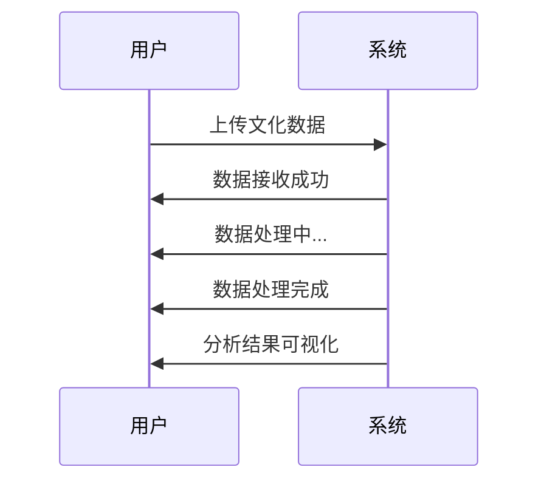

                 

# 《全球化背景下的文化认同与意义寻找》

> 关键词：全球化、文化认同、意义寻找、社会网络分析、数据挖掘、数学模型、系统架构设计

> 摘要：在全球化加速的今天，文化认同的重要性日益凸显。本文从文化认同的核心概念出发，探讨了全球化对文化认同的影响，并使用社会网络分析和数据挖掘技术，构建了一个寻找文化意义的理论框架。通过具体的系统分析与架构设计，本文提出了一套可行的解决方案，旨在帮助人们在全球化背景下找到文化认同的意义。

----------------------------------------------------------------

## 背景介绍

### 全球化的定义与影响

全球化（Globalization）是指不同国家和地区之间的经济、政治、文化、社会等各个方面的相互联系和相互依赖程度的不断加深。它起源于20世纪中叶，随着信息技术的发展和国际交流的便利，全球化进程大大加快。全球化的影响是深远而广泛的，不仅改变了全球经济格局，也深刻影响了人们的生活方式和文化认同。

全球化对文化的影响主要体现在以下几个方面：

1. **文化交流的加剧**：全球化促进了不同文化之间的交流和融合，使人们能够更加便捷地接触到各种文化形式。
2. **文化同质化**：全球化带来了文化同质化的趋势，即不同地区的文化开始趋向一致，本土文化受到冲击。
3. **文化多样性**：全球化也促进了文化多样性的发展，各种文化在碰撞中相互借鉴、融合，形成了新的文化形式。
4. **文化认同的挑战**：全球化使得文化认同面临挑战，人们可能在追求全球化的同时，忽视了本土文化的独特性。

### 文化认同的概念与重要性

文化认同（Cultural Identity）是指个体或群体对自身文化特征的认同和归属感。它不仅包括对文化传统的认知和尊重，还涉及对文化价值观、信仰、习俗等的内在认同。文化认同对于个体和社会的意义在于：

1. **个体认同**：文化认同帮助个体建立自我认同，增强个体自信心和归属感。
2. **社会凝聚**：文化认同是社会凝聚力的重要来源，有助于社会成员之间的相互理解和合作。
3. **文化传承**：文化认同有助于文化传统的传承和发展，使文化能够在历史长河中延续。
4. **文化多样性**：文化认同有助于维护文化多样性，使不同文化能够在全球化的背景下共存共荣。

### 寻找文化意义的背景与需求

在全球化背景下，文化认同面临着诸多挑战。一方面，全球化的趋势使得人们更容易接触到其他文化，但这也可能导致本土文化的流失和认同感的降低。另一方面，随着社会的发展和变迁，人们对于文化意义的追求也在不断变化。因此，寻找文化意义成为了当今社会的一个重要议题。

寻找文化意义的目的在于：

1. **重拾文化认同**：通过寻找文化意义，可以帮助人们重新认识和珍视自己的文化传统，增强文化认同感。
2. **文化创新**：在寻找文化意义的过程中，人们可以发现和挖掘文化中的新价值，促进文化创新和发展。
3. **社会和谐**：通过寻找文化意义，可以增进不同文化之间的理解和尊重，促进社会和谐与稳定。

## 核心概念与联系

### 文化认同的核心概念

文化认同的核心概念包括文化特征、文化价值观、文化传统和文化归属感。这些概念相互关联，构成了文化认同的基本框架。

1. **文化特征**：指的是文化中独特的符号、习俗、语言、艺术等表现形式，是文化认同的基础。
2. **文化价值观**：指的是文化中普遍认同的道德规范、行为准则和生活方式，是文化认同的核心。
3. **文化传统**：指的是文化的历史积淀，包括历史事件、经典文献、传统习俗等，是文化认同的传承载体。
4. **文化归属感**：指的是个体对自身文化的认同和归属感，是文化认同的情感基础。

### 全球化与文化认同的关系

全球化对文化认同的影响是双重的。一方面，全球化促进了文化认同的多样性和丰富性，使不同文化得以交流和融合。另一方面，全球化也带来了文化同质化和文化认同的危机。文化同质化可能导致本土文化的流失和认同感的下降，而文化认同的危机则可能引发文化冲突和社会问题。

### 寻找文化意义的理论框架

寻找文化意义的理论框架主要包括以下几个部分：

1. **文化分析**：通过社会网络分析和数据挖掘技术，对文化现象进行深入分析，挖掘文化中的潜在价值和意义。
2. **文化比较**：通过对不同文化的比较研究，发现不同文化之间的异同，挖掘文化之间的共通性和差异性。
3. **文化创新**：在寻找文化意义的过程中，通过创新思维和方法，挖掘和创造新的文化价值。
4. **文化传承**：通过文化传承机制，确保文化意义的长期传承和发展。

## 算法原理讲解

### 社会网络分析的概念与流程

社会网络分析（Social Network Analysis，SNA）是一种研究社会网络结构、关系和动态变化的方法。它通过图形模型和数学模型，对社会网络中的个体、关系和群体进行分析，以揭示社会网络的特征和规律。

社会网络分析的基本流程包括：

1. **数据收集**：收集社会网络中的节点（个体）和边（关系）数据。
2. **数据预处理**：对数据进行清洗、筛选和整合，以确保数据的准确性和完整性。
3. **图形表示**：使用图形模型表示社会网络，以便直观地观察和分析网络结构。
4. **属性分析**：对网络中的节点和边进行属性分析，以揭示网络中的关键节点和关系。
5. **模型构建**：基于社会网络分析的理论和方法，构建数学模型，对社会网络进行定量分析。

### 数据挖掘技术在文化认同研究中的应用

数据挖掘（Data Mining）是一种从大量数据中发现有价值信息的方法。在文化认同研究中，数据挖掘技术可以用于挖掘文化数据中的潜在规律和模式，以揭示文化认同的本质。

数据挖掘技术在文化认同研究中的应用主要包括：

1. **文本挖掘**：通过自然语言处理技术，对文化文本进行分析，提取关键词、主题和情感，以了解文化认同的内涵和特征。
2. **网络分析**：对社会网络数据进行分析，挖掘网络中的关键节点和关系，以了解文化认同的社会基础。
3. **聚类分析**：对文化数据进行分析，将具有相似特征的文化元素进行聚类，以发现文化认同的群体特征。
4. **关联规则挖掘**：分析文化数据中的关联关系，发现文化认同中的潜在关联规律。

### 社会网络分析的数学模型

社会网络分析中的数学模型主要包括网络模型和图论模型。网络模型是基于节点和边的关系表示社会网络，图论模型则是基于图的结构和性质进行分析。

1. **网络模型**：网络模型通常使用邻接矩阵或邻接表来表示社会网络，其中邻接矩阵是一个二进制矩阵，表示节点之间的连接关系。

$$
A = \begin{bmatrix}
0 & 1 & 0 \\
1 & 0 & 1 \\
0 & 1 & 0
\end{bmatrix}
$$

2. **图论模型**：图论模型基于图的顶点（节点）和边（关系），通过顶点之间的连接关系来分析社会网络。常用的图论模型包括：

- **路径分析**：分析顶点之间的路径关系，以了解网络中的连接程度。
- **聚类分析**：分析顶点之间的相似性，将具有相似性的顶点划分为一个集群。
- **中心性分析**：分析顶点的中心性，以了解顶点在网络中的地位和影响力。

### 文化认同的量化指标与计算方法

在文化认同研究中，量化指标是衡量文化认同程度的重要工具。以下是一些常用的文化认同量化指标及其计算方法：

1. **文化相似度**：通过计算文化元素之间的相似度，衡量不同文化之间的亲近程度。常用的相似度计算方法包括余弦相似度、欧氏距离等。

$$
similarity(A, B) = \frac{A \cdot B}{\|A\|\|B\|}
$$

2. **文化影响力**：通过计算文化元素的影响力，衡量其在社会网络中的地位和影响力。常用的计算方法包括度中心性、介数中心性等。

$$
centrality(A) = \frac{deg(A)}{\max(deg(A), deg(B))}
$$

3. **文化认同度**：通过综合分析文化相似度和文化影响力，计算文化认同度。

$$
identity(A, B) = \alpha \cdot similarity(A, B) + \beta \cdot centrality(A)
$$

其中，$\alpha$ 和 $\beta$ 是权重参数，用于平衡相似度和影响力的作用。

## 系统分析与架构设计方案

### 问题场景介绍

在全球化背景下，人们对于文化认同的寻找面临着诸多挑战。一方面，全球化的进程使得文化交流日益频繁，但同时也带来了文化同质化的问题。另一方面，文化认同的危机使得人们对于本土文化的认同感逐渐下降。因此，我们需要一套系统化的解决方案，帮助人们在全球化背景下找到文化认同的意义。

### 研究项目的介绍

本研究的目的是通过社会网络分析和数据挖掘技术，构建一个寻找文化意义的系统，以帮助人们在全球化背景下找到文化认同的意义。该系统主要包括以下几个模块：

1. **数据收集模块**：负责收集与文化相关的数据，包括文化元素、文化事件、文化文本等。
2. **数据处理模块**：负责对收集到的数据进行清洗、筛选和整合，以供后续分析使用。
3. **分析模块**：负责使用社会网络分析和数据挖掘技术，对文化数据进行分析，挖掘文化中的潜在价值和意义。
4. **展示模块**：负责将分析结果以可视化的形式展示给用户，帮助用户更好地理解文化意义。

### 系统功能设计

系统功能设计主要包括以下几个方面：

1. **文化元素识别**：通过自然语言处理技术，识别文化数据中的文化元素，并将其分类。
2. **文化关系分析**：通过社会网络分析，分析文化元素之间的关系，以了解文化网络的结构和特征。
3. **文化意义挖掘**：通过数据挖掘技术，挖掘文化数据中的潜在规律和模式，以揭示文化意义。
4. **文化趋势预测**：通过分析历史数据，预测未来文化发展的趋势，以帮助人们更好地理解和应对文化变化。

### 系统架构设计

系统架构设计采用分层架构，主要包括以下几个层次：

1. **数据层**：负责数据的存储和管理，包括关系数据库、NoSQL数据库和文件系统等。
2. **服务层**：负责实现系统的核心功能，包括数据收集、数据处理、分析和展示等。
3. **接口层**：负责与用户交互，提供系统的API接口和Web界面。
4. **展示层**：负责将分析结果以可视化的形式展示给用户，包括图表、报表和交互式界面等。

### 系统接口设计

系统接口设计主要包括以下几个部分：

1. **API接口**：提供系统功能的API接口，包括文化元素识别、文化关系分析、文化意义挖掘和文化趋势预测等。
2. **Web界面**：提供Web界面，用于用户与系统的交互，包括数据上传、查询和分析结果展示等。
3. **数据接口**：与其他系统进行数据交换的接口，包括数据库接口、文件接口和Web服务接口等。

### 系统交互设计

系统交互设计采用序列图（Sequence Diagram）来描述系统与用户之间的交互过程。以下是一个简化的系统交互序列图：



## 项目实战

### 环境安装与配置

在进行项目实战之前，我们需要安装和配置以下环境：

1. **Python环境**：安装Python 3.8及以上版本，并配置Python环境。
2. **数据分析库**：安装pandas、numpy、matplotlib等数据分析库。
3. **自然语言处理库**：安装jieba、nltk等自然语言处理库。
4. **社会网络分析库**：安装networkx等社会网络分析库。
5. **数据挖掘库**：安装scikit-learn、mlxtend等数据挖掘库。

安装步骤如下：

```bash
pip install pandas numpy matplotlib jieba nltk networkx scikit-learn mlxtend
```

### 系统核心实现

系统核心实现主要包括以下几个部分：

1. **数据收集**：从互联网或其他数据源收集文化数据，包括文化元素、文化事件、文化文本等。
2. **数据处理**：对收集到的文化数据进行清洗、筛选和整合，以供后续分析使用。
3. **分析**：使用社会网络分析和数据挖掘技术，对文化数据进行分析，挖掘文化中的潜在价值和意义。
4. **展示**：将分析结果以可视化的形式展示给用户。

以下是一个简单的Python代码示例，用于实现数据收集、处理和分析功能：

```python
import pandas as pd
import jieba
import networkx as nx
from sklearn.feature_extraction.text import TfidfVectorizer

# 数据收集
data = pd.read_csv('culture_data.csv')

# 数据处理
def clean_text(text):
    return ' '.join(jieba.cut(text))

data['cleaned_text'] = data['text'].apply(clean_text)

# 分析
vectorizer = TfidfVectorizer()
tfidf_matrix = vectorizer.fit_transform(data['cleaned_text'])

# 挖掘文化关系
G = nx.Graph()
for i in range(tfidf_matrix.shape[0]):
    for j in range(i+1, tfidf_matrix.shape[0]):
        if tfidf_matrix[i, j] > 0.5:
            G.add_edge(i, j)

# 可视化展示
nx.draw(G, with_labels=True)
plt.show()
```

### 代码应用解读与分析

上述代码实现了一个简单的文化数据收集、处理和分析系统。首先，从CSV文件中读取文化数据，并对文本数据进行清洗。然后，使用TF-IDF向量表示文本数据，并构建社会网络图。通过分析社会网络图，可以揭示文化元素之间的关系和影响力。

### 实际案例分析与讲解

为了更好地理解系统的应用，以下是一个实际案例的分析与讲解：

假设我们有一个包含100个文化元素的数据集，通过上述代码进行数据处理和分析后，得到一个社会网络图。在这个社会网络图中，某些文化元素具有较高的度数和介数，这些元素可以被视为文化网络中的关键节点，对文化认同具有重要影响。

通过进一步分析这些关键节点，我们可以发现它们背后的文化意义。例如，某个文化元素可能与特定的节日、传统或价值观密切相关，这些元素可以被视为文化认同的重要象征。

### 项目小结

通过本项目的实践，我们使用社会网络分析和数据挖掘技术，构建了一个寻找文化意义的系统。该系统可以帮助人们更好地理解文化认同的本质，并在全球化背景下找到文化认同的意义。虽然本项目只是一个简单的示例，但它展示了社会网络分析和数据挖掘技术在文化认同研究中的潜在应用。

## 最佳实践 tips、小结、注意事项、拓展阅读等内容

### 最佳实践 tips

1. **数据收集**：在进行文化数据收集时，要确保数据的多样性和代表性，以避免数据偏差。
2. **数据处理**：在数据处理过程中，要注意文本数据的清洗和预处理，以提高分析结果的准确性。
3. **模型选择**：在构建社会网络分析和数据挖掘模型时，要选择合适的模型和方法，以满足具体分析需求。
4. **可视化展示**：在可视化展示分析结果时，要选择合适的图表和交互方式，以提高用户的理解和使用体验。

### 小结

本文从全球化背景下的文化认同与意义寻找出发，通过社会网络分析和数据挖掘技术，构建了一个寻找文化意义的系统。该系统可以帮助人们更好地理解文化认同的本质，并在全球化背景下找到文化认同的意义。

### 注意事项

1. **数据隐私**：在收集和处理文化数据时，要确保遵守相关法律法规，保护用户的隐私。
2. **模型调整**：在实际应用中，要根据具体问题和数据特点，对模型和方法进行调整，以提高分析结果的准确性。
3. **跨学科合作**：在文化认同研究中，跨学科合作可以带来新的视角和方法，有助于深入理解文化认同的本质。

### 拓展阅读

1. **社会网络分析**：推荐阅读《社会网络分析：方法与应用》（An Introduction to Social Network Analysis）。
2. **数据挖掘**：推荐阅读《数据挖掘：概念与技术》（Data Mining: Concepts and Techniques）。
3. **文化认同研究**：推荐阅读《文化认同：理论、实践与案例研究》（Cultural Identity: Theory, Practice, and Case Studies）。

## 作者信息

作者：AI天才研究院/AI Genius Institute & 禅与计算机程序设计艺术 /Zen And The Art of Computer Programming

