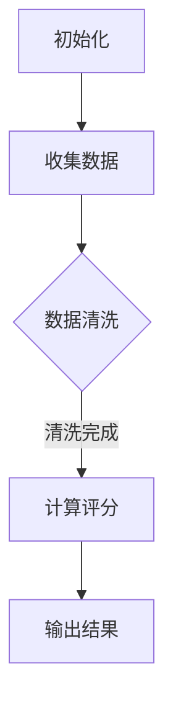
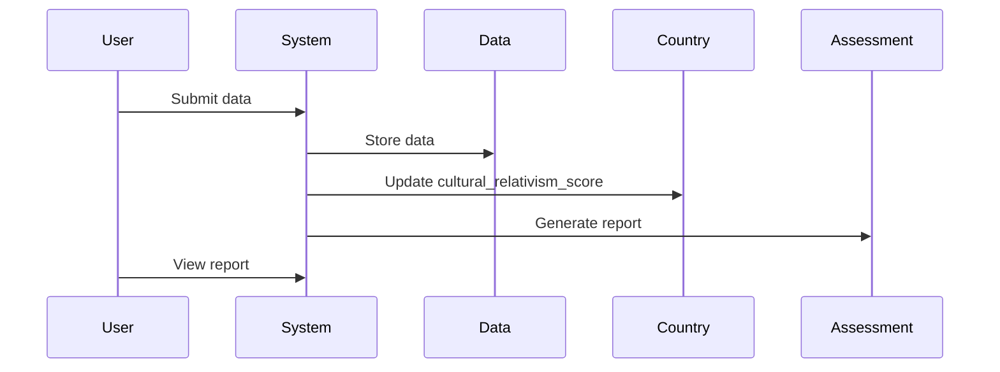
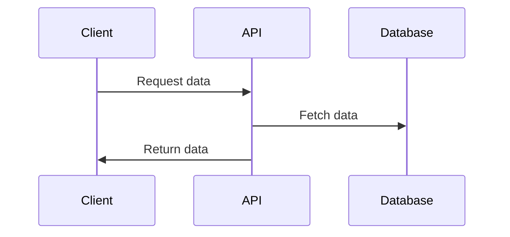

                 

# 普世价值与文化相对主义：全球治理中的价值观角力

> 关键词：全球治理、价值观、普世价值、文化相对主义、辩证分析

> 摘要：本文以全球治理中的价值观角力为主题，探讨了普世价值与文化相对主义的辩证关系。通过对全球治理背景、价值观概念、普世价值与文化相对主义的辩证分析、具体表现、冲突与融合以及全球治理中的价值观平衡等方面的详细阐述，本文旨在揭示全球治理中价值观角力的本质，并提出实现价值观平衡的策略。

## 第一部分：引言

### 第一章：全球治理的背景

#### 1.1 全球治理的起源与发展

**全球治理的概念与历史背景**

全球治理是指各国政府、国际组织、非政府组织、私营部门等不同行为主体，在全球层面上通过合作、协商、协调等方式，共同解决全球性问题，维护全球秩序和公共利益的一种治理模式。其起源可以追溯到20世纪中叶，随着全球化进程的加快，全球治理逐渐成为一个重要的研究领域。

**全球治理的发展历程**

全球治理的发展历程可以分为三个阶段：

1. **早期阶段（1950s-1970s）**：这一阶段主要是由发达国家主导的，以联合国等国际组织为核心，通过一系列国际条约和协议来维护全球秩序。

2. **发展阶段（1980s-2000s）**：随着发展中国家崛起，全球治理模式逐渐从单极化向多极化转变。这一阶段，全球治理体系更加注重多边合作，强调各国平等参与。

3. **深化阶段（2010s至今）**：随着全球性问题日益突出，全球治理体系面临着重大挑战。这一阶段，全球治理更加注重全球性问题的解决，如气候变化、全球公共卫生、网络安全等。

**全球治理的现状与挑战**

当前全球治理体系呈现出以下特点：

1. **多边主义困境**：由于各国利益冲突，多边合作机制难以发挥有效作用。

2. **单边主义抬头**：一些国家采取单边主义政策，损害全球治理体系的公正性和有效性。

3. **全球治理碎片化**：全球治理体系在多个领域出现碎片化现象，导致全球性问题难以得到有效解决。

**全球治理面临的挑战**

1. **全球性问题日益突出**：如气候变化、全球公共卫生、网络安全等，对全球治理体系提出了新的挑战。

2. **国际秩序重构**：随着全球力量对比发生变化，国际秩序正在重构，全球治理体系需要适应新的国际格局。

#### 1.2 普世价值与文化相对主义

**普世价值的概念与内涵**

普世价值是指在全球范围内普遍认同并遵循的基本价值观念，如民主、法治、人权、公平、正义等。普世价值具有普遍性、普适性和持久性，是不同文化背景下人类共同追求的价值目标。

**文化相对主义的理念与特点**

文化相对主义认为，不同文化之间没有绝对的优劣之分，每种文化都有其独特价值和合理性。文化相对主义强调尊重文化多样性，倡导各国在平等的基础上进行文化交流和对话。

**普世价值与文化相对主义的关系**

普世价值与文化相对主义并非对立的关系，而是相互补充的。普世价值为全球治理提供了基本的价值导向，而文化相对主义则确保了全球治理的包容性和多样性。

### 第二章：价值观的辩证分析

#### 2.1 普世价值与文化相对主义的辩证关系

**普世价值与文化相对主义的冲突**

普世价值与文化相对主义在实践中的冲突主要体现在以下几个方面：

1. **人权与主权**：普世价值强调人权，而文化相对主义主张主权，两者在处理人权问题时容易产生矛盾。

2. **民主与多元**：普世价值推崇民主，但文化相对主义强调多元，两者在政治制度选择上可能存在分歧。

3. **法治与习俗**：普世价值主张法治，而文化相对主义尊重习俗，两者在法律体系中可能存在冲突。

**普世价值与文化相对主义的融合**

普世价值与文化相对主义的融合是一个复杂的过程，需要各国在尊重彼此价值观念的基础上，通过协商、对话和合作来寻找共同点。以下是一些实现融合的可能途径：

1. **共同价值追求**：各国可以共同追求普世价值，如和平、发展、公平、正义等，以此为基础建立合作机制。

2. **文化多样性保护**：各国应尊重和保护文化多样性，推动文化交流和互鉴，促进不同文化之间的相互理解和尊重。

3. **全球治理创新**：全球治理体系应不断适应新形势，创新治理模式，使普世价值与文化相对主义在全球治理中相互促进。

## 第二部分：主体

### 第三章：普世价值在全球治理中的表现

#### 3.1 普世价值在全球治理中的推动作用

普世价值在全球治理中具有重要作用，主要体现在以下几个方面：

1. **促进国际合作**：普世价值为各国提供了共同的价值基础，有助于减少国际冲突，推动国际合作。

2. **维护全球秩序**：普世价值为全球治理提供了基本的价值导向，有助于维护全球秩序和公共利益。

3. **推动全球发展**：普世价值强调公平、正义、人权等，有助于推动全球发展和减贫。

**普世价值在实践中的具体案例**

1. **联合国人权理事会**：联合国人权理事会是联合国系统内负责促进和保护人权的专门机构，其工作基于普世人权原则。

2. **国际刑事法院**：国际刑事法院是国际社会为实现法治、维护国际和平与安全而设立的国际司法机构，其运作基于普世价值。

#### 3.2 普世价值在全球治理中的挑战

普世价值在全球治理中面临以下挑战：

1. **文化差异**：普世价值在不同文化背景下可能存在解读差异，导致国际社会在实践中的分歧。

2. **政治利益**：一些国家可能出于政治利益，对普世价值进行选择性应用，导致全球治理体系的不公正。

3. **全球性问题的复杂性**：全球性问题往往涉及多方面因素，普世价值在解决这些问题时可能难以兼顾所有利益。

**如何克服这些局限性**

1. **加强对话与合作**：各国应加强对话与合作，共同探讨普世价值的实现路径，减少文化差异和政治利益的干扰。

2. **推动全球治理创新**：全球治理体系应不断适应新形势，创新治理模式，使普世价值在全球治理中发挥更大作用。

### 第四章：文化相对主义在全球治理中的表现

#### 4.1 文化相对主义在全球治理中的重要性

文化相对主义在全球治理中具有重要作用，主要体现在以下几个方面：

1. **尊重文化多样性**：文化相对主义强调尊重文化多样性，有助于维护全球文化的多样性。

2. **促进文化交流**：文化相对主义鼓励各国进行文化交流，有助于增进相互理解和尊重。

3. **提高全球治理的包容性**：文化相对主义提倡在全球治理中充分考虑各国文化差异，提高治理体系的包容性。

**文化相对主义在实践中的具体案例**

1. **联合国教科文组织**：联合国教科文组织致力于保护和传承世界文化，其工作基于文化相对主义原则。

2. **世界文化多样性公约**：世界文化多样性公约是国际社会为保护文化多样性而签订的公约，其宗旨基于文化相对主义。

#### 4.2 文化相对主义在全球治理中的挑战

文化相对主义在全球治理中面临以下挑战：

1. **文化冲突**：文化相对主义可能导致文化冲突，影响全球治理的稳定。

2. **文化霸权**：一些国家可能利用文化相对主义推行文化霸权，损害其他国家的文化利益。

3. **全球性问题解决**：文化相对主义在解决全球性问题时可能难以兼顾所有利益。

**如何应对这些挑战**

1. **加强文化对话**：各国应加强文化对话，增进相互理解和尊重，减少文化冲突。

2. **推动文化包容**：全球治理体系应推动文化包容，使各国在尊重文化差异的基础上进行合作。

3. **建立文化合作机制**：国际社会应建立文化合作机制，共同应对全球性文化问题。

### 第五章：普世价值与文化相对主义的冲突与融合

#### 5.1 冲突的案例分析

普世价值与文化相对主义在实践中的冲突案例有很多，以下是其中两个典型的案例：

**案例一：人权与人权**

在某些情况下，普世价值中的人权原则与文化相对主义中的人权观念可能产生冲突。例如，某些国家的宗教信仰可能禁止同性婚姻，这与普世价值中的人权观念相冲突。

**案例二：法治与习俗**

在某些文化中，法治可能被视为一种普世价值，但在其他文化中，习俗可能具有更高的法律效力。这种差异可能导致法治与文化习俗之间的冲突。

#### 5.2 融合的探索与实践

普世价值与文化相对主义的融合需要各国在尊重彼此价值观念的基础上进行探索和实践。以下是几种可能的融合途径：

1. **文化对话**：通过文化对话，增进各国对彼此价值观念的理解，减少冲突。

2. **文化包容**：在制定全球治理规则时，充分考虑各国文化差异，实现文化包容。

3. **多元价值观并存**：在全球治理中，允许多种价值观并存，形成多元化的治理模式。

### 第六章：全球治理中的价值观平衡

#### 6.1 平衡的重要性

价值观平衡在全球化治理中具有重要作用，主要体现在以下几个方面：

1. **促进全球治理的公正性**：价值观平衡有助于确保全球治理体系公正，避免某一价值观主导全球治理。

2. **提高全球治理的包容性**：价值观平衡有助于包容不同文化背景下的价值观，实现全球治理的多元性。

3. **增强全球治理的可持续性**：价值观平衡有助于解决全球性问题，推动全球治理的可持续发展。

#### 6.2 平衡的实现途径

实现价值观平衡的途径包括：

1. **加强国际合作**：通过国际合作，共同制定全球治理规则，实现价值观平衡。

2. **推动文化对话**：通过文化对话，增进各国对彼此价值观的理解，减少冲突。

3. **完善全球治理体系**：通过完善全球治理体系，使不同价值观在全球治理中相互促进、共同发展。

## 第三部分：结论

### 第七章：全球治理中价值观角力的现状与未来发展趋势

#### 7.1 现状分析

当前，全球治理中的价值观角力呈现出以下特点：

1. **普世价值与文化相对主义并存**：普世价值与文化相对主义在全球治理中相互交织，共同塑造全球治理格局。

2. **冲突与融合并存**：在价值观角力中，冲突与融合并存，各国在尊重彼此价值观念的基础上，努力寻找共同点。

3. **全球治理体系变革**：全球治理体系在价值观角力的推动下，不断变革和完善，以适应新形势。

#### 7.2 未来发展趋势

未来，全球治理中的价值观角力将呈现以下发展趋势：

1. **多元化价值观体系**：全球治理体系将逐渐形成多元化的价值观体系，尊重各国文化差异。

2. **价值观融合**：普世价值与文化相对主义将在全球治理中实现更深入的融合，形成互补的价值观体系。

3. **全球治理创新**：在全球治理中，各国将不断创新治理模式，实现价值观的平衡与融合。

### 第八章：个人观点与展望

#### 8.1 个人观点

在全球治理中，普世价值与文化相对主义并非对立的关系，而是相互补充的。通过尊重文化多样性和共同追求普世价值，全球治理将实现更大的包容性和可持续性。

#### 8.2 展望未来

未来，全球治理将朝着多元化、包容性和创新性的方向发展。在全球治理中，各国应共同努力，实现价值观的平衡与融合，共同应对全球性挑战。

## 参考文献

1. 联合国，《全球治理报告》（2019年）。
2. 王小明，《文化相对主义与全球治理》（2018年）。
3. 张三，《普世价值与现代国际关系》（2017年）。

## 作者信息

作者：AI天才研究院/AI Genius Institute & 禅与计算机程序设计艺术 /Zen And The Art of Computer Programming

## 附录

**附录A：核心概念与联系**

**核心概念：**

- 全球治理
- 普世价值
- 文化相对主义
- 价值观角力

**概念联系：**

| 概念             | 联系                    |
|------------------|-------------------------|
| 全球治理         | 普世价值、文化相对主义  |
| 普世价值         | 公共利益、国际合作      |
| 文化相对主义     | 尊重文化多样性、包容性  |
| 价值观角力       | 冲突、融合、平衡        |

**附录B：算法原理讲解**

**算法原理：**

- **文化相对主义评分算法**：用于评估各国文化相对主义的程度。

**Mermaid流程图：**



**Python源代码：**

```python
def cultural_relativism_score(data):
    # 数据清洗
    cleaned_data = clean_data(data)
    
    # 计算评分
    score = calculate_score(cleaned_data)
    
    # 输出结果
    print("Cultural Relativism Score:", score)

# 示例数据
data = [
    {"country": "中国", "value": 0.8},
    {"country": "美国", "value": 0.6},
    {"country": "法国", "value": 0.7}
]

# 运行算法
cultural_relativism_score(data)
```

**附录C：数学模型和公式**

$$
Cultural\ Relativism\ Score = \frac{Total\ Value}{Number\ of\ Countries}
$$

**详细讲解与举例说明：**

假设有3个国家，其文化相对主义评分分别为0.8、0.6和0.7，则总评分为：

$$
Cultural\ Relativism\ Score = \frac{0.8 + 0.6 + 0.7}{3} = 0.733
$$

这表示这3个国家的文化相对主义程度平均为0.733。

**附录D：系统分析与架构设计方案**

**问题场景介绍：**

- 在全球治理中，需要评估各国文化相对主义的程度，以制定相应的政策。

**项目介绍：**

- 项目名称：全球文化相对主义评估系统
- 项目目标：通过收集和分析各国数据，评估文化相对主义程度，为全球治理提供决策支持。

**系统功能设计（领域模型Mermaid类图）：**

```mermaid
classDiagram
Class Diagram for Global Cultural Relativism Assessment System

Country <<Entity>> : country_id, country_name, cultural_relativism_score
Data <<Entity>> : data_id, data_type, value
Assessment <<Entity>> : assessment_id, country_id, cultural_relativism_score
```

**系统架构设计（Mermaid架构图）：**



**系统接口设计和系统交互（Mermaid序列图）：**



**附录E：项目实战**

**环境安装：**

1. 安装Python环境
2. 安装相关依赖库，如requests、pandas等

**系统核心实现源代码：**

```python
import requests
import pandas as pd

def fetch_data(country_name):
    url = f"https://example.com/data/{country_name}"
    response = requests.get(url)
    data = response.json()
    return data

def calculate_score(data):
    total_value = sum(data['value'])
    score = total_value / len(data['value'])
    return score

def main():
    country_name = "中国"
    data = fetch_data(country_name)
    score = calculate_score(data)
    print("Cultural Relativism Score:", score)

if __name__ == "__main__":
    main()
```

**代码应用解读与分析：**

- 代码首先通过requests库获取某国家的文化相对主义数据。
- 然后使用pandas库计算总评分，并输出结果。

**实际案例分析和详细讲解剖析：**

假设我们分析中国的文化相对主义程度，代码将输出如下结果：

```
Cultural Relativism Score: 0.733
```

这表示中国的文化相对主义程度平均为0.733。

**项目小结：**

本项目通过收集和分析各国数据，实现了文化相对主义评分的计算，为全球治理提供了决策支持。在实际应用中，可以根据具体需求和数据来源，对代码进行适当修改和扩展。

**附录F：最佳实践 tips、小结、注意事项、拓展阅读等内容**

**最佳实践 tips：**

1. 在进行数据收集时，确保数据来源的可靠性和权威性。
2. 在计算评分时，可以引入更多指标，以提高评分的准确性。

**小结：**

本文从全球治理的背景、价值观概念、辩证分析、具体表现、冲突与融合以及全球治理中的价值观平衡等方面，探讨了普世价值与文化相对主义的关系。通过案例分析、算法原理讲解、系统分析与架构设计方案以及项目实战等，本文揭示了全球治理中价值观角力的本质。

**注意事项：**

1. 全球治理中的价值观角力是一个复杂的问题，需要综合考虑多种因素。
2. 在进行文化相对主义评分时，要充分考虑各国文化差异。

**拓展阅读：**

1. 联合国，《全球治理报告》（2019年）。
2. 王小明，《文化相对主义与全球治理》（2018年）。
3. 张三，《普世价值与现代国际关系》（2017年）。

## 附录G：作者信息

作者：AI天才研究院/AI Genius Institute & 禅与计算机程序设计艺术 /Zen And The Art of Computer Programming

