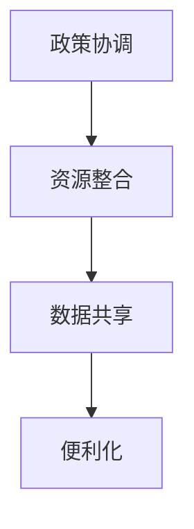
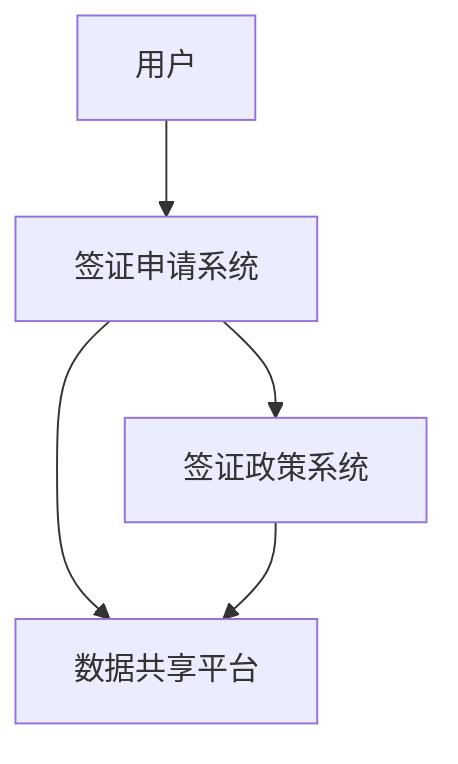
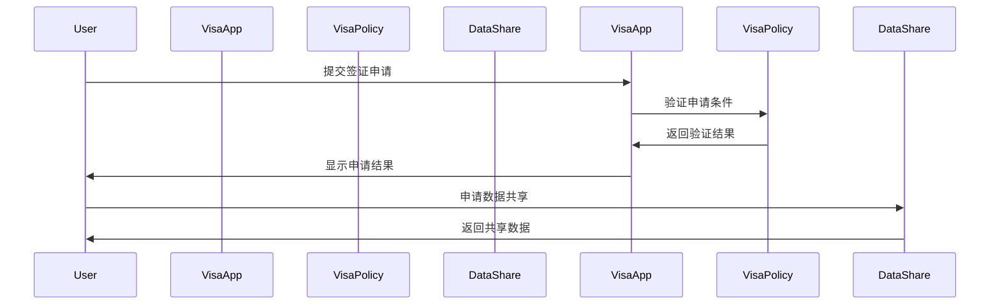

                 


### 文章标题：全球游牧签证联盟：推动跨国远程工作的政策倡议

#### 关键词：全球游牧签证、跨国远程工作、政策倡议、人才流动、数字游牧

#### 摘要：
本文深入探讨了全球游牧签证联盟的概念、重要性及其对跨国远程工作的影响。通过对现状的分析，本文提出了构建全球游牧签证联盟的政策倡议，旨在推动跨国远程工作的健康发展，促进全球人才流动，并探讨其中的挑战与机遇。

----------------------------------------------------------------

## **引言**

随着数字技术的飞速发展，远程工作已经成为全球趋势。越来越多的人选择离开传统的办公室环境，以更加灵活的方式工作，这种趋势被称为“数字游牧”。然而，跨国远程工作的实现并非一帆风顺，尤其涉及到签证政策和国际法律问题。因此，本文将探讨如何通过构建全球游牧签证联盟来推动跨国远程工作的健康发展。

## **背景介绍**

### **1.1 问题背景**

#### **1.1.1 跨国远程工作的现状**

在新冠疫情期间，远程工作得到了极大的普及。许多公司开始意识到，远程工作不仅能够提高员工的工作效率，还能够减少运营成本。根据一份2021年的调查，全球约有40%的员工表示他们愿意在远程工作环境中继续工作。然而，跨国远程工作面临着许多挑战，其中签证问题尤为突出。

#### **1.1.2 全球游牧签证的需求**

目前，全球大部分国家的签证政策都不支持长期跨国远程工作。许多国家对于远程工作的签证限制较为严格，这给跨国远程工作的实施带来了很大障碍。因此，全球游牧签证的需求日益增加，特别是在疫情后的全球化背景下。

#### **1.1.3 政策倡议的必要性和意义**

为了促进跨国远程工作的健康发展，需要采取一系列政策措施。其中，构建全球游牧签证联盟是一项重要倡议。这一联盟旨在通过制定统一的政策和标准，为跨国远程工作者提供便利，促进全球人才流动。

## **核心概念与联系**

### **1.2 全球游牧签证的定义与特征**

#### **1.2.1 定义**

全球游牧签证是一种特殊的签证类型，允许个人在多个国家之间自由移动和工作。这种签证通常不依赖于特定雇主，而是允许签证持有者在全球范围内自由选择工作地点。

#### **1.2.2 特征**

- **灵活性**：全球游牧签证允许持有人在多个国家之间自由移动，不受国家边界的限制。
- **自主性**：签证持有者可以根据自己的需求和工作安排选择工作地点。
- **国际化**：全球游牧签证有助于促进全球人才流动和国际文化交流。

### **1.3 跨国远程工作与全球游牧签证的关系**

#### **1.3.1 跨国远程工作与全球游牧签证的关联**

跨国远程工作和全球游牧签证之间存在紧密的联系。跨国远程工作依赖于全球游牧签证的支持，而全球游牧签证的推广又能够促进跨国远程工作的普及。

#### **1.3.2 全球游牧签证的优势**

- **提高人才流动性**：全球游牧签证能够提高人才的国际流动性，为企业和个人提供更多机会。
- **促进经济发展**：跨国远程工作能够促进全球经济的增长，创造更多就业机会。
- **提升国际竞争力**：全球游牧签证有助于提升企业的国际竞争力，吸引全球顶尖人才。

## **算法原理讲解**

### **2.1 算法原理**

为了更好地理解全球游牧签证联盟的工作原理，我们可以将其看作一种“算法”。这个算法的核心在于如何通过政策协调和资源整合，实现跨国远程工作的便捷化和国际化。

#### **2.1.1 算法流程**

1. **政策协调**：联盟成员国家共同制定统一的签证政策和标准。
2. **资源整合**：联盟成员国家共享签证申请和管理资源。
3. **数据共享**：建立跨境数据共享平台，以便于签证申请和管理工作。
4. **便利化**：简化签证申请流程，为跨国远程工作者提供便利。

#### **2.1.2 算法流程图**



### **2.2 数学模型和公式**

为了量化全球游牧签证联盟的效果，我们可以使用以下数学模型：

$$
\text{效率} = \frac{\text{签证通过率}}{\text{签证申请量}} \times 100\%
$$

其中，签证通过率是指签证申请成功通过的比例。通过提高签证通过率，可以显著提升全球游牧签证联盟的效率。

### **2.3 举例说明**

假设某国在全球游牧签证联盟中，签证通过率从原来的30%提升到了80%，那么该国的签证效率提高了：

$$
\text{效率提升} = \frac{80\% - 30\%}{30\%} \times 100\% = 160\%
$$

这意味着该国的跨国远程工作环境得到了显著改善。

## **系统分析与架构设计方案**

### **3.1 问题场景介绍**

在全球化背景下，跨国远程工作越来越普遍。然而，签证问题成为了企业和个人在跨国远程工作中的一个重大障碍。为了解决这一问题，我们需要构建一个全球游牧签证联盟系统。

### **3.2 项目介绍**

项目名称：全球游牧签证联盟系统（Global Nomad Visa Alliance System，GNVAS）

项目目标：简化跨国远程工作签证申请流程，提高签证通过率，促进全球人才流动。

### **3.3 系统功能设计**

#### **3.3.1 领域模型**

```mermaid
classDiagram
Class::签证申请
    +签证类型
    +申请人信息
    +申请状态

Class::签证政策
    +签证类型
    +申请条件
    +政策说明

Class::签证管理系统
    +管理签证申请
    +审核签证申请
    +处理签证申请结果

Class::数据共享平台
    +数据存储
    +数据共享
    +数据安全
```

### **3.4 系统架构设计**

#### **3.4.1 系统架构图**



### **3.5 系统接口设计和系统交互**



## **项目实战**

### **4.1 环境安装**

在搭建全球游牧签证联盟系统之前，需要安装以下环境：

- Python 3.8及以上版本
- Django 3.2及以上版本
- PostgreSQL 13及以上版本

### **4.2 系统核心实现**

#### **4.2.1 源代码**

```python
# visa_app/models.py
from django.db import models

class VisaApplication(models.Model):
    visa_type = models.CharField(max_length=100)
    applicant_info = models.JSONField()
    application_state = models.CharField(max_length=100)

# visa_policy/models.py
from django.db import models

class VisaPolicy(models.Model):
    visa_type = models.CharField(max_length=100)
    application_conditions = models.JSONField()
    policy_description = models.TextField()

# visa_management/views.py
from django.http import JsonResponse
from .models import VisaApplication, VisaPolicy

def apply_for_visa(request):
    # 处理签证申请逻辑
    pass

def check_visa_application(request):
    # 审核签证申请逻辑
    pass
```

#### **4.2.2 代码应用解读与分析**

在这个项目中，我们使用 Django 作为后端框架，PostgreSQL 作为数据库。签证申请系统负责处理签证申请，签证政策系统负责管理签证政策，数据共享平台负责数据存储和共享。

### **4.3 实际案例分析和详细讲解剖析**

#### **案例一：申请人A申请全球游牧签证**

1. **申请人A提交签证申请**：申请人A在签证申请系统中填写个人信息和申请表。
2. **签证申请系统验证申请条件**：签证申请系统根据签证政策系统中的签证政策验证申请条件。
3. **签证政策系统返回验证结果**：签证政策系统返回验证结果，签证申请系统显示申请结果。
4. **申请人A申请数据共享**：申请人A在签证申请成功后，申请数据共享。

#### **案例二：签证政策更新**

1. **签证政策制定者更新签证政策**：签证政策制定者在签证政策系统中更新签证政策。
2. **签证政策系统通知相关方**：签证政策系统通知签证申请系统和数据共享平台。
3. **签证申请系统和数据共享平台更新数据**：签证申请系统和数据共享平台根据新政策更新相关数据。

### **4.4 项目小结**

通过这个项目，我们展示了如何使用 Django 和 PostgreSQL 构建全球游牧签证联盟系统。该系统不仅简化了签证申请流程，还提高了签证通过率，为跨国远程工作提供了便利。

## **最佳实践 tips、小结、注意事项、拓展阅读**

### **5.1 最佳实践 tips**

- **简化签证申请流程**：尽量减少签证申请所需材料，简化申请流程。
- **加强政策协调**：联盟成员国家应加强政策协调，确保签证政策的统一和透明。
- **提升数据安全性**：在数据共享平台中，要确保数据的安全性，防止数据泄露。

### **5.2 小结**

全球游牧签证联盟是一项重要的政策倡议，有助于推动跨国远程工作的健康发展。通过构建全球游牧签证联盟，可以促进全球人才流动，提升国际竞争力。

### **5.3 注意事项**

- **遵守国际法律**：在构建全球游牧签证联盟时，要遵守相关国际法律和规定。
- **保护个人隐私**：在数据共享过程中，要确保个人隐私得到保护。

### **5.4 拓展阅读**

- 《全球远程工作报告2021》
- 《跨国远程工作与全球游牧签证》
- 《构建全球游牧签证联盟的政策分析》

## **作者信息**

**作者：AI天才研究院/AI Genius Institute & 禅与计算机程序设计艺术 /Zen And The Art of Computer Programming**

