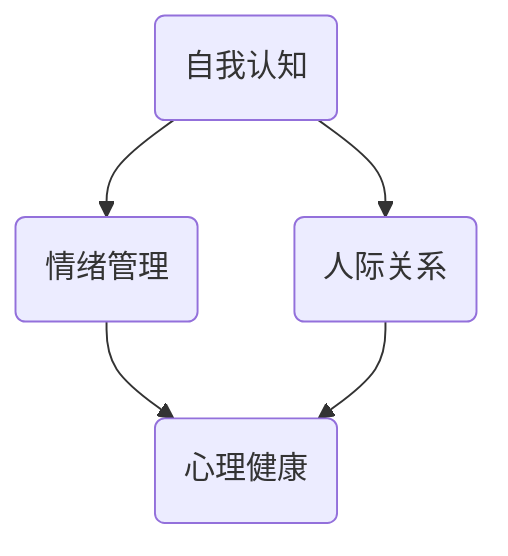
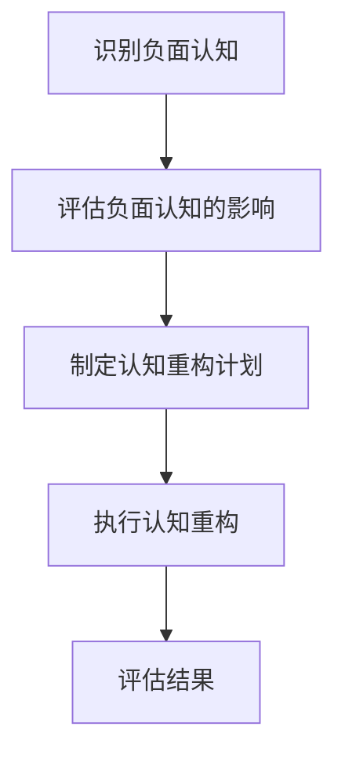
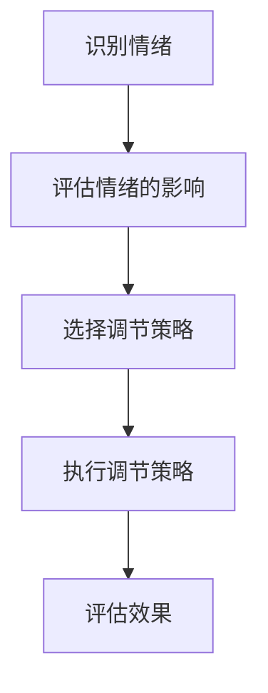

                 


# 内心世界的探索之旅：深入了解真实的自己

关键词：自我认知、情绪管理、人际关系、心理防御机制、内心世界探索

摘要：在现代社会中，人们面临诸多心理压力，对自我认知的需求日益增长。本文旨在为读者提供一种全面的内心世界探索之旅，通过系统的理论讲解和实用的实践方法，帮助读者深入了解自己的内心世界。文章分为四个部分，首先介绍心理学与内心世界探索的关系，其次分析核心概念与联系，然后讲解心理学原理与实践方法，最后探讨内心世界探索的实践方法。

### 第1章：导言

#### 1.1 内心世界的探索之旅

##### 1.1.1 问题背景与重要性

在现代社会中，随着生活节奏的加快、工作压力的增大，人们面临的心理压力也越来越大。同时，随着社会的发展，人们越来越重视心理健康，对自我认知的需求也越来越强烈。了解内心世界，不仅有助于提升生活质量，还能为个人的成长和发展提供有力支持。

然而，尽管存在诸多心理学理论和实践方法，很多人在探索内心世界时仍感到困惑和迷茫。如何科学、系统地深入了解真实的自己，成为一个亟待解决的问题。本文旨在为读者提供一种全面的内心世界探索之旅，通过系统的理论讲解和实用的实践方法，帮助读者深入了解自己的内心世界。

##### 1.1.2 心理学与内心世界探索

心理学是研究心理现象及其发生、发展的科学，包括意识、情感、行为等方面。心理学与内心世界探索有着密切的关系。通过心理学的研究，我们可以更好地理解自己的内心世界，从而更好地管理和调节自己的情绪，建立良好的人际关系。

心理学的基本概念与理论包括：

- **心理学定义**：心理学是研究心理现象及其发生、发展的科学，包括意识、情感、行为等方面。
- **心理学流派**：包括行为主义、认知主义、人本主义等，各自对内心世界的探索提供了不同的视角和理论支持。

### 第2章：核心概念与联系

在内心世界探索的过程中，我们需要了解一些核心概念，这些概念有助于我们更好地理解自己的内心世界。

##### 2.1 核心概念

**自我认知**、**情绪管理**、**人际关系**是内心世界探索的重要核心概念。

- **自我认知**：自我认知是个体对自己身份、特点、能力、价值观等方面的认知和理解。
- **情绪管理**：情绪管理是指个体通过认知和行为调节，使情绪处于积极状态，以适应环境和实现目标的过程。
- **人际关系**：人际关系是人与人之间的相互交往和相互作用，包括亲情、友情、爱情等。

这些核心概念之间存在着紧密的联系。例如，自我认知有助于我们更好地理解自己，从而更好地管理情绪；情绪管理能力对我们的心理健康和生活质量有着重要影响；良好的人际关系有助于我们获得支持和帮助，从而更好地实现个人目标。

##### 2.2 概念属性特征对比表格

| 特征           | 自我认知           | 情绪管理           | 人际关系           |
| -------------- | ------------------ | ------------------ | ------------------ |
| 定义           | 对自己的认知和理解 | 调节情绪的过程     | 人与人之间的相互作用 |
| 关系           | 核心概念           | 关键组成部分       | 社会交往的基础     |
| 属性特征对比表格 | -                 | -                 | -                 |

##### 2.3 ER实体关系图架构

为了更好地理解核心概念之间的联系，我们可以使用ER（实体关系）图来描述。以下是核心概念ER实体关系图的示例：



### 第3章：心理学原理与实践方法

在了解核心概念之后，我们需要掌握一些心理学原理和实践方法，这些方法有助于我们更好地探索自己的内心世界。

##### 3.1 认知行为疗法

认知行为疗法（CBT）是一种广泛应用于心理治疗的方法。它认为，个体的情绪和行为是由其认知过程决定的。通过改变负面的认知模式，可以改善情绪和行为。

**原理**：认知行为疗法（CBT）的原理可以分为三个主要部分：认知重构、行为实验和情绪调节。

1. **认知重构**：通过识别和挑战负面认知，改变个体的思维模式，从而改善情绪和行为。
2. **行为实验**：通过实践新的行为方式，验证新的认知，进一步巩固认知重构的效果。
3. **情绪调节**：通过调节情绪，使情绪处于积极状态，以适应环境和实现目标。

**流程图**：



##### 3.2 情绪调节技巧

情绪调节技巧帮助个体识别和表达情绪，从而更好地处理负面情绪。

**原理**：情绪调节技巧的原理主要包括情绪识别、情绪评估和情绪调节策略。

1. **情绪识别**：通过自我观察和反思，识别自己的情绪。
2. **情绪评估**：评估情绪的影响，确定需要调节的情绪。
3. **情绪调节策略**：选择合适的调节策略，如放松训练、认知重构、行为调整等，来调节情绪。

**流程图**：



### 第4章：内心世界探索的实践方法

在了解心理学原理之后，我们需要将理论知识应用到实践中，通过实践方法来探索自己的内心世界。

##### 4.1 日记写作

日记写作是一种常见的自我探索方法。通过记录日常生活和内心感受，可以帮助个体反思和认识自己。

**原理**：日记写作的原理主要包括自我反思和情感宣泄。

1. **自我反思**：通过记录自己的想法、感受和行为，反思自己的内心世界。
2. **情感宣泄**：通过书写，表达内心的情感，释放压力。

**示例**：

```
日期：2023年3月15日

今天在工作中遇到了一些挑战，感到有些沮丧。反思了一下，我发现这主要是因为我对自己的期望过高，导致在工作中感到压力。我决定调整自己的期望，以更积极的态度面对工作。

```

##### 4.2 冥想练习

冥想是一种通过专注于呼吸、身体感觉或特定对象来训练注意力和意识的方法。通过冥想，可以帮助个体放松身心，提高情绪调节能力。

**原理**：冥想的原理主要包括注意力训练、意识提升和情绪调节。

1. **注意力训练**：通过专注呼吸或特定对象，训练注意力和意识。
2. **意识提升**：通过冥想，提高对内心世界的认识和理解。
3. **情绪调节**：通过冥想，放松身心，减少压力，改善情绪。

**实践方法**：

1. **选择冥想环境**：选择一个安静、舒适的环境，避免干扰。
2. **设定冥想时间**：每天设定固定的冥想时间，如早晨或晚上。
3. **专注呼吸**：专注于呼吸，感受呼吸的节奏和身体的变化。

##### 4.3 心理咨询

心理咨询是一种专业的心理服务，通过与心理咨询师沟通，个体可以获得专业的心理支持和指导，帮助自己更好地了解和探索内心世界。

**原理**：心理咨询的原理主要包括心理支持、认知重构和情绪调节。

1. **心理支持**：通过心理咨询师的支持和理解，缓解个体的心理压力。
2. **认知重构**：通过心理咨询师的帮助，改变个体的认知模式，改善情绪和行为。
3. **情绪调节**：通过心理咨询师的方法，学会更好地调节情绪，提高心理健康水平。

**实践方法**：

1. **选择心理咨询师**：选择专业、有经验的咨询师。
2. **预约咨询时间**：与心理咨询师预约咨询时间。
3. **开放沟通**：在咨询过程中，开放沟通，分享自己的内心世界。

### 小结

通过本文的介绍，我们了解了内心世界的探索之旅，包括核心概念、心理学原理和实践方法。了解自己的内心世界，不仅可以提升生活质量，还能为个人的成长和发展提供有力支持。在探索内心世界的道路上，我们可以运用心理学原理和实践方法，通过日记写作、冥想练习和心理咨询等实践方法，深入了解自己的内心世界，实现自我成长和发展。

### 注意事项

在探索内心世界的过程中，我们需要注意以下几点：

1. **保护隐私**：在日记写作、心理咨询等实践中，注意保护个人隐私，避免泄露敏感信息。
2. **适度探索**：在探索内心世界的过程中，适度探索，避免过度依赖心理服务。
3. **专业支持**：在遇到心理问题时，寻求专业的心理咨询支持，避免自行解决问题。

### 拓展阅读

1. **《自我认知与情绪调节》**：了解自我认知和情绪调节的相关理论和方法，有助于深入探索内心世界。
2. **《心理学与生活》**：通过这本书，可以了解心理学的基本原理和实际应用，对内心世界的探索提供帮助。
3. **《心理学与生活》**：通过这本书，可以了解心理学的基本原理和实际应用，对内心世界的探索提供帮助。

### 作者信息

作者：AI天才研究院/AI Genius Institute & 禅与计算机程序设计艺术 /Zen And The Art of Computer Programming

### 文章目录

1. **导言**
   - **问题背景与重要性**
   - **心理学与内心世界探索**

2. **核心概念与联系**
   - **自我认知**
   - **情绪管理**
   - **人际关系**

3. **心理学原理与实践方法**
   - **认知行为疗法**
   - **情绪调节技巧**

4. **内心世界探索的实践方法**
   - **日记写作**
   - **冥想练习**
   - **心理咨询**

5. **小结**
6. **注意事项**
7. **拓展阅读**
8. **作者信息**

