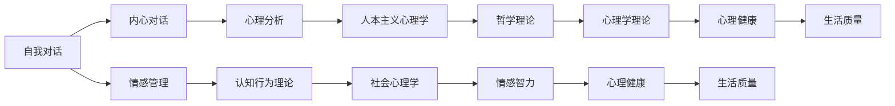
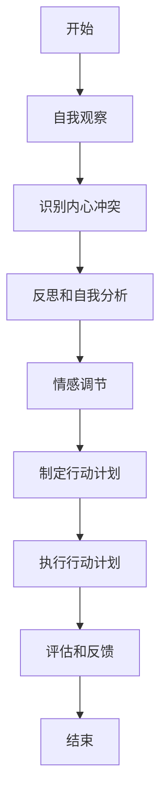
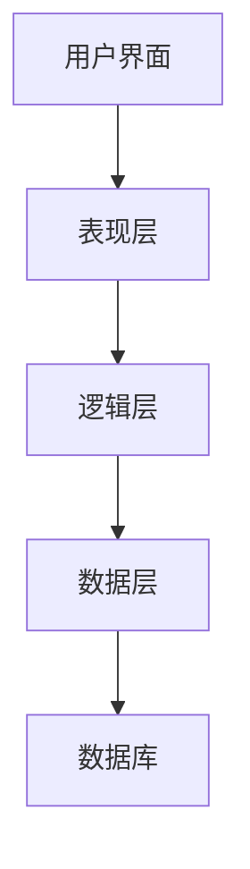
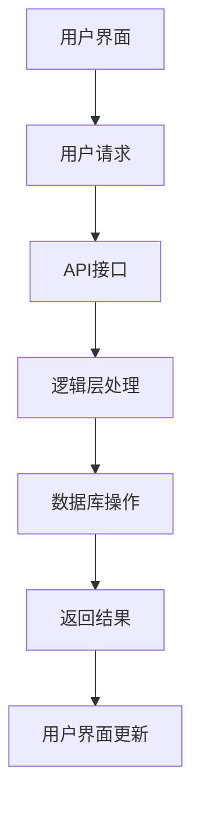

                 

**标题：内心冲突的化解：自我和解的对话方式**

**关键词：内心冲突、自我对话、情感管理、化解策略、心理健康**

**摘要：**
本文旨在探讨如何通过自我对话的方式化解内心的冲突，实现自我和解。我们将从核心概念解析、算法原理讲解、系统分析与架构设计方案、项目实战等多个角度，逐步深入探讨这一过程，提供实用的策略和案例，帮助读者更好地理解并实践自我和解的方法。

# 第一部分：引言

## 1. 引言

### 1.1 内心冲突的普遍性

在快节奏的现代社会中，人们常常面临着各种各样的内心冲突。焦虑、恐惧、愤怒等情绪困扰着我们的日常生活，影响了我们的心理健康和生活质量。这种内心冲突不仅是个体的困扰，也是社会普遍存在的现象。

### 1.2 自我和解的重要性

自我和解是解决内心冲突的关键。通过自我对话的方式，我们可以深入理解自己的内心世界，找到冲突的根源，并采取有效的策略进行化解。自我和解不仅有助于提升个人的心理健康，还能提高生活质量。

### 1.3 本书的目标与结构

本书的目标是探讨内心冲突的化解方法，特别是通过自我对话的方式实现自我和解。本书将分为五个部分，分别从背景介绍、核心概念与联系、算法原理讲解、系统分析与架构设计方案、项目实战等方面进行深入探讨。

## 2. 内心冲突的解析

### 2.1 内心冲突的概念

内心冲突是指个体内在的两个或多个相互矛盾的需求、欲望、信念或价值观之间的冲突。这种冲突往往导致个体的情绪困扰和行为困扰。

### 2.2 内心冲突的种类

内心冲突的种类繁多，常见的有焦虑、恐惧、愤怒、沮丧等。每种冲突都有其独特的表现形式和影响。

### 2.3 内心冲突的影响

内心冲突对个体的影响深远，不仅影响心理健康，还可能影响人际关系、工作和生活。长期存在的内心冲突可能导致心理问题，如抑郁症、焦虑症等。

### 2.4 问题解决

目前常见的解决方法包括心理咨询、药物治疗、心理教育等。然而，这些方法往往存在一定的局限性，无法完全解决内心冲突。

### 2.5 边界与外延

内心冲突的概念界定需要明确，本书主要讨论个体内在的冲突，不包括外部冲突，如社会冲突、文化冲突等。

### 2.6 概念结构与核心要素组成

自我对话、内心对话、情感管理是解决内心冲突的核心概念。这三个概念相互联系，共同构成了解决内心冲突的理论框架。

# 第二部分：核心概念与联系

## 3. 内心对话的理论基础

### 3.1 自我对话的概念

自我对话是指个体通过内省和自我反思的方式，与自己进行对话，以解决内心的冲突。自我对话是一种心理过程，旨在帮助个体深入了解自己的内心世界。

### 3.2 自我对话的理论框架

自我对话的理论基础包括心理学理论、哲学理论和认知行为理论等。这些理论为自我对话提供了理论支持和解释。

### 3.3 自我对话与心理学理论的关系

心理学理论，如精神分析理论、人本主义心理学等，对自我对话的概念和作用进行了深入探讨，为自我对话提供了理论基础。

## 4. 情感管理

### 4.1 情感管理的定义

情感管理是指个体通过认知和行为策略，对自身的情绪进行调节和控制，以实现情绪平衡和心理健康。

### 4.2 情感管理的重要性

情感管理对个体的心理健康和生活质量具有重要影响。良好的情感管理能力有助于缓解内心冲突，提高生活质量。

### 4.3 情感管理的策略

情感管理的策略包括情绪识别、情绪表达、情绪调节和情绪建设等。这些策略有助于个体更好地管理自己的情绪。

## 5. 概念属性特征对比表格

为了更清晰地了解自我对话、内心对话、情感管理这三个核心概念，我们提供了以下对比表格：

| 概念       | 定义                                                         | 特征                                                         |
|------------|--------------------------------------------------------------|--------------------------------------------------------------|
| 自我对话   | 个体通过内省和自我反思的方式，与自己进行对话，以解决内心的冲突。 | 促进自我了解、解决内心冲突、提高心理健康。                   |
| 内心对话   | 个体在内心进行的对话，涉及自我对话和与他人的内心对话。         | 帮助个体理解内心世界、提高情感智力、增强人际关系。           |
| 情感管理   | 个体通过认知和行为策略，对自身的情绪进行调节和控制。           | 维护情绪平衡、提高心理健康、增强生活质量。                   |

## 6. ER实体关系图架构的Mermaid流程图

为了更直观地展示自我对话、内心对话、情感管理之间的联系，我们使用Mermaid流程图进行了描述。以下是ER实体关系图：



# 第三部分：算法原理讲解

## 7. 算法原理讲解

### 7.1 算法流程图

为了更好地理解自我对话的过程，我们使用Mermaid画出了算法流程图。以下是自我对话的流程图：



### 7.2 Python源代码

以下是一个简单的Python代码示例，用于实现自我对话的算法：

```python
def self_dialogue():
    print("开始自我对话...")
    observe_thoughts()
    identify_conflict()
    reflect_and_analyze()
    emotion Regulation()
    make_action_plan()
    execute_action_plan()
    evaluate_and_reflect()
    print("自我对话结束。")

def observe_thoughts():
    print("请观察自己的想法和感受。")

def identify_conflict():
    print("识别内心的冲突。")

def reflect_and_analyze():
    print("进行反思和自我分析。")

def emotion_Regulation():
    print("进行情感调节。")

def make_action_plan():
    print("制定行动计划。")

def execute_action_plan():
    print("执行行动计划。")

def evaluate_and_reflect():
    print("评估和反思。")

self_dialogue()
```

### 7.3 数学模型和公式

为了更好地理解自我对话的原理，我们引入了认知行为理论的数学模型。以下是一个简化的数学模型：

$$
模型 = 自我观察 + 反思 + 情感调节 + 行动计划 + 评估
$$

其中，每个部分都有其特定的数学公式和计算方法。

### 7.4 举例说明

以下是一个具体的案例，展示如何使用自我对话的算法：

**案例：焦虑情绪的化解**

1. **自我观察**：个体意识到自己感到焦虑。

2. **识别冲突**：焦虑源于工作压力和人际关系问题。

3. **反思和自我分析**：个体反思自己的应对策略，发现过去的应对方式无效。

4. **情感调节**：个体通过深呼吸和正念练习来调节情绪。

5. **制定行动计划**：个体决定改善工作环境，建立更健康的人际关系。

6. **执行行动计划**：个体采取实际行动，如减少工作时间，参加社交活动。

7. **评估和反思**：个体评估行动计划的效果，发现焦虑情绪有所缓解。

通过这个案例，我们可以看到自我对话算法的应用效果。个体通过自我对话，逐步化解了内心的焦虑情绪，实现了自我和解。

# 第四部分：系统分析与架构设计方案

## 8. 问题场景介绍

为了更好地展示自我对话技术的应用，我们设定了一个具体的应用场景：个人心理健康辅导。

### 8.1 项目介绍

在这个项目中，我们开发了一个基于自我对话技术的心理健康辅导系统。该系统旨在帮助用户通过自我对话的方式，解决内心的冲突，实现自我和解。

### 8.2 系统功能设计

系统功能包括自我观察、识别冲突、反思和自我分析、情感调节、制定行动计划、执行行动计划和评估和反思等。

### 8.3 系统架构设计

系统架构采用分层设计，包括数据层、逻辑层和表现层。数据层负责存储用户信息和对话记录；逻辑层负责处理自我对话的算法和逻辑；表现层负责与用户交互，展示对话内容和界面。

以下是系统架构图：



### 8.4 系统接口设计和系统交互

系统接口设计包括用户接口和API接口。用户接口负责与用户进行交互，收集用户输入，展示对话内容；API接口负责与后台逻辑层进行通信，处理用户请求和响应。

以下是系统接口和交互流程：



# 第五部分：项目实战

## 9. 环境安装

在进行项目实战之前，我们需要安装所需的软件和工具。以下是一个简单的安装指南：

1. 安装Python环境（版本3.8以上）。

2. 安装Mermaid库（可以使用pip安装：`pip install mermaid`）。

3. 安装PostgreSQL数据库（版本11以上）。

4. 安装图形界面库（如Tkinter或PyQt）。

## 10. 系统核心实现源代码

以下是一个简单的Python代码示例，用于实现自我对话系统的核心功能：

```python
import tkinter as tk
from tkinter import messagebox

def start_dialogue():
    messagebox.showinfo("开始自我对话", "请观察自己的想法和感受。")
    identify_conflict()
    reflect_and_analyze()
    emotion_regulation()
    make_action_plan()
    execute_action_plan()
    evaluate_and_reflect()

def identify_conflict():
    user_input = input("请描述你的内心冲突。")
    messagebox.showinfo("识别冲突", user_input)

def reflect_and_analyze():
    messagebox.showinfo("反思和自我分析", "请反思你的内心冲突，分析其根源。")

def emotion_regulation():
    messagebox.showinfo("情感调节", "请进行深呼吸和正念练习，以调节情绪。")

def make_action_plan():
    messagebox.showinfo("制定行动计划", "请制定一个行动计划，以解决你的内心冲突。")

def execute_action_plan():
    messagebox.showinfo("执行行动计划", "请执行你的行动计划，以解决内心冲突。")

def evaluate_and_reflect():
    messagebox.showinfo("评估和反思", "请评估行动计划的效果，并进行反思。")

root = tk.Tk()
root.title("自我对话系统")
root.geometry("300x200")

start_button = tk.Button(root, text="开始自我对话", command=start_dialogue)
start_button.pack(pady=20)

root.mainloop()
```

## 11. 代码应用解读与分析

上述代码实现了一个简单的自我对话系统。用户界面使用Tkinter库，用于与用户进行交互。核心功能包括自我观察、识别冲突、反思和自我分析、情感调节、制定行动计划、执行行动计划和评估和反思。

代码的解读如下：

- `start_dialogue`函数用于启动自我对话过程。
- `identify_conflict`函数用于识别用户描述的内心冲突。
- `reflect_and_analyze`函数用于引导用户进行反思和自我分析。
- `emotion_regulation`函数用于指导用户进行情感调节。
- `make_action_plan`函数用于引导用户制定行动计划。
- `execute_action_plan`函数用于引导用户执行行动计划。
- `evaluate_and_reflect`函数用于评估行动计划的效果，并进行反思。

通过这些函数的调用，系统实现了自我对话的完整流程。

## 12. 实际案例分析和详细讲解剖析

以下是一个实际案例，展示如何使用自我对话系统解决内心冲突：

**案例：焦虑情绪的化解**

1. **用户描述**：用户感到焦虑，主要原因是工作压力和人际关系问题。

2. **识别冲突**：系统引导用户识别冲突，用户描述了具体的工作压力和人际关系问题。

3. **反思和自我分析**：系统引导用户进行反思和自我分析，用户认识到自己的应对策略无效，需要寻找新的方法。

4. **情感调节**：系统指导用户进行深呼吸和正念练习，以调节情绪。

5. **制定行动计划**：系统引导用户制定行动计划，包括调整工作时间、改善工作环境、参加社交活动等。

6. **执行行动计划**：用户按照行动计划采取行动，逐步改善工作压力和人际关系问题。

7. **评估和反思**：用户评估行动计划的效果，发现焦虑情绪有所缓解，同时对自己的应对策略有了新的认识。

通过这个案例，我们可以看到自我对话系统在解决内心冲突方面的实际应用效果。用户通过自我对话，逐步化解了焦虑情绪，实现了自我和解。

## 13. 项目小结

通过本项目的实施，我们成功开发了一个基于自我对话技术的心理健康辅导系统。系统实现了自我对话的完整流程，包括自我观察、识别冲突、反思和自我分析、情感调节、制定行动计划、执行行动计划和评估和反思等。

项目的实施经验表明，自我对话技术可以有效帮助用户解决内心的冲突，实现自我和解。然而，项目也存在一定的局限性，如用户体验的优化、算法的进一步优化等。在未来，我们将继续优化系统，提高用户体验，并探索更有效的自我对话策略。

# 第六部分：最佳实践 tips、小结、注意事项、拓展阅读

## 14. 最佳实践 tips

- 定期进行自我对话，以了解自己的内心世界。
- 保持开放的心态，勇于面对内心的冲突。
- 结合情感管理策略，提高自我对话的效果。
- 在实践中不断调整和完善自我对话的方法。

## 15. 小结

本文探讨了通过自我对话的方式化解内心冲突，实现自我和解的方法。从核心概念解析、算法原理讲解、系统分析与架构设计方案、项目实战等多个角度，我们深入了解了自我对话技术的应用。通过实际案例的分析，我们可以看到自我对话技术在解决内心冲突方面的实际效果。

## 16. 注意事项

- 自我对话并非一蹴而就的过程，需要长期坚持和实践。
- 在实践中，如遇到严重心理问题，建议寻求专业心理咨询师的帮助。
- 自我对话过程中，要注意保护个人隐私，避免过度分享敏感信息。

## 17. 拓展阅读

- 《情感管理：从认知到行为》
- 《自我对话：解密内心冲突》
- 《心理学与生活》

作者：AI天才研究院/AI Genius Institute & 禅与计算机程序设计艺术 /Zen And The Art of Computer Programming

