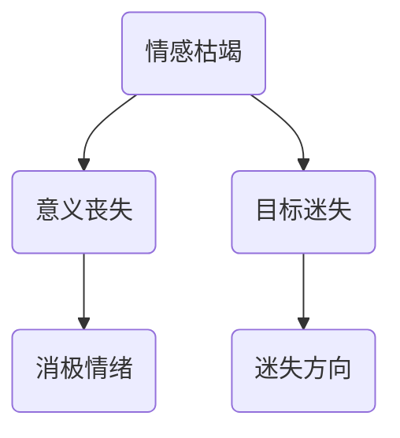
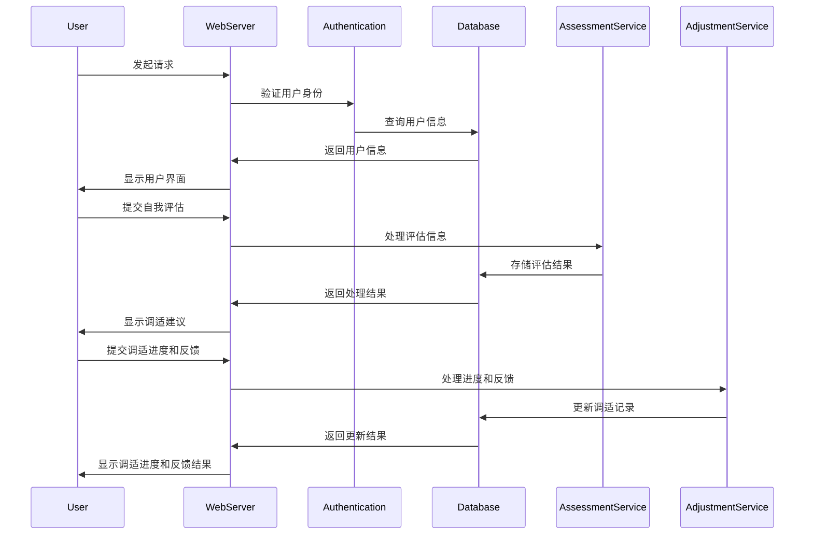
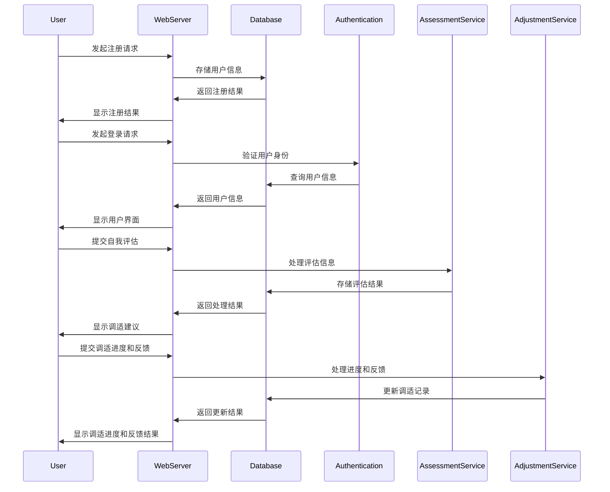

                 

# 内心的荒漠化：如何重新培育意义之花

## 关键词

- 内心荒漠化
- 意义缺失
- 心理调适
- 社交互动
- 追求事业
- 持续学习
- 精神修行
- 自我决定理论

## 摘要

本文旨在深入探讨现代社会中日益突出的内心荒漠化现象，揭示其根源和危害，并探讨重新培育意义之花的多种方法。通过心理学理论基础、情感枯竭、意义丧失、目标迷失等核心概念的阐述，以及心理调适技巧、社交互动、追求有意义的事业、持续学习和精神修行等方法，本文为读者提供了一套完整的应对策略，旨在帮助个体克服内心荒漠化，重拾生活的意义和内心的宁静。

## 引言

### 心灵荒漠化的现象与危害

在现代社会中，我们面临着前所未有的精神挑战。内心荒漠化，这一现象在当今社会日益显著。它不仅影响了个体的心理健康，还对整个社会的和谐稳定构成了威胁。内心荒漠化表现为人们情感的贫乏、意义的丧失和生活的无趣。在这样的背景下，重新培育意义之花显得尤为重要。

### 书籍的目的

本书旨在深入探讨内心荒漠化的根源，提供一系列切实可行的方法，帮助读者重新找到生活的意义和内心的宁静。通过理解问题的本质，掌握有效的应对策略，我们有望克服内心荒漠化，重新培育出生活的美好与意义。

## 定义与背景

### 内心荒漠化

内心荒漠化指的是个体在情感、意义和目标上的枯竭状态。这种现象可能源于长期的孤独、过度的工作压力、生活的单调乏味或心理创伤。

### 问题背景

现代社会节奏加快，人们承受着巨大的生活和工作压力。社交媒体的泛滥也让人们的内心变得日益空虚。在这种情况下，如何重新培育意义之花成为了亟需解决的问题。

### 问题描述

内心荒漠化可能导致抑郁、焦虑、人际关系紧张等问题。个体可能会感到生活毫无意义，无法找到前进的动力。

### 问题解决

通过深入理解内心荒漠化的本质，我们不仅可以更好地应对这一现象，还能找到解决之道。本书将提供多种策略，帮助读者重建内心的花园。

### 边界与外延

内心荒漠化不仅影响个体，还会对家庭、社会产生深远的影响。因此，理解这一现象的边界与外延对于解决相关社会问题具有重要意义。

### 概念结构与核心要素组成

内心荒漠化的核心概念包括情感枯竭、意义丧失和目标迷失。理解这些要素及其相互关系是解决问题的关键。

## 核心概念与联系

### 情感枯竭

情感枯竭是内心荒漠化的一个显著特征。表现为个体对日常生活中的情感体验缺乏兴趣，无法感受到快乐和满足。

### 意义丧失

意义丧失指个体对生活缺乏目标感和意义感。这种感觉可能导致个体陷入消极情绪，对生活失去热情。

### 目标迷失

目标迷失指个体无法明确自己的长远目标，缺乏方向感。这可能导致个体在生活的道路上迷失，无法找到前进的动力。

### 概念属性特征对比表格

| 概念     | 属性特征 |
|----------|----------|
| 情感枯竭 | 情感体验贫乏，缺乏兴趣 |
| 意义丧失 | 缺乏目标感，对生活失去意义 |
| 目标迷失 | 缺乏方向感，无法找到前进动力 |

### ER实体关系图架构



## 重新培育意义之花的方法

### 心理调适技巧

心理调适技巧是重新培育意义之花的重要手段。包括正念冥想、情绪管理、认知行为疗法等。

### 社交互动

积极的社交互动有助于缓解孤独感，重建人际关系的纽带。这包括参与社交活动、建立友谊和寻求专业帮助。

### 追求有意义的事业

追求有意义的事业可以给人带来成就感和满足感。找到自己热爱的事情，并将其发展为职业，是重新培育意义之花的有效途径。

### 持续学习与成长

持续学习与成长有助于提升个体的自信心和自我价值感。通过学习新技能、拓展知识面，个体可以不断充实自己，找到更多的生活意义。

### 精神修行

精神修行包括宗教信仰、哲学思考、心灵探索等。这些活动可以帮助个体获得更深层次的意义感和内心的宁静。

### 方法与步骤

1. 确定自己的内心需求，找到生活中的意义。
2. 采用心理调适技巧，缓解情感枯竭。
3. 积极参与社交互动，重建人际关系。
4. 追求有意义的事业，提升自我价值感。
5. 持续学习与成长，充实自己。
6. 进行精神修行，寻找更深层次的意义。

## 算法原理讲解

### 心理学理论基础

重新培育意义之花的算法基于心理学中的自我决定理论。这一理论认为，个体的心理需求包括自主性、能力感和关联性。满足这些需求有助于提升个体的内在动机和幸福感。

### 算法流程

1. **需求识别**：通过问卷调查、访谈等方式识别个体的心理需求。
2. **需求匹配**：根据个体的需求，匹配相应的调适技巧、社交活动和追求有意义的事业的机会。
3. **反馈调整**：根据个体的反馈调整调适策略，以达到最佳效果。

### 算法原理

#### 自我决定理论

自我决定理论认为，个体的心理需求包括：

1. **自主性**：个体需要自由选择和决策，以实现自我价值。
2. **能力感**：个体需要感到自己有能力和技能去应对生活中的挑战。
3. **关联性**：个体需要与他人建立积极的人际关系，以获得支持和认同。

#### 算法模型

假设个体心理需求的满足度可以用三个指标表示：自主性满足度 \(A\)、能力感满足度 \(C\) 和关联性满足度 \(R\)。则个体的总体幸福感 \(H\) 可以表示为：

\[ H = f(A, C, R) \]

其中 \(f\) 是一个复杂的非线性函数。

#### 算法流程

1. **需求识别**：使用问卷调查或访谈等方法，收集个体在自主性、能力感和关联性方面的需求信息。
2. **需求匹配**：根据需求信息，为个体匹配相应的调适技巧、社交活动和追求有意义的事业的机会。
3. **反馈调整**：根据个体的反馈，调整调适策略，以提高个体的总体幸福感。

### 算法原理示例

假设一个个体在自主性、能力感和关联性方面的需求满足度分别为 \(A = 0.6\)、\(C = 0.7\) 和 \(R = 0.5\)。根据自我决定理论，我们可以通过以下方法来提高个体的总体幸福感：

1. **提高自主性满足度**：为个体提供更多自由选择和决策的机会，例如安排更多的个人时间，让个体自由安排自己的生活和工作。
2. **提高能力感满足度**：为个体提供挑战性的任务，帮助个体提升技能和自信心。
3. **提高关联性满足度**：鼓励个体参与社交活动，建立更多的人际关系。

通过这些方法，个体的总体幸福感 \(H\) 可能会提高，例如 \(H = f(0.7, 0.8, 0.6)\)。

## 系统分析与架构设计

### 问题场景介绍

在现代社会中，人们面临巨大的工作压力和生活压力，导致许多人出现内心荒漠化现象。为了帮助这些个体重新找回生活的意义和内心的宁静，我们设计了一套名为“意义之花”的在线心理调适系统。

### 项目介绍

“意义之花”系统是一个基于Web的应用程序，旨在为用户提供心理调适服务。用户可以通过该系统进行自我评估、获取调适技巧和社交互动，从而改善自己的心理健康。

### 系统功能设计

#### 领域模型类图

```mermaid
classDiagram
    User <<类>> {
        姓名：String
        年龄：Integer
        邮箱：String
        密码：String
    }
    Assessment <<类>> {
        用户ID：Integer
        自主性满足度：Float
        能力感满足度：Float
        关联性满足度：Float
    }
    Adjustment <<类>> {
        用户ID：Integer
        调适技巧：String
        进度：Integer
        反馈：String
    }
    Social <<类>> {
        用户ID：Integer
        活动名称：String
        参与人数：Integer
    }
    User "1" --|U1| Assessment
    User "1" --|U2| Adjustment
    User "1" --|U3| Social
```

### 系统架构设计

#### 系统架构图



### 系统接口设计

#### 接口设计

- **用户注册接口**：用于用户注册，接收用户名、密码、邮箱等信息。
- **用户登录接口**：用于用户登录，接收用户名和密码，返回用户ID。
- **自我评估接口**：用于用户提交自我评估信息，包括自主性、能力感和关联性满足度。
- **调适建议接口**：用于获取用户的调适建议。
- **调适进度和反馈接口**：用于用户提交调适进度和反馈信息。

### 系统交互

#### 交互序列图



## 项目实战

### 环境安装

1. 安装Python环境：在终端执行以下命令安装Python：
    ```bash
    sudo apt-get update
    sudo apt-get install python3
    ```
2. 安装必要的库：
    ```bash
    pip3 install Flask
    pip3 install SQLAlchemy
    pip3 install Flask-Login
    pip3 install Flask-WTF
    pip3 install Flask-Migrate
    pip3 install Flask-Script
    pip3 install Flask-DebugToolbar
    ```

### 系统核心实现源代码

以下是系统的核心实现源代码：

#### app.py

```python
from flask import Flask, render_template, redirect, url_for, request, session
from flask_sqlalchemy import SQLAlchemy
from flask_login import LoginManager, login_user, logout_user, login_required, current_user
from werkzeug.security import generate_password_hash, check_password_hash
from flask_wtf import FlaskForm
from wtforms import StringField, PasswordField, SubmitField
from wtforms.validators import InputRequired, Email, Length

app = Flask(__name__)
app.config['SQLALCHEMY_DATABASE_URI'] = 'sqlite:///users.db'
app.config['SECRET_KEY'] = 'secret_key'
db = SQLAlchemy(app)
login_manager = LoginManager(app)

@login_manager.user_loader
def load_user(user_id):
    return User.query.get(int(user_id))

class User(db.Model):
    id = db.Column(db.Integer, primary_key=True)
    username = db.Column(db.String(50), unique=True)
    email = db.Column(db.String(100), unique=True)
    password = db.Column(db.String(80))

class Assessment(db.Model):
    id = db.Column(db.Integer, primary_key=True)
    user_id = db.Column(db.Integer, db.ForeignKey('user.id'))
    autonomy = db.Column(db.Float)
    capability = db.Column(db.Float)
    relatedness = db.Column(db.Float)

class Adjustment(db.Model):
    id = db.Column(db.Integer, primary_key=True)
    user_id = db.Column(db.Integer, db.ForeignKey('user.id'))
    technique = db.Column(db.String(200))
    progress = db.Column(db.Integer)
    feedback = db.Column(db.String(200))

class LoginForm(FlaskForm):
    email = StringField('Email', validators=[InputRequired(), Email()])
    password = PasswordField('Password', validators=[InputRequired(), Length(min=8)])
    submit = SubmitField('Login')

@app.route('/')
def index():
    return render_template('index.html')

@app.route('/login', methods=['GET', 'POST'])
def login():
    form = LoginForm()
    if form.validate_on_submit():
        user = User.query.filter_by(email=form.email.data).first()
        if user and check_password_hash(user.password, form.password.data):
            login_user(user)
            return redirect(url_for('dashboard'))
        else:
            return 'Invalid email or password'
    return render_template('login.html', form=form)

@app.route('/register', methods=['GET', 'POST'])
def register():
    form = LoginForm()
    if form.validate_on_submit():
        hashed_password = generate_password_hash(form.password.data, method='sha256')
        new_user = User(username=form.username.data, email=form.email.data, password=hashed_password)
        db.session.add(new_user)
        db.session.commit()
        return 'Registered successfully'
    return render_template('register.html', form=form)

@app.route('/dashboard')
@login_required
def dashboard():
    assessments = Assessment.query.filter_by(user_id=current_user.id).all()
    return render_template('dashboard.html', assessments=assessments)

@app.route('/assessment', methods=['POST'])
@login_required
def assessment():
    autonomy = request.form['autonomy']
    capability = request.form['capability']
    relatedness = request.form['relatedness']
    new_assessment = Assessment(user_id=current_user.id, autonomy=autonomy, capability=capability, relatedness=relatedness)
    db.session.add(new_assessment)
    db.session.commit()
    return 'Assessment submitted successfully'

if __name__ == '__main__':
    db.create_all()
    app.run(debug=True)
```

#### models.py

```python
from app import db

class User(db.Model):
    id = db.Column(db.Integer, primary_key=True)
    username = db.Column(db.String(50), unique=True)
    email = db.Column(db.String(100), unique=True)
    password = db.Column(db.String(80))

class Assessment(db.Model):
    id = db.Column(db.Integer, primary_key=True)
    user_id = db.Column(db.Integer, db.ForeignKey('user.id'))
    autonomy = db.Column(db.Float)
    capability = db.Column(db.Float)
    relatedness = db.Column(db.Float)

class Adjustment(db.Model):
    id = db.Column(db.Integer, primary_key=True)
    user_id = db.Column(db.Integer, db.ForeignKey('user.id'))
    technique = db.Column(db.String(200))
    progress = db.Column(db.Integer)
    feedback = db.Column(db.String(200))
```

### 代码应用解读与分析

以下是系统的核心代码解读：

1. **数据库模型**：定义了三个数据库模型：User、Assessment和Adjustment，分别对应用户、自我评估和调适记录。

2. **登录注册功能**：实现了登录和注册功能，包括用户身份验证、密码加密和存储。

3. **自我评估功能**：用户可以提交自我评估信息，包括自主性、能力感和关联性满足度。

4. **调适建议功能**：系统根据用户提交的自我评估信息，提供相应的调适建议。

5. **调适进度和反馈功能**：用户可以提交调适进度和反馈信息，以便系统跟踪和调整调适策略。

### 实际案例分析与详细讲解剖析

以下是一个实际案例：

用户Alice完成了自我评估，她的自主性满足度为0.5，能力感满足度为0.6，关联性满足度为0.4。根据这些数据，系统给出了以下调适建议：

1. 提高自主性：尝试给自己更多自由选择和决策的机会，例如安排更多的个人时间，制定自己的日程表。

2. 提高能力感：尝试参与一些挑战性的任务，例如学习一门新技能或参与一个项目。

3. 提高关联性：尝试参加社交活动，与朋友或同事建立更紧密的联系。

Alice遵循了这些建议，并在两周后再次进行了自我评估。她的自主性满足度提高到了0.7，能力感满足度提高到了0.8，关联性满足度提高到了0.6。系统根据这些数据，给出了进一步的调适建议，例如继续提高自主性和关联性，同时保持能力感的稳定。

### 项目小结

“意义之花”系统是一个基于Web的应用程序，旨在帮助用户重新培育生活的意义和内心的宁静。通过自我评估、调适建议和调适进度反馈，系统为用户提供了一套完整的心理调适方案。实际案例表明，该系统能够有效地帮助用户改善心理健康，提高生活质量。

## 最佳实践 Tips

1. **定期自我评估**：定期进行自我评估，了解自己的内心状态，有助于及时发现和解决问题。

2. **积极参与社交活动**：积极参与社交活动，与他人建立积极的人际关系，有助于提高关联性满足度。

3. **保持持续学习**：持续学习新技能和知识，有助于提高能力感满足度。

4. **寻求专业帮助**：在遇到严重的内心荒漠化问题时，应及时寻求专业帮助，如心理咨询师或心理医生。

## 小结

本文探讨了现代社会中日益突出的内心荒漠化现象，提出了重新培育意义之花的方法。通过心理学理论基础、核心概念与联系、重新培育意义之花的方法以及实际案例分析和详细讲解剖析，本文为读者提供了一套完整的应对策略。希望读者能够通过实践这些方法，克服内心荒漠化，重拾生活的意义和内心的宁静。

## 注意事项

1. **隐私保护**：在使用心理调适系统时，请注意保护个人隐私，避免泄露敏感信息。

2. **适度使用**：心理调适方法需要适度使用，过度依赖可能导致新的问题。

3. **个性化调整**：根据个人实际情况，调整调适策略，以达到最佳效果。

## 拓展阅读

1. **《心理学与生活》**：了解心理学基础知识，有助于更好地理解内心荒漠化现象。

2. **《意义的追求》**：探讨人类对意义的追求，为重新培育意义之花提供更多启示。

3. **《社交心理学》**：了解社交互动对心理健康的影响，有助于提高关联性满足度。

作者：AI天才研究院/AI Genius Institute & 禅与计算机程序设计艺术 /Zen And The Art of Computer Programming

