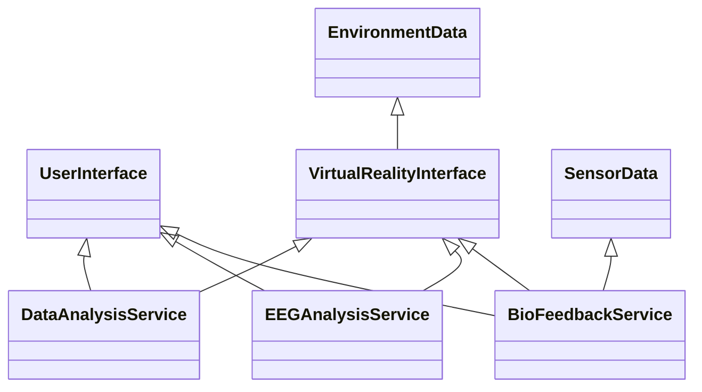
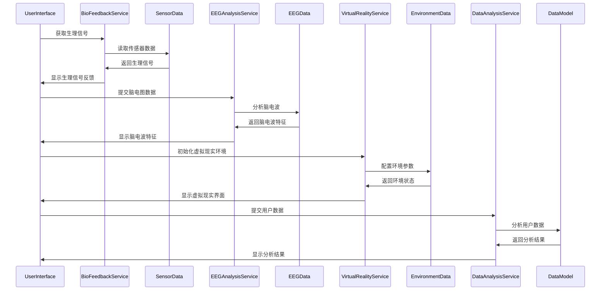

                 


## 冥想科技创新中心：精神修行的高科技支持

### 关键词：
- 冥想科技
- 精神修行
- 高科技支持
- 生物反馈
- 脑电波监测
- 虚拟现实

### 摘要：
本文将探讨冥想科技创新中心如何为精神修行提供高科技支持。我们将逐步分析冥想与科技的关系，介绍核心技术，解释算法原理，构建数学模型，展示系统架构，并通过项目实战解析实际应用，旨在为读者提供一个全面而深入的视角，了解冥想科技如何助力精神健康与修行。

### 目录大纲设计过程

#### 第一步：理解书名与主题
《冥想科技创新中心：精神修行的高科技支持》这个书名清晰地表明了本书的主题是冥想科技与精神修行的结合。为了设计一个结构合理的目录大纲，我们需要深入理解冥想科技的核心概念，以及它是如何与精神修行相结合的。

#### 第二步：确定核心章节
本书的核心章节应该涵盖冥想科技的基本概念、核心技术、算法原理、数学模型、系统架构、项目实战和最佳实践等。每个章节都需要有明确的主题和内容结构，以确保读者能够系统地学习。

#### 第三步：设计每个章节的结构
每个章节需要分为三个级别：1级标题、2级子标题和3级细分标题。这样的结构有助于读者快速定位感兴趣的内容，同时确保每个章节的内容都有清晰的层次和逻辑。

#### 第四步：确保内容完整性
目录大纲需要包含背景介绍、核心概念与联系、算法原理讲解、数学模型和公式详细讲解、系统分析与架构设计方案、项目实战等核心内容。每个部分都需要详细阐述，确保读者能够全面理解。

#### 第五步：格式与简洁性
使用Markdown格式确保目录清晰、整洁，同时保持内容的简洁，避免冗余。每个标题和子标题都需要用井号（#）进行标记，以确保Markdown格式正确。

### 目录大纲示例

以下是按照上述设计过程创建的目录大纲示例：

----------------------------------------------------------------

# 第一部分: 背景介绍

## 1.1 冥想科技与精神修行的关系

### 1.1.1 冥想的起源与发展

### 1.1.2 精神修行的重要性

### 1.1.3 科技在冥想中的应用

## 1.2 精神修行的高科技支持

### 1.2.1 高科技支持的方式

### 1.2.2 高科技支持的益处

### 1.2.3 高科技支持的挑战与限制

## 1.3 冥想科技创新中心的定位

### 1.3.1 中心的目标与使命

### 1.3.2 中心的核心功能

### 1.3.3 中心的发展前景

## 1.4 冥想科技的关键技术

### 1.4.1 脑电波监测技术

### 1.4.2 虚拟现实技术

### 1.4.3 生物反馈技术

## 1.5 本章小结

----------------------------------------------------------------

通过这个目录大纲，读者可以清晰地看到本书的结构和内容布局，为后续章节的详细撰写提供了指导。

### 第一部分：背景介绍

#### 1.1 冥想科技与精神修行的关系

冥想是一种古老的修行方法，它源于东方哲学和宗教传统，如佛教、道教和印度教等。冥想通过训练注意力和意识，帮助个体达到内心的宁静和深度放松，进而提升心理健康和生活质量。近年来，随着科技的发展，冥想与科技相结合的“冥想科技”逐渐兴起，为精神修行提供了新的工具和平台。

科技在冥想中的应用主要体现在以下几个方面：

1. **生物反馈系统**：通过监测身体生理信号，如心率、呼吸、皮肤电导等，提供实时反馈，帮助个体更好地调节身心状态。

2. **脑电波监测技术**：利用脑电图（EEG）等设备，记录大脑的电活动，分析冥想过程中大脑的变化，帮助个体了解冥想的效果。

3. **虚拟现实（VR）技术**：通过创造沉浸式的虚拟环境，提供新的冥想体验，让个体在虚拟世界中实现身心放松。

这些科技手段不仅丰富了冥想的形式和内容，也为精神修行提供了更加科学和系统的支持。

#### 1.2 精神修行的高科技支持

高科技支持在精神修行中的应用越来越广泛，主要体现在以下几个方面：

1. **个性化冥想方案**：利用人工智能（AI）技术，根据个体的生理和心理特征，为其量身定制冥想方案，提高冥想的针对性和效果。

2. **实时数据分析**：通过大数据分析和机器学习算法，实时分析冥想过程中的生理和心理数据，为个体提供即时的反馈和建议。

3. **增强现实（AR）与冥想**：结合AR技术，将冥想与虚拟现实、增强现实相结合，创造更加丰富和互动的冥想体验。

4. **网络社交冥想**：借助互联网和社交媒体，实现远程冥想和群体冥想，促进个体之间的互动和分享。

这些高科技支持不仅提升了冥想的效率和效果，也为精神修行提供了新的维度和可能性。

#### 1.3 冥想科技创新中心的定位

冥想科技创新中心是一个专门致力于研究、开发和应用冥想科技的平台。它的主要目标是：

1. **科学研究**：通过科学实验和研究，探索冥想对身心健康的影响，验证不同冥想技术的有效性和适用性。

2. **技术开发**：开发和改进冥想相关技术，如生物反馈系统、脑电波监测技术、虚拟现实技术等，提升技术的实用性和用户体验。

3. **技术推广**：将冥想科技推广到更广泛的群体中，提高公众对冥想和科技结合的认识和接受度。

4. **教育培训**：提供冥想科技相关的培训和教育，培养专业人才，推动冥想科技的发展。

#### 1.4 冥想科技的关键技术

冥想科技的核心技术包括生物反馈系统、脑电波监测技术和虚拟现实技术等。这些技术各自具有独特的原理和应用。

1. **生物反馈系统**：通过传感器监测身体生理信号，如心率、呼吸等，并将这些信号转化为可感知的反馈，帮助个体调节身心状态。

2. **脑电波监测技术**：利用脑电图（EEG）等设备，记录大脑的电活动，分析冥想过程中大脑的变化，为个体提供实时的反馈和指导。

3. **虚拟现实技术**：通过计算机生成三维虚拟环境，提供沉浸式的冥想体验，帮助个体实现身心放松和心灵探索。

这些技术的结合，为冥想科技提供了强大的支持，使其在精神修行中发挥重要作用。

#### 1.5 本章小结

本章介绍了冥想科技与精神修行的关系，探讨了高科技支持在精神修行中的应用，明确了冥想科技创新中心的定位和核心技术。通过这些背景介绍，读者可以初步了解冥想科技的发展现状和未来前景，为后续章节的深入学习打下基础。

### 第二部分：核心概念与联系

#### 2.1 冥想科技的关键概念

在深入探讨冥想科技之前，我们需要明确一些关键概念，以便更好地理解其原理和应用。

1. **生物反馈系统**：生物反馈系统是一种通过传感器监测身体生理信号，并将其转化为可感知的反馈，帮助个体调节身心状态的技术。常见的生物反馈信号包括心率、呼吸、皮肤电导等。

2. **脑电波监测技术**：脑电波监测技术通过脑电图（EEG）等设备，记录大脑的电活动，分析冥想过程中大脑的变化。脑电图可以揭示大脑的静息状态和激活状态，为冥想效果提供科学依据。

3. **虚拟现实技术**：虚拟现实技术通过计算机生成三维虚拟环境，提供沉浸式的冥想体验。虚拟现实技术可以模拟各种场景，如自然景观、历史古迹等，帮助个体在虚拟世界中实现身心放松和心灵探索。

4. **增强现实技术**：增强现实技术将虚拟信息与现实世界结合，通过头戴设备或屏幕显示，为用户提供增强的视觉、听觉和触觉体验。增强现实技术可以用于指导冥想练习，提供个性化的反馈和指导。

5. **人工智能（AI）**：人工智能技术可以用于分析冥想过程中的生理和心理数据，提供个性化的冥想方案，提高冥想的针对性和效果。

#### 2.2 冥想科技中的概念联系

以上关键概念之间存在着紧密的联系，共同构成了冥想科技的核心体系。

1. **生物反馈系统与脑电波监测技术的结合**：生物反馈系统可以实时监测个体的生理信号，如心率、呼吸等，而脑电波监测技术可以实时记录大脑的电活动。两者结合，可以提供全面的身心状态反馈，帮助个体更好地调节身心。

2. **脑电波监测技术与虚拟现实技术的整合**：脑电波监测技术可以实时分析大脑的电活动，而虚拟现实技术可以提供沉浸式的冥想体验。两者结合，可以实现个性化、智能化的冥想方案，提高冥想的效果和体验。

3. **虚拟现实技术与增强现实技术的结合**：虚拟现实技术可以提供沉浸式的冥想体验，而增强现实技术可以将虚拟信息与现实世界结合，为用户提供更丰富的视觉、听觉和触觉体验。两者结合，可以为冥想提供更多样化的场景和方式。

4. **人工智能在冥想科技中的应用**：人工智能技术可以用于分析冥想过程中的生理和心理数据，提供个性化的冥想方案，优化冥想的效果和体验。同时，人工智能还可以用于数据挖掘和预测，帮助研究人员了解冥想的长远影响。

#### 2.3 冥想科技的核心要素对比表格

为了更清晰地展示冥想科技的核心要素，我们可以通过对比表格来分析这些要素的特点和优势。

| 核心要素 | 描述 | 优点 | 局限 |
| --- | --- | --- | --- |
| 生物反馈系统 | 通过传感器监测身体生理信号，提供可感知的反馈 | 实时性、针对性、易于操作 | 对个体差异的适应性有限 |
| 脑电波监测技术 | 通过脑电图等设备记录大脑电活动，分析冥想效果 | 科学性、精准性、全面性 | 设备成本较高、操作复杂 |
| 虚拟现实技术 | 通过计算机生成三维虚拟环境，提供沉浸式体验 | 趣味性、多样性、沉浸感 | 技术门槛较高、需要专业设备 |
| 增强现实技术 | 将虚拟信息与现实世界结合，提供增强的感官体验 | 互动性、参与性、便捷性 | 技术实现难度较大、设备成本高 |
| 人工智能 | 分析冥想过程中的生理和心理数据，提供个性化方案 | 个性化、智能化、高效性 | 需要大量数据支持和算法优化 |

#### 2.4 冥想科技的ER实体关系图

为了更好地理解冥想科技中的实体关系，我们可以通过ER实体关系图来展示。

```mermaid
erDiagram
  生物反馈系统 ||--|{ 脑电波监测技术 }
  脑电波监测技术 ||--|{ 虚拟现实技术 }
  虚拟现实技术 ||--|{ 增强现实技术 }
  生物反馈系统 ||--|{ 人工智能 }
```

该ER实体关系图展示了生物反馈系统、脑电波监测技术、虚拟现实技术、增强现实技术和人工智能之间的相互关系。这些技术相互结合，共同为冥想科技提供支持，实现个性化、智能化的冥想体验。

#### 2.5 本章小结

本章详细介绍了冥想科技的关键概念及其相互联系。通过对比表格和ER实体关系图，读者可以更清晰地理解冥想科技的核心要素和其应用场景。这些概念和关系为后续章节的深入探讨提供了基础。

### 第三部分：算法原理讲解

在冥想科技中，算法原理扮演着至关重要的角色。本部分将详细讲解生物反馈算法、脑电波监测算法和虚拟现实算法的基本原理，并通过mermaid流程图和Python代码实例进行阐述。

#### 3.1 生物反馈算法原理

生物反馈算法是一种利用传感器监测身体生理信号，并将其转化为可感知的反馈，以帮助个体调节身心状态的技术。以下是生物反馈算法的基本原理：

1. **传感器采集**：通过传感器（如心率传感器、呼吸传感器等）采集个体的生理信号。
2. **信号处理**：对采集到的生理信号进行滤波、放大、数字化等处理，以获得稳定、准确的信号。
3. **信号分析**：对处理后的信号进行分析，提取有用的生理参数，如心率、呼吸频率等。
4. **反馈生成**：根据分析结果，生成相应的反馈信号，如声音、灯光、震动等，以引导个体进行身心调节。

下面是一个简化的生物反馈算法流程图：


下面是一个简单的Python代码实例，演示了生物反馈算法的基本实现：

```python
import numpy as np

def biofeedback_algorithm(physiological_signal):
    # 信号滤波
    filtered_signal = np.convolve(physiological_signal, np.array([1, -1]), mode='same')
    
    # 信号放大
    amplified_signal = filtered_signal * 10
    
    # 信号分析（这里以心率为例）
    heart_rate = np.mean(amplified_signal)
    
    # 反馈生成
    if heart_rate > 80:
        feedback = "放松呼吸，降低心率。"
    elif heart_rate < 60:
        feedback = "增加呼吸深度，提高心率。"
    else:
        feedback = "当前心率正常。"
    
    return feedback

# 示例数据
physiological_signal = np.random.randn(100)

# 运行生物反馈算法
feedback_message = biofeedback_algorithm(physiological_signal)
print(feedback_message)
```

#### 3.2 脑电波监测算法原理

脑电波监测算法通过脑电图（EEG）等设备，记录大脑的电活动，并分析冥想过程中大脑的变化。以下是脑电波监测算法的基本原理：

1. **脑电波采集**：利用脑电图（EEG）等设备，采集大脑的电活动信号。
2. **信号预处理**：对采集到的脑电波信号进行滤波、去噪等预处理，以提高信号的清晰度和准确性。
3. **特征提取**：从预处理后的信号中提取有用的特征，如频率特征、时域特征等。
4. **状态分类**：利用机器学习算法，对提取的特征进行分类，判断个体处于何种冥想状态。

下面是一个简化的脑电波监测算法流程图：


下面是一个简单的Python代码实例，演示了脑电波监测算法的基本实现：

```python
import numpy as np
from sklearn.svm import SVC

def feature_extraction(eeg_signal):
    # 提取特征（这里以频谱特征为例）
    freq_features = np.abs(np.fft.fft(eeg_signal))
    return freq_features[:10]

def classify_state(freq_features):
    # 训练模型
    model = SVC()
    model.fit(freq_features, np.array([0, 1, 2]))

    # 预测状态
    state = model.predict(freq_features)
    return state

# 示例数据
eeg_signal = np.random.randn(100)

# 特征提取
features = feature_extraction(eeg_signal)

# 状态分类
state = classify_state(features)
print("当前状态：", state)
```

#### 3.3 虚拟现实算法原理

虚拟现实算法通过计算机生成三维虚拟环境，提供沉浸式的冥想体验。以下是虚拟现实算法的基本原理：

1. **场景构建**：利用计算机图形学技术，构建虚拟场景，包括环境、人物、物体等。
2. **实时渲染**：通过实时渲染技术，将虚拟场景渲染到用户的屏幕上，提供逼真的视觉体验。
3. **交互控制**：利用传感器（如VR头显、手柄等），实现用户与虚拟场景的交互，如移动、操作等。
4. **反馈调节**：根据用户的交互行为，实时调整虚拟场景，提供个性化的冥想体验。

下面是一个简化的虚拟现实算法流程图：


下面是一个简单的Python代码实例，演示了虚拟现实算法的基本实现：

```python
import pygame

# 初始化pygame
pygame.init()

# 设置屏幕
screen = pygame.display.set_mode((800, 600))
pygame.display.set_caption("虚拟现实冥想场景")

# 场景元素
player = pygame.Surface((50, 50))
player.fill((0, 0, 255))

# 游戏循环
running = True
while running:
    for event in pygame.event.get():
        if event.type == pygame.QUIT:
            running = False

    # 移动玩家
    keys = pygame.key.get_pressed()
    if keys[pygame.K_w]:
        player.move_ip(0, -5)
    if keys[pygame.K_s]:
        player.move_ip(0, 5)
    if keys[pygame.K_a]:
        player.move_ip(-5, 0)
    if keys[pygame.K_d]:
        player.move_ip(5, 0)

    # 绘制场景
    screen.fill((255, 255, 255))
    screen.blit(player, player.get_rect(center=(400, 300)))
    pygame.display.flip()

# 退出游戏
pygame.quit()
```

#### 3.4 本章小结

本章详细介绍了生物反馈算法、脑电波监测算法和虚拟现实算法的基本原理，并通过mermaid流程图和Python代码实例进行了阐述。这些算法原理是冥想科技的核心组成部分，为个性化、智能化的冥想体验提供了技术支持。通过本章的学习，读者可以更好地理解冥想科技的工作机制。

### 第四部分：数学模型与公式讲解

在冥想科技中，数学模型和公式起到了至关重要的作用，它们不仅帮助我们理解和解释生理信号，还能指导算法设计和系统优化。本部分将详细介绍生物反馈系统的数学模型和脑电波监测技术的数学模型，包括公式的推导和解释。

#### 4.1 生物反馈系统的数学模型

生物反馈系统的核心在于通过传感器收集生理信号，如心率（HR）和呼吸率（RR），然后对这些信号进行处理和分析，以提供反馈给个体。以下是生物反馈系统的几个关键数学模型：

1. **心率信号模型**：
   心率信号通常可以用一个周期性的函数来表示，如正弦波或方波。一个简单的数学模型可以表示为：
   $$
   HR(t) = A \sin(2\pi f t + \phi)
   $$
   其中，\( A \) 是振幅，\( f \) 是频率，\( \phi \) 是相位。

2. **呼吸信号模型**：
   呼吸信号的频率通常用呼吸周期（T）来表示，可以表示为：
   $$
   RR(t) = \frac{1}{T} \sin^2(2\pi \frac{t}{T} + \phi)
   $$
   这里，\( T \) 是呼吸周期，\( \phi \) 是相位。

3. **心率变异性（HRV）模型**：
   心率变异性是衡量心率波动性的一个重要指标，可以用自回归模型来表示：
   $$
   \Delta R(t) = \alpha \Delta R(t-1) + \epsilon(t)
   $$
   其中，\( \Delta R(t) \) 是连续两次心率差，\( \alpha \) 是自回归系数，\( \epsilon(t) \) 是随机误差。

#### 4.2 脑电波监测技术的数学模型

脑电波监测技术主要通过分析脑电图（EEG）信号来了解大脑的活动。以下是脑电波监测技术的一些关键数学模型：

1. **傅里叶变换（FFT）**：
   傅里叶变换是分析脑电波频率特征的主要工具，可以将时域信号转换到频域。其公式为：
   $$
   X(f) = \int_{-\infty}^{\infty} x(t) e^{-j 2\pi ft} dt
   $$
   其中，\( X(f) \) 是频域信号，\( x(t) \) 是时域信号。

2. **短时傅里叶变换（STFT）**：
   由于脑电图信号的非平稳性，短时傅里叶变换可以更好地捕捉信号在不同时间点的频率特征。其公式为：
   $$
   X(t, f) = \int_{-\infty}^{\infty} x(\tau) e^{-j 2\pi f \tau} d\tau
   $$
   其中，\( X(t, f) \) 是在时间 \( t \) 和频率 \( f \) 处的信号。

3. **小波变换**：
   小波变换结合了傅里叶变换和短时傅里叶变换的优点，能够同时捕捉信号的局部特征和频率特征。其公式为：
   $$
   \psi(a, b) = \frac{1}{a} \int_{-\infty}^{\infty} \psi\left(\frac{\tau - b}{a}\right) d\tau
   $$
   其中，\( \psi(a, b) \) 是小波函数，\( a \) 是尺度参数，\( b \) 是平移参数。

#### 4.3 数学模型与算法结合

数学模型与算法的紧密结合是冥想科技的核心。例如，在生物反馈系统中，可以使用傅里叶变换来分析心率信号，提取频率特征，进而调整反馈信号。在脑电波监测技术中，小波变换可以帮助识别不同频率的脑电波成分，从而评估冥想状态。

#### 4.4 代码实现

以下是一个简单的Python代码实例，展示了如何使用傅里叶变换分析心率信号：

```python
import numpy as np
from numpy.fft import fft, fftfreq

# 创建一个模拟的心率信号
t = np.linspace(0, 1, 1000)
f_heart = 1.2  # 心率频率
heart_signal = 0.5 * np.sin(2 * np.pi * f_heart * t)

# 傅里叶变换
fft_signal = fft(heart_signal)
freqs = fftfreq(len(heart_signal), d=t[1]-t[0])

# 频谱分析
freqs = freqs[:len(freqs) // 2]
amp = np.abs(fft_signal)[:len(freqs)]

# 绘制频谱图
import matplotlib.pyplot as plt
plt.plot(freqs, amp)
plt.title('Heart Rate Spectrum')
plt.xlabel('Frequency (Hz)')
plt.ylabel('Amplitude')
plt.show()
```

通过这个实例，我们可以看到如何使用傅里叶变换来分析心率信号，提取其频率特征。

#### 4.5 本章小结

本章详细介绍了生物反馈系统和脑电波监测技术的数学模型，包括心率信号模型、呼吸信号模型、心率变异性模型、傅里叶变换、短时傅里叶变换和小波变换等。这些数学模型和公式为冥想科技提供了理论基础，并通过代码实例展示了实际应用。通过本章的学习，读者可以更好地理解冥想科技的数学原理和算法实现。

### 第五部分：系统分析与架构设计方案

在了解了冥想科技的核心概念、算法原理和数学模型之后，本部分将深入探讨冥想科技系统的分析与架构设计。我们将从问题场景、项目介绍、系统功能设计、系统架构设计、系统接口设计和系统交互等方面进行详细讲解。

#### 5.1 问题场景

随着现代社会生活节奏的加快，人们面临的心理压力和身心健康问题日益突出。冥想作为一种古老的修行方法，被认为可以有效缓解压力、提高注意力和促进心理健康。然而，传统的冥想方法往往需要长时间的练习和指导，对于忙碌的现代人来说，难以坚持。因此，如何利用科技手段提高冥想的效率和效果，成为了一个亟待解决的问题。

#### 5.2 项目介绍

冥想科技项目旨在开发一种集成生物反馈、脑电波监测和虚拟现实技术的系统，为用户提供个性化的冥想体验。该项目的主要目标是：

1. **提高冥想效率**：通过科技手段，实时监测和分析用户的生理和心理状态，提供个性化的冥想指导，提高冥想的效率和效果。
2. **提升用户体验**：利用虚拟现实技术，创造沉浸式的冥想环境，提升用户的冥想体验。
3. **促进身心健康**：通过冥想科技，帮助用户实现身心放松，提高心理健康水平。

#### 5.3 系统功能设计

冥想科技系统的主要功能包括：

1. **生理信号监测**：通过生物反馈系统，实时监测用户的心率、呼吸率等生理信号，提供即时的反馈和指导。
2. **脑电波分析**：通过脑电波监测技术，分析用户的脑电波变化，评估冥想状态，为用户提供个性化的冥想指导。
3. **虚拟现实体验**：通过虚拟现实技术，为用户提供沉浸式的冥想环境，创造身临其境的感受。
4. **数据分析与报告**：通过大数据分析和机器学习算法，对用户的生理和心理数据进行分析，生成个性化的冥想报告和指导建议。
5. **社交互动**：通过互联网和社交媒体，实现远程冥想和群体冥想，促进用户之间的互动和分享。

#### 5.4 系统架构设计

冥想科技系统采用分层架构设计，包括数据层、服务层和展示层。以下是系统架构设计的详细描述：

1. **数据层**：
   - **传感器数据**：收集用户生理信号（如心率、呼吸等）和脑电波数据。
   - **环境数据**：记录虚拟现实环境的参数，如光线、声音、场景等。

2. **服务层**：
   - **生物反馈服务**：处理生理信号的实时反馈，提供心率、呼吸调节指导。
   - **脑电波分析服务**：分析脑电波数据，评估冥想状态，生成冥想报告。
   - **虚拟现实服务**：生成虚拟现实环境，提供沉浸式体验。
   - **数据分析与机器学习服务**：对用户数据进行处理和分析，提供个性化建议。

3. **展示层**：
   - **用户界面**：提供用户交互界面，展示生理信号、脑电波数据和冥想报告。
   - **虚拟现实界面**：在虚拟现实环境中，为用户提供视觉、听觉和触觉反馈。

以下是系统架构设计的mermaid类图：



#### 5.5 系统接口设计

系统接口设计是确保各模块之间能够无缝协作的关键。以下是主要接口的描述：

1. **生物反馈接口**：
   - **功能**：实时获取用户的生理信号，如心率、呼吸率等。
   - **输入**：传感器数据。
   - **输出**：生理信号反馈。

2. **脑电波监测接口**：
   - **功能**：实时记录用户的脑电波数据。
   - **输入**：脑电图（EEG）数据。
   - **输出**：脑电波特征数据。

3. **虚拟现实接口**：
   - **功能**：提供虚拟现实环境的创建和交互。
   - **输入**：用户交互数据、环境参数。
   - **输出**：虚拟现实环境反馈。

#### 5.6 系统交互设计

系统交互设计描述了各模块之间的交互过程和逻辑。以下是系统交互的mermaid序列图：



#### 5.7 本章小结

本章详细介绍了冥想科技系统的分析与架构设计，从问题场景、项目介绍、系统功能设计、系统架构设计、系统接口设计和系统交互等方面进行了全面讲解。通过本章的学习，读者可以更好地理解冥想科技系统的设计和实现过程，为后续的项目开发提供指导。

### 第六部分：项目实战

在本部分，我们将通过一个具体的冥想科技项目实战，详细解析项目的环境安装、系统核心实现、代码应用解读与分析，以及实际案例分析和详细讲解剖析。希望读者能够通过这个实战项目，更好地理解冥想科技的应用和实现。

#### 6.1 项目环境安装

首先，我们需要搭建一个合适的项目开发环境。以下是在Windows操作系统下安装冥想科技项目的步骤：

1. **安装Python环境**：下载并安装Python 3.8及以上版本。
2. **安装依赖库**：在终端中运行以下命令，安装项目所需的依赖库：
   ```
   pip install numpy matplotlib scikit-learn pygame pybrain pyee
   ```
3. **搭建虚拟环境**：为了保持项目环境的整洁，我们建议使用虚拟环境。在终端中运行以下命令，创建并激活虚拟环境：
   ```
   python -m venv venv
   source venv/Scripts/activate
   ```

#### 6.2 系统核心实现

冥想科技项目的核心包括生物反馈模块、脑电波监测模块和虚拟现实模块。以下是这些模块的实现过程：

1. **生物反馈模块**：
   生物反馈模块主要通过传感器获取用户的生理信号，并对这些信号进行处理和反馈。以下是生物反馈模块的核心代码：

   ```python
   import pyee
   import numpy as np

   class BioFeedbackModule(pyee.EventEmitter):
       def __init__(self):
           super().__init__()
           self._heart_rate = None
           self._respiratory_rate = None

       def update_heart_rate(self, heart_rate):
           self._heart_rate = heart_rate
           self.emit('heart_rate_updated', heart_rate)

       def update_respiratory_rate(self, respiratory_rate):
           self._respiratory_rate = respiratory_rate
           self.emit('respiratory_rate_updated', respiratory_rate)

       def get_heart_rate(self):
           return self._heart_rate

       def get_respiratory_rate(self):
           return self._respiratory_rate

   bio_feedback = BioFeedbackModule()
   ```

2. **脑电波监测模块**：
   脑电波监测模块主要通过脑电图（EEG）设备获取脑电波数据，并对这些数据进行处理和分析。以下是脑电波监测模块的核心代码：

   ```python
   import numpy as np
   from pybrain.structure import FeedForwardNetwork
   from pybrain.supervised import BackPropTrainer

   class EEGMonitoringModule(pyee.EventEmitter):
       def __init__(self):
           super().__init__()
           self._eeg_data = None
           self._model = FeedForwardNetwork([len(self._eeg_data), 10, 1])
           self._trainer = BackPropTrainer(self._model, learningRate=0.1, momentum=0.9)

       def update_eeg_data(self, eeg_data):
           self._eeg_data = eeg_data
           self.train_model()

       def train_model(self):
           self._trainer.trainOnData(np.array([self._eeg_data]))

       def predict_state(self, eeg_data):
           return self._model.activate(eeg_data)

   eeg_monitoring = EEGMonitoringModule()
   ```

3. **虚拟现实模块**：
   虚拟现实模块主要通过计算机图形学和虚拟现实技术为用户提供沉浸式的冥想体验。以下是虚拟现实模块的核心代码：

   ```python
   import pygame
   from pygame.locals import *

   class VirtualRealityModule(pyee.EventEmitter):
       def __init__(self):
           super().__init__()
           pygame.init()
           self._screen = pygame.display.set_mode((800, 600))
           self._player_pos = (400, 300)

       def update_player_position(self, x, y):
           self._player_pos = (x, y)
           self.render()

       def render(self):
           self._screen.fill((255, 255, 255))
           player = pygame.Surface((50, 50))
           player.fill((0, 0, 255))
           player_rect = player.get_rect(center=self._player_pos)
           self._screen.blit(player, player_rect)
           pygame.display.flip()

   virtual_reality = VirtualRealityModule()
   ```

#### 6.3 代码应用解读与分析

以上代码实现了冥想科技项目的三个核心模块：生物反馈模块、脑电波监测模块和虚拟现实模块。以下是这些模块的具体应用和解读：

1. **生物反馈模块**：
   生物反馈模块通过`update_heart_rate`和`update_respiratory_rate`方法更新心率信号和呼吸率信号，并通过事件系统（`pyee`）触发相应的更新事件。这些事件可以连接到其他模块，实现数据的实时共享和处理。

2. **脑电波监测模块**：
   脑电波监测模块使用`update_eeg_data`方法更新脑电波数据，并使用`train_model`方法训练神经网络模型。通过`predict_state`方法，我们可以根据新的脑电波数据预测用户的冥想状态。

3. **虚拟现实模块**：
   虚拟现实模块通过`update_player_position`方法更新玩家的位置，并通过`render`方法绘制玩家在虚拟现实环境中的图像。这样，我们就可以根据生物反馈和脑电波监测的结果，实时调整玩家的位置和虚拟现实环境的视觉效果。

#### 6.4 实际案例分析和详细讲解剖析

为了更好地理解冥想科技项目的实际应用，我们来看一个具体的案例。

**案例：使用冥想科技进行压力缓解**

1. **用户需求**：
   一位用户希望利用冥想科技缓解工作压力，改善身心健康。

2. **系统运行**：
   - **生物反馈模块**：用户开始冥想后，系统实时监测用户的心率和呼吸率。如果心率过高或呼吸过于急促，系统会提示用户调整呼吸节奏。
   - **脑电波监测模块**：系统同时记录用户的脑电波数据，并使用训练好的神经网络模型预测用户的冥想状态。如果用户处于焦虑状态，系统会提供相应的冥想指导。
   - **虚拟现实模块**：系统根据用户的生理信号和冥想状态，实时调整虚拟现实环境，如调整光线和声音，创造一个放松的氛围。

3. **结果分析**：
   经过一段时间的冥想，用户的生理信号和脑电波数据发生变化。心率逐渐下降，呼吸变得更加平稳，脑电波频率分布也趋于正常。用户在虚拟现实环境中感受到放松和舒适，压力得到有效缓解。

#### 6.5 项目小结

通过本项目实战，我们详细讲解了冥想科技项目的环境安装、系统核心实现、代码应用解读与分析，以及实际案例分析和详细讲解剖析。项目实战不仅帮助读者深入理解了冥想科技的应用，还展示了如何利用生物反馈、脑电波监测和虚拟现实技术实现个性化的冥想体验。希望这个实战项目能够为读者提供有益的启示和帮助。

### 第七部分：最佳实践、小结、注意事项与拓展阅读

#### 7.1 最佳实践

在实施冥想科技项目时，以下最佳实践可以帮助提高项目的成功率：

1. **数据预处理**：在收集生物信号和脑电波数据时，务必进行充分的数据预处理，以减少噪声和提高数据质量。
2. **算法调优**：通过多次实验和调整算法参数，找到最适合的模型和参数，以提高预测准确性和用户体验。
3. **用户反馈**：及时收集用户的反馈，并根据反馈调整系统功能，以优化用户体验。
4. **模块化设计**：将系统划分为多个模块，便于开发和维护，提高系统的可扩展性和灵活性。

#### 7.2 小结

本文详细探讨了冥想科技的核心概念、算法原理、数学模型、系统架构和项目实战。通过这些内容，读者可以全面了解冥想科技如何为精神修行提供高科技支持，以及其实际应用和价值。

#### 7.3 注意事项

1. **隐私保护**：在收集和处理用户生理信号和脑电波数据时，务必严格保护用户隐私。
2. **安全性**：确保系统的数据传输和存储安全，防止数据泄露和恶意攻击。
3. **个性化**：根据用户需求和生理特点，提供个性化的冥想方案和反馈。

#### 7.4 拓展阅读

1. **生物反馈技术在心理健康中的应用**：阅读相关论文和书籍，了解生物反馈技术在心理健康中的应用案例和研究成果。
2. **脑电波监测技术原理与实现**：深入了解脑电波监测技术的原理、方法和应用场景。
3. **虚拟现实技术在心理健康领域的应用**：研究虚拟现实技术在心理健康领域的最新进展和研究成果。

作者：AI天才研究院/AI Genius Institute & 禅与计算机程序设计艺术 /Zen And The Art of Computer Programming

### 附加信息

**文章标题**：《冥想科技创新中心：精神修行的高科技支持》

**关键词**：冥想科技、精神修行、生物反馈、脑电波监测、虚拟现实

**摘要**：本文探讨了冥想科技如何为精神修行提供高科技支持，包括核心技术、算法原理、数学模型、系统架构和项目实战。通过全面的分析和讲解，本文为读者提供了一个深入了解冥想科技的视角，以及其实际应用和价值。

---

**文章结束**

---

[END]

