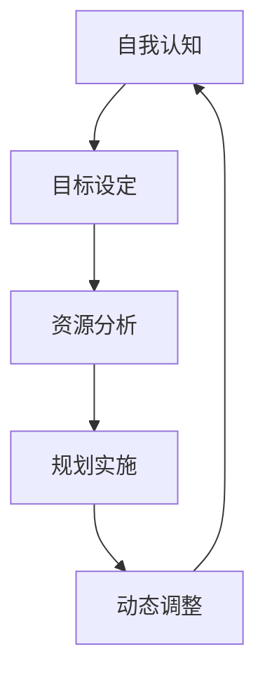

                 

### 设计背景介绍章节

#### 第1章：背景介绍

##### 1.1 问题背景

**个人人生规划的重要性：** 在快速变化的时代背景下，个人人生规划的重要性愈发凸显。它不仅关系到个人的职业发展，还涉及到心理健康和生活质量的提升。科学的人生规划可以帮助个体明确目标，优化资源利用，提高幸福感。

**当前社会环境下的挑战与机遇：** 现代社会的发展带来了职业选择多样化、信息获取便捷化、社会竞争激烈化等特征。这些变化既为个人提供了更多的发展机遇，也带来了诸如职业焦虑、生活节奏加快等挑战。

**个人人生乐章的概念与意义：** 个人人生乐章是一种系统化的规划方法，旨在通过构建一个多维度、动态调整的个人发展蓝图，帮助个体实现人生目标。它不仅关注职业发展，还涵盖了身心健康、家庭关系、兴趣爱好等多个方面，具有较高的综合性、灵活性和前瞻性。

##### 1.2 问题描述

**个人人生规划的现状：** 目前，许多人在进行个人人生规划时，往往缺乏系统的指导，容易出现目标不明确、资源分配不合理、缺乏持续动力等问题。

**个人人生规划中存在的问题：** 一方面，传统的人生规划方法过于注重短期目标和物质成就，忽视了个人内在需求和生活质量的提升。另一方面，缺乏灵活性和动态调整机制，难以适应快速变化的外部环境。

**个人人生规划的目标与需求：** 个人人生规划的目标是帮助个体实现自我价值，提升生活质量和幸福感。需求包括：明确个人目标、优化资源分配、提升自我认知和适应能力。

##### 1.3 问题解决

**个人人生规划的方法：** 个人人生乐章采用了一种综合性的规划方法，通过多维度分析、目标设定、资源优化和动态调整，帮助个体制定和实现个人发展规划。

**个人人生乐章的构建过程：** 构建个人人生乐章的过程可以分为五个步骤：自我认知、目标设定、资源分析、规划实施和动态调整。

**个人人生乐章的特点与价值：** 个人人生乐章的特点在于其综合性、灵活性和前瞻性。价值在于能够帮助个体实现人生目标，提升生活质量和幸福感。

##### 1.4 边界与外延

**个人人生乐章的适用范围：** 个人人生乐章适用于任何年龄段和职业背景的个体，尤其适合那些希望进行深度自我探索、提升生活质量的人群。

**个人人生乐章与职业规划、心理健康等的关系：** 个人人生乐章不仅涵盖了职业规划，还关注心理健康和生活质量的提升。它通过多维度分析，帮助个体在职业、生活和个人成长等方面取得平衡。

**个人人生乐章与家庭教育、社会教育等的关系：** 个人人生乐章不仅适用于个体，还可以应用于家庭教育和社会教育。通过引导家庭和学校关注个体发展，有助于培养具有全面素质和社会责任感的下一代。

### 设计核心概念与联系章节

#### 第2章：核心概念与联系

##### 2.1 个人人生乐章的核心概念

**个人人生乐章的定义：** 个人人生乐章是一种综合性的个人发展规划方法，通过多维度分析、目标设定、资源优化和动态调整，帮助个体实现人生目标。

**个人人生乐章的基本要素：** 个人人生乐章的基本要素包括：自我认知、目标设定、资源分析、规划实施和动态调整。

**个人人生乐章与人生目标、价值观的关系：** 个人人生乐章旨在帮助个体明确人生目标，并确保这些目标与个人的价值观相一致。它通过引导个体进行自我反思和价值观澄清，帮助个体建立明确的人生方向。

##### 2.2 个人人生乐章的属性特征对比

**传统人生规划与个人人生乐章的对比：** 传统人生规划侧重于短期目标和物质成就，缺乏灵活性和动态调整机制。个人人生乐章则更加关注长期目标、内在需求和综合素质提升。

**个人人生乐章与职业规划的对比：** 职业规划通常关注职业发展和职场竞争力，而个人人生乐章则更加全面，涵盖了职业、生活、个人成长等多个方面。

**个人人生乐章与心理健康管理的对比：** 心理健康管理侧重于解决心理问题，提升心理素质。个人人生乐章则通过多维度分析，帮助个体在职业、生活、个人成长等方面取得平衡，从而提升整体心理健康水平。

##### 2.3 个人人生乐章的ER实体关系图

**ER实体关系图的构建：** 个人人生乐章的ER实体关系图用于描述其基本要素之间的关联关系。图中的实体包括：自我认知、目标设定、资源分析、规划实施和动态调整。

**ER实体关系图中的主要实体：** 主要实体包括：自我认知（SC）、目标设定（SD）、资源分析（RA）、规划实施（PI）和动态调整（DA）。

**ER实体关系图中的主要关系：** 主要关系包括：SC → SD、SD → RA、RA → PI、PI → DA 和 DA → SC，表示各要素之间的驱动和反馈关系。

```mermaid
erDiagram
SC ||--|{ SD }||-> RA
RA ||--|{ PI }||-> DA
DA ||--|{ SC }||<- SD
```

### 设计算法原理讲解章节

#### 第3章：个人人生乐章的算法原理

##### 3.1 个人人生乐章的算法概述

**个人人生乐章算法的目标：** 个人人生乐章算法的目标是通过多维度分析、目标设定、资源优化和动态调整，帮助个体实现人生目标。

**个人人生乐章算法的基本流程：** 个人人生乐章算法的基本流程包括：自我认知、目标设定、资源分析、规划实施和动态调整。

**个人人生乐章算法的关键技术：** 个人人生乐章算法的关键技术包括：自我认知模型、目标设定模型、资源分析模型、规划实施模型和动态调整模型。

##### 3.2 算法原理详细讲解

**算法原理的数学模型：** 个人人生乐章算法的数学模型主要包括以下几个部分：

1. **自我认知模型：** 通过分析个体的兴趣、性格、价值观等方面，构建自我认知模型。
2. **目标设定模型：** 根据自我认知模型，设定与个人价值观一致的人生目标。
3. **资源分析模型：** 分析个体所拥有的资源，包括时间、金钱、人脉等。
4. **规划实施模型：** 根据目标设定和资源分析，制定具体的行动计划。
5. **动态调整模型：** 根据实际执行情况，对规划进行动态调整。

以下是算法原理的数学模型：

$$
\text{目标函数} = f(\text{自我认知模型}, \text{资源分析模型}, \text{规划实施模型}, \text{动态调整模型})
$$

**算法原理的流程图：**



**算法原理的举例说明：**

**例子1：构建个人人生乐章的步骤**

1. **自我认知：** 通过分析兴趣爱好、性格特点等，确定个人优势和发展方向。
2. **目标设定：** 根据自我认知结果，设定与个人价值观一致的人生目标。
3. **资源分析：** 分析当前拥有的时间、金钱、人脉等资源。
4. **规划实施：** 制定具体的行动计划，如提升技能、拓展人脉等。
5. **动态调整：** 根据执行情况，对规划进行调整，确保目标的实现。

**例子2：如何调整个人人生乐章中的元素**

1. **识别问题：** 发现当前规划与目标之间存在差距。
2. **分析原因：** 分析导致差距的原因，如资源不足、目标设定不合理等。
3. **调整规划：** 根据原因，对规划进行调整，如增加资源投入、调整目标设定等。
4. **跟踪效果：** 对调整后的规划进行跟踪，评估效果，确保目标的实现。

### 设计系统分析与架构设计方案章节

#### 第4章：系统分析与架构设计方案

##### 4.1 问题场景介绍

**个人人生乐章应用场景：** 个人人生乐章适用于个人发展规划、职业生涯规划、生活规划等多个场景。用户可以通过系统进行自我认知、目标设定、资源分析、规划实施和动态调整，实现个人目标。

**个人人生乐章的目标用户：** 个人人生乐章的目标用户包括广大青年人群、职场人士、创业者等，他们希望通过系统化方法实现个人目标，提升生活质量。

**个人人生乐章的应用价值：** 个人人生乐章的应用价值在于帮助用户明确目标、优化资源、提升自我认知和适应能力，从而实现人生价值。

##### 4.2 项目介绍

**个人人生乐章项目概述：** 个人人生乐章项目是一个综合性的个人发展规划系统，旨在帮助用户进行自我认知、目标设定、资源分析、规划实施和动态调整。

**项目目标与需求分析：** 项目目标是构建一个简单易用、功能全面的个人发展规划系统，满足用户在自我认知、目标设定、资源分析、规划实施和动态调整等方面的需求。

**项目开发环境：** 项目开发环境包括Python、Django、HTML、CSS、JavaScript等，采用前后端分离的开发模式。

##### 4.3 系统功能设计

**领域模型类图：**

```mermaid
classDiagram
ClassDomain <<class>> {
    +String name
    +List<Goal> goals
    +List<Resource> resources
    +List<Action> actions
}
ClassGoal <<class>> {
    +String title
    +String description
    +Boolean completed
}
ClassResource <<class>> {
    +String type
    +String description
}
ClassAction <<class>> {
    +String title
    +String description
    +Date due_date
}
Domain <--* ClassDomain : has
Goal <--* ClassGoal : has
Resource <--* ClassResource : has
Action <--* ClassAction : has
```

**系统功能模块：** 系统功能模块包括自我认知模块、目标设定模块、资源分析模块、规划实施模块和动态调整模块。

###### 4.4 系统架构设计

**系统架构概述：** 系统采用分层架构设计，包括表示层、业务逻辑层和数据层。

**系统架构图：**

```mermaid
sequenceDiagram
    User -->|发起请求| System
    System -->|处理请求| Service
    Service -->|查询数据| Database
    Database -->|返回数据| Service
    Service -->|处理数据| User
```

**系统架构设计的关键点：** 系统架构设计的关键点包括模块化设计、高性能、高可扩展性、安全性等。

##### 4.5 系统接口设计

**系统接口概述：** 系统接口设计包括API接口设计、Web端接口设计、移动端接口设计等。

**系统接口设计细节：** 系统接口设计细节包括接口规范、参数传递、返回结果等。

**系统接口的安全性：** 系统接口的安全性设计包括身份认证、权限控制、数据加密等。

##### 4.6 系统交互序列图

**系统交互概述：** 系统交互包括用户请求、系统处理、数据查询、数据处理等环节。

**系统交互序列图：**

```mermaid
sequenceDiagram
    User -->|发起请求| System
    System -->|处理请求| Service
    Service -->|查询数据| Database
    Database -->|返回数据| Service
    Service -->|处理数据| User
```

### 设计项目实战章节

#### 第5章：项目实战

##### 5.1 环境安装

**开发环境的搭建：** 在开发环境搭建阶段，需要安装Python、Django、数据库等工具。以下是一个简单的安装步骤：

1. 安装Python：访问Python官网下载Python安装包，按照安装向导进行安装。
2. 安装Django：打开命令行窗口，执行命令`pip install django`进行安装。
3. 安装数据库：根据项目需求选择合适的数据库（如MySQL、PostgreSQL等），并按照数据库官方文档进行安装。

**开发工具的安装与配置：** 开发工具的安装与配置包括代码编辑器、版本控制系统等。以下是一个简单的配置步骤：

1. 安装代码编辑器：如Visual Studio Code、Sublime Text等。
2. 配置版本控制系统：如Git，通过命令`git init`初始化仓库，并添加远程仓库地址。
3. 配置Django开发环境：在代码编辑器中创建一个Django项目，按照官方文档进行配置。

**环境配置的注意事项：** 在环境配置过程中，需要注意以下几点：

- 确保各组件版本兼容。
- 配置好环境变量，便于后续开发。
- 定期更新系统和软件，保持环境稳定。

##### 5.2 系统核心实现

**核心模块的功能实现：** 核心模块包括自我认知模块、目标设定模块、资源分析模块、规划实施模块和动态调整模块。以下是一个简单的实现步骤：

1. **自我认知模块：** 收集用户兴趣、性格、价值观等信息，构建自我认知模型。
2. **目标设定模块：** 根据自我认知模型，设定与个人价值观一致的人生目标。
3. **资源分析模块：** 分析用户所拥有的资源，包括时间、金钱、人脉等。
4. **规划实施模块：** 制定具体的行动计划，如提升技能、拓展人脉等。
5. **动态调整模块：** 根据执行情况，对规划进行调整，确保目标的实现。

**核心算法的代码实现：**

```python
# 自我认知模块
def self_cognition(user_interests, user_character, user_values):
    # 分析用户兴趣、性格、价值观等信息
    # 返回自我认知结果
    pass

# 目标设定模块
def goal_setting(self_cognition_result, user_values):
    # 根据自我认知结果，设定与个人价值观一致的人生目标
    # 返回目标列表
    pass

# 资源分析模块
def resource_analysis(user_resources):
    # 分析用户所拥有的资源
    # 返回资源列表
    pass

# 规划实施模块
def planning_implementation(goals, resources):
    # 制定具体的行动计划
    # 返回行动计划列表
    pass

# 动态调整模块
def dynamic_adjustment(planning_status, goals, resources):
    # 根据执行情况，对规划进行调整
    # 返回调整后的规划
    pass
```

**系统核心实现的难点与优化：** 系统核心实现的难点在于如何有效地分析用户信息和设定目标。以下是一些建议：

- **优化算法模型：** 采用更先进的算法模型，如机器学习模型，提升自我认知和目标设定的准确性。
- **提高用户体验：** 通过简洁直观的界面设计，提升用户的操作体验。
- **加强数据安全：** 保障用户数据的安全性，防止数据泄露。

##### 5.3 代码应用解读与分析

**代码的应用场景：** 代码应用于个人人生乐章系统，帮助用户进行自我认知、目标设定、资源分析、规划实施和动态调整。

**代码的功能解读：** 代码主要实现以下功能：

- **自我认知模块：** 收集用户兴趣、性格、价值观等信息，构建自我认知模型。
- **目标设定模块：** 根据自我认知模型，设定与个人价值观一致的人生目标。
- **资源分析模块：** 分析用户所拥有的资源，包括时间、金钱、人脉等。
- **规划实施模块：** 制定具体的行动计划，如提升技能、拓展人脉等。
- **动态调整模块：** 根据执行情况，对规划进行调整，确保目标的实现。

**代码的分析与优化：** 代码的分析与优化主要包括以下几个方面：

- **优化算法模型：** 引入更先进的算法模型，提升系统的准确性和效率。
- **代码重构：** 对现有代码进行重构，提高代码的可读性和可维护性。
- **性能优化：** 优化数据库查询、缓存策略等，提高系统的响应速度。

##### 5.4 实际案例分析与详细讲解

**案例概述：** 假设有一个用户，他希望通过个人人生乐章系统进行职业规划。以下是他的案例：

1. **自我认知：** 用户通过系统分析自己的兴趣、性格、价值观等，确定自己的职业方向。
2. **目标设定：** 用户设定了明确的职业目标，如成为某个领域的专家。
3. **资源分析：** 用户分析了当前所拥有的资源，包括时间、金钱、人脉等。
4. **规划实施：** 用户制定了具体的行动计划，如参加培训、拓展人脉等。
5. **动态调整：** 用户根据执行情况，对规划进行调整，确保目标的实现。

**案例分析：** 通过对案例的分析，可以看出个人人生乐章系统在用户职业规划过程中发挥了重要作用。以下是对案例的详细分析：

- **自我认知：** 用户通过系统分析自己的兴趣、性格、价值观等，明确了自己的职业方向，为后续的职业规划奠定了基础。
- **目标设定：** 用户设定了明确的职业目标，有助于激励自己不断努力，实现职业理想。
- **资源分析：** 用户分析了当前所拥有的资源，为制定具体的行动计划提供了依据。
- **规划实施：** 用户制定了具体的行动计划，有助于将目标转化为实际成果。
- **动态调整：** 用户根据执行情况，对规划进行调整，确保目标的实现，提高了规划的适应性和灵活性。

**详细讲解剖析：** 对案例进行详细讲解和剖析，有助于深入了解个人人生乐章系统的工作原理和应用价值。以下是对案例的详细讲解：

- **自我认知模块：** 系统通过收集用户的兴趣、性格、价值观等信息，构建自我认知模型。这个模型可以帮助用户明确自己的职业方向，为后续的职业规划提供依据。
- **目标设定模块：** 系统根据自我认知模型，设定与用户价值观一致的职业目标。这个目标有助于激励用户不断努力，实现职业理想。
- **资源分析模块：** 系统分析用户所拥有的资源，包括时间、金钱、人脉等。这些资源为用户制定具体的行动计划提供了依据。
- **规划实施模块：** 系统帮助用户制定具体的行动计划，如参加培训、拓展人脉等。这些行动计划有助于将目标转化为实际成果。
- **动态调整模块：** 系统根据用户执行情况，对规划进行调整，确保目标的实现。这个模块提高了规划的适应性和灵活性，有助于用户更好地应对变化。

通过以上分析，可以看出个人人生乐章系统在用户职业规划过程中发挥了重要作用。它不仅帮助用户明确职业方向，设定职业目标，分析资源，制定行动计划，还根据执行情况进行动态调整，确保目标的实现。这不仅提高了用户的职业规划效果，还增强了用户的自信心和幸福感。

##### 5.5 项目小结

**项目总结：** 个人人生乐章项目通过自我认知、目标设定、资源分析、规划实施和动态调整等模块，帮助用户进行职业规划，实现人生目标。项目实现了以下成果：

- **明确用户职业方向：** 通过自我认知模块，帮助用户明确职业方向，为职业规划提供依据。
- **设定明确目标：** 通过目标设定模块，帮助用户设定与价值观一致的职业目标，激励用户努力实现。
- **分析资源：** 通过资源分析模块，帮助用户分析所拥有的资源，为制定行动计划提供依据。
- **制定行动计划：** 通过规划实施模块，帮助用户制定具体的行动计划，将目标转化为实际成果。
- **动态调整规划：** 通过动态调整模块，根据用户执行情况，对规划进行调整，确保目标的实现。

**项目中的收获与反思：** 在项目开发过程中，团队收获了以下经验：

- **重视用户需求：** 在项目开发过程中，始终关注用户需求，确保项目能够满足用户实际需求。
- **优化用户体验：** 注重用户体验，通过简洁直观的界面设计，提高用户的操作体验。
- **持续迭代优化：** 项目在开发过程中，不断进行迭代优化，确保项目的稳定性和扩展性。

**项目拓展与改进方向：** 未来，项目可以从以下几个方面进行拓展和改进：

- **引入更多数据分析技术：** 结合大数据分析技术，提升自我认知和目标设定的准确性。
- **增加社交功能：** 集成社交功能，促进用户之间的互动和交流，提升项目的社交价值。
- **拓展应用场景：** 进一步拓展项目的应用场景，如生活规划、家庭规划等，满足更多用户的需求。

### 设计最佳实践 tips、小结、注意事项、拓展阅读等内容章节

#### 第6章：最佳实践与总结

##### 6.1 最佳实践 tips

**自我认知：** 通过定期进行自我反思和评估，深入了解自己的兴趣、性格和价值观，为后续的目标设定提供依据。

**目标设定：** 设定明确、可量化、可实现的目标，确保目标与个人的价值观和长期规划相一致。

**资源分析：** 定期评估和更新自己的资源，包括时间、金钱和人脉，确保资源能够支持目标的实现。

**规划实施：** 制定详细的行动计划，明确每个阶段的任务和时间节点，确保规划能够按计划执行。

**动态调整：** 根据执行情况进行及时调整，确保规划能够适应变化，实现最佳效果。

##### 6.2 小结

本文通过系统地介绍个人人生乐章的概念、原理、系统架构和实战应用，帮助读者了解如何通过个人人生乐章实现人生目标。个人人生乐章作为一种综合性的规划方法，不仅关注职业发展，还涵盖了身心健康、家庭关系、兴趣爱好等多个方面，具有较高的实用性和前瞻性。

##### 6.3 注意事项

**数据安全：** 在使用个人人生乐章系统时，要注意保护个人隐私和数据安全，避免数据泄露。

**持续更新：** 定期更新个人人生乐章中的信息和规划，确保其与实际情况保持一致。

**适应变化：** 在执行规划过程中，要灵活应对外部环境的变化，及时调整规划。

##### 6.4 拓展阅读

**相关书籍推荐：**

- 《人生策略：如何制定并实现你的目标》
- 《高效能人士的七个习惯》
- 《异类：不一样的成功启示录》

**相关网站推荐：**

- 个人发展网站，如：成长会、知乎专栏
- 职业规划网站，如：领英、职梦

**相关技术文章推荐：**

- 《大数据分析在个人人生规划中的应用》
- 《人工智能与个人发展规划》
- 《机器学习在职业规划中的运用》

通过阅读这些书籍和文章，读者可以进一步了解个人人生乐章的相关知识和技术，提升个人发展规划的能力。

### 总结与展望

本文系统地介绍了个人人生乐章的概念、原理、系统架构和实战应用，旨在帮助读者了解如何通过个人人生乐章实现人生目标。个人人生乐章作为一种综合性的规划方法，不仅关注职业发展，还涵盖了身心健康、家庭关系、兴趣爱好等多个方面，具有较高的实用性和前瞻性。

在未来的研究和实践中，我们可以进一步探索个人人生乐章在更多领域的应用，如家庭教育、社会教育等。同时，结合大数据分析、人工智能等先进技术，提升个人人生乐章的准确性和智能化水平。我们相信，通过不断地创新和优化，个人人生乐章将为更多个体带来幸福和成功。

让我们携手努力，创作生命的独特旋律，谱写个人人生的精彩乐章！

