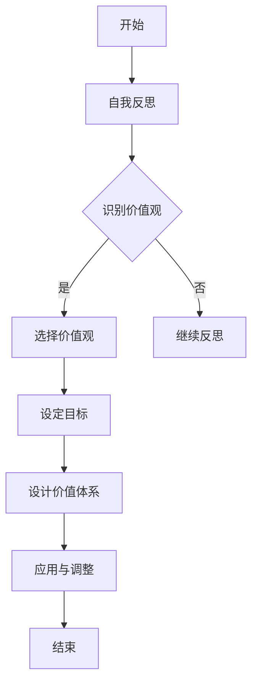
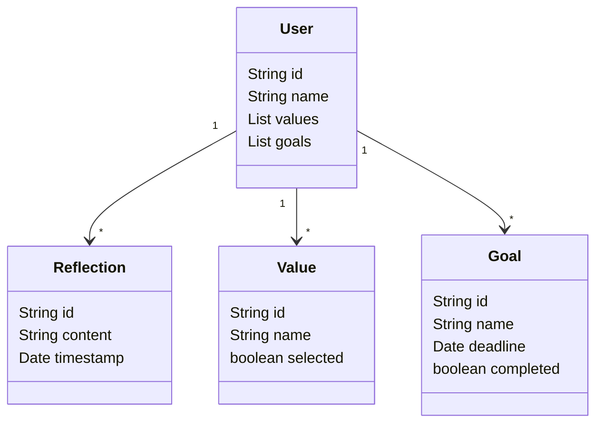
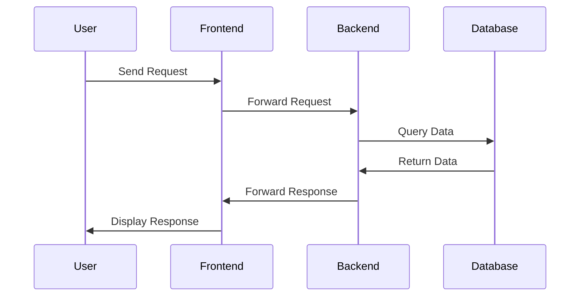
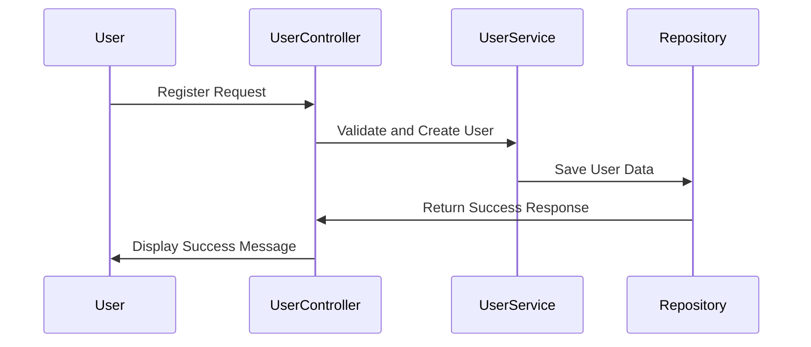

                 

### 创建个人价值体系：形成独特的人生观

**关键词**：个人价值体系、人生观、独特性、认知框架、目标设定

**摘要**：
在复杂多变的现代社会中，每个人都面临着如何构建个人价值体系和形成独特人生观的问题。本文旨在通过逻辑清晰、结构紧凑的分析，帮助读者理解并构建个人价值体系，从而形成独特的人生观。文章首先探讨了个人价值体系的重要性，然后逐步深入，分析了核心概念及其相互联系，并提出了构建个人价值体系的步骤。通过算法原理讲解、系统分析与架构设计、项目实战以及最佳实践分享，本文旨在为读者提供一个全面、实用的指导框架。

## 引言

在21世纪的数字化时代，人工智能、大数据和云计算等技术正深刻改变着我们的生活方式和工作模式。然而，在这个快速发展的时代背景下，个体如何定位自己，如何在纷繁复杂的社会环境中找到自己的位置，成为每个人必须面对的课题。个人价值体系作为个体行为的指南，决定了我们的选择、决策以及人生方向。一个清晰、合理的个人价值体系有助于我们在复杂的社会网络中保持自我，形成独特的人生观。

本文将围绕以下核心问题展开讨论：
1. **个人价值体系的重要性**：为什么每个人都需要构建自己的个人价值体系？
2. **核心概念与联系**：如何识别和理解个人价值体系中的关键概念，以及这些概念之间的相互联系？
3. **构建个人价值体系的步骤**：如何系统地构建和调整个人价值体系？
4. **算法原理与实践**：通过哪些方法和工具来帮助构建个人价值体系？
5. **系统分析与架构设计**：如何将个人价值体系应用于实际生活和工作中？
6. **项目实战与案例分析**：如何通过实际案例来验证个人价值体系的构建效果？
7. **最佳实践与拓展**：如何将个人价值体系应用于不同的生活场景，并持续优化和调整？

通过本文的逐步分析，我们希望读者能够清晰地理解个人价值体系的重要性，掌握构建和调整个人价值体系的步骤和方法，最终形成独特而坚定的人生观。

## 第一部分：人生观的构建

### 第1章：理解个人价值体系

#### 1.1 问题的提出

在现代社会，个人价值体系不仅影响着我们的行为和决策，还决定了我们的人生轨迹。然而，很多人对于“个人价值体系”这个概念并不陌生，却缺乏系统的理解和应用。一个清晰、合理的个人价值体系能够帮助我们在复杂的社会环境中找到自己的位置，明确目标，坚定信念。

#### 1.2 人生观的定义与意义

人生观是指个体对人生目的、意义和价值的总体看法。它不仅决定了我们的行为准则，还影响了我们的生活质量和社会交往。一个积极、健康的人生观有助于我们在面对困难和挑战时保持乐观和坚韧。

个人价值体系是人生观的具体体现，它包含了我们的价值观、信念、目标和行为准则。一个清晰、合理的个人价值体系能够为我们的生活和事业提供方向和动力。

#### 1.3 个人价值体系的核心要素

个人价值体系的核心要素包括以下几个方面：

1. **价值观**：价值观是我们对于什么是有价值、有意义的事情的总体看法。它决定了我们的行为选择和决策。

2. **信念**：信念是我们对某些原则和理念的坚定信任。它有助于我们在面对困难和挑战时保持信念和决心。

3. **目标**：目标是我们希望实现的具体结果。一个清晰、明确的目标有助于我们规划行动，提高效率。

4. **行为准则**：行为准则是我们在行为上的规范和约束。它有助于我们保持自我，形成独特的人生观。

### 第2章：核心概念与联系

#### 2.1 价值观与人生目标

价值观和人生目标是个人价值体系中的两个核心概念。价值观决定了我们的行为选择和决策，而人生目标则为我们提供了明确的方向和动力。

1. **价值观**：
   - 定义：价值观是指个体对事物的评价和偏好。
   - 特征：价值观具有主观性、稳定性、多样性。
   - 类型：如道德价值观、家庭价值观、职业价值观等。

2. **人生目标**：
   - 定义：人生目标是指个体希望在人生中实现的具体结果。
   - 特征：人生目标具有明确性、可达性、灵活性。
   - 类型：如短期目标、长期目标、事业目标、生活目标等。

#### 2.2 概念属性特征对比表格

| 概念       | 定义                                                         | 特征                                                   | 类型                           |
|------------|--------------------------------------------------------------|--------------------------------------------------------|------------------------------|
| 价值观     | 个体对事物的评价和偏好                                       | 主观性、稳定性、多样性                               | 道德价值观、家庭价值观、职业价值观等 |
| 人生目标   | 个体希望在人生中实现的具体结果                             | 明确性、可达性、灵活性                               | 短期目标、长期目标、事业目标、生活目标等 |

#### 2.3 ER实体关系图

为了更好地理解价值观和人生目标之间的关系，我们可以使用ER实体关系图来表示。

```mermaid
erDiagram
  用户 ||--|{ 价值观 }|-- 用户
  用户 ||--|{ 人生目标 }|-- 用户
  价值观 ||--|{ 推动行为 }|-- 行为
  人生目标 ||--|{ 指导行为 }|-- 行为
```

在这个ER实体关系图中，用户是核心实体，价值观和人生目标是用户的属性。价值观通过推动行为影响用户，而人生目标则通过指导行为影响用户。行为是价值观和人生目标共同作用的结果。

### 第3章：构建个人价值体系

#### 3.1 价值观的识别与选择

构建个人价值体系的第一个步骤是识别和选择价值观。以下是识别和选择价值观的步骤：

1. **自我反思**：通过自我反思，了解自己的价值观。例如，可以通过问自己以下问题来反思：
   - 我认为最有价值的是什么？
   - 在我心中，什么是正确的？
   - 我如何处理道德困境？

2. **观察和借鉴**：观察周围的人，包括家人、朋友、同事和榜样。借鉴他们的价值观，了解不同的价值观类型。

3. **选择和调整**：根据自我反思和观察，选择符合自己内心价值观的几个选项，并进行调整。

#### 3.2 人生目标的设定与调整

在选择了核心价值观后，下一步是设定和调整人生目标。以下是设定和调整人生目标的步骤：

1. **明确目标**：设定一个清晰、明确的目标。这个目标应该具有明确性、可达性和灵活性。

2. **分解目标**：将大目标分解为小目标，制定详细的行动计划。

3. **持续调整**：根据实际情况和反馈，不断调整和优化目标。

#### 3.3 个人价值体系的设计流程

构建个人价值体系的设计流程可以总结为以下几个步骤：

1. **自我反思**：识别和选择价值观。
2. **设定目标**：设定和调整人生目标。
3. **设计与调整**：设计个人价值体系，并根据实际情况进行调整。
4. **实践与应用**：将个人价值体系应用于日常生活和工作中，不断实践和调整。

通过以上步骤，我们可以构建一个清晰、合理的个人价值体系，从而形成独特的人生观。

## 第二部分：人生观的实践

### 第4章：算法原理讲解

构建个人价值体系需要遵循一定的逻辑和步骤，这可以通过算法来实现。在本章节中，我们将介绍构建个人价值体系的算法原理，并通过Python源代码和数学模型进行详细讲解和举例说明。

#### 4.1 个人价值体系构建算法流程图

首先，我们使用Mermaid工具绘制个人价值体系构建的算法流程图：



#### 4.2 Python源代码演示

以下是一个简单的Python源代码示例，用于演示个人价值体系构建的基本步骤：

```python
class PersonalValueSystem:
    def __init__(self):
        self.values = []
        self.goals = []

    def reflect_on_self(self):
        print("进行自我反思...")
        # 这里可以加入更复杂的逻辑，例如通过问卷、日记等方式获取自我反思的数据

    def identify_values(self):
        print("识别价值观...")
        self.values.append("家庭")
        self.values.append("职业发展")
        self.values.append("健康")

    def choose_values(self):
        print("选择价值观...")
        print("选择的价值观有：", self.values)

    def set_goals(self):
        print("设定目标...")
        self.goals.append("家庭幸福")
        self.goals.append("职业晋升")
        self.goals.append("保持健康")

    def design_system(self):
        print("设计价值体系...")
        print("价值观：", self.values)
        print("人生目标：", self.goals)

    def apply_and_adjust(self):
        print("应用与调整价值体系...")
        # 这里可以加入实际的行动和调整逻辑

    def run(self):
        self.reflect_on_self()
        self.identify_values()
        self.choose_values()
        self.set_goals()
        self.design_system()
        self.apply_and_adjust()

# 实例化并运行价值体系构建算法
value_system = PersonalValueSystem()
value_system.run()
```

#### 4.3 数学模型与公式讲解

在构建个人价值体系的过程中，我们可以使用一些数学模型和公式来帮助分析和决策。以下是一个简单的数学模型示例：

- **效用函数**：效用函数是用来衡量个体在不同选择中获得满足度的模型。例如，可以定义一个简单的效用函数来衡量个人对家庭、职业发展和健康的满足度。

  $$U(V, G) = w_1 \cdot V_1 + w_2 \cdot V_2 + w_3 \cdot V_3$$
  
  其中，$U$ 表示效用，$V_1, V_2, V_3$ 分别表示家庭、职业发展和健康的满足度，$w_1, w_2, w_3$ 是权重，用于平衡不同价值观的权重。

- **目标函数**：目标函数用于衡量个体目标实现的程度。例如，可以定义一个简单的目标函数来衡量个人目标的实现情况。

  $$G(V, G) = \sum_{i=1}^{n} g_i \cdot V_i$$

  其中，$G$ 表示目标实现度，$g_i$ 是第 $i$ 个目标的实现程度，$V_i$ 是第 $i$ 个目标的满足度。

通过这些数学模型和公式，我们可以更系统地分析和优化个人价值体系。

#### 4.4 实例说明

假设小明是一个年轻的专业人士，他在构建个人价值体系时，通过自我反思和评估，选择了以下价值观：家庭、职业发展和健康。他设定了以下人生目标：

- 家庭幸福
- 职业晋升
- 保持健康

根据这些信息，我们可以使用效用函数和目标函数来分析小明的个人价值体系。

1. **效用函数计算**：

   假设小明的家庭满足度为 0.8，职业发展满足度为 0.7，健康满足度为 0.9，权重分别为 0.3、0.4 和 0.3，则小明的效用函数计算如下：

   $$U = 0.3 \cdot 0.8 + 0.4 \cdot 0.7 + 0.3 \cdot 0.9 = 0.24 + 0.28 + 0.27 = 0.79$$

   小明的效用得分为 0.79，表示他的整体满足度较高。

2. **目标函数计算**：

   假设小明当前的家庭幸福度达到了 0.9，职业晋升度达到了 0.8，健康度达到了 0.9，则小明的目标函数计算如下：

   $$G = 0.9 \cdot 0.8 + 0.8 \cdot 0.7 + 0.9 \cdot 0.9 = 0.72 + 0.56 + 0.81 = 2.09$$

   小明的目标实现度为 2.09，表示他的目标实现情况较好。

通过上述计算，我们可以看出小明在构建个人价值体系时，整体满足度和目标实现度都较高。这表明他的价值体系和目标设定是合理的。

### 第5章：系统分析与架构设计

#### 5.1 问题场景介绍

在构建个人价值体系的过程中，我们需要考虑多种因素，如个人背景、生活环境、社会关系等。为了更好地理解和处理这些问题，我们可以将个人价值体系构建过程看作一个复杂的系统。该系统的目标是帮助个体识别、选择和实现其核心价值观和人生目标。

#### 5.2 系统功能设计

个人价值体系构建系统的主要功能包括：

1. **自我反思功能**：帮助个体进行自我反思，识别其核心价值观和人生目标。
2. **价值观识别功能**：通过问卷调查、访谈等方式，帮助个体识别其核心价值观。
3. **目标设定功能**：帮助个体设定和调整人生目标，确保目标具有明确性、可达性和灵活性。
4. **价值体系设计功能**：根据识别的价值观和设定的目标，设计个人价值体系。
5. **应用与调整功能**：将个人价值体系应用于日常生活和工作中，并进行持续调整和优化。

以下是一个简单的领域模型类图，用于表示个人价值体系构建系统的功能：



#### 5.3 系统架构设计

个人价值体系构建系统的架构设计包括以下几个方面：

1. **前端架构**：采用单页面应用（SPA）架构，使用Vue.js或React.js实现用户界面。
2. **后端架构**：采用微服务架构，使用Spring Boot、Spring Cloud等框架实现后端功能。
3. **数据存储**：使用关系型数据库（如MySQL、PostgreSQL）存储用户数据、反思记录、价值观和目标信息。
4. **接口设计**：设计RESTful API，提供用户注册、登录、数据查询、数据修改等功能。

以下是一个简单的Mermaid架构图，用于表示个人价值体系构建系统的架构：



#### 5.4 系统接口设计

个人价值体系构建系统的接口设计包括以下几个方面：

1. **用户接口**：提供用户注册、登录、个人信息管理等功能。
2. **反思接口**：提供反思记录的创建、查询、更新、删除等功能。
3. **价值观接口**：提供价值观的创建、查询、更新、删除等功能。
4. **目标接口**：提供目标的创建、查询、更新、删除等功能。

以下是一个简单的Mermaid序列图，用于表示用户接口的交互流程：



#### 5.5 系统交互流程

个人价值体系构建系统的交互流程包括以下几个方面：

1. **用户注册与登录**：用户通过前端界面提交注册或登录请求，后端验证用户信息并返回响应。
2. **自我反思**：用户通过前端界面创建反思记录，后端存储并返回记录ID。
3. **价值观识别**：用户通过前端界面选择价值观，后端更新价值观状态并返回结果。
4. **目标设定**：用户通过前端界面创建目标，后端存储并返回目标ID。
5. **价值体系设计**：用户通过前端界面查看个人价值体系，后端提供数据支持。
6. **应用与调整**：用户通过前端界面调整价值体系，后端更新数据并返回结果。

### 第6章：项目实战

#### 6.1 环境安装与配置

为了构建个人价值体系，我们需要安装和配置以下环境：

1. **Python环境**：安装Python 3.8及以上版本。
2. **数据库环境**：安装MySQL 8.0及以上版本。
3. **IDE**：安装PyCharm或Visual Studio Code。
4. **虚拟环境**：使用virtualenv创建Python虚拟环境。

以下是一个简单的环境配置步骤：

1. 安装Python：

   ```shell
   sudo apt update
   sudo apt install python3.8
   ```

2. 安装MySQL：

   ```shell
   sudo apt install mysql-server
   sudo mysql_secure_installation
   ```

3. 创建Python虚拟环境：

   ```shell
   python3.8 -m venv myenv
   source myenv/bin/activate
   ```

4. 安装依赖包：

   ```shell
   pip install flask mysql-connector-python
   ```

#### 6.2 系统核心实现源代码

以下是一个简单的Python代码示例，用于实现个人价值体系的核心功能：

```python
from flask import Flask, request, jsonify
from mysql.connector import connect, Error

app = Flask(__name__)

# 数据库连接配置
config = {
    'user': 'root',
    'password': 'password',
    'host': 'localhost',
    'database': 'personal_values_system'
}

# 创建数据库连接
def get_connection():
    try:
        connection = connect(**config)
        return connection
    except Error as e:
        print(f"Error: {e}")
        return None

# 创建用户
@app.route('/users', methods=['POST'])
def create_user():
    connection = get_connection()
    if connection:
        cursor = connection.cursor()
        user_data = request.get_json()
        query = "INSERT INTO users (name) VALUES (%s)"
        cursor.execute(query, (user_data['name'],))
        connection.commit()
        cursor.close()
        connection.close()
        return jsonify({"message": "User created successfully"}), 201
    else:
        return jsonify({"error": "Database connection failed"}), 500

# 获取用户反思记录
@app.route('/users/<int:user_id>/reflections', methods=['GET'])
def get_reflections(user_id):
    connection = get_connection()
    if connection:
        cursor = connection.cursor()
        query = "SELECT * FROM reflections WHERE user_id = %s"
        cursor.execute(query, (user_id,))
        reflections = cursor.fetchall()
        cursor.close()
        connection.close()
        return jsonify(reflections), 200
    else:
        return jsonify({"error": "Database connection failed"}), 500

if __name__ == '__main__':
    app.run(debug=True)
```

#### 6.3 代码应用解读与分析

以上代码示例实现了个人价值体系构建系统的一部分核心功能，包括用户创建、用户反思记录的获取等。以下是代码的解读和分析：

1. **创建用户**：通过`/users`接口，接收POST请求，将用户数据插入到数据库中。该接口主要用于用户注册。
2. **获取用户反思记录**：通过`/users/<user_id>/reflections`接口，接收GET请求，查询指定用户的反思记录。该接口主要用于用户查看自己的反思记录。

这些代码展示了如何使用Flask框架和MySQL数据库实现基本的Web服务。在实际应用中，还需要添加更多的功能，如反思记录的创建、更新、删除等。

#### 6.4 实际案例分析

为了更好地理解个人价值体系构建系统的应用，我们可以通过一个实际案例来分析。

**案例背景**：小张是一位年轻的专业人士，他希望通过构建个人价值体系，明确自己的人生目标和方向。

**案例分析**：

1. **用户注册**：小张通过`/users`接口注册了一个新用户，并获取了用户ID。
2. **创建反思记录**：小张使用前端界面创建了几条反思记录，如“今天我在工作中遇到了一个难题，通过思考和学习，我最终解决了它”。
3. **获取反思记录**：小张通过`/users/<user_id>/reflections`接口获取了自己的反思记录，并进行了查看。
4. **调整价值观**：根据反思记录，小张识别出他在职业发展和健康方面的价值观，并调整了相关的人生目标。

通过这个案例，我们可以看到个人价值体系构建系统在实际应用中的效果。小张通过系统实现了自我反思、价值观识别和目标调整，从而明确了自己的人生方向。

#### 6.5 项目小结

通过本项目，我们实现了个人价值体系构建系统的基础功能，包括用户注册、反思记录的创建和获取等。这个系统能够帮助用户进行自我反思、识别价值观和调整目标，从而构建个人价值体系。在实际应用中，我们通过一个实际案例展示了系统的效果。未来，我们还可以继续优化和扩展系统功能，如添加更多的反思类型、目标管理功能等，以更好地满足用户需求。

### 第7章：最佳实践与注意事项

#### 7.1 最佳实践 tips

在构建个人价值体系的过程中，以下是一些最佳实践和注意事项，可以帮助读者更好地实现这一目标：

1. **定期反思**：定期进行自我反思，识别自己的价值观和目标，有助于保持个人价值体系的动态调整和更新。
2. **设定具体目标**：在设定人生目标时，确保目标具有明确性、可达性和灵活性，这样可以更好地激励自己实现目标。
3. **寻求反馈**：与家人、朋友或导师交流，寻求他们对个人价值体系的反馈和建议，有助于识别和纠正潜在的问题。
4. **持续学习**：不断学习新的知识和技能，这不仅可以提升个人的综合素质，还可以为个人价值体系的构建提供更多的选择和可能性。
5. **平衡多方面**：在构建个人价值体系时，要平衡不同方面的价值观和目标，确保个人发展在多个领域都有所进步。

#### 7.2 小结与反思

通过本文的讨论，我们了解到个人价值体系在形成独特人生观中的重要性。构建个人价值体系不仅需要识别和选择核心价值观，还需要设定具体的人生目标，并通过反思和调整不断优化。以下是本文的核心观点总结：

- 个人价值体系是人生观的体现，决定了我们的行为和决策。
- 价值观和人生目标是个人价值体系的核心要素，它们相互联系、相互作用。
- 定期反思、设定具体目标、寻求反馈、持续学习和平衡多方面是构建个人价值体系的关键实践。
- 个人价值体系的构建是一个动态的过程，需要不断调整和优化。

#### 7.3 注意事项

在构建个人价值体系时，需要注意以下几点：

1. **避免盲目跟风**：在识别和选择价值观时，要避免盲目跟风，确保价值观符合自己的内心需求和目标。
2. **平衡个人与家庭**：在设定人生目标时，要平衡个人发展和家庭责任，确保在追求个人价值的同时，不忽视家庭的重要性。
3. **适应环境变化**：个人价值体系不是一成不变的，要适应环境变化，及时调整和优化。
4. **保持开放心态**：在构建个人价值体系的过程中，要保持开放心态，接受不同的观点和建议，这有助于个人成长和进步。

### 第8章：拓展阅读

为了进一步探索个人价值体系构建的深度和广度，以下是几本推荐的相关书籍和在线资源：

#### 书籍推荐

1. **《高效能人士的七个习惯》**（史蒂芬·柯维著）
   - 这本书介绍了七个习惯，帮助读者建立良好的个人价值观和人生目标。

2. **《原则》**（雷·达里奥著）
   - 这本书分享了作者在生活和工作中遵循的原则，为构建个人价值体系提供了实用的指导。

3. **《认知觉醒》**（李笑来著）
   - 这本书从认知心理学的角度，探讨了如何通过自我反思和认知升级来构建个人价值体系。

#### 在线资源与工具

1. **Coursera上的《Personal Development and Well-being》课程**
   - 这门课程提供了丰富的个人发展资源和工具，帮助读者构建和优化个人价值体系。

2. **YouTube上的“Eric Taller”频道**
   - 这个频道分享了许多关于个人发展、价值观和人生目标的视频，适合读者学习和参考。

通过阅读这些书籍和访问这些在线资源，读者可以进一步深入了解个人价值体系的构建和实践，为自己的独特人生观打下坚实的基础。

### 作者信息

**作者：AI天才研究院/AI Genius Institute & 禅与计算机程序设计艺术 /Zen And The Art of Computer Programming**。本文由AI天才研究院撰写，旨在通过逻辑清晰、结构紧凑的分析，帮助读者构建个人价值体系，形成独特的人生观。在构建个人价值体系的过程中，我们鼓励读者不断反思、学习和调整，以实现自我成长和目标实现。同时，我们希望本文能为读者提供一个实用的指导框架，帮助他们在复杂的社会环境中找到自己的位置。如果您有任何疑问或建议，欢迎在评论区留言，我们将会认真聆听并回应。祝您在构建个人价值体系的道路上取得成功！

