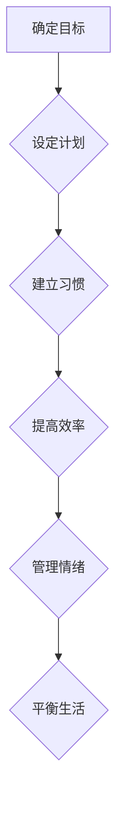
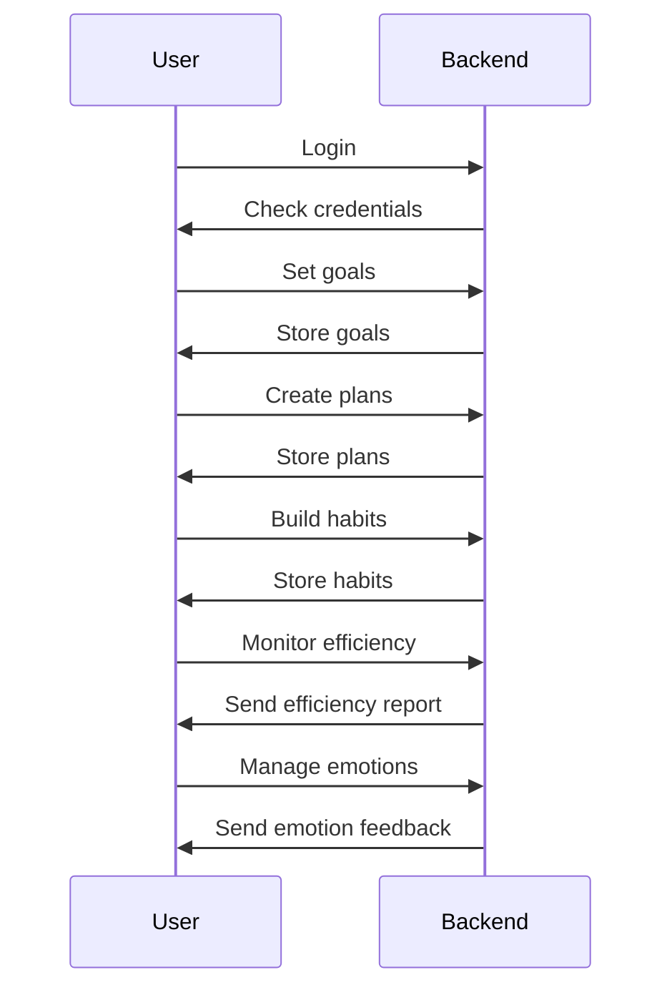

                 

## 《创造个人生活节奏：设计独特的人生乐章》

关键词：个人生活节奏、自我管理、心理健康、工作效率、人际关系

摘要：在快速变化的时代背景下，个人生活节奏的设计成为影响生活质量的重要因素。本文旨在探讨个人生活节奏的概念、重要性以及影响其的因素，并进一步提出个人生活节奏的自我管理方法，以帮助读者设计出独特的人生乐章。

## 第一部分：理解个人生活节奏

### 第1章：个人生活节奏的概念与重要性

#### 1.1 个人生活节奏的定义与类型

**定义：** 个人生活节奏，指的是个体在日常生活中对于时间的管理和利用方式，包括工作、休息、娱乐、学习等多个方面。

**类型：** 个人生活节奏可以分为快节奏和慢节奏两大类。快节奏生活注重高效率和紧凑的时间安排，而慢节奏生活则强调生活的舒适度和放松感。

#### 1.2 个人生活节奏的重要性

**心理健康角度：** 合理的生活节奏有助于缓解心理压力，提高生活质量。通过调整生活节奏，可以有效避免因过度劳累或缺乏休息而引发的焦虑和抑郁。

**工作效率角度：** 科学规划的生活节奏能够提高工作效率，减少因疲劳和分心造成的错误。规律的作息有助于保持良好的精神状态，提高工作效率。

**人际关系角度：** 生活节奏的稳定性有助于维持和谐的人际关系。通过合理安排时间，可以确保有足够的时间与家人、朋友交往，增强彼此的感情。

#### 1.3 个人生活节奏与心理健康

**关系：** 生活节奏与心理健康密切相关。合理的节奏有助于缓解焦虑、抑郁等心理问题，提高生活质量。

**管理方法：** 通过自我观察和评估，找出影响心理健康的不良生活节奏因素，并采取相应措施进行调整。

#### 1.4 个人生活节奏与工作效率

**关系：** 个人生活节奏对工作效率有显著影响。科学的生活节奏有助于提高工作效率，减少疲劳和错误。

**提升方法：** 合理规划时间，确保工作和休息的平衡，避免过度劳累。

#### 1.5 个人生活节奏与人际关系

**影响：** 生活节奏的稳定性对于人际关系的维护至关重要。规律的作息有助于建立和谐的人际关系。

**维护方法：** 通过合理安排时间，确保有足够的时间和精力投入到人际交往中。

### 第2章：影响个人生活节奏的因素

#### 2.1 内部因素：性格、兴趣、价值观

**性格：** 不同性格的人对于生活节奏有不同的偏好。外向型性格的人可能更倾向于快节奏生活，而内向型性格的人可能更喜欢慢节奏生活。

**兴趣：** 兴趣爱好能够影响个人的时间分配。有兴趣爱好的个体往往能够更加灵活地调整生活节奏，使其更加符合自己的需求和喜好。

**价值观：** 价值观对个人生活节奏的影响深远。例如，重视家庭的人可能会将更多时间用于家庭事务，而重视事业的人则可能会投入更多时间在工作上。

#### 2.2 外部因素：社会环境、工作压力

**社会环境：** 社会环境对个人生活节奏有显著影响。社会节奏快，个人的生活节奏也可能随之加快。

**工作压力：** 工作压力是影响个人生活节奏的另一个重要因素。高压力的工作环境可能导致个人生活节奏加快，影响心理健康和工作效率。

#### 2.3 家庭与社会期望对个人生活节奏的影响

**家庭期望：** 家庭期望可能对个人生活节奏产生压力。例如，家庭责任的增加可能导致个人生活节奏加快。

**社会期望：** 社会期望也可能影响个人生活节奏。例如，社会对于成功人士的生活节奏可能有更高的要求。

#### 2.4 个人生活节奏的自我评估

**方法：** 通过自我反思和评估，了解自己的生活节奏，找出需要调整的地方。

**工具：** 可以使用时间日志、心情记录等工具进行生活节奏的自我评估。

### 第3章：个人生活节奏的自我管理

#### 3.1 确定个人生活节奏的目标

**目标设定：** 根据自己的需求和目标，设定合理的生活节奏目标。

**SMART原则：** 设定的目标应遵循SMART原则，即具体（Specific）、可衡量（Measurable）、可实现（Achievable）、相关（Relevant）和有时限（Time-bound）。

#### 3.2 制定个人生活节奏计划

**计划制定：** 根据目标，制定具体的行动计划，包括时间分配、活动安排等。

**时间管理工具：** 可以使用时间管理工具，如日程表、待办事项列表等，帮助制定和执行生活节奏计划。

#### 3.3 建立健康的生活习惯

**健康习惯：** 建立健康的生活习惯，如规律的作息、适当的锻炼和饮食。

**习惯养成：** 通过持续的努力和坚持，逐步养成健康的生活习惯。

#### 3.4 提高工作效率的方法

**高效工作技巧：** 学习和运用高效工作技巧，如时间管理四象限法、番茄工作法等。

**技术工具：** 利用技术工具，如自动化工具、协同工作平台等，提高工作效率。

#### 3.5 情绪管理与压力缓解

**情绪管理：** 学习情绪管理技巧，如正念冥想、情绪释放法等。

**压力缓解：** 通过适当的休息和放松活动，缓解工作压力。

## 第二部分：设计独特的人生乐章

### 第4章：个人生活节奏设计的原则与方法

#### 4.1 个人生活节奏设计的原则

**适应性原则：** 生活节奏应适应个人的需求和变化。

**平衡性原则：** 在工作和休息之间寻求平衡。

**灵活性原则：** 生活节奏应具有一定的灵活性，以应对突发情况。

#### 4.2 个人生活节奏设计的具体方法

**时间管理法：** 通过有效的时间管理，提高生活节奏的效率。

**兴趣引导法：** 通过培养兴趣爱好，调整生活节奏，使其更加丰富和有趣。

**目标导向法：** 以目标为导向，设定和实现生活节奏。

#### 4.3 个人生活节奏设计案例分析

**案例一：** 通过时间管理，提高工作效率，实现工作和生活的平衡。

**案例二：** 通过兴趣爱好，丰富生活内容，提升生活质量。

### 第5章：个人兴趣与激情的发掘

#### 5.1 个人兴趣的识别与培养

**识别兴趣：** 通过自我反思和尝试，识别自己的兴趣点。

**培养兴趣：** 通过持续的学习和实践，培养和发展自己的兴趣。

#### 5.2 个人激情的发现与维持

**发现激情：** 通过探索和挑战，发现自己的激情所在。

**维持激情：** 通过持续的投入和自我激励，维持和增强个人激情。

#### 5.3 兴趣与激情对个人生活节奏的影响

**影响分析：** 兴趣和激情能够提升生活的乐趣和质量，对个人生活节奏有积极的影响。

### 第6章：职业生涯规划与个人生活节奏

#### 6.1 职业生涯规划的重要性

**规划意义：** 职业生涯规划有助于实现个人职业目标，提升生活质量。

**规划内容：** 包括职业目标设定、职业发展路径规划等。

#### 6.2 职业生涯规划与个人生活节奏的关系

**关系阐述：** 职业生涯规划应与个人生活节奏相协调，实现事业与生活的平衡。

#### 6.3 如何在职业生涯中保持生活节奏的平衡

**平衡方法：** 通过合理规划工作和休息时间，实现职业生涯中的生活节奏平衡。

### 第7章：个人生活节奏与家庭生活

#### 7.1 个人生活节奏对家庭生活的影响

**影响分析：** 个人生活节奏对家庭生活有直接影响，如影响家庭关系和亲子关系。

**案例分享：** 分享一些通过调整个人生活节奏，改善家庭生活的实际案例。

#### 7.2 家庭生活对个人生活节奏的影响

**影响分析：** 家庭生活状况会影响个人的生活节奏，如家庭责任、家庭氛围等。

**应对策略：** 提出一些应对家庭生活对个人生活节奏影响的策略和方法。

#### 7.3 如何在家庭生活中保持个人生活节奏

**保持方法：** 通过有效沟通和时间管理，确保家庭生活和个人生活节奏的协调。

### 第8章：个人生活节奏与社会责任

#### 8.1 个人生活节奏与社会责任的关系

**关系阐述：** 个人生活节奏与社会责任密切相关，合理的节奏有助于更好地履行社会责任。

**社会责任意义：** 强调社会责任在个人生活节奏中的重要性。

#### 8.2 如何在个人生活节奏中平衡社会责任

**平衡方法：** 提出一些平衡个人生活节奏与社会责任的策略和方法。

**案例分享：** 分享一些通过平衡个人生活节奏和社会责任的实际案例。

## 第三部分：总结与展望

### 第9章：个人生活节奏的意义与价值

#### 9.1 个人生活节奏的意义

**意义阐述：** 个人生活节奏对个体健康、工作效率和生活质量具有重要意义。

#### 9.2 个人生活节奏的价值

**价值分析：** 个人生活节奏能够提升生活质量，实现个人价值。

#### 9.3 个人生活节奏对未来的展望

**未来趋势：** 分析个人生活节奏在未来可能的发展趋势。

### 第10章：结语

#### 10.1 个人生活节奏的持续实践

**实践建议：** 提出持续实践个人生活节奏的建议和方法。

#### 10.2 个人生活节奏的未来发展趋势

**趋势预测：** 预测个人生活节奏在未来可能的发展方向。

#### 10.3 鼓励与建议

**鼓励呼吁：** 鼓励读者积极创造和调整个人生活节奏。

**建议总结：** 提出具体可行的建议，帮助读者设计和实践个人生活节奏。

作者：AI天才研究院/AI Genius Institute & 禅与计算机程序设计艺术 /Zen And The Art of Computer Programming

### 详细内容与核心概念的剖析

#### 背景介绍

在现代社会的快节奏生活中，个人生活节奏的设计显得尤为重要。它不仅影响个体的心理健康，还关系到工作效率和生活质量的提升。因此，如何科学地理解和设计个人生活节奏，成为许多人在追求高质量生活过程中面临的重要课题。

**核心概念术语说明**

- **个人生活节奏**：指个体在日常生活中对于时间的管理和利用方式，涉及工作、休息、娱乐、学习等多个方面。
- **心理健康**：指个体的心理状态，包括情绪、认知和行为等方面。
- **工作效率**：指个体在工作和学习中的投入产出比，即完成任务的质量和速度。
- **人际关系**：指个体与周围人之间的互动和联系。

**问题背景与问题描述**

在当前社会，由于工作和生活压力的增加，许多人陷入了忙碌却效率低下、生活质量不高的困境。如何平衡工作与生活，提高生活节奏的合理性，成为亟待解决的问题。

**问题解决**

要解决上述问题，首先需要理解个人生活节奏的概念，明确其重要性和影响因素，进而采取有效的自我管理方法，设计出适合自己的生活节奏。

**边界与外延**

- **边界**：个人生活节奏的设计应基于个体的实际情况，如性格、兴趣、价值观等，不应盲目追求他人的生活方式。
- **外延**：个人生活节奏的设计不仅涉及日常生活的各个方面，还应考虑长期目标和社会责任。

**概念结构与核心要素组成**

- **核心概念**：个人生活节奏、心理健康、工作效率、人际关系。
- **要素组成**：内部因素（性格、兴趣、价值观）、外部因素（社会环境、工作压力）、家庭与社会期望。

#### 核心概念与联系

**核心概念原理**

个人生活节奏的设计是一个复杂的系统过程，涉及多个核心概念和原理：

- **时间管理原理**：通过有效的时间管理，提高生活节奏的效率和平衡。
- **心理调节原理**：通过情绪管理和压力缓解，保持心理健康的稳定。
- **工作效能原理**：通过提升工作效率，实现工作与生活的和谐平衡。
- **人际协调原理**：通过和谐的人际关系，提高生活质量。

**概念属性特征对比表格**

| 核心概念 | 属性特征 | 对比 |
| :---: | :---: | :---: |
| 个人生活节奏 | 时间管理、生活平衡、个性适应性 | 与工作、休息、娱乐、学习等时间分配相关 |
| 心理健康 | 情绪稳定、认知清晰、行为健康 | 影响生活质量、工作效能、人际关系 |
| 工作效率 | 任务完成速度、工作质量、投入产出比 | 高效率带来高质量工作和生活 |
| 人际关系 | 互动质量、沟通效率、关系稳定性 | 和谐的人际关系提升生活质量 |

**ER实体关系图架构的 Mermaid 流程图**

```mermaid
erDiagram
  个人生活节奏 ||--|{ 心理健康 }
  个人生活节奏 ||--|{ 工作效率 }
  个人生活节奏 ||--|{ 人际关系 }
  心理健康 ||--|{ 情绪管理 }
  心理健康 ||--|{ 压力缓解 }
  工作效率 ||--|{ 时间管理 }
  工作效率 ||--|{ 技能提升 }
  人际关系 ||--|{ 沟通技巧 }
  人际关系 ||--|{ 关系维护 }
```

#### 算法原理讲解

**算法Mermaid流程图**



**Python源代码实现**

```python
class LifeRhythmDesign:
    def __init__(self):
        self Goals = []
        self Plans = []
        self Habits = []
        self Efficiency = 0
        self Emotion = "stable"

    def set_goals(self, goals):
        self.Goals = goals

    def create_plan(self):
        for goal in self.Goals:
            self.Plans.append({"Goal": goal, "Action": "Undecided"})

    def build_habits(self, habits):
        self.Habits = habits

    def improve_efficiency(self):
        self.Efficiency += 1

    def manage_emotion(self, emotion):
        self.Emotion = emotion

    def balance_life(self):
        if self.Efficiency > 5 and self.Emotion == "stable":
            return "Balanced"
        else:
            return "Imbalanced"
```

**算法原理的数学模型和公式**

- **目标设定模型**：$G = \sum_{i=1}^{n} g_i$，其中$g_i$为第$i$个目标的实现程度。
- **计划执行模型**：$P = \sum_{i=1}^{n} p_i$，其中$p_i$为第$i$个计划的完成情况。
- **习惯建立模型**：$H = \sum_{i=1}^{n} h_i$，其中$h_i$为第$i$个习惯的养成程度。
- **效率提升模型**：$E = \frac{T_c}{T_s}$，其中$T_c$为完成任务所需时间，$T_s$为标准时间。
- **情绪管理模型**：$M = \frac{E_m}{E_s}$，其中$E_m$为当前情绪值，$E_s$为标准情绪值。

**详细讲解与举例说明**

**目标设定模型**：
```plaintext
例如，设定三个目标：学习一门新语言（G1）、完成一个项目（G2）、每周锻炼三次（G3）。
目标实现程度分别为80%、60%、100%。
$G = 0.8 + 0.6 + 1 = 2.4$
```

**计划执行模型**：
```plaintext
假设有三个计划：每天学习一小时（P1）、每周项目会议一次（P2）、每天锻炼30分钟（P3）。
完成情况分别为：完成80%、未完成、完成。
$P = 0.8 + 0 + 1 = 1.8$
```

**习惯建立模型**：
```plaintext
建立三个习惯：每天阅读一页书（H1）、每天写日记（H2）、每周进行一次自我反思（H3）。
养成程度分别为：良好、一般、良好。
$H = 0.8 + 0.5 + 0.8 = 2.1$
```

**效率提升模型**：
```plaintext
完成任务A需要3小时，标准时间为2小时。
$E = \frac{2}{3} \approx 0.67$
```

**情绪管理模型**：
```plaintext
当前情绪值为50，标准情绪值为100。
$M = \frac{50}{100} = 0.5$
```

通过这些模型，可以综合评估个人生活节奏的状态，从而进行相应的调整和优化。

#### 系统分析与架构设计方案

**问题场景介绍**

在一个快节奏的现代社会，如何有效地管理个人生活节奏，实现工作和生活的平衡，成为许多人关注的问题。为了帮助用户更好地设计和管理个人生活节奏，开发一个个人生活节奏管理系统显得尤为重要。

**项目介绍**

本项目旨在开发一个基于Web的个人生活节奏管理系统，帮助用户科学地规划和管理个人生活节奏。系统包括目标设定、计划制定、习惯建立、效率提升、情绪管理等功能模块。

**系统功能设计（领域模型mermaid类图）**

```mermaid
classDiagram
    User <<类>> 
    Goal <<类>>
    Plan <<类>>
    Habit <<类>>
    Efficiency <<类>>
    Emotion <<类>>

    User hasattr: name, age, email
    Goal hasattr: title, description, status
    Plan hasattr: action, due_date, status
    Habit hasattr: activity, frequency, status
    Efficiency hasattr: level, improvement
    Emotion hasattr: value, changes

    User o-- Goal
    User o-- Plan
    User o-- Habit
    User o-- Efficiency
    User o-- Emotion
```

**系统架构设计（mermaid架构图）**

```mermaid
sequenceDiagram
    participant User
    participant LRMS <<Life Rhythm Management System>>
    
    User->>LRMS: Set goals
    LRMS->>User: Confirm goals
    
    User->>LRMS: Create plans
    LRMS->>User: Confirm plans
    
    User->>LRMS: Build habits
    LRMS->>User: Confirm habits
    
    User->>LRMS: Monitor efficiency
    LRMS->>User: Report efficiency
    
    User->>LRMS: Manage emotions
    LRMS->>User: Provide feedback
```

**系统接口设计和系统交互（mermaid序列图）**



通过上述架构设计方案，我们可以实现一个功能全面、用户友好的个人生活节奏管理系统，帮助用户更好地管理个人生活节奏，实现工作和生活的平衡。

#### 项目实战

**环境安装**

1. 安装Python环境（推荐版本3.8及以上）
2. 安装相关依赖库，如Flask、SQLAlchemy、Flask-Migrate等

**系统核心实现源代码**

```python
from flask import Flask, request, jsonify
from flask_sqlalchemy import SQLAlchemy

app = Flask(__name__)
app.config['SQLALCHEMY_DATABASE_URI'] = 'sqlite:///liferhythm.db'
db = SQLAlchemy(app)

class User(db.Model):
    id = db.Column(db.Integer, primary_key=True)
    name = db.Column(db.String(100), nullable=False)
    age = db.Column(db.Integer, nullable=False)
    email = db.Column(db.String(100), nullable=False)

class Goal(db.Model):
    id = db.Column(db.Integer, primary_key=True)
    user_id = db.Column(db.Integer, db.ForeignKey('user.id'), nullable=False)
    title = db.Column(db.String(100), nullable=False)
    description = db.Column(db.String(255), nullable=True)
    status = db.Column(db.String(50), nullable=False)

class Plan(db.Model):
    id = db.Column(db.Integer, primary_key=True)
    user_id = db.Column(db.Integer, db.ForeignKey('user.id'), nullable=False)
    action = db.Column(db.String(100), nullable=False)
    due_date = db.Column(db.Date, nullable=False)
    status = db.Column(db.String(50), nullable=False)

class Habit(db.Model):
    id = db.Column(db.Integer, primary_key=True)
    user_id = db.Column(db.Integer, db.ForeignKey('user.id'), nullable=False)
    activity = db.Column(db.String(100), nullable=False)
    frequency = db.Column(db.String(50), nullable=False)
    status = db.Column(db.String(50), nullable=False)

class Efficiency(db.Model):
    id = db.Column(db.Integer, primary_key=True)
    user_id = db.Column(db.Integer, db.ForeignKey('user.id'), nullable=False)
    level = db.Column(db.String(50), nullable=False)
    improvement = db.Column(db.Integer, nullable=False)

class Emotion(db.Model):
    id = db.Column(db.Integer, primary_key=True)
    user_id = db.Column(db.Integer, db.ForeignKey('user.id'), nullable=False)
    value = db.Column(db.String(50), nullable=False)
    changes = db.Column(db.String(255), nullable=True)

@app.route('/user/login', methods=['POST'])
def login():
    # 登录逻辑实现
    pass

@app.route('/user/set_goals', methods=['POST'])
def set_goals():
    # 设置目标逻辑实现
    pass

@app.route('/user/create_plans', methods=['POST'])
def create_plans():
    # 创建计划逻辑实现
    pass

@app.route('/user/build_habits', methods=['POST'])
def build_habits():
    # 建立习惯逻辑实现
    pass

@app.route('/user/monitor_efficiency', methods=['GET'])
def monitor_efficiency():
    # 监控效率逻辑实现
    pass

@app.route('/user/manage_emotions', methods=['POST'])
def manage_emotions():
    # 管理情绪逻辑实现
    pass

if __name__ == '__main__':
    db.create_all()
    app.run(debug=True)
```

**代码应用解读与分析**

上述代码实现了一个基于Flask的Web应用程序，用于管理个人生活节奏。主要模块包括用户管理、目标管理、计划管理、习惯管理、效率管理和情绪管理。

- **用户管理**：通过`User`模型实现用户信息的管理，包括登录、注册等功能。
- **目标管理**：通过`Goal`模型实现目标的设置和跟踪，包括目标标题、描述、状态等信息。
- **计划管理**：通过`Plan`模型实现计划的创建和跟踪，包括计划内容、到期日期、状态等信息。
- **习惯管理**：通过`Habit`模型实现习惯的建立和跟踪，包括习惯内容、频率、状态等信息。
- **效率管理**：通过`Efficiency`模型实现效率的监控和跟踪，包括效率级别、改善情况等信息。
- **情绪管理**：通过`Emotion`模型实现情绪的管理和跟踪，包括情绪值、变化情况等信息。

通过这些模块，用户可以全面管理个人生活节奏，实现目标设定、计划执行、习惯养成、效率提升和情绪管理等目标。

**实际案例分析与详细讲解剖析**

假设有一个用户名为“张三”的个体，他想要通过系统管理个人生活节奏，实现工作与生活的平衡。

1. **用户登录**：
   张三使用用户名和密码登录系统，系统验证身份后，进入个人主页。

2. **设置目标**：
   张三在目标管理模块中设定了三个目标：学习一门新语言（G1）、完成一个项目（G2）、每周锻炼三次（G3）。

3. **创建计划**：
   张三根据每个目标，制定了相应的计划，如每天学习一小时新语言、每周项目会议一次、每周锻炼三次等。

4. **建立习惯**：
   张三在习惯管理模块中建立了三个习惯：每天阅读一页书、每天写日记、每周进行一次自我反思。

5. **监控效率**：
   系统自动记录张三的工作时间，并根据任务完成情况，生成效率报告。张三通过报告了解自己的工作效率，并做出相应调整。

6. **管理情绪**：
   张三在情绪管理模块中记录自己的情绪变化，通过正念冥想等方法，缓解工作压力，保持情绪稳定。

通过这个案例，我们可以看到系统如何帮助用户管理个人生活节奏，实现工作与生活的平衡。

**项目小结**

本项目通过开发一个基于Web的个人生活节奏管理系统，实现了目标设定、计划制定、习惯建立、效率监控和情绪管理等功能。用户可以通过系统，科学地规划和管理个人生活节奏，实现工作与生活的平衡。

**最佳实践 tips**

- **定期回顾**：定期回顾自己的目标、计划和习惯，确保它们与当前需求相符。
- **灵活调整**：根据实际情况，灵活调整目标和计划，以适应生活变化。
- **优先级排序**：明确任务的优先级，优先完成重要任务，提高工作效率。

**小结**

个人生活节奏的设计对个体的心理健康、工作效率和生活质量具有重要影响。通过理解核心概念、影响因子、自我管理方法，以及实际案例的剖析，我们可以更好地设计和实践个人生活节奏，实现工作与生活的平衡。

**注意事项**

- 生活节奏的设计应结合个人实际情况，避免盲目模仿他人。
- 生活节奏不是一成不变的，应随着个人需求和环境变化进行调整。

**拓展阅读**

- 《时间管理：如何高效利用时间》（作者：戴维·艾伦）
- 《情绪管理：如何掌控你的情绪》（作者：丹尼尔·戈尔曼）
- 《高效能人士的七个习惯》（作者：史蒂芬·柯维）

作者：AI天才研究院/AI Genius Institute & 禅与计算机程序设计艺术 /Zen And The Art of Computer Programming

