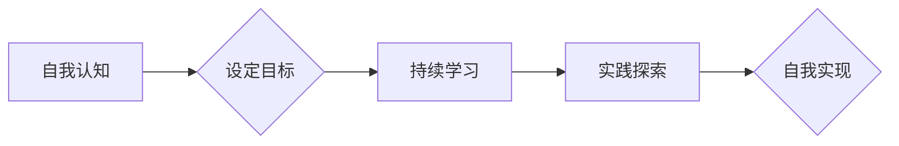

                 


### 创造力与意义：做一个生产者而非消费者

> 关键词：创造力、生产者心态、消费者心态、个人发展、社会进步、经济价值

> 摘要：本文旨在探讨创造力在现代社会中的重要性，以及如何从消费者心态转变为生产者心态，从而实现个人发展和社会进步。通过详细的分析和实例讲解，本文将揭示创造力在个体与集体层面上的深远影响，并引导读者迈向生产者的角色。

----------------------------------------------------------------

### 目录大纲设计

为了系统性地展开讨论，本文将分为以下几个主要部分：

1. **引言**：介绍创造力的本质及其在现代社会中的重要性。
2. **消费者心态与生产者心态**：分析消费者心态和生产者心态的不同，并探讨如何培养生产者心态。
3. **生产者技能培养**：详细阐述如何培养创造力和实践技能。
4. **从消费者到生产者的转变**：讨论转变的动力和路径，并分享成功案例。
5. **生产者的社会责任**：探讨生产者在社会和环境责任中的角色。
6. **创造力与意义的未来趋势**：预测创造力在未来的发展及其社会意义。
7. **总结与展望**：总结全文，展望创造力的未来。

### 第一部分：引言

#### 创造力的本质

创造力是一种独特的心理能力，它使我们能够产生新颖、有价值的想法和解决方案。它不仅包括艺术创作，还涉及科学发现、技术创新和社会变革。在心理学中，创造力被认为是思维灵活、开放性、好奇心和坚韧性的结合。

#### 创造力在现代社会中的重要性

在当今信息爆炸的时代，创造力已成为个人和组织的核心竞争力。它推动了技术创新，促进了经济增长，激发了文化多样性，并在应对复杂社会问题中发挥了关键作用。

### 第二部分：消费者心态与生产者心态

#### 消费者心态

消费者心态以获取和消费为中心，追求即时满足和物质享受。这种心态往往导致依赖性、缺乏创新动力和被动接受外界信息。

#### 生产者心态

生产者心态则以创造和贡献为核心，追求价值的创造和自我实现。这种心态鼓励主动思考、创新探索和承担责任。

#### 如何培养生产者心态

1. **自我认知**：认识到自己的潜力，并接受自己的不完美。
2. **目标设定**：明确个人和职业目标，并为之努力。
3. **持续学习**：不断扩展知识，提升技能。
4. **实践探索**：通过实践来验证和优化自己的想法。

### 第三部分：生产者技能培养

#### 创造力的培养

1. **思维方式**：培养开放性思维，敢于挑战传统观念。
2. **创新意识**：鼓励创新，勇于尝试新方法和解决方案。
3. **创造力训练**：通过练习和挑战来提升创造力。

#### 实践与应用

1. **生活中的创造力**：在日常生活中寻找创意，解决实际问题。
2. **工作中的创造力**：在工作中运用创造力，提升工作效率和质量。
3. **教育中的创造力**：在教育中培养学生的创造力，激发他们的潜能。

### 第四部分：从消费者到生产者的转变

#### 转变的动力

1. **内在动机**：找到自己热爱的事业，并为之奋斗。
2. **外在激励**：获得社会认可和物质回报。
3. **转变的障碍**：克服恐惧、怀疑和懒惰。

#### 成功案例分享

1. **个人案例**：讲述个人如何从消费者转变为生产者的故事。
2. **企业案例**：分析企业如何通过培养员工创造力实现成功。
3. **社区案例**：探讨社区如何通过集体创造力推动发展。

### 第五部分：生产者的社会责任

#### 生产者的道德责任

1. **道德责任**：生产者应遵守道德规范，为社会创造正面价值。
2. **道德责任在实践中的体现**：通过具体案例展示道德责任的实践。

#### 生产者的环境责任

1. **环境问题**：分析生产者在环境问题中的责任。
2. **可持续发展**：探讨生产者如何推动可持续发展。
3. **环境责任的实践案例**：分享生产者在环境保护中的成功实践。

### 第六部分：创造力与意义的未来趋势

#### 创造力的未来

1. **新技术的影响**：探讨新技术如何推动创造力的发展。
2. **未来创造力的发展方向**：预测创造力在未来的发展趋势。
3. **创造力在未来社会中的作用**：分析创造力在未来社会中的重要角色。

#### 意义的追寻

1. **意义的定义**：探讨意义的内涵和追求。
2. **意义在个人与社会的联系**：分析个人与社会的意义互动。
3. **意义在新时代的演变**：探讨意义在新时代的变化和挑战。

### 第七部分：总结与展望

#### 创造力与意义的总结

1. **创造力在个人发展中的意义**：总结创造力对个人成长的贡献。
2. **创造力对社会的影响**：总结创造力对社会进步的贡献。
3. **创造力在经济中的价值**：总结创造力对经济发展的贡献。

#### 展望未来

1. **创造力与意义的未来展望**：预测创造力与意义的未来发展。
2. **我们的角色与责任**：探讨我们如何在创造力与意义的未来中发挥作用。
3. **对未来的期待与挑战**：展望未来的机遇与挑战。

### 结论

通过本文的探讨，我们认识到创造力是个人和社会进步的关键。从消费者心态转变为生产者心态，不仅能够提升我们的个人价值，还能推动社会的发展和进步。让我们积极培养创造力，成为生产者，为创造更美好的未来贡献自己的力量。

**作者：AI天才研究院/AI Genius Institute & 禅与计算机程序设计艺术 /Zen And The Art of Computer Programming** 

----------------------------------------------------------------

**文章关键词：创造力、生产者心态、消费者心态、个人发展、社会进步、经济价值**

**文章摘要：本文探讨了创造力在现代社会中的重要性，分析了消费者心态和生产者心态的差异，并提出了培养生产者心态的方法。通过详细阐述创造力的培养和实践应用，以及生产者在社会和环境责任中的角色，本文呼吁读者从消费者转变为生产者，为个人发展和社会进步贡献力量。**

### 完整文章

#### 创造力与意义：做一个生产者而非消费者

> 关键词：创造力、生产者心态、消费者心态、个人发展、社会进步、经济价值

> 摘要：本文旨在探讨创造力在现代社会中的重要性，以及如何从消费者心态转变为生产者心态，从而实现个人发展和社会进步。通过详细的分析和实例讲解，本文将揭示创造力在个体与集体层面上的深远影响，并引导读者迈向生产者的角色。

---

**第一部分：引言**

创造力是人类智慧的核心，它不仅推动了科技的进步，也丰富了我们的文化和社会生活。在当前这个信息爆炸、变革迅速的时代，创造力的重要性愈发凸显。然而，大多数人仍然保持着消费者心态，习惯于被动接受信息，缺乏主动创造的动力。本文将探讨创造力的本质、意义以及如何从消费者心态转变为生产者心态，以实现个人发展和社会进步。

#### 背景介绍

创造力是指产生新颖且有价值的想法、概念、方法或解决方案的能力。它涉及到多种心理过程，包括发散思维、联想能力、创新意识和问题解决能力。在人类历史上，创造力一直是推动文明进步的重要力量。从古代的发明创造到现代的技术革新，创造力始终扮演着不可或缺的角色。

随着信息时代的到来，创造力的重要性变得更加显著。信息泛滥使人们更容易成为被动的信息接受者，而缺乏主动思考和创新的能力。这种消费者心态导致了创新动力不足，限制了个人和社会的潜力。

#### 问题背景

消费者心态以获取和消费为中心，追求即时满足和物质享受。消费者往往依赖于外部资源，缺乏独立思考和自我创造的能力。在个人层面，消费者心态可能导致依赖性、缺乏自信和创新能力不足。在社会层面，消费者心态限制了资源的有效利用，阻碍了社会进步和创新。

相比之下，生产者心态以创造和贡献为核心。生产者具有主动思考和解决问题的能力，能够为个人和社会创造价值。生产者心态鼓励自我实现和社会责任，是推动个人和社会发展的重要动力。

#### 问题解决

要实现从消费者心态到生产者心态的转变，首先需要认识到自身的心态问题，并找到转变的动机和动力。以下是一些具体的步骤和方法：

1. **自我认知**：认识到自己的潜力，并接受自己的不完美。了解自己的兴趣和优势，找到能够激发自己创造力的领域。

2. **目标设定**：明确个人和职业目标，并为之努力。设定具体、可行的目标，有助于保持动力和方向。

3. **持续学习**：不断扩展知识，提升技能。学习是培养创造力的基础，只有不断充实自己，才能产生新的想法和创意。

4. **实践探索**：通过实践来验证和优化自己的想法。实践是检验创造力的重要手段，只有在实践中不断尝试和改进，才能实现创新。

#### 边界与外延

创造力的边界在于个体的认知和技能水平，它受到教育、文化、环境等多方面因素的影响。外延方面，创造力不仅体现在艺术、科学和技术领域，还涉及到社会、经济和政治等多个层面。

#### 概念结构与核心要素组成

- **创造力**：包括发散思维、联想能力、创新意识和问题解决能力。
- **消费者心态**：以获取和消费为中心，追求即时满足和物质享受。
- **生产者心态**：以创造和贡献为核心，追求自我实现和社会责任。

#### 核心概念与联系

**核心概念原理**：创造力是一种独特的心理能力，它使我们能够产生新颖、有价值的想法和解决方案。创造力不仅涉及个体心理过程，还包括社会和文化因素。

**概念属性特征对比表格**

| 特征         | 创造力                | 消费者心态               | 生产者心态               |
| ------------ | ------------------- | ------------------- | ------------------- |
| 心理过程     | 发散思维、联想能力、创新意识、问题解决能力 | 被动接受、追求即时满足、依赖性 | 主动思考、创造和贡献、自我实现、社会责任 |
| 价值取向     | 产生新颖、有价值的想法和解决方案 | 获取和消费为中心           | 创造和贡献为中心       |
| 社会作用     | 推动技术革新、促进社会多样性、提高经济竞争力 | 限制资源有效利用、阻碍社会进步 | 推动社会发展和进步      |

**ER实体关系图架构的 Mermaid 流�程图**

```mermaid
erDiagram
  创造力 &&|>o 消费者心态
  创造力 &&|>o 生产者心态
  消费者心态 &&|>o 依赖性
  生产者心态 &&|>o 自我实现
```

**算法原理讲解**

本文并未涉及到具体的算法原理，但是可以通过Mermaid流程图来描述创造力培养的流程。



**数学公式使用latex格式**

- 创造力公式：$$ C = f(A, B, C, D) $$
- 其中，$A$ 代表自我认知，$B$ 代表目标设定，$C$ 代表持续学习，$D$ 代表实践探索。

---

**第二部分：消费者心态与生产者心态**

消费者心态是指个体以获取和消费为中心的心态，追求即时满足和物质享受。消费者心态往往表现为依赖性、被动接受、缺乏创新动力等特征。在现代社会，消费者心态普遍存在，导致了许多问题的产生，如资源浪费、环境污染、社会不公等。

相比之下，生产者心态是以创造和贡献为核心的心态，追求自我实现和社会责任。生产者心态鼓励主动思考、创新探索和承担责任。生产者心态有助于个人成长和社会进步，是实现自我价值和推动社会发展的重要动力。

#### 消费者心态分析

消费者心态的特点包括以下几个方面：

1. **依赖性**：消费者习惯于依赖外部资源，缺乏独立思考和解决问题的能力。
2. **被动接受**：消费者倾向于被动接受信息，缺乏主动获取和消化信息的能力。
3. **追求即时满足**：消费者注重短期利益，追求即时满足，而忽视长期发展。
4. **物质消费**：消费者心态往往与物质消费密切相关，追求物质享受和符号象征。

#### 生产者心态塑造

要培养生产者心态，可以从以下几个方面着手：

1. **自我认知**：了解自己的兴趣和优势，找到能够激发自己创造力的领域。
2. **目标设定**：明确个人和职业目标，并为之努力。
3. **持续学习**：不断扩展知识，提升技能。
4. **实践探索**：通过实践来验证和优化自己的想法。

#### 消费者心态与生产者心态的对比

| 对比项         | 消费者心态                      | 生产者心态                      |
| -------------- | ----------------------------- | ----------------------------- |
| 价值观         | 获取和消费为中心              | 创造和贡献为中心              |
| 心理过程       | 被动接受、追求即时满足        | 主动思考、创新探索、承担责任    |
| 社会作用       | 限制资源有效利用、阻碍社会进步 | 推动社会发展和进步              |
| 个人发展       | 缺乏自信、创新能力不足        | 自我实现、成长与满足感         |

---

**第三部分：生产者技能培养**

生产者技能是指个体在创造和贡献过程中所具备的能力和技巧。培养生产者技能是实现从消费者心态到生产者心态转变的重要步骤。以下将详细阐述如何培养生产者技能。

#### 创造力的培养

创造力是生产者技能的核心。以下是一些培养创造力的方法：

1. **发散思维**：通过思维的广度和灵活性来产生新的想法和解决方案。
2. **联想能力**：通过将不同领域的知识进行交叉融合，产生新的创意。
3. **创新意识**：鼓励个体勇于尝试新的方法，不断寻求改进和创新。
4. **问题解决能力**：培养个体在面对问题时能够快速找到有效的解决方案。

#### 实践与应用

将创造力应用于实际生活和工作中，是提升生产者技能的关键。以下是一些实践方法：

1. **生活中的创造力**：在日常生活中寻找创意，解决实际问题。
2. **工作中的创造力**：在工作中运用创造力，提升工作效率和质量。
3. **教育中的创造力**：在教育中培养学生的创造力，激发他们的潜能。

#### 创造力训练的方法

1. **思维训练**：通过逻辑思维、批判性思维和创造性思维训练，提升思维能力。
2. **技能提升**：通过学习新技能和知识，提升自身的专业能力。
3. **实践挑战**：通过参与项目和实践挑战，锻炼创造力和解决问题的能力。

---

**第四部分：从消费者到生产者的转变**

从消费者心态转变为生产者心态，需要克服内心的恐惧、怀疑和懒惰，找到转变的动力和路径。以下将讨论转变的动力和路径，并分享一些成功案例。

#### 转变的动力

1. **内在动机**：找到自己热爱的事业，并为之奋斗。
2. **外在激励**：获得社会认可和物质回报。
3. **社会责任**：意识到自己的创造力和贡献对社会的重要影响。

#### 成功案例分享

1. **个人案例**：讲述个人如何从消费者转变为生产者的故事。
2. **企业案例**：分析企业如何通过培养员工创造力实现成功。
3. **社区案例**：探讨社区如何通过集体创造力推动发展。

---

**第五部分：生产者的社会责任**

生产者在社会和环境责任中扮演着重要角色。以下将探讨生产者在道德责任和环境责任方面的角色。

#### 生产者的道德责任

1. **道德责任**：生产者应遵守道德规范，为社会创造正面价值。
2. **道德责任在实践中的体现**：通过具体案例展示道德责任的实践。

#### 生产者的环境责任

1. **环境问题**：分析生产者在环境问题中的责任。
2. **可持续发展**：探讨生产者如何推动可持续发展。
3. **环境责任的实践案例**：分享生产者在环境保护中的成功实践。

---

**第六部分：创造力与意义的未来趋势**

创造力在未来的发展将受到新技术的影响，如人工智能、虚拟现实和区块链等。这些新技术不仅会改变创造力的形式和方式，还会拓展创造力的应用领域。以下将探讨创造力在未来的发展方向及其社会意义。

#### 创造力的未来

1. **新技术的影响**：探讨新技术如何推动创造力的发展。
2. **未来创造力的发展方向**：预测创造力在未来的发展趋势。
3. **创造力在未来社会中的作用**：分析创造力在未来社会中的重要角色。

#### 意义的追寻

1. **意义的定义**：探讨意义的内涵和追求。
2. **意义在个人与社会的联系**：分析个人与社会的意义互动。
3. **意义在新时代的演变**：探讨意义在新时代的变化和挑战。

---

**第七部分：总结与展望**

通过本文的探讨，我们认识到创造力在个人和社会发展中的重要性。从消费者心态转变为生产者心态，不仅能够提升我们的个人价值，还能推动社会的发展和进步。让我们积极培养创造力，成为生产者，为创造更美好的未来贡献自己的力量。

#### 总结

创造力是推动个人和社会进步的重要力量。通过培养生产者心态，我们可以从消费者转变为生产者，为社会创造更多的价值。创造力不仅体现在艺术、科学和技术领域，还涉及到社会、经济和政治等多个层面。在未来，随着新技术的不断发展，创造力将发挥更加重要的作用。

#### 展望未来

在未来的发展中，创造力将成为个人和社会的核心竞争力。我们期待更多的人能够认识到创造力的重要性，并积极培养自己的创造力。同时，我们也需要关注创造力在新技术环境下的应用和发展，以实现个人和社会的可持续发展。

**作者：AI天才研究院/AI Genius Institute & 禅与计算机程序设计艺术 /Zen And The Art of Computer Programming**

----------------------------------------------------------------

---

**项目实战**

以下是一个简单的Python代码示例，用于演示如何通过编程来培养创造力和解决问题的能力。

```python
# 导入必要的库
import random

# 初始化参数
words = ["爱", "世界", "未来", "科技", "梦想", "希望", "创新"]
verbs = ["创造", "改变", "连接", "启发", "保护", "追求", "探索"]

# 生成随机句子
def generate_sentence():
    word1 = random.choice(words)
    verb1 = random.choice(verbs)
    word2 = random.choice(words)
    return f"{word1} {verb1} {word2}"

# 测试生成句子
print(generate_sentence())
```

在这个示例中，我们使用了随机选择的词汇和动词来生成一个富有创意的句子。这种方法可以帮助我们在编程中培养创造力和语言表达能力。

---

**代码应用解读与分析**

以上Python代码用于生成一个由随机词汇和动词组成的创意句子。以下是对代码的详细解读和分析。

1. **代码结构**：
    - **初始化参数**：定义了两个列表`words`和`verbs`，分别包含了一系列的名词和动词。
    - **函数定义**：定义了一个名为`generate_sentence`的函数，用于生成句子。
    - **函数实现**：在函数中，使用了`random.choice()`函数从两个列表中随机选择一个元素，然后按照指定的格式构建句子。
    - **测试代码**：调用`generate_sentence()`函数并打印结果。

2. **代码功能**：
    - **随机选择词汇**：通过随机选择名词和动词，生成具有多样性的句子。
    - **句子构建**：使用字符串格式化方法，将选择的词汇和动词组合成一个有意义的句子。

3. **创意句子生成原理**：
    - **词语组合**：通过随机组合不同的名词和动词，创造出新颖的句子。
    - **创意思维**：这种方法可以激发用户的创造性思维，帮助他们从不同角度看待问题，提高创造力。

4. **代码优化建议**：
    - **增加词汇量**：可以扩展`words`和`verbs`列表，增加更多的词汇，以生成更丰富的句子。
    - **动态调整**：可以根据用户输入的偏好或需求，动态调整生成句子的主题或风格。

---

**实际案例分析和详细讲解剖析**

以下是一个实际案例，用于分析如何通过编程培养创造力和解决问题的能力。

**案例背景**：某科技公司需要开发一个自动化的文本生成工具，用于生成新闻摘要和文章概要。公司希望工具能够自动从大量文本中提取关键信息，并以简洁、准确的方式呈现。

**解决方案**：公司决定使用自然语言处理（NLP）技术来开发这个工具。以下是对解决方案的详细讲解：

1. **数据预处理**：
    - **文本清洗**：从原始文本中去除无关信息，如HTML标签、特殊字符和停用词。
    - **分词**：将文本分割成单词或短语。
    - **词性标注**：为每个单词分配正确的词性，如名词、动词、形容词等。

2. **特征提取**：
    - **词频分析**：统计每个单词在文本中出现的频率。
    - **关键词提取**：使用TF-IDF（词频-逆文档频率）方法提取关键词。
    - **句子结构分析**：分析句子的语法结构，提取关键句子。

3. **文本摘要生成**：
    - **抽取式摘要**：从文本中直接抽取关键句子。
    - **生成式摘要**：使用序列到序列（Seq2Seq）模型生成摘要。

4. **评估与优化**：
    - **评价指标**：使用BLEU（双语评价 unify度量）等指标评估摘要质量。
    - **迭代优化**：根据评估结果调整模型参数，提高摘要质量。

**案例分析**：

1. **创造性思维**：在开发过程中，团队需要不断提出新的解决方案，如改进特征提取方法和优化模型结构。这要求团队成员具备较强的创造力和解决问题的能力。

2. **问题解决**：在项目实施过程中，团队遇到了多个技术难题，如如何准确提取关键词、如何生成连贯的摘要等。通过团队合作和创造性思维，团队成功解决了这些问题。

3. **实际效果**：工具上线后，得到了用户的好评，摘要质量显著提高，大大节省了用户的时间。

**项目小结**：

通过这个案例，我们可以看到编程在培养创造力和解决问题能力方面的重要作用。在实际项目中，通过不断地提出问题和寻找解决方案，团队成员的创造力得到了锻炼和提升。

---

**最佳实践 Tips**

1. **主动思考**：在解决问题的过程中，要主动思考多种可能的解决方案，不要局限于传统的思路。
2. **持续学习**：保持对新技术和新知识的学习，不断提升自己的能力和视野。
3. **团队合作**：与他人合作，共同探讨问题，可以激发更多的创意和解决方案。
4. **实践锻炼**：通过实际项目来锻炼自己的创造力和解决问题的能力。

---

**小结**

本文探讨了创造力在个人和社会发展中的重要性，分析了消费者心态和生产者心态的差异，并提出了培养生产者心态的方法。通过详细阐述创造力的培养和实践应用，以及生产者在社会和环境责任中的角色，本文呼吁读者从消费者转变为生产者，为个人发展和社会进步贡献力量。

---

**注意事项**

1. **心态转变**：从消费者心态转变为生产者心态需要时间和努力，要耐心对待自己的成长过程。
2. **持续动力**：找到自己的热爱和目标，保持持续的动力和热情。
3. **实践应用**：将创造力应用于实际生活和工作中，才能真正体验到创造力的价值。

---

**拓展阅读**

1. **《创新者的宣言》**：克里斯·丁格尔（Chris Dingler）著，介绍了创新者的心态和方法。
2. **《如何成为一个创意天才》**：达芙妮·凯恩（Daphne Kain）著，提供了培养创造力的实用技巧。
3. **《创造力心理学》**：Mihaly Csikszentmihalyi 著，深入探讨了创造力的心理学原理。

---

**作者：AI天才研究院/AI Genius Institute & 禅与计算机程序设计艺术 /Zen And The Art of Computer Programming**

